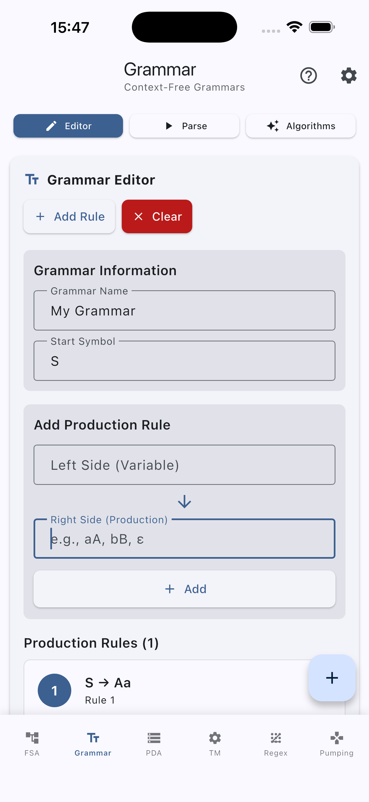

# JFlutter (Work in progress)

A modern, mobile-first Flutter application for learning formal language theory and automata

JFlutter is a port of the classic JFLAP educational tool, rebuilt from the ground up with Flutter for modern mobile devices. It provides an interactive, touch-optimized interface for creating, editing, and simulating finite automata, context-free grammars, and other formal language constructs.

<p align="center">
  
  
  
  
</p>

## Project Status

**Status:** Work in Progress

## Key Features

### Core Functionality
- **Interactive Automaton Creation** - Touch-optimized canvas for drawing states and transitions
- **Real-time Simulation** - Test strings against automata with step-by-step visualization
- **Algorithm Integration** - 13 core algorithms fully integrated with the UI
- **Mobile-First Design** - Optimized for smartphones and tablets
- **Modern UI/UX** - Material 3 design with dark/light theme support
- **Responsive Layout** - All screens adapt to different screen sizes

### Implemented Algorithms
- **NFA to DFA Conversion** - Convert non-deterministic to deterministic automata
- **DFA Minimization** - Minimize deterministic finite automata
- **Regex to NFA** - Convert regular expressions to automata
- **FA to Regex** - Convert automata to regular expressions
- **Automaton Simulation** - Real-time string testing and validation
- **Grammar Parsing** - Context-free grammar analysis
- **Pumping Lemma** - Interactive educational game
- **PDA Simulation** - Pushdown automata simulation
- **Turing Machine** - Single-tape Turing machine simulation

### Mobile Experience
- **Touch Gestures** - Pinch-to-zoom, pan, tap-to-add states
- **Responsive Layout** - Adapts to different screen sizes
- **Collapsible Panels** - Space-efficient mobile interface
- **Bottom Navigation** - Mobile-optimized navigation
- **Visual Feedback** - Real-time algorithm execution feedback
- **Overflow Prevention** - All UI elements handle small screens gracefully

### Performance & Optimization
- **Level-of-Detail Rendering** - Optimized canvas rendering for large automata
- **Viewport Culling** - Only renders visible elements for better performance
- **Trace Visualization** - Enhanced simulation trace rendering with step indicators
- **Memory Management** - Efficient state management and resource disposal
- **Responsive Canvas** - Smooth interactions at 60fps on mobile devices

### Enhanced Features
- **Unified Trace Management** - Seamless trace persistence across all simulator types
- **Comprehensive Diagnostics** - Detailed automaton validation with actionable suggestions
- **Import/Export Validation** - Robust validation for JFLAP XML, JSON, and SVG formats
- **Error Handling** - User-friendly error messages with technical diagnostics
- **Cross-Format Compatibility** - Ensures data integrity across different file formats
- **GraphView Canvas** - Native Flutter graph editor with synchronized Riverpod state and highlight channels

### Examples v1 - Offline Examples Library

**Complete offline educational library** with curated examples for automata theory learning:

#### **Finite Automata (DFA/NFA)**
- `afd_ends_with_a.json` - DFA accepting strings ending with 'a'
- `afd_binary_divisible_by_3.json` - DFA for binary numbers divisible by 3
- `afd_parity_AB.json` - DFA for even/odd A-B patterns
- `afn_lambda_a_or_ab.json` - NFA with ε-transitions for 'a' or 'ab'

#### **Context-Free Grammars (CFG)**
- `glc_palindrome.json` - Grammar generating palindromes
- `glc_balanced_parentheses.json` - Grammar for balanced parentheses

#### **Pushdown Automata (PDA)**
- `apda_palindrome.json` - PDA accepting palindromes

#### **Turing Machines (TM)**
- `tm_binary_to_unary.json` - TM converting binary to unary representation

Assets are bundled in `jflutter_js/examples/` via `pubspec.yaml`, ensuring offline access per the "Examples v1" contract.

## Architecture

### Clean Architecture Implementation
```
┌─────────────────────────────────────┐
│        Presentation Layer           │
│  (UI Components, Pages, Providers)  │
├─────────────────────────────────────┤
│         Core Layer                  │
│  (Algorithms, Models, Business)     │
├─────────────────────────────────────┤
│          Data Layer                 │
│  (Services, Repositories, Storage)  │
└─────────────────────────────────────┘
```

### Project Structure
```
lib/
├── app.dart                        # Root widget and global configuration
├── core/                           # Core business logic
│   ├── algorithms/                 # Automata algorithms and utilities
│   ├── constants/                  # Shared constants and definitions
│   ├── entities/                   # Domain entities shared across layers
│   ├── models/                     # Immutable data models and value objects
│   ├── parsers/                    # File/grammar parsing helpers
│   ├── regex/                      # Regex helpers and transformation pipeline
│   ├── repositories/               # Repository contracts
│   ├── services/                   # Core services (diagnostics, trace, etc.)
│   ├── use_cases/                  # Application-specific business rules
│   ├── validators/                 # Input and semantic validators
│   ├── algo_log.dart               # Algorithm execution logging
│   ├── error_handler.dart          # Error handling helpers
│   └── result.dart                 # Result/Either pattern implementation
├── data/                           # Data layer implementations
│   ├── data_sources/               # Concrete data sources (e.g., file system)
│   ├── models/                     # DTOs and serialization helpers
│   ├── repositories/               # Repository implementations
│   ├── services/                   # High-level services used by the app
│   └── storage/                    # Persistent storage adapters (e.g., SharedPreferences)
├── features/                       # Cross-cutting feature modules
│   ├── canvas/                     # Canvas orchestration layers
│   │   └── graphview/              # GraphView controllers, mappers, and highlight channels
│   └── layout/                     # Layout helpers and view-specific configs
├── injection/                      # Dependency injection setup
│   └── dependency_injection.dart   # Service registration and bootstrap
├── main.dart                       # Application entry point
└── presentation/                   # UI layer and state management
    ├── pages/                      # Screens and navigation flows
    ├── providers/                  # Riverpod providers
    ├── theme/                      # App theming (Material 3)
    └── widgets/                    # Reusable UI components
```

## Getting Started

### Prerequisites
- Flutter SDK 3.24.0+
- Dart SDK 3.8.0+
- Android Studio / VS Code (recommended)

### Installation

```bash
# Clone the repository
git clone https://github.com/ThalesMMS/jflutter.git
cd jflutter

# Install dependencies
flutter pub get

# Run the app
flutter run
```

### Android release signing

Android release builds are signed with the `dev.jflutter.app` application ID. The Gradle script loads release keystore
credentials from `android/key.properties`, which can now be generated from environment variables using
`android/scripts/create_key_properties.sh`.

1. Generate or obtain a release keystore (for example `android/keystores/jflutter-release.jks`). Keep this file out of
   version control.
2. Export the following environment variables before building or running the helper script:
   - `JFLUTTER_KEYSTORE_PASSWORD`
   - `JFLUTTER_KEY_ALIAS`
   - `JFLUTTER_KEY_PASSWORD`
   - *(optional)* `JFLUTTER_KEYSTORE_PATH` (defaults to `keystores/jflutter-release.jks`, relative to `android/`)
3. Run `./android/scripts/create_key_properties.sh` to generate `android/key.properties` from the exported values.

For CI/CD, store the keystore and credential values as encrypted secrets. During the workflow, recreate the keystore file
and call the helper script before `flutter build`. Example (GitHub Actions):

```bash
mkdir -p android/keystores
echo "$JFLUTTER_KEYSTORE_BASE64" | base64 --decode > android/keystores/jflutter-release.jks
export JFLUTTER_KEYSTORE_PASSWORD="$JFLUTTER_KEYSTORE_PASSWORD"
export JFLUTTER_KEY_ALIAS="$JFLUTTER_KEY_ALIAS"
export JFLUTTER_KEY_PASSWORD="$JFLUTTER_KEY_PASSWORD"
./android/scripts/create_key_properties.sh
```

### Platform Support
- **Android** - Full support with touch optimization
- **iOS** - Full support with native feel (tested on iPhone 17 Pro Max)
- **Web** - Responsive web interface
- **Desktop** - Windows, macOS, Linux support

## How to Use

### Creating an Automaton
1. Open the **FSA** tab
2. Tap the **"+"** button to add states
3. Tap the **arrow** button to add transitions
4. Double tap on states to edit them or mark them as initial/final
5. Use the **algorithms panel** to convert or minimize

### Testing Strings
1. Enter a string in the **simulation panel**
2. Tap **"Simulate"** to test acceptance
3. View **step-by-step execution** results
4. See **visual feedback** on the canvas

### Using Algorithms
1. **Regex to NFA**: Enter a regular expression
2. **NFA to DFA**: Convert non-deterministic automata
3. **Minimize DFA**: Reduce state count
4. **FA to Regex**: Generate regular expressions

### Working with Grammars
1. Open the **Grammar** tab
2. Enter grammar name and start symbol
3. Add production rules using the editor
4. Test strings with the simulation panel
5. Use algorithms to convert between formats

## Testing

### Test Suite Overview

Run the automated suites with `flutter test` (requires Flutter 3.24.0+ and Dart 3.8.0+). The repository is split into targeted groups that mirror the product architecture:

- **Algorithm validation** – `test/unit/` covers DFA/NFA conversions, grammar analysis, and other core engines (for example `test/unit/dfa_validation_test.dart`, `test/unit/regex_validation_test.dart`).
- **Core services** – `test/core/services/simulation_highlight_service_test.dart` exercises the highlight broadcasting service that powers the simulator overlays.
- **Canvas GraphView features** – `test/features/canvas/graphview/` validates controllers, mappers, and models for the interactive canvas (`graphview_canvas_controller_test.dart`, `graphview_pda_canvas_controller_test.dart`, etc.).
- **Integration suites** – `test/integration/io/interoperability_roundtrip_test.dart` and `test/integration/io/examples_roundtrip_test.dart` assert round-trip parity across JFLAP XML, JSON, SVG, and the offline examples bundle.
- **Widget harnesses** – `test/widget/presentation/` focuses on UI integration. GraphView toolbars, canvas widgets, and mobile controls are exercised in files such as `graphview_canvas_toolbar_test.dart`, `automaton_graphview_canvas_test.dart`, and `mobile_automaton_controls_test.dart`. The UX error-handling harness (`ux_error_handling_test.dart`) ships with inline mock implementations of the banner/dialog/retry widgets until the production versions land.

### Placeholder and Pending Work

- `test/widget/presentation/visualizations_test.dart` intentionally fails (`expect(false, isTrue)`) to track the pending golden-test pipeline for advanced visualizations.
- The inline `ErrorBanner`, `ImportErrorDialog`, and `RetryButton` classes embedded in `test/widget/presentation/ux_error_handling_test.dart` act as placeholders. Replace them with the production widgets once the design system components are implemented.

#### Running Tests

```bash
# Run all tests
flutter test

# Run specific test suites
flutter test test/unit/                    # Core algorithm suites
flutter test test/features/                # Feature-level canvas suites
flutter test test/integration/             # Integration tests
flutter test test/widget/                  # Widget harnesses

# Run with code coverage
flutter test --coverage
lcov --list coverage/lcov.info

# Static analysis
flutter analyze
```

## Reference Implementation Methodology

During the ongoing migration we rely on the projects stored in `References/` as the source of truth for algorithms and data structures. The Dart repositories and the Python `automata-main` module provide validation checkpoints while the Flutter core is rebuilt.

### Validation Approach
The `References/` directory contains authoritative implementations used as the source of truth for algorithms and data structures during the migration process. Each algorithm modification is cross-validated against these references to ensure correctness and maintainability.

### Reference Usage Process
1. **Algorithm Development** - Implement new algorithms based on reference implementations
2. **Cross-Validation** - Compare outputs with reference implementations
3. **Test Suite Validation** - Validate against reference test cases
4. **Performance Benchmarking** - Ensure performance meets or exceeds references
5. **Documentation** - Record any deviations with rationale in `docs/reference-deviations.md`

### Quality Assurance
- **Algorithm Coverage** - Deterministic automata, grammar, and regex suites in `test/unit/` back the domain layer.
- **Integration Guardrails** - Serialization and examples are validated through the IO round-trip suites in `test/integration/io/`.
- **UI Exercisers** - Canvas and control widgets are kept regression-safe via the harnesses in `test/widget/presentation/`, with golden coverage tracked by the pending `visualizations_test.dart` placeholder.
- **Performance Monitoring** - Regular benchmarking against reference implementations.
- **Deviation Tracking** - All deviations documented with impact assessment and cross-checked with references.
- **Continuous Validation** - Ongoing comparison with reference implementations.

### Reference Maintenance
- **Version Control** - References maintained in separate directories
- **Update Process** - Regular updates to reference implementations
- **Compatibility** - Ensure compatibility with reference API changes
- **Documentation** - Keep reference usage documentation current

## Project Overview

### Completed Features
- **Core Algorithms** - 13 algorithms fully implemented and tested
- **Data Models** - Complete model library with mobile extensions
- **UI Components** - Modern, responsive interface
- **State Management** - Riverpod-based reactive state
- **Mobile Optimization** - Touch-first design
- **Error Handling** - Comprehensive error management
- **Testing** - Full test coverage for core functionality
- **Responsive Design** - All screens adapt to different screen sizes
- **Grammar Editor** - Visual context-free grammar editing
- **Turing Machine Canvas** - Interactive TM interface
- **Pumping Lemma Game** - Interactive educational game
- **Settings Screen** - Comprehensive configuration options

### Future Enhancements
- **Advanced Visualizations** - More sophisticated algorithm step visualization
- **Enhanced Export Options** - Additional file format support
- **Tutorial System** - Guided learning experience
- **Advanced Grammar Features** - More grammar analysis tools
- **PDA and Turing Machine Canvas** - Pushdown automata visualization improvements

## Development

### Code Quality
- **Clean Architecture** - Separation of concerns
- **Type Safety** - Strong typing throughout
- **Error Handling** - Comprehensive error management
- **Testing** - Unit, integration, and contract tests
- **Documentation** - Inline documentation and examples
- **Responsive Design** - Mobile-first approach

### Contributing
1. Fork the repository
2. Create a feature branch
3. Follow the coding standards
4. Add tests for new features
5. Submit a pull request
Try to maintain compatibility. Avoid changing core automata/grammar/pda/turing machine algorithms without discussing it first.

### Development Guidelines
- Optimize for **mobile devices**
- Write **comprehensive tests**
- Write **documentation**

## Educational Value

JFlutter is designed for:
- **Computer Science Students** - Learning automata theory
- **Educators** - Teaching formal languages
- **Researchers** - Prototyping automata
- **Developers** - Understanding regular expressions

## License

This project is distributed under a dual license structure:

### JFlutter
- **License**: Apache License 2.0
- **Copyright**: 2025–present JFlutter contributors (see [Contributors](#community--contributors))
- **Contact**: thalesmmsradio@gmail.com
- **File**: [LICENSE.txt](LICENSE.txt)

### Original JFLAP Code
- **License**: JFLAP 7.1 License (Non-commercial)
- **Copyright**: 2002-2009 Susan H. Rodger (Duke University)
- **File**: [LICENSE_JFLAP.txt](LICENSE_JFLAP.txt)

### License Summary
- The **Flutter port** (all new code) is licensed under Apache 2.0, allowing free use, modification, and distribution with proper attribution
- The **original JFLAP algorithms and concepts** remain under the original JFLAP license, which prohibits commercial use
- This dual structure ensures compliance with the original license while allowing the Flutter port to be freely used and modified

## Acknowledgments & References

### Development
- **Thales Matheus Mendonça Santos** - Complete JFlutter development until 2025-10-07, graphview fork optimization for loop transitions rendering
- **Email**: thalesmmsradio@gmail.com
- **Year**: 2025

### Original Project & Primary Inspiration
- **Susan H. Rodger** (Duke University) - Original JFLAP creator and maintainer
- **JFLAP Team** - Thomas Finley, Ryan Cavalcante, Stephen Reading, Bart Bressler, Jinghui Lim, Chris Morgan, Kyung Min (Jason) Lee, Jonathan Su, Henry Qin
- **Duke University** - For the foundational educational tool
- **Website**: http://www.jflap.org

### Reference Implementations & Algorithm Sources

#### Core Algorithm References
- **`References/automata-main/`** - Python implementation of automata algorithms
  - **Source**: [automata-main](https://github.com/caleb531/automata) by Caleb Evans
  - **Usage**: Primary reference for NFA to DFA conversion, DFA minimization, regex operations
  - **Validation**: All core algorithms validated against this implementation

- **`References/dart-petitparser-examples-main/`** - Dart parser examples and utilities
  - **Source**: [dart-petitparser-examples](https://github.com/petitparser/dart-petitparser-examples) by PetitParser
  - **Usage**: Regex parsing, grammar analysis, parser construction
  - **Validation**: Parser implementations validated against these examples

- **`References/AutomataTheory-master/`** - Dart automata theory implementations
  - **Source**: [AutomataTheory](https://github.com/dart-lang/samples/tree/master/automata_theory) by Pedro Lemos
  - **Usage**: Finite automata operations, language theory concepts
  - **Validation**: Automaton operations validated against this reference

- **`References/nfa_2_dfa-main/`** - NFA to DFA conversion algorithms
  - **Source**: [nfa_2_dfa](https://github.com/7Na7iD7/nfa_2_dfa) by Na7iD
  - **Usage**: NFA to DFA conversion algorithms, state minimization
  - **Validation**: Conversion algorithms validated against this implementation

- **`References/turing-machine-generator-main/`** - Turing machine implementations
  - **Source**: [turing-machine-generator](https://github.com/nikhil-RGB/turing-machine-generator) by Nikhil Narayanan
  - **Usage**: Turing machine simulation, tape operations, state management
  - **Validation**: TM operations validated against this reference

#### Educational & Design Inspiration
- **JFLAP Educational Philosophy** - Interactive learning approach
- **Material Design 3** - Modern UI/UX principles
- **Flutter Best Practices** - Mobile-first development patterns
- **Academic Automata Theory** - Hopcroft, Ullman, and Sipser algorithms

### Technology Stack & Frameworks
- **Flutter Team** - For the excellent mobile framework
- **Dart Team** - For the programming language
- **Riverpod Team** - For state management solutions
- **GraphView Contributors** - For the graph rendering toolkit powering the native automaton canvas
- **Material Design Team** - For design system and components
- **Open Source Community** - For inspiration and support

### Community & Contributors
- **Prof. Zenilton Kleber Gonçalves do Patrocínio Júnior** - For educational guidance and feedback
- **[@Gaok1](https://github.com/Gaok1)** - Luis Phillip Lemos Martins - For inspiring this Flutter project
