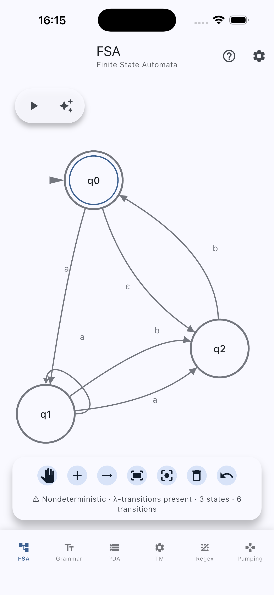

# JFlutter

JFlutter is a Flutter reimplementation of the JFLAP educational tool. It offers an interactive, touch-first workspace for creating, analysing, and simulating finite automata, grammars, and Turing machines on mobile and desktop platforms.

<p align="center">
  
  
  
  
</p>

## Project Status

**Status:** Work in Progress – the core learning workflows are available while UI polish and advanced visualisations are still being built.

## Highlights

### Learning tools
- Touch-friendly canvas for creating and editing automata
- Step-by-step simulators for finite automata, pushdown automata, and Turing machines
- Grammar editors with validation and conversion helpers
- Inline explanations and diagnostics to support classroom use

### Algorithms shipped in the app
- Conversions between NFA, DFA, and regular expressions
- DFA minimisation and automaton simulation traces
- Grammar analysis utilities and the Pumping Lemma training game
- Single-tape Turing machine construction and execution

### User experience and performance
- Material 3 interface with light and dark themes
- Adaptive layouts for phones, tablets, desktops, and the web
- Optimised canvas rendering (viewport culling, level-of-detail drawing, and highlight tracing)
- Persistent trace management across simulators and resilient import/export flows for JFLAP XML, JSON, and SVG

### Offline examples
The repository bundles ready-to-use examples covering DFAs, NFAs, CFGs, PDAs, and Turing Machines in `jflutter_js/examples/`. They are declared in `pubspec.yaml` so the material is available without a network connection.

## Architecture

### Clean Architecture Implementation
```
┌─────────────────────────────────────┐
│        Presentation Layer           │
│  (UI Components, Pages, Providers)  │
├─────────────────────────────────────┤
│         Core Layer                  │
│  (Algorithms, Models, Business)     │
├─────────────────────────────────────┤
│          Data Layer                 │
│  (Services, Repositories, Storage)  │
└─────────────────────────────────────┘
```

### Project Structure
```
lib/
├── app.dart                        # Root widget and global configuration
├── core/                           # Core business logic
│   ├── algorithms/                 # Automata algorithms and utilities
│   ├── constants/                  # Shared constants and definitions
│   ├── entities/                   # Domain entities shared across layers
│   ├── models/                     # Immutable data models and value objects
│   ├── parsers/                    # File/grammar parsing helpers
│   ├── regex/                      # Regex helpers and transformation pipeline
│   ├── repositories/               # Repository contracts
│   ├── services/                   # Core services (diagnostics, trace, etc.)
│   ├── use_cases/                  # Application-specific business rules
│   ├── validators/                 # Input and semantic validators
│   ├── algo_log.dart               # Algorithm execution logging
│   ├── error_handler.dart          # Error handling helpers
│   └── result.dart                 # Result/Either pattern implementation
├── data/                           # Data layer implementations
│   ├── data_sources/               # Concrete data sources (e.g., file system)
│   ├── models/                     # DTOs and serialization helpers
│   ├── repositories/               # Repository implementations
│   ├── services/                   # High-level services used by the app
│   └── storage/                    # Persistent storage adapters (e.g., SharedPreferences)
├── features/                       # Cross-cutting feature modules
│   ├── canvas/                     # Canvas orchestration layers
│   │   └── graphview/              # GraphView controllers, mappers, and highlight channels
│   └── layout/                     # Layout helpers and view-specific configs
├── injection/                      # Dependency injection setup
│   └── dependency_injection.dart   # Service registration and bootstrap
├── main.dart                       # Application entry point
└── presentation/                   # UI layer and state management
    ├── pages/                      # Screens and navigation flows
    ├── providers/                  # Riverpod providers
    ├── theme/                      # App theming (Material 3)
    └── widgets/                    # Reusable UI components
```

## Getting Started

### Prerequisites
- Flutter SDK 3.27.0+
- Dart SDK 3.6.0+
- Android Studio / VS Code (recommended)

### Installation

```bash
# Clone the repository
git clone https://github.com/ThalesMMS/jflutter.git
cd jflutter

# Install dependencies
flutter pub get

# Run the app
flutter run
```

### Android release signing

Android release builds are signed with the `dev.jflutter.app` application ID. The Gradle script loads release keystore
credentials from `android/key.properties`, which can now be generated from environment variables using
`android/scripts/create_key_properties.sh`.

1. Generate or obtain a release keystore (for example `android/keystores/jflutter-release.jks`). Keep this file out of
   version control.
2. Export the following environment variables before building or running the helper script:
   - `JFLUTTER_KEYSTORE_PASSWORD`
   - `JFLUTTER_KEY_ALIAS`
   - `JFLUTTER_KEY_PASSWORD`
   - *(optional)* `JFLUTTER_KEYSTORE_PATH` (defaults to `keystores/jflutter-release.jks`, relative to `android/`)
3. Run `./android/scripts/create_key_properties.sh` to generate `android/key.properties` from the exported values.

For CI/CD, store the keystore and credential values as encrypted secrets. During the workflow, recreate the keystore file
and call the helper script before `flutter build`. Example (GitHub Actions):

```bash
mkdir -p android/keystores
echo "$JFLUTTER_KEYSTORE_BASE64" | base64 --decode > android/keystores/jflutter-release.jks
export JFLUTTER_KEYSTORE_PASSWORD="$JFLUTTER_KEYSTORE_PASSWORD"
export JFLUTTER_KEY_ALIAS="$JFLUTTER_KEY_ALIAS"
export JFLUTTER_KEY_PASSWORD="$JFLUTTER_KEY_PASSWORD"
./android/scripts/create_key_properties.sh
```

### Platform Support
- **Android** – Primary target with touch-first workflows
- **iOS** – Daily-driver support, verified on current iOS devices
- **Web** – Responsive build suitable for classroom demos
- **Desktop** – Windows, macOS, and Linux builds share the same UI

## How to Use

### Creating an Automaton
1. Open the **FSA** workspace.
2. Add states with the **+** action and drag them into place.
3. Choose the arrow tool to connect states with transitions.
4. Double tap to edit state names or toggle initial/final markers.
5. Run conversions or minimisation from the algorithms panel.

### Testing Strings
1. Enter a string in the simulation panel.
2. Select **Simulate** to execute the automaton.
3. Inspect the trace output or canvas highlights to understand each step.

### Working with Grammars
1. Open the **Grammar** workspace.
2. Provide the grammar metadata and production rules.
3. Use the available algorithms to convert or analyse the grammar.
4. Test sample strings directly within the editor.

## Testing

### Test Suite Overview

Run `flutter test` (Flutter 3.27.0+ / Dart 3.6.0+) to execute the full suite. Tests are organised to mirror the architecture:

- **Algorithm validation** – `test/unit/` keeps DFA/NFA conversions, grammar analysis, and regex tooling aligned with the references.
- **Core services** – `test/core/services/` verifies utilities such as the simulation highlight broadcaster.
- **Canvas features** – `test/features/canvas/graphview/` exercises controllers, mappers, and models for the interactive canvas.
- **Integration** – `test/integration/io/` performs round-trips across JFLAP XML, JSON, SVG, and the offline example bundle.
- **Widget harnesses** – `test/widget/presentation/` drives UI flows while production widgets are completed.

### Placeholder and Pending Work

- `test/widget/presentation/visualizations_test.dart` intentionally fails to track the future golden-test pipeline.
- Temporary widget stubs live in `test/widget/presentation/ux_error_handling_test.dart` until the design-system components ship.

#### Running Tests

```bash
# Run all tests
flutter test

# Run specific test suites
flutter test test/unit/                    # Core algorithm suites
flutter test test/features/                # Feature-level canvas suites
flutter test test/integration/             # Integration tests
flutter test test/widget/                  # Widget harnesses

# Run with code coverage
flutter test --coverage
lcov --list coverage/lcov.info

# Static analysis
flutter analyze
```

## Reference Implementation Methodology

During the ongoing migration we rely on the projects stored in `References/` as the source of truth for algorithms and data structures. The Dart repositories and the Python `automata-main` module provide validation checkpoints while the Flutter core is rebuilt.

### Validation Approach
The `References/` directory contains authoritative implementations used as the source of truth for algorithms and data structures during the migration process. Each algorithm modification is cross-validated against these references to ensure correctness and maintainability.

### Reference Usage Process
1. **Algorithm Development** - Implement new algorithms based on reference implementations
2. **Cross-Validation** - Compare outputs with reference implementations
3. **Test Suite Validation** - Validate against reference test cases
4. **Performance Benchmarking** - Ensure performance meets or exceeds references
5. **Documentation** - Record any deviations with rationale in `docs/reference-deviations.md`

### Quality Assurance
- **Algorithm Coverage** - Deterministic automata, grammar, and regex suites in `test/unit/` back the domain layer.
- **Integration Guardrails** - Serialization and examples are validated through the IO round-trip suites in `test/integration/io/`.
- **UI Exercisers** - Canvas and control widgets are kept regression-safe via the harnesses in `test/widget/presentation/`, with golden coverage tracked by the pending `visualizations_test.dart` placeholder.
- **Performance Monitoring** - Regular benchmarking against reference implementations.
- **Deviation Tracking** - All deviations documented with impact assessment and cross-checked with references.
- **Continuous Validation** - Ongoing comparison with reference implementations.

### Reference Maintenance
- **Version Control** - References maintained in separate directories
- **Update Process** - Regular updates to reference implementations
- **Compatibility** - Ensure compatibility with reference API changes
- **Documentation** - Keep reference usage documentation current

## Project Overview

### Completed Features
- 13 algorithms covering DFA/NFA conversions, regex tooling, and grammar processing
- Riverpod-based state management with a clean-architecture layout
- Responsive UI components for automata, grammars, PDAs, and Turing machines
- Offline example library and import/export flows for JFLAP interoperability

### Future Enhancements
- Richer visual explanations for algorithm steps
- Expanded export formats and sharing workflows
- Guided tutorials for first-time learners
- Additional grammar analysis tooling and PDA/TM canvas refinements

## Development

### Code Quality
- **Clean Architecture** - Separation of concerns
- **Type Safety** - Strong typing throughout
- **Error Handling** - Comprehensive error management
- **Testing** - Unit, integration, and contract tests
- **Documentation** - Inline documentation and examples
- **Responsive Design** - Mobile-first approach

### Contributing
1. Fork the repository
2. Create a feature branch
3. Follow the coding standards
4. Add tests for new features
5. Submit a pull request
Try to maintain compatibility. Avoid changing core automata/grammar/pda/turing machine algorithms without discussing it first.

### Development Guidelines
- Optimise for mobile devices and accessibility
- Keep tests and documentation current
- Coordinate changes to shared algorithms before altering behaviour

## Educational Value

JFlutter is designed for:
- **Computer Science Students** - Learning automata theory
- **Educators** - Teaching formal languages
- **Researchers** - Prototyping automata
- **Developers** - Understanding regular expressions

## License

This project is distributed under a dual license structure:

### JFlutter
- **License**: Apache License 2.0
- **Copyright**: 2025–present JFlutter contributors (see [Contributors](#community--contributors))
- **Contact**: thalesmmsradio@gmail.com
- **File**: [LICENSE.txt](LICENSE.txt)

### Original JFLAP Code
- **License**: JFLAP 7.1 License (Non-commercial)
- **Copyright**: 2002-2009 Susan H. Rodger (Duke University)
- **File**: [LICENSE_JFLAP.txt](LICENSE_JFLAP.txt)

### License Summary
- The **Flutter port** (all new code) is licensed under Apache 2.0, allowing free use, modification, and distribution with proper attribution
- The **original JFLAP algorithms and concepts** remain under the original JFLAP license, which prohibits commercial use
- This dual structure ensures compliance with the original license while allowing the Flutter port to be freely used and modified

## Acknowledgments & References

### Development
- **Thales Matheus Mendonça Santos** - Complete JFlutter development until 2025-10-07, graphview fork optimization for loop transitions rendering
- **Email**: thalesmmsradio@gmail.com
- **Year**: 2025

### Original Project & Primary Inspiration
- **Susan H. Rodger** (Duke University) - Original JFLAP creator and maintainer
- **JFLAP Team** - Thomas Finley, Ryan Cavalcante, Stephen Reading, Bart Bressler, Jinghui Lim, Chris Morgan, Kyung Min (Jason) Lee, Jonathan Su, Henry Qin
- **Duke University** - For the foundational educational tool
- **Website**: http://www.jflap.org

### Reference Implementations & Algorithm Sources

#### Core Algorithm References
- **`References/automata-main/`** - Python implementation of automata algorithms
  - **Source**: [automata-main](https://github.com/caleb531/automata) by Caleb Evans
  - **Usage**: Primary reference for NFA to DFA conversion, DFA minimization, regex operations
  - **Validation**: All core algorithms validated against this implementation

- **`References/dart-petitparser-examples-main/`** - Dart parser examples and utilities
  - **Source**: [dart-petitparser-examples](https://github.com/petitparser/dart-petitparser-examples) by PetitParser
  - **Usage**: Regex parsing, grammar analysis, parser construction
  - **Validation**: Parser implementations validated against these examples

- **`References/AutomataTheory-master/`** - Dart automata theory implementations
  - **Source**: [AutomataTheory](https://github.com/dart-lang/samples/tree/master/automata_theory) by Pedro Lemos
  - **Usage**: Finite automata operations, language theory concepts
  - **Validation**: Automaton operations validated against this reference

- **`References/nfa_2_dfa-main/`** - NFA to DFA conversion algorithms
  - **Source**: [nfa_2_dfa](https://github.com/7Na7iD7/nfa_2_dfa) by Na7iD
  - **Usage**: NFA to DFA conversion algorithms, state minimization
  - **Validation**: Conversion algorithms validated against this implementation

#### Educational & Design Inspiration
- **JFLAP Educational Philosophy** - Interactive learning approach
- **Material Design 3** - Modern UI/UX principles
- **Flutter Best Practices** - Mobile-first development patterns
- **Academic Automata Theory** - Hopcroft, Ullman, and Sipser algorithms

### Technology Stack & Frameworks
- **Flutter Team** - For the excellent mobile framework
- **Dart Team** - For the programming language
- **Riverpod Team** - For state management solutions
- **GraphView Contributors** - For the graph rendering toolkit powering the native automaton canvas
- **Material Design Team** - For design system and components
- **Open Source Community** - For inspiration and support

### Community & Contributors
- **Prof. Zenilton Kleber Gonçalves do Patrocínio Júnior** - For educational guidance and feedback
- **[@Gaok1](https://github.com/Gaok1)** - Luis Phillip Lemos Martins - For inspiring this Flutter project
