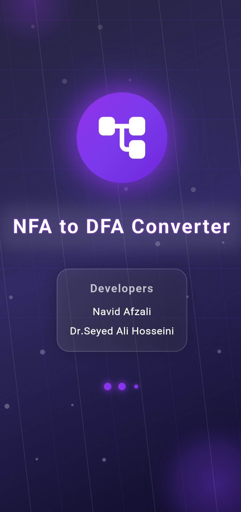
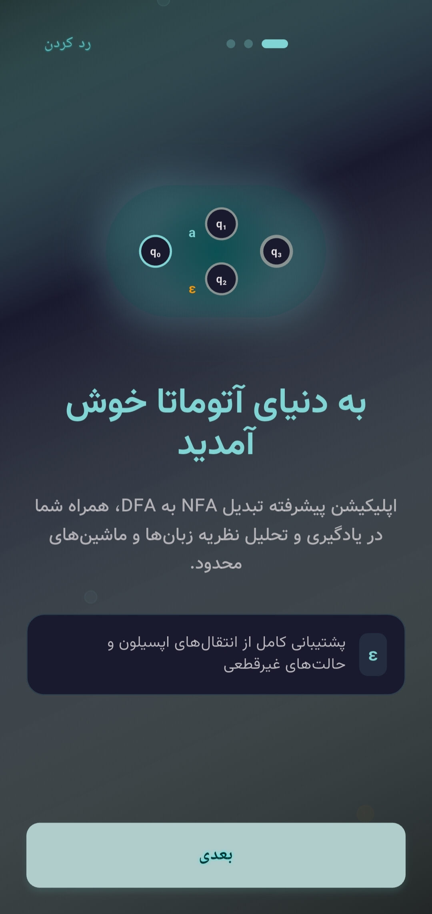
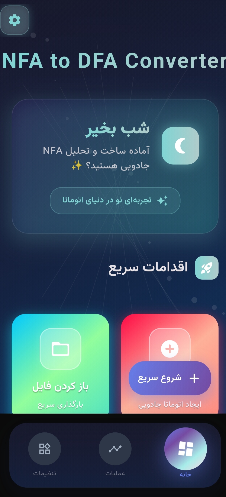
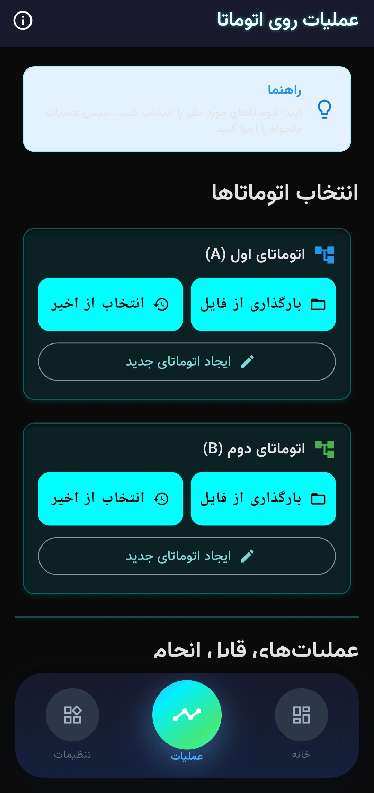
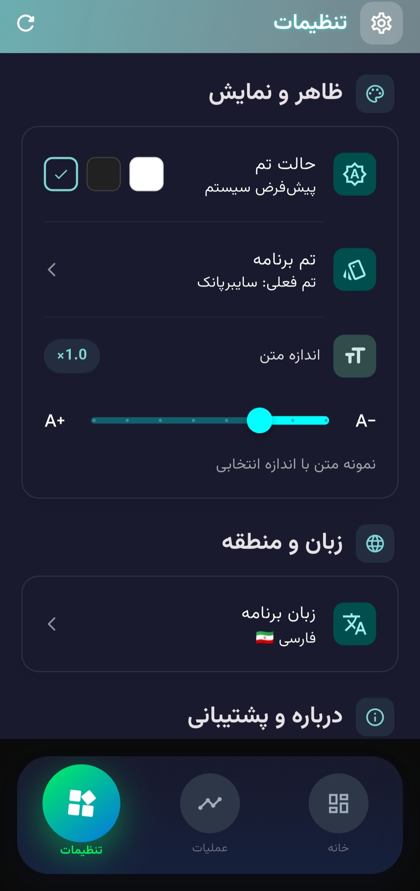
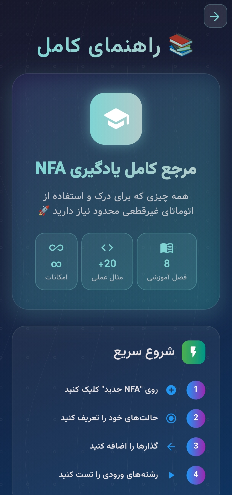

<div align="center">

# 🌟 NFA to DFA Converter
### *The Ultimate Automata Theory Playground*




<div style="background: linear-gradient(135deg, #667eea 0%, #764ba2 50%, #f093fb 100%); padding: 20px; border-radius: 20px; color: white; margin: 20px 0; box-shadow: 0 15px 50px rgba(102, 126, 234, 0.4);">
🚀 <strong>Experience the Revolution in Automata Theory Education</strong> 🚀
</div>

[](https://github.com/7Na7iD7/nfa_2_dfa)

</div>

---

## 🎯 **Vision Statement**

<div align="center">


<div style="background: linear-gradient(45deg, #FF6B6B 0%, #FF8E53 100%); padding: 25px; border-radius: 15px; color: white; margin: 20px 0; box-shadow: 0 12px 40px rgba(255, 107, 107, 0.3); border: 1px solid rgba(255,255,255,0.1);">

### **Revolutionary Platform Philosophy**

This isn't just another academic tool—it's a **transformative experience** that bridges the gap between abstract automata theory and intuitive visual learning. Whether you're mastering computer science fundamentals or conducting advanced research, experience finite automata like never before.

<div style="background: rgba(255,255,255,0.2); padding: 12px; border-radius: 8px; margin: 15px 0;">
💡 <strong>Innovation meets Education</strong> - Redefining how we learn automata theory
</div>

</div>

</div>

---

## ⚡ **Revolutionary Capabilities**

<div align="center">


</div>

<table>
<tr>
<td width="50%">

### 🏗️ **Professional Automata Studio**
> *Where creativity meets precision*

<div style="background: linear-gradient(135deg, #4ECDC4 0%, #44A08D 100%); padding: 15px; border-radius: 10px; color: white; margin: 10px 0; font-size: 0.9em;">
<strong>⚡ Interactive Visual Builder:</strong> Drag, drop, and design with pixel-perfect precision
</div>

🎯 **Multi-Panel Workspace**: Dedicated editors for States, Alphabet & Transitions  
🔍 **Intelligent Validation**: Real-time error detection and smart suggestions
📚 **Advanced History System**: Unlimited undo/redo with branching support

</td>
<td width="50%">

### 🔬 **Advanced Conversion Engine**
> *Powered by cutting-edge algorithms*

<div style="background: linear-gradient(135deg, #9C88FF 0%, #5C6BC0 100%); padding: 15px; border-radius: 10px; color: white; margin: 10px 0; font-size: 0.9em;">
<strong>🧠 Subset Construction Algorithm:</strong> Industry-standard implementation with optimizations
</div>

🎬 **Real-Time Animation**: Watch every step of the conversion process
⚡ **Lightning Mode** - Instant results  
⚖️ **Balanced Mode** - Speed with detail  
🎯 **Optimized Mode** - Maximum efficiency

</td>
</tr>
<tr>
<td width="50%">

### 🔍 **Interactive Testing Suite**
> *Validate with confidence*

<div style="background: linear-gradient(135deg, #FF6B9D 0%, #C44569 100%); padding: 15px; border-radius: 10px; color: white; margin: 10px 0; font-size: 0.9em;">
<strong>🔴 Live String Validation:</strong> Test inputs with real-time visual feedback
</div>

🛤️ **Path Visualization**: Highlight traversal routes and decision points  
📊 **Acceptance Analysis**: Detailed accept/reject state explanations  
🎯 **Smart Testing**: Automated test case generation

</td>
<td width="50%">

### 🎨 **Next-Generation Visualization**
> *Where art meets algorithms*

<div style="background: linear-gradient(135deg, #36BCF7 0%, #667eea 100%); padding: 15px; border-radius: 10px; color: white; margin: 10px 0; font-size: 0.9em;">
<strong>🎭 Custom Rendering Engine:</strong> Built with Flutter's CustomPainter for unmatched performance
</div>

🔄 **Adaptive Layouts**: Circle • Grid • Tree • Force-Directed  
💫 **Cinematic Animations**: Smooth transitions and particle effects  
🎮 **Interactive Controls**: Zoom • Pan • Multi-Select • Context Menus

</td>
</tr>
</table>

---

## 🎨 **Immersive Visual Experience**

<div align="center">


### *Built from scratch for unmatched performance*

<div style="background: linear-gradient(45deg, #FF8A80 0%, #FF5722 50%, #E91E63 100%); padding: 22px; border-radius: 15px; color: white; margin: 20px 0; box-shadow: 0 10px 35px rgba(255, 138, 128, 0.4);">

### **🌈 Immersive Theme Collection**

<table style="width: 100%; color: white;">
<tr>
<td style="text-align: center; padding: 10px;">
<strong>🌃 Cyberpunk</strong><br/>
<em>Neon-lit digital aesthetics</em>
</td>
<td style="text-align: center; padding: 10px;">
<strong>🌌 Galaxy</strong><br/>
<em>Deep space exploration vibes</em>
</td>
</tr>
<tr>
<td style="text-align: center; padding: 10px;">
<strong>🌅 Aurora</strong><br/>
<em>Northern lights elegance</em>
</td>
<td style="text-align: center; padding: 10px;">
<strong>🌇 Sunset</strong><br/>
<em>Warm, productive atmosphere</em>
</td>
</tr>
</table>

</div>

</div>

---

## 🌐 **Global Accessibility & Education**

<div align="center">


<div style="background: linear-gradient(135deg, #81C784 0%, #4CAF50 100%); padding: 20px; border-radius: 15px; color: white; margin: 20px 0; box-shadow: 0 8px 30px rgba(129, 199, 132, 0.3);">

🇮🇷 **Persian Language Support**: Full RTL implementation with cultural sensitivity  
🎓 **Educational Focus**: Built-in tutorials and comprehensive example library  
📚 **Template System**: Pre-built automata for accelerated learning  
🚀 **Smooth Onboarding**: From splash screen to complete mastery

</div>

</div>

---

## 💾 **Enterprise-Grade Project Management**

<table>
<tr>
<td width="50%">

<div style="background: linear-gradient(135deg, #BA68C8 0%, #9C27B0 100%); padding: 15px; border-radius: 12px; color: white; margin: 10px 0;">
<strong>💡 Smart Persistence</strong><br/>
JSON-based save/load with automatic backups
</div>

<div style="background: linear-gradient(135deg, #FFB74D 0%, #FF9800 100%); padding: 15px; border-radius: 12px; color: white; margin: 10px 0;">
<strong>🎨 Template Gallery</strong><br/>
Curated collection of educational examples
</div>

</td>
<td width="50%">

<div style="background: linear-gradient(135deg, #64B5F6 0%, #2196F3 100%); padding: 15px; border-radius: 12px; color: white; margin: 10px 0;">
<strong>📂 Recent Projects</strong><br/>
Quick access to your work history
</div>

<div style="background: linear-gradient(135deg, #A5D6A7 0%, #4CAF50 100%); padding: 15px; border-radius: 12px; color: white; margin: 10px 0;">
<strong>📤 Export Options</strong><br/>
Multiple formats for sharing and presentation
</div>

</td>
</tr>
</table>

---

## 🏗️ **Enterprise Architecture Excellence**

<div align="center">


### *Engineering excellence at every layer*

</div>

### **🧩 Clean Architecture Principles**
```
Presentation Layer  ←→  Domain Layer  ←→  Data Layer
     ↓                      ↓                ↓
   UI/Widgets          Use Cases        Repositories
```

<table>
<tr>
<td width="33%">

### **🎛️ State Management**
<div style="background: linear-gradient(135deg, #FFAB91 0%, #FF7043 100%); padding: 12px; border-radius: 8px; color: white; margin: 8px 0; font-size: 0.85em;">
<strong>Provider Pattern:</strong> Reactive state management
</div>

</td>
<td width="33%">

### **⚡ Performance**
<div style="background: linear-gradient(135deg, #90CAF9 0%, #42A5F5 100%); padding: 12px; border-radius: 8px; color: white; margin: 8px 0; font-size: 0.85em;">
<strong>Smart Caching:</strong> Intelligent memory management
</div>

</td>
<td width="33%">

### **🔧 Optimization**
<div style="background: linear-gradient(135deg, #C5E1A5 0%, #8BC34A 100%); padding: 12px; border-radius: 8px; color: white; margin: 8px 0; font-size: 0.85em;">
<strong>Adaptive Performance:</strong> Scales with device capabilities
</div>

</td>
</tr>
</table>

---

## 📱 **Visual Showcase**

<div align="center">


<div style="background: linear-gradient(45deg, #E1BEE7 0%, #BA68C8 50%, #9C27B0 100%); padding: 15px; border-radius: 12px; margin: 20px 0; color: white; box-shadow: 0 8px 32px rgba(225, 190, 231, 0.3);">
🎯 <strong>Witness automata theory transformed into interactive art</strong>
</div>

  

  

</div>

---

## 🚀 **Quick Start Guide**

<div align="center">


### *From zero to mastery in minutes!*

<div style="background: linear-gradient(135deg, #4FC3F7 0%, #29B6F6 100%); padding: 20px; border-radius: 15px; color: white; margin: 20px 0; box-shadow: 0 10px 40px rgba(79, 195, 247, 0.3);">
💡 <strong>Pro Tip:</strong> Make sure you have Flutter 3.0+ installed for the ultimate experience!
</div>

</div>

### **📋 Prerequisites**
- Flutter SDK `>= 3.0.0`
- Dart SDK `>= 2.17.0`
- Android Studio / VS Code (recommended)

### **⚡ Installation**
```bash
# Clone the repository
git clone https://github.com/7Na7iD7/nfa_2_dfa.git

# Navigate to project directory
cd nfa_2_dfa

# Install dependencies
flutter pub get

# Run on your preferred platform
flutter run
```

### **🏗️ Build for Production**
```bash
# Android APK
flutter build apk --release

# iOS (macOS required)
flutter build ios --release

# Web deployment
flutter build web --release
```

---

## 🛠️ **Technology Stack**

<div align="center">


### *Engineered with cutting-edge technologies*

<div style="background: linear-gradient(45deg, #A1C181 0%, #689F38 100%); padding: 18px; border-radius: 12px; color: white; margin: 15px 0; box-shadow: 0 8px 25px rgba(161, 193, 129, 0.3);">
⚡ <strong>Performance First:</strong> Optimized for smooth 60fps animations across all devices
</div>

</div>

### **🗃️ Core Framework**
- **[Flutter](https://flutter.dev)** `^3.0.0` - Cross-platform UI toolkit

### **📦 Essential Dependencies**
- **[provider](https://pub.dev/packages/provider)** `^6.0.0` - State management solution
- **[google_fonts](https://pub.dev/packages/google_fonts)** `^4.0.0` - Typography excellence  
- **[flutter_svg](https://pub.dev/packages/flutter_svg)** `^2.0.0` - Scalable vector graphics
- **[animations](https://pub.dev/packages/animations)** `^2.0.0` - Material motion system

### **🔧 Development Tools**
- **[flutter_lints](https://pub.dev/packages/flutter_lints)** - Code quality standards
- **[build_runner](https://pub.dev/packages/build_runner)** - Code generation

---

## 🤝 **Contributing**

<div align="center">


### *Be part of the automata theory revolution!*

<div style="background: linear-gradient(45deg, #F8BBD9 0%, #E91E63 100%); padding: 18px; border-radius: 12px; color: white; margin: 15px 0; box-shadow: 0 8px 30px rgba(248, 187, 217, 0.3);">
💝 <strong>Every contribution makes a difference</strong> - Join our growing family of educators and developers!
</div>

</div>

We welcome contributions from the community! Here's how you can help:

1. **🐛 Report Issues**: Found a bug? Let us know!
2. **💡 Feature Requests**: Have an idea? We'd love to hear it
3. **🔧 Code Contributions**: Submit PRs following our style guide
4. **📖 Documentation**: Help improve our docs and tutorials

### **🌟 Development Workflow**
```bash
# Fork the repository
# Create a feature branch
git checkout -b feature/amazing-feature

# Make your changes
# Commit with conventional commits
git commit -m "feat: add amazing new feature"

# Push and create PR
git push origin feature/amazing-feature
```

---

## 📄 **License & Legal**

This project is licensed under the **[MIT License](LICENSE)** - see the LICENSE file for details.

<div style="background: linear-gradient(135deg, #B39DDB 0%, #9C27B0 100%); padding: 15px; border-radius: 10px; color: white; margin: 15px 0;">

### **What this means:**
✅ Commercial use allowed • ✅ Modification allowed • ✅ Distribution allowed • ✅ Private use allowed

</div>

---

## 👨‍💻 **Creator**

<div align="center">

### **Made with ❤️ by [7Na7iD7](https://github.com/7Na7iD7)**

*Passionate about transforming complex theoretical concepts into beautiful, interactive experiences*

### 🌟 **Welcome to the Future of Automata Theory**


<div style="background: linear-gradient(135deg, #FF9E80 0%, #FF5722 50%, #E91E63 100%); padding: 25px; border-radius: 20px; text-align: center; color: white; margin: 25px 0; box-shadow: 0 15px 50px rgba(255, 158, 128, 0.4); border: 1px solid rgba(255,255,255,0.1);">

<h3 style="margin: 0 0 15px 0; font-size: 1.4em;">✨ Join Thousands of Students & Educators Worldwide ✨</h3>

<p style="margin: 0 0 15px 0; font-size: 1.1em; opacity: 0.9;">Transform your understanding of automata theory and unlock new educational possibilities</p>

<div style="background: rgba(255,255,255,0.2); padding: 12px; border-radius: 10px; margin: 15px 0;">
🎓 <strong>Where Theory Meets Innovation</strong> 🎓
</div>

### **🚀 Ready to Transform Your Understanding of Automata Theory?**

**APK file is available in `build\app\outputs\flutter-apk` after running the build command**

</div>

<div align="center" style="margin: 20px 0; font-style: italic; color: #666;">
<em>"The best way to understand automata is to see them come alive."</em>
</div>


</div>
