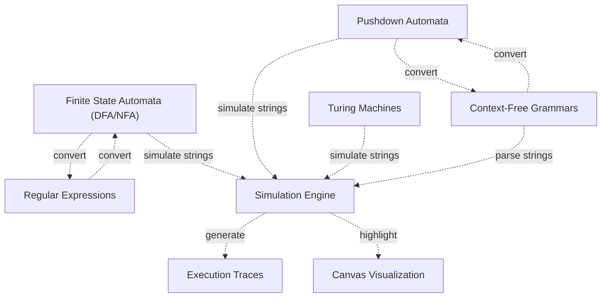
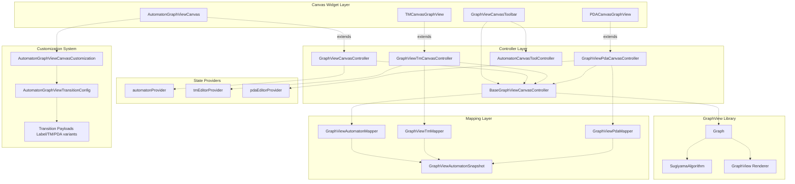
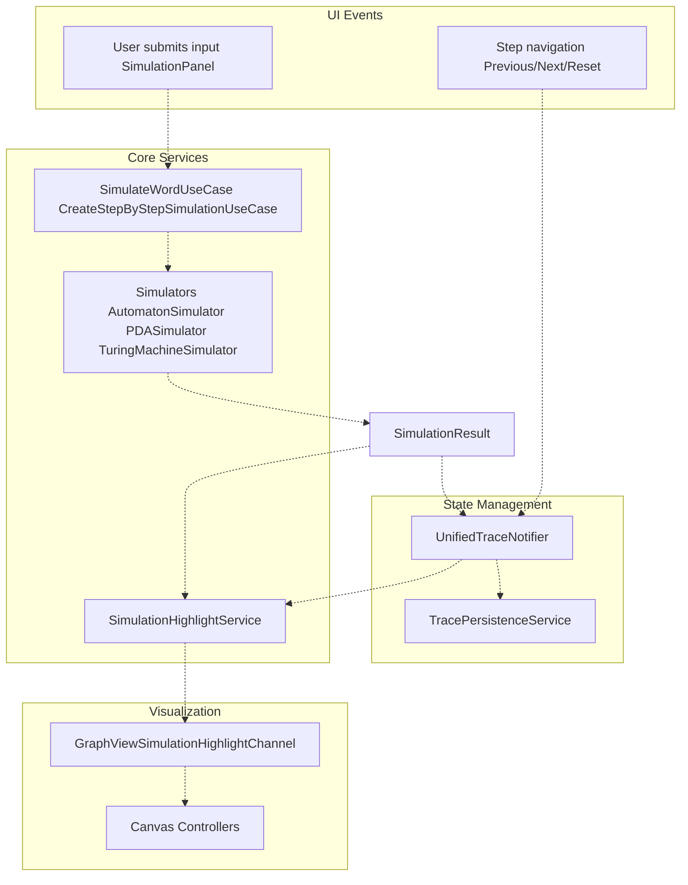
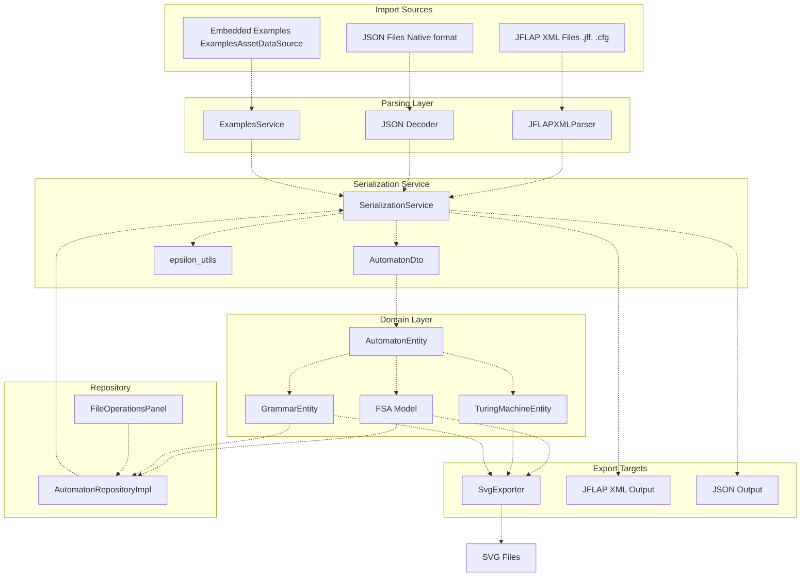
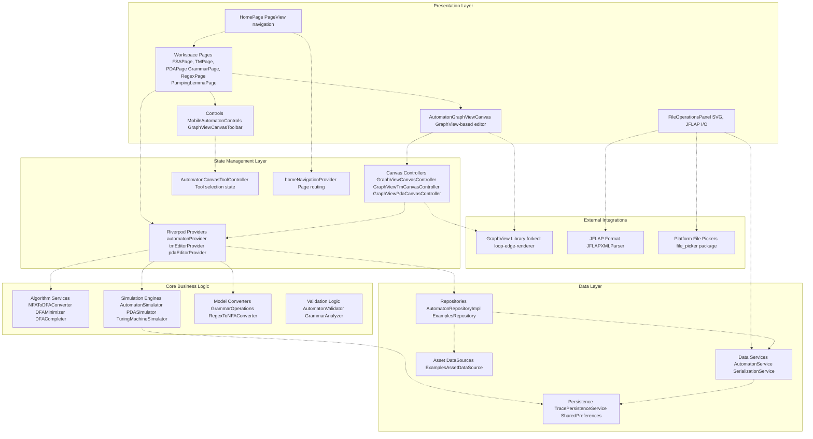
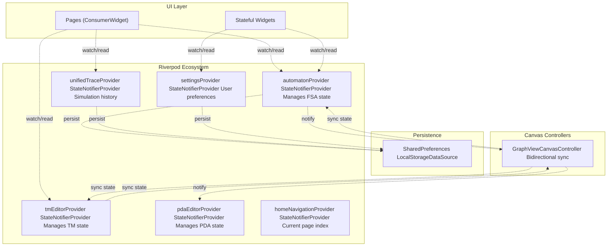
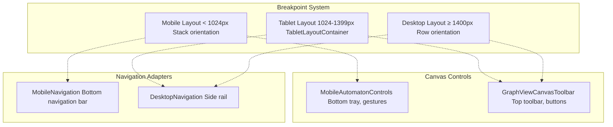

# JFlutter Overview

> **Relevant source files**
> * [README.md](https://github.com/ThalesMMS/JFlutter/blob/32e808b4/README.md)
> * [USER_GUIDE](https://github.com/ThalesMMS/JFlutter/blob/32e808b4/USER_GUIDE)
> * [docs/canvas_bridge.md](https://github.com/ThalesMMS/JFlutter/blob/32e808b4/docs/canvas_bridge.md)
> * [integration_test/app_simulation_test.dart](https://github.com/ThalesMMS/JFlutter/blob/32e808b4/integration_test/app_simulation_test.dart)
> * [integration_test/driver.dart](https://github.com/ThalesMMS/JFlutter/blob/32e808b4/integration_test/driver.dart)
> * [pubspec.lock](https://github.com/ThalesMMS/JFlutter/blob/32e808b4/pubspec.lock)
> * [pubspec.yaml](https://github.com/ThalesMMS/JFlutter/blob/32e808b4/pubspec.yaml)

**Purpose and Scope**: This page introduces JFlutter as a cross-platform educational tool for formal language theory. It explains the application's capabilities, target audience, supported automaton types, and high-level architecture. For detailed information about specific subsystems, see the architecture pages ([Architecture](#2)), canvas system ([Canvas System](#4)), algorithms ([Algorithms and Simulation](#7)), and other specialized topics.

---

## What is JFlutter?

JFlutter is a Flutter-based reimplementation of the JFLAP educational software, designed to provide an interactive workspace for creating, analyzing, and simulating formal language constructs. The application runs on Android, iOS, Web, Windows, macOS, and Linux platforms, with a touch-first interface optimized for mobile devices while maintaining full desktop functionality.

The project reimplements JFLAP's core algorithms and educational workflows using Flutter's cross-platform framework, enabling students and educators to work with automata theory concepts on any device without requiring Java or platform-specific installations.

**Key Characteristics**:

* **Cross-Platform**: Single codebase targeting six platforms (Android, iOS, Web, Windows, macOS, Linux)
* **Touch-Optimized**: Mobile-first interface design with gesture-based canvas interactions
* **Offline-Capable**: Bundled examples and local persistence enable usage without network connectivity
* **JFLAP-Compatible**: Import and export JFLAP XML files for interoperability with existing course materials

Sources: [README.md L1-L10](https://github.com/ThalesMMS/JFlutter/blob/32e808b4/README.md#L1-L10)

 [pubspec.yaml L1-L28](https://github.com/ThalesMMS/JFlutter/blob/32e808b4/pubspec.yaml#L1-L28)

---

## Target Audience and Educational Value

JFlutter serves multiple user groups in computer science education:

| User Group | Primary Use Cases | Key Features |
| --- | --- | --- |
| **Computer Science Students** | Learning automata theory, completing coursework, visualizing concepts | Step-by-step simulation, visual highlighting, example library |
| **Educators** | Teaching formal languages, creating demonstrations, preparing assignments | JFLAP compatibility, export features, offline examples |
| **Researchers** | Prototyping automata, testing algorithms, verifying theoretical results | Algorithm suite, trace management, advanced editing |
| **Developers** | Understanding regular expressions, building parsers, studying language theory | Regex conversion tools, grammar analysis, practical examples |

The application emphasizes interactive learning through visual feedback, allowing users to observe algorithm execution step-by-step and understand state transitions through canvas highlighting.

Sources: [README.md L269-L276](https://github.com/ThalesMMS/JFlutter/blob/32e808b4/README.md#L269-L276)

---

## Supported Automaton Types and Features

JFlutter supports five primary formal language constructs, each with specialized editing, simulation, and analysis capabilities:

### Automaton Type Summary



Sources: [README.md L18-L29](https://github.com/ThalesMMS/JFlutter/blob/32e808b4/README.md#L18-L29)

 Diagram 7 from provided context

### Feature Matrix

| Feature | FSA (DFA/NFA) | PDA | Turing Machine | CFG | Regex |
| --- | --- | --- | --- | --- | --- |
| **Visual Editor** | ✓ GraphView canvas | ✓ GraphView canvas | ✓ GraphView canvas | ✓ Text editor | ✓ Text editor |
| **String Simulation** | ✓ Deterministic/nondeterministic | ✓ Stack-based | ✓ Tape-based | ✓ Derivation trees | ✓ Pattern matching |
| **Step-by-Step Mode** | ✓ State highlighting | ✓ State + stack display | ✓ State + tape display | ✓ Production steps | N/A |
| **Conversion Algorithms** | NFA→DFA, Minimize, ε-removal | PDA→CFG | N/A | CFG→PDA, Remove left recursion | Regex↔NFA/DFA |
| **Analysis Tools** | Complement, Union, Determinism check | Simplify, Determinism check, Reachability | Decidability, Reachability | FIRST/FOLLOW, LL(1) check | N/A |
| **JFLAP Import/Export** | ✓ XML format | ✓ XML format | ✓ XML format | ✓ XML format | Native JSON only |

Sources: [README.md L18-L29](https://github.com/ThalesMMS/JFlutter/blob/32e808b4/README.md#L18-L29)

 [README.md L235-L244](https://github.com/ThalesMMS/JFlutter/blob/32e808b4/README.md#L235-L244)

---

## Core Application Features

### Learning and Educational Tools

**Examples Library**: 50+ pre-built automatons covering common patterns and educational scenarios. Examples are packaged as JSON assets and loaded from `jflutter_js/examples/` directory. Each example includes metadata (title, description, category) and is available offline.

**Pumping Lemma Training Game**: Interactive game for practicing the pumping lemma proof technique, with progress tracking and help system. Managed by `PumpingLemmaGame` and `pumpingLemmaProgressProvider`.

**Algorithm Execution Visualization**: All algorithms produce step-by-step explanations and intermediate results, displayed through algorithm panels (`AlgorithmPanel`, `FSAAlgorithmPanel`, `PDAAlgorithmPanel`).

**Simulation Highlighting**: Real-time canvas highlighting during simulation execution, coordinated through `SimulationHighlightService` and `GraphViewSimulationHighlightChannel`.

Sources: [README.md L36-L38](https://github.com/ThalesMMS/JFlutter/blob/32e808b4/README.md#L36-L38)

 [lib/presentation/pages/pumping_lemma_page.dart](https://github.com/ThalesMMS/JFlutter/blob/32e808b4/lib/presentation/pages/pumping_lemma_page.dart)

 [lib/core/services/simulation_highlight_service.dart L8-L101](https://github.com/ThalesMMS/JFlutter/blob/32e808b4/lib/core/services/simulation_highlight_service.dart#L8-L101)

### Canvas System

JFlutter uses a GraphView-based canvas for interactive automaton editing, with a modular architecture supporting multiple automaton types:

**Canvas Architecture: Controllers and Customization**



**Key Components**:

| Component | File Path | Responsibility |
| --- | --- | --- |
| `AutomatonGraphViewCanvas` | [lib/presentation/widgets/automaton_graphview_canvas.dart](https://github.com/ThalesMMS/JFlutter/blob/32e808b4/lib/presentation/widgets/automaton_graphview_canvas.dart) | Universal canvas widget, hosts GraphView and controllers |
| `BaseGraphViewCanvasController` | [lib/features/canvas/graphview/base_graphview_canvas_controller.dart](https://github.com/ThalesMMS/JFlutter/blob/32e808b4/lib/features/canvas/graphview/base_graphview_canvas_controller.dart) | Abstract base: viewport management, undo/redo, history compression |
| `GraphViewCanvasController` | [lib/features/canvas/graphview/graphview_canvas_controller.dart](https://github.com/ThalesMMS/JFlutter/blob/32e808b4/lib/features/canvas/graphview/graphview_canvas_controller.dart) | FSA-specific controller with state/transition operations |
| `GraphViewTmCanvasController` | [lib/features/canvas/graphview/graphview_tm_canvas_controller.dart](https://github.com/ThalesMMS/JFlutter/blob/32e808b4/lib/features/canvas/graphview/graphview_tm_canvas_controller.dart) | Turing machine controller with tape metadata |
| `GraphViewPdaCanvasController` | [lib/features/canvas/graphview/graphview_pda_canvas_controller.dart](https://github.com/ThalesMMS/JFlutter/blob/32e808b4/lib/features/canvas/graphview/graphview_pda_canvas_controller.dart) | PDA controller with stack operations |
| `AutomatonGraphViewCanvasCustomization` | [lib/features/canvas/graphview/automaton_graphview_canvas_customization.dart](https://github.com/ThalesMMS/JFlutter/blob/32e808b4/lib/features/canvas/graphview/automaton_graphview_canvas_customization.dart) | Type-specific behavior and payload builders |
| `GraphViewAutomatonMapper` | [lib/features/canvas/graphview/graphview_automaton_mapper.dart](https://github.com/ThalesMMS/JFlutter/blob/32e808b4/lib/features/canvas/graphview/graphview_automaton_mapper.dart) | Bidirectional FSA ↔ snapshot conversion |
| `GraphViewAutomatonSnapshot` | [lib/features/canvas/graphview/models/graphview_automaton_snapshot.dart](https://github.com/ThalesMMS/JFlutter/blob/32e808b4/lib/features/canvas/graphview/models/graphview_automaton_snapshot.dart) | Immutable canvas state representation |

**Interaction Flow**:

1. User gestures (tap, drag, edit) are captured by `AutomatonGraphViewCanvas`
2. Canvas delegates to specialized controllers (`GraphViewCanvasController`, `GraphViewTmCanvasController`, `GraphViewPdaCanvasController`)
3. Controllers use mappers to convert between domain models (from providers) and `GraphViewAutomatonSnapshot`
4. Controllers synchronize changes bidirectionally with state providers (`automatonProvider`, `tmEditorProvider`, `pdaEditorProvider`)
5. GraphView library renders the visual representation with custom loop-edge support

**Customization System**:

* `AutomatonGraphViewCanvasCustomization` allows type-specific behavior (e.g., transition payload builders for FSA labels vs. TM tape operations)
* `AutomatonGraphViewTransitionConfig` provides different payload builders for FSA (simple labels), TM (read/write/direction), and PDA (stack operations)
* Enables the same canvas widget to handle all automaton types with appropriate editing interfaces

Sources: [lib/presentation/widgets/automaton_graphview_canvas.dart L23-L116](https://github.com/ThalesMMS/JFlutter/blob/32e808b4/lib/presentation/widgets/automaton_graphview_canvas.dart#L23-L116)

 [lib/features/canvas/graphview/base_graphview_canvas_controller.dart L17-L220](https://github.com/ThalesMMS/JFlutter/blob/32e808b4/lib/features/canvas/graphview/base_graphview_canvas_controller.dart#L17-L220)

 [lib/features/canvas/graphview/graphview_canvas_controller.dart L14-L156](https://github.com/ThalesMMS/JFlutter/blob/32e808b4/lib/features/canvas/graphview/graphview_canvas_controller.dart#L14-L156)

 [docs/canvas_bridge.md L1-L39](https://github.com/ThalesMMS/JFlutter/blob/32e808b4/docs/canvas_bridge.md#L1-L39)

 Diagram 3 from high-level architecture

### Simulation and Trace Management

JFlutter provides a unified simulation system with persistent trace history and real-time canvas highlighting:

**Simulation Pipeline: Execution and Highlighting**



**Key Components and Data Flow**:

| Component | File Path | Responsibility |
| --- | --- | --- |
| `SimulationPanel` | [lib/presentation/widgets/simulation_panel.dart](https://github.com/ThalesMMS/JFlutter/blob/32e808b4/lib/presentation/widgets/simulation_panel.dart) | User interface for input and execution controls |
| `SimulateWordUseCase` | [lib/core/use_cases/simulate_word_use_case.dart](https://github.com/ThalesMMS/JFlutter/blob/32e808b4/lib/core/use_cases/simulate_word_use_case.dart) | Orchestrates simulation execution |
| `AutomatonSimulator` | [lib/core/services/automaton_simulator.dart](https://github.com/ThalesMMS/JFlutter/blob/32e808b4/lib/core/services/automaton_simulator.dart) | FSA simulation engine |
| `PDASimulator` | [lib/core/services/pda_simulator.dart](https://github.com/ThalesMMS/JFlutter/blob/32e808b4/lib/core/services/pda_simulator.dart) | Pushdown automaton simulation engine |
| `TuringMachineSimulator` | [lib/core/services/turing_machine_simulator.dart](https://github.com/ThalesMMS/JFlutter/blob/32e808b4/lib/core/services/turing_machine_simulator.dart) | Turing machine simulation engine |
| `UnifiedTraceNotifier` | [lib/presentation/providers/unified_trace_provider.dart](https://github.com/ThalesMMS/JFlutter/blob/32e808b4/lib/presentation/providers/unified_trace_provider.dart) | Centralized trace state management |
| `TracePersistenceService` | [lib/data/services/trace_persistence_service.dart](https://github.com/ThalesMMS/JFlutter/blob/32e808b4/lib/data/services/trace_persistence_service.dart) | SharedPreferences-backed storage (50 trace limit) |
| `SimulationHighlightService` | [lib/core/services/simulation_highlight_service.dart](https://github.com/ThalesMMS/JFlutter/blob/32e808b4/lib/core/services/simulation_highlight_service.dart) | Broadcasts highlight events to canvas |
| `GraphViewSimulationHighlightChannel` | [lib/features/canvas/graphview/graphview_highlight_channel.dart](https://github.com/ThalesMMS/JFlutter/blob/32e808b4/lib/features/canvas/graphview/graphview_highlight_channel.dart) | Bridge between highlight service and canvas |

**Trace Management Features**:

* **Persistent History**: Up to 50 simulation traces stored in SharedPreferences, automatically pruned when capacity is exceeded
* **Step-by-Step Navigation**: Forward/backward stepping, pause/play, and reset controls
* **Real-Time Highlighting**: Canvas states/transitions highlighted during playback via `GraphViewSimulationHighlightChannel`
* **Import/Export**: JSON-based trace export via `exportTraceHistory()` and `importTraceHistory()` methods
* **Statistics**: Acceptance rates, total runs, per-automaton-type counts computed by `TracePersistenceService`
* **Metadata Preservation**: Automaton identifiers, input strings, acceptance verdicts, and execution timestamps

**Execution Flow**:

1. User enters input string in `SimulationPanel`
2. `SimulateWordUseCase` invokes appropriate simulator (`AutomatonSimulator`, `PDASimulator`, or `TuringMachineSimulator`)
3. Simulator generates `SimulationResult` with step-by-step execution trace
4. `UnifiedTraceNotifier` saves result to `TracePersistenceService` (capped at 50 entries)
5. `SimulationHighlightService` broadcasts highlight events to `GraphViewSimulationHighlightChannel`
6. Canvas controllers receive highlights and update visual state in real-time
7. User can navigate steps via transport controls, with highlights synchronized to current step

Sources: [lib/presentation/widgets/simulation_panel.dart L92-L154](https://github.com/ThalesMMS/JFlutter/blob/32e808b4/lib/presentation/widgets/simulation_panel.dart#L92-L154)

 [lib/presentation/providers/unified_trace_provider.dart L135-L309](https://github.com/ThalesMMS/JFlutter/blob/32e808b4/lib/presentation/providers/unified_trace_provider.dart#L135-L309)

 [lib/data/services/trace_persistence_service.dart L16-L213](https://github.com/ThalesMMS/JFlutter/blob/32e808b4/lib/data/services/trace_persistence_service.dart#L16-L213)

 [lib/core/services/simulation_highlight_service.dart L8-L101](https://github.com/ThalesMMS/JFlutter/blob/32e808b4/lib/core/services/simulation_highlight_service.dart#L8-L101)

 [USER_GUIDE L31-L61](https://github.com/ThalesMMS/JFlutter/blob/32e808b4/USER_GUIDE#L31-L61)

 Diagram 6 from high-level architecture

### Import and Export System

JFlutter provides comprehensive file I/O with JFLAP interoperability and multiple export formats:

**File I/O Architecture**



**Format Support Matrix**

| Format | Import | Export | Use Case | Implementation |
| --- | --- | --- | --- | --- |
| **JFLAP XML (.jff)** | ✓ | ✓ | Interoperability with JFLAP, course material exchange | `JFLAPXMLParser`, `SerializationService` |
| **JSON (native)** | ✓ | ✓ | Native persistence, examples library, trace history | `SerializationService`, `AutomatonDto` |
| **SVG (vector graphics)** | ✗ | ✓ | High-quality visual export for documents | `SvgExporter` |
| **PNG (raster graphics)** | ✗ | ✓ | Screenshots and simple sharing | Canvas rendering + export |

**Key Components**:

| Component | File Path | Responsibility |
| --- | --- | --- |
| `JFLAPXMLParser` | [lib/core/parsers/jflap_xml_parser.dart](https://github.com/ThalesMMS/JFlutter/blob/32e808b4/lib/core/parsers/jflap_xml_parser.dart) | Parses JFLAP XML to intermediate `Map<String, dynamic>` |
| `SerializationService` | [lib/data/services/serialization_service.dart](https://github.com/ThalesMMS/JFlutter/blob/32e808b4/lib/data/services/serialization_service.dart) | Bidirectional conversion: JSON ↔ domain models ↔ JFLAP XML |
| `epsilon_utils` | [lib/core/utils/epsilon_utils.dart](https://github.com/ThalesMMS/JFlutter/blob/32e808b4/lib/core/utils/epsilon_utils.dart) | Normalizes epsilon symbols (ε, λ, lambda) for cross-format compatibility |
| `SvgExporter` | [lib/data/services/svg_exporter.dart](https://github.com/ThalesMMS/JFlutter/blob/32e808b4/lib/data/services/svg_exporter.dart) | Generates SVG from automaton/grammar layouts |
| `AutomatonRepositoryImpl` | [lib/data/repositories/automaton_repository_impl.dart](https://github.com/ThalesMMS/JFlutter/blob/32e808b4/lib/data/repositories/automaton_repository_impl.dart) | Mediates between domain models and serialization |
| `ExamplesAssetDataSource` | [lib/data/data_sources/examples_asset_data_source.dart](https://github.com/ThalesMMS/JFlutter/blob/32e808b4/lib/data/data_sources/examples_asset_data_source.dart) | Loads embedded examples from `jflutter_js/examples/` |
| `FileOperationsPanel` | [lib/presentation/widgets/file_operations_panel.dart](https://github.com/ThalesMMS/JFlutter/blob/32e808b4/lib/presentation/widgets/file_operations_panel.dart) | UI for import/export operations |

**Round-Trip Compatibility**:

* JFLAP XML import/export is validated through integration tests ensuring data integrity across conversions
* `epsilon_utils` ensures consistent epsilon representation (ε/λ/empty string) across formats
* All embedded examples in `jflutter_js/examples/` are validated during test runs

Sources: [lib/core/parsers/jflap_xml_parser.dart](https://github.com/ThalesMMS/JFlutter/blob/32e808b4/lib/core/parsers/jflap_xml_parser.dart)

 [lib/data/services/serialization_service.dart](https://github.com/ThalesMMS/JFlutter/blob/32e808b4/lib/data/services/serialization_service.dart)

 [lib/data/services/svg_exporter.dart](https://github.com/ThalesMMS/JFlutter/blob/32e808b4/lib/data/services/svg_exporter.dart)

 [lib/data/data_sources/examples_asset_data_source.dart](https://github.com/ThalesMMS/JFlutter/blob/32e808b4/lib/data/data_sources/examples_asset_data_source.dart)

 [README.md L34-L35](https://github.com/ThalesMMS/JFlutter/blob/32e808b4/README.md#L34-L35)

 Diagram 5 from high-level architecture

---

## Application Architecture

JFlutter implements clean architecture principles with four distinct layers and unidirectional dependencies:

**High-Level Architecture: Four-Layer System**



### Layer Responsibilities

**Presentation Layer** (`lib/presentation/`, `lib/features/canvas/`):

* Flutter widgets and pages: `HomePage`, `FSAPage`, `TMPage`, `PDAPage`, `GrammarPage`, `RegexPage`, `PumpingLemmaPage`
* Canvas widget: `AutomatonGraphViewCanvas` with GraphView integration
* Controls: `MobileAutomatonControls`, `GraphViewCanvasToolbar`, `FileOperationsPanel`
* Layout adapters: `MobileNavigation`, `DesktopNavigation`, `TabletLayoutContainer`
* Theme system: Material 3 implementation in `lib/presentation/theme/`

**State Management Layer** (`lib/presentation/providers/`, `lib/features/canvas/graphview/`):

* Riverpod providers: `automatonProvider`, `tmEditorProvider`, `pdaEditorProvider`, `grammarProvider`, `unifiedTraceProvider`
* Canvas controllers: `BaseGraphViewCanvasController`, `GraphViewCanvasController`, `GraphViewTmCanvasController`, `GraphViewPdaCanvasController`
* Tool state: `AutomatonCanvasToolController` for canvas mode management
* Navigation: `homeNavigationProvider` for page routing

**Core Business Logic** (`lib/core/`):

* Algorithms: `NFAToDFAConverter`, `DFAMinimizer`, `DFACompleter` in `lib/core/algorithms/`
* Simulators: `AutomatonSimulator`, `PDASimulator`, `TuringMachineSimulator` in `lib/core/services/`
* Converters: `GrammarOperations`, `RegexToNFAConverter`, `FSAToGrammarConverter`
* Validators: `AutomatonValidator`, `GrammarAnalyzer` in `lib/core/validators/`
* Domain models: `FSA`, `PDA`, `TuringMachine`, `Grammar`, `AutomatonEntity` in `lib/core/models/`

**Data Layer** (`lib/data/`):

* Repositories: `AutomatonRepositoryImpl`, `ExamplesRepository` implementing contracts from `lib/core/repositories/`
* Services: `AutomatonService` (in-memory store), `SerializationService` (format conversion), `SvgExporter`
* Persistence: `TracePersistenceService` (simulation history), `SharedPreferences` adapters
* Data sources: `ExamplesAssetDataSource` (embedded examples), `LocalStorageDataSource`

**External Integrations**:

* GraphView library: Custom fork at `https://github.com/ThalesMMS/graphview.git` (branch `loop-edge-renderer`)
* JFLAP compatibility: `JFLAPXMLParser` for XML parsing, `epsilon_utils` for symbol normalization
* File pickers: Platform-specific import via `file_picker` package

This architecture ensures:

* **Testability**: Core logic has no Flutter dependencies and can be tested independently
* **Maintainability**: Clear separation of concerns with unidirectional dependencies
* **Portability**: Business logic can be reused across platforms
* **Scalability**: Each layer can evolve independently

Sources: [README.md L39-L91](https://github.com/ThalesMMS/JFlutter/blob/32e808b4/README.md#L39-L91)

 [lib/core/](https://github.com/ThalesMMS/JFlutter/blob/32e808b4/lib/core/)

 [lib/data/](https://github.com/ThalesMMS/JFlutter/blob/32e808b4/lib/data/)

 [lib/presentation/](https://github.com/ThalesMMS/JFlutter/blob/32e808b4/lib/presentation/)

 [lib/features/canvas/graphview/](https://github.com/ThalesMMS/JFlutter/blob/32e808b4/lib/features/canvas/graphview/)

 Diagram 1 from high-level architecture

### Project Structure and Key Directories

```mermaid
flowchart TD

Root["lib/"]
App["app.dart Root widget, global configuration"]
Main["main.dart Entry point"]
Core["core/ Business logic"]
Data["data/ Persistence layer"]
Features["features/ Cross-cutting modules"]
Injection["injection/ Dependency setup"]
Presentation["presentation/ UI layer"]
CoreSub1["algorithms/ NFA→DFA, minimize, etc."]
CoreSub2["models/ FSA, PDA, TM classes"]
CoreSub3["use_cases/ Business workflows"]
CoreSub4["services/ Highlight, diagnostics"]
CoreSub5["parsers/ JFLAP XML, grammar"]
CoreSub6["validators/ Input validation"]
DataSub1["data_sources/ Asset, SharedPreferences"]
DataSub2["repositories/ Repository impls"]
DataSub3["services/ Serialization, trace"]
FeaturesSub1["canvas/ GraphView controllers"]
FeaturesSub2["layout/ Responsive helpers"]
PresSub1["pages/ FSAPage, TMPage, etc."]
PresSub2["providers/ Riverpod notifiers"]
PresSub3["widgets/ Canvas, panels, controls"]
PresSub4["theme/ Material 3 theming"]

Root -.-> App
Root -.-> Main
Root -.-> Core
Root -.-> Data
Root -.-> Features
Root -.-> Injection
Root -.-> Presentation
Core -.-> CoreSub1
Core -.-> CoreSub2
Core -.-> CoreSub3
Core -.-> CoreSub4
Core -.-> CoreSub5
Core -.-> CoreSub6
Data -.-> DataSub1
Data -.-> DataSub2
Data -.-> DataSub3
Features -.-> FeaturesSub1
Features -.-> FeaturesSub2
Presentation -.-> PresSub1
Presentation -.-> PresSub2
Presentation -.-> PresSub3
Presentation -.-> PresSub4
```



**Key Directories**:

* `lib/core/algorithms/`: NFA→DFA conversion, DFA minimization, complement, union, grammar transformations
* `lib/core/models/`: Immutable domain models (`FSA`, `PDA`, `TuringMachine`, `Grammar`, `AutomatonEntity`)
* `lib/core/use_cases/`: Business workflows like `SimulateWordUseCase`, `NfaToDfaUseCase`, `CreateStepByStepSimulationUseCase`
* `lib/features/canvas/graphview/`: GraphView canvas controllers, mappers, and highlight channels
* `lib/presentation/providers/`: Riverpod state management (`automatonProvider`, `tmEditorProvider`, `unifiedTraceProvider`)
* `lib/presentation/pages/`: Main application screens (`FSAPage`, `TMPage`, `PDAPage`, `GrammarPage`, `HomePage`)
* `lib/data/services/`: High-level services (`SerializationService`, `TracePersistenceService`, `SvgExporter`)

Sources: [README.md L55-L91](https://github.com/ThalesMMS/JFlutter/blob/32e808b4/README.md#L55-L91)

---

## Technology Stack

### Primary Dependencies

| Dependency | Version | Purpose | Usage Context |
| --- | --- | --- | --- |
| **Flutter SDK** | 3.24.0+ | Cross-platform UI framework | Application foundation |
| **Dart SDK** | 3.8.0+ | Programming language | All code |
| **Riverpod** | 2.5.1 | State management | Providers, notifiers, dependency injection |
| **GraphView** | 1.5.1 (forked) | Graph visualization | Canvas rendering (fork adds loop edge support) |
| **shared_preferences** | 2.3.2 | Local persistence | Settings, trace history, automaton storage |
| **xml** | 6.5.0 | XML parsing | JFLAP file import/export |
| **file_picker** | 8.0.0+ | File system access | Import workflow |
| **share_plus** | 12.0.0 | Platform sharing | Export PNG/SVG to other apps |
| **petitparser** | 7.0.1 | Parser combinators | Grammar parsing, regex processing |
| **vector_math** | 2.1.4 | 2D transformations | Canvas positioning calculations |

**Development Dependencies**:

* `flutter_test`, `test`: Unit and widget testing
* `integration_test`: End-to-end workflow testing
* `golden_toolkit`: Visual regression testing (planned)
* `build_runner`, `freezed`, `json_serializable`: Code generation

**Note on GraphView**: The project uses a forked version at `https://github.com/ThalesMMS/graphview.git` (branch `loop-edge-renderer`) which adds deterministic loop edge rendering required for self-transitions in automata.

Sources: [pubspec.yaml L36-L85](https://github.com/ThalesMMS/JFlutter/blob/32e808b4/pubspec.yaml#L36-L85)

 [pubspec.lock L373-L381](https://github.com/ThalesMMS/JFlutter/blob/32e808b4/pubspec.lock#L373-L381)

 [docs/canvas_bridge.md L5-L6](https://github.com/ThalesMMS/JFlutter/blob/32e808b4/docs/canvas_bridge.md#L5-L6)

### Platform Support Matrix

| Platform | Status | Primary Use Case | Notes |
| --- | --- | --- | --- |
| **Android** | Production | Mobile education, student devices | Touch-optimized, primary target |
| **iOS** | Production | Mobile education, student devices | Daily-driver support on current iOS |
| **Web** | Production | Classroom demos, browser-based access | Responsive build, no installation needed |
| **Windows** | Production | Desktop workstations, instructor machines | Full keyboard/mouse support |
| **macOS** | Production | Desktop workstations, instructor machines | Full keyboard/mouse support |
| **Linux** | Production | Desktop workstations, open-source environments | Full keyboard/mouse support |

All platforms share the same UI codebase with responsive layout adaptations (mobile <1024px, tablet 1024-1399px, desktop ≥1400px breakpoints).

Sources: [README.md L141-L145](https://github.com/ThalesMMS/JFlutter/blob/32e808b4/README.md#L141-L145)

 [pubspec.yaml L26-L28](https://github.com/ThalesMMS/JFlutter/blob/32e808b4/pubspec.yaml#L26-L28)

---

## State Management Architecture

JFlutter uses Riverpod for reactive state management, with providers serving as the single source of truth for application state:



**Key State Providers**:

| Provider | Type | File Path | State Managed |
| --- | --- | --- | --- |
| `automatonProvider` | `StateNotifierProvider<AutomatonNotifier, FSA?>` | [lib/presentation/providers/automaton_provider.dart](https://github.com/ThalesMMS/JFlutter/blob/32e808b4/lib/presentation/providers/automaton_provider.dart) | FSA/DFA/NFA states, transitions, alphabet, layout |
| `tmEditorProvider` | `StateNotifierProvider<TMEditorNotifier, TuringMachine?>` | [lib/presentation/providers/tm_editor_provider.dart](https://github.com/ThalesMMS/JFlutter/blob/32e808b4/lib/presentation/providers/tm_editor_provider.dart) | Turing machine tape alphabet, transition functions |
| `pdaEditorProvider` | `StateNotifierProvider<PDAEditorNotifier, PDA?>` | [lib/presentation/providers/pda_editor_provider.dart](https://github.com/ThalesMMS/JFlutter/blob/32e808b4/lib/presentation/providers/pda_editor_provider.dart) | PDA stack alphabet, transition functions |
| `grammarProvider` | `StateNotifierProvider<GrammarNotifier, Grammar?>` | [lib/presentation/providers/grammar_provider.dart](https://github.com/ThalesMMS/JFlutter/blob/32e808b4/lib/presentation/providers/grammar_provider.dart) | CFG production rules, terminals, non-terminals |
| `unifiedTraceProvider` | `StateNotifierProvider<UnifiedTraceNotifier, UnifiedTraceState>` | [lib/presentation/providers/unified_trace_provider.dart](https://github.com/ThalesMMS/JFlutter/blob/32e808b4/lib/presentation/providers/unified_trace_provider.dart) | Simulation history, current step index, metadata |
| `homeNavigationProvider` | `StateNotifierProvider<HomeNavigationNotifier, int>` | [lib/presentation/providers/home_navigation_provider.dart](https://github.com/ThalesMMS/JFlutter/blob/32e808b4/lib/presentation/providers/home_navigation_provider.dart) | Current page index in `PageView` |
| `settingsProvider` | `StateNotifierProvider<SettingsNotifier, AppSettings>` | [lib/presentation/providers/settings_provider.dart](https://github.com/ThalesMMS/JFlutter/blob/32e808b4/lib/presentation/providers/settings_provider.dart) | Theme, rendering options, user preferences |

**Provider-Controller Synchronization**:

Canvas controllers bidirectionally synchronize with state providers:

* **Provider → Controller**: `GraphViewCanvasController.synchronize()` converts provider state to `GraphViewAutomatonSnapshot` via mappers
* **Controller → Provider**: User edits trigger controller methods (`addStateAt()`, `moveState()`, `addOrUpdateTransition()`) which update provider state
* **Undo/Redo**: Controllers maintain compressed history (gzip snapshots) with configurable limits (default 20 entries)

**Riverpod Patterns Used**:

* **StateNotifierProvider**: Mutable state with change notifications (e.g., `automatonProvider`, `unifiedTraceProvider`)
* **Provider**: Immutable values and dependency injection (e.g., service instances via GetIt)
* **FutureProvider**: Asynchronous data loading (e.g., example loading from assets)

Providers are consumed through `ConsumerWidget`, `Consumer`, or `ref.watch()` / `ref.read()` in widget build methods.

Sources: [lib/presentation/providers/automaton_provider.dart L25-L219](https://github.com/ThalesMMS/JFlutter/blob/32e808b4/lib/presentation/providers/automaton_provider.dart#L25-L219)

 [lib/presentation/providers/unified_trace_provider.dart L135-L309](https://github.com/ThalesMMS/JFlutter/blob/32e808b4/lib/presentation/providers/unified_trace_provider.dart#L135-L309)

 [lib/features/canvas/graphview/graphview_canvas_controller.dart L14-L156](https://github.com/ThalesMMS/JFlutter/blob/32e808b4/lib/features/canvas/graphview/graphview_canvas_controller.dart#L14-L156)

 [lib/features/canvas/graphview/base_graphview_canvas_controller.dart L58-L109](https://github.com/ThalesMMS/JFlutter/blob/32e808b4/lib/features/canvas/graphview/base_graphview_canvas_controller.dart#L58-L109)

 Diagram 4 from high-level architecture

---

## Algorithm Suite

JFlutter implements 13+ core algorithms covering automata transformations, language operations, and grammar analysis:

### Finite State Automata Algorithms

| Algorithm | Implementation | Input | Output | Use Case |
| --- | --- | --- | --- | --- |
| **NFA → DFA** | `NFAToDFAConverter.convert` | NFA | DFA | Subset construction, determinization |
| **DFA Minimization** | `DFAMinimizer.minimize` | DFA | Minimal DFA | State reduction, equivalence |
| **ε-Removal** | `LambdaRemovalConverter` | NFA with ε-transitions | NFA without ε | Normalization |
| **DFA Complement** | `DFACompleter.complete` + negation | DFA | Complemented DFA | Language complement |
| **Union** | `AutomatonOperations.union` | DFA/NFA, DFA/NFA | NFA | Language union |
| **Determinism Check** | `AutomatonValidator.isDeterministic` | FSA | Boolean | Validation |

### Pushdown Automata and Grammar Algorithms

| Algorithm | Implementation | Input | Output | Use Case |
| --- | --- | --- | --- | --- |
| **PDA → CFG** | `PDAOperations.pdaToCfg` | PDA | CFG | Conversion |
| **CFG → PDA** | `GrammarOperations.cfgToPda` | CFG | PDA | Conversion |
| **Remove Left Recursion** | `GrammarOperations.removeLeftRecursion` | CFG | CFG | Parser preparation |
| **FIRST/FOLLOW Sets** | `GrammarOperations.computeFirst/Follow` | CFG | Sets | LL(1) analysis |
| **LL(1) Check** | `GrammarOperations.isLL1` | CFG | Boolean | Parser feasibility |

### Turing Machine Algorithms

| Algorithm | Implementation | Input | Output | Use Case |
| --- | --- | --- | --- | --- |
| **Decidability Analysis** | `AlgorithmOperations.analyzeTm` | TM | Analysis result | Theoretical properties |
| **Reachability** | `TuringMachineAnalyzer.analyzeReachability` | TM | Reachable states | Static analysis |

All algorithms follow the `Result<T>` pattern for error handling and return detailed step-by-step results when requested.

Sources: [README.md L24-L28](https://github.com/ThalesMMS/JFlutter/blob/32e808b4/README.md#L24-L28)

 [lib/core/algorithms/](https://github.com/ThalesMMS/JFlutter/blob/32e808b4/lib/core/algorithms/)

 Diagram 5 from provided context

---

## Responsive Design System

JFlutter adapts its layout across three breakpoint ranges:



**Layout Characteristics**:

* **Mobile (<1024px)**: Vertical stack layout, bottom navigation bar, gesture-first controls, full-screen canvas
* **Tablet (1024-1399px)**: Side navigation rail, compact toolbar, balanced canvas and panels
* **Desktop (≥1400px)**: Side navigation rail, full toolbar with all controls, multi-column layout

**Adaptive Components**:

* `MobileNavigation`: Bottom bar with 5 main page icons
* `DesktopNavigation`: Vertical rail with extended labels
* `MobileAutomatonControls`: Touch-optimized bottom tray with canvas tools and simulator shortcuts
* `GraphViewCanvasToolbar`: Full desktop toolbar with viewport controls, undo/redo, drawing tools

The `HomePage` orchestrates layout switching based on `MediaQuery.of(context).size.width` and manages navigation state through `homeNavigationProvider`.

Sources: [lib/presentation/pages/home_page.dart](https://github.com/ThalesMMS/JFlutter/blob/32e808b4/lib/presentation/pages/home_page.dart)

 [lib/presentation/widgets/mobile_navigation.dart](https://github.com/ThalesMMS/JFlutter/blob/32e808b4/lib/presentation/widgets/mobile_navigation.dart)

 [lib/presentation/widgets/desktop_navigation.dart](https://github.com/ThalesMMS/JFlutter/blob/32e808b4/lib/presentation/widgets/desktop_navigation.dart)

 Diagram 3 from provided context

---

## Getting Started

### Prerequisites

* **Flutter SDK**: 3.24.0 or later
* **Dart SDK**: 3.8.0 or later (included with Flutter)
* **Development Environment**: Android Studio, VS Code, or IntelliJ IDEA
* **Platform-Specific Tools**: * Android: Android SDK, Android Studio * iOS: Xcode (macOS only) * Web: Chrome browser * Desktop: Platform-specific build tools (Visual Studio for Windows, Xcode for macOS)

### Installation

```
# Clone the repositorygit clone https://github.com/ThalesMMS/jflutter.gitcd jflutter# Install dependenciesflutter pub get# Run on connected device or emulatorflutter run# Run on specific platformflutter run -d chrome        # Webflutter run -d macos          # macOSflutter run -d windows        # Windows
```

### Running Tests

```
# Run all unit and widget testsflutter test# Run integration tests (requires device/emulator)flutter test integration_test/# Generate coverage reportflutter test --coveragelcov --list coverage/lcov.info# Static analysisflutter analyze
```

### Building Release Versions

```
# Android APKflutter build apk --release# Android App Bundleflutter build appbundle --release# iOS (requires macOS and Xcode)flutter build ios --release# Webflutter build web --release# Desktopflutter build windows --releaseflutter build macos --releaseflutter build linux --release
```

For Android release signing configuration, see [README.md L114-L139](https://github.com/ThalesMMS/JFlutter/blob/32e808b4/README.md#L114-L139)

Sources: [README.md L93-L112](https://github.com/ThalesMMS/JFlutter/blob/32e808b4/README.md#L93-L112)

 [README.md L168-L202](https://github.com/ThalesMMS/JFlutter/blob/32e808b4/README.md#L168-L202)

---

## Reference Implementation and Validation

JFlutter validates its algorithms against reference implementations stored in the `References/` directory:

| Reference Project | Language | Usage | Validation Scope |
| --- | --- | --- | --- |
| **automata-main** | Python | Primary algorithm reference | NFA→DFA, minimization, regex operations |
| **dart-petitparser-examples** | Dart | Parser construction | Regex parsing, grammar analysis |
| **AutomataTheory-master** | Dart | Automata operations | FSA operations, language theory |
| **nfa_2_dfa-main** | Various | Conversion algorithms | NFA→DFA conversion, state minimization |

**Validation Process**:

1. Implement algorithm based on reference
2. Cross-validate outputs against reference implementation test cases
3. Document any deviations in `docs/reference-deviations.md`
4. Add regression tests to prevent drift

This methodology ensures correctness while allowing performance optimizations specific to Flutter's execution model.

Sources: [README.md L204-L231](https://github.com/ThalesMMS/JFlutter/blob/32e808b4/README.md#L204-L231)

 [README.md L311-L332](https://github.com/ThalesMMS/JFlutter/blob/32e808b4/README.md#L311-L332)

---

## Development Status and Roadmap

**Current Status**: Work in Progress – core learning workflows are complete while UI polish and advanced visualizations are ongoing.

**Completed Features**:

* 13 algorithms covering DFA/NFA conversions, regex, and grammar processing
* Riverpod-based state management with clean architecture
* Responsive UI for automata, grammars, PDAs, and Turing machines
* Offline example library (50+ examples)
* JFLAP XML import/export
* Trace persistence and step-by-step simulation
* GraphView-based canvas with touch optimization

**Planned Enhancements**:

* Enhanced visual explanations for algorithm steps
* Additional export formats and sharing workflows
* Guided tutorials for first-time learners
* Expanded grammar analysis tooling
* PDA/TM canvas refinements
* Golden test coverage for visual regression testing

For detailed testing strategy and known issues, see [Testing](#12) and [Known Issues and Deviations](#13.2).

Sources: [README.md L12-L14](https://github.com/ThalesMMS/JFlutter/blob/32e808b4/README.md#L12-L14)

 [README.md L232-L244](https://github.com/ThalesMMS/JFlutter/blob/32e808b4/README.md#L232-L244)

---

## License and Acknowledgments

**Dual License Structure**:

* **JFlutter Code**: Apache License 2.0 (new Flutter implementation)
* **Original JFLAP Algorithms**: JFLAP 7.1 License (non-commercial, from Duke University)

**Original JFLAP Team**:

* Susan H. Rodger (Duke University) – Original creator
* JFLAP contributors: Thomas Finley, Ryan Cavalcante, Stephen Reading, Bart Bressler, Jinghui Lim, Chris Morgan, Kyung Min (Jason) Lee, Jonathan Su, Henry Qin

**JFlutter Development**:

* Thales Matheus Mendonça Santos – Complete development until 2025-01-07, GraphView fork optimization
* Prof. Zenilton Kleber Gonçalves do Patrocínio Júnior – Educational guidance
* Luis Phillip Lemos Martins (@Gaok1) – Project inspiration

**Technology Stack Acknowledgments**:

* Flutter Team (mobile framework)
* Riverpod Team (state management)
* GraphView Contributors (graph rendering)
* Reference implementation authors (see [README.md L311-L332](https://github.com/ThalesMMS/JFlutter/blob/32e808b4/README.md#L311-L332) )

Sources: [README.md L277-L350](https://github.com/ThalesMMS/JFlutter/blob/32e808b4/README.md#L277-L350)

---

## Next Steps

For detailed information about specific subsystems:

* **Architecture details**: See [Architecture](#2) for layer-by-layer breakdown
* **Canvas system**: See [Canvas System](#4) for GraphView integration, controllers, and interaction patterns
* **Automaton editors**: See [Automaton Editors](#5) for FSA, PDA, TM, and Grammar editor specifics
* **State management**: See [State Management](#6) for Riverpod provider patterns
* **Algorithms**: See [Algorithms and Simulation](#7) for algorithm implementations and simulation pipeline
* **Import/Export**: See [Import and Export System](#9) for serialization and JFLAP compatibility
* **Testing**: See [Testing](#12) for test organization and coverage

Refresh this wiki

Last indexed: 30 December 2025 ([32e808](https://github.com/ThalesMMS/JFlutter/commit/32e808b4))

### On this page

* [JFlutter Overview](#1-jflutter-overview)
* [What is JFlutter?](#1-what-is-jflutter)
* [Target Audience and Educational Value](#1-target-audience-and-educational-value)
* [Supported Automaton Types and Features](#1-supported-automaton-types-and-features)
* [Automaton Type Summary](#1-automaton-type-summary)
* [Feature Matrix](#1-feature-matrix)
* [Core Application Features](#1-core-application-features)
* [Learning and Educational Tools](#1-learning-and-educational-tools)
* [Canvas System](#1-canvas-system)
* [Simulation and Trace Management](#1-simulation-and-trace-management)
* [Import and Export System](#1-import-and-export-system)
* [Application Architecture](#1-application-architecture)
* [Layer Responsibilities](#1-layer-responsibilities)
* [Project Structure and Key Directories](#1-project-structure-and-key-directories)
* [Technology Stack](#1-technology-stack)
* [Primary Dependencies](#1-primary-dependencies)
* [Platform Support Matrix](#1-platform-support-matrix)
* [State Management Architecture](#1-state-management-architecture)
* [Algorithm Suite](#1-algorithm-suite)
* [Finite State Automata Algorithms](#1-finite-state-automata-algorithms)
* [Pushdown Automata and Grammar Algorithms](#1-pushdown-automata-and-grammar-algorithms)
* [Turing Machine Algorithms](#1-turing-machine-algorithms)
* [Responsive Design System](#1-responsive-design-system)
* [Getting Started](#1-getting-started)
* [Prerequisites](#1-prerequisites)
* [Installation](#1-installation)
* [Running Tests](#1-running-tests)
* [Building Release Versions](#1-building-release-versions)
* [Reference Implementation and Validation](#1-reference-implementation-and-validation)
* [Development Status and Roadmap](#1-development-status-and-roadmap)
* [License and Acknowledgments](#1-license-and-acknowledgments)
* [Next Steps](#1-next-steps)

Ask Devin about JFlutter