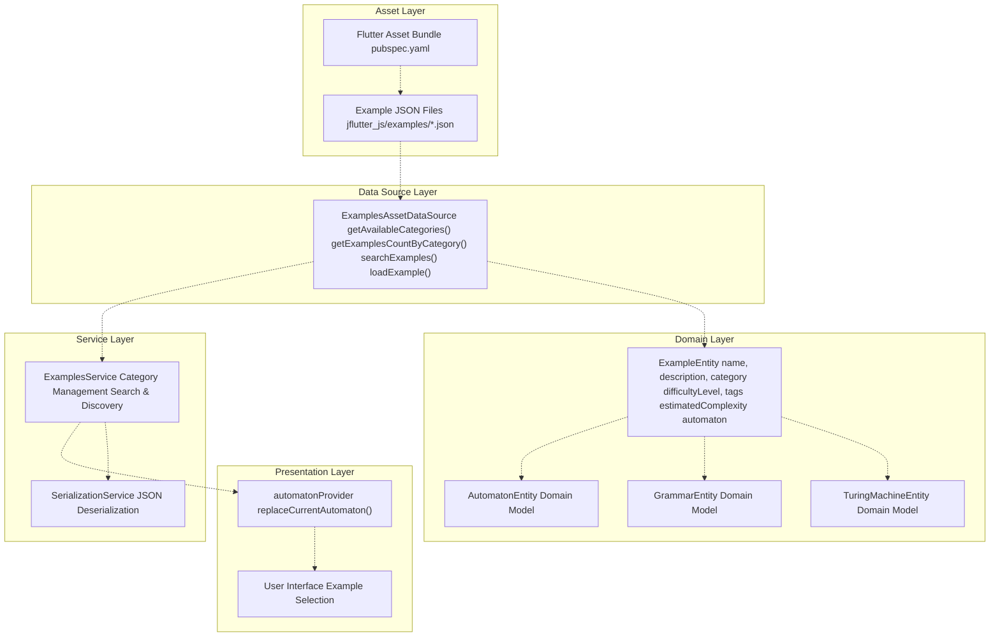
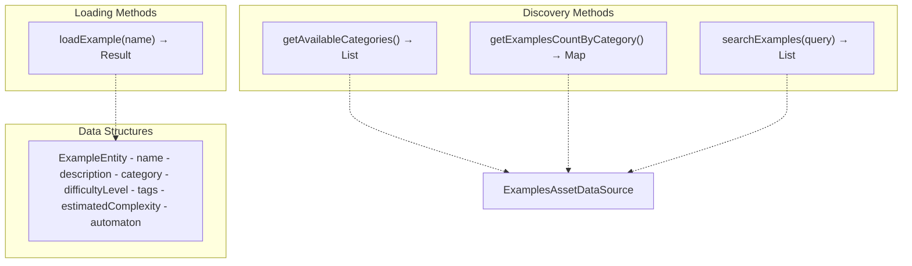
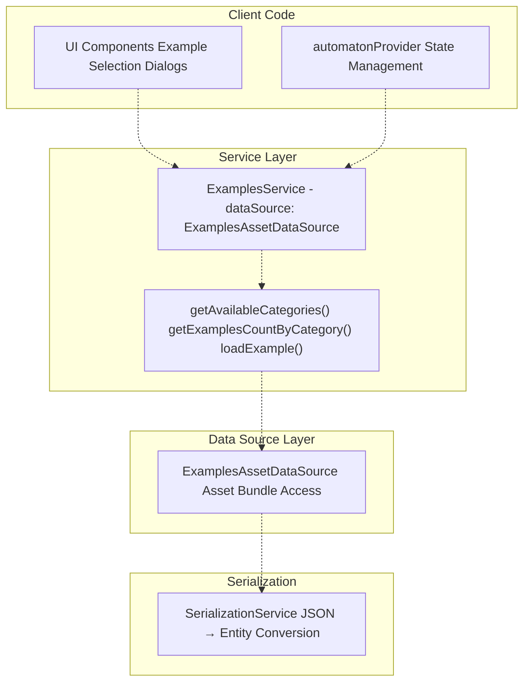
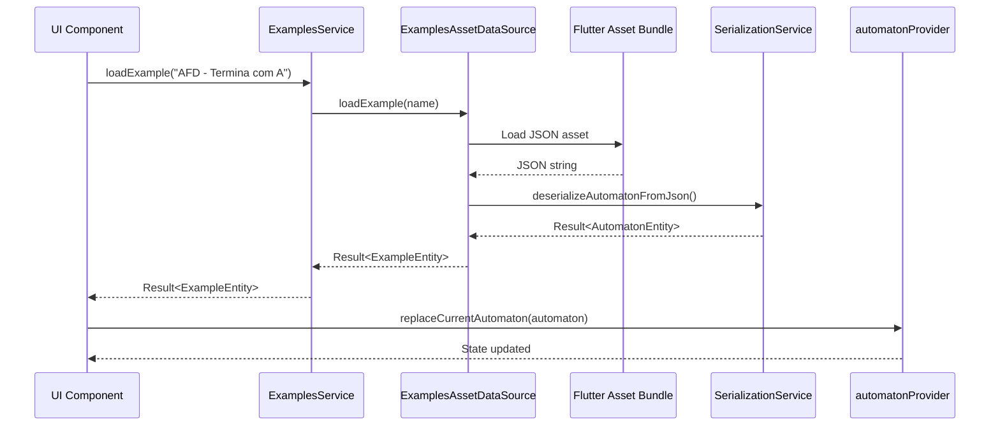
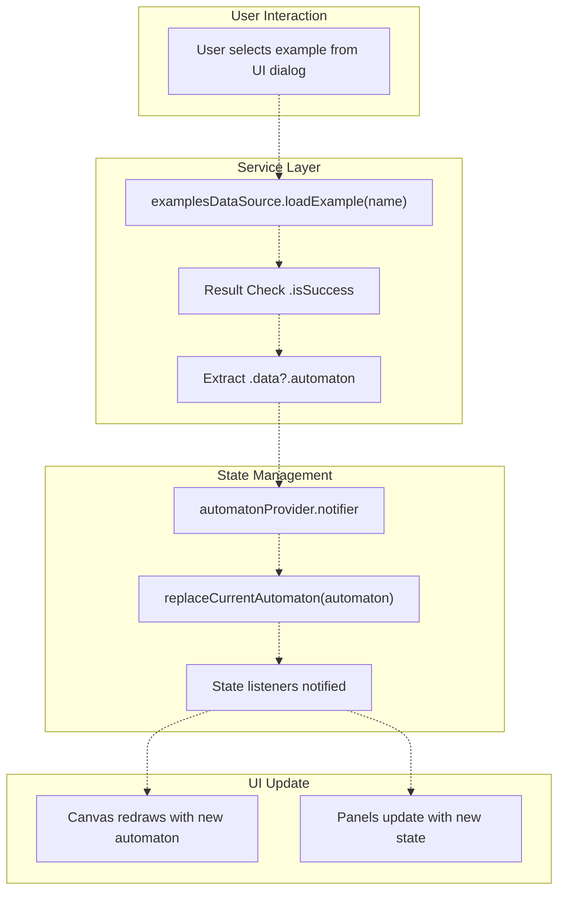
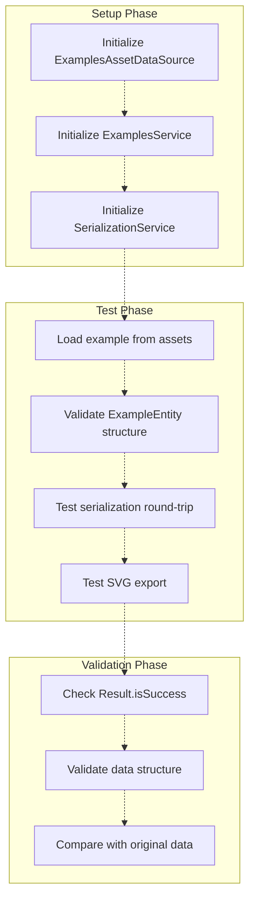

# Examples and Learning Features

> **Relevant source files**
> * [integration_test/app_simulation_test.dart](https://github.com/ThalesMMS/JFlutter/blob/32e808b4/integration_test/app_simulation_test.dart)
> * [integration_test/driver.dart](https://github.com/ThalesMMS/JFlutter/blob/32e808b4/integration_test/driver.dart)
> * [lib/core/entities/automaton_entity.dart](https://github.com/ThalesMMS/JFlutter/blob/32e808b4/lib/core/entities/automaton_entity.dart)
> * [lib/data/repositories/automaton_repository_impl.dart](https://github.com/ThalesMMS/JFlutter/blob/32e808b4/lib/data/repositories/automaton_repository_impl.dart)
> * [lib/data/services/automaton_service.dart](https://github.com/ThalesMMS/JFlutter/blob/32e808b4/lib/data/services/automaton_service.dart)
> * [lib/data/services/serialization_service.dart](https://github.com/ThalesMMS/JFlutter/blob/32e808b4/lib/data/services/serialization_service.dart)
> * [pubspec.lock](https://github.com/ThalesMMS/JFlutter/blob/32e808b4/pubspec.lock)
> * [pubspec.yaml](https://github.com/ThalesMMS/JFlutter/blob/32e808b4/pubspec.yaml)
> * [test/core/services/simulation_highlight_service_test.dart](https://github.com/ThalesMMS/JFlutter/blob/32e808b4/test/core/services/simulation_highlight_service_test.dart)
> * [test/integration/io/examples_roundtrip_test.dart](https://github.com/ThalesMMS/JFlutter/blob/32e808b4/test/integration/io/examples_roundtrip_test.dart)
> * [test/integration/io/interoperability_roundtrip_test.dart](https://github.com/ThalesMMS/JFlutter/blob/32e808b4/test/integration/io/interoperability_roundtrip_test.dart)

This document describes JFlutter's embedded examples library and educational features that support formal language theory learning. The examples system provides pre-built automata, grammars, and Turing machines with educational metadata for classification and discovery. For file import/export operations, see [Import and Export System](9%20Import-and-Export-System.md).

**Sources:** [test/integration/io/examples_roundtrip_test.dart L1-L820](https://github.com/ThalesMMS/JFlutter/blob/32e808b4/test/integration/io/examples_roundtrip_test.dart#L1-L820)

 [pubspec.yaml L118-L131](https://github.com/ThalesMMS/JFlutter/blob/32e808b4/pubspec.yaml#L118-L131)

---

## Examples Library Architecture

The examples library provides curated educational content embedded in the application bundle. The system consists of asset data sources, service layers, and metadata structures that enable categorization, search, and difficulty-based filtering.

### Component Overview



**Sources:** [test/integration/io/examples_roundtrip_test.dart L94-L281](https://github.com/ThalesMMS/JFlutter/blob/32e808b4/test/integration/io/examples_roundtrip_test.dart#L94-L281)

 [integration_test/app_simulation_test.dart L1-L72](https://github.com/ThalesMMS/JFlutter/blob/32e808b4/integration_test/app_simulation_test.dart#L1-L72)

---

## Example Categories and Metadata

Examples are classified by category, difficulty level, and computational complexity to support progressive learning paths.

### Category System

| Category | Display Name | Full Name | Description |
| --- | --- | --- | --- |
| `ExampleCategory.dfa` | DFA | Deterministic Finite Automaton | Finite automata without non-determinism |
| `ExampleCategory.nfa` | NFA | Non-deterministic Finite Automaton | Includes epsilon transitions |
| `ExampleCategory.cfg` | CFG | Context-Free Grammar | Grammar-based language definitions |
| `ExampleCategory.pda` | PDA | Pushdown Automaton | Automata with stack memory |
| `ExampleCategory.tm` | TM | Turing Machine | Full computational model |

**Sources:** [test/integration/io/examples_roundtrip_test.dart L104-L178](https://github.com/ThalesMMS/JFlutter/blob/32e808b4/test/integration/io/examples_roundtrip_test.dart#L104-L178)

 [test/integration/io/examples_roundtrip_test.dart L247-L259](https://github.com/ThalesMMS/JFlutter/blob/32e808b4/test/integration/io/examples_roundtrip_test.dart#L247-L259)

### Difficulty Levels

| Level | Display Name | Description | Target Audience |
| --- | --- | --- | --- |
| `DifficultyLevel.easy` | Fácil | Exemplos para iniciantes | Beginners with no prior knowledge |
| `DifficultyLevel.medium` | Médio | Conhecimento prévio necessário | Intermediate students |
| `DifficultyLevel.hard` | Difícil | Para estudantes avançados | Advanced learners |

**Sources:** [test/integration/io/examples_roundtrip_test.dart L154-L234](https://github.com/ThalesMMS/JFlutter/blob/32e808b4/test/integration/io/examples_roundtrip_test.dart#L154-L234)

### Complexity Levels

| Level | Display Name | Description | Characteristics |
| --- | --- | --- | --- |
| `ComplexityLevel.low` | Baixa | Estruturas simples | Few states and transitions |
| `ComplexityLevel.medium` | Média | Complexidade moderada | Moderate size and structure |
| `ComplexityLevel.high` | Alta | Estruturas complexas | Many states, intricate patterns |

**Sources:** [test/integration/io/examples_roundtrip_test.dart L236-L245](https://github.com/ThalesMMS/JFlutter/blob/32e808b4/test/integration/io/examples_roundtrip_test.dart#L236-L245)

---

## Embedded Example Assets

Examples are stored as JSON files in the application bundle, declared in `pubspec.yaml` and loaded at runtime.

### Asset Manifest

```yaml
assets:  # Finite automata examples  - jflutter_js/examples/afd_binary_divisible_by_3.json  - jflutter_js/examples/afd_ends_with_a.json  - jflutter_js/examples/afd_parity_AB.json  - jflutter_js/examples/afn_lambda_a_or_ab.json    # Context-free grammar examples  - jflutter_js/examples/glc_balanced_parentheses.json  - jflutter_js/examples/glc_palindrome.json    # Pushdown automaton example  - jflutter_js/examples/apda_palindrome.json    # Turing machine example  - jflutter_js/examples/tm_binary_to_unary.json
```

**Sources:** [pubspec.yaml L118-L131](https://github.com/ThalesMMS/JFlutter/blob/32e808b4/pubspec.yaml#L118-L131)

### Example Naming Convention

| Prefix | Category | Example |
| --- | --- | --- |
| `afd_` | Deterministic Finite Automaton | `afd_ends_with_a.json` |
| `afn_` | Non-deterministic Finite Automaton | `afn_lambda_a_or_ab.json` |
| `glc_` | Context-Free Grammar | `glc_palindrome.json` |
| `apda_` | Pushdown Automaton | `apda_palindrome.json` |
| `tm_` | Turing Machine | `tm_binary_to_unary.json` |

**Sources:** [pubspec.yaml L119-L131](https://github.com/ThalesMMS/JFlutter/blob/32e808b4/pubspec.yaml#L119-L131)

---

## ExamplesAssetDataSource

The `ExamplesAssetDataSource` class provides direct access to embedded example assets through Flutter's asset bundle system.

### Core Methods



**Sources:** [test/integration/io/examples_roundtrip_test.dart L104-L150](https://github.com/ThalesMMS/JFlutter/blob/32e808b4/test/integration/io/examples_roundtrip_test.dart#L104-L150)

 [test/integration/io/examples_roundtrip_test.dart L261-L273](https://github.com/ThalesMMS/JFlutter/blob/32e808b4/test/integration/io/examples_roundtrip_test.dart#L261-L273)

### Category Discovery

```
// Get all available categoriesfinal categories = dataSource.getAvailableCategories();// Returns: [ExampleCategory.dfa, ExampleCategory.nfa, //           ExampleCategory.cfg, ExampleCategory.pda, //           ExampleCategory.tm]// Get example count per categoryfinal counts = dataSource.getExamplesCountByCategory();// Returns: {ExampleCategory.dfa: 3, ExampleCategory.nfa: 1, ...}
```

**Sources:** [test/integration/io/examples_roundtrip_test.dart L104-L124](https://github.com/ThalesMMS/JFlutter/blob/32e808b4/test/integration/io/examples_roundtrip_test.dart#L104-L124)

### Search Functionality

```
// Search examples by keywordfinal results = dataSource.searchExamples('dfa');// Returns: ['AFD - Termina com A', 'AFD - Binário divisível por 3', ...]
```

The search method performs case-insensitive substring matching across example names, descriptions, and tags.

**Sources:** [test/integration/io/examples_roundtrip_test.dart L126-L131](https://github.com/ThalesMMS/JFlutter/blob/32e808b4/test/integration/io/examples_roundtrip_test.dart#L126-L131)

---

## ExamplesService

The `ExamplesService` wraps `ExamplesAssetDataSource` and provides additional business logic for example management.

### Service Architecture



**Sources:** [test/integration/io/examples_roundtrip_test.dart L96-L101](https://github.com/ThalesMMS/JFlutter/blob/32e808b4/test/integration/io/examples_roundtrip_test.dart#L96-L101)

 [test/integration/io/examples_roundtrip_test.dart L179-L195](https://github.com/ThalesMMS/JFlutter/blob/32e808b4/test/integration/io/examples_roundtrip_test.dart#L179-L195)

### Loading Examples

The typical flow for loading an example into the application:



**Sources:** [integration_test/app_simulation_test.dart L33-L45](https://github.com/ThalesMMS/JFlutter/blob/32e808b4/integration_test/app_simulation_test.dart#L33-L45)

---

## ExampleEntity Data Structure

The `ExampleEntity` class encapsulates all metadata and content for a single example.

### Structure Definition

| Field | Type | Description |
| --- | --- | --- |
| `name` | `String` | Display name of the example |
| `description` | `String` | Educational description |
| `category` | `String` | Category identifier (e.g., "DFA") |
| `subcategory` | `String` | Sub-classification within category |
| `difficultyLevel` | `DifficultyLevel` | Easy, Medium, or Hard |
| `tags` | `List<String>` | Searchable keywords |
| `estimatedComplexity` | `ComplexityLevel` | Low, Medium, or High |
| `automaton` | `AutomatonEntity?` | Loaded automaton instance |

**Sources:** [test/integration/io/examples_roundtrip_test.dart L135-L150](https://github.com/ThalesMMS/JFlutter/blob/32e808b4/test/integration/io/examples_roundtrip_test.dart#L135-L150)

 [test/integration/io/examples_roundtrip_test.dart L198-L217](https://github.com/ThalesMMS/JFlutter/blob/32e808b4/test/integration/io/examples_roundtrip_test.dart#L198-L217)

### Example Metadata Usage

```
const example = ExampleEntity(  name: 'AFD - Termina com A',  description: 'Aceita strings que terminam com o símbolo "a"',  category: 'DFA',  subcategory: 'Basic',  difficultyLevel: DifficultyLevel.easy,  tags: ['dfa', 'suffix', 'basic'],  estimatedComplexity: ComplexityLevel.low,  automaton: null, // Loaded lazily from asset);
```

**Sources:** [test/integration/io/examples_roundtrip_test.dart L135-L150](https://github.com/ThalesMMS/JFlutter/blob/32e808b4/test/integration/io/examples_roundtrip_test.dart#L135-L150)

---

## Integration with Application State

Examples integrate with the application's state management system through Riverpod providers.

### Loading Flow



**Sources:** [integration_test/app_simulation_test.dart L33-L46](https://github.com/ThalesMMS/JFlutter/blob/32e808b4/integration_test/app_simulation_test.dart#L33-L46)

### Integration Test Example

The following integration test demonstrates the complete flow from example loading to simulation:

```
// Load example from assetfinal exampleResult = await examplesDataSource.loadExample('AFD - Termina com A');expect(exampleResult.isSuccess, isTrue);// Extract automaton from examplefinal automaton = exampleResult.data?.automaton;expect(automaton, isNotNull);// Replace current automaton in state providercontainer.read(automatonProvider.notifier).replaceCurrentAutomaton(automaton!);await tester.pumpAndSettle();// Automaton is now loaded and ready for simulation
```

**Sources:** [integration_test/app_simulation_test.dart L33-L46](https://github.com/ThalesMMS/JFlutter/blob/32e808b4/integration_test/app_simulation_test.dart#L33-L46)

---

## Serialization and Round-Trip Testing

Examples undergo rigorous round-trip testing to ensure data integrity across serialization formats.

### Test Coverage Matrix

| Format | Serialization | Deserialization | Round-Trip | Validation |
| --- | --- | --- | --- | --- |
| JFLAP XML | ✓ | ✓ | ✓ | ✓ |
| JSON | ✓ | ✓ | ✓ | ✓ |
| SVG Export | ✓ | N/A | N/A | ✓ |

**Sources:** [test/integration/io/examples_roundtrip_test.dart L283-L493](https://github.com/ThalesMMS/JFlutter/blob/32e808b4/test/integration/io/examples_roundtrip_test.dart#L283-L493)

### Round-Trip Testing

The `SerializationService` provides `roundTripTest()` and `validateRoundTrip()` methods to ensure examples maintain structural integrity:

```
// Test JFLAP round-tripfinal jflapResult = serializationService.roundTripTest(  originalData,  SerializationFormat.jflap,);expect(jflapResult.isSuccess, isTrue);// Validate data preservationfinal isValid = serializationService.validateRoundTrip(  originalData,  jflapResult.data!,);expect(isValid, isTrue);
```

**Sources:** [test/integration/io/examples_roundtrip_test.dart L411-L453](https://github.com/ThalesMMS/JFlutter/blob/32e808b4/test/integration/io/examples_roundtrip_test.dart#L411-L453)

 [lib/data/services/serialization_service.dart L258-L296](https://github.com/ThalesMMS/JFlutter/blob/32e808b4/lib/data/services/serialization_service.dart#L258-L296)

---

## SVG Export for Examples

Examples can be exported to SVG format for visual documentation and presentation.

### SVG Export Methods

| Entity Type | Export Method | Features |
| --- | --- | --- |
| `AutomatonEntity` | `SvgExporter.exportAutomatonToSvg()` | States, transitions, labels |
| `TuringMachineEntity` | `SvgExporter.exportTuringMachineToSvg()` | Tape visualization, head, legend |
| `GrammarEntity` | `SvgExporter.exportGrammarToSvg()` | Production rules, tree structure |

**Sources:** [test/integration/io/examples_roundtrip_test.dart L496-L699](https://github.com/ThalesMMS/JFlutter/blob/32e808b4/test/integration/io/examples_roundtrip_test.dart#L496-L699)

### SVG Export Options

```
const options = SvgExportOptions(  includeTitle: true,      // Add automaton name as SVG title  includeLegend: true,     // Add transition notation legend  scale: 1.5,              // Scale factor for output);final svg = SvgExporter.exportAutomatonToSvg(  automaton,  width: 800,  height: 600,  options: options,);
```

**Sources:** [test/integration/io/examples_roundtrip_test.dart L625-L651](https://github.com/ThalesMMS/JFlutter/blob/32e808b4/test/integration/io/examples_roundtrip_test.dart#L625-L651)

### SVG Structure

Generated SVG files contain:

* XML declaration and SVG root element with viewBox
* `<defs>` section with arrowhead markers and styles
* `<style>` section with CSS for states, transitions, and labels
* `<g>` groups for organized element hierarchy
* State circles with appropriate classes (initial, final)
* Transition paths with labels
* Optional legend explaining notation

**Sources:** [test/integration/io/examples_roundtrip_test.dart L497-L546](https://github.com/ThalesMMS/JFlutter/blob/32e808b4/test/integration/io/examples_roundtrip_test.dart#L497-L546)

 [test/integration/io/examples_roundtrip_test.dart L548-L600](https://github.com/ThalesMMS/JFlutter/blob/32e808b4/test/integration/io/examples_roundtrip_test.dart#L548-L600)

---

## Pumping Lemma Game

The Pumping Lemma Game provides an interactive educational tool for learning the pumping lemma for regular languages. This feature is referenced in the table of contents but implementation details are not present in the provided code samples.

### Expected Features (Based on Architecture)

The Pumping Lemma Game likely includes:

* Interactive proof construction interface
* Step-by-step guidance through pumping lemma application
* Language classification challenges
* Feedback on proof validity
* Progressive difficulty levels

For specific implementation details, refer to the Pumping Lemma Page workspace when implemented.

**Note:** This section is a placeholder based on the table of contents structure. Implementation details were not available in the provided source files.

**Sources:** [pubspec.yaml L1-L174](https://github.com/ThalesMMS/JFlutter/blob/32e808b4/pubspec.yaml#L1-L174)

 (general context only)

---

## Example Usage Patterns

### Pattern 1: Direct Asset Loading

```
// Initialize data sourcefinal dataSource = ExamplesAssetDataSource();// Load specific examplefinal result = await dataSource.loadExample('AFD - Termina com A');if (result.isSuccess) {  final example = result.data!;  final automaton = example.automaton;  // Use automaton...}
```

**Sources:** [integration_test/app_simulation_test.dart L33-L42](https://github.com/ThalesMMS/JFlutter/blob/32e808b4/integration_test/app_simulation_test.dart#L33-L42)

### Pattern 2: Service-Based Loading

```
// Initialize service with data sourcefinal service = ExamplesService(dataSource);// Get available categoriesfinal categories = service.getAvailableCategories();// Get example countsfinal counts = service.getExamplesCountByCategory();// Load examplefinal result = await service.loadExample(exampleName);
```

**Sources:** [test/integration/io/examples_roundtrip_test.dart L96-L101](https://github.com/ThalesMMS/JFlutter/blob/32e808b4/test/integration/io/examples_roundtrip_test.dart#L96-L101)

 [test/integration/io/examples_roundtrip_test.dart L179-L194](https://github.com/ThalesMMS/JFlutter/blob/32e808b4/test/integration/io/examples_roundtrip_test.dart#L179-L194)

### Pattern 3: Search and Discovery

```
// Search for examples by keywordfinal searchResults = dataSource.searchExamples('palindrome');// Iterate through resultsfor (final exampleName in searchResults) {  final result = await dataSource.loadExample(exampleName);  if (result.isSuccess) {    // Process example...  }}
```

**Sources:** [test/integration/io/examples_roundtrip_test.dart L126-L131](https://github.com/ThalesMMS/JFlutter/blob/32e808b4/test/integration/io/examples_roundtrip_test.dart#L126-L131)

---

## Testing Infrastructure

The examples library includes comprehensive integration tests covering asset loading, serialization, and round-trip validation.

### Test Categories

| Test Suite | File | Focus |
| --- | --- | --- |
| Round-Trip Tests | `examples_roundtrip_test.dart` | Serialization integrity |
| Integration Tests | `app_simulation_test.dart` | End-to-end example loading |
| Interoperability Tests | `interoperability_roundtrip_test.dart` | Format conversion |

**Sources:** [test/integration/io/examples_roundtrip_test.dart L1-L820](https://github.com/ThalesMMS/JFlutter/blob/32e808b4/test/integration/io/examples_roundtrip_test.dart#L1-L820)

 [integration_test/app_simulation_test.dart L1-L72](https://github.com/ThalesMMS/JFlutter/blob/32e808b4/integration_test/app_simulation_test.dart#L1-L72)

 [test/integration/io/interoperability_roundtrip_test.dart L1-L100](https://github.com/ThalesMMS/JFlutter/blob/32e808b4/test/integration/io/interoperability_roundtrip_test.dart#L1-L100)

### Test Execution Flow



**Sources:** [test/integration/io/examples_roundtrip_test.dart L93-L281](https://github.com/ThalesMMS/JFlutter/blob/32e808b4/test/integration/io/examples_roundtrip_test.dart#L93-L281)

 [test/integration/io/examples_roundtrip_test.dart L283-L493](https://github.com/ThalesMMS/JFlutter/blob/32e808b4/test/integration/io/examples_roundtrip_test.dart#L283-L493)


### On this page

* [Examples and Learning Features](10%20Examples-and-Learning-Features.md)
* [Examples Library Architecture](10%20Examples-and-Learning-Features.md)
* [Component Overview](10%20Examples-and-Learning-Features.md)
* [Example Categories and Metadata](10%20Examples-and-Learning-Features.md)
* [Category System](10%20Examples-and-Learning-Features.md)
* [Difficulty Levels](10%20Examples-and-Learning-Features.md)
* [Complexity Levels](10%20Examples-and-Learning-Features.md)
* [Embedded Example Assets](10%20Examples-and-Learning-Features.md)
* [Asset Manifest](10%20Examples-and-Learning-Features.md)
* [Example Naming Convention](10%20Examples-and-Learning-Features.md)
* [ExamplesAssetDataSource](10%20Examples-and-Learning-Features.md)
* [Core Methods](10%20Examples-and-Learning-Features.md)
* [Category Discovery](10%20Examples-and-Learning-Features.md)
* [Search Functionality](10%20Examples-and-Learning-Features.md)
* [ExamplesService](10%20Examples-and-Learning-Features.md)
* [Service Architecture](10%20Examples-and-Learning-Features.md)
* [Loading Examples](10%20Examples-and-Learning-Features.md)
* [ExampleEntity Data Structure](10%20Examples-and-Learning-Features.md)
* [Structure Definition](10%20Examples-and-Learning-Features.md)
* [Example Metadata Usage](10%20Examples-and-Learning-Features.md)
* [Integration with Application State](10%20Examples-and-Learning-Features.md)
* [Loading Flow](10%20Examples-and-Learning-Features.md)
* [Integration Test Example](10%20Examples-and-Learning-Features.md)
* [Serialization and Round-Trip Testing](10%20Examples-and-Learning-Features.md)
* [Test Coverage Matrix](10%20Examples-and-Learning-Features.md)
* [Round-Trip Testing](10%20Examples-and-Learning-Features.md)
* [SVG Export for Examples](10%20Examples-and-Learning-Features.md)
* [SVG Export Methods](10%20Examples-and-Learning-Features.md)
* [SVG Export Options](10%20Examples-and-Learning-Features.md)
* [SVG Structure](10%20Examples-and-Learning-Features.md)
* [Pumping Lemma Game](10%20Examples-and-Learning-Features.md)
* [Expected Features (Based on Architecture)](10%20Examples-and-Learning-Features.md)
* [Example Usage Patterns](10%20Examples-and-Learning-Features.md)
* [Pattern 1: Direct Asset Loading](10%20Examples-and-Learning-Features.md)
* [Pattern 2: Service-Based Loading](10%20Examples-and-Learning-Features.md)
* [Pattern 3: Search and Discovery](10%20Examples-and-Learning-Features.md)
* [Testing Infrastructure](10%20Examples-and-Learning-Features.md)
* [Test Categories](10%20Examples-and-Learning-Features.md)
* [Test Execution Flow](10%20Examples-and-Learning-Features.md)

Ask Devin about JFlutter