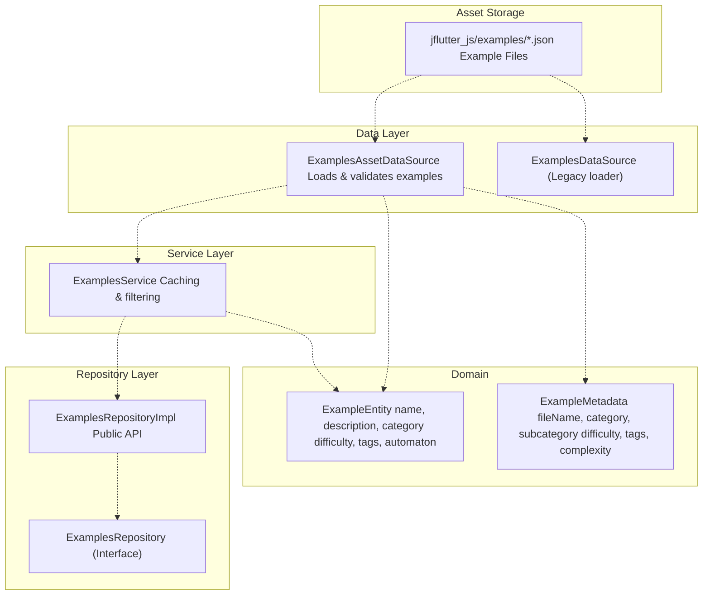
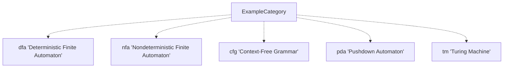
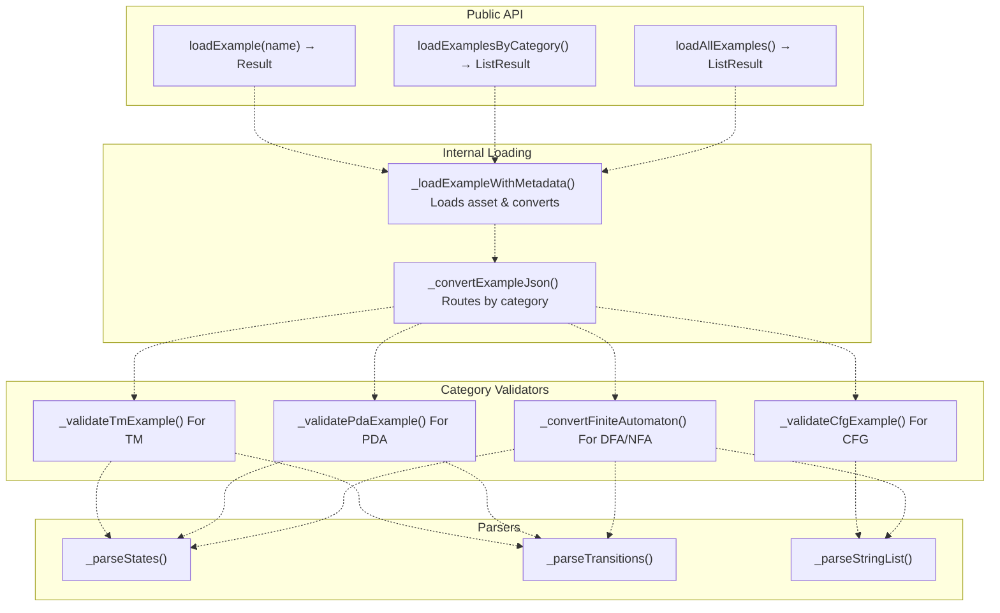
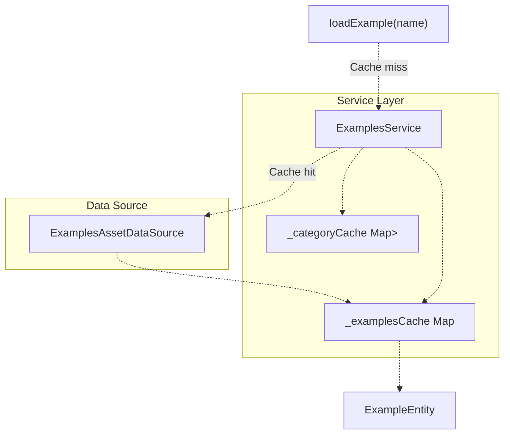
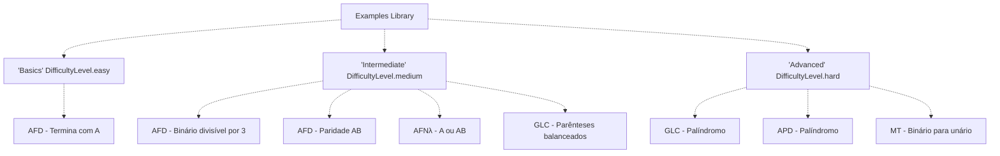
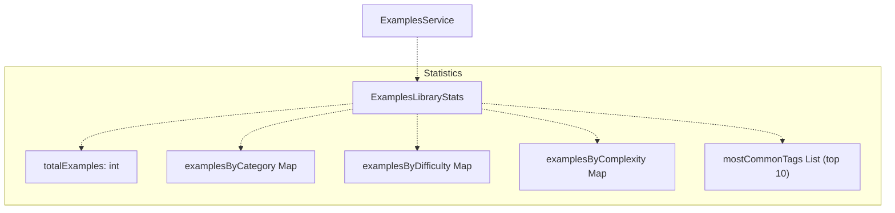
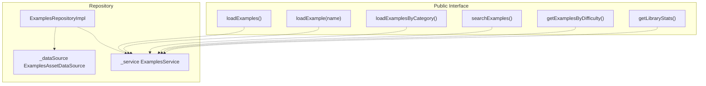

# Examples Library

> **Relevant source files**
> * [lib/core/entities/automaton_entity.dart](https://github.com/ThalesMMS/JFlutter/blob/32e808b4/lib/core/entities/automaton_entity.dart)
> * [lib/core/parsers/jflap_xml_parser.dart](https://github.com/ThalesMMS/JFlutter/blob/32e808b4/lib/core/parsers/jflap_xml_parser.dart)
> * [lib/data/repositories/automaton_repository_impl.dart](https://github.com/ThalesMMS/JFlutter/blob/32e808b4/lib/data/repositories/automaton_repository_impl.dart)
> * [lib/data/services/automaton_service.dart](https://github.com/ThalesMMS/JFlutter/blob/32e808b4/lib/data/services/automaton_service.dart)
> * [lib/data/services/serialization_service.dart](https://github.com/ThalesMMS/JFlutter/blob/32e808b4/lib/data/services/serialization_service.dart)
> * [lib/presentation/pages/fsa_page.dart](https://github.com/ThalesMMS/JFlutter/blob/32e808b4/lib/presentation/pages/fsa_page.dart)
> * [lib/presentation/pages/grammar_page.dart](https://github.com/ThalesMMS/JFlutter/blob/32e808b4/lib/presentation/pages/grammar_page.dart)
> * [lib/presentation/pages/pda_page.dart](https://github.com/ThalesMMS/JFlutter/blob/32e808b4/lib/presentation/pages/pda_page.dart)
> * [lib/presentation/pages/pumping_lemma_page.dart](https://github.com/ThalesMMS/JFlutter/blob/32e808b4/lib/presentation/pages/pumping_lemma_page.dart)
> * [lib/presentation/pages/regex_page.dart](https://github.com/ThalesMMS/JFlutter/blob/32e808b4/lib/presentation/pages/regex_page.dart)
> * [lib/presentation/pages/tm_page.dart](https://github.com/ThalesMMS/JFlutter/blob/32e808b4/lib/presentation/pages/tm_page.dart)
> * [lib/presentation/widgets/tablet_layout_container.dart](https://github.com/ThalesMMS/JFlutter/blob/32e808b4/lib/presentation/widgets/tablet_layout_container.dart)
> * [test/core/services/simulation_highlight_service_test.dart](https://github.com/ThalesMMS/JFlutter/blob/32e808b4/test/core/services/simulation_highlight_service_test.dart)
> * [test/integration/io/examples_roundtrip_test.dart](https://github.com/ThalesMMS/JFlutter/blob/32e808b4/test/integration/io/examples_roundtrip_test.dart)
> * [test/integration/io/interoperability_roundtrip_test.dart](https://github.com/ThalesMMS/JFlutter/blob/32e808b4/test/integration/io/interoperability_roundtrip_test.dart)
> * [test/tablet_layout_test.dart](https://github.com/ThalesMMS/JFlutter/blob/32e808b4/test/tablet_layout_test.dart)

This document describes the Examples Library system, which provides pre-built automaton examples for educational purposes. The library includes over 8 example automatons across five categories (DFA, NFA, CFG, PDA, TM), each with metadata for categorization, difficulty assessment, and search functionality.

For information about how examples are used in the UI, see the Pumping Lemma Game [10.2](10b%20Pumping-Lemma-Game.md). For loading and saving user-created automatons, see File Operations [9.1](9a%20File-Operations-Panel.md).

## System Overview

The Examples Library consists of three main components: a data source that loads examples from JSON assets, a service layer that provides caching and filtering, and a repository that exposes the functionality to the application.



Sources: [lib/data/data_sources/examples_asset_data_source.dart L1-L676](https://github.com/ThalesMMS/JFlutter/blob/32e808b4/lib/data/data_sources/examples_asset_data_source.dart#L1-L676)

 [lib/data/services/examples_service.dart L1-L302](https://github.com/ThalesMMS/JFlutter/blob/32e808b4/lib/data/services/examples_service.dart#L1-L302)

 [lib/data/repositories/examples_repository_impl.dart L1-L68](https://github.com/ThalesMMS/JFlutter/blob/32e808b4/lib/data/repositories/examples_repository_impl.dart#L1-L68)

## Example Metadata System

Each example in the library is described by an `ExampleMetadata` object that provides classification and discovery information.

### Metadata Structure

| Field | Type | Purpose |
| --- | --- | --- |
| `fileName` | `String` | Asset file name (e.g., `'afd_ends_with_a.json'`) |
| `category` | `ExampleCategory` | Primary type (DFA, NFA, CFG, PDA, TM) |
| `subcategory` | `String` | Educational grouping (e.g., `'Basic Patterns'`, `'Stack Verification'`) |
| `difficulty` | `DifficultyLevel` | User skill level (easy, medium, hard) |
| `description` | `String` | Human-readable explanation |
| `tags` | `List<String>` | Searchable keywords |
| `estimatedComplexity` | `ComplexityLevel` | Computational complexity (low, medium, high) |

### Category Enumeration

The `ExampleCategory` enum defines the five automaton types supported by the library:



Sources: [lib/data/data_sources/examples_asset_data_source.dart L642-L675](https://github.com/ThalesMMS/JFlutter/blob/32e808b4/lib/data/data_sources/examples_asset_data_source.dart#L642-L675)

### Example Metadata Registry

The `_exampleMetadata` map in `ExamplesAssetDataSource` serves as the central registry for all examples. Each entry maps a display name to its metadata:

| Example Name | Category | Subcategory | Difficulty |
| --- | --- | --- | --- |
| `'AFD - Termina com A'` | DFA | Basic Patterns | Easy |
| `'AFD - Binário divisível por 3'` | DFA | Number Theory | Medium |
| `'AFD - Paridade AB'` | DFA | Counting | Medium |
| `'AFNλ - A ou AB'` | NFA | Epsilon Transitions | Medium |
| `'GLC - Palíndromo'` | CFG | Recursive Structures | Hard |
| `'GLC - Parênteses balanceados'` | CFG | Stack Simulation | Medium |
| `'APD - Palíndromo'` | PDA | Stack Verification | Hard |
| `'MT - Binário para unário'` | TM | Number Conversion | Hard |

Sources: [lib/data/data_sources/examples_asset_data_source.dart L18-L108](https://github.com/ThalesMMS/JFlutter/blob/32e808b4/lib/data/data_sources/examples_asset_data_source.dart#L18-L108)

## Data Source Architecture

### ExamplesAssetDataSource

The `ExamplesAssetDataSource` class is the primary loader for the enhanced Examples v1 system. It loads JSON files from the `jflutter_js/examples/` directory and validates them according to their category.



Sources: [lib/data/data_sources/examples_asset_data_source.dart L110-L606](https://github.com/ThalesMMS/JFlutter/blob/32e808b4/lib/data/data_sources/examples_asset_data_source.dart#L110-L606)

### Loading Process

The loading process follows these steps:

1. **Asset Resolution** - Constructs path `'jflutter_js/examples/${metadata.fileName}'`
2. **JSON Parsing** - Uses `rootBundle.loadString()` and `jsonDecode()`
3. **Category Routing** - Routes to appropriate validator based on `metadata.category`
4. **Validation** - Validates structure and required fields for the automaton type
5. **Entity Creation** - Creates `ExampleEntity` with metadata and optional `AutomatonModel`

For finite automata (DFA/NFA), the loader produces an `AutomatonModel`. For grammars, PDAs, and TMs, validation succeeds but returns `null` for the automaton model, as these require specialized handling in their respective editors.

Sources: [lib/data/data_sources/examples_asset_data_source.dart L174-L234](https://github.com/ThalesMMS/JFlutter/blob/32e808b4/lib/data/data_sources/examples_asset_data_source.dart#L174-L234)

### Validation Rules by Category

**Finite Automaton (DFA/NFA):**

* Required: `states`, `transitions`, `alphabet`, `initialId`
* Parsed into `AutomatonModel` with full structure

**Context-Free Grammar (CFG):**

* Required: `variables`, `alphabet`, `initialSymbol`, `productions`
* Validates production rules are properly formatted
* Returns `null` for automaton (handled by Grammar Editor)

**Pushdown Automaton (PDA):**

* Required: `states`, `transitions`, `stackAlphabet`, `initialStack`, `initialId`, `finalStates`
* Transitions use format `"state|symbol|stackTop": ["targetState|stackReplacement"]`
* Returns `null` for automaton (handled by PDA Editor)

**Turing Machine (TM):**

* Required: `states`, `transitions`, `alphabet`, `tapeAlphabet`, `initialId`, `finalStates`
* Returns `null` for automaton (handled by TM Editor)

Sources: [lib/data/data_sources/examples_asset_data_source.dart L236-L499](https://github.com/ThalesMMS/JFlutter/blob/32e808b4/lib/data/data_sources/examples_asset_data_source.dart#L236-L499)

## ExamplesService: Caching and Orchestration

The `ExamplesService` class wraps `ExamplesAssetDataSource` to provide caching, filtering, and higher-level operations.

### Caching Strategy



The service maintains two caches:

* **Name-based cache** (`_examplesCache`): Maps example name → `ExampleEntity`
* **Category cache** (`_categoryCache`): Maps `ExampleCategory` → list of examples

Cache behavior:

* First access loads from assets and populates cache
* Subsequent accesses return cached data immediately
* `clearCache()` empties both caches for memory management or updates
* `preloadAllExamples()` eagerly loads entire library into cache

Sources: [lib/data/services/examples_service.dart L14-L218](https://github.com/ThalesMMS/JFlutter/blob/32e808b4/lib/data/services/examples_service.dart#L14-L218)

## Filtering and Search Operations

### Search by Query String

The `searchExamples(String query)` method searches across three fields:

* Example name (case-insensitive)
* Description (case-insensitive)
* Tags array (any matching tag)

Implementation delegates to `ExamplesAssetDataSource.searchExamples()` which returns matching names, then loads the full entities.

Sources: [lib/data/services/examples_service.dart L80-L93](https://github.com/ThalesMMS/JFlutter/blob/32e808b4/lib/data/services/examples_service.dart#L80-L93)

 [lib/data/data_sources/examples_asset_data_source.dart L623-L639](https://github.com/ThalesMMS/JFlutter/blob/32e808b4/lib/data/data_sources/examples_asset_data_source.dart#L623-L639)

### Filtering Methods

| Method | Filter Criteria | Returns |
| --- | --- | --- |
| `getExamplesByDifficulty()` | `difficultyLevel` field | Examples matching difficulty |
| `getExamplesByComplexity()` | `estimatedComplexity` field | Examples matching complexity |
| `getExamplesByTags()` | Intersection with `tags` array | Examples with any matching tag |
| `getBeginnerExamples()` | `DifficultyLevel.easy`, limited to 3 | First 3 easy examples |
| `getAdvancedExamples()` | `DifficultyLevel.hard` | All hard examples |

### Learning Path Organization

The `getExamplesByLearningPath()` method groups examples into three tiers:



Sources: [lib/data/services/examples_service.dart L95-L187](https://github.com/ThalesMMS/JFlutter/blob/32e808b4/lib/data/services/examples_service.dart#L95-L187)

## Library Statistics

The `ExamplesLibraryStats` class aggregates metrics about the example collection:



The service computes statistics by:

1. Loading all examples via `loadAllExamples()`
2. Counting examples by category (from data source metadata)
3. Counting examples by difficulty (iterating examples)
4. Counting examples by complexity (iterating examples)
5. Aggregating and ranking tags (top 10 by frequency)

Sources: [lib/data/services/examples_service.dart L189-L254](https://github.com/ThalesMMS/JFlutter/blob/32e808b4/lib/data/services/examples_service.dart#L189-L254)

 [lib/data/services/examples_service.dart L256-L301](https://github.com/ThalesMMS/JFlutter/blob/32e808b4/lib/data/services/examples_service.dart#L256-L301)

## Example File Format

Example files are stored as JSON in the `jflutter_js/examples/` directory. The structure varies by automaton type.

### Finite Automaton Format (DFA/NFA)

```
{  "id": "example_afd_ends_with_a",  "name": "AFD - Termina com A",  "type": "dfa",  "alphabet": ["a", "b"],  "states": [    {      "id": "q0",      "name": "q0",      "x": 100.0,      "y": 200.0,      "isInitial": true,      "isFinal": false    }  ],  "transitions": {    "q0|a": ["q1"],    "q0|b": ["q0"]  },  "initialId": "q0",  "nextId": 2}
```

### Pushdown Automaton Format (PDA)

The PDA format uses compound transition keys with three components separated by `|`:

**Transition Key Pattern:** `"fromState|inputSymbol|stackTopRequired"`

**Transition Value Pattern:** `["toState|stackReplacement"]`

Example from `apda_palindrome.json`:

```
{  "type": "pda",  "alphabet": ["a", "b"],  "stackAlphabet": ["a", "b", "Z"],  "transitions": {    "q0|a|Z": ["q0|aZ", "q1|Z"],    "q0||a": ["q1|a"],    "q1|a|a": ["q1|"]  },  "initialId": "q0",  "initialStack": ["Z"],  "finalStates": ["q2"]}
```

Key details:

* Empty input symbol (`||`) represents epsilon/lambda transition
* Empty stack replacement (`|`) pops without pushing
* Multiple target states enable non-determinism

Sources: [jflutter_js/examples/apda_palindrome.json L1-L51](https://github.com/ThalesMMS/JFlutter/blob/32e808b4/jflutter_js/examples/apda_palindrome.json#L1-L51)

 [test/unit/data/examples_asset_data_source_test.dart L135-L260](https://github.com/ThalesMMS/JFlutter/blob/32e808b4/test/unit/data/examples_asset_data_source_test.dart#L135-L260)

### Context-Free Grammar Format (CFG)

```
{  "type": "cfg",  "variables": ["S", "A"],  "alphabet": ["a", "b"],  "initialSymbol": "S",  "productions": {    "S": ["aSa", "bSb", "A"],    "A": ["a", "b", ""]  }}
```

### Turing Machine Format (TM)

```
{  "type": "tm",  "alphabet": ["0", "1"],  "tapeAlphabet": ["0", "1", "1", "B"],  "states": [...],  "transitions": {...},  "initialId": "q0",  "finalStates": ["qf"]}
```

Sources: [lib/data/data_sources/examples_asset_data_source.dart L317-L499](https://github.com/ThalesMMS/JFlutter/blob/32e808b4/lib/data/data_sources/examples_asset_data_source.dart#L317-L499)

## Repository Implementation

The `ExamplesRepositoryImpl` class provides the public API by composing the data source and service:



The repository implements the `ExamplesRepository` interface from the core domain layer, providing:

* `loadExamples()` - Returns all examples as `List<ExampleEntity>`
* `loadExample(name)` - Returns specific example's `AutomatonEntity`
* Enhanced methods delegated to `ExamplesService`

Sources: [lib/data/repositories/examples_repository_impl.dart L1-L68](https://github.com/ThalesMMS/JFlutter/blob/32e808b4/lib/data/repositories/examples_repository_impl.dart#L1-L68)

## Testing and Validation

The examples library includes comprehensive validation tests to ensure example files are well-formed and behave correctly.

### Validation Test Coverage

The test suite at [test/unit/data/examples_asset_data_source_test.dart L1-L302](https://github.com/ThalesMMS/JFlutter/blob/32e808b4/test/unit/data/examples_asset_data_source_test.dart#L1-L302)

 validates:

1. **Structure Validation** - Ensures required fields are present for each category
2. **CFG Validation** - Verifies grammar productions are properly formatted
3. **PDA Validation** - Confirms stack operations follow the transition format
4. **TM Validation** - Checks tape alphabet and transition structure
5. **PDA Behavioral Testing** - Simulates PDA execution to verify correct acceptance/rejection

The test suite includes a custom PDA simulator that interprets the transition format and verifies that the palindrome example correctly accepts palindromes like `"aba"`, `"abba"` and rejects non-palindromes like `"ab"`, `"abb"`.

Sources: [test/unit/data/examples_asset_data_source_test.dart L47-L302](https://github.com/ThalesMMS/JFlutter/blob/32e808b4/test/unit/data/examples_asset_data_source_test.dart#L47-L302)

## Usage in Application

The examples library integrates with the application through Riverpod providers and is accessed from various editor pages. Examples can be:

1. **Loaded into editors** - Users select an example to populate the canvas
2. **Used as learning materials** - Examples demonstrate concepts at various difficulty levels
3. **Searched and filtered** - UI allows discovery by category, difficulty, or tags
4. **Analyzed as reference** - Examples show proper construction of complex automatons

The library serves as both a learning resource and a starting point for creating new automatons.


### On this page

* [Examples Library](#10.1-examples-library)
* [System Overview](#10.1-system-overview)
* [Example Metadata System](#10.1-example-metadata-system)
* [Metadata Structure](#10.1-metadata-structure)
* [Category Enumeration](#10.1-category-enumeration)
* [Example Metadata Registry](#10.1-example-metadata-registry)
* [Data Source Architecture](#10.1-data-source-architecture)
* [ExamplesAssetDataSource](#10.1-examplesassetdatasource)
* [Loading Process](#10.1-loading-process)
* [Validation Rules by Category](#10.1-validation-rules-by-category)
* [ExamplesService: Caching and Orchestration](#10.1-examplesservice-caching-and-orchestration)
* [Caching Strategy](#10.1-caching-strategy)
* [Filtering and Search Operations](#10.1-filtering-and-search-operations)
* [Search by Query String](#10.1-search-by-query-string)
* [Filtering Methods](#10.1-filtering-methods)
* [Learning Path Organization](#10.1-learning-path-organization)
* [Library Statistics](#10.1-library-statistics)
* [Example File Format](#10.1-example-file-format)
* [Finite Automaton Format (DFA/NFA)](#10.1-finite-automaton-format-dfanfa)
* [Pushdown Automaton Format (PDA)](#10.1-pushdown-automaton-format-pda)
* [Context-Free Grammar Format (CFG)](#10.1-context-free-grammar-format-cfg)
* [Turing Machine Format (TM)](#10.1-turing-machine-format-tm)
* [Repository Implementation](#10.1-repository-implementation)
* [Testing and Validation](#10.1-testing-and-validation)
* [Validation Test Coverage](#10.1-validation-test-coverage)
* [Usage in Application](#10.1-usage-in-application)

Ask Devin about JFlutter