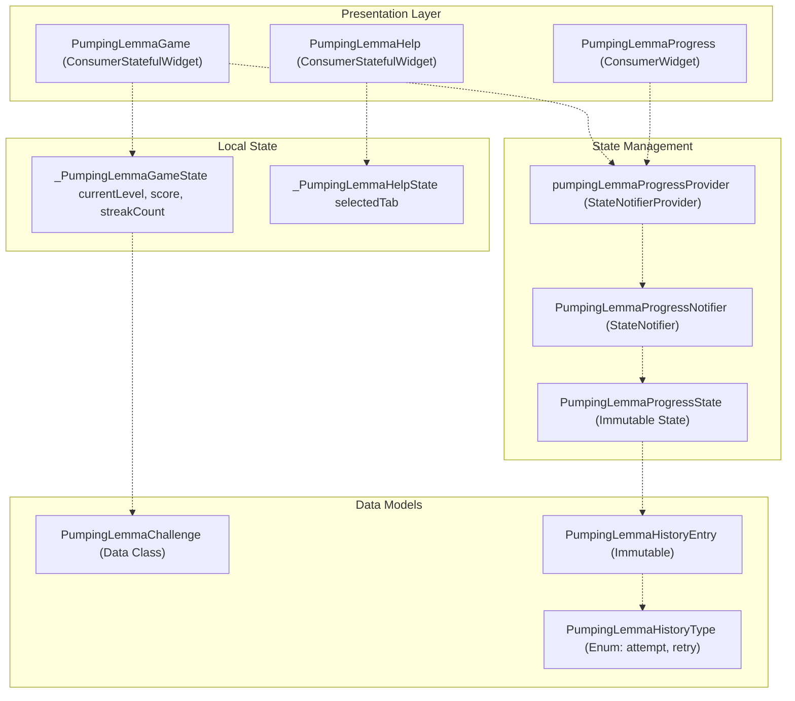
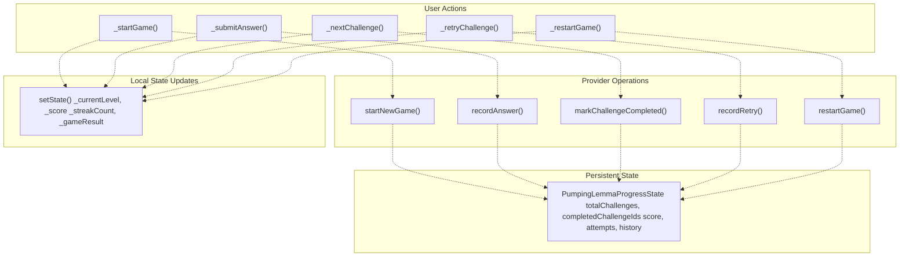

# Pumping Lemma Game

> **Relevant source files**
> * [lib/core/parsers/jflap_xml_parser.dart](https://github.com/ThalesMMS/JFlutter/blob/32e808b4/lib/core/parsers/jflap_xml_parser.dart)
> * [lib/core/services/trace_persistence_service_stub.dart](https://github.com/ThalesMMS/JFlutter/blob/32e808b4/lib/core/services/trace_persistence_service_stub.dart)
> * [lib/presentation/pages/fsa_page.dart](https://github.com/ThalesMMS/JFlutter/blob/32e808b4/lib/presentation/pages/fsa_page.dart)
> * [lib/presentation/pages/grammar_page.dart](https://github.com/ThalesMMS/JFlutter/blob/32e808b4/lib/presentation/pages/grammar_page.dart)
> * [lib/presentation/pages/home_page.dart](https://github.com/ThalesMMS/JFlutter/blob/32e808b4/lib/presentation/pages/home_page.dart)
> * [lib/presentation/pages/pda_page.dart](https://github.com/ThalesMMS/JFlutter/blob/32e808b4/lib/presentation/pages/pda_page.dart)
> * [lib/presentation/pages/pumping_lemma_page.dart](https://github.com/ThalesMMS/JFlutter/blob/32e808b4/lib/presentation/pages/pumping_lemma_page.dart)
> * [lib/presentation/pages/regex_page.dart](https://github.com/ThalesMMS/JFlutter/blob/32e808b4/lib/presentation/pages/regex_page.dart)
> * [lib/presentation/pages/tm_page.dart](https://github.com/ThalesMMS/JFlutter/blob/32e808b4/lib/presentation/pages/tm_page.dart)
> * [lib/presentation/theme/app_theme.dart](https://github.com/ThalesMMS/JFlutter/blob/32e808b4/lib/presentation/theme/app_theme.dart)
> * [lib/presentation/widgets/desktop_navigation.dart](https://github.com/ThalesMMS/JFlutter/blob/32e808b4/lib/presentation/widgets/desktop_navigation.dart)
> * [lib/presentation/widgets/grammar_editor.dart](https://github.com/ThalesMMS/JFlutter/blob/32e808b4/lib/presentation/widgets/grammar_editor.dart)
> * [lib/presentation/widgets/tablet_layout_container.dart](https://github.com/ThalesMMS/JFlutter/blob/32e808b4/lib/presentation/widgets/tablet_layout_container.dart)
> * [test/tablet_layout_test.dart](https://github.com/ThalesMMS/JFlutter/blob/32e808b4/test/tablet_layout_test.dart)
> * [test/widget/presentation/home_page_test.dart](https://github.com/ThalesMMS/JFlutter/blob/32e808b4/test/widget/presentation/home_page_test.dart)

## Purpose and Scope

This document describes the **Pumping Lemma Game**, an interactive educational feature that teaches students the pumping lemma for regular languages through progressive challenges. The game presents formal language theory problems where users determine whether given languages are regular or non-regular, receiving immediate feedback with detailed explanations.

For information about the broader examples library and pre-built automaton templates, see [Examples Library](10a%20Examples-Library.md). This page focuses exclusively on the game mechanics, progress tracking, challenge system, and educational help content.

## System Overview

The Pumping Lemma Game is a self-contained educational module consisting of four main components:

1. **Game Widget** - Interactive challenge presentation and answer submission
2. **Progress Provider** - State management for scoring and history tracking
3. **Progress Display** - Visual statistics and challenge history
4. **Help Panel** - Educational theory, steps, and examples

The system operates independently from the automaton editors and uses local state combined with a Riverpod provider to track progress across game sessions.

**Sources:** [lib/presentation/widgets/pumping_lemma_game.dart L1-L610](https://github.com/ThalesMMS/JFlutter/blob/32e808b4/lib/presentation/widgets/pumping_lemma_game.dart#L1-L610)

 [lib/presentation/providers/pumping_lemma_progress_provider.dart L1-L220](https://github.com/ThalesMMS/JFlutter/blob/32e808b4/lib/presentation/providers/pumping_lemma_progress_provider.dart#L1-L220)

## Architecture Diagram



**Sources:** [lib/presentation/widgets/pumping_lemma_game.dart L20-L590](https://github.com/ThalesMMS/JFlutter/blob/32e808b4/lib/presentation/widgets/pumping_lemma_game.dart#L20-L590)

 [lib/presentation/providers/pumping_lemma_progress_provider.dart L14-L220](https://github.com/ThalesMMS/JFlutter/blob/32e808b4/lib/presentation/providers/pumping_lemma_progress_provider.dart#L14-L220)

 [lib/presentation/widgets/pumping_lemma_progress.dart L15-L446](https://github.com/ThalesMMS/JFlutter/blob/32e808b4/lib/presentation/widgets/pumping_lemma_progress.dart#L15-L446)

 [lib/presentation/widgets/pumping_lemma_help.dart L17-L408](https://github.com/ThalesMMS/JFlutter/blob/32e808b4/lib/presentation/widgets/pumping_lemma_help.dart#L17-L408)

## Core Components

### PumpingLemmaGame Widget

The main game interface is implemented as `PumpingLemmaGame`, a `ConsumerStatefulWidget` that manages the interactive challenge flow. It maintains local state for the current game session while synchronizing statistics with the progress provider.

#### Widget State Structure

| Field | Type | Purpose |
| --- | --- | --- |
| `_currentLevel` | `int` | Index of the current challenge (0-based) |
| `_score` | `int` | Total points earned in current session |
| `_streakCount` | `int` | Consecutive correct answers for bonus points |
| `_isPlaying` | `bool` | Whether game is active or on start/complete screen |
| `_selectedAnswer` | `String?` | User's selected answer ('regular' or 'not_regular') |
| `_gameResult` | `String?` | Result of last submission ('correct' or 'incorrect') |
| `_isLastAnswerCorrect` | `bool?` | Outcome of last answer for result screen |
| `_lastPointsEarned` | `int` | Points from last challenge (for bonus display) |

**Sources:** [lib/presentation/widgets/pumping_lemma_game.dart L23-L32](https://github.com/ThalesMMS/JFlutter/blob/32e808b4/lib/presentation/widgets/pumping_lemma_game.dart#L23-L32)

 [lib/presentation/widgets/pumping_lemma_game/pumping_lemma_game.dart L23-L32](https://github.com/ThalesMMS/JFlutter/blob/32e808b4/lib/presentation/widgets/pumping_lemma_game/pumping_lemma_game.dart#L23-L32)

#### Game Screens

The widget transitions through four distinct screens:

1. **Start Screen** (`_buildStartScreen`) - Welcome message with "Start Game" button
2. **Game Screen** (`_buildGameScreen`) - Challenge card, answer options, and submit button
3. **Result Screen** (`_buildResultScreen`) - Feedback with explanation and navigation options
4. **Complete Screen** (`_buildGameComplete`) - Final score, performance level, and restart option

**Sources:** [lib/presentation/widgets/pumping_lemma_game.dart L154-L514](https://github.com/ThalesMMS/JFlutter/blob/32e808b4/lib/presentation/widgets/pumping_lemma_game.dart#L154-L514)

 [lib/presentation/widgets/pumping_lemma_game/pumping_lemma_game.dart L322-L802](https://github.com/ThalesMMS/JFlutter/blob/32e808b4/lib/presentation/widgets/pumping_lemma_game/pumping_lemma_game.dart#L322-L802)

### PumpingLemmaChallenge Data Model

Challenges are defined as immutable data classes with comprehensive educational content:

```
class PumpingLemmaChallenge {  final int id;  final int level;                          // Difficulty grouping (1-4)  final ChallengeDifficulty difficulty;     // easy, medium, hard  final String language;                    // Formal language notation  final String description;                 // Human-readable description  final bool isRegular;                     // Correct answer  final String explanation;                 // Short explanation  final List<String> detailedExplanation;   // Multi-point breakdown  final List<String> examples;              // Example strings in language  final List<String> hints;                 // Hints for incorrect answers}
```

The advanced version includes difficulty levels and detailed explanations organized by level:

* **Level 1**: Basic regular languages (easy difficulty)
* **Level 2**: Simple non-regular languages (medium difficulty)
* **Level 3**: Advanced non-regular patterns (hard difficulty)
* **Level 4**: Context-free vs regular distinctions (hard difficulty)

**Sources:** [lib/presentation/widgets/pumping_lemma_game.dart L592-L609](https://github.com/ThalesMMS/JFlutter/blob/32e808b4/lib/presentation/widgets/pumping_lemma_game.dart#L592-L609)

 [lib/presentation/widgets/pumping_lemma_game/pumping_lemma_game.dart L33-L205](https://github.com/ThalesMMS/JFlutter/blob/32e808b4/lib/presentation/widgets/pumping_lemma_game/pumping_lemma_game.dart#L33-L205)

## Game Flow and State Management

### State Provider Architecture



**Sources:** [lib/presentation/widgets/pumping_lemma_game.dart L516-L589](https://github.com/ThalesMMS/JFlutter/blob/32e808b4/lib/presentation/widgets/pumping_lemma_game.dart#L516-L589)

 [lib/presentation/providers/pumping_lemma_progress_provider.dart L134-L212](https://github.com/ThalesMMS/JFlutter/blob/32e808b4/lib/presentation/providers/pumping_lemma_progress_provider.dart#L134-L212)

### Scoring System

The basic version uses simple scoring (1 point per correct answer), while the advanced version implements a progressive scoring system:

| Challenge Difficulty | Base Points | Level Bonus | Max Bonus per Challenge |
| --- | --- | --- | --- |
| Easy | 10 | +2 per level | 10 + 6 = 16 |
| Medium | 20 | +2 per level | 20 + 6 = 26 |
| Hard | 30 | +2 per level | 30 + 6 = 36 |

Additional streak bonuses provide 50% extra points for consecutive correct answers (minimum streak of 2).

**Sources:** [lib/presentation/widgets/pumping_lemma_game/pumping_lemma_game.dart L826-L871](https://github.com/ThalesMMS/JFlutter/blob/32e808b4/lib/presentation/widgets/pumping_lemma_game/pumping_lemma_game.dart#L826-L871)

### Challenge Answer Submission

The `_submitAnswer` method coordinates local and provider state updates:

1. Validates answer matches challenge's `isRegular` field
2. Updates local score if correct
3. Increments or resets streak counter
4. Calls `recordAnswer()` on the progress provider with challenge metadata
5. Transitions to result screen via `_gameResult` state

**Sources:** [lib/presentation/widgets/pumping_lemma_game.dart L526-L548](https://github.com/ThalesMMS/JFlutter/blob/32e808b4/lib/presentation/widgets/pumping_lemma_game.dart#L526-L548)

 [lib/presentation/widgets/pumping_lemma_game/pumping_lemma_game.dart L826-L871](https://github.com/ThalesMMS/JFlutter/blob/32e808b4/lib/presentation/widgets/pumping_lemma_game/pumping_lemma_game.dart#L826-L871)

## Progress Tracking System

### PumpingLemmaProgressState

The immutable state object tracks aggregate game statistics:

```javascript
class PumpingLemmaProgressState {  final int totalChallenges;              // Total available challenges  final Set<int> completedChallengeIds;   // Set of completed IDs  final int score;                         // Correct answers count  final int attempts;                      // Total submissions  final List<PumpingLemmaHistoryEntry> history;  // Chronological log    int get completedChallenges => completedChallengeIds.length;}
```

**Sources:** [lib/presentation/providers/pumping_lemma_progress_provider.dart L86-L131](https://github.com/ThalesMMS/JFlutter/blob/32e808b4/lib/presentation/providers/pumping_lemma_progress_provider.dart#L86-L131)

### History Tracking

Every user interaction is recorded as a `PumpingLemmaHistoryEntry` with type-specific factory constructors:

#### PumpingLemmaHistoryEntry.attempt

Records challenge submissions with:

* `challengeId`, `challengeTitle`, `language` - Challenge identification
* `isCorrect` - Boolean outcome
* `timestamp` - DateTime of submission

#### PumpingLemmaHistoryEntry.retry

Records retry selections without outcome tracking.

**Sources:** [lib/presentation/providers/pumping_lemma_progress_provider.dart L20-L83](https://github.com/ThalesMMS/JFlutter/blob/32e808b4/lib/presentation/providers/pumping_lemma_progress_provider.dart#L20-L83)

### Progress Display Widget

`PumpingLemmaProgress` renders a multi-section card:

1. **Overall Progress Bar** - Visual completion percentage with `LinearProgressIndicator`
2. **Statistics Grid** - Four stat cards (Accuracy, Correct, Attempts, Score)
3. **Challenge History List** - Scrollable `ListView.builder` of history entries

Each history item displays with color-coded severity (green for correct, red for incorrect, amber for retry) and formatted timestamps.

**Sources:** [lib/presentation/widgets/pumping_lemma_progress.dart L15-L446](https://github.com/ThalesMMS/JFlutter/blob/32e808b4/lib/presentation/widgets/pumping_lemma_progress.dart#L15-L446)

## Help System

### PumpingLemmaHelp Widget

A tabbed interface providing educational reference material, implemented with local tab state management:

| Tab Index | Tab Name | Content Type |
| --- | --- | --- |
| 0 | Theory | Pumping lemma definition, theorem, and usage |
| 1 | Steps | 5-step guided process with examples |
| 2 | Examples | Detailed proofs for regular and non-regular languages |

**Sources:** [lib/presentation/widgets/pumping_lemma_help.dart L17-L408](https://github.com/ThalesMMS/JFlutter/blob/32e808b4/lib/presentation/widgets/pumping_lemma_help.dart#L17-L408)

### Content Structure

#### Theory Tab

Three sections built with `_buildSection`:

* "What is the Pumping Lemma?" - Fundamental definition
* "The Theorem" - Formal statement with conditions (|xy| ≤ p, |y| > 0, xy^kz ∈ L)
* "How to Use It" - 5-step proof strategy

**Sources:** [lib/presentation/widgets/pumping_lemma_help.dart L131-L159](https://github.com/ThalesMMS/JFlutter/blob/32e808b4/lib/presentation/widgets/pumping_lemma_help.dart#L131-L159)

#### Steps Tab

Five numbered steps using `_buildStep` widget:

1. Identify the Language - Understanding string membership
2. Assume Regularity - Pumping length assumption
3. Choose a String - Selecting adversarial example
4. Consider Decompositions - Analyzing xyz splits
5. Find Contradiction - Proving non-membership after pumping

Each step includes description and concrete example.

**Sources:** [lib/presentation/widgets/pumping_lemma_help.dart L162-L217](https://github.com/ThalesMMS/JFlutter/blob/32e808b4/lib/presentation/widgets/pumping_lemma_help.dart#L162-L217)

#### Examples Tab

Three worked examples using `_buildExample` with color-coded results:

* **L = {a^n | n ≥ 0}** - Regular (green)
* **L = {a^n b^n | n ≥ 0}** - Not Regular (red)
* **L = {ww | w ∈ {a,b}*}** - Not Regular (red)

Each includes title, description, proof sketch, and result badge.

**Sources:** [lib/presentation/widgets/pumping_lemma_help.dart L220-L261](https://github.com/ThalesMMS/JFlutter/blob/32e808b4/lib/presentation/widgets/pumping_lemma_help.dart#L220-L261)

## UI Component Hierarchy

```mermaid
flowchart TD

GameWidget["PumpingLemmaGame"]
Header["_buildHeader() Level, difficulty badge, score, streak"]
StartScreen["_buildStartScreen() Welcome & start button"]
GameScreen["_buildGameScreen()"]
ResultScreen["_buildResultScreen()"]
CompleteScreen["_buildGameComplete()"]
ChallengeCard["_buildChallengeCard() Language, description, examples"]
AnswerOptions["_buildAnswerOptions() Regular/Not Regular"]
SubmitBtn["_buildSubmitButton()"]
Feedback["Correct/Incorrect header with streak bonus"]
Explanation["detailedExplanation bullet points"]
Hints["hints (if incorrect)"]
NavButtons["Next/Retry buttons"]
Trophy["Performance badge Expert/Advanced/Intermediate/Beginner"]
FinalScore["Score display Progress bar"]
Message["Performance message"]
RestartBtn["Play Again button"]

GameScreen -.-> ChallengeCard
GameScreen -.-> AnswerOptions
GameScreen -.-> SubmitBtn
ResultScreen -.-> Feedback
ResultScreen -.-> Explanation
ResultScreen -.-> Hints
ResultScreen -.-> NavButtons
CompleteScreen -.-> Trophy
CompleteScreen -.-> FinalScore
CompleteScreen -.-> Message
CompleteScreen -.-> RestartBtn

subgraph subGraph3 ["Complete Screen Components"]
    Trophy
    FinalScore
    Message
    RestartBtn
end

subgraph subGraph2 ["Result Screen Components"]
    Feedback
    Explanation
    Hints
    NavButtons
end

subgraph subGraph1 ["Game Screen Components"]
    ChallengeCard
    AnswerOptions
    SubmitBtn
end

subgraph subGraph0 ["Game Card"]
    GameWidget
    Header
    StartScreen
    GameScreen
    ResultScreen
    CompleteScreen
    GameWidget -.-> Header
    GameWidget -.-> StartScreen
    GameWidget -.-> GameScreen
    GameWidget -.-> ResultScreen
    GameWidget -.-> CompleteScreen
end
```



**Sources:** [lib/presentation/widgets/pumping_lemma_game/pumping_lemma_game.dart L219-L802](https://github.com/ThalesMMS/JFlutter/blob/32e808b4/lib/presentation/widgets/pumping_lemma_game/pumping_lemma_game.dart#L219-L802)

## Challenge Dataset

### Basic Version Challenges

The basic version contains 5 challenges covering fundamental concepts:

| ID | Language | Description | Regular? |
| --- | --- | --- | --- |
| 1 | {a^n b^n \| n ≥ 0} | Equal a's and b's | No |
| 2 | {a^n \| n ≥ 0} | Only a's | Yes |
| 3 | {a^n b^m \| n, m ≥ 0} | a's followed by b's | Yes |
| 4 | {ww \| w ∈ {a,b}*} | Self-concatenation | No |
| 5 | {a^n b^n c^n \| n ≥ 0} | Equal a's, b's, c's | No |

**Sources:** [lib/presentation/widgets/pumping_lemma_game.dart L34-L81](https://github.com/ThalesMMS/JFlutter/blob/32e808b4/lib/presentation/widgets/pumping_lemma_game.dart#L34-L81)

### Advanced Version Challenges

The advanced version contains 8 challenges organized by difficulty level:

**Level 1 (Easy):**

* {a^n | n ≥ 0} - Simple repetition (Regular)
* {a^n b^m | n, m ≥ 0} - Concatenation (Regular)

**Level 2 (Medium):**

* {a^n b^n | n ≥ 0} - Balanced counting (Not Regular)
* {a^n b^n c^n | n ≥ 0} - Three-way counting (Not Regular)

**Level 3 (Hard):**

* {ww | w ∈ {a,b}*} - Self-duplication (Not Regular)
* {a^{2n} | n ≥ 0} - Even-length sequences (Regular)

**Level 4 (Hard):**

* {a^n b^n | n ≥ 0} ∪ {a^m | m ≥ 0} - Union patterns (Not Regular)
* {w | w = w^R} ∩ {a,b}* - Palindromes (Not Regular)

**Sources:** [lib/presentation/widgets/pumping_lemma_game/pumping_lemma_game.dart L33-L205](https://github.com/ThalesMMS/JFlutter/blob/32e808b4/lib/presentation/widgets/pumping_lemma_game/pumping_lemma_game.dart#L33-L205)

## Integration with Application

The Pumping Lemma Game is accessed through the `PumpingLemmaPage`, which is part of the main navigation system:

1. User navigates to Pumping Lemma section via `HomePage` navigation
2. `PumpingLemmaPage` renders three main widgets: * `PumpingLemmaGame` - Interactive game interface * `PumpingLemmaProgress` - Statistics panel * `PumpingLemmaHelp` - Reference material

The page uses responsive layout adapters (`MobileLayout`, `TabletLayoutContainer`, `DesktopLayout`) to arrange these components based on screen size breakpoints defined in the application's navigation system (see [Navigation and Pages](8a%20Navigation-and-HomePage.md)).

**Sources:** Based on architecture diagrams and navigation patterns from [presentation layer overview]

## Progress Persistence

The `PumpingLemmaProgressProvider` uses Riverpod's `StateNotifierProvider`, which keeps progress in memory for the current application session. Progress is reset when the app restarts, making each game session independent. This design focuses on immediate learning feedback rather than long-term achievement tracking.

For persisting automaton traces and simulation results across sessions, see [Simulation System](7b%20Simulation-System.md).

**Sources:** [lib/presentation/providers/pumping_lemma_progress_provider.dart L214-L220](https://github.com/ThalesMMS/JFlutter/blob/32e808b4/lib/presentation/providers/pumping_lemma_progress_provider.dart#L214-L220)


### On this page

* [Pumping Lemma Game](#10.2-pumping-lemma-game)
* [Purpose and Scope](#10.2-purpose-and-scope)
* [System Overview](#10.2-system-overview)
* [Architecture Diagram](#10.2-architecture-diagram)
* [Core Components](#10.2-core-components)
* [PumpingLemmaGame Widget](#10.2-pumpinglemmagame-widget)
* [PumpingLemmaChallenge Data Model](#10.2-pumpinglemmachallenge-data-model)
* [Game Flow and State Management](#10.2-game-flow-and-state-management)
* [State Provider Architecture](#10.2-state-provider-architecture)
* [Scoring System](#10.2-scoring-system)
* [Challenge Answer Submission](#10.2-challenge-answer-submission)
* [Progress Tracking System](#10.2-progress-tracking-system)
* [PumpingLemmaProgressState](#10.2-pumpinglemmaprogressstate)
* [History Tracking](#10.2-history-tracking)
* [Progress Display Widget](#10.2-progress-display-widget)
* [Help System](#10.2-help-system)
* [PumpingLemmaHelp Widget](#10.2-pumpinglemmahelp-widget)
* [Content Structure](#10.2-content-structure)
* [UI Component Hierarchy](#10.2-ui-component-hierarchy)
* [Challenge Dataset](#10.2-challenge-dataset)
* [Basic Version Challenges](#10.2-basic-version-challenges)
* [Advanced Version Challenges](#10.2-advanced-version-challenges)
* [Integration with Application](#10.2-integration-with-application)
* [Progress Persistence](#10.2-progress-persistence)

Ask Devin about JFlutter