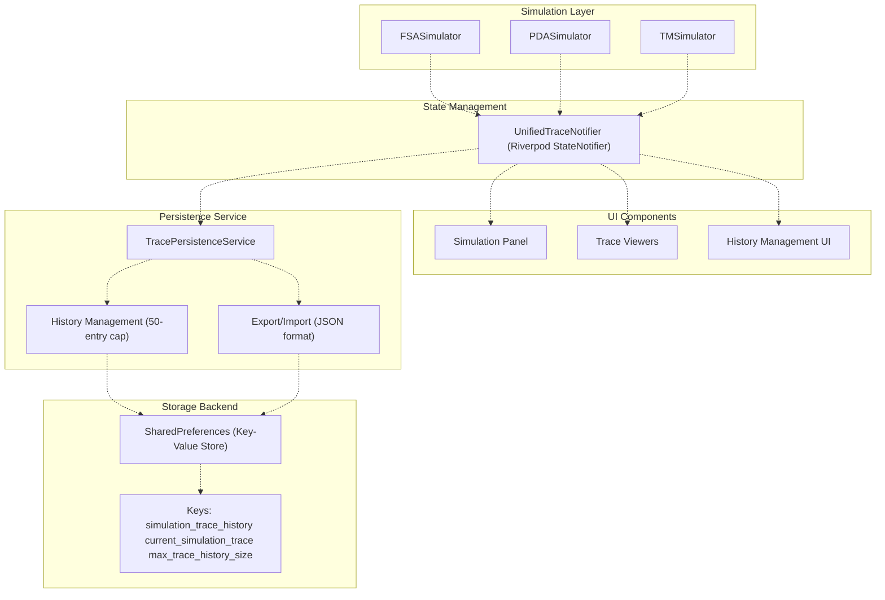
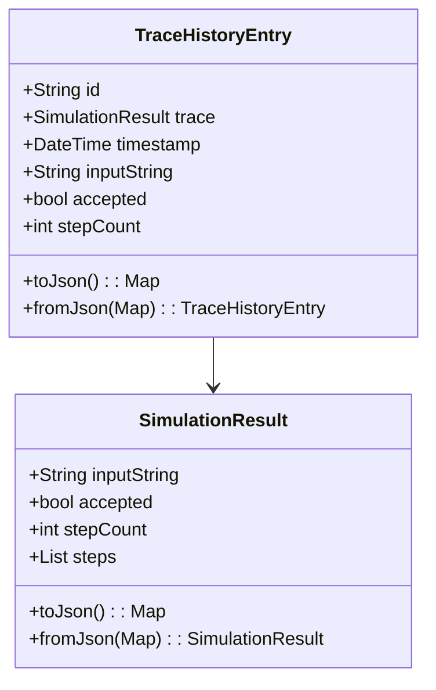
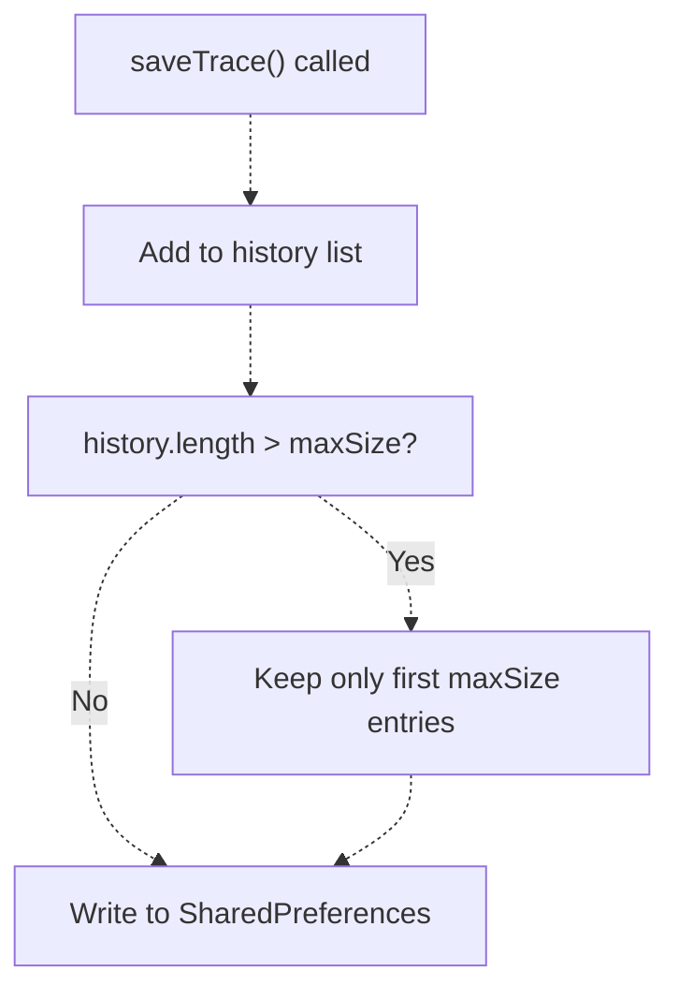
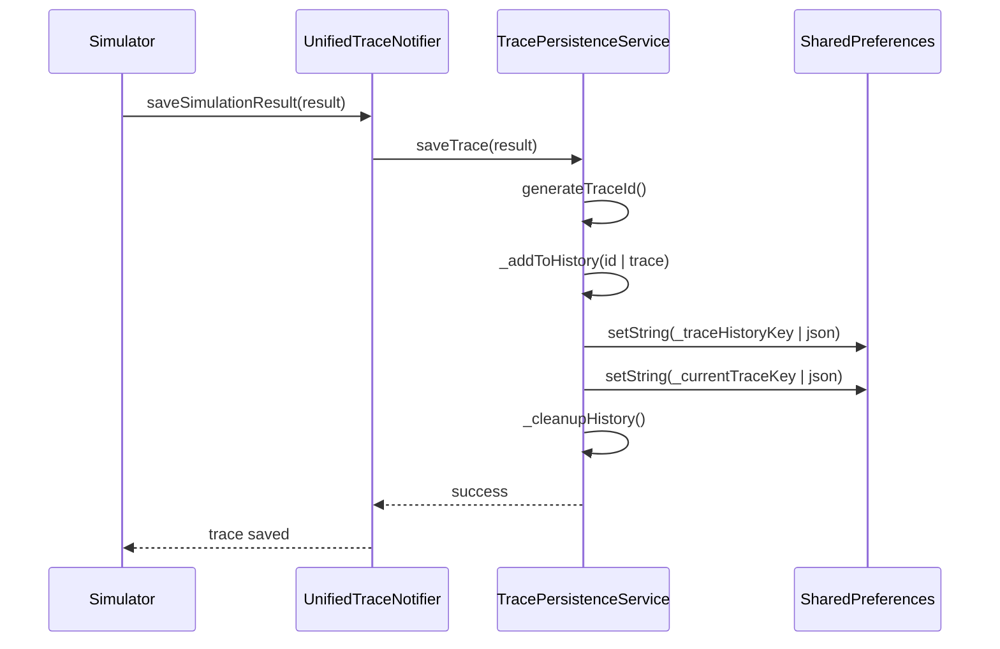
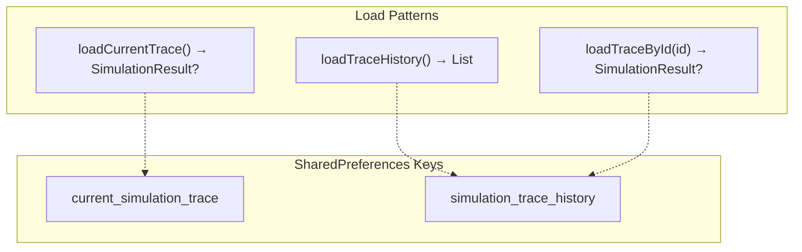
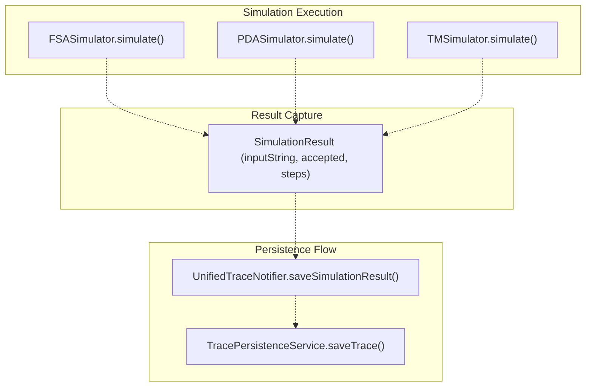

# Trace Persistence

> **Relevant source files**
> * [README.md](https://github.com/ThalesMMS/JFlutter/blob/32e808b4/README.md)
> * [USER_GUIDE](https://github.com/ThalesMMS/JFlutter/blob/32e808b4/USER_GUIDE)
> * [docs/canvas_bridge.md](https://github.com/ThalesMMS/JFlutter/blob/32e808b4/docs/canvas_bridge.md)
> * [lib/core/services/trace_persistence_service_stub.dart](https://github.com/ThalesMMS/JFlutter/blob/32e808b4/lib/core/services/trace_persistence_service_stub.dart)
> * [lib/presentation/pages/home_page.dart](https://github.com/ThalesMMS/JFlutter/blob/32e808b4/lib/presentation/pages/home_page.dart)
> * [lib/presentation/theme/app_theme.dart](https://github.com/ThalesMMS/JFlutter/blob/32e808b4/lib/presentation/theme/app_theme.dart)
> * [lib/presentation/widgets/desktop_navigation.dart](https://github.com/ThalesMMS/JFlutter/blob/32e808b4/lib/presentation/widgets/desktop_navigation.dart)
> * [lib/presentation/widgets/grammar_editor.dart](https://github.com/ThalesMMS/JFlutter/blob/32e808b4/lib/presentation/widgets/grammar_editor.dart)
> * [test/widget/presentation/home_page_test.dart](https://github.com/ThalesMMS/JFlutter/blob/32e808b4/test/widget/presentation/home_page_test.dart)

## Purpose and Scope

This document describes JFlutter's trace persistence system, which stores simulation execution histories for finite state automata, pushdown automata, and Turing machines. The system enables users to review past simulation runs, navigate step-by-step through execution traces, and analyze acceptance patterns across multiple inputs.

For information about the simulation execution engines that generate traces, see [Simulation System](7b%20Simulation-System.md). For details on the UI components that display traces, see [Simulation Panel](7b%20Simulation-System.md) sections of the Algorithm and Simulation overview.

**Sources:** [README.md L34](https://github.com/ThalesMMS/JFlutter/blob/32e808b4/README.md#L34-L34)

 [USER_GUIDE L31-L61](https://github.com/ThalesMMS/JFlutter/blob/32e808b4/USER_GUIDE#L31-L61)

---

## Architecture Overview

The trace persistence system implements a three-layer architecture with a service layer handling storage operations, a state management layer coordinating UI updates, and a platform abstraction layer managing storage backends.

### System Architecture



**Sources:** [lib/core/services/trace_persistence_service_stub.dart L1-L261](https://github.com/ThalesMMS/JFlutter/blob/32e808b4/lib/core/services/trace_persistence_service_stub.dart#L1-L261)

 [USER_GUIDE L31-L61](https://github.com/ThalesMMS/JFlutter/blob/32e808b4/USER_GUIDE#L31-L61)

---

## Core Components

### TracePersistenceService

`TracePersistenceService` is the central service managing all trace storage operations. It abstracts SharedPreferences operations and enforces history limits. The service is instantiated through a factory function to support platform-specific implementations.

| Method | Purpose |
| --- | --- |
| `saveTrace(SimulationResult, customId?)` | Persists a trace and adds it to history |
| `loadCurrentTrace()` | Retrieves the most recent trace |
| `loadTraceHistory()` | Returns all stored trace entries |
| `loadTraceById(String)` | Fetches a specific trace by ID |
| `deleteTrace(String)` | Removes a trace from history |
| `clearHistory()` | Deletes all stored traces |
| `setMaxHistorySize(int)` | Configures history cap |
| `getMaxHistorySize()` | Returns current history limit |
| `exportTraceToFile(SimulationResult, fileName?)` | Platform-specific file export |
| `importTraceFromFile(String)` | Platform-specific file import |

The service uses three SharedPreferences keys for storage:

* `simulation_trace_history`: JSON array of all trace entries
* `current_simulation_trace`: JSON object of the active trace
* `max_trace_history_size`: Integer specifying history cap (default: 50)

**Sources:** [lib/core/services/trace_persistence_service_stub.dart L20-L188](https://github.com/ThalesMMS/JFlutter/blob/32e808b4/lib/core/services/trace_persistence_service_stub.dart#L20-L188)

### TraceHistoryEntry

`TraceHistoryEntry` is an immutable data structure wrapping simulation results with metadata for history management and UI display.



**Fields:**

| Field | Type | Description |
| --- | --- | --- |
| `id` | String | Unique identifier (timestamp + hash composite) |
| `trace` | SimulationResult | Complete simulation execution data |
| `timestamp` | DateTime | When the simulation was executed |
| `inputString` | String | Input string tested (cached for filtering) |
| `accepted` | bool | Acceptance verdict (cached for statistics) |
| `stepCount` | int | Number of execution steps (cached for sorting) |

The cached metadata fields enable efficient filtering and statistics calculation without deserializing full traces.

**Sources:** [lib/core/services/trace_persistence_service_stub.dart L190-L244](https://github.com/ThalesMMS/JFlutter/blob/32e808b4/lib/core/services/trace_persistence_service_stub.dart#L190-L244)

### UnifiedTraceNotifier

`UnifiedTraceNotifier` is a Riverpod `StateNotifier` that coordinates trace persistence with UI state. It loads history when automaton contexts change and maintains the current trace cursor for step-by-step navigation.

**Key Responsibilities:**

1. Loading trace history on context initialization
2. Saving simulation results automatically
3. Managing step navigation state
4. Coordinating trace restoration
5. Exposing filtered history views

The notifier maintains state through `UnifiedTraceState`, which includes the current trace, step index, loading status, and error messages.

**Sources:** [USER_GUIDE L31-L44](https://github.com/ThalesMMS/JFlutter/blob/32e808b4/USER_GUIDE#L31-L44)

 [lib/presentation/providers/unified_trace_provider.dart L135-L309](https://github.com/ThalesMMS/JFlutter/blob/32e808b4/lib/presentation/providers/unified_trace_provider.dart#L135-L309)

 (referenced but not provided)

---

## Storage Strategy

### SharedPreferences Backend

The system uses SharedPreferences as its primary storage backend across all platforms. This provides:

* Cross-platform compatibility (Android, iOS, Web, Desktop)
* Synchronous read access patterns
* Automatic persistence across app restarts
* JSON serialization support

All trace data is serialized to JSON before storage. The service handles JSON encoding/decoding internally.

**Sources:** [lib/core/services/trace_persistence_service_stub.dart L12-L13](https://github.com/ThalesMMS/JFlutter/blob/32e808b4/lib/core/services/trace_persistence_service_stub.dart#L12-L13)

 [lib/core/services/trace_persistence_service_stub.dart L26-L52](https://github.com/ThalesMMS/JFlutter/blob/32e808b4/lib/core/services/trace_persistence_service_stub.dart#L26-L52)

### History Cap and Cleanup

The service enforces a configurable history cap (default: 50 entries) to prevent unbounded storage growth on mobile devices. When the cap is exceeded, older entries are pruned automatically.

**Cleanup Logic:**



The cleanup operation runs after each save, ensuring the cap is never exceeded. The `_cleanupHistory()` method performs the trim operation by taking only the first N entries (newest to oldest order).

**Sources:** [lib/core/services/trace_persistence_service_stub.dart L24](https://github.com/ThalesMMS/JFlutter/blob/32e808b4/lib/core/services/trace_persistence_service_stub.dart#L24-L24)

 [lib/core/services/trace_persistence_service_stub.dart L167-L180](https://github.com/ThalesMMS/JFlutter/blob/32e808b4/lib/core/services/trace_persistence_service_stub.dart#L167-L180)

### Storage Keys

| Key | Type | Content |
| --- | --- | --- |
| `simulation_trace_history` | JSON Array | List of `TraceHistoryEntry` objects |
| `current_simulation_trace` | JSON Object | Single `SimulationResult` object |
| `max_trace_history_size` | Integer | Configurable history cap value |

**Sources:** [lib/core/services/trace_persistence_service_stub.dart L21-L24](https://github.com/ThalesMMS/JFlutter/blob/32e808b4/lib/core/services/trace_persistence_service_stub.dart#L21-L24)

---

## Trace Operations

### Saving Traces

Traces are saved automatically after each simulation run. The save operation performs three steps:

1. Generate or use custom trace ID
2. Add entry to history list (newest first)
3. Update current trace reference
4. Trigger cleanup if history exceeds cap



**Trace ID Generation:**

IDs are generated from three components to ensure uniqueness:

* Current timestamp (milliseconds since epoch)
* Input string hash code
* Acceptance verdict (1 or 0)

Format: `trace_{timestamp}_{inputHash}_{resultHash}`

**Sources:** [lib/core/services/trace_persistence_service_stub.dart L26-L39](https://github.com/ThalesMMS/JFlutter/blob/32e808b4/lib/core/services/trace_persistence_service_stub.dart#L26-L39)

 [lib/core/services/trace_persistence_service_stub.dart L182-L187](https://github.com/ThalesMMS/JFlutter/blob/32e808b4/lib/core/services/trace_persistence_service_stub.dart#L182-L187)

 [USER_GUIDE L40-L44](https://github.com/ThalesMMS/JFlutter/blob/32e808b4/USER_GUIDE#L40-L44)

### Loading Traces

The service provides three load patterns:

**Current Trace:**
Retrieves the most recently saved trace, typically used when resuming the application or navigating back to the simulation panel.

**Trace History:**
Returns all stored traces as a list of `TraceHistoryEntry` objects, ordered newest to oldest. Used for history UI lists and statistics calculation.

**Trace by ID:**
Fetches a specific trace by its unique identifier. Used when restoring a previously saved simulation from history.



All load operations include error handling that wraps exceptions in `TracePersistenceException` for consistent error reporting.

**Sources:** [lib/core/services/trace_persistence_service_stub.dart L41-L87](https://github.com/ThalesMMS/JFlutter/blob/32e808b4/lib/core/services/trace_persistence_service_stub.dart#L41-L87)

 [USER_GUIDE L42-L44](https://github.com/ThalesMMS/JFlutter/blob/32e808b4/USER_GUIDE#L42-L44)

### Managing History

**Deletion:**
Individual traces can be removed by ID. The operation filters the history list and persists the updated list.

**Clearing All:**
The `clearHistory()` method removes both the history list and current trace keys from SharedPreferences, effectively resetting the trace storage.

**History Size Configuration:**
The maximum history size can be adjusted at runtime using `setMaxHistorySize(int)`. The new limit applies to subsequent cleanup operations.

**Sources:** [lib/core/services/trace_persistence_service_stub.dart L100-L144](https://github.com/ThalesMMS/JFlutter/blob/32e808b4/lib/core/services/trace_persistence_service_stub.dart#L100-L144)

### Export and Import

The service defines export and import methods for trace persistence, though implementations vary by platform:

**Mobile/Desktop Platforms:**
Support full file-based export and import using platform-specific file pickers and filesystem APIs.

**Web Platform:**
The stub implementation throws `TracePersistenceException` for file operations, as web environments lack direct filesystem access. Web users can still access traces through SharedPreferences-based storage.

**Export Format:**
Traces are exported as JSON with the following structure:

* Metadata (timestamp, version, platform)
* List of `TraceHistoryEntry` objects
* Statistics summary

**Sources:** [lib/core/services/trace_persistence_service_stub.dart L89-L98](https://github.com/ThalesMMS/JFlutter/blob/32e808b4/lib/core/services/trace_persistence_service_stub.dart#L89-L98)

 [USER_GUIDE L58-L61](https://github.com/ThalesMMS/JFlutter/blob/32e808b4/USER_GUIDE#L58-L61)

---

## Integration Points

### With Simulators

Each simulator type (FSA, PDA, TM) integrates with the trace persistence system through `UnifiedTraceNotifier`. After simulation execution completes, the simulator's result is passed to the notifier, which triggers the save operation.



The integration is automatic—simulators do not directly interact with `TracePersistenceService`. This separation ensures clean architecture boundaries between core simulation logic and persistence concerns.

**Sources:** [USER_GUIDE L40-L42](https://github.com/ThalesMMS/JFlutter/blob/32e808b4/USER_GUIDE#L40-L42)

### With UI Components

**Simulation Panel:**
The simulation panel triggers trace saves after each "Simulate" button press. It also provides transport controls for step-by-step navigation that update the current step index in `UnifiedTraceNotifier`.

**Trace Viewers:**
Trace viewer widgets bind to `UnifiedTraceState.currentStepIndex` and display the corresponding configuration at each step. Viewers support collapsible sections for large traces.

**History Management UI:**
History lists filter traces by automaton type or ID and provide actions to restore, delete, or export individual traces. These UI components call notifier methods like `loadTraceFromHistory(traceId)`.

**Sources:** [USER_GUIDE L45-L55](https://github.com/ThalesMMS/JFlutter/blob/32e808b4/USER_GUIDE#L45-L55)

---

## Data Models

### SimulationResult Structure

`SimulationResult` is the core data model representing a complete simulation execution. It includes:

| Field | Type | Description |
| --- | --- | --- |
| `inputString` | String | Input symbols tested |
| `accepted` | bool | Whether input was accepted |
| `stepCount` | int | Total execution steps |
| `steps` | List<SimulationStep> | Step-by-step configurations |
| `metadata` | Map | Optional automaton/execution context |

The model provides `toJson()` and `fromJson()` methods for serialization.

**Sources:** [lib/core/models/simulation_result.dart](https://github.com/ThalesMMS/JFlutter/blob/32e808b4/lib/core/models/simulation_result.dart)

 (referenced in [lib/core/services/trace_persistence_service_stub.dart L14](https://github.com/ThalesMMS/JFlutter/blob/32e808b4/lib/core/services/trace_persistence_service_stub.dart#L14-L14)

)

### Step-by-Step Navigation

`SimulationStep` represents a single execution configuration, containing:

* Current state(s)
* Remaining input
* Stack/tape contents (for PDA/TM)
* Transition taken

The `UnifiedTraceNotifier` maintains a cursor (`currentStepIndex`) that tracks which step is being viewed. Navigation methods increment or decrement this index and emit corresponding highlights to the canvas.

**Sources:** [USER_GUIDE L45-L49](https://github.com/ThalesMMS/JFlutter/blob/32e808b4/USER_GUIDE#L45-L49)

### Metadata Preservation

Trace history entries preserve automaton metadata to enable filtering and context restoration:

* Automaton type (FSA, PDA, TM)
* Automaton ID (if stored)
* Execution timestamp
* Input characteristics (length, alphabet coverage)

This metadata allows UI components to filter traces without loading full simulation data.

**Sources:** [USER_GUIDE L43](https://github.com/ThalesMMS/JFlutter/blob/32e808b4/USER_GUIDE#L43-L43)

 [lib/core/services/trace_persistence_service_stub.dart L190-L205](https://github.com/ThalesMMS/JFlutter/blob/32e808b4/lib/core/services/trace_persistence_service_stub.dart#L190-L205)

---

## Platform Considerations

### Web Platform Limitations

The web platform uses a stub implementation of `TracePersistenceService` that restricts functionality:

**Supported Operations:**

* All SharedPreferences-backed operations (save, load, delete, clear)
* JSON serialization/deserialization
* History management and statistics

**Unsupported Operations:**

* `exportTraceToFile()`: Throws `TracePersistenceException`
* `importTraceFromFile()`: Throws `TracePersistenceException`

The stub explicitly documents these limitations to prevent runtime confusion when deploying to web targets.

**Sources:** [lib/core/services/trace_persistence_service_stub.dart L1-L11](https://github.com/ThalesMMS/JFlutter/blob/32e808b4/lib/core/services/trace_persistence_service_stub.dart#L1-L11)

 [lib/core/services/trace_persistence_service_stub.dart L89-L98](https://github.com/ThalesMMS/JFlutter/blob/32e808b4/lib/core/services/trace_persistence_service_stub.dart#L89-L98)

### Mobile and Desktop Platforms

Mobile (Android, iOS) and desktop (Windows, macOS, Linux) platforms support the full `TracePersistenceService` API through platform-specific implementations. These implementations use:

* Platform file pickers for import/export
* Native filesystem APIs for file I/O
* SharedPreferences for core storage (same as web)

The conditional import pattern (`trace_persistence_service_io.dart` vs `trace_persistence_service_stub.dart`) selects the appropriate implementation at compile time.

**Sources:** [lib/core/services/trace_persistence_service_stub.dart L17-L18](https://github.com/ThalesMMS/JFlutter/blob/32e808b4/lib/core/services/trace_persistence_service_stub.dart#L17-L18)

### Storage Quotas

SharedPreferences has platform-specific storage limits:

* **Android/iOS**: Typically unlimited, but subject to OS storage management
* **Web**: Limited by browser localStorage quota (5-10 MB typical)
* **Desktop**: Unlimited, backed by local JSON files

The 50-entry history cap helps ensure web deployments remain within browser quotas even with large traces. For desktop deployments with extensive usage, the cap can be raised via `setMaxHistorySize()`.

**Sources:** [README.md L34](https://github.com/ThalesMMS/JFlutter/blob/32e808b4/README.md#L34-L34)

 [USER_GUIDE L37](https://github.com/ThalesMMS/JFlutter/blob/32e808b4/USER_GUIDE#L37-L37)

---

## Usage Patterns

### Basic Simulation and Save

```
1. User creates automaton
2. User enters input string in Simulation Panel
3. User clicks "Simulate" button
4. Simulator executes and generates SimulationResult
5. UnifiedTraceNotifier receives result
6. TracePersistenceService.saveTrace() called automatically
7. Trace appears in history list
```

**Sources:** [USER_GUIDE L40-L42](https://github.com/ThalesMMS/JFlutter/blob/32e808b4/USER_GUIDE#L40-L42)

### Restoring a Previous Trace

```python
1. User opens history panel (drawer/sheet/menu)
2. History list displays TraceHistoryEntry items filtered by context
3. User selects a trace from the list
4. UnifiedTraceNotifier.loadTraceFromHistory(traceId) called
5. TracePersistenceService.loadTraceById() fetches the trace
6. Current trace state updated
7. Step index resets to 0
8. Trace viewer displays first configuration
```

**Sources:** [USER_GUIDE L42-L44](https://github.com/ThalesMMS/JFlutter/blob/32e808b4/USER_GUIDE#L42-L44)

### Step-by-Step Playback

```
1. User toggles "Step-by-Step Mode" in Simulation Panel
2. Transport controls become active
3. User clicks "Next" button
4. UnifiedTraceNotifier increments currentStepIndex
5. SimulationHighlightService receives highlight payload
6. Canvas highlights active states/transitions
7. Trace viewer scrolls to current step
8. Process repeats for each step
```

**Sources:** [USER_GUIDE L45-L49](https://github.com/ThalesMMS/JFlutter/blob/32e808b4/USER_GUIDE#L45-L49)

### Bulk Export

```javascript
1. User selects "Export All Traces" from history menu
2. UnifiedTraceNotifier.exportTraceHistory() called
3. TracePersistenceService serializes all history entries to JSON
4. Platform-specific file picker shows (mobile/desktop only)
5. JSON file saved to user-selected location
6. Statistics included in export metadata
```

**Sources:** [USER_GUIDE L58-L61](https://github.com/ThalesMMS/JFlutter/blob/32e808b4/USER_GUIDE#L58-L61)

### Import and Merge

```python
1. User selects "Import Traces" from history menu
2. Platform file picker opens (mobile/desktop only)
3. User selects JSON file
4. UnifiedTraceNotifier.importTraceHistory(json) called
5. TracePersistenceService merges traces (overwrites duplicates by ID)
6. Statistics recalculated
7. History list refreshes with imported entries
```

**Sources:** [USER_GUIDE L58-L61](https://github.com/ThalesMMS/JFlutter/blob/32e808b4/USER_GUIDE#L58-L61)

---

## Exception Handling

The service defines two exception types:

**TracePersistenceException:**
General-purpose exception for storage failures, serialization errors, and platform limitations. Used when operations fail but the system can continue.

**TraceNotFoundException:**
Specific exception thrown when `loadTraceById()` cannot find a matching trace in history. Allows callers to distinguish missing traces from storage failures.

Both exception types implement standard `toString()` for error logging and user messaging.

**Sources:** [lib/core/services/trace_persistence_service_stub.dart L246-L260](https://github.com/ThalesMMS/JFlutter/blob/32e808b4/lib/core/services/trace_persistence_service_stub.dart#L246-L260)


### On this page

* [Trace Persistence](11%20Trace-Persistence.md)
* [Purpose and Scope](11%20Trace-Persistence.md)
* [Architecture Overview](11%20Trace-Persistence.md)
* [System Architecture](11%20Trace-Persistence.md)
* [Core Components](11%20Trace-Persistence.md)
* [TracePersistenceService](11%20Trace-Persistence.md)
* [TraceHistoryEntry](11%20Trace-Persistence.md)
* [UnifiedTraceNotifier](11%20Trace-Persistence.md)
* [Storage Strategy](11%20Trace-Persistence.md)
* [SharedPreferences Backend](11%20Trace-Persistence.md)
* [History Cap and Cleanup](11%20Trace-Persistence.md)
* [Storage Keys](11%20Trace-Persistence.md)
* [Trace Operations](11%20Trace-Persistence.md)
* [Saving Traces](11%20Trace-Persistence.md)
* [Loading Traces](11%20Trace-Persistence.md)
* [Managing History](11%20Trace-Persistence.md)
* [Export and Import](11%20Trace-Persistence.md)
* [Integration Points](11%20Trace-Persistence.md)
* [With Simulators](11%20Trace-Persistence.md)
* [With UI Components](11%20Trace-Persistence.md)
* [Data Models](11%20Trace-Persistence.md)
* [SimulationResult Structure](11%20Trace-Persistence.md)
* [Step-by-Step Navigation](11%20Trace-Persistence.md)
* [Metadata Preservation](11%20Trace-Persistence.md)
* [Platform Considerations](11%20Trace-Persistence.md)
* [Web Platform Limitations](11%20Trace-Persistence.md)
* [Mobile and Desktop Platforms](11%20Trace-Persistence.md)
* [Storage Quotas](11%20Trace-Persistence.md)
* [Usage Patterns](11%20Trace-Persistence.md)
* [Basic Simulation and Save](11%20Trace-Persistence.md)
* [Restoring a Previous Trace](11%20Trace-Persistence.md)
* [Step-by-Step Playback](11%20Trace-Persistence.md)
* [Bulk Export](11%20Trace-Persistence.md)
* [Import and Merge](11%20Trace-Persistence.md)
* [Exception Handling](11%20Trace-Persistence.md)

Ask Devin about JFlutter