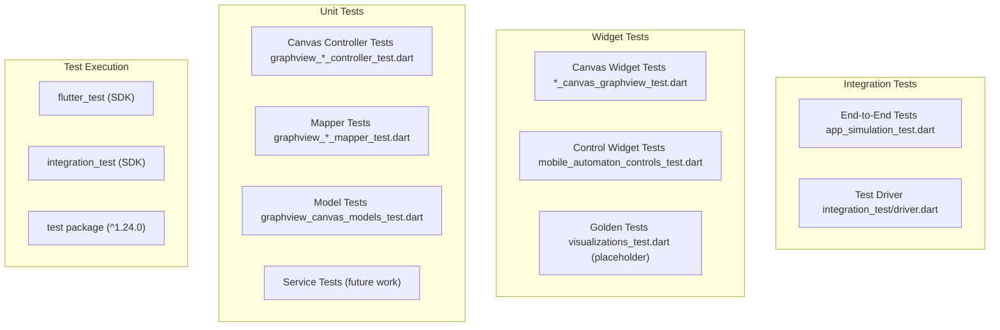
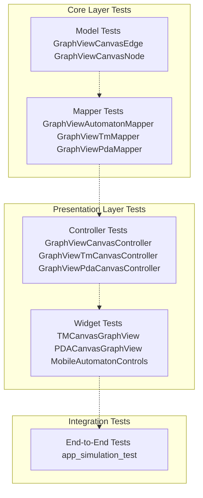
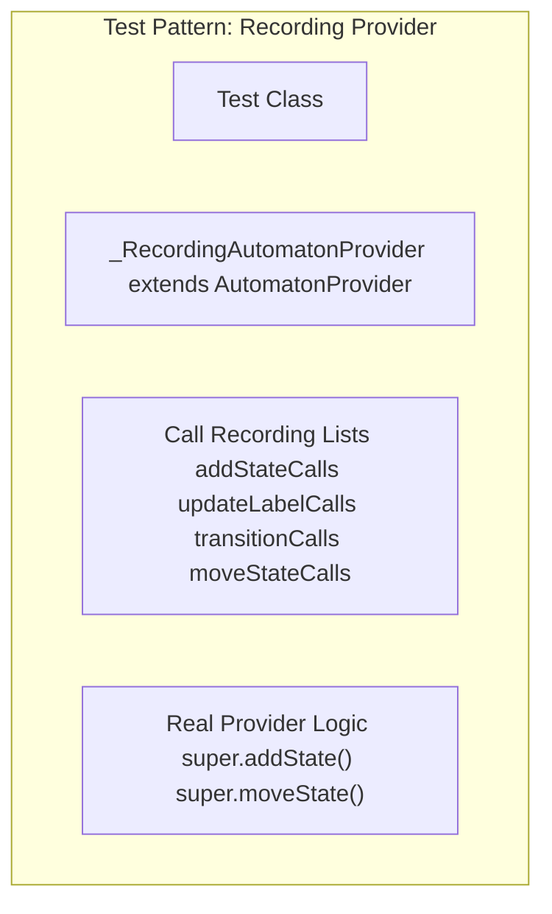
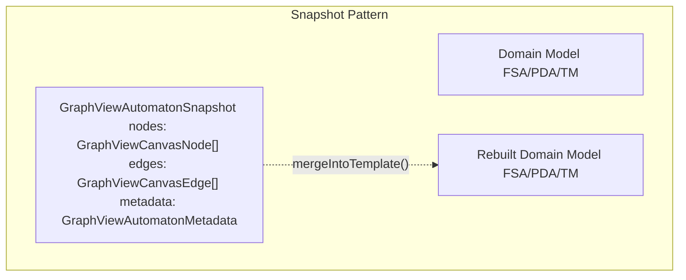
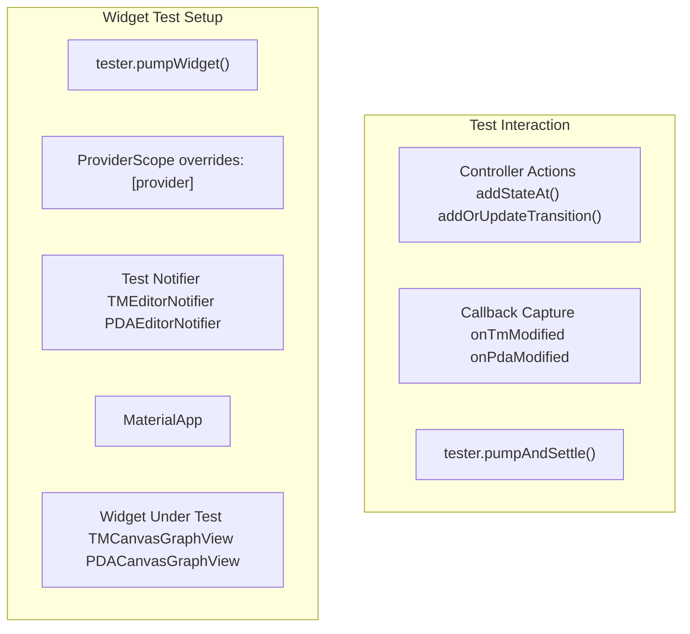
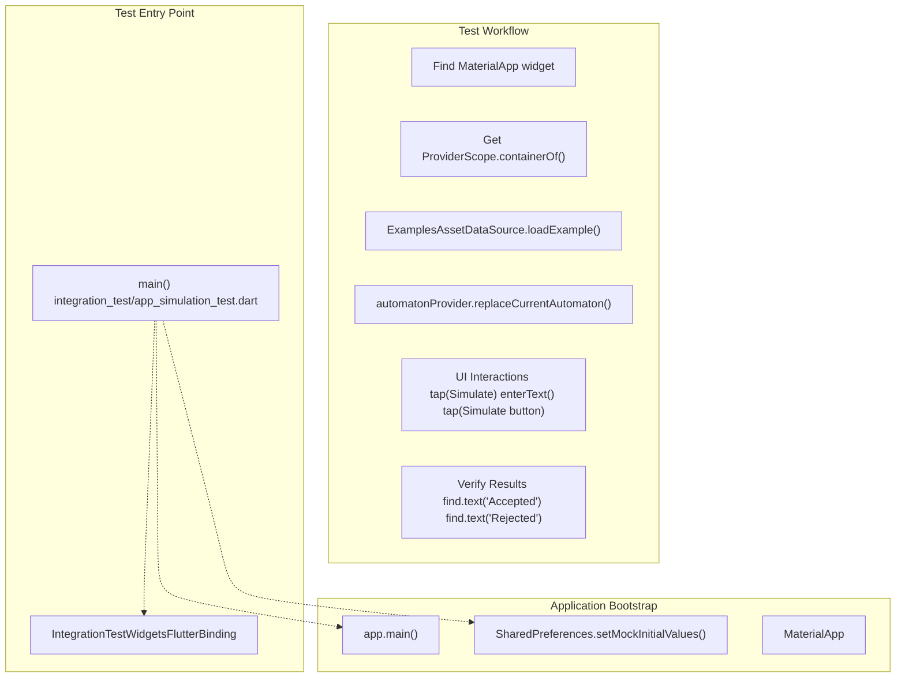
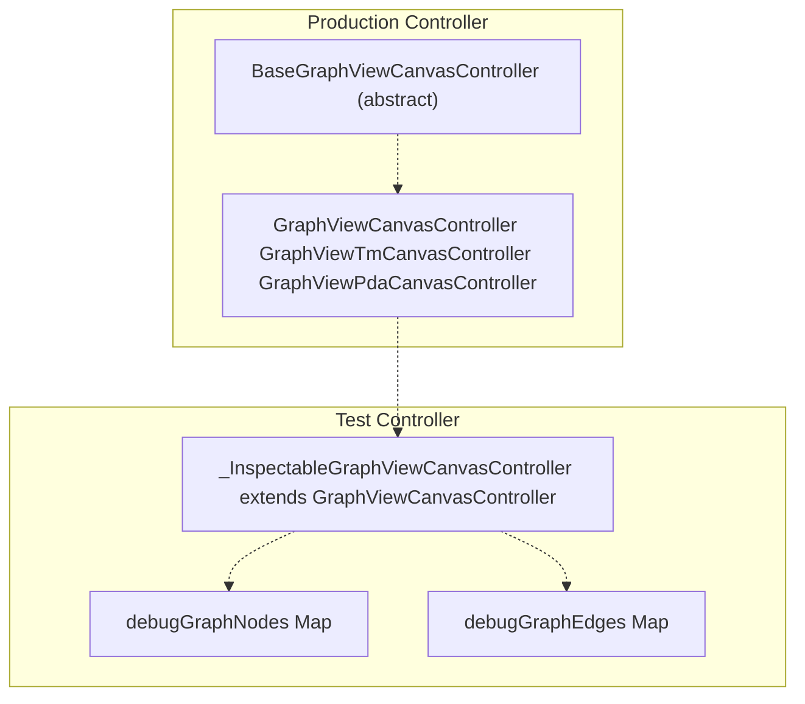

# Testing

> **Relevant source files**
> * [lib/core/entities/automaton_entity.dart](https://github.com/ThalesMMS/JFlutter/blob/32e808b4/lib/core/entities/automaton_entity.dart)
> * [lib/data/repositories/automaton_repository_impl.dart](https://github.com/ThalesMMS/JFlutter/blob/32e808b4/lib/data/repositories/automaton_repository_impl.dart)
> * [lib/data/services/automaton_service.dart](https://github.com/ThalesMMS/JFlutter/blob/32e808b4/lib/data/services/automaton_service.dart)
> * [lib/data/services/serialization_service.dart](https://github.com/ThalesMMS/JFlutter/blob/32e808b4/lib/data/services/serialization_service.dart)
> * [test/core/services/simulation_highlight_service_test.dart](https://github.com/ThalesMMS/JFlutter/blob/32e808b4/test/core/services/simulation_highlight_service_test.dart)
> * [test/features/canvas/graphview/graphview_automaton_mapper_test.dart](https://github.com/ThalesMMS/JFlutter/blob/32e808b4/test/features/canvas/graphview/graphview_automaton_mapper_test.dart)
> * [test/features/canvas/graphview/graphview_canvas_controller_test.dart](https://github.com/ThalesMMS/JFlutter/blob/32e808b4/test/features/canvas/graphview/graphview_canvas_controller_test.dart)
> * [test/features/canvas/graphview/graphview_canvas_models_test.dart](https://github.com/ThalesMMS/JFlutter/blob/32e808b4/test/features/canvas/graphview/graphview_canvas_models_test.dart)
> * [test/features/canvas/graphview/graphview_pda_canvas_controller_test.dart](https://github.com/ThalesMMS/JFlutter/blob/32e808b4/test/features/canvas/graphview/graphview_pda_canvas_controller_test.dart)
> * [test/features/canvas/graphview/graphview_pda_mapper_test.dart](https://github.com/ThalesMMS/JFlutter/blob/32e808b4/test/features/canvas/graphview/graphview_pda_mapper_test.dart)
> * [test/features/canvas/graphview/graphview_tm_canvas_controller_test.dart](https://github.com/ThalesMMS/JFlutter/blob/32e808b4/test/features/canvas/graphview/graphview_tm_canvas_controller_test.dart)
> * [test/features/canvas/graphview/graphview_tm_mapper_test.dart](https://github.com/ThalesMMS/JFlutter/blob/32e808b4/test/features/canvas/graphview/graphview_tm_mapper_test.dart)
> * [test/integration/io/examples_roundtrip_test.dart](https://github.com/ThalesMMS/JFlutter/blob/32e808b4/test/integration/io/examples_roundtrip_test.dart)
> * [test/integration/io/interoperability_roundtrip_test.dart](https://github.com/ThalesMMS/JFlutter/blob/32e808b4/test/integration/io/interoperability_roundtrip_test.dart)
> * [test/widget/presentation/mobile_automaton_controls_test.dart](https://github.com/ThalesMMS/JFlutter/blob/32e808b4/test/widget/presentation/mobile_automaton_controls_test.dart)
> * [test/widget/presentation/pda_canvas_graphview_test.dart](https://github.com/ThalesMMS/JFlutter/blob/32e808b4/test/widget/presentation/pda_canvas_graphview_test.dart)
> * [test/widget/presentation/tm_canvas_graphview_test.dart](https://github.com/ThalesMMS/JFlutter/blob/32e808b4/test/widget/presentation/tm_canvas_graphview_test.dart)
> * [test/widget/presentation/visualizations_test.dart](https://github.com/ThalesMMS/JFlutter/blob/32e808b4/test/widget/presentation/visualizations_test.dart)

This page documents the testing strategy, infrastructure, and patterns used throughout the JFlutter codebase. It covers the test organization, execution workflows, and common testing utilities that ensure code correctness and maintainability. For detailed coverage of specific test categories, see [Canvas System Tests](#12.1) and [Widget and Integration Tests](#12.2).

## Testing Infrastructure

JFlutter employs a multi-layered testing approach using Flutter's built-in testing frameworks alongside specialized testing libraries.

### Test Dependencies

The testing infrastructure is defined in [pubspec.yaml L86-L104](https://github.com/ThalesMMS/JFlutter/blob/32e808b4/pubspec.yaml#L86-L104)

 and consists of:

| Dependency | Version | Purpose |
| --- | --- | --- |
| `flutter_test` | SDK | Widget and unit testing framework |
| `integration_test` | SDK | End-to-end integration testing |
| `test` | ^1.24.0 | Core Dart testing utilities |
| `golden_toolkit` | ^0.15.0 | Visual regression testing (planned) |
| `shared_preferences_platform_interface` | ^2.4.1 | Mock storage for tests |

**Sources:** [pubspec.yaml L86-L104](https://github.com/ThalesMMS/JFlutter/blob/32e808b4/pubspec.yaml#L86-L104)

### Test Framework Architecture



**Sources:** [pubspec.yaml L86-L104](https://github.com/ThalesMMS/JFlutter/blob/32e808b4/pubspec.yaml#L86-L104)

 [test/features/canvas/graphview/](https://github.com/ThalesMMS/JFlutter/blob/32e808b4/test/features/canvas/graphview/)

 [test/widget/presentation/](https://github.com/ThalesMMS/JFlutter/blob/32e808b4/test/widget/presentation/)

 [integration_test/](https://github.com/ThalesMMS/JFlutter/blob/32e808b4/integration_test/)

## Test Organization

The test directory structure mirrors the main codebase organization, following Flutter conventions for test file placement and naming.

### Directory Structure

```
test/
├── features/
│   └── canvas/
│       └── graphview/
│           ├── graphview_canvas_controller_test.dart
│           ├── graphview_tm_canvas_controller_test.dart
│           ├── graphview_pda_canvas_controller_test.dart
│           ├── graphview_automaton_mapper_test.dart
│           ├── graphview_tm_mapper_test.dart
│           ├── graphview_pda_mapper_test.dart
│           └── graphview_canvas_models_test.dart
├── widget/
│   └── presentation/
│       ├── mobile_automaton_controls_test.dart
│       ├── tm_canvas_graphview_test.dart
│       ├── pda_canvas_graphview_test.dart
│       └── visualizations_test.dart
integration_test/
├── app_simulation_test.dart
└── driver.dart
```

Test files follow the naming convention `{component_name}_test.dart` and are located parallel to their implementation counterparts.

**Sources:** [test/](https://github.com/ThalesMMS/JFlutter/blob/32e808b4/test/)

 [integration_test/](https://github.com/ThalesMMS/JFlutter/blob/32e808b4/integration_test/)

### Test Categories by Layer



**Sources:** [test/features/canvas/graphview/](https://github.com/ThalesMMS/JFlutter/blob/32e808b4/test/features/canvas/graphview/)

 [test/widget/presentation/](https://github.com/ThalesMMS/JFlutter/blob/32e808b4/test/widget/presentation/)

 [integration_test/](https://github.com/ThalesMMS/JFlutter/blob/32e808b4/integration_test/)

## Common Testing Patterns

The codebase employs several reusable testing patterns to ensure consistency and maintainability across test suites.

### Provider Mocking and Recording

Tests use custom recording providers to capture method invocations without full provider infrastructure:



The `_RecordingAutomatonProvider` pattern captures all provider method calls for verification while maintaining full functional behavior. This is demonstrated in [test/features/canvas/graphview/graphview_canvas_controller_test.dart L60-L148](https://github.com/ThalesMMS/JFlutter/blob/32e808b4/test/features/canvas/graphview/graphview_canvas_controller_test.dart#L60-L148)

:

* `addStateCalls` records state creation parameters [line 67](https://github.com/ThalesMMS/JFlutter/blob/32e808b4/line%2067)
* `moveStateCalls` records state position updates [line 70](https://github.com/ThalesMMS/JFlutter/blob/32e808b4/line%2070)
* `updateLabelCalls` records label changes [line 68](https://github.com/ThalesMMS/JFlutter/blob/32e808b4/line%2068)
* `transitionCalls` records transition modifications [line 69](https://github.com/ThalesMMS/JFlutter/blob/32e808b4/line%2069)

**Sources:** [test/features/canvas/graphview/graphview_canvas_controller_test.dart L60-L148](https://github.com/ThalesMMS/JFlutter/blob/32e808b4/test/features/canvas/graphview/graphview_canvas_controller_test.dart#L60-L148)

### Controller Lifecycle Management

Canvas controller tests implement a consistent lifecycle pattern with setup, teardown, and recreation utilities:

```css
#mermaid-mezi1ltazx{font-family:ui-sans-serif,-apple-system,system-ui,Segoe UI,Helvetica;font-size:16px;fill:#ccc;}@keyframes edge-animation-frame{from{stroke-dashoffset:0;}}@keyframes dash{to{stroke-dashoffset:0;}}#mermaid-mezi1ltazx .edge-animation-slow{stroke-dasharray:9,5!important;stroke-dashoffset:900;animation:dash 50s linear infinite;stroke-linecap:round;}#mermaid-mezi1ltazx .edge-animation-fast{stroke-dasharray:9,5!important;stroke-dashoffset:900;animation:dash 20s linear infinite;stroke-linecap:round;}#mermaid-mezi1ltazx .error-icon{fill:#a44141;}#mermaid-mezi1ltazx .error-text{fill:#ddd;stroke:#ddd;}#mermaid-mezi1ltazx .edge-thickness-normal{stroke-width:1px;}#mermaid-mezi1ltazx .edge-thickness-thick{stroke-width:3.5px;}#mermaid-mezi1ltazx .edge-pattern-solid{stroke-dasharray:0;}#mermaid-mezi1ltazx .edge-thickness-invisible{stroke-width:0;fill:none;}#mermaid-mezi1ltazx .edge-pattern-dashed{stroke-dasharray:3;}#mermaid-mezi1ltazx .edge-pattern-dotted{stroke-dasharray:2;}#mermaid-mezi1ltazx .marker{fill:lightgrey;stroke:lightgrey;}#mermaid-mezi1ltazx .marker.cross{stroke:lightgrey;}#mermaid-mezi1ltazx svg{font-family:ui-sans-serif,-apple-system,system-ui,Segoe UI,Helvetica;font-size:16px;}#mermaid-mezi1ltazx p{margin:0;}#mermaid-mezi1ltazx defs #statediagram-barbEnd{fill:lightgrey;stroke:lightgrey;}#mermaid-mezi1ltazx g.stateGroup text{fill:#ccc;stroke:none;font-size:10px;}#mermaid-mezi1ltazx g.stateGroup text{fill:#ccc;stroke:none;font-size:10px;}#mermaid-mezi1ltazx g.stateGroup .state-title{font-weight:bolder;fill:#e0dfdf;}#mermaid-mezi1ltazx g.stateGroup rect{fill:#1f2020;stroke:#ccc;}#mermaid-mezi1ltazx g.stateGroup line{stroke:lightgrey;stroke-width:1;}#mermaid-mezi1ltazx .transition{stroke:lightgrey;stroke-width:1;fill:none;}#mermaid-mezi1ltazx .stateGroup .composit{fill:#333;border-bottom:1px;}#mermaid-mezi1ltazx .stateGroup .alt-composit{fill:#e0e0e0;border-bottom:1px;}#mermaid-mezi1ltazx .state-note{stroke:hsl(180, 0%, 18.3529411765%);fill:hsl(180, 1.5873015873%, 28.3529411765%);}#mermaid-mezi1ltazx .state-note text{fill:rgb(183.8476190475, 181.5523809523, 181.5523809523);stroke:none;font-size:10px;}#mermaid-mezi1ltazx .stateLabel .box{stroke:none;stroke-width:0;fill:#1f2020;opacity:0.5;}#mermaid-mezi1ltazx .edgeLabel .label rect{fill:#1f2020;opacity:0.5;}#mermaid-mezi1ltazx .edgeLabel{background-color:hsl(0, 0%, 34.4117647059%);text-align:center;}#mermaid-mezi1ltazx .edgeLabel p{background-color:hsl(0, 0%, 34.4117647059%);}#mermaid-mezi1ltazx .edgeLabel rect{opacity:0.5;background-color:hsl(0, 0%, 34.4117647059%);fill:hsl(0, 0%, 34.4117647059%);}#mermaid-mezi1ltazx .edgeLabel .label text{fill:#ccc;}#mermaid-mezi1ltazx .label div .edgeLabel{color:#ccc;}#mermaid-mezi1ltazx .stateLabel text{fill:#e0dfdf;font-size:10px;font-weight:bold;}#mermaid-mezi1ltazx .node circle.state-start{fill:#f4f4f4;stroke:#f4f4f4;}#mermaid-mezi1ltazx .node .fork-join{fill:#f4f4f4;stroke:#f4f4f4;}#mermaid-mezi1ltazx .node circle.state-end{fill:#cccccc;stroke:#333;stroke-width:1.5;}#mermaid-mezi1ltazx .end-state-inner{fill:#333;stroke-width:1.5;}#mermaid-mezi1ltazx .node rect{fill:#1f2020;stroke:#ccc;stroke-width:1px;}#mermaid-mezi1ltazx .node polygon{fill:#1f2020;stroke:#ccc;stroke-width:1px;}#mermaid-mezi1ltazx #statediagram-barbEnd{fill:lightgrey;}#mermaid-mezi1ltazx .statediagram-cluster rect{fill:#1f2020;stroke:#ccc;stroke-width:1px;}#mermaid-mezi1ltazx .cluster-label,#mermaid-mezi1ltazx .nodeLabel{color:#e0dfdf;}#mermaid-mezi1ltazx .statediagram-cluster rect.outer{rx:5px;ry:5px;}#mermaid-mezi1ltazx .statediagram-state .divider{stroke:#ccc;}#mermaid-mezi1ltazx .statediagram-state .title-state{rx:5px;ry:5px;}#mermaid-mezi1ltazx .statediagram-cluster.statediagram-cluster .inner{fill:#333;}#mermaid-mezi1ltazx .statediagram-cluster.statediagram-cluster-alt .inner{fill:#555;}#mermaid-mezi1ltazx .statediagram-cluster .inner{rx:0;ry:0;}#mermaid-mezi1ltazx .statediagram-state rect.basic{rx:5px;ry:5px;}#mermaid-mezi1ltazx .statediagram-state rect.divider{stroke-dasharray:10,10;fill:#555;}#mermaid-mezi1ltazx .note-edge{stroke-dasharray:5;}#mermaid-mezi1ltazx .statediagram-note rect{fill:hsl(180, 1.5873015873%, 28.3529411765%);stroke:hsl(180, 0%, 18.3529411765%);stroke-width:1px;rx:0;ry:0;}#mermaid-mezi1ltazx .statediagram-note rect{fill:hsl(180, 1.5873015873%, 28.3529411765%);stroke:hsl(180, 0%, 18.3529411765%);stroke-width:1px;rx:0;ry:0;}#mermaid-mezi1ltazx .statediagram-note text{fill:rgb(183.8476190475, 181.5523809523, 181.5523809523);}#mermaid-mezi1ltazx .statediagram-note .nodeLabel{color:rgb(183.8476190475, 181.5523809523, 181.5523809523);}#mermaid-mezi1ltazx .statediagram .edgeLabel{color:red;}#mermaid-mezi1ltazx #dependencyStart,#mermaid-mezi1ltazx #dependencyEnd{fill:lightgrey;stroke:lightgrey;stroke-width:1;}#mermaid-mezi1ltazx .statediagramTitleText{text-anchor:middle;font-size:18px;fill:#ccc;}#mermaid-mezi1ltazx :root{--mermaid-font-family:ui-sans-serif,-apple-system,system-ui,Segoe UI,Helvetica;}setUp()recreateController()addStateAt() moveState() synchronize()Multiple Test CasestearDown()recreateController() (with different config)SetupInitializedTestExecutionDisposedRecreated
```

The recreation pattern allows tests to verify behavior with different configurations [test/features/canvas/graphview/graphview_canvas_controller_test.dart L175-L214](https://github.com/ThalesMMS/JFlutter/blob/32e808b4/test/features/canvas/graphview/graphview_canvas_controller_test.dart#L175-L214)

:

* `historyLimit` parameter controls undo buffer size
* `cacheEvictionThreshold` controls cache invalidation
* `inspectable` flag exposes internal state for verification

**Sources:** [test/features/canvas/graphview/graphview_canvas_controller_test.dart L175-L214](https://github.com/ThalesMMS/JFlutter/blob/32e808b4/test/features/canvas/graphview/graphview_canvas_controller_test.dart#L175-L214)

### Snapshot-Based Testing

Mapper tests use snapshot-based patterns to verify bidirectional conversions between domain models and canvas representations:



Tests verify that the round-trip conversion preserves all essential data:

* Node positions and attributes [test/features/canvas/graphview/graphview_automaton_mapper_test.dart L68-L93](https://github.com/ThalesMMS/JFlutter/blob/32e808b4/test/features/canvas/graphview/graphview_automaton_mapper_test.dart#L68-L93)
* Edge control points and symbols [test/features/canvas/graphview/graphview_automaton_mapper_test.dart L85-L92](https://github.com/ThalesMMS/JFlutter/blob/32e808b4/test/features/canvas/graphview/graphview_automaton_mapper_test.dart#L85-L92)
* Metadata including alphabet and accepting states [test/features/canvas/graphview/graphview_automaton_mapper_test.dart L68-L74](https://github.com/ThalesMMS/JFlutter/blob/32e808b4/test/features/canvas/graphview/graphview_automaton_mapper_test.dart#L68-L74)

**Sources:** [test/features/canvas/graphview/graphview_automaton_mapper_test.dart L68-L93](https://github.com/ThalesMMS/JFlutter/blob/32e808b4/test/features/canvas/graphview/graphview_automaton_mapper_test.dart#L68-L93)

 [test/features/canvas/graphview/graphview_pda_mapper_test.dart L78-L106](https://github.com/ThalesMMS/JFlutter/blob/32e808b4/test/features/canvas/graphview/graphview_pda_mapper_test.dart#L78-L106)

 [test/features/canvas/graphview/graphview_tm_mapper_test.dart L76-L92](https://github.com/ThalesMMS/JFlutter/blob/32e808b4/test/features/canvas/graphview/graphview_tm_mapper_test.dart#L76-L92)

### Widget Test Patterns

Widget tests use `ProviderScope` overrides to inject test-specific notifiers and capture callbacks:



This pattern is demonstrated in [test/widget/presentation/tm_canvas_graphview_test.dart L38-L80](https://github.com/ThalesMMS/JFlutter/blob/32e808b4/test/widget/presentation/tm_canvas_graphview_test.dart#L38-L80)

 and [test/widget/presentation/pda_canvas_graphview_test.dart L37-L84](https://github.com/ThalesMMS/JFlutter/blob/32e808b4/test/widget/presentation/pda_canvas_graphview_test.dart#L37-L84)

:

1. Create test-specific notifier instance
2. Create controller bound to test notifier
3. Override provider with test notifier
4. Pump widget tree
5. Execute controller actions
6. Verify callback invocations and widget updates

**Sources:** [test/widget/presentation/tm_canvas_graphview_test.dart L38-L80](https://github.com/ThalesMMS/JFlutter/blob/32e808b4/test/widget/presentation/tm_canvas_graphview_test.dart#L38-L80)

 [test/widget/presentation/pda_canvas_graphview_test.dart L37-L84](https://github.com/ThalesMMS/JFlutter/blob/32e808b4/test/widget/presentation/pda_canvas_graphview_test.dart#L37-L84)

## Integration Testing Strategy

Integration tests verify end-to-end workflows by orchestrating multiple systems together.

### Integration Test Architecture



The integration test in [integration_test/app_simulation_test.dart L10-L71](https://github.com/ThalesMMS/JFlutter/blob/32e808b4/integration_test/app_simulation_test.dart#L10-L71)

 verifies:

1. Application bootstrap [lines 16-17](https://github.com/ThalesMMS/JFlutter/blob/32e808b4/lines%2016-17)
2. Example loading from asset bundle [lines 33-42](https://github.com/ThalesMMS/JFlutter/blob/32e808b4/lines%2033-42)
3. Provider container access from widget tree [lines 28-31](https://github.com/ThalesMMS/JFlutter/blob/32e808b4/lines%2028-31)
4. Automaton injection [line 44](https://github.com/ThalesMMS/JFlutter/blob/32e808b4/line%2044)
5. UI interaction with simulation panel [lines 48-70](https://github.com/ThalesMMS/JFlutter/blob/32e808b4/lines%2048-70)
6. Result verification for accepted/rejected strings [lines 68-69](https://github.com/ThalesMMS/JFlutter/blob/32e808b4/lines%2068-69)

**Sources:** [integration_test/app_simulation_test.dart L10-L71](https://github.com/ThalesMMS/JFlutter/blob/32e808b4/integration_test/app_simulation_test.dart#L10-L71)

 [integration_test/driver.dart L1-L4](https://github.com/ThalesMMS/JFlutter/blob/32e808b4/integration_test/driver.dart#L1-L4)

## Test Execution

### Running Tests

Tests can be executed at different granularities:

| Command | Scope | Coverage |
| --- | --- | --- |
| `flutter test` | All unit and widget tests | test/ directory |
| `flutter test test/features/` | Feature layer tests | Canvas controllers and mappers |
| `flutter test test/widget/` | Widget tests | UI components |
| `flutter drive --driver=integration_test/driver.dart --target=integration_test/app_simulation_test.dart` | Integration tests | End-to-end workflows |

### Test Isolation

Each test case maintains isolation through:

1. **Fresh Controller Instances**: Controllers are recreated in `setUp()` and disposed in `tearDown()` [test/features/canvas/graphview/graphview_canvas_controller_test.dart L216-L225](https://github.com/ThalesMMS/JFlutter/blob/32e808b4/test/features/canvas/graphview/graphview_canvas_controller_test.dart#L216-L225)
2. **Mock Data Sources**: `SharedPreferences.setMockInitialValues()` provides clean state [integration_test/app_simulation_test.dart L14](https://github.com/ThalesMMS/JFlutter/blob/32e808b4/integration_test/app_simulation_test.dart#L14-L14)
3. **Provider Scoping**: Each widget test creates isolated `ProviderScope` [test/widget/presentation/tm_canvas_graphview_test.dart L42-L54](https://github.com/ThalesMMS/JFlutter/blob/32e808b4/test/widget/presentation/tm_canvas_graphview_test.dart#L42-L54)

**Sources:** [test/features/canvas/graphview/graphview_canvas_controller_test.dart L216-L225](https://github.com/ThalesMMS/JFlutter/blob/32e808b4/test/features/canvas/graphview/graphview_canvas_controller_test.dart#L216-L225)

 [integration_test/app_simulation_test.dart L14](https://github.com/ThalesMMS/JFlutter/blob/32e808b4/integration_test/app_simulation_test.dart#L14-L14)

 [test/widget/presentation/tm_canvas_graphview_test.dart L42-L54](https://github.com/ThalesMMS/JFlutter/blob/32e808b4/test/widget/presentation/tm_canvas_graphview_test.dart#L42-L54)

## Known Testing Gaps

The codebase currently has placeholder tests indicating future work:

### Visual Regression Testing

A placeholder test in [test/widget/presentation/visualizations_test.dart L14-L22](https://github.com/ThalesMMS/JFlutter/blob/32e808b4/test/widget/presentation/visualizations_test.dart#L14-L22)

 documents the planned golden test infrastructure:

```
testWidgets('Visualizations render and export correctly (goldens)', (tester) async {  expect(false, isTrue, reason: 'Pending widget/golden setup and renderers');});
```

This intentionally failing test serves as a reminder for Phase 3.2 implementation of:

* Golden file generation and comparison
* Visual regression detection
* SVG export verification

**Sources:** [test/widget/presentation/visualizations_test.dart L14-L22](https://github.com/ThalesMMS/JFlutter/blob/32e808b4/test/widget/presentation/visualizations_test.dart#L14-L22)

### Test Coverage Gaps

Areas requiring additional test coverage:

1. **Algorithm Use Cases**: No tests for [SimulateWordUseCase](#7.2), [NfaToDfaUseCase](#7.1)
2. **Grammar System**: Grammar editor and conversion logic untested
3. **Layout Algorithms**: Layout repository operations use `_FakeLayoutRepository` [test/features/canvas/graphview/graphview_canvas_controller_test.dart L30-L58](https://github.com/ThalesMMS/JFlutter/blob/32e808b4/test/features/canvas/graphview/graphview_canvas_controller_test.dart#L30-L58)
4. **Error Handling**: [Result](#11) type error paths need coverage
5. **Serialization**: JFLAP XML parser and format converters [uncovered](#9.2)

**Sources:** [test/features/canvas/graphview/graphview_canvas_controller_test.dart L30-L58](https://github.com/ThalesMMS/JFlutter/blob/32e808b4/test/features/canvas/graphview/graphview_canvas_controller_test.dart#L30-L58)

## Testing Utilities and Helpers

### Inspectable Controllers

Test-specific controller subclasses expose internal state for verification:



The inspectable pattern [test/features/canvas/graphview/graphview_canvas_controller_test.dart L150-L164](https://github.com/ThalesMMS/JFlutter/blob/32e808b4/test/features/canvas/graphview/graphview_canvas_controller_test.dart#L150-L164)

 exposes:

* `debugGraphNodes`: Internal graph node cache [line 162](https://github.com/ThalesMMS/JFlutter/blob/32e808b4/line%20162)
* `debugGraphEdges`: Internal graph edge cache [line 163](https://github.com/ThalesMMS/JFlutter/blob/32e808b4/line%20163)

This enables verification of cache eviction behavior [test/features/canvas/graphview/graphview_canvas_controller_test.dart L449-L519](https://github.com/ThalesMMS/JFlutter/blob/32e808b4/test/features/canvas/graphview/graphview_canvas_controller_test.dart#L449-L519)

**Sources:** [test/features/canvas/graphview/graphview_canvas_controller_test.dart L150-L164](https://github.com/ThalesMMS/JFlutter/blob/32e808b4/test/features/canvas/graphview/graphview_canvas_controller_test.dart#L150-L164)

 [test/features/canvas/graphview/graphview_canvas_controller_test.dart L449-L519](https://github.com/ThalesMMS/JFlutter/blob/32e808b4/test/features/canvas/graphview/graphview_canvas_controller_test.dart#L449-L519)

### Sample Data Builders

Tests use consistent builder patterns for creating test fixtures:

```
PDA _buildSamplePda() {  final initialState = State(id: 'q0', label: 'start', ...);  final acceptingState = State(id: 'q1', label: 'accept', ...);  final transition = PDATransition(id: 't0', ...);  return PDA(states: {initialState, acceptingState}, ...);}
```

This pattern appears in:

* [test/features/canvas/graphview/graphview_tm_canvas_controller_test.dart L42-L85](https://github.com/ThalesMMS/JFlutter/blob/32e808b4/test/features/canvas/graphview/graphview_tm_canvas_controller_test.dart#L42-L85)
* [test/features/canvas/graphview/graphview_pda_canvas_controller_test.dart L42-L87](https://github.com/ThalesMMS/JFlutter/blob/32e808b4/test/features/canvas/graphview/graphview_pda_canvas_controller_test.dart#L42-L87)
* [test/features/canvas/graphview/graphview_pda_mapper_test.dart L32-L76](https://github.com/ThalesMMS/JFlutter/blob/32e808b4/test/features/canvas/graphview/graphview_pda_mapper_test.dart#L32-L76)

**Sources:** [test/features/canvas/graphview/graphview_tm_canvas_controller_test.dart L42-L85](https://github.com/ThalesMMS/JFlutter/blob/32e808b4/test/features/canvas/graphview/graphview_tm_canvas_controller_test.dart#L42-L85)

 [test/features/canvas/graphview/graphview_pda_canvas_controller_test.dart L42-L87](https://github.com/ThalesMMS/JFlutter/blob/32e808b4/test/features/canvas/graphview/graphview_pda_canvas_controller_test.dart#L42-L87)

 [test/features/canvas/graphview/graphview_pda_mapper_test.dart L32-L76](https://github.com/ThalesMMS/JFlutter/blob/32e808b4/test/features/canvas/graphview/graphview_pda_mapper_test.dart#L32-L76)

## Testing Best Practices

The codebase demonstrates several testing best practices:

1. **Descriptive Test Names**: Test names clearly describe the behavior being verified [test/features/canvas/graphview/graphview_canvas_controller_test.dart L227-L237](https://github.com/ThalesMMS/JFlutter/blob/32e808b4/test/features/canvas/graphview/graphview_canvas_controller_test.dart#L227-L237)
2. **Arrange-Act-Assert**: Tests follow clear setup, execution, and verification phases
3. **Floating Point Tolerance**: Position comparisons use `closeTo()` matcher with epsilon [test/features/canvas/graphview/graphview_canvas_controller_test.dart L234-L236](https://github.com/ThalesMMS/JFlutter/blob/32e808b4/test/features/canvas/graphview/graphview_canvas_controller_test.dart#L234-L236)
4. **Explicit Disposal**: Controllers are explicitly disposed to prevent memory leaks [test/features/canvas/graphview/graphview_canvas_controller_test.dart L220-L225](https://github.com/ThalesMMS/JFlutter/blob/32e808b4/test/features/canvas/graphview/graphview_canvas_controller_test.dart#L220-L225)
5. **State Verification**: Tests verify both direct return values and side effects on notifiers

**Sources:** [test/features/canvas/graphview/graphview_canvas_controller_test.dart L227-L237](https://github.com/ThalesMMS/JFlutter/blob/32e808b4/test/features/canvas/graphview/graphview_canvas_controller_test.dart#L227-L237)

 [test/features/canvas/graphview/graphview_canvas_controller_test.dart L220-L225](https://github.com/ThalesMMS/JFlutter/blob/32e808b4/test/features/canvas/graphview/graphview_canvas_controller_test.dart#L220-L225)

Refresh this wiki

Last indexed: 30 December 2025 ([32e808](https://github.com/ThalesMMS/JFlutter/commit/32e808b4))

### On this page

* [Testing](#12-testing)
* [Testing Infrastructure](#12-testing-infrastructure)
* [Test Dependencies](#12-test-dependencies)
* [Test Framework Architecture](#12-test-framework-architecture)
* [Test Organization](#12-test-organization)
* [Directory Structure](#12-directory-structure)
* [Test Categories by Layer](#12-test-categories-by-layer)
* [Common Testing Patterns](#12-common-testing-patterns)
* [Provider Mocking and Recording](#12-provider-mocking-and-recording)
* [Controller Lifecycle Management](#12-controller-lifecycle-management)
* [Snapshot-Based Testing](#12-snapshot-based-testing)
* [Widget Test Patterns](#12-widget-test-patterns)
* [Integration Testing Strategy](#12-integration-testing-strategy)
* [Integration Test Architecture](#12-integration-test-architecture)
* [Test Execution](#12-test-execution)
* [Running Tests](#12-running-tests)
* [Test Isolation](#12-test-isolation)
* [Known Testing Gaps](#12-known-testing-gaps)
* [Visual Regression Testing](#12-visual-regression-testing)
* [Test Coverage Gaps](#12-test-coverage-gaps)
* [Testing Utilities and Helpers](#12-testing-utilities-and-helpers)
* [Inspectable Controllers](#12-inspectable-controllers)
* [Sample Data Builders](#12-sample-data-builders)
* [Testing Best Practices](#12-testing-best-practices)

Ask Devin about JFlutter