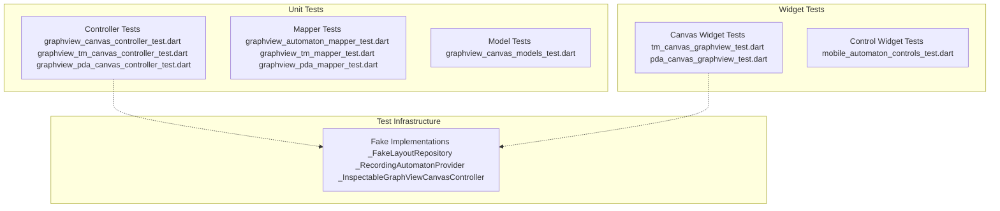
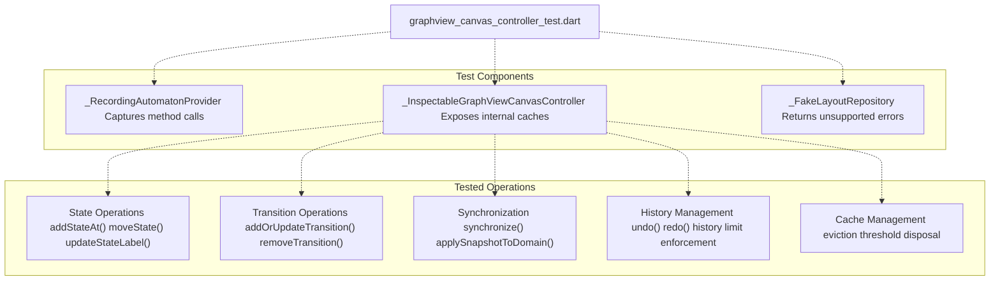
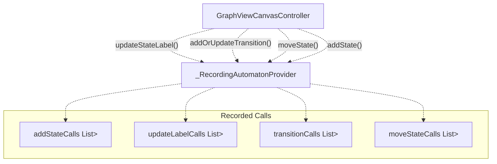
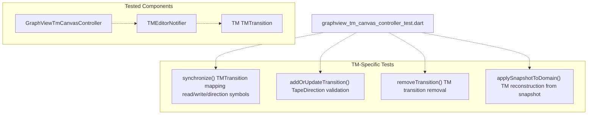
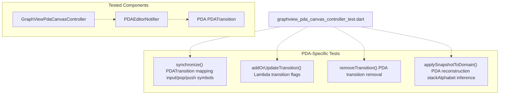
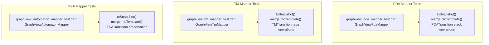
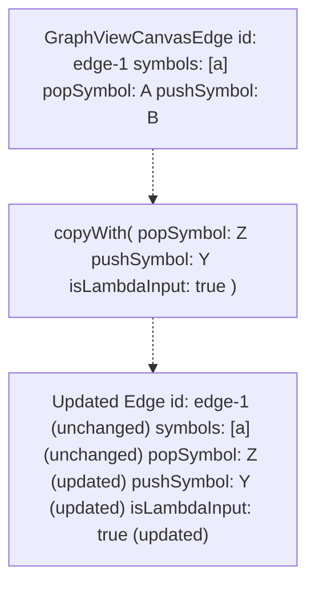
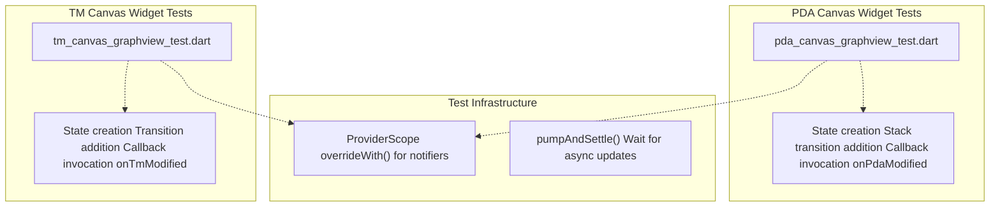

# Canvas System Tests

> **Relevant source files**
> * [lib/features/canvas/graphview/base_graphview_canvas_controller.dart](https://github.com/ThalesMMS/JFlutter/blob/32e808b4/lib/features/canvas/graphview/base_graphview_canvas_controller.dart)
> * [lib/features/canvas/graphview/graphview_canvas_controller.dart](https://github.com/ThalesMMS/JFlutter/blob/32e808b4/lib/features/canvas/graphview/graphview_canvas_controller.dart)
> * [lib/features/canvas/graphview/graphview_pda_canvas_controller.dart](https://github.com/ThalesMMS/JFlutter/blob/32e808b4/lib/features/canvas/graphview/graphview_pda_canvas_controller.dart)
> * [lib/features/canvas/graphview/graphview_pda_mapper.dart](https://github.com/ThalesMMS/JFlutter/blob/32e808b4/lib/features/canvas/graphview/graphview_pda_mapper.dart)
> * [lib/features/canvas/graphview/graphview_tm_canvas_controller.dart](https://github.com/ThalesMMS/JFlutter/blob/32e808b4/lib/features/canvas/graphview/graphview_tm_canvas_controller.dart)
> * [lib/features/canvas/graphview/graphview_tm_mapper.dart](https://github.com/ThalesMMS/JFlutter/blob/32e808b4/lib/features/canvas/graphview/graphview_tm_mapper.dart)
> * [lib/features/canvas/graphview/graphview_viewport_highlight_mixin.dart](https://github.com/ThalesMMS/JFlutter/blob/32e808b4/lib/features/canvas/graphview/graphview_viewport_highlight_mixin.dart)
> * [test/features/canvas/graphview/graphview_automaton_mapper_test.dart](https://github.com/ThalesMMS/JFlutter/blob/32e808b4/test/features/canvas/graphview/graphview_automaton_mapper_test.dart)
> * [test/features/canvas/graphview/graphview_canvas_controller_test.dart](https://github.com/ThalesMMS/JFlutter/blob/32e808b4/test/features/canvas/graphview/graphview_canvas_controller_test.dart)
> * [test/features/canvas/graphview/graphview_canvas_models_test.dart](https://github.com/ThalesMMS/JFlutter/blob/32e808b4/test/features/canvas/graphview/graphview_canvas_models_test.dart)
> * [test/features/canvas/graphview/graphview_pda_canvas_controller_test.dart](https://github.com/ThalesMMS/JFlutter/blob/32e808b4/test/features/canvas/graphview/graphview_pda_canvas_controller_test.dart)
> * [test/features/canvas/graphview/graphview_pda_mapper_test.dart](https://github.com/ThalesMMS/JFlutter/blob/32e808b4/test/features/canvas/graphview/graphview_pda_mapper_test.dart)
> * [test/features/canvas/graphview/graphview_tm_canvas_controller_test.dart](https://github.com/ThalesMMS/JFlutter/blob/32e808b4/test/features/canvas/graphview/graphview_tm_canvas_controller_test.dart)
> * [test/features/canvas/graphview/graphview_tm_mapper_test.dart](https://github.com/ThalesMMS/JFlutter/blob/32e808b4/test/features/canvas/graphview/graphview_tm_mapper_test.dart)
> * [test/widget/presentation/mobile_automaton_controls_test.dart](https://github.com/ThalesMMS/JFlutter/blob/32e808b4/test/widget/presentation/mobile_automaton_controls_test.dart)
> * [test/widget/presentation/pda_canvas_graphview_test.dart](https://github.com/ThalesMMS/JFlutter/blob/32e808b4/test/widget/presentation/pda_canvas_graphview_test.dart)
> * [test/widget/presentation/tm_canvas_graphview_test.dart](https://github.com/ThalesMMS/JFlutter/blob/32e808b4/test/widget/presentation/tm_canvas_graphview_test.dart)
> * [test/widget/presentation/visualizations_test.dart](https://github.com/ThalesMMS/JFlutter/blob/32e808b4/test/widget/presentation/visualizations_test.dart)

This page documents the comprehensive test suite for the Canvas System, the most complex subsystem in JFlutter (importance 67.95). The tests validate the GraphView-based canvas rendering engine, bidirectional synchronization between canvas controllers and Riverpod providers, and automaton editing interactions across FSA, PDA, and TM editors.

For information about the canvas system itself, see [Canvas System](#4). For widget tests of other UI components, see [Widget and Integration Tests](#12.2).

## Test Architecture Overview

The canvas test suite is organized into three layers: **unit tests** for controllers and mappers, **model tests** for data structures, and **widget tests** for UI integration.



**Sources:** [test/features/canvas/graphview/graphview_canvas_controller_test.dart L1-L521](https://github.com/ThalesMMS/JFlutter/blob/32e808b4/test/features/canvas/graphview/graphview_canvas_controller_test.dart#L1-L521)

 [test/features/canvas/graphview/graphview_tm_canvas_controller_test.dart L1-L227](https://github.com/ThalesMMS/JFlutter/blob/32e808b4/test/features/canvas/graphview/graphview_tm_canvas_controller_test.dart#L1-L227)

 [test/features/canvas/graphview/graphview_pda_canvas_controller_test.dart L1-L232](https://github.com/ThalesMMS/JFlutter/blob/32e808b4/test/features/canvas/graphview/graphview_pda_canvas_controller_test.dart#L1-L232)

## Controller Tests

### Base GraphView Canvas Controller

The base controller tests validate core functionality shared across all automaton types through `GraphViewCanvasController`, the FSA-specific implementation of `BaseGraphViewCanvasController`.



**Sources:** [test/features/canvas/graphview/graphview_canvas_controller_test.dart L30-L58](https://github.com/ThalesMMS/JFlutter/blob/32e808b4/test/features/canvas/graphview/graphview_canvas_controller_test.dart#L30-L58)

 [test/features/canvas/graphview/graphview_canvas_controller_test.dart L60-L148](https://github.com/ThalesMMS/JFlutter/blob/32e808b4/test/features/canvas/graphview/graphview_canvas_controller_test.dart#L60-L148)

 [test/features/canvas/graphview/graphview_canvas_controller_test.dart L150-L164](https://github.com/ThalesMMS/JFlutter/blob/32e808b4/test/features/canvas/graphview/graphview_canvas_controller_test.dart#L150-L164)

#### Key Test Scenarios

| Test Name | Validates | File Location |
| --- | --- | --- |
| `addStateAt generates id and forwards to provider` | ID generation, coordinate forwarding, initial state flag | [test/features/canvas/graphview/graphview_canvas_controller_test.dart L227-L237](https://github.com/ThalesMMS/JFlutter/blob/32e808b4/test/features/canvas/graphview/graphview_canvas_controller_test.dart#L227-L237) |
| `addStateAtCenter converts viewport centre into world coordinates` | Viewport-to-world coordinate transformation with pan/zoom | [test/features/canvas/graphview/graphview_canvas_controller_test.dart L239-L261](https://github.com/ThalesMMS/JFlutter/blob/32e808b4/test/features/canvas/graphview/graphview_canvas_controller_test.dart#L239-L261) |
| `moveState forwards coordinates to provider` | State position updates | [test/features/canvas/graphview/graphview_canvas_controller_test.dart L263-L274](https://github.com/ThalesMMS/JFlutter/blob/32e808b4/test/features/canvas/graphview/graphview_canvas_controller_test.dart#L263-L274) |
| `updateStateLabel normalises empty labels` | Empty label fallback to state ID | [test/features/canvas/graphview/graphview_canvas_controller_test.dart L276-L284](https://github.com/ThalesMMS/JFlutter/blob/32e808b4/test/features/canvas/graphview/graphview_canvas_controller_test.dart#L276-L284) |
| `addOrUpdateTransition sends payload to provider` | Transition creation with control points | [test/features/canvas/graphview/graphview_canvas_controller_test.dart L286-L307](https://github.com/ThalesMMS/JFlutter/blob/32e808b4/test/features/canvas/graphview/graphview_canvas_controller_test.dart#L286-L307) |
| `synchronize mirrors provider state into controller caches` | Bidirectional sync from domain model to canvas | [test/features/canvas/graphview/graphview_canvas_controller_test.dart L309-L359](https://github.com/ThalesMMS/JFlutter/blob/32e808b4/test/features/canvas/graphview/graphview_canvas_controller_test.dart#L309-L359) |
| `external synchronize clears undo history and notifies listeners` | History reset on external automaton load | [test/features/canvas/graphview/graphview_canvas_controller_test.dart L361-L416](https://github.com/ThalesMMS/JFlutter/blob/32e808b4/test/features/canvas/graphview/graphview_canvas_controller_test.dart#L361-L416) |
| `enforces undo history limit by discarding oldest entries` | History buffer size constraints | [test/features/canvas/graphview/graphview_canvas_controller_test.dart L418-L430](https://github.com/ThalesMMS/JFlutter/blob/32e808b4/test/features/canvas/graphview/graphview_canvas_controller_test.dart#L418-L430) |
| `dispose clears caches and history buffers` | Resource cleanup on disposal | [test/features/canvas/graphview/graphview_canvas_controller_test.dart L432-L446](https://github.com/ThalesMMS/JFlutter/blob/32e808b4/test/features/canvas/graphview/graphview_canvas_controller_test.dart#L432-L446) |
| `evicts caches when snapshot exceeds configured threshold` | Cache invalidation on model changes | [test/features/canvas/graphview/graphview_canvas_controller_test.dart L448-L519](https://github.com/ThalesMMS/JFlutter/blob/32e808b4/test/features/canvas/graphview/graphview_canvas_controller_test.dart#L448-L519) |

**Sources:** [test/features/canvas/graphview/graphview_canvas_controller_test.dart L166-L521](https://github.com/ThalesMMS/JFlutter/blob/32e808b4/test/features/canvas/graphview/graphview_canvas_controller_test.dart#L166-L521)

#### Test Infrastructure: Recording Provider

The `_RecordingAutomatonProvider` pattern captures method invocations to verify controller-to-provider communication:



**Sources:** [test/features/canvas/graphview/graphview_canvas_controller_test.dart L60-L148](https://github.com/ThalesMMS/JFlutter/blob/32e808b4/test/features/canvas/graphview/graphview_canvas_controller_test.dart#L60-L148)

### Specialized Controller Tests

#### TM Canvas Controller Tests

`graphview_tm_canvas_controller_test.dart` validates `GraphViewTmCanvasController` behavior specific to Turing Machines, including tape operations.



**Key validation:** TM transitions store `readSymbol`, `writeSymbol`, and `direction` (left/right/stay) correctly during canvas operations. The test at [test/features/canvas/graphview/graphview_tm_canvas_controller_test.dart L141-L161](https://github.com/ThalesMMS/JFlutter/blob/32e808b4/test/features/canvas/graphview/graphview_tm_canvas_controller_test.dart#L141-L161)

 verifies that tape operation metadata persists through the controller.

**Sources:** [test/features/canvas/graphview/graphview_tm_canvas_controller_test.dart L1-L227](https://github.com/ThalesMMS/JFlutter/blob/32e808b4/test/features/canvas/graphview/graphview_tm_canvas_controller_test.dart#L1-L227)

#### PDA Canvas Controller Tests

`graphview_pda_canvas_controller_test.dart` validates `GraphViewPdaCanvasController` stack operation handling.



**Key validation:** PDA transitions maintain `inputSymbol`, `popSymbol`, `pushSymbol`, and lambda flags (`isLambdaInput`, `isLambdaPop`, `isLambdaPush`). The test at [test/features/canvas/graphview/graphview_pda_canvas_controller_test.dart L143-L166](https://github.com/ThalesMMS/JFlutter/blob/32e808b4/test/features/canvas/graphview/graphview_pda_canvas_controller_test.dart#L143-L166)

 confirms stack metadata survives controller operations.

**Sources:** [test/features/canvas/graphview/graphview_pda_canvas_controller_test.dart L1-L232](https://github.com/ThalesMMS/JFlutter/blob/32e808b4/test/features/canvas/graphview/graphview_pda_canvas_controller_test.dart#L1-L232)

## Mapper Tests

Mappers convert domain models to `GraphViewAutomatonSnapshot` structures and back, ensuring the canvas representation matches the logical automaton state.

### Mapper Test Coverage



**Sources:** [test/features/canvas/graphview/graphview_automaton_mapper_test.dart L1-L150](https://github.com/ThalesMMS/JFlutter/blob/32e808b4/test/features/canvas/graphview/graphview_automaton_mapper_test.dart#L1-L150)

 [test/features/canvas/graphview/graphview_tm_mapper_test.dart L1-L159](https://github.com/ThalesMMS/JFlutter/blob/32e808b4/test/features/canvas/graphview/graphview_tm_mapper_test.dart#L1-L159)

 [test/features/canvas/graphview/graphview_pda_mapper_test.dart L1-L181](https://github.com/ThalesMMS/JFlutter/blob/32e808b4/test/features/canvas/graphview/graphview_pda_mapper_test.dart#L1-L181)

### Snapshot Encoding and Decoding

Each mapper test validates bidirectional conversion:

| Mapper | Tests | Key Assertions |
| --- | --- | --- |
| `GraphViewAutomatonMapper` | [test/features/canvas/graphview/graphview_automaton_mapper_test.dart L68-L93](https://github.com/ThalesMMS/JFlutter/blob/32e808b4/test/features/canvas/graphview/graphview_automaton_mapper_test.dart#L68-L93) | FSA nodes/edges preserve `inputSymbols`, control points |
| `GraphViewTmMapper` | [test/features/canvas/graphview/graphview_tm_mapper_test.dart L76-L92](https://github.com/ThalesMMS/JFlutter/blob/32e808b4/test/features/canvas/graphview/graphview_tm_mapper_test.dart#L76-L92) | TM edges encode `readSymbol`, `writeSymbol`, `direction` |
| `GraphViewPdaMapper` | [test/features/canvas/graphview/graphview_pda_mapper_test.dart L78-L106](https://github.com/ThalesMMS/JFlutter/blob/32e808b4/test/features/canvas/graphview/graphview_pda_mapper_test.dart#L78-L106) | PDA edges encode `inputSymbol`, `popSymbol`, `pushSymbol`, lambda flags |

**Reconstruction validation:** The `mergeIntoTemplate` tests ([FSA example at line 95-148](https://github.com/ThalesMMS/JFlutter/blob/32e808b4/FSA%20example%20at%20line%2095-148)

 [TM example at line 94-157](https://github.com/ThalesMMS/JFlutter/blob/32e808b4/TM%20example%20at%20line%2094-157)

 [PDA example at line 108-179](https://github.com/ThalesMMS/JFlutter/blob/32e808b4/PDA%20example%20at%20line%20108-179)

) ensure that snapshots can rebuild complete domain models with correct state positions, transitions, and alphabets.

**Sources:** [test/features/canvas/graphview/graphview_automaton_mapper_test.dart L24-L150](https://github.com/ThalesMMS/JFlutter/blob/32e808b4/test/features/canvas/graphview/graphview_automaton_mapper_test.dart#L24-L150)

 [test/features/canvas/graphview/graphview_tm_mapper_test.dart L24-L159](https://github.com/ThalesMMS/JFlutter/blob/32e808b4/test/features/canvas/graphview/graphview_tm_mapper_test.dart#L24-L159)

 [test/features/canvas/graphview/graphview_pda_mapper_test.dart L24-L181](https://github.com/ThalesMMS/JFlutter/blob/32e808b4/test/features/canvas/graphview/graphview_pda_mapper_test.dart#L24-L181)

## Model Tests

`graphview_canvas_models_test.dart` validates immutability and copy semantics of canvas data structures.

### GraphViewCanvasEdge Tests

The primary model test verifies `GraphViewCanvasEdge.copyWith()` correctly updates PDA-specific fields while preserving others:



This test at [test/features/canvas/graphview/graphview_canvas_models_test.dart L18-L44](https://github.com/ThalesMMS/JFlutter/blob/32e808b4/test/features/canvas/graphview/graphview_canvas_models_test.dart#L18-L44)

 ensures that `copyWith` provides immutable updates, crucial for undo/redo operations.

**Sources:** [test/features/canvas/graphview/graphview_canvas_models_test.dart L1-L46](https://github.com/ThalesMMS/JFlutter/blob/32e808b4/test/features/canvas/graphview/graphview_canvas_models_test.dart#L1-L46)

## Widget Tests

Widget tests validate end-to-end integration between canvas widgets, controllers, and Riverpod providers.

### Canvas Widget Integration Tests



**TM Canvas Test:** [test/widget/presentation/tm_canvas_graphview_test.dart L38-L80](https://github.com/ThalesMMS/JFlutter/blob/32e808b4/test/widget/presentation/tm_canvas_graphview_test.dart#L38-L80)

 validates that `TMCanvasGraphView` renders states, transitions, and invokes `onTmModified` callbacks when controller operations modify the TM model.

**PDA Canvas Test:** [test/widget/presentation/pda_canvas_graphview_test.dart L37-L84](https://github.com/ThalesMMS/JFlutter/blob/32e808b4/test/widget/presentation/pda_canvas_graphview_test.dart#L37-L84)

 confirms that `PDACanvasGraphView` synchronizes PDA state through `GraphViewPdaCanvasController` and correctly triggers modification callbacks.

**Sources:** [test/widget/presentation/tm_canvas_graphview_test.dart L1-L82](https://github.com/ThalesMMS/JFlutter/blob/32e808b4/test/widget/presentation/tm_canvas_graphview_test.dart#L1-L82)

 [test/widget/presentation/pda_canvas_graphview_test.dart L1-L86](https://github.com/ThalesMMS/JFlutter/blob/32e808b4/test/widget/presentation/pda_canvas_graphview_test.dart#L1-L86)

### Mobile Controls Widget Tests

`mobile_automaton_controls_test.dart` validates the mobile UI control panel without requiring a full canvas setup.

#### Test Coverage

| Test Scenario | Validates | Location |
| --- | --- | --- |
| `surfaces canvas and workspace actions` | Button rendering, callback invocation, status message display | [test/widget/presentation/mobile_automaton_controls_test.dart L21-L70](https://github.com/ThalesMMS/JFlutter/blob/32e808b4/test/widget/presentation/mobile_automaton_controls_test.dart#L21-L70) |
| `disables optional actions when flags are false` | Conditional button enablement for simulation/algorithms | [test/widget/presentation/mobile_automaton_controls_test.dart L72-L99](https://github.com/ThalesMMS/JFlutter/blob/32e808b4/test/widget/presentation/mobile_automaton_controls_test.dart#L72-L99) |
| `shows canvas tool toggles when enabled` | Tool selection UI (addState/addTransition) | [test/widget/presentation/mobile_automaton_controls_test.dart L101-L131](https://github.com/ThalesMMS/JFlutter/blob/32e808b4/test/widget/presentation/mobile_automaton_controls_test.dart#L101-L131) |

**Sources:** [test/widget/presentation/mobile_automaton_controls_test.dart L1-L132](https://github.com/ThalesMMS/JFlutter/blob/32e808b4/test/widget/presentation/mobile_automaton_controls_test.dart#L1-L132)

## Test Patterns and Utilities

### Recording Provider Pattern

The recording provider pattern enables verification of controller-provider interactions without coupling to real implementations:

```
// Pattern usage at test/features/canvas/graphview/graphview_canvas_controller_test.dart:60-148final List<Map<String, Object?>> addStateCalls = [];@overridevoid addState({required String id, required String label, ...}) {  addStateCalls.add({'id': id, 'label': label, ...});  super.addState(id: id, label: label, ...);}
```

**Verification example:**

```
controller.addStateAt(const Offset(120, 80));expect(provider.addStateCalls, hasLength(1));expect(provider.addStateCalls.single['x'], closeTo(120, 0.0001));
```

**Sources:** [test/features/canvas/graphview/graphview_canvas_controller_test.dart L60-L148](https://github.com/ThalesMMS/JFlutter/blob/32e808b4/test/features/canvas/graphview/graphview_canvas_controller_test.dart#L60-L148)

### Inspectable Controller Pattern

The inspectable controller exposes internal caches for direct verification:

```javascript
// Pattern at test/features/canvas/graphview/graphview_canvas_controller_test.dart:150-164class _InspectableGraphViewCanvasController extends GraphViewCanvasController {  Map<String, Node> get debugGraphNodes => graphNodes;  Map<String, Edge> get debugGraphEdges => graphEdges;}
```

This allows tests to verify cache eviction behavior ([test example at line 448-519](https://github.com/ThalesMMS/JFlutter/blob/32e808b4/test%20example%20at%20line%20448-519)

) without relying on black-box observation.

**Sources:** [test/features/canvas/graphview/graphview_canvas_controller_test.dart L150-L164](https://github.com/ThalesMMS/JFlutter/blob/32e808b4/test/features/canvas/graphview/graphview_canvas_controller_test.dart#L150-L164)

 [test/features/canvas/graphview/graphview_canvas_controller_test.dart L448-L519](https://github.com/ThalesMMS/JFlutter/blob/32e808b4/test/features/canvas/graphview/graphview_canvas_controller_test.dart#L448-L519)

### Coordinate Transformation Testing

Viewport-to-world coordinate tests use `Matrix4` transformations to validate pan/zoom calculations:

```
// Example from test/features/canvas/graphview/graphview_canvas_controller_test.dart:252-260transformation.value = Matrix4.identity()  ..translate(150.0, -50.0)  ..scale(1.5);controller.addStateAtCenter();final call = provider.addStateCalls.last;expect(call['x'], closeTo((400 - 150) / 1.5, 0.0001));expect(call['y'], closeTo((300 - (-50)) / 1.5, 0.0001));
```

**Sources:** [test/features/canvas/graphview/graphview_canvas_controller_test.dart L239-L261](https://github.com/ThalesMMS/JFlutter/blob/32e808b4/test/features/canvas/graphview/graphview_canvas_controller_test.dart#L239-L261)

 [test/features/canvas/graphview/graphview_tm_canvas_controller_test.dart L112-L139](https://github.com/ThalesMMS/JFlutter/blob/32e808b4/test/features/canvas/graphview/graphview_tm_canvas_controller_test.dart#L112-L139)

 [test/features/canvas/graphview/graphview_pda_canvas_controller_test.dart L114-L141](https://github.com/ThalesMMS/JFlutter/blob/32e808b4/test/features/canvas/graphview/graphview_pda_canvas_controller_test.dart#L114-L141)

## Known Test Gaps

### Visualization Golden Tests

A placeholder test exists at [test/widget/presentation/visualizations_test.dart L17-L21](https://github.com/ThalesMMS/JFlutter/blob/32e808b4/test/widget/presentation/visualizations_test.dart#L17-L21)

 marking the absence of golden image tests for canvas rendering. This is documented as Phase 3.2 work (T010) and intentionally fails to keep the gap visible.

**Reason:** Golden tests require renderer configuration and baseline image generation infrastructure not yet implemented.

**Sources:** [test/widget/presentation/visualizations_test.dart L1-L22](https://github.com/ThalesMMS/JFlutter/blob/32e808b4/test/widget/presentation/visualizations_test.dart#L1-L22)

## Running Canvas Tests

Execute canvas system tests with:

```
# All canvas testsflutter test test/features/canvas/# Specific controller testsflutter test test/features/canvas/graphview/graphview_canvas_controller_test.dart# Widget integration testsflutter test test/widget/presentation/tm_canvas_graphview_test.dartflutter test test/widget/presentation/pda_canvas_graphview_test.dart# Mobile controlsflutter test test/widget/presentation/mobile_automaton_controls_test.dart
```

**Sources:** [test/features/canvas/graphview/graphview_canvas_controller_test.dart L1-L521](https://github.com/ThalesMMS/JFlutter/blob/32e808b4/test/features/canvas/graphview/graphview_canvas_controller_test.dart#L1-L521)

 [test/widget/presentation/tm_canvas_graphview_test.dart L1-L82](https://github.com/ThalesMMS/JFlutter/blob/32e808b4/test/widget/presentation/tm_canvas_graphview_test.dart#L1-L82)

 [test/widget/presentation/pda_canvas_graphview_test.dart L1-L86](https://github.com/ThalesMMS/JFlutter/blob/32e808b4/test/widget/presentation/pda_canvas_graphview_test.dart#L1-L86)

 [test/widget/presentation/mobile_automaton_controls_test.dart L1-L132](https://github.com/ThalesMMS/JFlutter/blob/32e808b4/test/widget/presentation/mobile_automaton_controls_test.dart#L1-L132)

Refresh this wiki

Last indexed: 30 December 2025 ([32e808](https://github.com/ThalesMMS/JFlutter/commit/32e808b4))

### On this page

* [Canvas System Tests](#12.1-canvas-system-tests)
* [Test Architecture Overview](#12.1-test-architecture-overview)
* [Controller Tests](#12.1-controller-tests)
* [Base GraphView Canvas Controller](#12.1-base-graphview-canvas-controller)
* [Specialized Controller Tests](#12.1-specialized-controller-tests)
* [Mapper Tests](#12.1-mapper-tests)
* [Mapper Test Coverage](#12.1-mapper-test-coverage)
* [Snapshot Encoding and Decoding](#12.1-snapshot-encoding-and-decoding)
* [Model Tests](#12.1-model-tests)
* [GraphViewCanvasEdge Tests](#12.1-graphviewcanvasedge-tests)
* [Widget Tests](#12.1-widget-tests)
* [Canvas Widget Integration Tests](#12.1-canvas-widget-integration-tests)
* [Mobile Controls Widget Tests](#12.1-mobile-controls-widget-tests)
* [Test Patterns and Utilities](#12.1-test-patterns-and-utilities)
* [Recording Provider Pattern](#12.1-recording-provider-pattern)
* [Inspectable Controller Pattern](#12.1-inspectable-controller-pattern)
* [Coordinate Transformation Testing](#12.1-coordinate-transformation-testing)
* [Known Test Gaps](#12.1-known-test-gaps)
* [Visualization Golden Tests](#12.1-visualization-golden-tests)
* [Running Canvas Tests](#12.1-running-canvas-tests)

Ask Devin about JFlutter