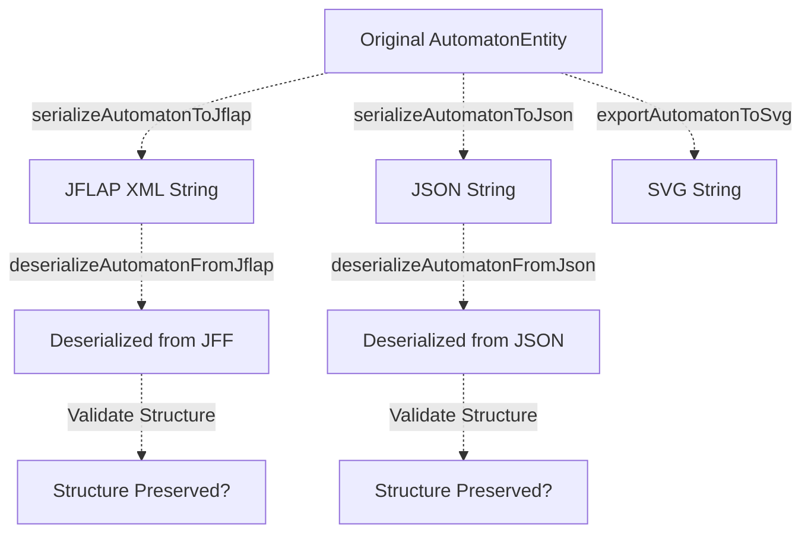
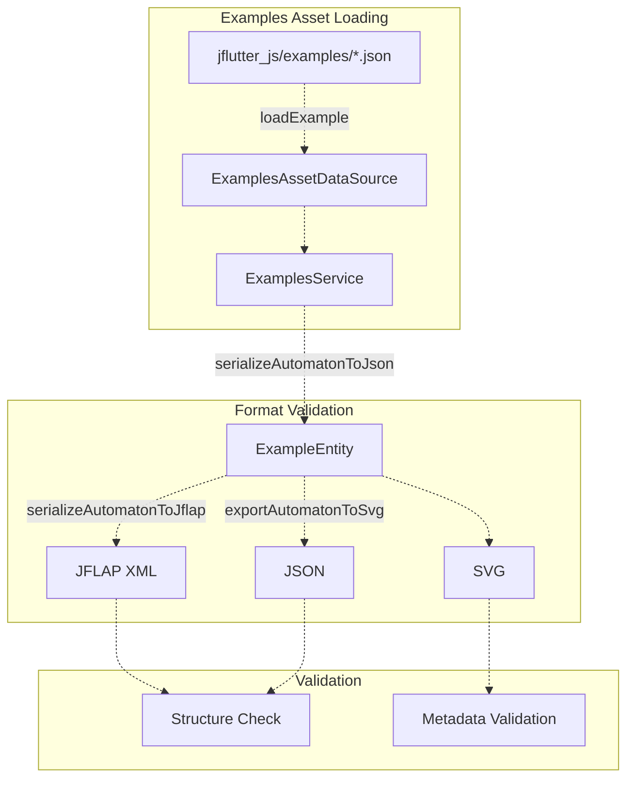
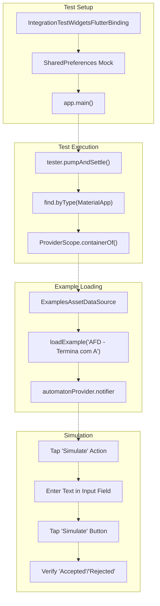

# Integration Tests

> **Relevant source files**
> * [integration_test/app_simulation_test.dart](https://github.com/ThalesMMS/JFlutter/blob/32e808b4/integration_test/app_simulation_test.dart)
> * [integration_test/driver.dart](https://github.com/ThalesMMS/JFlutter/blob/32e808b4/integration_test/driver.dart)
> * [lib/core/entities/automaton_entity.dart](https://github.com/ThalesMMS/JFlutter/blob/32e808b4/lib/core/entities/automaton_entity.dart)
> * [lib/data/repositories/automaton_repository_impl.dart](https://github.com/ThalesMMS/JFlutter/blob/32e808b4/lib/data/repositories/automaton_repository_impl.dart)
> * [lib/data/services/automaton_service.dart](https://github.com/ThalesMMS/JFlutter/blob/32e808b4/lib/data/services/automaton_service.dart)
> * [lib/data/services/serialization_service.dart](https://github.com/ThalesMMS/JFlutter/blob/32e808b4/lib/data/services/serialization_service.dart)
> * [pubspec.lock](https://github.com/ThalesMMS/JFlutter/blob/32e808b4/pubspec.lock)
> * [pubspec.yaml](https://github.com/ThalesMMS/JFlutter/blob/32e808b4/pubspec.yaml)
> * [test/core/services/simulation_highlight_service_test.dart](https://github.com/ThalesMMS/JFlutter/blob/32e808b4/test/core/services/simulation_highlight_service_test.dart)
> * [test/integration/io/examples_roundtrip_test.dart](https://github.com/ThalesMMS/JFlutter/blob/32e808b4/test/integration/io/examples_roundtrip_test.dart)
> * [test/integration/io/interoperability_roundtrip_test.dart](https://github.com/ThalesMMS/JFlutter/blob/32e808b4/test/integration/io/interoperability_roundtrip_test.dart)

## Purpose and Scope

Integration tests in JFlutter validate the interaction between multiple system components, ensuring that file I/O operations, format conversions, and end-to-end workflows function correctly. These tests focus on data integrity across serialization boundaries, interoperability with external formats (JFLAP XML), and complete user flows.

For testing individual components in isolation, see [Canvas System Tests](12a%20Canvas-System-Tests.md). For overall testing strategy, see [Testing](12%20Testing.md).

---

## Test Categories

JFlutter's integration test suite covers four main categories:

| Category | Test File | Primary Focus |
| --- | --- | --- |
| **Format Round-trips** | `test/integration/io/interoperability_roundtrip_test.dart` | JFLAP XML, JSON, SVG conversions |
| **Examples Validation** | `test/integration/io/examples_roundtrip_test.dart` | Embedded examples library |
| **App Workflows** | `integration_test/app_simulation_test.dart` | Full application flows |
| **Driver** | `integration_test/driver.dart` | Test execution harness |

---

## Format Round-trip Testing

### Overview

Round-trip tests validate that data can be serialized to a format and deserialized back without loss. These tests ensure interoperability between JFlutter's internal representation and external formats.



**Sources:** [test/integration/io/interoperability_roundtrip_test.dart L1-L650](https://github.com/ThalesMMS/JFlutter/blob/32e808b4/test/integration/io/interoperability_roundtrip_test.dart#L1-L650)

### JFLAP XML Round-trip Tests

Tests in the `JFF (JFLAP) Format Tests` group verify bidirectional conversion between JFlutter's internal format and JFLAP XML:

**Test Coverage:**

* **Basic Structure Preservation** [test/integration/io/interoperability_roundtrip_test.dart L37-L67](https://github.com/ThalesMMS/JFlutter/blob/32e808b4/test/integration/io/interoperability_roundtrip_test.dart#L37-L67)  - Validates that automaton structure remains intact after JFF round-trip
* **Complex Automata** [test/integration/io/interoperability_roundtrip_test.dart L69-L95](https://github.com/ThalesMMS/JFlutter/blob/32e808b4/test/integration/io/interoperability_roundtrip_test.dart#L69-L95)  - Tests automatons with multiple states and transitions
* **Epsilon Transitions** [test/integration/io/interoperability_roundtrip_test.dart L97-L136](https://github.com/ThalesMMS/JFlutter/blob/32e808b4/test/integration/io/interoperability_roundtrip_test.dart#L97-L136)  - Verifies ε-transitions serialize as `<read>ε</read>` and deserialize correctly
* **Epsilon Normalization** [test/integration/io/interoperability_roundtrip_test.dart L138-L190](https://github.com/ThalesMMS/JFlutter/blob/32e808b4/test/integration/io/interoperability_roundtrip_test.dart#L138-L190)  - Tests that all epsilon aliases (λ, vazio, empty string) normalize to ε
* **Error Handling** [test/integration/io/interoperability_roundtrip_test.dart L192-L220](https://github.com/ThalesMMS/JFlutter/blob/32e808b4/test/integration/io/interoperability_roundtrip_test.dart#L192-L220)  - Validates graceful handling of malformed XML

**Key Assertions:**

```xml
// JFLAP structure validationexpect(jffXml, contains('<?xml'));expect(jffXml, contains('<structure'));expect(jffXml, contains('<automaton'));// Epsilon normalizationexpect(jffXml, contains('<read>ε</read>'));expect(transitions['q0|ε'], contains('q1'));
```

**Sources:** [test/integration/io/interoperability_roundtrip_test.dart L36-L248](https://github.com/ThalesMMS/JFlutter/blob/32e808b4/test/integration/io/interoperability_roundtrip_test.dart#L36-L248)

### JSON Round-trip Tests

Tests in the `JSON Format Tests` group validate JFlutter's native JSON format:

**Test Coverage:**

* **Structure Preservation** [test/integration/io/interoperability_roundtrip_test.dart L251-L288](https://github.com/ThalesMMS/JFlutter/blob/32e808b4/test/integration/io/interoperability_roundtrip_test.dart#L251-L288)  - Ensures all automaton properties survive JSON round-trip
* **Complex Structures** [test/integration/io/interoperability_roundtrip_test.dart L290-L318](https://github.com/ThalesMMS/JFlutter/blob/32e808b4/test/integration/io/interoperability_roundtrip_test.dart#L290-L318)  - Tests multi-state automatons
* **Type Handling** [test/integration/io/interoperability_roundtrip_test.dart L320-L346](https://github.com/ThalesMMS/JFlutter/blob/32e808b4/test/integration/io/interoperability_roundtrip_test.dart#L320-L346)  - Validates DFA, NFA, and ε-NFA serialization
* **Error Handling** [test/integration/io/interoperability_roundtrip_test.dart L348-L370](https://github.com/ThalesMMS/JFlutter/blob/32e808b4/test/integration/io/interoperability_roundtrip_test.dart#L348-L370)  - Tests malformed JSON handling

**Sources:** [test/integration/io/interoperability_roundtrip_test.dart L250-L371](https://github.com/ThalesMMS/JFlutter/blob/32e808b4/test/integration/io/interoperability_roundtrip_test.dart#L250-L371)

### SVG Export Tests

SVG export tests validate visual representation generation without requiring deserialization (SVG is export-only):

**Test Coverage:**

* **Valid Structure Generation** [test/integration/io/interoperability_roundtrip_test.dart L374-L387](https://github.com/ThalesMMS/JFlutter/blob/32e808b4/test/integration/io/interoperability_roundtrip_test.dart#L374-L387)  - Ensures SVG contains required elements
* **Multiple Automaton Types** [test/integration/io/interoperability_roundtrip_test.dart L389-L403](https://github.com/ThalesMMS/JFlutter/blob/32e808b4/test/integration/io/interoperability_roundtrip_test.dart#L389-L403)  - Tests DFA, NFA, and ε-NFA export
* **Dimension Handling** [test/integration/io/interoperability_roundtrip_test.dart L405-L444](https://github.com/ThalesMMS/JFlutter/blob/32e808b4/test/integration/io/interoperability_roundtrip_test.dart#L405-L444)  - Validates viewBox and size attributes
* **Styling** [test/integration/io/interoperability_roundtrip_test.dart L446-L458](https://github.com/ThalesMMS/JFlutter/blob/32e808b4/test/integration/io/interoperability_roundtrip_test.dart#L446-L458)  - Verifies markers, defs, and CSS styles
* **Edge Cases** [test/integration/io/interoperability_roundtrip_test.dart L460-L528](https://github.com/ThalesMMS/JFlutter/blob/32e808b4/test/integration/io/interoperability_roundtrip_test.dart#L460-L528)  - Tests empty automatons, self-loops, and complex structures

**Turing Machine SVG:**

```html
final svg = SvgExporter.exportTuringMachineToSvg(tm);expect(svg, contains('<g class="tape">'));expect(svg, contains('<rect class="tape-cell"'));expect(svg, contains('<polygon class="head"'));
```

**Sources:** [test/integration/io/interoperability_roundtrip_test.dart L373-L529](https://github.com/ThalesMMS/JFlutter/blob/32e808b4/test/integration/io/interoperability_roundtrip_test.dart#L373-L529)

---

## Cross-Format Conversion Tests

### JFF ↔ JSON Conversion Chain

Tests in the `Cross-Format Conversion Tests` group validate data preservation through format changes:


**Test Coverage:**

* **JFF → JSON** [test/integration/io/interoperability_roundtrip_test.dart L532-L569](https://github.com/ThalesMMS/JFlutter/blob/32e808b4/test/integration/io/interoperability_roundtrip_test.dart#L532-L569)  - Validates JFF can be converted to JSON
* **JSON → JFF** [test/integration/io/interoperability_roundtrip_test.dart L571-L608](https://github.com/ThalesMMS/JFlutter/blob/32e808b4/test/integration/io/interoperability_roundtrip_test.dart#L571-L608)  - Validates JSON can be converted to JFF
* **Multi-format Round-trip** [test/integration/io/interoperability_roundtrip_test.dart L610-L650](https://github.com/ThalesMMS/JFlutter/blob/32e808b4/test/integration/io/interoperability_roundtrip_test.dart#L610-L650)  - Tests Original → JFF → JSON → JFF → Final

**Sources:** [test/integration/io/interoperability_roundtrip_test.dart L531-L651](https://github.com/ThalesMMS/JFlutter/blob/32e808b4/test/integration/io/interoperability_roundtrip_test.dart#L531-L651)

 [lib/data/services/serialization_service.dart L258-L296](https://github.com/ThalesMMS/JFlutter/blob/32e808b4/lib/data/services/serialization_service.dart#L258-L296)

---

## Data Integrity Validation

### Property Preservation Tests

The `Data Integrity Validation Tests` group ensures specific automaton properties survive round-trips:

**Test Coverage:**

* **Automaton Properties** [test/integration/io/interoperability_roundtrip_test.dart L654-L676](https://github.com/ThalesMMS/JFlutter/blob/32e808b4/test/integration/io/interoperability_roundtrip_test.dart#L654-L676)  - Validates id, name, type, alphabet, initialId
* **State Information** [test/integration/io/interoperability_roundtrip_test.dart L678-L712](https://github.com/ThalesMMS/JFlutter/blob/32e808b4/test/integration/io/interoperability_roundtrip_test.dart#L678-L712)  - Ensures state count, ids, names, positions preserved
* **Transition Information** [test/integration/io/interoperability_roundtrip_test.dart L714-L745](https://github.com/ThalesMMS/JFlutter/blob/32e808b4/test/integration/io/interoperability_roundtrip_test.dart#L714-L745)  - Validates transition map integrity
* **Edge Cases** [test/integration/io/interoperability_roundtrip_test.dart L747-L769](https://github.com/ThalesMMS/JFlutter/blob/32e808b4/test/integration/io/interoperability_roundtrip_test.dart#L747-L769)  - Tests empty automaton, single state, no transitions

**Validation Pattern:**

```
// Property-level assertionsexpect(jsonData['id'], equals(automatonData['id']));expect(jsonData['name'], equals(automatonData['name']));expect(jsonData['type'], equals(automatonData['type']));// Collection-level assertionsexpect(parsedStates.length, equals(originalStates.length));expect(parsedTransitions.length, equals(originalTransitions.length));
```

**Sources:** [test/integration/io/interoperability_roundtrip_test.dart L653-L770](https://github.com/ThalesMMS/JFlutter/blob/32e808b4/test/integration/io/interoperability_roundtrip_test.dart#L653-L770)

---

## Examples Library Integration Tests

### Overview

The examples library tests validate that embedded examples load correctly and can be serialized to all supported formats.



**Sources:** [test/integration/io/examples_roundtrip_test.dart L1-L98](https://github.com/ThalesMMS/JFlutter/blob/32e808b4/test/integration/io/examples_roundtrip_test.dart#L1-L98)

### Metadata and Structure Tests

Tests validate the examples library metadata system:

**Test Coverage:**

* **Category Information** [test/integration/io/examples_roundtrip_test.dart L104-L116](https://github.com/ThalesMMS/JFlutter/blob/32e808b4/test/integration/io/examples_roundtrip_test.dart#L104-L116)  - Validates `ExampleCategory` enum
* **Example Counts** [test/integration/io/examples_roundtrip_test.dart L118-L124](https://github.com/ThalesMMS/JFlutter/blob/32e808b4/test/integration/io/examples_roundtrip_test.dart#L118-L124)  - Verifies count-by-category functionality
* **Search Functionality** [test/integration/io/examples_roundtrip_test.dart L126-L131](https://github.com/ThalesMMS/JFlutter/blob/32e808b4/test/integration/io/examples_roundtrip_test.dart#L126-L131)  - Tests example search
* **Metadata Structure** [test/integration/io/examples_roundtrip_test.dart L133-L150](https://github.com/ThalesMMS/JFlutter/blob/32e808b4/test/integration/io/examples_roundtrip_test.dart#L133-L150)  - Validates `ExampleEntity` fields

**Key Enums:**

* `DifficultyLevel`: easy, medium, hard
* `ComplexityLevel`: low, medium, high
* `ExampleCategory`: dfa, nfa, cfg, pda, tm

**Sources:** [test/integration/io/examples_roundtrip_test.dart L103-L281](https://github.com/ThalesMMS/JFlutter/blob/32e808b4/test/integration/io/examples_roundtrip_test.dart#L103-L281)

 [lib/data/data_sources/examples_asset_data_source.dart](https://github.com/ThalesMMS/JFlutter/blob/32e808b4/lib/data/data_sources/examples_asset_data_source.dart)

### Serialization Tests for Examples

Tests ensure embedded examples can be serialized to JFLAP and JSON:

**Test Coverage:**

* **JFLAP XML Serialization** [test/integration/io/examples_roundtrip_test.dart L290-L309](https://github.com/ThalesMMS/JFlutter/blob/32e808b4/test/integration/io/examples_roundtrip_test.dart#L290-L309)  - Validates XML structure
* **JFLAP XML Deserialization** [test/integration/io/examples_roundtrip_test.dart L312-L338](https://github.com/ThalesMMS/JFlutter/blob/32e808b4/test/integration/io/examples_roundtrip_test.dart#L312-L338)  - Tests parsing back
* **JSON Serialization** [test/integration/io/examples_roundtrip_test.dart L340-L382](https://github.com/ThalesMMS/JFlutter/blob/32e808b4/test/integration/io/examples_roundtrip_test.dart#L340-L382)  - Validates JSON structure
* **JSON Deserialization** [test/integration/io/examples_roundtrip_test.dart L384-L409](https://github.com/ThalesMMS/JFlutter/blob/32e808b4/test/integration/io/examples_roundtrip_test.dart#L384-L409)  - Tests parsing back
* **Round-trip Tests** [test/integration/io/examples_roundtrip_test.dart L411-L453](https://github.com/ThalesMMS/JFlutter/blob/32e808b4/test/integration/io/examples_roundtrip_test.dart#L411-L453)  - Tests both formats
* **Error Handling** [test/integration/io/examples_roundtrip_test.dart L455-L493](https://github.com/ThalesMMS/JFlutter/blob/32e808b4/test/integration/io/examples_roundtrip_test.dart#L455-L493)  - Malformed XML/JSON

**Sources:** [test/integration/io/examples_roundtrip_test.dart L283-L494](https://github.com/ThalesMMS/JFlutter/blob/32e808b4/test/integration/io/examples_roundtrip_test.dart#L283-L494)

 [lib/data/services/serialization_service.dart L1-L308](https://github.com/ThalesMMS/JFlutter/blob/32e808b4/lib/data/services/serialization_service.dart#L1-L308)

### SVG Export Tests for Examples

Tests validate that examples can be exported to SVG:

**Test Coverage:**

* **Automaton SVG** [test/integration/io/examples_roundtrip_test.dart L497-L546](https://github.com/ThalesMMS/JFlutter/blob/32e808b4/test/integration/io/examples_roundtrip_test.dart#L497-L546)  - Tests basic automaton export
* **Turing Machine SVG** [test/integration/io/examples_roundtrip_test.dart L548-L600](https://github.com/ThalesMMS/JFlutter/blob/32e808b4/test/integration/io/examples_roundtrip_test.dart#L548-L600)  - Tests TM-specific rendering (tape, head, legend)
* **Grammar SVG** [test/integration/io/examples_roundtrip_test.dart L602-L623](https://github.com/ThalesMMS/JFlutter/blob/32e808b4/test/integration/io/examples_roundtrip_test.dart#L602-L623)  - Tests CFG export
* **Export Options** [test/integration/io/examples_roundtrip_test.dart L625-L651](https://github.com/ThalesMMS/JFlutter/blob/32e808b4/test/integration/io/examples_roundtrip_test.dart#L625-L651)  - Tests `SvgExportOptions`
* **Size Handling** [test/integration/io/examples_roundtrip_test.dart L653-L698](https://github.com/ThalesMMS/JFlutter/blob/32e808b4/test/integration/io/examples_roundtrip_test.dart#L653-L698)  - Tests different canvas sizes
* **Complex Structures** [test/integration/io/examples_roundtrip_test.dart L700-L756](https://github.com/ThalesMMS/JFlutter/blob/32e808b4/test/integration/io/examples_roundtrip_test.dart#L700-L756)  - Tests multi-state automatons

**Turing Machine Export Validation:**

```html
// Tape elementsexpect(svg, contains('<g class="tape">'));expect(svg, contains('<rect class="tape-cell"'));expect(svg, contains('<text x="112" y="102" class="tape-symbol"'));// Head indicatorexpect(svg, contains('<polygon class="head"'));// Legendexpect(svg, contains('<g class="legend">'));expect(svg, contains('δ(q, s) = (q′, w, d)'));
```

**Sources:** [test/integration/io/examples_roundtrip_test.dart L496-L756](https://github.com/ThalesMMS/JFlutter/blob/32e808b4/test/integration/io/examples_roundtrip_test.dart#L496-L756)

 [lib/presentation/widgets/export/svg_exporter.dart](https://github.com/ThalesMMS/JFlutter/blob/32e808b4/lib/presentation/widgets/export/svg_exporter.dart)

---

## App Workflow Integration Tests

### Overview

The `integration_test/` directory contains Flutter integration tests that exercise the full application with a real widget tree.



**Sources:** [integration_test/app_simulation_test.dart L1-L71](https://github.com/ThalesMMS/JFlutter/blob/32e808b4/integration_test/app_simulation_test.dart#L1-L71)

### Example Loading and Simulation Test

The primary integration test validates the complete workflow:

**Test Steps:**

1. **App Initialization** [integration_test/app_simulation_test.dart L14-L25](https://github.com/ThalesMMS/JFlutter/blob/32e808b4/integration_test/app_simulation_test.dart#L14-L25) * Set up mock SharedPreferences * Launch app via `app.main()` * Wait for widget tree to settle * Verify MaterialApp is present
2. **Provider Access** [integration_test/app_simulation_test.dart L27-L31](https://github.com/ThalesMMS/JFlutter/blob/32e808b4/integration_test/app_simulation_test.dart#L27-L31) * Get ProviderScope container from widget tree * Access providers without listen flag
3. **Example Loading** [integration_test/app_simulation_test.dart L33-L42](https://github.com/ThalesMMS/JFlutter/blob/32e808b4/integration_test/app_simulation_test.dart#L33-L42) * Load example from `ExamplesAssetDataSource` * Validate successful load * Extract automaton from example * Replace current automaton in provider
4. **Simulation Panel** [integration_test/app_simulation_test.dart L48-L53](https://github.com/ThalesMMS/JFlutter/blob/32e808b4/integration_test/app_simulation_test.dart#L48-L53) * Find and tap "Simulate" quick action * Verify simulation sheet opens * Find input field by semantic label
5. **Run Simulations** [integration_test/app_simulation_test.dart L55-L70](https://github.com/ThalesMMS/JFlutter/blob/32e808b4/integration_test/app_simulation_test.dart#L55-L70) * Helper function `runSimulation(input, expectedLabel)` * Test accepted input: "ba" → "Accepted" * Test rejected input: "bb" → "Rejected"

**Key Assertions:**

```
// App loadedexpect(materialAppFinder, findsOneWidget);// Example loaded successfullyexpect(exampleResult.isSuccess, isTrue);expect(automaton, isNotNull);// Simulation resultsexpect(find.text('Accepted'), findsOneWidget);expect(find.text('Rejected'), findsOneWidget);
```

**Sources:** [integration_test/app_simulation_test.dart L10-L71](https://github.com/ThalesMMS/JFlutter/blob/32e808b4/integration_test/app_simulation_test.dart#L10-L71)

---

## Test Infrastructure

### Test Utilities and Services

Integration tests leverage several service classes:

| Service | Purpose | Key Methods |
| --- | --- | --- |
| `SerializationService` | Format conversion | `serializeAutomatonToJflap`, `serializeAutomatonToJson`, `deserializeAutomatonFromJflap`, `deserializeAutomatonFromJson`, `roundTripTest` |
| `JFLAPXMLParser` | XML parsing | `parseJFLAPFile` |
| `SvgExporter` | SVG generation | `exportAutomatonToSvg`, `exportTuringMachineToSvg`, `exportGrammarToSvg` |
| `ExamplesAssetDataSource` | Asset loading | `loadExample`, `getAvailableCategories`, `searchExamples` |
| `ExamplesService` | Examples management | `getAvailableCategories`, `getExamplesCountByCategory` |
| `AutomatonRepositoryImpl` | Repository pattern | `saveAutomaton`, `loadAutomaton`, `exportAutomaton`, `importAutomaton` |
| `AutomatonService` | In-memory storage | `createAutomaton`, `getAutomaton`, `validateAutomaton` |

**Sources:** [lib/data/services/serialization_service.dart L1-L308](https://github.com/ThalesMMS/JFlutter/blob/32e808b4/lib/data/services/serialization_service.dart#L1-L308)

 [lib/data/services/examples_service.dart](https://github.com/ThalesMMS/JFlutter/blob/32e808b4/lib/data/services/examples_service.dart)

 [lib/data/repositories/automaton_repository_impl.dart L1-L329](https://github.com/ThalesMMS/JFlutter/blob/32e808b4/lib/data/repositories/automaton_repository_impl.dart#L1-L329)

 [lib/data/services/automaton_service.dart L1-L327](https://github.com/ThalesMMS/JFlutter/blob/32e808b4/lib/data/services/automaton_service.dart#L1-L327)

### Helper Functions

Test files define helper functions to create test automata:

**Automaton Factory Functions:**

* `_createTestDFA()` - Simple DFA with 2-3 states
* `_createTestNFA()` - NFA with non-deterministic transitions
* `_createEpsilonNFA()` - NFA with ε-transitions
* `_createComplexDFA()` - Multi-state automaton
* `_createEmptyAutomaton()` - No states or transitions
* `_createSingleStateAutomaton()` - One state only
* `_createNoTransitionsAutomaton()` - States but no transitions
* `_createLargeAutomaton()` - Performance testing automaton
* `_buildSimpleTuringMachine()` - Basic TM for SVG tests

**Conversion Utilities:**

* `_convertEntityToData()` - `AutomatonEntity` → `Map<String, dynamic>`

**Sources:** [test/integration/io/interoperability_roundtrip_test.dart L837-L1702](https://github.com/ThalesMMS/JFlutter/blob/32e808b4/test/integration/io/interoperability_roundtrip_test.dart#L837-L1702)

 [test/integration/io/examples_roundtrip_test.dart L25-L91](https://github.com/ThalesMMS/JFlutter/blob/32e808b4/test/integration/io/examples_roundtrip_test.dart#L25-L91)

---

## Performance and Scalability Tests

### Performance Validation

The `Performance and Scalability Tests` group validates that operations complete within acceptable time limits:

**Test Coverage:**

* **Large Automaton Round-trip** [test/integration/io/interoperability_roundtrip_test.dart L773-L798](https://github.com/ThalesMMS/JFlutter/blob/32e808b4/test/integration/io/interoperability_roundtrip_test.dart#L773-L798) * Creates automaton with many states/transitions * JSON serialize + deserialize * Must complete in < 1000ms
* **Large Automaton SVG Export** [test/integration/io/interoperability_roundtrip_test.dart L800-L819](https://github.com/ThalesMMS/JFlutter/blob/32e808b4/test/integration/io/interoperability_roundtrip_test.dart#L800-L819) * Exports large automaton to SVG * Must complete in < 1000ms
* **Multiple Format Conversions** [test/integration/io/interoperability_roundtrip_test.dart L821-L847](https://github.com/ThalesMMS/JFlutter/blob/32e808b4/test/integration/io/interoperability_roundtrip_test.dart#L821-L847) * Performs 10 round-trips through both formats * Must complete in < 2000ms

**Performance Testing Pattern:**

```
final stopwatch = Stopwatch()..start();// Perform operationfinal result = service.operation(data);stopwatch.stop();expect(result.isSuccess, true);expect(stopwatch.elapsedMilliseconds, lessThan(1000));
```

**Sources:** [test/integration/io/interoperability_roundtrip_test.dart L772-L847](https://github.com/ThalesMMS/JFlutter/blob/32e808b4/test/integration/io/interoperability_roundtrip_test.dart#L772-L847)

---

## Test Execution

### Running Integration Tests

Integration tests use Flutter's test framework with different configurations:

**Unit-style Integration Tests:**

```
# Run all round-trip testsflutter test test/integration/# Run specific test fileflutter test test/integration/io/interoperability_roundtrip_test.dart# Run with verbose outputflutter test test/integration/ --reporter expanded
```

**Flutter Integration Tests:**

```
# Run on device/emulatorflutter test integration_test/# Run with specific deviceflutter test integration_test/ -d chrome# Run with driverflutter drive \  --driver=integration_test/driver.dart \  --target=integration_test/app_simulation_test.dart
```

**Sources:** [integration_test/driver.dart L1-L3](https://github.com/ThalesMMS/JFlutter/blob/32e808b4/integration_test/driver.dart#L1-L3)

 [pubspec.yaml L86-L92](https://github.com/ThalesMMS/JFlutter/blob/32e808b4/pubspec.yaml#L86-L92)

### Test Dependencies

Integration tests require specific dev dependencies:

```yaml
dev_dependencies:  flutter_test:    sdk: flutter  integration_test:    sdk: flutter  test: ^1.24.0  shared_preferences_platform_interface: ^2.4.1
```

**Sources:** [pubspec.yaml L86-L92](https://github.com/ThalesMMS/JFlutter/blob/32e808b4/pubspec.yaml#L86-L92)

---

## Validation Strategies

### Round-trip Validation

The `SerializationService` provides utilities for round-trip validation:

**Round-trip Test Method:**

```
Result<Map<String, dynamic>> roundTripTest(  Map<String, dynamic> automatonData,  SerializationFormat format,)
```

Performs: Serialize → Deserialize → Return result

**Validation Method:**

```
bool validateRoundTrip(  Map<String, dynamic> original,  Map<String, dynamic> roundTripped,)
```

Validates structure preservation by comparing state and transition counts.

**Sources:** [lib/data/services/serialization_service.dart L258-L296](https://github.com/ThalesMMS/JFlutter/blob/32e808b4/lib/data/services/serialization_service.dart#L258-L296)

### Structure Assertions

Integration tests validate structure at multiple levels:

**XML Structure:**

* XML declaration: `<?xml version="1.0"`
* Root element: `<structure type="fa">`
* Automaton container: `<automaton>`
* State elements: `<state id="q0">`
* Transition elements: `<transition>`

**JSON Structure:**

* Required fields: id, name, type, alphabet, states, transitions
* State objects: id, name, x, y, isInitial, isFinal
* Transition map: `Map<String, List<String>>`

**SVG Structure:**

* XML declaration
* SVG root: `<svg width="..." height="..." viewBox="...">`
* Definitions: `<defs>` with markers
* Styles: `<style>` block
* Visual elements: circles, lines, text, paths

**Sources:** [test/integration/io/interoperability_roundtrip_test.dart L36-L651](https://github.com/ThalesMMS/JFlutter/blob/32e808b4/test/integration/io/interoperability_roundtrip_test.dart#L36-L651)

---

## Known Test Constraints

### Mobile Platform Constraints

Integration tests validate behavior under mobile platform constraints documented in [Known Deviations from Theory](13b%20Known-Deviations-from-Theory.md):

* **NFA→DFA Conversion Limit**: Tests verify 1000-state cap
* **Epsilon Normalization**: All ε aliases normalized to single symbol
* **Performance Thresholds**: 1-second limit for large automatons

### Format-Specific Limitations

**JFLAP XML:**

* Must handle epsilon aliases (ε, λ, lambda, vazio, empty string)
* Position attributes may be in `x`/`y` elements or attributes
* State IDs may be in `id` or `name` attributes

**JSON:**

* Preserves exact coordinates and metadata
* Native format with no normalization required

**SVG:**

* Export-only format (no import)
* Rendering assumes finite canvas bounds
* No support for unbounded automatons

**Sources:** [lib/data/services/serialization_service.dart L199-L201](https://github.com/ThalesMMS/JFlutter/blob/32e808b4/lib/data/services/serialization_service.dart#L199-L201)

 [lib/core/utils/epsilon_utils.dart](https://github.com/ThalesMMS/JFlutter/blob/32e808b4/lib/core/utils/epsilon_utils.dart)


### On this page

* [Integration Tests](#12.2-integration-tests)
* [Purpose and Scope](#12.2-purpose-and-scope)
* [Test Categories](#12.2-test-categories)
* [Format Round-trip Testing](#12.2-format-round-trip-testing)
* [Overview](#12.2-overview)
* [JFLAP XML Round-trip Tests](#12.2-jflap-xml-round-trip-tests)
* [JSON Round-trip Tests](#12.2-json-round-trip-tests)
* [SVG Export Tests](#12.2-svg-export-tests)
* [Cross-Format Conversion Tests](#12.2-cross-format-conversion-tests)
* [JFF ↔ JSON Conversion Chain](#12.2-jff-json-conversion-chain)
* [Data Integrity Validation](#12.2-data-integrity-validation)
* [Property Preservation Tests](#12.2-property-preservation-tests)
* [Examples Library Integration Tests](#12.2-examples-library-integration-tests)
* [Overview](#12.2-overview-1)
* [Metadata and Structure Tests](#12.2-metadata-and-structure-tests)
* [Serialization Tests for Examples](#12.2-serialization-tests-for-examples)
* [SVG Export Tests for Examples](#12.2-svg-export-tests-for-examples)
* [App Workflow Integration Tests](#12.2-app-workflow-integration-tests)
* [Overview](#12.2-overview-2)
* [Example Loading and Simulation Test](#12.2-example-loading-and-simulation-test)
* [Test Infrastructure](#12.2-test-infrastructure)
* [Test Utilities and Services](#12.2-test-utilities-and-services)
* [Helper Functions](#12.2-helper-functions)
* [Performance and Scalability Tests](#12.2-performance-and-scalability-tests)
* [Performance Validation](#12.2-performance-validation)
* [Test Execution](#12.2-test-execution)
* [Running Integration Tests](#12.2-running-integration-tests)
* [Test Dependencies](#12.2-test-dependencies)
* [Validation Strategies](#12.2-validation-strategies)
* [Round-trip Validation](#12.2-round-trip-validation)
* [Structure Assertions](#12.2-structure-assertions)
* [Known Test Constraints](#12.2-known-test-constraints)
* [Mobile Platform Constraints](#12.2-mobile-platform-constraints)
* [Format-Specific Limitations](#12.2-format-specific-limitations)

Ask Devin about JFlutter