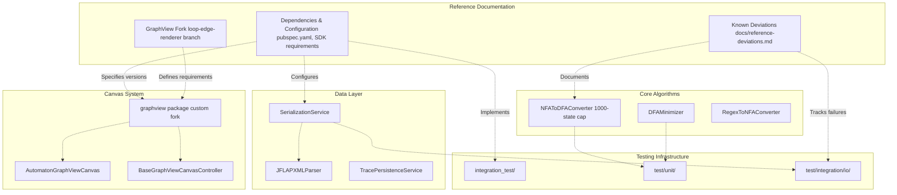
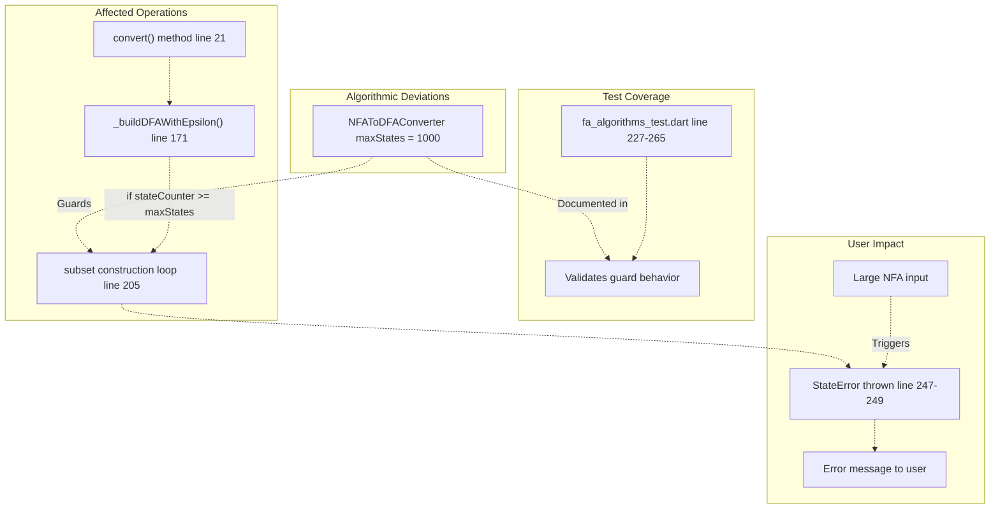
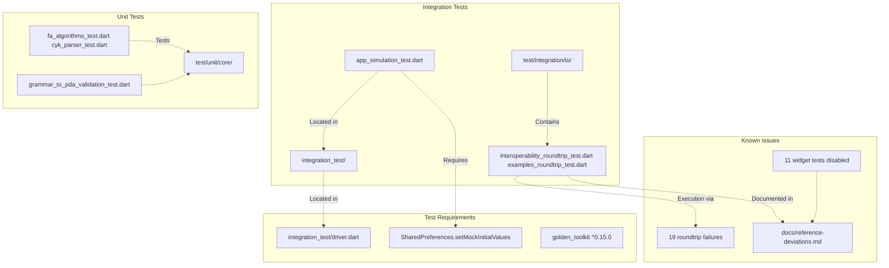
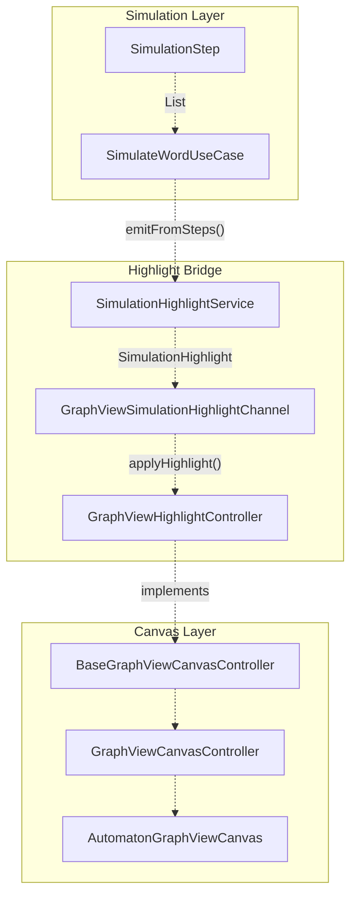
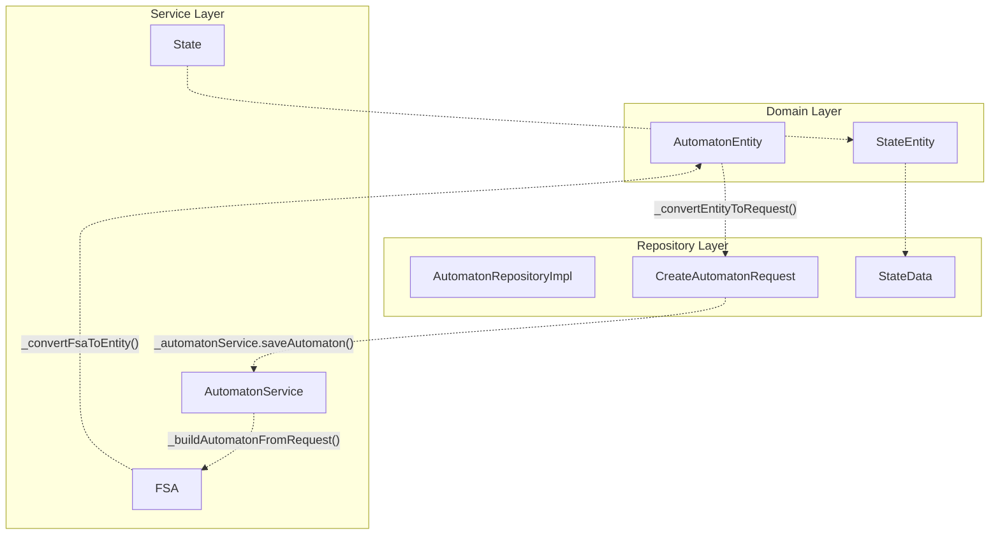

# Reference

> **Relevant source files**
> * [docs/reference-deviations.md](https://github.com/ThalesMMS/JFlutter/blob/32e808b4/docs/reference-deviations.md)
> * [integration_test/app_simulation_test.dart](https://github.com/ThalesMMS/JFlutter/blob/32e808b4/integration_test/app_simulation_test.dart)
> * [integration_test/driver.dart](https://github.com/ThalesMMS/JFlutter/blob/32e808b4/integration_test/driver.dart)
> * [lib/core/algorithms/nfa_to_dfa_converter.dart](https://github.com/ThalesMMS/JFlutter/blob/32e808b4/lib/core/algorithms/nfa_to_dfa_converter.dart)
> * [pubspec.lock](https://github.com/ThalesMMS/JFlutter/blob/32e808b4/pubspec.lock)
> * [pubspec.yaml](https://github.com/ThalesMMS/JFlutter/blob/32e808b4/pubspec.yaml)
> * [test/unit/core/automata/fa_algorithms_test.dart](https://github.com/ThalesMMS/JFlutter/blob/32e808b4/test/unit/core/automata/fa_algorithms_test.dart)
> * [test/unit/core/cfg/cyk_parser_test.dart](https://github.com/ThalesMMS/JFlutter/blob/32e808b4/test/unit/core/cfg/cyk_parser_test.dart)
> * [test/unit/grammar_to_pda_validation_test.dart](https://github.com/ThalesMMS/JFlutter/blob/32e808b4/test/unit/grammar_to_pda_validation_test.dart)

This section provides technical reference material for JFlutter developers, including dependency specifications, configuration requirements, documented deviations from formal language theory, and library customizations. For setup instructions, see [Getting Started](#3). For testing documentation, see [Testing](#12).

---

## Overview

The Reference section is organized into three main areas:

1. **Dependencies and Configuration** ([13.1](#13.1)) - Complete documentation of runtime and development dependencies, SDK requirements, asset configuration, and build settings
2. **Known Deviations from Theory** ([13.2](#13.2)) - Documented intentional deviations from theoretical formal language algorithms and reference implementations, with rationale and mitigation strategies
3. **GraphView Library Fork** ([13.3](#13.3)) - Details on the custom GraphView fork used for automaton visualization, including loop-edge rendering modifications

These reference pages complement the main documentation by providing precise technical specifications, constraint documentation, and compatibility notes.

---

## Reference Architecture Overview

The following diagram illustrates how the three reference areas relate to JFlutter's architecture and where they impact the codebase:



**Sources:** [pubspec.yaml L1-L174](https://github.com/ThalesMMS/JFlutter/blob/32e808b4/pubspec.yaml#L1-L174)

 [docs/reference-deviations.md L1-L56](https://github.com/ThalesMMS/JFlutter/blob/32e808b4/docs/reference-deviations.md#L1-L56)

 [lib/core/algorithms/nfa_to_dfa_converter.dart L1-L463](https://github.com/ThalesMMS/JFlutter/blob/32e808b4/lib/core/algorithms/nfa_to_dfa_converter.dart#L1-L463)

---

## Quick Reference: Key Dependencies

The following table provides a quick reference to JFlutter's most critical dependencies. For complete dependency documentation, see [Dependencies and Configuration](#13.1).

| Package | Version | Critical For | Configuration |
| --- | --- | --- | --- |
| `flutter` | SDK ≥3.24.0 | Core framework | [pubspec.yaml L28](https://github.com/ThalesMMS/JFlutter/blob/32e808b4/pubspec.yaml#L28-L28) |
| `dart` | SDK ^3.8.0 | Language runtime | [pubspec.yaml L27](https://github.com/ThalesMMS/JFlutter/blob/32e808b4/pubspec.yaml#L27-L27) |
| `riverpod` / `flutter_riverpod` | ^2.5.1 / ^2.6.1 | State management | [pubspec.yaml L66-L67](https://github.com/ThalesMMS/JFlutter/blob/32e808b4/pubspec.yaml#L66-L67) |
| `graphview` | git:loop-edge-renderer | Canvas rendering | [pubspec.yaml L54-L57](https://github.com/ThalesMMS/JFlutter/blob/32e808b4/pubspec.yaml#L54-L57) |
| `xml` | ^6.5.0 | JFLAP import/export | [pubspec.yaml L70](https://github.com/ThalesMMS/JFlutter/blob/32e808b4/pubspec.yaml#L70-L70) |
| `vector_math` | ^2.1.4 | Coordinate calculations | [pubspec.yaml L78](https://github.com/ThalesMMS/JFlutter/blob/32e808b4/pubspec.yaml#L78-L78) |
| `petitparser` | ^7.0.1 | Grammar parsing | [pubspec.yaml L82](https://github.com/ThalesMMS/JFlutter/blob/32e808b4/pubspec.yaml#L82-L82) |

**Sources:** [pubspec.yaml L26-L84](https://github.com/ThalesMMS/JFlutter/blob/32e808b4/pubspec.yaml#L26-L84)

---

## Quick Reference: Known Deviations

The following table summarizes critical deviations from theoretical algorithms and reference implementations. For complete deviation documentation, see [Known Deviations from Theory](#13.2).

| Area | Deviation | Location | Impact |
| --- | --- | --- | --- |
| **NFA→DFA Conversion** | 1,000 state cap during subset construction | [lib/core/algorithms/nfa_to_dfa_converter.dart L204](https://github.com/ThalesMMS/JFlutter/blob/32e808b4/lib/core/algorithms/nfa_to_dfa_converter.dart#L204-L204) | Prevents OOM on mobile; may reject valid edge cases |
| **Integration Tests** | 19 round-trip test failures | [test/integration/io/](https://github.com/ThalesMMS/JFlutter/blob/32e808b4/test/integration/io/) | Epsilon serialization mismatches, SVG formatting issues |
| **Widget Tests** | 11 disabled test cases | [test/widget/](https://github.com/ThalesMMS/JFlutter/blob/32e808b4/test/widget/) | Missing error UI widgets, outdated test finders |

**Sources:** [docs/reference-deviations.md L28-L38](https://github.com/ThalesMMS/JFlutter/blob/32e808b4/docs/reference-deviations.md#L28-L38)

 [lib/core/algorithms/nfa_to_dfa_converter.dart L202-L207](https://github.com/ThalesMMS/JFlutter/blob/32e808b4/lib/core/algorithms/nfa_to_dfa_converter.dart#L202-L207)

## <old_str>

## Quick Reference: Configuration

### SDK and Build Requirements

From [pubspec.yaml L26-L28](https://github.com/ThalesMMS/JFlutter/blob/32e808b4/pubspec.yaml#L26-L28)

:

```yaml
environment:  sdk: ^3.8.0  flutter: ">=3.24.0"
```

### Code Generation Commands

```sql
# Generate freezed and json_serializable codeflutter pub run build_runner build --delete-conflicting-outputs# Watch mode for developmentflutter pub run build_runner watch
```

### Integration Test Setup

Integration tests require mock initialization before running:

```
SharedPreferences.setMockInitialValues(const {});
```

Example from [integration_test/app_simulation_test.dart L14](https://github.com/ThalesMMS/JFlutter/blob/32e808b4/integration_test/app_simulation_test.dart#L14-L14)

:

For complete configuration documentation, see [Dependencies and Configuration](#13.1).

## Sources: pubspec.yaml26-28 integration_test/app_simulation_test.dart13-17
</old_str>
<new_str>

## Deviation Impact Map

The following diagram shows how documented deviations impact different parts of the codebase:



**Sources:** [lib/core/algorithms/nfa_to_dfa_converter.dart L21-L46](https://github.com/ThalesMMS/JFlutter/blob/32e808b4/lib/core/algorithms/nfa_to_dfa_converter.dart#L21-L46)

 [lib/core/algorithms/nfa_to_dfa_converter.dart L171-L284](https://github.com/ThalesMMS/JFlutter/blob/32e808b4/lib/core/algorithms/nfa_to_dfa_converter.dart#L171-L284)

 [test/unit/core/automata/fa_algorithms_test.dart L227-L265](https://github.com/ThalesMMS/JFlutter/blob/32e808b4/test/unit/core/automata/fa_algorithms_test.dart#L227-L265)

---

## Known Issues and Deviations

JFlutter maintains a deviation log documenting intentional or accepted differences from reference implementations. These deviations are tracked in [docs/reference-deviations.md L1-L56](https://github.com/ThalesMMS/JFlutter/blob/32e808b4/docs/reference-deviations.md#L1-L56)

### Active Deviations

#### Algorithmic Deviations

| Issue | Baseline | Impact | Mitigation | Owner | Last Reviewed |
| --- | --- | --- | --- | --- | --- |
| **NFA→DFA State Cap** | Theoretical 2^n expansion in [`lib/core/algorithms/nfa_to_dfa_converter.dart`](https://github.com/ThalesMMS/JFlutter/blob/32e808b4/`lib/core/algorithms/nfa_to_dfa_converter.dart`) | Hard ceiling of 1,000 DFA states to prevent OOM on mobile devices | May reject valid edge cases; revisit with streaming evaluation | Core Algorithms WG | 2024-05-30 |

The NFA→DFA converter implements a hard limit on the number of states produced during subset construction to prevent memory exhaustion on mobile platforms. This deviates from the theoretical unbounded construction algorithm.

#### Integration Test Failures

| Issue | Baseline | Impact | Mitigation | Owner | Last Reviewed |
| --- | --- | --- | --- | --- | --- |
| **Import/Export Round-trip** | Python `automata-main` serializers, SVG fixtures | 19 known failures related to epsilon serialization mismatches and SVG viewBox formatting for empty automata | Manual verification required for affected artifacts; exporters remain usable | Interop WG | 2024-05-30 |
| **Widget Test Coverage** | Flutter widget test suites | 11 tests disabled due to missing widgets (`error_banner`, `import_error_dialog`, `retry_button`) and outdated finders | Limited automated coverage for error paths; blocking CI | Presentation WG | 2024-05-30 |

**Epsilon Serialization Issues:**

The epsilon symbol normalization between different representations (`ε`, `λ`, `vazio`, empty string) causes round-trip failures when importing JFLAP XML and re-exporting to SVG. Test cases in [test/integration/io/interoperability_roundtrip_test.dart L97-L190](https://github.com/ThalesMMS/JFlutter/blob/32e808b4/test/integration/io/interoperability_roundtrip_test.dart#L97-L190)

 document these inconsistencies.

**Empty Automaton SVG Rendering:**

SVG export for automata with no states produces placeholder text but has inconsistent viewBox formatting across test baselines. See [test/integration/io/interoperability_roundtrip_test.dart L222-L247](https://github.com/ThalesMMS/JFlutter/blob/32e808b4/test/integration/io/interoperability_roundtrip_test.dart#L222-L247)

 and [test/integration/io/examples_roundtrip_test.dart L460-L468](https://github.com/ThalesMMS/JFlutter/blob/32e808b4/test/integration/io/examples_roundtrip_test.dart#L460-L468)

**Sources:** [docs/reference-deviations.md L1-L56](https://github.com/ThalesMMS/JFlutter/blob/32e808b4/docs/reference-deviations.md#L1-L56)

 [test/integration/io/interoperability_roundtrip_test.dart L1-L1260](https://github.com/ThalesMMS/JFlutter/blob/32e808b4/test/integration/io/interoperability_roundtrip_test.dart#L1-L1260)

 [test/integration/io/examples_roundtrip_test.dart L1-L812](https://github.com/ThalesMMS/JFlutter/blob/32e808b4/test/integration/io/examples_roundtrip_test.dart#L1-L812)

---

## Test Execution Reference

The following diagram maps test categories to their locations and execution requirements:



**Test Execution Commands:**

```
# Unit testsflutter test test/unit/# Integration testsflutter test integration_test/# With driver for full integrationflutter drive \  --driver=integration_test/driver.dart \  --target=integration_test/app_simulation_test.dart
```

**Sources:** [integration_test/app_simulation_test.dart L1-L72](https://github.com/ThalesMMS/JFlutter/blob/32e808b4/integration_test/app_simulation_test.dart#L1-L72)

 [integration_test/driver.dart L1-L4](https://github.com/ThalesMMS/JFlutter/blob/32e808b4/integration_test/driver.dart#L1-L4)

 [test/unit/core/automata/fa_algorithms_test.dart L1-L268](https://github.com/ThalesMMS/JFlutter/blob/32e808b4/test/unit/core/automata/fa_algorithms_test.dart#L1-L268)

 [test/unit/grammar_to_pda_validation_test.dart L1-L415](https://github.com/ThalesMMS/JFlutter/blob/32e808b4/test/unit/grammar_to_pda_validation_test.dart#L1-L415)

 [docs/reference-deviations.md L28-L38](https://github.com/ThalesMMS/JFlutter/blob/32e808b4/docs/reference-deviations.md#L28-L38)

---

## Related Documentation

* **[Dependencies and Configuration](#13.1)** - Complete dependency specifications, SDK requirements, and build configuration
* **[Known Deviations from Theory](#13.2)** - Detailed deviation log with rationale, impact analysis, and mitigation strategies
* **[GraphView Library Fork](#13.3)** - Custom GraphView modifications for loop-edge rendering and automaton visualization

For architectural documentation, see [Architecture](#2). For testing strategy, see [Testing](#12).

---

## Development Notes

### Code Generation

JFlutter uses several code generation tools that must be run when modifying annotated classes:

```sql
# Generate freezed and json_serializable codeflutter pub run build_runner build --delete-conflicting-outputs# Watch mode for developmentflutter pub run build_runner watch
```

The following packages require code generation:

* `freezed` - Immutable class generation for domain entities
* `json_serializable` - JSON serialization/deserialization
* `flutter_launcher_icons` - Icon generation

### Persistence Implementation

`LocalStorageDataSource` uses `shared_preferences` to persist automaton state. The implementation is in [lib/data/data_sources/local_storage_data_source.dart](https://github.com/ThalesMMS/JFlutter/blob/32e808b4/lib/data/data_sources/local_storage_data_source.dart)

**Storage Keys:**

* Automaton data is stored with string keys
* Settings are persisted separately
* Trace history has a 50-trace limit (see trace persistence service)

### Integration Testing

Integration tests require mock initialization:

```
SharedPreferences.setMockInitialValues(const {});
```

This is demonstrated in [integration_test/app_simulation_test.dart L14](https://github.com/ThalesMMS/JFlutter/blob/32e808b4/integration_test/app_simulation_test.dart#L14-L14)

**Running Integration Tests:**

```
# Run on connected deviceflutter test integration_test/# Run with driverflutter drive \  --driver=integration_test/driver.dart \  --target=integration_test/app_simulation_test.dart
```

### Test Execution Notes

Several test files document performance constraints and round-trip validation:

* **Performance Ceiling:** Large automaton round-trips must complete within 1 second ([test/integration/io/interoperability_roundtrip_test.dart L773-L798](https://github.com/ThalesMMS/JFlutter/blob/32e808b4/test/integration/io/interoperability_roundtrip_test.dart#L773-L798) )
* **SVG Export Performance:** SVG generation for large automata must complete within reasonable time bounds ([test/integration/io/interoperability_roundtrip_test.dart L800-L814](https://github.com/ThalesMMS/JFlutter/blob/32e808b4/test/integration/io/interoperability_roundtrip_test.dart#L800-L814) )
* **State Preservation:** Round-trip tests validate that state information, transition structure, and automaton properties are preserved ([test/integration/io/interoperability_roundtrip_test.dart L653-L770](https://github.com/ThalesMMS/JFlutter/blob/32e808b4/test/integration/io/interoperability_roundtrip_test.dart#L653-L770) )

**Sources:** [lib/data/data_sources/local_storage_data_source.dart](https://github.com/ThalesMMS/JFlutter/blob/32e808b4/lib/data/data_sources/local_storage_data_source.dart)

 [integration_test/app_simulation_test.dart L1-L72](https://github.com/ThalesMMS/JFlutter/blob/32e808b4/integration_test/app_simulation_test.dart#L1-L72)

 [integration_test/driver.dart L1-L4](https://github.com/ThalesMMS/JFlutter/blob/32e808b4/integration_test/driver.dart#L1-L4)

 [test/integration/io/interoperability_roundtrip_test.dart L773-L814](https://github.com/ThalesMMS/JFlutter/blob/32e808b4/test/integration/io/interoperability_roundtrip_test.dart#L773-L814)

---

## Service Locator Pattern

JFlutter uses `get_it` for dependency injection. Services are registered at startup and accessed via singleton pattern. The service locator is configured during app initialization.

**Registered Services:**

* `AutomatonService` - In-memory automaton CRUD operations
* `SerializationService` - Format conversion services
* `ExamplesService` - Example automaton loading

**Implementation Pattern:**

```
// Service registration (typically in main.dart)final getIt = GetIt.instance;getIt.registerSingleton<AutomatonService>(AutomatonService());getIt.registerSingleton<SerializationService>(SerializationService());// Service retrievalfinal service = GetIt.instance<AutomatonService>();
```

The service pattern is used by repository implementations such as [lib/data/repositories/automaton_repository_impl.dart L23-L26](https://github.com/ThalesMMS/JFlutter/blob/32e808b4/lib/data/repositories/automaton_repository_impl.dart#L23-L26)

**Sources:** [pubspec.yaml L65](https://github.com/ThalesMMS/JFlutter/blob/32e808b4/pubspec.yaml#L65-L65)

 [lib/data/repositories/automaton_repository_impl.dart L23-L26](https://github.com/ThalesMMS/JFlutter/blob/32e808b4/lib/data/repositories/automaton_repository_impl.dart#L23-L26)

 [lib/data/services/automaton_service.dart L1-L327](https://github.com/ThalesMMS/JFlutter/blob/32e808b4/lib/data/services/automaton_service.dart#L1-L327)

---

## Simulation Highlight Channel

The simulation highlight system uses a channel pattern to bridge the core simulation service with GraphView canvas controllers. This architecture decouples simulation logic from rendering.



**Test Coverage:**

The highlight channel is tested in [test/core/services/simulation_highlight_service_test.dart L1-L105](https://github.com/ThalesMMS/JFlutter/blob/32e808b4/test/core/services/simulation_highlight_service_test.dart#L1-L105)

 The fake controller implementation demonstrates the interface contract ([test/core/services/simulation_highlight_service_test.dart L19-L32](https://github.com/ThalesMMS/JFlutter/blob/32e808b4/test/core/services/simulation_highlight_service_test.dart#L19-L32)

).

**Sources:** [test/core/services/simulation_highlight_service_test.dart L1-L105](https://github.com/ThalesMMS/JFlutter/blob/32e808b4/test/core/services/simulation_highlight_service_test.dart#L1-L105)

 [lib/core/services/simulation_highlight_service.dart](https://github.com/ThalesMMS/JFlutter/blob/32e808b4/lib/core/services/simulation_highlight_service.dart)

 [lib/features/canvas/graphview/graphview_highlight_channel.dart](https://github.com/ThalesMMS/JFlutter/blob/32e808b4/lib/features/canvas/graphview/graphview_highlight_channel.dart)

 [lib/features/canvas/graphview/graphview_highlight_controller.dart](https://github.com/ThalesMMS/JFlutter/blob/32e808b4/lib/features/canvas/graphview/graphview_highlight_controller.dart)

---

## Repository Pattern Implementation

JFlutter implements the repository pattern to abstract persistence and serialization logic from domain entities. The pattern is demonstrated in [lib/data/repositories/automaton_repository_impl.dart L1-L330](https://github.com/ThalesMMS/JFlutter/blob/32e808b4/lib/data/repositories/automaton_repository_impl.dart#L1-L330)

### Conversion Flow



**Key Conversions:**

* `_convertEntityToRequest()` - [lib/data/repositories/automaton_repository_impl.dart L132-L173](https://github.com/ThalesMMS/JFlutter/blob/32e808b4/lib/data/repositories/automaton_repository_impl.dart#L132-L173)
* `_convertFsaToEntity()` - [lib/data/repositories/automaton_repository_impl.dart L175-L224](https://github.com/ThalesMMS/JFlutter/blob/32e808b4/lib/data/repositories/automaton_repository_impl.dart#L175-L224)
* `_convertEntityToFsa()` - [lib/data/repositories/automaton_repository_impl.dart L226-L306](https://github.com/ThalesMMS/JFlutter/blob/32e808b4/lib/data/repositories/automaton_repository_impl.dart#L226-L306)

**Sources:** [lib/data/repositories/automaton_repository_impl.dart L1-L330](https://github.com/ThalesMMS/JFlutter/blob/32e808b4/lib/data/repositories/automaton_repository_impl.dart#L1-L330)

 [lib/data/services/automaton_service.dart L1-L327](https://github.com/ThalesMMS/JFlutter/blob/32e808b4/lib/data/services/automaton_service.dart#L1-L327)

---

## Version and Build Information

From [pubspec.yaml L24](https://github.com/ThalesMMS/JFlutter/blob/32e808b4/pubspec.yaml#L24-L24)

:

```yaml
version: 1.0.0+1
```

* **Version:** 1.0.0
* **Build Number:** 1

The version follows semantic versioning (major.minor.patch) with an optional build number suffix.

**Sources:** [pubspec.yaml L24](https://github.com/ThalesMMS/JFlutter/blob/32e808b4/pubspec.yaml#L24-L24)

---

## Review and Maintenance

The deviation log documented in [docs/reference-deviations.md L1-L56](https://github.com/ThalesMMS/JFlutter/blob/32e808b4/docs/reference-deviations.md#L1-L56)

 should be reviewed during each milestone planning session. Owners are responsible for:

1. Keeping deviation entries current
2. Escalating when timelines or impacts change
3. Moving resolved deviations to the resolved section with resolution details
4. Re-evaluating deviations when reference sources are updated

**Last Updated:** This reference document reflects the state of dependencies and known issues as of the codebase snapshot. Refer to [docs/reference-deviations.md](https://github.com/ThalesMMS/JFlutter/blob/32e808b4/docs/reference-deviations.md)

 for the most current deviation tracking.

**Sources:** [docs/reference-deviations.md L49-L55](https://github.com/ThalesMMS/JFlutter/blob/32e808b4/docs/reference-deviations.md#L49-L55)

Refresh this wiki

Last indexed: 30 December 2025 ([32e808](https://github.com/ThalesMMS/JFlutter/commit/32e808b4))

### On this page

* [Reference](#13-reference)
* [Overview](#13-overview)
* [Reference Architecture Overview](#13-reference-architecture-overview)
* [Quick Reference: Key Dependencies](#13-quick-reference-key-dependencies)
* [Quick Reference: Known Deviations](#13-quick-reference-known-deviations)
* [<old_str>](#13-old_str)
* [Quick Reference: Configuration](#13-quick-reference-configuration)
* [SDK and Build Requirements](#13-sdk-and-build-requirements)
* [Code Generation Commands](#13-code-generation-commands)
* [Integration Test Setup](#13-integration-test-setup)
* [Sources: pubspec.yaml26-28 integration_test/app_simulation_test.dart13-17 </old_str> <new_str>](#13-object-object-object-object-object-object-old_str-new_str)
* [Deviation Impact Map](#13-deviation-impact-map)
* [Known Issues and Deviations](#13-known-issues-and-deviations)
* [Active Deviations](#13-active-deviations)
* [Test Execution Reference](#13-test-execution-reference)
* [Related Documentation](#13-related-documentation)
* [Development Notes](#13-development-notes)
* [Code Generation](#13-code-generation)
* [Persistence Implementation](#13-persistence-implementation)
* [Integration Testing](#13-integration-testing)
* [Test Execution Notes](#13-test-execution-notes)
* [Service Locator Pattern](#13-service-locator-pattern)
* [Simulation Highlight Channel](#13-simulation-highlight-channel)
* [Repository Pattern Implementation](#13-repository-pattern-implementation)
* [Conversion Flow](#13-conversion-flow)
* [Version and Build Information](#13-version-and-build-information)
* [Review and Maintenance](#13-review-and-maintenance)

Ask Devin about JFlutter