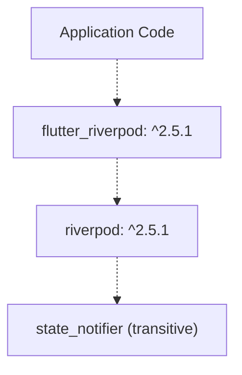
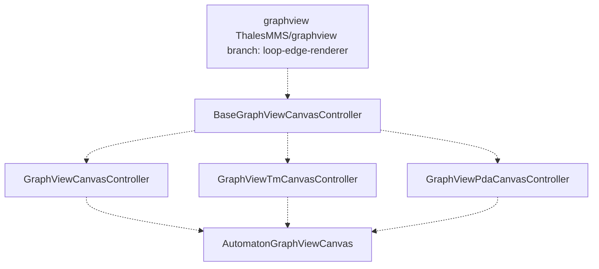
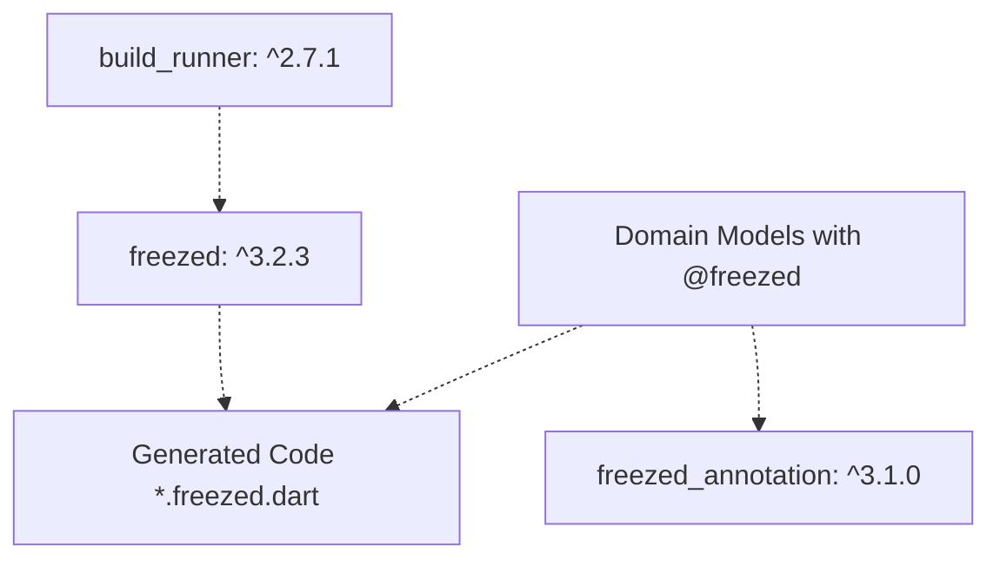
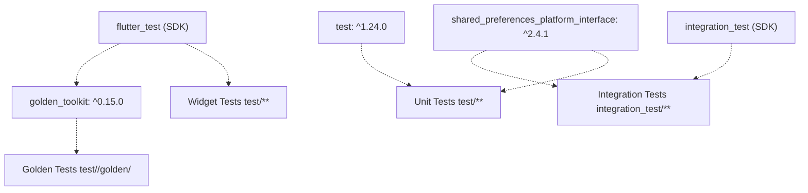
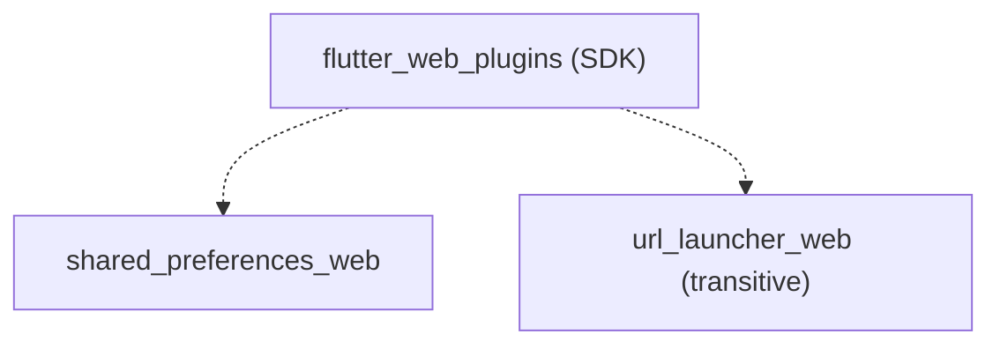
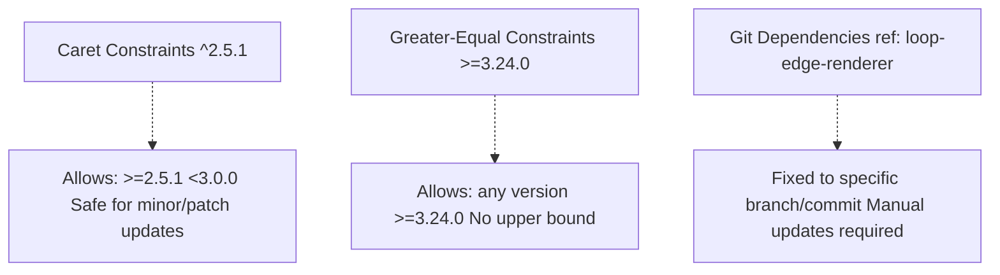

# Dependencies and Configuration

> **Relevant source files**
> * [README.md](https://github.com/ThalesMMS/JFlutter/blob/32e808b4/README.md)
> * [USER_GUIDE](https://github.com/ThalesMMS/JFlutter/blob/32e808b4/USER_GUIDE)
> * [docs/canvas_bridge.md](https://github.com/ThalesMMS/JFlutter/blob/32e808b4/docs/canvas_bridge.md)
> * [integration_test/app_simulation_test.dart](https://github.com/ThalesMMS/JFlutter/blob/32e808b4/integration_test/app_simulation_test.dart)
> * [integration_test/driver.dart](https://github.com/ThalesMMS/JFlutter/blob/32e808b4/integration_test/driver.dart)
> * [pubspec.lock](https://github.com/ThalesMMS/JFlutter/blob/32e808b4/pubspec.lock)
> * [pubspec.yaml](https://github.com/ThalesMMS/JFlutter/blob/32e808b4/pubspec.yaml)

This page provides a comprehensive reference for all external dependencies used in JFlutter, their purposes, version requirements, and configuration details. This information is essential for understanding the project setup, troubleshooting build issues, and managing dependency updates.

For information about the overall architecture that uses these dependencies, see [Architecture](2%20Architecture.md). For testing-specific dependencies and their usage patterns, see [Testing](12%20Testing.md).

---

## Dependency Overview

JFlutter uses 40+ external packages across development, runtime, and build-time contexts. Dependencies are organized into functional categories that align with the application's clean architecture.

```mermaid
flowchart TD

FlutterTest["flutter_test (SDK)"]
GoldenToolkit["golden_toolkit: ^0.15.0"]
IntegrationTest["integration_test (SDK)"]
Test["test: ^1.24.0"]
BuildRunner["build_runner: ^2.7.1"]
FreezedGen["freezed: ^3.2.3"]
JsonSerializable["json_serializable: ^6.11.1"]
FlutterLauncher["flutter_launcher_icons: ^0.14.4"]
Collection["collection: ^1.18.0"]
PetitParser["petitparser: ^7.0.1"]
CupertinoIcons["cupertino_icons: ^1.0.8"]
GraphView["graphview (Custom Fork)"]
VectorMath["vector_math: ^2.1.4"]
XML["xml: ^6.5.0"]
Freezed["freezed_annotation: ^3.1.0"]
JsonAnnotation["json_annotation: ^4.9.0"]
DartSDK["Dart SDK ^3.8.0"]
FlutterSDK["Flutter SDK >=3.24.0"]
Flutter["flutter (SDK)"]
FlutterWeb["flutter_web_plugins (SDK)"]
Riverpod["riverpod: ^2.5.1"]
FlutterRiverpod["flutter_riverpod: ^2.5.1"]
Provider["provider: ^6.1.2"]
GetIt["get_it: ^8.0.0"]
SharedPrefs["shared_preferences: ^2.3.2"]
PathProvider["path_provider: ^2.1.4"]
FilePicker["file_picker: ^8.0.0+1"]
SharePlus["share_plus: ^12.0.0"]

DartSDK -.-> Flutter
FlutterSDK -.-> Flutter
Flutter -.-> Riverpod
Flutter -.-> FlutterRiverpod
Flutter -.-> Provider
SharedPrefs -.-> FlutterWeb
PathProvider -.-> Flutter
FilePicker -.-> Flutter
SharePlus -.-> Flutter

subgraph subGraph4 ["File Operations Layer"]
    FilePicker
    SharePlus
end

subgraph subGraph3 ["Data Persistence Layer"]
    SharedPrefs
    PathProvider
end

subgraph subGraph2 ["State Management Layer"]
    Riverpod
    FlutterRiverpod
    Provider
    GetIt
    FlutterRiverpod -.-> Riverpod
end

subgraph subGraph1 ["Core Runtime Dependencies"]
    Flutter
    FlutterWeb
end

subgraph subGraph0 ["SDK Requirements"]
    DartSDK
    FlutterSDK
end

subgraph subGraph9 ["Testing Dependencies"]
    FlutterTest
    GoldenToolkit
    IntegrationTest
    Test
    FlutterTest -.-> GoldenToolkit
end

subgraph subGraph8 ["Build-Time Dependencies"]
    BuildRunner
    FreezedGen
    JsonSerializable
    FlutterLauncher
    BuildRunner -.-> FreezedGen
    BuildRunner -.-> JsonSerializable
end

subgraph subGraph7 ["Utilities Layer"]
    Collection
    PetitParser
    CupertinoIcons
end

subgraph subGraph6 ["Canvas & Rendering Layer"]
    GraphView
    VectorMath
    GraphView -.-> VectorMath
end

subgraph subGraph5 ["Parsing & Serialization Layer"]
    XML
    Freezed
    JsonAnnotation
end
```



**Sources:** [pubspec.yaml L26-L104](https://github.com/ThalesMMS/JFlutter/blob/32e808b4/pubspec.yaml#L26-L104)

---

## SDK Requirements

### Dart SDK

**Version:** `^3.8.0`

The minimum Dart SDK version is 3.8.0, which provides:

* Enhanced pattern matching capabilities
* Records and destructuring
* Class modifiers (sealed, interface, mixin)
* Null safety (stable)

### Flutter SDK

**Version:** `>=3.24.0`

Flutter 3.24.0 or higher is required for:

* Latest widget rendering optimizations
* Enhanced web plugin support
* Material Design 3 components
* Improved cross-platform compatibility

**Sources:** [pubspec.yaml L26-L28](https://github.com/ThalesMMS/JFlutter/blob/32e808b4/pubspec.yaml#L26-L28)

---

## Core Runtime Dependencies

### State Management

#### Riverpod Ecosystem



| Package | Version | Purpose |
| --- | --- | --- |
| `riverpod` | ^2.5.1 | Core state management logic, provider definitions |
| `flutter_riverpod` | ^2.5.1 | Flutter widgets for consuming providers (ProviderScope, ConsumerWidget) |

**Key Classes:**

* `ProviderScope` - Root container for all providers
* `ConsumerWidget` - Base class for widgets that read providers
* `StateNotifier` - Base class for state management logic
* `AutoDisposeNotifier` - Self-disposing state notifiers

**Usage Example:**
[integration_test/app_simulation_test.dart L28-L31](https://github.com/ThalesMMS/JFlutter/blob/32e808b4/integration_test/app_simulation_test.dart#L28-L31)

 demonstrates provider container access:

```
final container = ProviderScope.containerOf(  tester.element(materialAppFinder),  listen: false,);
```

**Sources:** [pubspec.yaml L63-L67](https://github.com/ThalesMMS/JFlutter/blob/32e808b4/pubspec.yaml#L63-L67)

 [integration_test/app_simulation_test.dart L1-L72](https://github.com/ThalesMMS/JFlutter/blob/32e808b4/integration_test/app_simulation_test.dart#L1-L72)

#### Legacy State Management

| Package | Version | Purpose |
| --- | --- | --- |
| `provider` | ^6.1.2 | Legacy state management for backward compatibility |
| `get_it` | ^8.0.0 | Service locator pattern for dependency injection |

**Note:** The codebase primarily uses Riverpod for new features, with `provider` and `get_it` maintained for legacy code paths.

**Sources:** [pubspec.yaml L64-L65](https://github.com/ThalesMMS/JFlutter/blob/32e808b4/pubspec.yaml#L64-L65)

### Data Persistence

#### SharedPreferences

**Package:** `shared_preferences: ^2.3.2`

**Purpose:** Cross-platform key-value storage for:

* User settings and preferences
* Automaton state persistence
* Simulation trace history
* UI configuration (viewport position, zoom level)

**Platform Implementations:**

* Android: `shared_preferences_android: ^2.4.12`
* iOS/macOS: `shared_preferences_foundation: ^2.5.4`
* Linux: `shared_preferences_linux: ^2.4.1`
* Windows: `shared_preferences_windows: ^2.4.1`
* Web: `shared_preferences_web: ^2.4.3`

**Key Services:**

* `LocalStorageDataSource` - Wraps SharedPreferences for automaton storage
* `SettingsRepository` - Manages user preferences
* `TracePersistenceService` - Stores simulation history (50 trace limit)

**Testing Support:**
[integration_test/app_simulation_test.dart L14](https://github.com/ThalesMMS/JFlutter/blob/32e808b4/integration_test/app_simulation_test.dart#L14-L14)

 shows mock initialization:

```
SharedPreferences.setMockInitialValues(const {});
```

**Sources:** [pubspec.yaml L42-L43](https://github.com/ThalesMMS/JFlutter/blob/32e808b4/pubspec.yaml#L42-L43)

 [pubspec.lock L691-L746](https://github.com/ThalesMMS/JFlutter/blob/32e808b4/pubspec.lock#L691-L746)

 [integration_test/app_simulation_test.dart L8-L14](https://github.com/ThalesMMS/JFlutter/blob/32e808b4/integration_test/app_simulation_test.dart#L8-L14)

#### Path Provider

**Package:** `path_provider: ^2.1.4`

**Purpose:** Platform-specific directory access for:

* Temporary PNG export storage
* Document directory for file saves
* Cache directory for examples

**Platform Support:**

* Android: Application documents directory
* iOS: Documents directory
* macOS: Application support directory
* Linux: XDG user directories
* Windows: AppData/Local directory
* Web: Not applicable (uses browser APIs)

**Sources:** [pubspec.yaml L46](https://github.com/ThalesMMS/JFlutter/blob/32e808b4/pubspec.yaml#L46-L46)

 [pubspec.lock L547-L594](https://github.com/ThalesMMS/JFlutter/blob/32e808b4/pubspec.lock#L547-L594)

---

## File Operations and Sharing

### File Picker

**Package:** `file_picker: ^8.0.0+1`

**Purpose:** Native file selection dialog for:

* JFLAP XML import (`.jff` files)
* JSON automaton import
* Custom file type filtering

**Supported Formats:**

* `.jff` - JFLAP XML format
* `.json` - JFlutter native format
* All files option

**Platform Support:** Android, iOS, macOS, Windows, Linux, Web (browser file picker)

**Key Integration Point:**

* `FileOperationsPanel` - UI component using file_picker
* `JFLAPXMLParser` - Processes selected XML files
* `SerializationService` - Handles JSON files

**Sources:** [pubspec.yaml L72-L73](https://github.com/ThalesMMS/JFlutter/blob/32e808b4/pubspec.yaml#L72-L73)

 [pubspec.lock L244-L251](https://github.com/ThalesMMS/JFlutter/blob/32e808b4/pubspec.lock#L244-L251)

### Share Plus

**Package:** `share_plus: ^12.0.0`

**Purpose:** Native sharing functionality for:

* PNG image export via share sheet
* Automaton file sharing
* Cross-platform share API

**Platform Implementations:**

* Mobile (iOS/Android): Native share sheet
* Desktop (Windows/macOS/Linux): System share dialogs
* Web: Web Share API fallback

**Sources:** [pubspec.yaml L49](https://github.com/ThalesMMS/JFlutter/blob/32e808b4/pubspec.yaml#L49-L49)

 [pubspec.lock L675-L690](https://github.com/ThalesMMS/JFlutter/blob/32e808b4/pubspec.lock#L675-L690)

---

## Canvas and Rendering

### GraphView (Custom Fork)



**Package:** Custom fork from `https://github.com/ThalesMMS/graphview.git`
**Branch:** `loop-edge-renderer`
**Version:** `1.5.1`

**Custom Modifications:**

* Enhanced loop edge rendering for self-transitions
* Improved arrow positioning algorithms
* Custom layout algorithms for automaton visualization

**Purpose:**

* Node and edge rendering primitives
* Graph layout algorithms (Sugiyama, Force-directed)
* Interactive graph manipulation
* Pan and zoom functionality

**Key Dependencies:**

* `vector_math: ^2.1.4` - Mathematical operations for positioning

**Integration Points:**

* All canvas controllers inherit layout logic from GraphView
* State-to-canvas synchronization uses GraphView primitives
* Visual feedback system overlays on GraphView rendering

**Sources:** [pubspec.yaml L53-L57](https://github.com/ThalesMMS/JFlutter/blob/32e808b4/pubspec.yaml#L53-L57)

 [pubspec.lock L373-L381](https://github.com/ThalesMMS/JFlutter/blob/32e808b4/pubspec.lock#L373-L381)

### Vector Math

**Package:** `vector_math: ^2.1.4`

**Purpose:**

* 2D/3D vector operations for node positioning
* Matrix transformations for canvas viewport
* Geometric calculations for edge routing
* Collision detection for node selection

**Sources:** [pubspec.yaml L77-L78](https://github.com/ThalesMMS/JFlutter/blob/32e808b4/pubspec.yaml#L77-L78)

 [pubspec.lock L968-L975](https://github.com/ThalesMMS/JFlutter/blob/32e808b4/pubspec.lock#L968-L975)

---

## Parsing and Serialization

### XML Parser

**Package:** `xml: ^6.5.0`

**Purpose:**

* JFLAP XML file parsing (`.jff` format)
* XML document tree traversal
* Namespace-aware parsing
* XML generation for export

**Key Integration:**

* `JFLAPXMLParser` - Main parser implementation
* `epsilon_utils` - Handles epsilon symbol normalization during XML parsing

**Sources:** [pubspec.yaml L69-L70](https://github.com/ThalesMMS/JFlutter/blob/32e808b4/pubspec.yaml#L69-L70)

 [pubspec.lock L1048-L1055](https://github.com/ThalesMMS/JFlutter/blob/32e808b4/pubspec.lock#L1048-L1055)

### Code Generation Framework

#### Freezed



| Package | Type | Version | Purpose |
| --- | --- | --- | --- |
| `freezed_annotation` | Runtime | ^3.1.0 | Annotations for immutable classes |
| `freezed` | Dev | ^3.2.3 | Code generator for data classes |

**Generated Features:**

* Immutable data classes with copyWith
* Union types for state variants
* Pattern matching support
* Equality and hash code implementation

**Sources:** [pubspec.yaml L83](https://github.com/ThalesMMS/JFlutter/blob/32e808b4/pubspec.yaml#L83-L83)

 [pubspec.yaml L102](https://github.com/ThalesMMS/JFlutter/blob/32e808b4/pubspec.yaml#L102-L102)

 [pubspec.lock L312-L327](https://github.com/ThalesMMS/JFlutter/blob/32e808b4/pubspec.lock#L312-L327)

#### JSON Serialization

| Package | Type | Version | Purpose |
| --- | --- | --- | --- |
| `json_annotation` | Runtime | ^4.9.0 | Annotations for JSON serialization |
| `json_serializable` | Dev | ^6.11.1 | Code generator for toJson/fromJson |

**Purpose:**

* Automaton state serialization to JSON
* Example metadata serialization
* Settings persistence format
* API data transfer objects

**Build Command:**

```sql
flutter pub run build_runner build --delete-conflicting-outputs
```

**Sources:** [pubspec.yaml L84](https://github.com/ThalesMMS/JFlutter/blob/32e808b4/pubspec.yaml#L84-L84)

 [pubspec.yaml L103](https://github.com/ThalesMMS/JFlutter/blob/32e808b4/pubspec.yaml#L103-L103)

 [pubspec.lock L427-L442](https://github.com/ThalesMMS/JFlutter/blob/32e808b4/pubspec.lock#L427-L442)

---

## Utility Libraries

### Collection Utilities

**Package:** `collection: ^1.18.0`

**Purpose:**

* Extended collection methods (groupBy, partition, firstWhereOrNull)
* Set operations for state comparison
* List manipulation utilities
* Queue and priority queue implementations

**Common Usage:**

* State set comparisons in DFA minimization
* Transition grouping in algorithms
* Trace history management

**Sources:** [pubspec.yaml L80](https://github.com/ThalesMMS/JFlutter/blob/32e808b4/pubspec.yaml#L80-L80)

 [pubspec.lock L164-L171](https://github.com/ThalesMMS/JFlutter/blob/32e808b4/pubspec.lock#L164-L171)

### PetitParser

**Package:** `petitparser: ^7.0.1`

**Purpose:**

* Regular expression parsing
* Grammar notation parsing
* Custom DSL parsing for automaton notation
* Parsing combinator library

**Key Integration:**

* Regex to NFA conversion algorithms
* Grammar production rule parsing
* Input validation for formal language syntax

**Sources:** [pubspec.yaml L82](https://github.com/ThalesMMS/JFlutter/blob/32e808b4/pubspec.yaml#L82-L82)

 [pubspec.lock L595-L602](https://github.com/ThalesMMS/JFlutter/blob/32e808b4/pubspec.lock#L595-L602)

### Cupertino Icons

**Package:** `cupertino_icons: ^1.0.8`

**Purpose:** iOS-style icons for cross-platform UI consistency

**Sources:** [pubspec.yaml L61](https://github.com/ThalesMMS/JFlutter/blob/32e808b4/pubspec.yaml#L61-L61)

 [pubspec.lock L204-L211](https://github.com/ThalesMMS/JFlutter/blob/32e808b4/pubspec.lock#L204-L211)

---

## Build-Time Dependencies

### Build Runner

**Package:** `build_runner: ^2.7.1`

**Purpose:** Orchestrates all code generation tasks

**Dependent Generators:**

* `freezed: ^3.2.3` - Data class generation
* `json_serializable: ^6.11.1` - JSON serialization
* Source analysis and code generation pipeline

**Common Commands:**

```sql
# One-time generationflutter pub run build_runner build --delete-conflicting-outputs# Watch mode for developmentflutter pub run build_runner watch
```

**Sources:** [pubspec.yaml L101](https://github.com/ThalesMMS/JFlutter/blob/32e808b4/pubspec.yaml#L101-L101)

 [pubspec.lock L84-L99](https://github.com/ThalesMMS/JFlutter/blob/32e808b4/pubspec.lock#L84-L99)

### Flutter Launcher Icons

**Package:** `flutter_launcher_icons: ^0.14.4`

**Configuration:**

```yaml
flutter_launcher_icons:  image_path: "icon.PNG"  android: true  ios: true  remove_alpha_ios: true  min_sdk_android: 21  web:    generate: true    image_path: "icon.PNG"    background_color: "#ffffff"    theme_color: "#ffffff"  macos:    generate: true    image_path: "icon.PNG"  windows:    generate: true    image_path: "icon.PNG"
```

**Purpose:** Generates platform-specific app icons from a single source image

**Generation Command:**

```
flutter pub run flutter_launcher_icons
```

**Sources:** [pubspec.yaml L100](https://github.com/ThalesMMS/JFlutter/blob/32e808b4/pubspec.yaml#L100-L100)

 [pubspec.yaml L132-L148](https://github.com/ThalesMMS/JFlutter/blob/32e808b4/pubspec.yaml#L132-L148)

 [pubspec.lock L270-L277](https://github.com/ThalesMMS/JFlutter/blob/32e808b4/pubspec.lock#L270-L277)

---

## Testing Dependencies

### Test Framework Hierarchy



| Package | Type | Purpose |
| --- | --- | --- |
| `flutter_test` | SDK | Widget testing framework, pump & settle |
| `integration_test` | SDK | End-to-end testing, driver integration |
| `test` | ^1.24.0 | Dart unit testing framework |
| `golden_toolkit` | ^0.15.0 | Golden file image comparison testing |
| `shared_preferences_platform_interface` | ^2.4.1 | Mocking SharedPreferences in tests |

**Test Initialization Pattern:**
[integration_test/app_simulation_test.dart L11-L17](https://github.com/ThalesMMS/JFlutter/blob/32e808b4/integration_test/app_simulation_test.dart#L11-L17)

```
IntegrationTestWidgetsFlutterBinding.ensureInitialized();testWidgets('loads example and runs simulations', (tester) async {  SharedPreferences.setMockInitialValues(const {});    app.main();  await tester.pumpAndSettle();  // ...});
```

**Sources:** [pubspec.yaml L86-L92](https://github.com/ThalesMMS/JFlutter/blob/32e808b4/pubspec.yaml#L86-L92)

 [pubspec.lock L302-L306](https://github.com/ThalesMMS/JFlutter/blob/32e808b4/pubspec.lock#L302-L306)

 [pubspec.lock L406-L410](https://github.com/ThalesMMS/JFlutter/blob/32e808b4/pubspec.lock#L406-L410)

 [integration_test/app_simulation_test.dart L1-L72](https://github.com/ThalesMMS/JFlutter/blob/32e808b4/integration_test/app_simulation_test.dart#L1-L72)

---

## Asset Configuration

### Example Files

The application bundles pre-built automaton examples as JSON assets:

```yaml
assets:  # Finite automata examples  - jflutter_js/examples/afd_binary_divisible_by_3.json  - jflutter_js/examples/afd_ends_with_a.json  - jflutter_js/examples/afd_parity_AB.json  - jflutter_js/examples/afn_lambda_a_or_ab.json  # Context-free grammar examples  - jflutter_js/examples/glc_balanced_parentheses.json  - jflutter_js/examples/glc_palindrome.json  # Pushdown automaton example  - jflutter_js/examples/apda_palindrome.json  # Turing machine example  - jflutter_js/examples/tm_binary_to_unary.json
```

**Loading Mechanism:**

* `ExamplesAssetDataSource` - Loads examples from asset bundle
* `ExamplesRepository` - Provides categorized access to examples
* All examples include metadata (name, description, category, tags)

**Sources:** [pubspec.yaml L117-L130](https://github.com/ThalesMMS/JFlutter/blob/32e808b4/pubspec.yaml#L117-L130)

### Material Design Resources

```yaml
flutter:  uses-material-design: true
```

**Purpose:** Enables Material Icons font and Material Design components

**Sources:** [pubspec.yaml L110-L115](https://github.com/ThalesMMS/JFlutter/blob/32e808b4/pubspec.yaml#L110-L115)

---

## Platform-Specific Configuration

### Minimum SDK Versions

| Platform | Requirement | Specified In |
| --- | --- | --- |
| Android | API Level 21+ (Android 5.0) | flutter_launcher_icons configuration |
| iOS | iOS 12.0+ | Flutter default |
| macOS | macOS 10.14+ | Flutter default |
| Windows | Windows 10+ | Flutter default |
| Linux | glibc 2.28+ | Flutter default |
| Web | Modern browsers with ES6+ | Flutter default |

**Sources:** [pubspec.yaml L137](https://github.com/ThalesMMS/JFlutter/blob/32e808b4/pubspec.yaml#L137-L137)

### Web Plugin Configuration



**Purpose:** Enables web-specific implementations of cross-platform plugins

**Sources:** [pubspec.yaml L39-L40](https://github.com/ThalesMMS/JFlutter/blob/32e808b4/pubspec.yaml#L39-L40)

 [pubspec.lock L307-L311](https://github.com/ThalesMMS/JFlutter/blob/32e808b4/pubspec.lock#L307-L311)

---

## Dependency Update Strategy

### Semantic Versioning Constraints



**Update Commands:**

```sql
# Check for outdated packagesflutter pub outdated# Update within constraintsflutter pub upgrade# Update with major version changesflutter pub upgrade --major-versions# Update lock file onlyflutter pub get
```

**Breaking Change Risk:**

* **Low Risk:** Packages with `^` constraints (automatic minor/patch updates)
* **Medium Risk:** SDK packages with `>=` constraints
* **High Risk:** Git dependencies (require manual review)

**Sources:** [pubspec.yaml L30-L84](https://github.com/ThalesMMS/JFlutter/blob/32e808b4/pubspec.yaml#L30-L84)

 [pubspec.lock L1-L1067](https://github.com/ThalesMMS/JFlutter/blob/32e808b4/pubspec.lock#L1-L1067)

---

## Transitive Dependencies

The following critical transitive dependencies are automatically managed but important to be aware of:

| Package | Version | Purpose | Required By |
| --- | --- | --- | --- |
| `state_notifier` | 1.0.0 | Base class for Riverpod notifiers | riverpod |
| `nested` | 1.0.0 | Nested provider composition | provider |
| `ffi` | 2.1.4 | Native interop for platform plugins | path_provider, shared_preferences |
| `plugin_platform_interface` | 2.1.8 | Base for platform channel plugins | file_picker, share_plus |
| `analyzer` | 7.7.1 | Dart code analysis for build_runner | build_runner |
| `source_gen` | 4.0.0 | Code generation utilities | freezed, json_serializable |

**Why These Matter:**

* Breaking changes in transitive dependencies can affect builds
* Security vulnerabilities may require updating parent packages
* Performance optimizations often occur at transitive level

**Sources:** [pubspec.lock L840-L847](https://github.com/ThalesMMS/JFlutter/blob/32e808b4/pubspec.lock#L840-L847)

 [pubspec.lock L515-L522](https://github.com/ThalesMMS/JFlutter/blob/32e808b4/pubspec.lock#L515-L522)

 [pubspec.lock L228-L235](https://github.com/ThalesMMS/JFlutter/blob/32e808b4/pubspec.lock#L228-L235)

 [pubspec.lock L611-L618](https://github.com/ThalesMMS/JFlutter/blob/32e808b4/pubspec.lock#L611-L618)

---

## Configuration Files

### Analysis Options

While not included in the provided files, the project uses:

* `analysis_options.yaml` - Configured via `flutter_lints: ^6.0.0`
* Enforces recommended Flutter lint rules
* Custom lint configurations for project-specific patterns

### Git Dependencies Configuration

The custom GraphView fork requires Git configuration:

```yaml
graphview:  git:    url: https://github.com/ThalesMMS/graphview.git    ref: loop-edge-renderer
```

**Resolved Commit:** `a87a7a4818bc294487a1daa4365191a41b1d55d8`

**Update Procedure:**

1. Update upstream fork if needed
2. Change `ref` to new branch/tag/commit
3. Run `flutter pub get` to resolve
4. Test canvas functionality thoroughly
5. Update `pubspec.lock` in version control

**Sources:** [pubspec.yaml L53-L57](https://github.com/ThalesMMS/JFlutter/blob/32e808b4/pubspec.yaml#L53-L57)

 [pubspec.lock L373-L381](https://github.com/ThalesMMS/JFlutter/blob/32e808b4/pubspec.lock#L373-L381)

---

## Common Configuration Issues

### Build Failures

**Problem:** `build_runner` conflicts with existing generated files

**Solution:**

```sql
flutter pub run build_runner build --delete-conflicting-outputs
```

**Problem:** Plugin not found for web platform

**Solution:** Ensure `flutter_web_plugins` is in dependencies and run:

```
flutter pub getflutter cleanflutter pub get
```

### Integration Test Setup

**Problem:** `SharedPreferences` not mocked in tests

**Solution:** Add mock initialization before test execution:
[integration_test/app_simulation_test.dart L14](https://github.com/ThalesMMS/JFlutter/blob/32e808b4/integration_test/app_simulation_test.dart#L14-L14)

**Sources:** [integration_test/app_simulation_test.dart L1-L72](https://github.com/ThalesMMS/JFlutter/blob/32e808b4/integration_test/app_simulation_test.dart#L1-L72)

### Icon Generation

**Problem:** Icon generation fails on specific platform

**Solution:** Check minimum SDK versions match platform requirements:

```
flutter pub run flutter_launcher_icons
```

**Sources:** [pubspec.yaml L132-L148](https://github.com/ThalesMMS/JFlutter/blob/32e808b4/pubspec.yaml#L132-L148)

---

## Version History

| Version | Dart SDK | Flutter SDK | Major Changes |
| --- | --- | --- | --- |
| 1.0.0+1 | ^3.8.0 | >=3.24.0 | Initial release version |

**Sources:** [pubspec.yaml L24](https://github.com/ThalesMMS/JFlutter/blob/32e808b4/pubspec.yaml#L24-L24)

 [pubspec.yaml L26-L28](https://github.com/ThalesMMS/JFlutter/blob/32e808b4/pubspec.yaml#L26-L28)


### On this page

* [Dependencies and Configuration](#13.1-dependencies-and-configuration)
* [Dependency Overview](#13.1-dependency-overview)
* [SDK Requirements](#13.1-sdk-requirements)
* [Dart SDK](#13.1-dart-sdk)
* [Flutter SDK](#13.1-flutter-sdk)
* [Core Runtime Dependencies](#13.1-core-runtime-dependencies)
* [State Management](#13.1-state-management)
* [Data Persistence](#13.1-data-persistence)
* [File Operations and Sharing](#13.1-file-operations-and-sharing)
* [File Picker](#13.1-file-picker)
* [Share Plus](#13.1-share-plus)
* [Canvas and Rendering](#13.1-canvas-and-rendering)
* [GraphView (Custom Fork)](#13.1-graphview-custom-fork)
* [Vector Math](#13.1-vector-math)
* [Parsing and Serialization](#13.1-parsing-and-serialization)
* [XML Parser](#13.1-xml-parser)
* [Code Generation Framework](#13.1-code-generation-framework)
* [Utility Libraries](#13.1-utility-libraries)
* [Collection Utilities](#13.1-collection-utilities)
* [PetitParser](#13.1-petitparser)
* [Cupertino Icons](#13.1-cupertino-icons)
* [Build-Time Dependencies](#13.1-build-time-dependencies)
* [Build Runner](#13.1-build-runner)
* [Flutter Launcher Icons](#13.1-flutter-launcher-icons)
* [Testing Dependencies](#13.1-testing-dependencies)
* [Test Framework Hierarchy](#13.1-test-framework-hierarchy)
* [Asset Configuration](#13.1-asset-configuration)
* [Example Files](#13.1-example-files)
* [Material Design Resources](#13.1-material-design-resources)
* [Platform-Specific Configuration](#13.1-platform-specific-configuration)
* [Minimum SDK Versions](#13.1-minimum-sdk-versions)
* [Web Plugin Configuration](#13.1-web-plugin-configuration)
* [Dependency Update Strategy](#13.1-dependency-update-strategy)
* [Semantic Versioning Constraints](#13.1-semantic-versioning-constraints)
* [Transitive Dependencies](#13.1-transitive-dependencies)
* [Configuration Files](#13.1-configuration-files)
* [Analysis Options](#13.1-analysis-options)
* [Git Dependencies Configuration](#13.1-git-dependencies-configuration)
* [Common Configuration Issues](#13.1-common-configuration-issues)
* [Build Failures](#13.1-build-failures)
* [Integration Test Setup](#13.1-integration-test-setup)
* [Icon Generation](#13.1-icon-generation)
* [Version History](#13.1-version-history)

Ask Devin about JFlutter