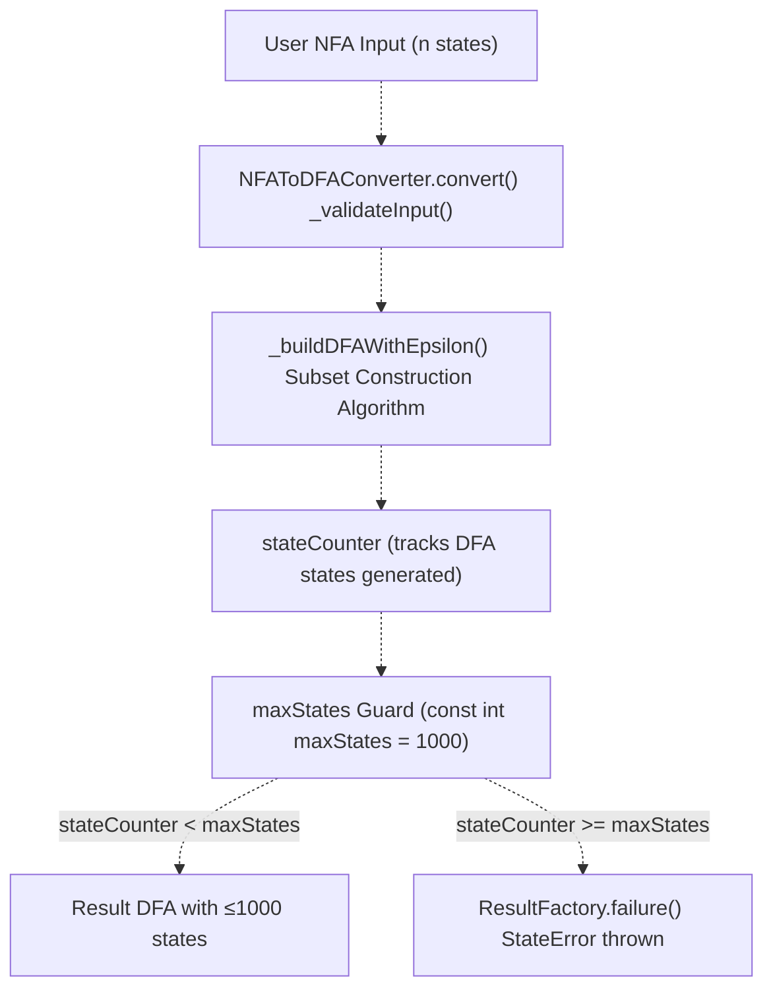
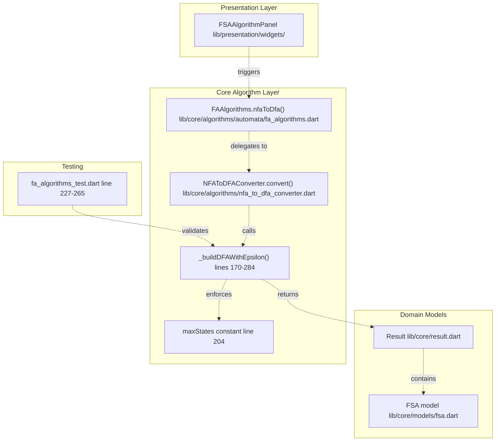
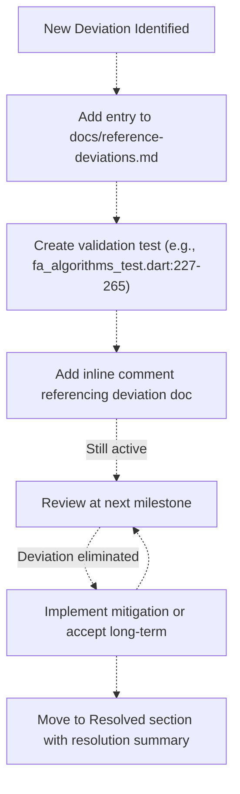
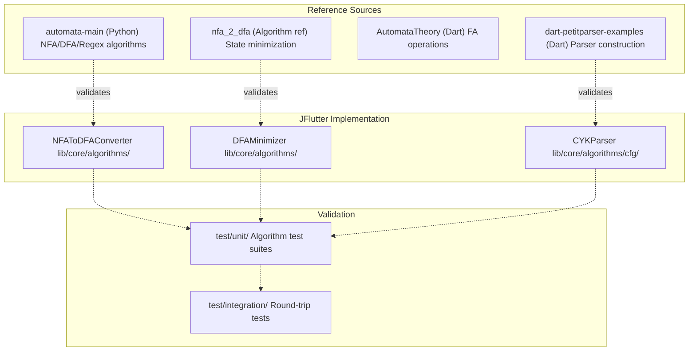

# Known Deviations from Theory

> **Relevant source files**
> * [README.md](https://github.com/ThalesMMS/JFlutter/blob/32e808b4/README.md)
> * [USER_GUIDE](https://github.com/ThalesMMS/JFlutter/blob/32e808b4/USER_GUIDE)
> * [docs/canvas_bridge.md](https://github.com/ThalesMMS/JFlutter/blob/32e808b4/docs/canvas_bridge.md)
> * [docs/reference-deviations.md](https://github.com/ThalesMMS/JFlutter/blob/32e808b4/docs/reference-deviations.md)
> * [lib/core/algorithms/nfa_to_dfa_converter.dart](https://github.com/ThalesMMS/JFlutter/blob/32e808b4/lib/core/algorithms/nfa_to_dfa_converter.dart)
> * [test/unit/core/automata/fa_algorithms_test.dart](https://github.com/ThalesMMS/JFlutter/blob/32e808b4/test/unit/core/automata/fa_algorithms_test.dart)
> * [test/unit/core/cfg/cyk_parser_test.dart](https://github.com/ThalesMMS/JFlutter/blob/32e808b4/test/unit/core/cfg/cyk_parser_test.dart)
> * [test/unit/grammar_to_pda_validation_test.dart](https://github.com/ThalesMMS/JFlutter/blob/32e808b4/test/unit/grammar_to_pda_validation_test.dart)

## Purpose and Scope

This page documents intentional deviations between JFlutter's implementation and the theoretical models or reference implementations used during development. These deviations exist primarily for practical reasons such as mobile platform constraints, performance optimization, or engineering tradeoffs.

For information about the reference implementations used during development, see [Dependencies and Configuration](13a%20Dependencies-and-Configuration.md). For details about the GraphView library modifications, see [GraphView Library Fork](13c%20GraphView-Library-Fork.md).

---

## Overview

JFlutter implements formal language theory algorithms on resource-constrained mobile devices, which necessitates certain practical limitations compared to unbounded theoretical models. All deviations are tracked in [docs/reference-deviations.md L1-L56](https://github.com/ThalesMMS/JFlutter/blob/32e808b4/docs/reference-deviations.md#L1-L56)

 and are regularly reviewed during milestone planning. The deviation log captures rationale, impact assessment, mitigation plans, and ownership for each divergence from reference behavior.

**Sources:** [Project overview and setup](https://github.com/ThalesMMS/JFlutter/blob/32e808b4/README.md#L204-L231)

 [docs/reference-deviations.md L1-L56](https://github.com/ThalesMMS/JFlutter/blob/32e808b4/docs/reference-deviations.md#L1-L56)

---

## Deviation Categories

JFlutter's deviations fall into three primary categories:

| Category | Description | Impact Scope |
| --- | --- | --- |
| **Algorithmic** | Performance guardrails and bounded resource limits | Core business logic |
| **Serialization** | Format compatibility issues during import/export | Data layer interoperability |
| **Testing** | Incomplete widget test coverage and fixture gaps | Quality assurance infrastructure |

**Sources:** [docs/reference-deviations.md L26-L38](https://github.com/ThalesMMS/JFlutter/blob/32e808b4/docs/reference-deviations.md#L26-L38)

---

## Algorithmic Deviations

### NFA to DFA Conversion State Limit

#### Deviation Description

The `NFAToDFAConverter` enforces a hard ceiling of **1,000 DFA states** during subset construction to prevent out-of-memory crashes on mobile devices. Theoretical NFA→DFA conversion can produce up to 2^n states for an n-state NFA, which quickly exhausts mobile heap space.

```
// lib/core/algorithms/nfa_to_dfa_converter.dart:201-250const int maxStates = 1000;while (queue.isNotEmpty) {  // ... subset construction logic ...  if (stateCounter >= maxStates) {    throw StateError(      'Exceeded maximum number of DFA states ($maxStates) during subset construction.',    );  }  // ...}
```

**Sources:** [lib/core/algorithms/nfa_to_dfa_converter.dart L170-L284](https://github.com/ThalesMMS/JFlutter/blob/32e808b4/lib/core/algorithms/nfa_to_dfa_converter.dart#L170-L284)

 [docs/reference-deviations.md L26-L31](https://github.com/ThalesMMS/JFlutter/blob/32e808b4/docs/reference-deviations.md#L26-L31)

#### State Cap Implementation Architecture



**Diagram: NFA→DFA conversion with state count guard enforcement**

**Sources:** [lib/core/algorithms/nfa_to_dfa_converter.dart L19-L284](https://github.com/ThalesMMS/JFlutter/blob/32e808b4/lib/core/algorithms/nfa_to_dfa_converter.dart#L19-L284)

#### Rationale and Impact

Mobile profiling showed that NFAs with moderate complexity could trigger DFA state explosions exceeding device RAM, causing app freezes or crashes. The 1,000-state limit was empirically determined to balance:

* **Safety:** Prevents OOM exceptions on devices with 2-4GB RAM
* **Coverage:** Supports educational examples and typical classroom automata
* **User Experience:** Fails fast with clear error message rather than freezing

**Impact on theoretical correctness:** The implementation correctly performs subset construction but may reject NFAs that would theoretically produce valid (but enormous) DFAs. Users attempting pathological cases receive a descriptive error rather than an infinite hang.

**Sources:** [docs/reference-deviations.md L26-L31](https://github.com/ThalesMMS/JFlutter/blob/32e808b4/docs/reference-deviations.md#L26-L31)

#### Test Coverage

The deviation is validated through integration tests that construct NFAs guaranteed to exceed the limit:

```
// test/unit/core/automata/fa_algorithms_test.dart:227-265test('NFA→DFA conversion reports guard exhaustion as failure', () {  const largeStateCount = 1001;  final states = List.generate(largeStateCount, (index) { /* ... */ });  final result = fa.FAAlgorithms.nfaToDfa(nfa);    expect(result.isFailure, isTrue);  expect(result.error, contains('Exceeded maximum number of DFA states'));});
```

**Sources:** [test/unit/core/automata/fa_algorithms_test.dart L227-L265](https://github.com/ThalesMMS/JFlutter/blob/32e808b4/test/unit/core/automata/fa_algorithms_test.dart#L227-L265)

#### Code Entity Mapping



**Diagram: Code entity relationships for NFA→DFA state limit**

**Sources:** [lib/core/algorithms/nfa_to_dfa_converter.dart L1-L463](https://github.com/ThalesMMS/JFlutter/blob/32e808b4/lib/core/algorithms/nfa_to_dfa_converter.dart#L1-L463)

 [test/unit/core/automata/fa_algorithms_test.dart L1-L268](https://github.com/ThalesMMS/JFlutter/blob/32e808b4/test/unit/core/automata/fa_algorithms_test.dart#L1-L268)

#### Mitigation and Future Work

Planned improvements to reduce impact:

1. **Progressive Disclosure UI:** Warn users when NFA size approaches threshold
2. **Streaming Conversion:** Implement lazy DFA state generation for partial results
3. **Heuristic Pre-Analysis:** Estimate DFA state count before full conversion
4. **Configuration Override:** Allow advanced users to adjust limit via settings

Current documentation: [docs/reference-deviations.md L26-L31](https://github.com/ThalesMMS/JFlutter/blob/32e808b4/docs/reference-deviations.md#L26-L31)

**Sources:** [docs/reference-deviations.md L26-L31](https://github.com/ThalesMMS/JFlutter/blob/32e808b4/docs/reference-deviations.md#L26-L31)

---

## Serialization and Testing Deviations

### Round-Trip Serialization Issues

#### Deviation Description

The import/export system has **19 known integration test failures** related to:

* **Epsilon normalization:** Inconsistent handling of ε/λ/lambda symbols across JFLAP XML and internal representation
* **SVG viewBox formatting:** Empty automata produce malformed viewBox attributes in exported SVG

These issues do not block core functionality but require manual verification for affected artifacts.

| Format | Issue | Impact |
| --- | --- | --- |
| JFLAP XML | Epsilon symbol variants (ε, λ, "lambda") not normalized consistently | Import may create duplicate transitions |
| JSON | Minor metadata fields (created/modified timestamps) | Harmless drift in round-trip tests |
| SVG | ViewBox calculation for empty automata | Invalid SVG syntax when no states exist |

**Sources:** [docs/reference-deviations.md L32-L37](https://github.com/ThalesMMS/JFlutter/blob/32e808b4/docs/reference-deviations.md#L32-L37)

#### Code Locations

* Epsilon normalization logic: [lib/core/algorithms/nfa_to_dfa_converter.dart L75-L82](https://github.com/ThalesMMS/JFlutter/blob/32e808b4/lib/core/algorithms/nfa_to_dfa_converter.dart#L75-L82)
* Serialization service: [lib/data/services/serialization_service.dart](https://github.com/ThalesMMS/JFlutter/blob/32e808b4/lib/data/services/serialization_service.dart)
* SVG exporter: [lib/data/services/svg_exporter.dart](https://github.com/ThalesMMS/JFlutter/blob/32e808b4/lib/data/services/svg_exporter.dart)

**Sources:** [docs/reference-deviations.md L32-L37](https://github.com/ThalesMMS/JFlutter/blob/32e808b4/docs/reference-deviations.md#L32-L37)

 [lib/core/algorithms/nfa_to_dfa_converter.dart L73-L168](https://github.com/ThalesMMS/JFlutter/blob/32e808b4/lib/core/algorithms/nfa_to_dfa_converter.dart#L73-L168)

### Widget Test Coverage Gaps

#### Deviation Description

**11 widget tests** are disabled or missing due to incomplete widget implementations:

* `error_banner` widget not yet implemented
* `import_error_dialog` UI components pending design system migration
* `retry_button` placeholder exists but lacks production implementation

These gaps limit automated regression testing for error handling paths, though manual testing confirms functionality.

**Sources:** [docs/reference-deviations.md L32-L38](https://github.com/ThalesMMS/JFlutter/blob/32e808b4/docs/reference-deviations.md#L32-L38)

---

## Deviation Tracking System

### Documentation Structure

All deviations are centrally tracked in [docs/reference-deviations.md L1-L56](https://github.com/ThalesMMS/JFlutter/blob/32e808b4/docs/reference-deviations.md#L1-L56)

 using a structured table format:

| Field | Purpose |
| --- | --- |
| **Area** | Component or algorithm affected |
| **Reference baseline** | Expected theoretical or reference behavior |
| **Description** | Concrete deviation details |
| **Rationale & impact** | Why deviation exists and user-facing effects |
| **Mitigation / follow-up** | Planned improvements or workarounds |
| **Owner** | Responsible working group (Core algorithms WG, Interop WG, etc.) |
| **Last reviewed** | Date of most recent impact assessment |

**Sources:** [docs/reference-deviations.md L7-L21](https://github.com/ThalesMMS/JFlutter/blob/32e808b4/docs/reference-deviations.md#L7-L21)

### Review Cadence

Deviations are re-evaluated during milestone planning and whenever reference implementations in `References/` are updated. Resolved deviations are moved to the "Resolved deviations" section with resolution details preserved.

**Sources:** [docs/reference-deviations.md L49-L55](https://github.com/ThalesMMS/JFlutter/blob/32e808b4/docs/reference-deviations.md#L49-L55)

### Validation Process



**Diagram: Deviation tracking and resolution workflow**

**Sources:** [docs/reference-deviations.md L7-L21](https://github.com/ThalesMMS/JFlutter/blob/32e808b4/docs/reference-deviations.md#L7-L21)

 **Sources**: [Project overview and setup](https://github.com/ThalesMMS/JFlutter/blob/32e808b4/README.md#L216-L224)

---

## Impact Assessment

### Risk Levels

Each deviation is assessed for user-facing impact:

| Risk Level | Criteria | Examples |
| --- | --- | --- |
| **Critical** | Blocks core workflows or produces incorrect results | None currently active |
| **High** | Limits advanced use cases or educational scenarios | NFA→DFA state cap (educational edge cases) |
| **Medium** | Requires manual workarounds or affects specific formats | Round-trip serialization mismatches |
| **Low** | Cosmetic issues or test infrastructure gaps | Widget test coverage |

**Sources:** [docs/reference-deviations.md L1-L56](https://github.com/ThalesMMS/JFlutter/blob/32e808b4/docs/reference-deviations.md#L1-L56)

### Alignment with Reference Implementations

JFlutter validates algorithms against multiple reference sources:



**Diagram: Reference validation architecture**

**Sources:** [Project overview and setup](https://github.com/ThalesMMS/JFlutter/blob/32e808b4/README.md#L310-L334)

---

## Epsilon Transition Handling

### Symbol Normalization

While not a deviation per se, epsilon handling warrants documentation due to its complexity. JFlutter normalizes multiple epsilon representations:

```
// lib/core/algorithms/nfa_to_dfa_converter.dart:75-82bool isEpsilonSymbol(String s) {  final normalized = s.trim().toLowerCase();  return normalized.isEmpty ||      normalized == 'ε' ||      normalized == 'λ' ||      normalized == 'lambda';}
```

This helper function unifies:

* Unicode epsilon (ε)
* Lambda (λ)
* String literal "lambda"
* Empty strings

**Sources:** [lib/core/algorithms/nfa_to_dfa_converter.dart L75-L82](https://github.com/ThalesMMS/JFlutter/blob/32e808b4/lib/core/algorithms/nfa_to_dfa_converter.dart#L75-L82)

### Flexible Epsilon Closure

The `_epsilonClosureFlexible` function applies this normalization during subset construction:

```
// lib/core/algorithms/nfa_to_dfa_converter.dart:375-398Set<State> _epsilonClosureFlexible(  FSA automaton,  State start,  bool Function(String) isEpsilonSymbol,) {  final closure = <State>{start};  final queue = <State>[start];    while (queue.isNotEmpty) {    final state = queue.removeAt(0);    for (final t in automaton.fsaTransitions) {      final isFrom = t.fromState.id == state.id;      final isEps = t.isEpsilonTransition || t.inputSymbols.any(isEpsilonSymbol);      if (isFrom && isEps) {        if (closure.add(t.toState)) {          queue.add(t.toState);        }      }    }  }  return closure;}
```

This ensures JFLAP interoperability while maintaining internal consistency.

**Sources:** [lib/core/algorithms/nfa_to_dfa_converter.dart L375-L398](https://github.com/ThalesMMS/JFlutter/blob/32e808b4/lib/core/algorithms/nfa_to_dfa_converter.dart#L375-L398)

---

## Grammar and PDA Deviations

### Language Equivalence Testing

Grammar-to-PDA conversion maintains theoretical correctness but has practical test limitations:

```
// test/unit/grammar_to_pda_validation_test.dart:16-298test('PDA should accept strings generated by simple grammar', () async {  final testStrings = ['', 'ab', 'aabb', 'aaabbb'];  for (final testString in testStrings) {    final simulationResult = PDASimulator.simulateNPDA(      pda,      testString,      mode: PDAAcceptanceMode.emptyStack,    );    expect(simulationResult.data!.accepted, true);  }});
```

Tests validate small string sets rather than exhaustive language membership due to:

* NPDA simulation complexity (exponential in worst case)
* Mobile test execution time constraints
* Practical educational scope (typical examples have short test strings)

**Sources:** [test/unit/grammar_to_pda_validation_test.dart L104-L136](https://github.com/ThalesMMS/JFlutter/blob/32e808b4/test/unit/grammar_to_pda_validation_test.dart#L104-L136)

### CYK Parser Performance

The CYK parser handles moderate-length strings but does not implement optimizations for very long inputs:

```
// test/unit/core/cfg/cyk_parser_test.dart:380-399test('Should handle moderate length strings', () {  final longString = 'ab' * 10; // 20 characters  final result = CYKParser.parse(simpleCNFGrammar, longString);  expect(result.isSuccess, true);});
```

O(n³) complexity is acceptable for educational contexts (strings typically <100 chars) but would require optimization for production parsing workloads.

**Sources:** [test/unit/core/cfg/cyk_parser_test.dart L380-L399](https://github.com/ThalesMMS/JFlutter/blob/32e808b4/test/unit/core/cfg/cyk_parser_test.dart#L380-L399)

---

## Resolution Strategy

### Short-Term Mitigations

| Deviation | Mitigation | Target Date |
| --- | --- | --- |
| NFA→DFA state cap | Add pre-conversion size estimator and user warning | Q2 2025 |
| Epsilon serialization | Implement canonical epsilon symbol in all exporters | Q2 2025 |
| Widget test gaps | Complete error handling widgets and restore test suite | Q3 2025 |

**Sources:** [docs/reference-deviations.md L26-L38](https://github.com/ThalesMMS/JFlutter/blob/32e808b4/docs/reference-deviations.md#L26-L38)

### Long-Term Improvements

1. **Lazy DFA construction:** Stream DFA states on-demand rather than upfront generation
2. **Cloud offload:** Optional server-side processing for resource-intensive algorithms
3. **Reference parity dashboard:** Automated comparison with reference implementations
4. **Comprehensive golden tests:** Visual regression testing for all widgets

**Sources:** [Project overview and setup](https://github.com/ThalesMMS/JFlutter/blob/32e808b4/README.md#L239-L244)

---

## Summary

JFlutter's deviations from theoretical models are intentional, documented, and regularly reviewed. The primary deviation—the NFA→DFA state limit—prevents mobile platform failures while maintaining correctness for typical educational automata. All deviations are tracked in [docs/reference-deviations.md L1-L56](https://github.com/ThalesMMS/JFlutter/blob/32e808b4/docs/reference-deviations.md#L1-L56)

 with clear ownership, rationale, and mitigation plans.

For questions about specific algorithms, consult the core algorithm documentation at [Core Algorithms](7a%20Core-Algorithms.md). For serialization format details, see [JFLAP Interoperability](9c%20JFLAP-Interoperability.md).

**Sources:** [docs/reference-deviations.md L1-L56](https://github.com/ThalesMMS/JFlutter/blob/32e808b4/docs/reference-deviations.md#L1-L56)

 **Sources**: [Project overview and setup](https://github.com/ThalesMMS/JFlutter/blob/32e808b4/README.md#L204-L231)


### On this page

* [Known Deviations from Theory](#13.2-known-deviations-from-theory)
* [Purpose and Scope](#13.2-purpose-and-scope)
* [Overview](#13.2-overview)
* [Deviation Categories](#13.2-deviation-categories)
* [Algorithmic Deviations](#13.2-algorithmic-deviations)
* [NFA to DFA Conversion State Limit](#13.2-nfa-to-dfa-conversion-state-limit)
* [Serialization and Testing Deviations](#13.2-serialization-and-testing-deviations)
* [Round-Trip Serialization Issues](#13.2-round-trip-serialization-issues)
* [Widget Test Coverage Gaps](#13.2-widget-test-coverage-gaps)
* [Deviation Tracking System](#13.2-deviation-tracking-system)
* [Documentation Structure](#13.2-documentation-structure)
* [Review Cadence](#13.2-review-cadence)
* [Validation Process](#13.2-validation-process)
* [Impact Assessment](#13.2-impact-assessment)
* [Risk Levels](#13.2-risk-levels)
* [Alignment with Reference Implementations](#13.2-alignment-with-reference-implementations)
* [Epsilon Transition Handling](#13.2-epsilon-transition-handling)
* [Symbol Normalization](#13.2-symbol-normalization)
* [Flexible Epsilon Closure](#13.2-flexible-epsilon-closure)
* [Grammar and PDA Deviations](#13.2-grammar-and-pda-deviations)
* [Language Equivalence Testing](#13.2-language-equivalence-testing)
* [CYK Parser Performance](#13.2-cyk-parser-performance)
* [Resolution Strategy](#13.2-resolution-strategy)
* [Short-Term Mitigations](#13.2-short-term-mitigations)
* [Long-Term Improvements](#13.2-long-term-improvements)
* [Summary](#13.2-summary)

Ask Devin about JFlutter