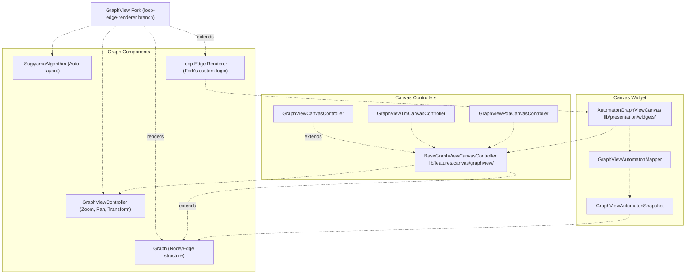
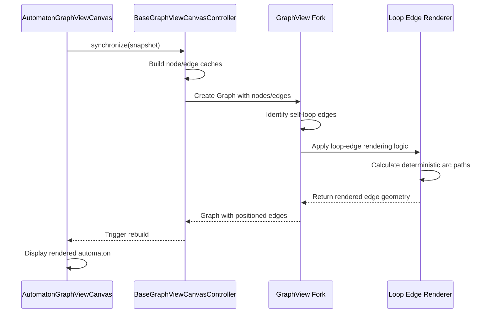
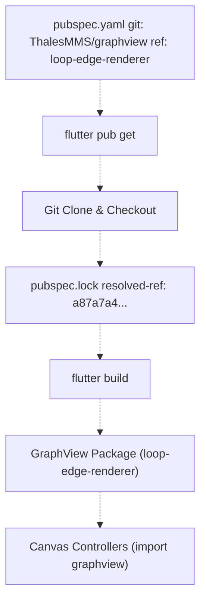

# GraphView Library Fork

> **Relevant source files**
> * [README.md](https://github.com/ThalesMMS/JFlutter/blob/32e808b4/README.md)
> * [USER_GUIDE](https://github.com/ThalesMMS/JFlutter/blob/32e808b4/USER_GUIDE)
> * [docs/canvas_bridge.md](https://github.com/ThalesMMS/JFlutter/blob/32e808b4/docs/canvas_bridge.md)
> * [integration_test/app_simulation_test.dart](https://github.com/ThalesMMS/JFlutter/blob/32e808b4/integration_test/app_simulation_test.dart)
> * [integration_test/driver.dart](https://github.com/ThalesMMS/JFlutter/blob/32e808b4/integration_test/driver.dart)
> * [pubspec.lock](https://github.com/ThalesMMS/JFlutter/blob/32e808b4/pubspec.lock)
> * [pubspec.yaml](https://github.com/ThalesMMS/JFlutter/blob/32e808b4/pubspec.yaml)

## Purpose and Scope

This page documents JFlutter's dependency on a custom fork of the GraphView library, which provides the graph rendering and interaction primitives for the automaton canvas system. The fork adds deterministic loop-edge rendering and related optimizations specific to JFlutter's requirements for displaying formal automata with self-transitions.

For information about how the canvas system uses GraphView, see **[Canvas System](#4)**. For details on canvas controllers and interaction handling, see **[Canvas Controllers](#4.2)** and **[Canvas Tools and Interaction](#4.4)**.

---

## Fork Overview

JFlutter uses a custom fork of the GraphView library instead of the upstream package to support specialized rendering requirements for automaton diagrams.

### Fork Location and Branch

| Property | Value |
| --- | --- |
| **Repository** | `https://github.com/ThalesMMS/graphview.git` |
| **Branch** | `loop-edge-renderer` |
| **Commit (as of pubspec.lock)** | `a87a7a4818bc294487a1daa4365191a41b1d55d8` |
| **Upstream Library** | `graphview` (pub.dev package) |
| **Fork Maintainer** | Thales Matheus Mendonça Santos |

The fork was created to address limitations in the upstream library's handling of self-loop edges, which are essential for representing automaton states with transitions back to themselves (e.g., a state that accepts any number of consecutive 'a' symbols).

**Sources:** [README.md L300](https://github.com/ThalesMMS/JFlutter/blob/32e808b4/README.md#L300-L300)

 [README.md L343](https://github.com/ThalesMMS/JFlutter/blob/32e808b4/README.md#L343-L343)

 [pubspec.yaml L53-L57](https://github.com/ThalesMMS/JFlutter/blob/32e808b4/pubspec.yaml#L53-L57)

 [docs/canvas_bridge.md L5](https://github.com/ThalesMMS/JFlutter/blob/32e808b4/docs/canvas_bridge.md#L5-L5)

---

## Dependency Configuration

The fork is integrated as a Git-based dependency in JFlutter's package configuration, bypassing pub.dev to pull directly from the custom branch.

### pubspec.yaml Declaration

```yaml
graphview:  git:    url: https://github.com/ThalesMMS/graphview.git    ref: loop-edge-renderer
```

This configuration tells Flutter to:

1. Clone the repository from the specified URL
2. Check out the `loop-edge-renderer` branch
3. Resolve transitive dependencies
4. Lock the commit hash in `pubspec.lock`

### Resolved Dependency Lock

The resolved commit hash is tracked in `pubspec.lock` to ensure reproducible builds:

```yaml
graphview:
  dependency: "direct main"
  description:
    path: "."
    ref: loop-edge-renderer
    resolved-ref: a87a7a4818bc294487a1daa4365191a41b1d55d8
    url: "https://github.com/ThalesMMS/graphview.git"
  source: git
  version: "1.5.1"
```

**Sources:** [pubspec.yaml L53-L57](https://github.com/ThalesMMS/JFlutter/blob/32e808b4/pubspec.yaml#L53-L57)

 [pubspec.lock L373-L381](https://github.com/ThalesMMS/JFlutter/blob/32e808b4/pubspec.lock#L373-L381)

---

## Loop-Edge Renderer Modifications

The primary enhancement in the fork is **deterministic loop-edge rendering**, which ensures self-transitions are displayed consistently and predictably.

### Problem Statement

The upstream GraphView library's default edge rendering produces inconsistent or overlapping paths when nodes have transitions pointing back to themselves. For automaton diagrams, self-loops must be clearly visible and positioned deterministically to avoid visual ambiguity when multiple states have self-transitions.

### Fork Enhancements

The `loop-edge-renderer` branch implements:

| Enhancement | Description |
| --- | --- |
| **Deterministic Loop Positioning** | Self-edges are rendered with predictable control point placement based on node position |
| **Collision Avoidance** | Loop paths avoid overlapping with other edges connected to the same node |
| **Consistent Arc Geometry** | Self-loops use standardized arc radius and sweep angles |
| **Label Placement** | Transition labels for loops are positioned outside the arc to remain readable |

These modifications ensure that automaton diagrams remain comprehensible even when states have multiple self-transitions or combinations of self-loops and outgoing edges.

**Sources:** [README.md L300](https://github.com/ThalesMMS/JFlutter/blob/32e808b4/README.md#L300-L300)

 [docs/canvas_bridge.md L5](https://github.com/ThalesMMS/JFlutter/blob/32e808b4/docs/canvas_bridge.md#L5-L5)

---

## Integration with JFlutter Canvas System

The fork integrates into JFlutter's canvas architecture through several controller and widget layers.

### Diagram: GraphView Fork Integration Points



**Sources:** [docs/canvas_bridge.md L1-L39](https://github.com/ThalesMMS/JFlutter/blob/32e808b4/docs/canvas_bridge.md#L1-L39)

 [lib/features/canvas/graphview/](https://github.com/ThalesMMS/JFlutter/blob/32e808b4/lib/features/canvas/graphview/)

 [lib/presentation/widgets/automaton_graphview_canvas.dart L26-L118](https://github.com/ThalesMMS/JFlutter/blob/32e808b4/lib/presentation/widgets/automaton_graphview_canvas.dart#L26-L118)

### Key Integration Classes

| Class | File Path | Role |
| --- | --- | --- |
| `BaseGraphViewCanvasController` | [lib/features/canvas/graphview/base_graphview_canvas_controller.dart](https://github.com/ThalesMMS/JFlutter/blob/32e808b4/lib/features/canvas/graphview/base_graphview_canvas_controller.dart) | Manages `Graph` and `GraphViewController` instances from the fork |
| `GraphViewCanvasController` | [lib/features/canvas/graphview/graphview_canvas_controller.dart](https://github.com/ThalesMMS/JFlutter/blob/32e808b4/lib/features/canvas/graphview/graphview_canvas_controller.dart) | FSA-specific controller using fork's rendering |
| `AutomatonGraphViewCanvas` | [lib/presentation/widgets/automaton_graphview_canvas.dart](https://github.com/ThalesMMS/JFlutter/blob/32e808b4/lib/presentation/widgets/automaton_graphview_canvas.dart) | Widget that embeds the fork's rendering output |
| `GraphViewAutomatonMapper` | [lib/features/canvas/graphview/graphview_automaton_mapper.dart](https://github.com/ThalesMMS/JFlutter/blob/32e808b4/lib/features/canvas/graphview/graphview_automaton_mapper.dart) | Converts domain models to fork-compatible `Graph` structures |

**Sources:** [lib/features/canvas/graphview/base_graphview_canvas_controller.dart L17-L220](https://github.com/ThalesMMS/JFlutter/blob/32e808b4/lib/features/canvas/graphview/base_graphview_canvas_controller.dart#L17-L220)

 [lib/features/canvas/graphview/graphview_canvas_controller.dart L13-L188](https://github.com/ThalesMMS/JFlutter/blob/32e808b4/lib/features/canvas/graphview/graphview_canvas_controller.dart#L13-L188)

 [lib/presentation/widgets/automaton_graphview_canvas.dart L26-L118](https://github.com/ThalesMMS/JFlutter/blob/32e808b4/lib/presentation/widgets/automaton_graphview_canvas.dart#L26-L118)

 [lib/features/canvas/graphview/graphview_automaton_mapper.dart L7-L130](https://github.com/ThalesMMS/JFlutter/blob/32e808b4/lib/features/canvas/graphview/graphview_automaton_mapper.dart#L7-L130)

### Usage Flow



**Sources:** [lib/features/canvas/graphview/base_graphview_canvas_controller.dart L57-L166](https://github.com/ThalesMMS/JFlutter/blob/32e808b4/lib/features/canvas/graphview/base_graphview_canvas_controller.dart#L57-L166)

 [lib/presentation/widgets/automaton_graphview_canvas.dart L52-L178](https://github.com/ThalesMMS/JFlutter/blob/32e808b4/lib/presentation/widgets/automaton_graphview_canvas.dart#L52-L178)

---

## Maintenance and Updates

### Keeping the Fork Aligned

To update the fork or change branches:

1. **Modify pubspec.yaml**: Change the `ref` field to point to a different branch or tag: ```yaml graphview:  git:    url: https://github.com/ThalesMMS/graphview.git    ref: new-branch-name  # or a specific commit hash ```
2. **Update dependencies**: Run `flutter pub get` to resolve the new commit and update `pubspec.lock`
3. **Verify integration**: Run the canvas system tests to ensure compatibility: ``` flutter test test/features/canvas/graphview/ ```
4. **Check rendering**: Manually verify loop-edge rendering in the FSA workspace with examples containing self-transitions

**Sources:** [docs/canvas_bridge.md L5](https://github.com/ThalesMMS/JFlutter/blob/32e808b4/docs/canvas_bridge.md#L5-L5)

 [test/features/canvas/graphview/](https://github.com/ThalesMMS/JFlutter/blob/32e808b4/test/features/canvas/graphview/)

### Version Tracking

The resolved commit hash in `pubspec.lock` serves as the source of truth for reproducible builds. When the fork is updated:

| File | Purpose |
| --- | --- |
| `pubspec.yaml` | Declares branch/ref to use |
| `pubspec.lock` | Records resolved commit hash |
| `docs/canvas_bridge.md` | Documents integration requirements |

**Sources:** [pubspec.yaml L53-L57](https://github.com/ThalesMMS/JFlutter/blob/32e808b4/pubspec.yaml#L53-L57)

 [pubspec.lock L373-L381](https://github.com/ThalesMMS/JFlutter/blob/32e808b4/pubspec.lock#L373-L381)

 [docs/canvas_bridge.md L5](https://github.com/ThalesMMS/JFlutter/blob/32e808b4/docs/canvas_bridge.md#L5-L5)

### Testing Changes

The canvas controller test suite validates integration with GraphView:

```
test/features/canvas/graphview/
├── graphview_canvas_controller_test.dart
├── graphview_tm_canvas_controller_test.dart
├── graphview_pda_canvas_controller_test.dart
├── graphview_automaton_mapper_test.dart
└── graphview_automaton_snapshot_test.dart
```

These tests exercise:

* Node and edge creation through the fork's API
* Snapshot serialization/deserialization
* Undo/redo with compressed history
* Cache eviction for large automatons
* Highlight channel integration

**Sources:** [test/features/canvas/graphview/](https://github.com/ThalesMMS/JFlutter/blob/32e808b4/test/features/canvas/graphview/)

 [docs/canvas_bridge.md L36-L38](https://github.com/ThalesMMS/JFlutter/blob/32e808b4/docs/canvas_bridge.md#L36-L38)

---

## Fork-Specific Constraints

### Memory and Performance

The fork integrates with JFlutter's cache eviction system to handle large automatons:

| Constraint | Value | Rationale |
| --- | --- | --- |
| **History Limit** | 20 snapshots (default) | Compressed snapshots stored in controller memory |
| **Cache Eviction Threshold** | 250 nodes/edges | Fork's `Graph` instances rebuilt when exceeded |
| **Snapshot Compression** | gzip | Reduces memory footprint for undo/redo history |

These limits are enforced by `BaseGraphViewCanvasController` to prevent runaway memory usage when working with complex automatons or long editing sessions.

**Sources:** [lib/features/canvas/graphview/base_graphview_canvas_controller.dart L58-L109](https://github.com/ThalesMMS/JFlutter/blob/32e808b4/lib/features/canvas/graphview/base_graphview_canvas_controller.dart#L58-L109)

 [lib/features/canvas/graphview/base_graphview_canvas_controller.dart L253-L566](https://github.com/ThalesMMS/JFlutter/blob/32e808b4/lib/features/canvas/graphview/base_graphview_canvas_controller.dart#L253-L566)

 [docs/canvas_bridge.md L35-L38](https://github.com/ThalesMMS/JFlutter/blob/32e808b4/docs/canvas_bridge.md#L35-L38)

### Platform Compatibility

The fork supports all platforms JFlutter targets:

| Platform | Status | Notes |
| --- | --- | --- |
| **Android** | ✅ Full support | Primary mobile target |
| **iOS** | ✅ Full support | Daily-driver verified |
| **Web** | ✅ Full support | Canvas rendering via HTML5 canvas |
| **Desktop** (Windows/macOS/Linux) | ✅ Full support | Same rendering pipeline |

**Sources:** [README.md L141-L145](https://github.com/ThalesMMS/JFlutter/blob/32e808b4/README.md#L141-L145)

---

## Related Canvas System Components

The GraphView fork is used exclusively by the canvas system. For details on specific components:

| Component | Wiki Page | Description |
| --- | --- | --- |
| Canvas Widget | **[AutomatonGraphViewCanvas Widget](#4.1)** | Main widget embedding fork's rendering |
| Controllers | **[Canvas Controllers](#4.2)** | Controller hierarchy managing `Graph` instances |
| Interaction | **[Canvas Tools and Interaction](#4.4)** | Gesture handling and tool selection |
| Coordinates | **[Coordinate Systems and Viewport](#4.5)** | Transform management via fork's `GraphViewController` |
| History | **[Undo/Redo System](#4.6)** | Snapshot compression and replay |

**Sources:** [docs/canvas_bridge.md L1-L39](https://github.com/ThalesMMS/JFlutter/blob/32e808b4/docs/canvas_bridge.md#L1-L39)

---

## Diagram: Dependency Resolution Flow



**Sources:** [pubspec.yaml L53-L57](https://github.com/ThalesMMS/JFlutter/blob/32e808b4/pubspec.yaml#L53-L57)

 [pubspec.lock L373-L381](https://github.com/ThalesMMS/JFlutter/blob/32e808b4/pubspec.lock#L373-L381)

Refresh this wiki

Last indexed: 30 December 2025 ([32e808](https://github.com/ThalesMMS/JFlutter/commit/32e808b4))

### On this page

* [GraphView Library Fork](#13.3-graphview-library-fork)
* [Purpose and Scope](#13.3-purpose-and-scope)
* [Fork Overview](#13.3-fork-overview)
* [Fork Location and Branch](#13.3-fork-location-and-branch)
* [Dependency Configuration](#13.3-dependency-configuration)
* [pubspec.yaml Declaration](#13.3-pubspecyaml-declaration)
* [Resolved Dependency Lock](#13.3-resolved-dependency-lock)
* [Loop-Edge Renderer Modifications](#13.3-loop-edge-renderer-modifications)
* [Problem Statement](#13.3-problem-statement)
* [Fork Enhancements](#13.3-fork-enhancements)
* [Integration with JFlutter Canvas System](#13.3-integration-with-jflutter-canvas-system)
* [Diagram: GraphView Fork Integration Points](#13.3-diagram-graphview-fork-integration-points)
* [Key Integration Classes](#13.3-key-integration-classes)
* [Usage Flow](#13.3-usage-flow)
* [Maintenance and Updates](#13.3-maintenance-and-updates)
* [Keeping the Fork Aligned](#13.3-keeping-the-fork-aligned)
* [Version Tracking](#13.3-version-tracking)
* [Testing Changes](#13.3-testing-changes)
* [Fork-Specific Constraints](#13.3-fork-specific-constraints)
* [Memory and Performance](#13.3-memory-and-performance)
* [Platform Compatibility](#13.3-platform-compatibility)
* [Related Canvas System Components](#13.3-related-canvas-system-components)
* [Diagram: Dependency Resolution Flow](#13.3-diagram-dependency-resolution-flow)

Ask Devin about JFlutter