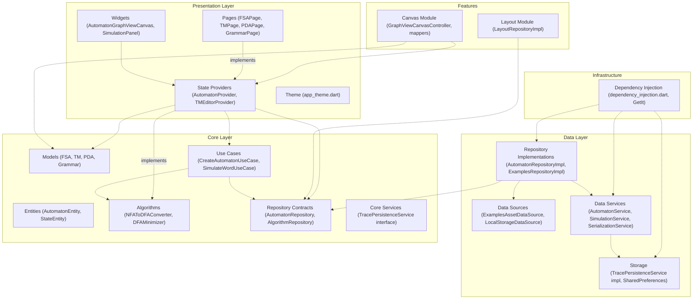
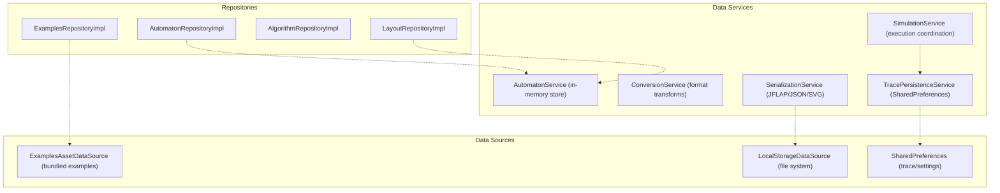
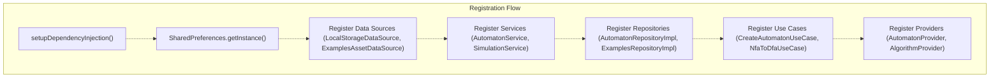
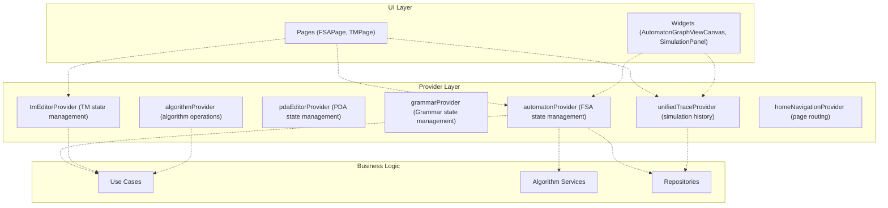
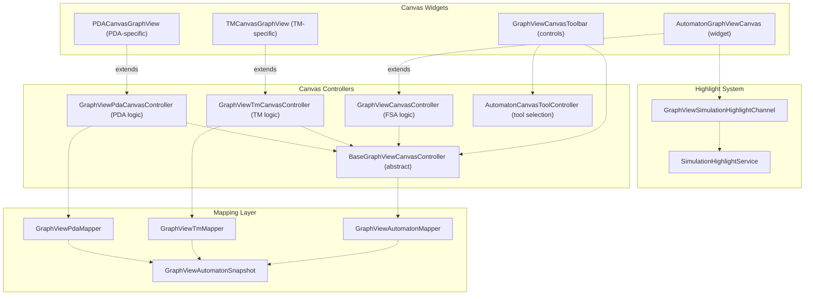
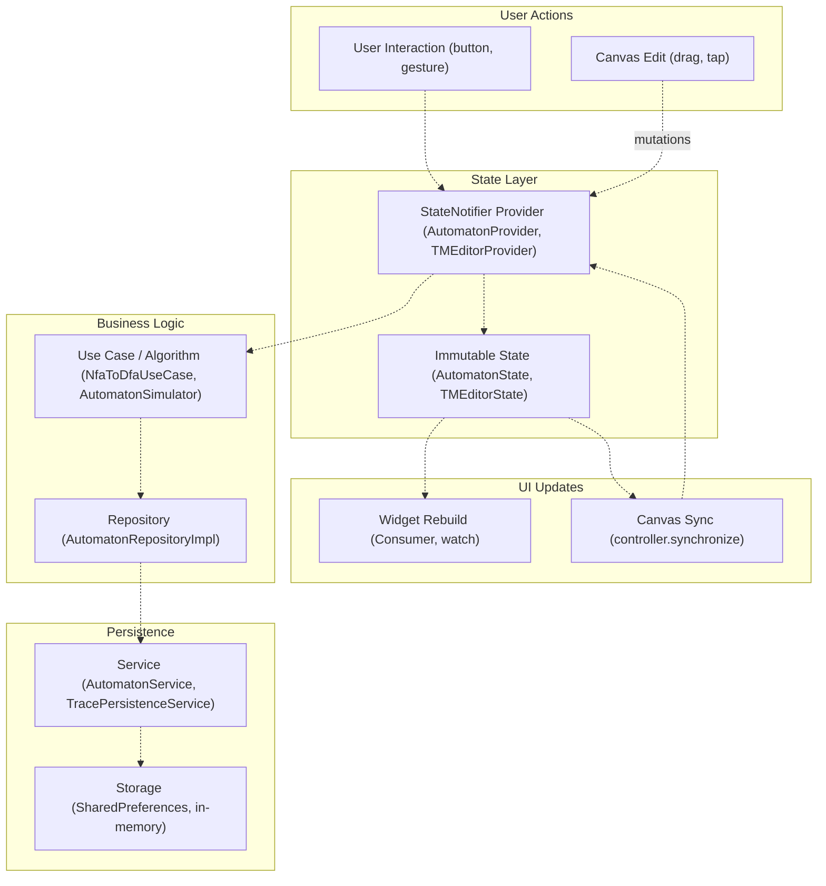

# Architecture

> **Relevant source files**
> * [README.md](https://github.com/ThalesMMS/JFlutter/blob/32e808b4/README.md)
> * [USER_GUIDE](https://github.com/ThalesMMS/JFlutter/blob/32e808b4/USER_GUIDE)
> * [docs/canvas_bridge.md](https://github.com/ThalesMMS/JFlutter/blob/32e808b4/docs/canvas_bridge.md)
> * [lib/core/dfa_algorithms.dart](https://github.com/ThalesMMS/JFlutter/blob/32e808b4/lib/core/dfa_algorithms.dart)
> * [lib/injection/dependency_injection.dart](https://github.com/ThalesMMS/JFlutter/blob/32e808b4/lib/injection/dependency_injection.dart)
> * [lib/presentation/providers/automaton_provider.dart](https://github.com/ThalesMMS/JFlutter/blob/32e808b4/lib/presentation/providers/automaton_provider.dart)

## Purpose and Scope

This document describes JFlutter's architectural design, which follows a Clean Architecture approach with three distinct layers: Presentation, Core (Domain), and Data. It covers the structural organization of the codebase, dependency management, state flow patterns, and the integration of cross-cutting feature modules. For detailed information about specific layers, see:

* [Presentation Layer](#2.1) for UI components, pages, and widgets
* [Core Domain Layer](#2.2) for business logic and algorithms
* [Data Layer](#2.3) for repositories, persistence, and serialization

This page focuses on the high-level organization and interaction patterns that govern the entire system.

---

## Clean Architecture Layers

JFlutter implements Clean Architecture to enforce separation of concerns and maintainability. The architecture consists of three primary layers, each with distinct responsibilities and dependency rules.

**Layer Dependency Rules:**

* Presentation Layer depends on Core Layer (through interfaces)
* Data Layer depends on Core Layer (implements interfaces)
* Core Layer has no dependencies on outer layers
* Dependencies point inward, never outward

**Directory Structure:**

| Directory | Layer | Purpose |
| --- | --- | --- |
| `lib/presentation/` | Presentation | UI widgets, pages, providers, theme |
| `lib/core/` | Core/Domain | Entities, algorithms, business logic, repository contracts |
| `lib/data/` | Data | Repository implementations, data sources, serialization |
| `lib/features/` | Cross-cutting | Canvas system, layout utilities |
| `lib/injection/` | Infrastructure | Dependency injection setup |

### Layer Structure Diagram



**Sources:** [README.md L39-L91](https://github.com/ThalesMMS/JFlutter/blob/32e808b4/README.md#L39-L91)

 [lib/injection/dependency_injection.dart L1-L236](https://github.com/ThalesMMS/JFlutter/blob/32e808b4/lib/injection/dependency_injection.dart#L1-L236)

---

## Core Layer Organization

The Core Layer contains pure business logic with no dependencies on frameworks or external libraries (except foundational packages like `vector_math`). It defines domain models, algorithms, and contracts that outer layers must satisfy.

### Domain Models and Entities

| Namespace | Purpose | Key Classes |
| --- | --- | --- |
| `lib/core/models/` | Immutable value objects representing automata | `FSA`, `TM`, `PDA`, `Grammar`, `State`, `Transition` |
| `lib/core/entities/` | Data transfer objects for serialization | `AutomatonEntity`, `StateEntity`, `TransitionEntity` |
| `lib/core/algorithms/` | Formal language theory algorithms | `NFAToDFAConverter`, `DFAMinimizer`, `AutomatonSimulator` |
| `lib/core/repositories/` | Abstract repository contracts | `AutomatonRepository`, `AlgorithmRepository` |
| `lib/core/services/` | Core service interfaces | `TracePersistenceService` (interface) |
| `lib/core/use_cases/` | Application-specific business rules | `CreateAutomatonUseCase`, `NfaToDfaUseCase` |

**Algorithm Organization:**
The Core Layer houses 13+ algorithms covering:

* NFA ↔ DFA conversion [lib/core/algorithms/nfa_to_dfa_converter.dart](https://github.com/ThalesMMS/JFlutter/blob/32e808b4/lib/core/algorithms/nfa_to_dfa_converter.dart)
* DFA minimization [lib/core/algorithms/dfa_minimizer.dart](https://github.com/ThalesMMS/JFlutter/blob/32e808b4/lib/core/algorithms/dfa_minimizer.dart)
* Regex ↔ NFA conversion [lib/core/algorithms/regex_to_nfa_converter.dart](https://github.com/ThalesMMS/JFlutter/blob/32e808b4/lib/core/algorithms/regex_to_nfa_converter.dart)  [lib/core/algorithms/fa_to_regex_converter.dart](https://github.com/ThalesMMS/JFlutter/blob/32e808b4/lib/core/algorithms/fa_to_regex_converter.dart)
* Grammar conversions [lib/core/algorithms/fsa_to_grammar_converter.dart](https://github.com/ThalesMMS/JFlutter/blob/32e808b4/lib/core/algorithms/fsa_to_grammar_converter.dart)
* Simulation engines [lib/core/algorithms/automaton_simulator.dart](https://github.com/ThalesMMS/JFlutter/blob/32e808b4/lib/core/algorithms/automaton_simulator.dart)

**Sources:** [README.md L59-L73](https://github.com/ThalesMMS/JFlutter/blob/32e808b4/README.md#L59-L73)

 [lib/core/dfa_algorithms.dart L1-L16](https://github.com/ThalesMMS/JFlutter/blob/32e808b4/lib/core/dfa_algorithms.dart#L1-L16)

---

## Data Layer Implementation

The Data Layer implements Core Layer contracts and manages all external I/O operations, including persistence, serialization, and asset loading.

### Service Architecture



**Service Responsibilities:**

* **`AutomatonService`**: In-memory automaton storage and CRUD operations [lib/data/services/automaton_service.dart](https://github.com/ThalesMMS/JFlutter/blob/32e808b4/lib/data/services/automaton_service.dart)
* **`SimulationService`**: Coordinates simulation execution and trace capture [lib/data/services/simulation_service.dart](https://github.com/ThalesMMS/JFlutter/blob/32e808b4/lib/data/services/simulation_service.dart)
* **`SerializationService`**: Handles JFLAP XML, JSON, and SVG format conversions [lib/data/services/serialization_service.dart](https://github.com/ThalesMMS/JFlutter/blob/32e808b4/lib/data/services/serialization_service.dart)
* **`TracePersistenceService`**: Persists simulation history to SharedPreferences with 50-entry cap [lib/data/services/trace_persistence_service.dart L17-L49](https://github.com/ThalesMMS/JFlutter/blob/32e808b4/lib/data/services/trace_persistence_service.dart#L17-L49)

**Sources:** [README.md L73-L79](https://github.com/ThalesMMS/JFlutter/blob/32e808b4/README.md#L73-L79)

 [lib/injection/dependency_injection.dart L51-L66](https://github.com/ThalesMMS/JFlutter/blob/32e808b4/lib/injection/dependency_injection.dart#L51-L66)

---

## Dependency Injection System

JFlutter uses GetIt for dependency injection, configured in `dependency_injection.dart`. Services are registered as lazy singletons, while providers are registered as factories to support multiple instances per page.

### Dependency Registration Pattern



**Registration Strategy:**

| Component Type | Strategy | Reason |
| --- | --- | --- |
| Data Sources | `registerLazySingleton` | Single instance, heavy initialization |
| Services | `registerLazySingleton` | Stateless, shared across app |
| Repositories | `registerLazySingleton` | Stateless, implement contracts |
| Use Cases | `registerLazySingleton` | Stateless business logic |
| Providers | `registerFactory` | Stateful, per-page instances |

**Example Registration:**

```javascript
// Singleton servicegetIt.registerLazySingleton<AutomatonService>(() => AutomatonService());// Factory providergetIt.registerFactory<AutomatonProvider>(  () => AutomatonProvider(    automatonService: getIt<AutomatonService>(),    layoutRepository: getIt<LayoutRepository>(),    tracePersistenceService: getIt<TracePersistenceService>(),  ),);
```

**Sources:** [lib/injection/dependency_injection.dart L38-L231](https://github.com/ThalesMMS/JFlutter/blob/32e808b4/lib/injection/dependency_injection.dart#L38-L231)

---

## State Management Architecture

JFlutter employs Riverpod for reactive state management, using the `StateNotifier` pattern for complex stateful logic. Providers bridge the Presentation Layer to Core and Data Layers.

### Provider Hierarchy



**Core Provider Classes:**

| Provider | Type | Purpose | File |
| --- | --- | --- | --- |
| `AutomatonProvider` | `StateNotifier<AutomatonState>` | Manages FSA state, CRUD, algorithms | [lib/presentation/providers/automaton_provider.dart L41-L1116](https://github.com/ThalesMMS/JFlutter/blob/32e808b4/lib/presentation/providers/automaton_provider.dart#L41-L1116) |
| `TMEditorProvider` | `StateNotifier<TMEditorState>` | Manages TM state and tape operations | [lib/presentation/providers/tm_editor_provider.dart](https://github.com/ThalesMMS/JFlutter/blob/32e808b4/lib/presentation/providers/tm_editor_provider.dart) |
| `PDAEditorProvider` | `StateNotifier<PDAEditorState>` | Manages PDA state and stack operations | [lib/presentation/providers/pda_editor_provider.dart](https://github.com/ThalesMMS/JFlutter/blob/32e808b4/lib/presentation/providers/pda_editor_provider.dart) |
| `UnifiedTraceNotifier` | `StateNotifier<UnifiedTraceState>` | Centralizes trace persistence (50-entry cap) | [lib/presentation/providers/unified_trace_provider.dart L135-L309](https://github.com/ThalesMMS/JFlutter/blob/32e808b4/lib/presentation/providers/unified_trace_provider.dart#L135-L309) |

**State Update Pattern:**

```
// Example from AutomatonProvidervoid addState({required String id, required String label, ...}) {  _mutateAutomaton((current) {    // Pure transformation logic    final updatedStates = [...current.states, newState];    return current.copyWith(states: updatedStates);  });}
```

The `_mutateAutomaton` helper [lib/presentation/providers/automaton_provider.dart L597-L624](https://github.com/ThalesMMS/JFlutter/blob/32e808b4/lib/presentation/providers/automaton_provider.dart#L597-L624)

 ensures immutable updates, increments a mutation counter for debugging, and clears derived state (simulation results, algorithm outputs) when the automaton changes.

**Sources:** [lib/presentation/providers/automaton_provider.dart L41-L1116](https://github.com/ThalesMMS/JFlutter/blob/32e808b4/lib/presentation/providers/automaton_provider.dart#L41-L1116)

 [lib/injection/dependency_injection.dart L193-L230](https://github.com/ThalesMMS/JFlutter/blob/32e808b4/lib/injection/dependency_injection.dart#L193-L230)

---

## Feature Module Organization

Cross-cutting features that span multiple layers are organized in `lib/features/`. These modules encapsulate complex subsystems with their own controllers, mappers, and channels.

### Canvas System Architecture

The Canvas module provides a GraphView-based editing surface with bidirectional synchronization between visual state and domain models.



**Controller Responsibilities:**

* **`BaseGraphViewCanvasController`**: Manages viewport, undo/redo (20-snapshot history), cache eviction (250-item threshold) [lib/features/canvas/graphview/base_graphview_canvas_controller.dart L17-L220](https://github.com/ThalesMMS/JFlutter/blob/32e808b4/lib/features/canvas/graphview/base_graphview_canvas_controller.dart#L17-L220)
* **`GraphViewCanvasController`**: Implements FSA-specific CRUD operations, coordinate transforms [lib/features/canvas/graphview/graphview_canvas_controller.dart L13-L219](https://github.com/ThalesMMS/JFlutter/blob/32e808b4/lib/features/canvas/graphview/graphview_canvas_controller.dart#L13-L219)
* **Specialized Controllers**: `GraphViewTmCanvasController`, `GraphViewPdaCanvasController` handle tape/stack metadata
* **Mappers**: Bidirectional conversion between domain models and `GraphViewAutomatonSnapshot` [lib/features/canvas/graphview/graphview_automaton_mapper.dart L7-L130](https://github.com/ThalesMMS/JFlutter/blob/32e808b4/lib/features/canvas/graphview/graphview_automaton_mapper.dart#L7-L130)

**Highlight Integration:**

Simulation highlights flow through `SimulationHighlightService` → `GraphViewSimulationHighlightChannel` → canvas notifier, enabling real-time visual feedback during step-by-step execution [lib/core/services/simulation_highlight_service.dart L8-L101](https://github.com/ThalesMMS/JFlutter/blob/32e808b4/lib/core/services/simulation_highlight_service.dart#L8-L101)

 [lib/features/canvas/graphview/graphview_highlight_channel.dart L5-L19](https://github.com/ThalesMMS/JFlutter/blob/32e808b4/lib/features/canvas/graphview/graphview_highlight_channel.dart#L5-L19)

**Sources:** [docs/canvas_bridge.md L1-L39](https://github.com/ThalesMMS/JFlutter/blob/32e808b4/docs/canvas_bridge.md#L1-L39)

 [lib/features/canvas/graphview/graphview_canvas_controller.dart L13-L219](https://github.com/ThalesMMS/JFlutter/blob/32e808b4/lib/features/canvas/graphview/graphview_canvas_controller.dart#L13-L219)

### Layout Repository

The Layout module provides auto-layout capabilities using the Sugiyama algorithm from the forked GraphView library.

**Implementation:**

* **`LayoutRepositoryImpl`**: Implements `LayoutRepository` contract, converts entities to Graph format, applies layout, converts back [lib/features/layout/layout_repository_impl.dart](https://github.com/ThalesMMS/JFlutter/blob/32e808b4/lib/features/layout/layout_repository_impl.dart)
* **Algorithm**: Sugiyama hierarchical layout with configurable spacing
* **Integration**: Called by `AutomatonProvider.applyAutoLayout()` [lib/presentation/providers/automaton_provider.dart L873-L905](https://github.com/ThalesMMS/JFlutter/blob/32e808b4/lib/presentation/providers/automaton_provider.dart#L873-L905)

**Sources:** [README.md L82-L83](https://github.com/ThalesMMS/JFlutter/blob/32e808b4/README.md#L82-L83)

 [lib/injection/dependency_injection.dart L81](https://github.com/ThalesMMS/JFlutter/blob/32e808b4/lib/injection/dependency_injection.dart#L81-L81)

---

## Data Flow Patterns

JFlutter implements unidirectional data flow with bidirectional canvas synchronization to maintain consistency across UI, state, and persistence layers.

### Unidirectional Flow Diagram



**Flow Steps:**

1. **User Interaction**: User taps button or edits canvas
2. **Provider Mutation**: Provider method called (e.g., `addState`, `simulateAutomaton`)
3. **Business Logic**: Provider delegates to Use Cases or Algorithms
4. **Repository/Service**: Data operations executed (persistence, computation)
5. **State Update**: Provider emits new immutable state
6. **UI Rebuild**: Widgets rebuild via `watch` or `Consumer`
7. **Canvas Sync**: Canvas controller syncs with new state via `synchronize()`

**Bidirectional Canvas Sync:**

Canvas edits flow back through the provider to maintain consistency:

```sql
Canvas Gesture → Controller → Provider.addState() → State Update → Canvas.synchronize()
```

This ensures that canvas visual state and domain model remain synchronized [lib/features/canvas/graphview/graphview_canvas_controller.dart L188-L219](https://github.com/ThalesMMS/JFlutter/blob/32e808b4/lib/features/canvas/graphview/graphview_canvas_controller.dart#L188-L219)

**Sources:** [USER_GUIDE L16-L30](https://github.com/ThalesMMS/JFlutter/blob/32e808b4/USER_GUIDE#L16-L30)

 [lib/presentation/providers/automaton_provider.dart L597-L624](https://github.com/ThalesMMS/JFlutter/blob/32e808b4/lib/presentation/providers/automaton_provider.dart#L597-L624)

---

## Architectural Patterns Summary

| Pattern | Implementation | Purpose |
| --- | --- | --- |
| **Clean Architecture** | Three-layer separation with interface boundaries | Testability, maintainability, framework independence |
| **Dependency Injection** | GetIt with lazy singletons and factories | Decoupling, testability, lifecycle management |
| **Repository Pattern** | Core contracts implemented in Data layer | Data source abstraction, business logic isolation |
| **State Management** | Riverpod StateNotifier with immutable state | Reactive UI updates, predictable state transitions |
| **Mapper Pattern** | Bidirectional converters between layers | Layer isolation, format transformations |
| **Service Layer** | Stateless services coordinating algorithms | Business logic encapsulation, reusability |
| **Provider Pattern** | Riverpod providers exposing state and operations | UI-business logic bridge, dependency injection |

**Key Architectural Invariants:**

1. **Dependency Direction**: Always inward (Presentation → Core ← Data)
2. **Immutability**: All domain models are immutable value objects
3. **Pure Functions**: Core algorithms are pure, with no side effects
4. **Single Source of Truth**: Providers own state, services are stateless
5. **Interface Segregation**: Small, focused repository contracts

**Sources:** [README.md L39-L91](https://github.com/ThalesMMS/JFlutter/blob/32e808b4/README.md#L39-L91)

 [lib/injection/dependency_injection.dart L1-L236](https://github.com/ThalesMMS/JFlutter/blob/32e808b4/lib/injection/dependency_injection.dart#L1-L236)

 [lib/presentation/providers/automaton_provider.dart L41-L1116](https://github.com/ThalesMMS/JFlutter/blob/32e808b4/lib/presentation/providers/automaton_provider.dart#L41-L1116)

Refresh this wiki

Last indexed: 30 December 2025 ([32e808](https://github.com/ThalesMMS/JFlutter/commit/32e808b4))

### On this page

* [Architecture](#2-architecture)
* [Purpose and Scope](#2-purpose-and-scope)
* [Clean Architecture Layers](#2-clean-architecture-layers)
* [Layer Structure Diagram](#2-layer-structure-diagram)
* [Core Layer Organization](#2-core-layer-organization)
* [Domain Models and Entities](#2-domain-models-and-entities)
* [Data Layer Implementation](#2-data-layer-implementation)
* [Service Architecture](#2-service-architecture)
* [Dependency Injection System](#2-dependency-injection-system)
* [Dependency Registration Pattern](#2-dependency-registration-pattern)
* [State Management Architecture](#2-state-management-architecture)
* [Provider Hierarchy](#2-provider-hierarchy)
* [Feature Module Organization](#2-feature-module-organization)
* [Canvas System Architecture](#2-canvas-system-architecture)
* [Layout Repository](#2-layout-repository)
* [Data Flow Patterns](#2-data-flow-patterns)
* [Unidirectional Flow Diagram](#2-unidirectional-flow-diagram)
* [Architectural Patterns Summary](#2-architectural-patterns-summary)

Ask Devin about JFlutter