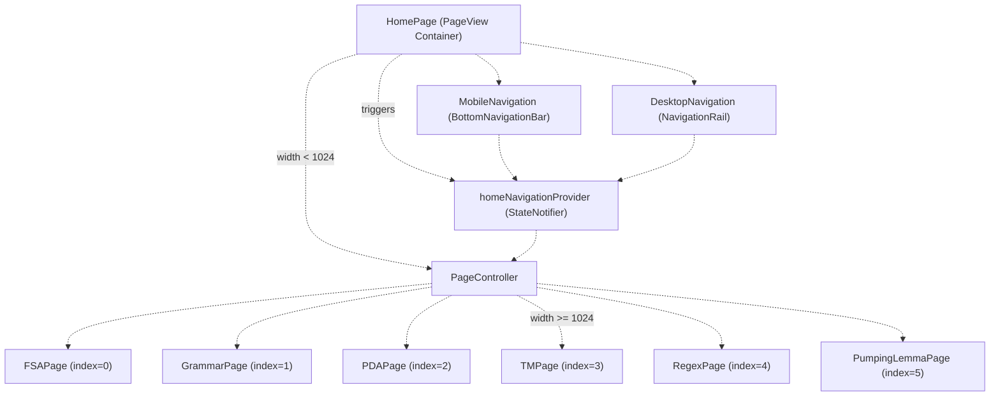
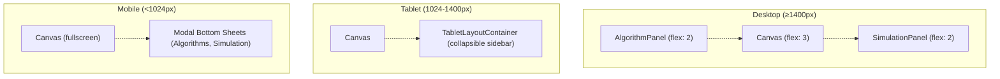
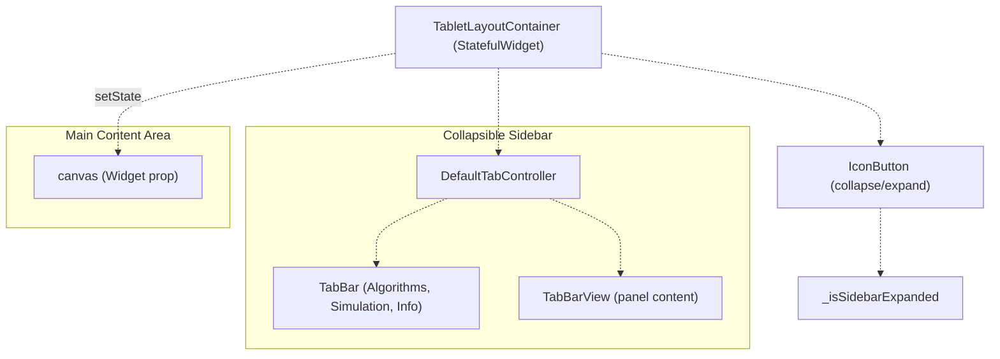
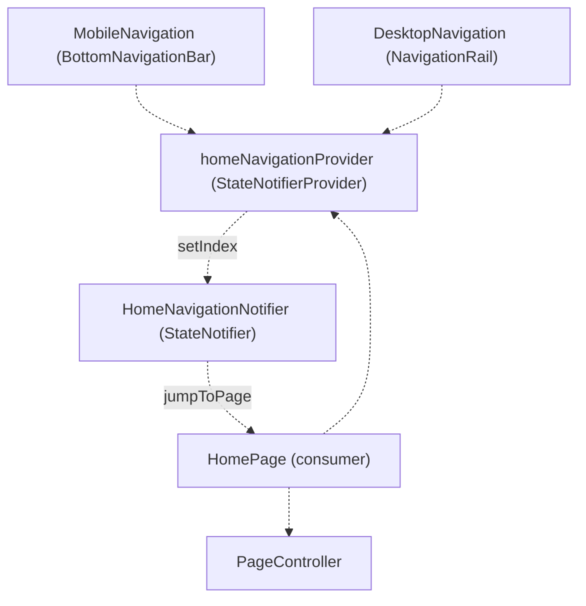
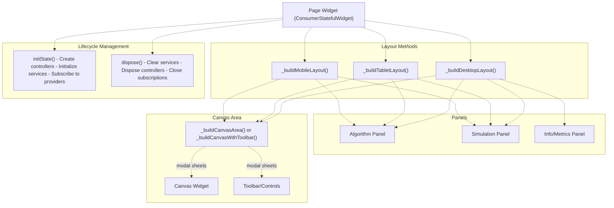

# Presentation Layer

> **Relevant source files**
> * [lib/core/parsers/jflap_xml_parser.dart](https://github.com/ThalesMMS/JFlutter/blob/32e808b4/lib/core/parsers/jflap_xml_parser.dart)
> * [lib/core/services/trace_persistence_service_stub.dart](https://github.com/ThalesMMS/JFlutter/blob/32e808b4/lib/core/services/trace_persistence_service_stub.dart)
> * [lib/presentation/pages/fsa_page.dart](https://github.com/ThalesMMS/JFlutter/blob/32e808b4/lib/presentation/pages/fsa_page.dart)
> * [lib/presentation/pages/grammar_page.dart](https://github.com/ThalesMMS/JFlutter/blob/32e808b4/lib/presentation/pages/grammar_page.dart)
> * [lib/presentation/pages/home_page.dart](https://github.com/ThalesMMS/JFlutter/blob/32e808b4/lib/presentation/pages/home_page.dart)
> * [lib/presentation/pages/pda_page.dart](https://github.com/ThalesMMS/JFlutter/blob/32e808b4/lib/presentation/pages/pda_page.dart)
> * [lib/presentation/pages/pumping_lemma_page.dart](https://github.com/ThalesMMS/JFlutter/blob/32e808b4/lib/presentation/pages/pumping_lemma_page.dart)
> * [lib/presentation/pages/regex_page.dart](https://github.com/ThalesMMS/JFlutter/blob/32e808b4/lib/presentation/pages/regex_page.dart)
> * [lib/presentation/pages/tm_page.dart](https://github.com/ThalesMMS/JFlutter/blob/32e808b4/lib/presentation/pages/tm_page.dart)
> * [lib/presentation/theme/app_theme.dart](https://github.com/ThalesMMS/JFlutter/blob/32e808b4/lib/presentation/theme/app_theme.dart)
> * [lib/presentation/widgets/desktop_navigation.dart](https://github.com/ThalesMMS/JFlutter/blob/32e808b4/lib/presentation/widgets/desktop_navigation.dart)
> * [lib/presentation/widgets/grammar_editor.dart](https://github.com/ThalesMMS/JFlutter/blob/32e808b4/lib/presentation/widgets/grammar_editor.dart)
> * [lib/presentation/widgets/tablet_layout_container.dart](https://github.com/ThalesMMS/JFlutter/blob/32e808b4/lib/presentation/widgets/tablet_layout_container.dart)
> * [test/tablet_layout_test.dart](https://github.com/ThalesMMS/JFlutter/blob/32e808b4/test/tablet_layout_test.dart)
> * [test/widget/presentation/home_page_test.dart](https://github.com/ThalesMMS/JFlutter/blob/32e808b4/test/widget/presentation/home_page_test.dart)

## Purpose and Scope

The Presentation Layer encompasses all UI components, pages, widgets, and visual presentation logic in JFlutter. This layer handles user interaction, responsive layouts, navigation, and theme management. It communicates with the State Management Layer via Riverpod providers and never directly accesses core business logic or data sources.

For information about the canvas editing system specifically, see [Canvas System](#4). For state management providers that coordinate between UI and business logic, see [State Management](#6).

---

## Page Architecture

### HomePage: Navigation Hub

The `HomePage` widget [lib/presentation/pages/home_page.dart L28-L277](https://github.com/ThalesMMS/JFlutter/blob/32e808b4/lib/presentation/pages/home_page.dart#L28-L277)

 serves as the application's root navigation container. It uses a `PageController` to manage a `PageView` containing all workspace pages, synchronized with `homeNavigationProvider` for state management.

**Key Responsibilities:**

* Manages a `PageView` with six workspace pages
* Synchronizes navigation state via `homeNavigationProvider` [lib/presentation/pages/home_page.dart L77-L130](https://github.com/ThalesMMS/JFlutter/blob/32e808b4/lib/presentation/pages/home_page.dart#L77-L130)
* Adapts navigation UI based on screen width (mobile: `<1024px`, desktop: `≥1024px`) [lib/presentation/pages/home_page.dart L109-L110](https://github.com/ThalesMMS/JFlutter/blob/32e808b4/lib/presentation/pages/home_page.dart#L109-L110)
* Provides fallback `SimulationHighlightService` for non-canvas pages [lib/presentation/pages/home_page.dart L38-L39](https://github.com/ThalesMMS/JFlutter/blob/32e808b4/lib/presentation/pages/home_page.dart#L38-L39)
* Renders page-specific titles and descriptions in the AppBar [lib/presentation/pages/home_page.dart L97-L103](https://github.com/ThalesMMS/JFlutter/blob/32e808b4/lib/presentation/pages/home_page.dart#L97-L103)

**Navigation Items:**
The navigation system defines six workspace areas [lib/presentation/pages/home_page.dart L41-L72](https://github.com/ThalesMMS/JFlutter/blob/32e808b4/lib/presentation/pages/home_page.dart#L41-L72)

:

| Index | Label | Icon | Description | Page Widget |
| --- | --- | --- | --- | --- |
| 0 | FSA | `Icons.account_tree` | Finite State Automata | `FSAPage` |
| 1 | Grammar | `Icons.text_fields` | Context-Free Grammars | `GrammarPage` |
| 2 | PDA | `Icons.storage` | Pushdown Automata | `PDAPage` |
| 3 | TM | `Icons.settings` | Turing Machines | `TMPage` |
| 4 | Regex | `Icons.pattern` | Regular Expressions | `RegexPage` |
| 5 | Pumping | `Icons.games` | Pumping Lemma | `PumpingLemmaPage` |



**Sources:** [lib/presentation/pages/home_page.dart L28-L277](https://github.com/ThalesMMS/JFlutter/blob/32e808b4/lib/presentation/pages/home_page.dart#L28-L277)

---

### Workspace Pages

Each workspace page follows a consistent architectural pattern:

1. **Extends `ConsumerStatefulWidget`** for Riverpod integration
2. **Initializes controllers and services** in `initState()`
3. **Implements three responsive layouts**: mobile (`<1024px`), tablet (`1024px-1400px`), desktop (`≥1400px`)
4. **Disposes resources** in `dispose()` to prevent memory leaks

#### FSAPage

The FSA workspace provides comprehensive finite automaton editing and simulation capabilities [lib/presentation/pages/fsa_page.dart L32-L714](https://github.com/ThalesMMS/JFlutter/blob/32e808b4/lib/presentation/pages/fsa_page.dart#L32-L714)

**Key Components:**

* `GraphViewCanvasController` for canvas operations [lib/presentation/pages/fsa_page.dart L41-L52](https://github.com/ThalesMMS/JFlutter/blob/32e808b4/lib/presentation/pages/fsa_page.dart#L41-L52)
* `GraphViewSimulationHighlightChannel` for visual feedback during simulation [lib/presentation/pages/fsa_page.dart L42-L54](https://github.com/ThalesMMS/JFlutter/blob/32e808b4/lib/presentation/pages/fsa_page.dart#L42-L54)
* `AutomatonCanvasToolController` for tool selection (selection, addState, transition) [lib/presentation/pages/fsa_page.dart L44-L55](https://github.com/ThalesMMS/JFlutter/blob/32e808b4/lib/presentation/pages/fsa_page.dart#L44-L55)
* Algorithm execution methods: NFA→DFA, minimization, completion, complement, closures [lib/presentation/pages/fsa_page.dart L232-L306](https://github.com/ThalesMMS/JFlutter/blob/32e808b4/lib/presentation/pages/fsa_page.dart#L232-L306)

**Layout Strategy:**



**Mobile Layout:** [lib/presentation/pages/fsa_page.dart L546-L556](https://github.com/ThalesMMS/JFlutter/blob/32e808b4/lib/presentation/pages/fsa_page.dart#L546-L556)

 displays canvas fullscreen with `MobileAutomatonControls` [lib/presentation/pages/fsa_page.dart L431-L456](https://github.com/ThalesMMS/JFlutter/blob/32e808b4/lib/presentation/pages/fsa_page.dart#L431-L456)

 Quick action buttons float over the canvas [lib/presentation/pages/fsa_page.dart L418-L424](https://github.com/ThalesMMS/JFlutter/blob/32e808b4/lib/presentation/pages/fsa_page.dart#L418-L424)

 and tapping them opens `DraggableScrollableSheet` panels [lib/presentation/pages/fsa_page.dart L560-L626](https://github.com/ThalesMMS/JFlutter/blob/32e808b4/lib/presentation/pages/fsa_page.dart#L560-L626)

**Tablet Layout:** [lib/presentation/pages/fsa_page.dart L659-L672](https://github.com/ThalesMMS/JFlutter/blob/32e808b4/lib/presentation/pages/fsa_page.dart#L659-L672)

 uses `TabletLayoutContainer` with a collapsible tabbed sidebar.

**Desktop Layout:** [lib/presentation/pages/fsa_page.dart L628-L657](https://github.com/ThalesMMS/JFlutter/blob/32e808b4/lib/presentation/pages/fsa_page.dart#L628-L657)

 uses a three-column `Row` with algorithm panel (left), canvas (center), and simulation panel (right).

**Sources:** [lib/presentation/pages/fsa_page.dart L1-L714](https://github.com/ThalesMMS/JFlutter/blob/32e808b4/lib/presentation/pages/fsa_page.dart#L1-L714)

---

#### TMPage and PDAPage

`TMPage` [lib/presentation/pages/tm_page.dart L32-L643](https://github.com/ThalesMMS/JFlutter/blob/32e808b4/lib/presentation/pages/tm_page.dart#L32-L643)

 and `PDAPage` [lib/presentation/pages/pda_page.dart L32-L564](https://github.com/ThalesMMS/JFlutter/blob/32e808b4/lib/presentation/pages/pda_page.dart#L32-L564)

 follow similar patterns to `FSAPage` but with specialized controllers:

* **TMPage** uses `GraphViewTmCanvasController` [lib/presentation/pages/tm_page.dart L50-L67](https://github.com/ThalesMMS/JFlutter/blob/32e808b4/lib/presentation/pages/tm_page.dart#L50-L67)  and includes a `TMTapePanel` for tape visualization [lib/presentation/pages/tm_page.dart L161-L176](https://github.com/ThalesMMS/JFlutter/blob/32e808b4/lib/presentation/pages/tm_page.dart#L161-L176)
* **PDAPage** uses `GraphViewPdaCanvasController` [lib/presentation/pages/pda_page.dart L46-L59](https://github.com/ThalesMMS/JFlutter/blob/32e808b4/lib/presentation/pages/pda_page.dart#L46-L59)  and includes a `PDAStackPanel` for stack visualization [lib/presentation/pages/pda_page.dart L147-L161](https://github.com/ThalesMMS/JFlutter/blob/32e808b4/lib/presentation/pages/pda_page.dart#L147-L161)

Both pages track machine metrics (state count, transition count, nondeterminism) via local state [lib/presentation/pages/tm_page.dart L40-L47](https://github.com/ThalesMMS/JFlutter/blob/32e808b4/lib/presentation/pages/tm_page.dart#L40-L47)

 [lib/presentation/pages/pda_page.dart L40-L44](https://github.com/ThalesMMS/JFlutter/blob/32e808b4/lib/presentation/pages/pda_page.dart#L40-L44)

 and display them in toolbar status messages [lib/presentation/pages/tm_page.dart L336-L368](https://github.com/ThalesMMS/JFlutter/blob/32e808b4/lib/presentation/pages/tm_page.dart#L336-L368)

 [lib/presentation/pages/pda_page.dart L475-L509](https://github.com/ThalesMMS/JFlutter/blob/32e808b4/lib/presentation/pages/pda_page.dart#L475-L509)

**Sources:** [lib/presentation/pages/tm_page.dart L1-L643](https://github.com/ThalesMMS/JFlutter/blob/32e808b4/lib/presentation/pages/tm_page.dart#L1-L643)

 [lib/presentation/pages/pda_page.dart L1-L564](https://github.com/ThalesMMS/JFlutter/blob/32e808b4/lib/presentation/pages/pda_page.dart#L1-L564)

---

#### GrammarPage

`GrammarPage` [lib/presentation/pages/grammar_page.dart L20-L203](https://github.com/ThalesMMS/JFlutter/blob/32e808b4/lib/presentation/pages/grammar_page.dart#L20-L203)

 provides a text-based grammar editor rather than a visual canvas. It uses collapsible sections for mobile layouts with toggle buttons [lib/presentation/pages/grammar_page.dart L51-L86](https://github.com/ThalesMMS/JFlutter/blob/32e808b4/lib/presentation/pages/grammar_page.dart#L51-L86)

**Layout Components:**

* `GrammarEditor` for production rule editing [lib/presentation/widgets/grammar_editor.dart L20-L624](https://github.com/ThalesMMS/JFlutter/blob/32e808b4/lib/presentation/widgets/grammar_editor.dart#L20-L624)
* `GrammarSimulationPanel` for parsing strings
* `GrammarAlgorithmPanel` for grammar transformations

**Mobile Layout:** Toggle buttons control visibility of editor, simulation, and algorithm panels [lib/presentation/pages/grammar_page.dart L56-L82](https://github.com/ThalesMMS/JFlutter/blob/32e808b4/lib/presentation/pages/grammar_page.dart#L56-L82)

**Sources:** [lib/presentation/pages/grammar_page.dart L1-L203](https://github.com/ThalesMMS/JFlutter/blob/32e808b4/lib/presentation/pages/grammar_page.dart#L1-L203)

 [lib/presentation/widgets/grammar_editor.dart L1-L624](https://github.com/ThalesMMS/JFlutter/blob/32e808b4/lib/presentation/widgets/grammar_editor.dart#L1-L624)

---

#### RegexPage and PumpingLemmaPage

`RegexPage` [lib/presentation/pages/regex_page.dart L27-L962](https://github.com/ThalesMMS/JFlutter/blob/32e808b4/lib/presentation/pages/regex_page.dart#L27-L962)

 provides a text-based interface for regular expression testing and conversion. It validates regex syntax [lib/presentation/pages/regex_page.dart L80-L122](https://github.com/ThalesMMS/JFlutter/blob/32e808b4/lib/presentation/pages/regex_page.dart#L80-L122)

 tests string matches [lib/presentation/pages/regex_page.dart L124-L173](https://github.com/ThalesMMS/JFlutter/blob/32e808b4/lib/presentation/pages/regex_page.dart#L124-L173)

 and converts expressions to NFA/DFA [lib/presentation/pages/regex_page.dart L175-L256](https://github.com/ThalesMMS/JFlutter/blob/32e808b4/lib/presentation/pages/regex_page.dart#L175-L256)

`PumpingLemmaPage` [lib/presentation/pages/pumping_lemma_page.dart L20-L169](https://github.com/ThalesMMS/JFlutter/blob/32e808b4/lib/presentation/pages/pumping_lemma_page.dart#L20-L169)

 implements an interactive learning game with three collapsible sections: game, help, and progress.

**Sources:** [lib/presentation/pages/regex_page.dart L1-L962](https://github.com/ThalesMMS/JFlutter/blob/32e808b4/lib/presentation/pages/regex_page.dart#L1-L962)

 [lib/presentation/pages/pumping_lemma_page.dart L1-L169](https://github.com/ThalesMMS/JFlutter/blob/32e808b4/lib/presentation/pages/pumping_lemma_page.dart#L1-L169)

---

## Responsive Layout System

### Layout Breakpoints

JFlutter uses two primary breakpoints consistently across all pages:

| Range | Classification | Layout Strategy |
| --- | --- | --- |
| `< 1024px` | Mobile | Single-column, modal sheets, bottom navigation |
| `1024px - 1400px` | Tablet | Canvas + collapsible sidebar, desktop navigation |
| `≥ 1400px` | Desktop | Multi-column row layout, desktop navigation |

**Implementation Pattern:**

```
final screenSize = MediaQuery.of(context).size;final isMobile = screenSize.width < 1024;return Scaffold(  body: isMobile       ? _buildMobileLayout()       : screenSize.width < 1400           ? _buildTabletLayout()           : _buildDesktopLayout(),);
```

This pattern appears in [lib/presentation/pages/fsa_page.dart L529-L543](https://github.com/ThalesMMS/JFlutter/blob/32e808b4/lib/presentation/pages/fsa_page.dart#L529-L543)

 [lib/presentation/pages/tm_page.dart L130-L144](https://github.com/ThalesMMS/JFlutter/blob/32e808b4/lib/presentation/pages/tm_page.dart#L130-L144)

 [lib/presentation/pages/pda_page.dart L115-L130](https://github.com/ThalesMMS/JFlutter/blob/32e808b4/lib/presentation/pages/pda_page.dart#L115-L130)

 [lib/presentation/pages/grammar_page.dart L34-L43](https://github.com/ThalesMMS/JFlutter/blob/32e808b4/lib/presentation/pages/grammar_page.dart#L34-L43)

**Sources:** Multiple page files listed above

---

### TabletLayoutContainer

`TabletLayoutContainer` [lib/presentation/widgets/tablet_layout_container.dart L3-L153](https://github.com/ThalesMMS/JFlutter/blob/32e808b4/lib/presentation/widgets/tablet_layout_container.dart#L3-L153)

 provides a reusable layout component for tablet-sized screens with a collapsible sidebar containing tabbed panels.

**Architecture:**



**Key Features:**

* **Collapsible sidebar** controlled by `_isSidebarExpanded` state [lib/presentation/widgets/tablet_layout_container.dart L28](https://github.com/ThalesMMS/JFlutter/blob/32e808b4/lib/presentation/widgets/tablet_layout_container.dart#L28-L28)
* **Flex ratios:** Canvas gets `flex: 3`, sidebar gets `flex: 2` when expanded [lib/presentation/widgets/tablet_layout_container.dart L39-L57](https://github.com/ThalesMMS/JFlutter/blob/32e808b4/lib/presentation/widgets/tablet_layout_container.dart#L39-L57)
* **Tabbed interface** with 2-3 tabs depending on whether `infoPanel` is provided [lib/presentation/widgets/tablet_layout_container.dart L68-L91](https://github.com/ThalesMMS/JFlutter/blob/32e808b4/lib/presentation/widgets/tablet_layout_container.dart#L68-L91)
* **Customizable tab titles** via properties [lib/presentation/widgets/tablet_layout_container.dart L8-L10](https://github.com/ThalesMMS/JFlutter/blob/32e808b4/lib/presentation/widgets/tablet_layout_container.dart#L8-L10)

**Usage Example:**

```
TabletLayoutContainer(  canvas: _buildCanvasWithToolbar(isMobile: false),  algorithmPanel: const TMAlgorithmPanel(useExpanded: false),  simulationPanel: TMSimulationPanel(highlightService: _highlightService),  infoPanel: _buildInfoPanel(context),)
```

**Sources:** [lib/presentation/widgets/tablet_layout_container.dart L1-L153](https://github.com/ThalesMMS/JFlutter/blob/32e808b4/lib/presentation/widgets/tablet_layout_container.dart#L1-L153)

---

## Navigation System

### Navigation Components



**Sources:** [lib/presentation/pages/home_page.dart L77-L130](https://github.com/ThalesMMS/JFlutter/blob/32e808b4/lib/presentation/pages/home_page.dart#L77-L130)

 [lib/presentation/widgets/mobile_navigation.dart L1-L62](https://github.com/ThalesMMS/JFlutter/blob/32e808b4/lib/presentation/widgets/mobile_navigation.dart#L1-L62)

 [lib/presentation/widgets/desktop_navigation.dart L1-L61](https://github.com/ThalesMMS/JFlutter/blob/32e808b4/lib/presentation/widgets/desktop_navigation.dart#L1-L61)

---

### MobileNavigation

`MobileNavigation` [lib/presentation/widgets/mobile_navigation.dart L5-L52](https://github.com/ThalesMMS/JFlutter/blob/32e808b4/lib/presentation/widgets/mobile_navigation.dart#L5-L52)

 renders a `BottomNavigationBar` with navigation items. It's displayed when screen width is less than 1024px [lib/presentation/pages/home_page.dart L209-L215](https://github.com/ThalesMMS/JFlutter/blob/32e808b4/lib/presentation/pages/home_page.dart#L209-L215)

**Key Features:**

* Fixed navigation type for consistent layout [lib/presentation/widgets/mobile_navigation.dart L28](https://github.com/ThalesMMS/JFlutter/blob/32e808b4/lib/presentation/widgets/mobile_navigation.dart#L28-L28)
* Icon-first with labels below [lib/presentation/widgets/mobile_navigation.dart L32-L40](https://github.com/ThalesMMS/JFlutter/blob/32e808b4/lib/presentation/widgets/mobile_navigation.dart#L32-L40)
* Material 3 color scheme integration [lib/presentation/widgets/mobile_navigation.dart L30-L31](https://github.com/ThalesMMS/JFlutter/blob/32e808b4/lib/presentation/widgets/mobile_navigation.dart#L30-L31)

**Sources:** [lib/presentation/widgets/mobile_navigation.dart L1-L62](https://github.com/ThalesMMS/JFlutter/blob/32e808b4/lib/presentation/widgets/mobile_navigation.dart#L1-L62)

---

### DesktopNavigation

`DesktopNavigation` [lib/presentation/widgets/desktop_navigation.dart L6-L61](https://github.com/ThalesMMS/JFlutter/blob/32e808b4/lib/presentation/widgets/desktop_navigation.dart#L6-L61)

 renders a `NavigationRail` on the left side of the screen for desktop layouts.

**Key Features:**

* **Extended mode** when screen width `≥ 1440px` shows labels alongside icons [lib/presentation/pages/home_page.dart L202](https://github.com/ThalesMMS/JFlutter/blob/32e808b4/lib/presentation/pages/home_page.dart#L202-L202)
* **Tooltips** on all destinations showing full descriptions [lib/presentation/widgets/desktop_navigation.dart L44-L54](https://github.com/ThalesMMS/JFlutter/blob/32e808b4/lib/presentation/widgets/desktop_navigation.dart#L44-L54)
* **Minimum width** of 80px to ensure touch targets [lib/presentation/widgets/desktop_navigation.dart L28](https://github.com/ThalesMMS/JFlutter/blob/32e808b4/lib/presentation/widgets/desktop_navigation.dart#L28-L28)
* **Top alignment** via `groupAlignment: -1` [lib/presentation/widgets/desktop_navigation.dart L26](https://github.com/ThalesMMS/JFlutter/blob/32e808b4/lib/presentation/widgets/desktop_navigation.dart#L26-L26)

**Sources:** [lib/presentation/widgets/desktop_navigation.dart L1-L61](https://github.com/ThalesMMS/JFlutter/blob/32e808b4/lib/presentation/widgets/desktop_navigation.dart#L1-L61)

---

## Widget Organization

### Common Widget Patterns

All workspace pages follow a consistent widget structure:



**Sources:** [lib/presentation/pages/fsa_page.dart L39-L64](https://github.com/ThalesMMS/JFlutter/blob/32e808b4/lib/presentation/pages/fsa_page.dart#L39-L64)

 [lib/presentation/pages/tm_page.dart L61-L126](https://github.com/ThalesMMS/JFlutter/blob/32e808b4/lib/presentation/pages/tm_page.dart#L61-L126)

 [lib/presentation/pages/pda_page.dart L52-L103](https://github.com/ThalesMMS/JFlutter/blob/32e808b4/lib/presentation/pages/pda_page.dart#L52-L103)

---

### Controller Initialization Pattern

Pages that use canvas systems initialize multiple controllers and services:

```
late final GraphViewCanvasController _canvasController;late final GraphViewSimulationHighlightChannel _highlightChannel;late final SimulationHighlightService _highlightService;late final AutomatonCanvasToolController _toolController;@overridevoid initState() {  super.initState();  _canvasController = GraphViewCanvasController(    automatonProvider: ref.read(automatonProvider.notifier),  );  _canvasController.synchronize(ref.read(automatonProvider).currentAutomaton);  _highlightChannel = GraphViewSimulationHighlightChannel(_canvasController);  _highlightService = SimulationHighlightService(channel: _highlightChannel);  _toolController = AutomatonCanvasToolController();}
```

This pattern appears in [lib/presentation/pages/fsa_page.dart L41-L56](https://github.com/ThalesMMS/JFlutter/blob/32e808b4/lib/presentation/pages/fsa_page.dart#L41-L56)

 [lib/presentation/pages/tm_page.dart L50-L71](https://github.com/ThalesMMS/JFlutter/blob/32e808b4/lib/presentation/pages/tm_page.dart#L50-L71)

 [lib/presentation/pages/pda_page.dart L46-L62](https://github.com/ThalesMMS/JFlutter/blob/32e808b4/lib/presentation/pages/pda_page.dart#L46-L62)

**Sources:** Files cited above

---

### Status Message Generation

Pages display machine status in toolbar messages, including warnings and statistics. The pattern uses warning collection and count formatting:

```
String _buildToolbarStatusMessage(AutomatonState state) {  final automaton = state.currentAutomaton;  if (automaton == null) {    return 'No automaton loaded';  }  final warnings = <String>[];  if (automaton.initialState == null) {    warnings.add('Missing start state');  }  if (automaton.acceptingStates.isEmpty) {    warnings.add('No accepting states');  }    final counts = '${_formatCount('state', 'states', automaton.states.length)} · '                 '${_formatCount('transition', 'transitions', automaton.transitions.length)}';  if (warnings.isEmpty) {    return counts;  }  return '⚠ ${warnings.join(' · ')} · $counts';}String _formatCount(String singular, String plural, int count) {  final label = count == 1 ? singular : plural;  return '$count $label';}
```

This pattern appears in [lib/presentation/pages/fsa_page.dart L490-L524](https://github.com/ThalesMMS/JFlutter/blob/32e808b4/lib/presentation/pages/fsa_page.dart#L490-L524)

 [lib/presentation/pages/tm_page.dart L336-L373](https://github.com/ThalesMMS/JFlutter/blob/32e808b4/lib/presentation/pages/tm_page.dart#L336-L373)

 [lib/presentation/pages/pda_page.dart L475-L514](https://github.com/ThalesMMS/JFlutter/blob/32e808b4/lib/presentation/pages/pda_page.dart#L475-L514)

**Sources:** Files cited above

---

## Theme System

### AppTheme

`AppTheme` [lib/presentation/theme/app_theme.dart L15-L119](https://github.com/ThalesMMS/JFlutter/blob/32e808b4/lib/presentation/theme/app_theme.dart#L15-L119)

 provides centralized theme configuration using Material 3 design system.

**Color Palette:**

```
static const Color primaryColor = Color(0xFF1976D2);    // Bluestatic const Color secondaryColor = Color(0xFF03DAC6);  // Tealstatic const Color errorColor = Color(0xFFB00020);      // Redstatic const Color surfaceColor = Color(0xFFFAFAFA);    // Light greystatic const Color backgroundColor = Color(0xFFFFFFFF); // White
```

**Theme Configuration:**

| Component | Configuration |
| --- | --- |
| Material Version | `useMaterial3: true` |
| Color Scheme | Generated from `seedColor` via `ColorScheme.fromSeed()` |
| AppBar | Centered title, no elevation, scrolled elevation: 1 |
| Cards | Elevation: 2, border radius: 12px |
| Buttons | Border radius: 8px, padding: 24h × 12v |
| Input Fields | Border radius: 8px, padding: 16h × 16v |
| Scrollbar | Primary color with 50% opacity, radius: 8px, always visible |
| Bottom Nav Bar | Fixed type, elevation: 8 |

Both light and dark themes share identical structure, differing only in `brightness` parameter passed to `ColorScheme.fromSeed()` [lib/presentation/theme/app_theme.dart L26-L28](https://github.com/ThalesMMS/JFlutter/blob/32e808b4/lib/presentation/theme/app_theme.dart#L26-L28)

 [lib/presentation/theme/app_theme.dart L75-L77](https://github.com/ThalesMMS/JFlutter/blob/32e808b4/lib/presentation/theme/app_theme.dart#L75-L77)

**Sources:** [lib/presentation/theme/app_theme.dart L1-L119](https://github.com/ThalesMMS/JFlutter/blob/32e808b4/lib/presentation/theme/app_theme.dart#L1-L119)

---

## Testing

### Widget Tests

The presentation layer includes comprehensive widget tests verifying:

1. **Responsive Layout Behavior:** Tests confirm correct layout widgets render at different breakpoints [test/tablet_layout_test.dart L16-L86](https://github.com/ThalesMMS/JFlutter/blob/32e808b4/test/tablet_layout_test.dart#L16-L86)
2. **Navigation Integration:** Tests verify `PageView` synchronization with navigation state [test/widget/presentation/home_page_test.dart L126-L168](https://github.com/ThalesMMS/JFlutter/blob/32e808b4/test/widget/presentation/home_page_test.dart#L126-L168)
3. **Sidebar Collapse/Expand:** Tests validate `TabletLayoutContainer` state management [test/tablet_layout_test.dart L87-L122](https://github.com/ThalesMMS/JFlutter/blob/32e808b4/test/tablet_layout_test.dart#L87-L122)

**Example Test Pattern:**

```
testWidgets('FSAPage uses TabletLayoutContainer on tablet width', (tester) async {  tester.view.physicalSize = const Size(1366, 1024);  tester.view.devicePixelRatio = 1.0;  await tester.pumpWidget(const ProviderScope(child: MaterialApp(home: FSAPage())));  await tester.pumpAndSettle();  expect(find.byType(TabletLayoutContainer), findsOneWidget);});
```

**Sources:** [test/tablet_layout_test.dart L1-L124](https://github.com/ThalesMMS/JFlutter/blob/32e808b4/test/tablet_layout_test.dart#L1-L124)

 [test/widget/presentation/home_page_test.dart L1-L201](https://github.com/ThalesMMS/JFlutter/blob/32e808b4/test/widget/presentation/home_page_test.dart#L1-L201)

---

## Key Design Principles

The Presentation Layer adheres to these architectural principles:

1. **Separation of Concerns:** UI components never directly access domain logic or data sources; all communication flows through Riverpod providers.
2. **Responsive-First Design:** Every page implements three distinct layouts (mobile, tablet, desktop) with consistent breakpoint strategy.
3. **Resource Management:** Controllers, services, and subscriptions are properly initialized in `initState()` and disposed in `dispose()` to prevent memory leaks.
4. **Consistent Patterns:** Common UI patterns (status messages, tool initialization, layout builders) follow identical structures across pages, improving maintainability.
5. **Material 3 Integration:** All components use Material 3 design system with centralized theme configuration.

**Sources:** [lib/presentation/pages/fsa_page.dart L1-L714](https://github.com/ThalesMMS/JFlutter/blob/32e808b4/lib/presentation/pages/fsa_page.dart#L1-L714)

 [lib/presentation/pages/tm_page.dart L1-L643](https://github.com/ThalesMMS/JFlutter/blob/32e808b4/lib/presentation/pages/tm_page.dart#L1-L643)

 [lib/presentation/pages/pda_page.dart L1-L564](https://github.com/ThalesMMS/JFlutter/blob/32e808b4/lib/presentation/pages/pda_page.dart#L1-L564)

 [lib/presentation/theme/app_theme.dart L1-L119](https://github.com/ThalesMMS/JFlutter/blob/32e808b4/lib/presentation/theme/app_theme.dart#L1-L119)

Refresh this wiki

Last indexed: 30 December 2025 ([32e808](https://github.com/ThalesMMS/JFlutter/commit/32e808b4))

### On this page

* [Presentation Layer](#2.1-presentation-layer)
* [Purpose and Scope](#2.1-purpose-and-scope)
* [Page Architecture](#2.1-page-architecture)
* [HomePage: Navigation Hub](#2.1-homepage-navigation-hub)
* [Workspace Pages](#2.1-workspace-pages)
* [Responsive Layout System](#2.1-responsive-layout-system)
* [Layout Breakpoints](#2.1-layout-breakpoints)
* [TabletLayoutContainer](#2.1-tabletlayoutcontainer)
* [Navigation System](#2.1-navigation-system)
* [Navigation Components](#2.1-navigation-components)
* [MobileNavigation](#2.1-mobilenavigation)
* [DesktopNavigation](#2.1-desktopnavigation)
* [Widget Organization](#2.1-widget-organization)
* [Common Widget Patterns](#2.1-common-widget-patterns)
* [Controller Initialization Pattern](#2.1-controller-initialization-pattern)
* [Status Message Generation](#2.1-status-message-generation)
* [Theme System](#2.1-theme-system)
* [AppTheme](#2.1-apptheme)
* [Testing](#2.1-testing)
* [Widget Tests](#2.1-widget-tests)
* [Key Design Principles](#2.1-key-design-principles)

Ask Devin about JFlutter