# Core Domain Layer

> **Relevant source files**
> * [README.md](https://github.com/ThalesMMS/JFlutter/blob/32e808b4/README.md)
> * [USER_GUIDE](https://github.com/ThalesMMS/JFlutter/blob/32e808b4/USER_GUIDE)
> * [docs/canvas_bridge.md](https://github.com/ThalesMMS/JFlutter/blob/32e808b4/docs/canvas_bridge.md)
> * [docs/reference-deviations.md](https://github.com/ThalesMMS/JFlutter/blob/32e808b4/docs/reference-deviations.md)
> * [lib/core/algorithms/nfa_to_dfa_converter.dart](https://github.com/ThalesMMS/JFlutter/blob/32e808b4/lib/core/algorithms/nfa_to_dfa_converter.dart)
> * [test/unit/core/automata/fa_algorithms_test.dart](https://github.com/ThalesMMS/JFlutter/blob/32e808b4/test/unit/core/automata/fa_algorithms_test.dart)
> * [test/unit/core/cfg/cyk_parser_test.dart](https://github.com/ThalesMMS/JFlutter/blob/32e808b4/test/unit/core/cfg/cyk_parser_test.dart)
> * [test/unit/grammar_to_pda_validation_test.dart](https://github.com/ThalesMMS/JFlutter/blob/32e808b4/test/unit/grammar_to_pda_validation_test.dart)

## Purpose and Scope

This document describes the Core Domain Layer of JFlutter, which contains the business logic, algorithms, and domain models for automata theory operations. The Core Layer is independent of presentation concerns and implements the computational foundations for finite state automata (FSA), pushdown automata (PDA), Turing machines (TM), context-free grammars (CFG), and regular expressions.

For information about how these core components integrate with the UI, see [Presentation Layer](2a%20Presentation-Layer.md). For data persistence and serialization, see [Data Layer](2c%20Data-Layer.md). Algorithm execution UI is covered in [Algorithm Panels](7c%20Algorithm-Panels.md).

**Core Layer Responsibilities:**

* Domain model definitions (FSA, PDA, TM, Grammar)
* Algorithm implementations (conversions, minimization, analysis)
* Simulation execution and step-by-step tracing
* Use case orchestration
* Error handling and validation
* Diagnostic services

---

## Architecture Overview

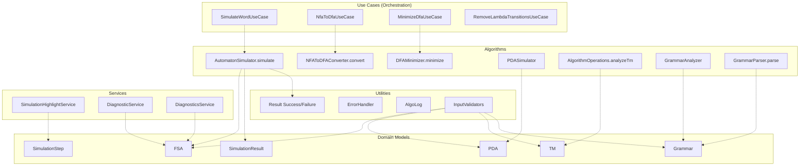

**Sources:** High-level architecture diagrams (Diagram 1, Diagram 5), [lib/core/use_cases/algorithm_use_cases.dart L1-L202](https://github.com/ThalesMMS/JFlutter/blob/32e808b4/lib/core/use_cases/algorithm_use_cases.dart#L1-L202)

 [lib/core/result.dart L1-L163](https://github.com/ThalesMMS/JFlutter/blob/32e808b4/lib/core/result.dart#L1-L163)

---

## Domain Models

The Core Layer defines immutable domain models representing formal language theory constructs. These models are independent of both presentation and persistence concerns.

### Model Hierarchy

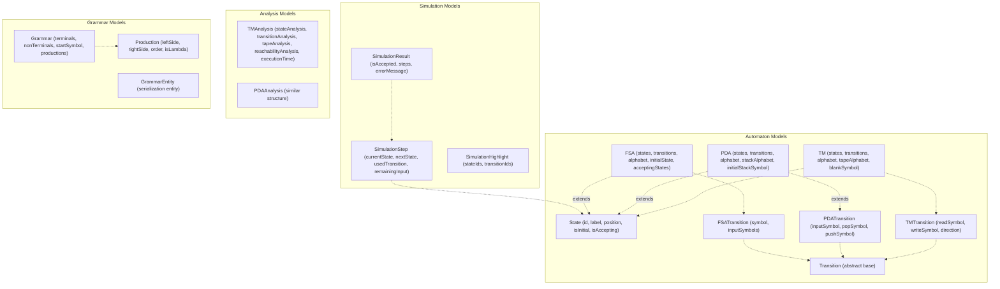

**Key Model Characteristics:**

| Model | Location Hint | Key Properties |
| --- | --- | --- |
| `State` | `lib/core/models/state.dart` | `id`, `label`, `position`, `isInitial`, `isAccepting` |
| `FSA` | `lib/core/models/fsa.dart` | `states`, `transitions`, `alphabet`, `initialState`, `acceptingStates` |
| `PDA` | `lib/core/models/pda.dart` | Extends FSA with `stackAlphabet`, `initialStackSymbol` |
| `TM` | `lib/core/models/tm.dart` | Extends FSA with `tapeAlphabet`, `blankSymbol` |
| `Grammar` | `lib/core/models/grammar.dart` | `terminals`, `nonTerminals`, `startSymbol`, `productions` |
| `SimulationResult` | `lib/core/models/simulation_result.dart` | `isAccepted`, `steps`, `errorMessage` |

**Sources:** [lib/core/entities/grammar_entity.dart L1-L41](https://github.com/ThalesMMS/JFlutter/blob/32e808b4/lib/core/entities/grammar_entity.dart#L1-L41)

 Domain model file paths inferred from algorithm usage

---

## Algorithms

The Core Layer implements all automata theory algorithms. Algorithms are organized by domain and exposed through static methods or dedicated classes.

### FSA Algorithms

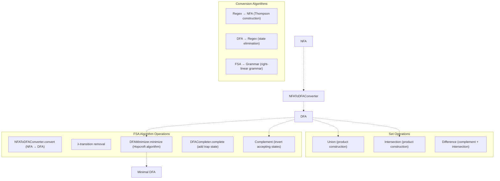

**Algorithm Implementations:**

* **NFA to DFA Conversion**: Subset construction algorithm, creates power set of states
* **DFA Minimization**: Hopcroft's algorithm for partitioning equivalent states
* **Lambda Removal**: Computes epsilon closures and eliminates epsilon transitions
* **Regex Conversion**: Thompson construction for regex→NFA, state elimination for DFA→regex

**Sources:** High-level architecture diagram (Diagram 5), [lib/presentation/widgets/grammar_algorithm_panel.dart L506-L561](https://github.com/ThalesMMS/JFlutter/blob/32e808b4/lib/presentation/widgets/grammar_algorithm_panel.dart#L506-L561)

### PDA Algorithms

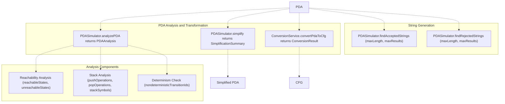

**Key PDA Operations:**

| Operation | Method | Returns |
| --- | --- | --- |
| Simplification | `PDASimulator.simplify(pda)` | `Result<SimplificationSummary>` with removed states/transitions |
| Analysis | `PDASimulator.analyzePDA(pda)` | `Result<PDAAnalysis>` with reachability, stack operations |
| Conversion to CFG | `ConversionService.convertPdaToCfg(...)` | `Result<ConversionResult>` with generated grammar |
| Determinism Check | Via `pdaEditorProvider.nondeterministicTransitionIds` | Set of conflicting transition IDs |

**Sources:** [lib/presentation/widgets/pda_algorithm_panel.dart L298-L413](https://github.com/ThalesMMS/JFlutter/blob/32e808b4/lib/presentation/widgets/pda_algorithm_panel.dart#L298-L413)

 [lib/presentation/widgets/pda_algorithm_panel.dart L471-L512](https://github.com/ThalesMMS/JFlutter/blob/32e808b4/lib/presentation/widgets/pda_algorithm_panel.dart#L471-L512)

### TM Algorithms

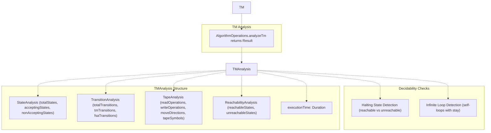

**TM Analysis Details:**

The `AlgorithmOperations.analyzeTm` method performs comprehensive analysis including:

* State counting (total, accepting, non-accepting, reachable)
* Transition validation (TM-specific vs FSA-style)
* Tape operation cataloging (read, write, movement symbols)
* Decidability heuristics (halting state reachability, potential infinite loops)
* Performance metrics (execution time, states processed)

**Infinite Loop Detection:** Self-loop transitions where `readSymbol == writeSymbol` and `direction == TapeDirection.stay`.

**Sources:** [lib/presentation/widgets/tm_algorithm_panel.dart L543-L585](https://github.com/ThalesMMS/JFlutter/blob/32e808b4/lib/presentation/widgets/tm_algorithm_panel.dart#L543-L585)

 [lib/presentation/widgets/tm_algorithm_panel.dart L846-L856](https://github.com/ThalesMMS/JFlutter/blob/32e808b4/lib/presentation/widgets/tm_algorithm_panel.dart#L846-L856)

### Grammar Algorithms

```mermaid
flowchart TD

RemoveLeft["GrammarAnalyzer.removeDirectLeftRecursion"]
LeftFactor["GrammarAnalyzer.leftFactor"]
ComputeFirst["GrammarAnalyzer.computeFirstSets"]
ComputeFollow["GrammarAnalyzer.computeFollowSets"]
BuildLL1["GrammarAnalyzer.buildLL1ParseTable"]
DetectAmbiguity["GrammarAnalyzer.detectAmbiguity"]
ParseString["GrammarParser.parse (grammar, string, strategyHint)"]
CYK["ParsingStrategyHint.cyk"]
LL["ParsingStrategyHint.ll"]
LR["ParsingStrategyHint.lr"]
Auto["ParsingStrategyHint.auto"]
ParseResult["ParseResult (accepted, derivations, errorMessage, executionTime)"]
LL1ParseTable["LL1ParseTable (terminals, nonTerminals, table Map)"]
Grammar["Grammar"]
Transformed["Transformed Grammar"]

Grammar -.-> RemoveLeft
Grammar -.-> LeftFactor
RemoveLeft -.-> Transformed
LeftFactor -.-> Transformed
Grammar -.-> ComputeFirst
Grammar -.-> ComputeFollow
Grammar -.-> BuildLL1
Grammar -.-> DetectAmbiguity
Grammar -.-> ParseString
ParseString -.-> CYK
ParseString -.-> LL
ParseString -.-> LR
ParseString -.-> Auto
ParseString -.-> ParseResult
BuildLL1 -.-> LL1ParseTable

subgraph subGraph4 ["Result Structure"]
    ParseResult
    LL1ParseTable
end

subgraph subGraph3 ["Strategy Hints"]
    CYK
    LL
    LR
    Auto
end

subgraph Parsing ["Parsing"]
    ParseString
end

subgraph subGraph1 ["Parser Analysis"]
    ComputeFirst
    ComputeFollow
    BuildLL1
    DetectAmbiguity
end

subgraph subGraph0 ["Grammar Transformations"]
    RemoveLeft
    LeftFactor
end
```

**Grammar Algorithm Return Types:**

All grammar analysis methods return `Result<GrammarAnalysisReport<T>>` where `T` is:

* `Grammar` for transformations
* `Map<String, Set<String>>` for FIRST/FOLLOW sets
* `LL1ParseTable` for parse table construction
* `bool` for ambiguity detection

The `GrammarAnalysisReport<T>` includes:

* `value: T` - The computed result
* `notes: List<String>` - Analysis observations
* `conflicts: List<String>` - Issues detected (e.g., parse table conflicts)
* `derivations: List<String>` - Step-by-step derivations

**Sources:** [lib/presentation/widgets/grammar_algorithm_panel.dart L503-L571](https://github.com/ThalesMMS/JFlutter/blob/32e808b4/lib/presentation/widgets/grammar_algorithm_panel.dart#L503-L571)

 [lib/presentation/widgets/grammar_simulation_panel.dart L327-L395](https://github.com/ThalesMMS/JFlutter/blob/32e808b4/lib/presentation/widgets/grammar_simulation_panel.dart#L327-L395)

 [lib/presentation/widgets/grammar_simulation_panel.dart L401-L412](https://github.com/ThalesMMS/JFlutter/blob/32e808b4/lib/presentation/widgets/grammar_simulation_panel.dart#L401-L412)

---

## Simulation System

The simulation system executes automata on input strings and generates step-by-step traces for visualization.

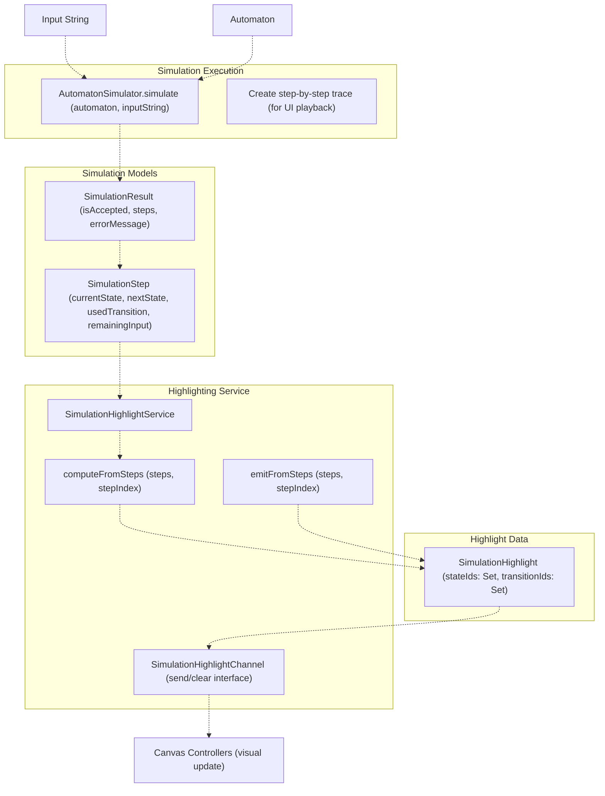

### Simulation Execution Flow

1. **Input Reception**: User provides input string via `SimulationPanel`
2. **Simulation Invocation**: Calls `AutomatonSimulator.simulate(automaton, word)`
3. **Step Generation**: Creates `List<SimulationStep>` tracing each state transition
4. **Result Construction**: Packages steps into `SimulationResult` with acceptance verdict
5. **Highlight Emission**: `SimulationHighlightService` computes highlights for current step
6. **Canvas Update**: Highlights propagate to canvas controllers for visual feedback

### SimulationStep Construction

Each `SimulationStep` captures:

* `currentState`: State ID at this step
* `nextState`: Next state ID (may be null)
* `usedTransition`: Symbol or transition ID consumed
* `remainingInput`: Unprocessed portion of input string

**Step Description Logic** ([lib/presentation/widgets/simulation_panel.dart L121-L161](https://github.com/ThalesMMS/JFlutter/blob/32e808b4/lib/presentation/widgets/simulation_panel.dart#L121-L161)

):

* Step 0: "Start at {state} with input {string}"
* Intermediate: "Read '{symbol}' from {fromState} → {toState} with remaining '{input}'"
* Final: "Final configuration {state} – input {accepted|rejected}"

**Sources:** [lib/presentation/widgets/simulation_panel.dart L1-L697](https://github.com/ThalesMMS/JFlutter/blob/32e808b4/lib/presentation/widgets/simulation_panel.dart#L1-L697)

 [lib/core/services/simulation_highlight_service.dart L1-L190](https://github.com/ThalesMMS/JFlutter/blob/32e808b4/lib/core/services/simulation_highlight_service.dart#L1-L190)

### Highlight Channel Architecture

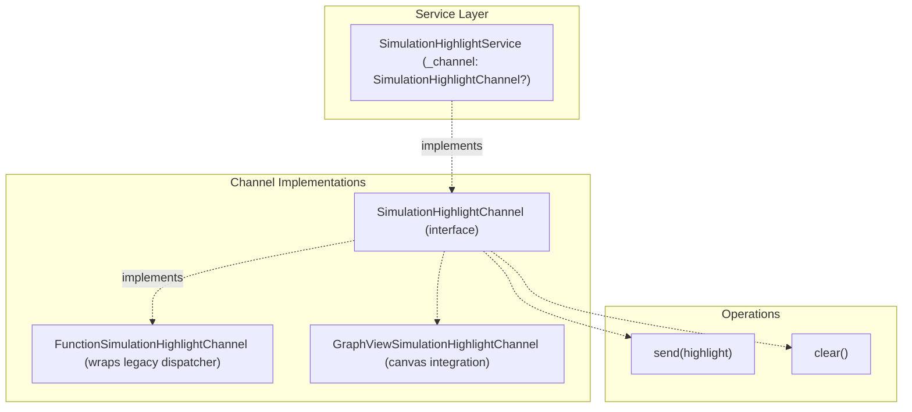

**Channel Pattern:** The `SimulationHighlightChannel` interface allows pluggable highlight consumers. Adapters include:

* `FunctionSimulationHighlightChannel`: Wraps legacy callback functions
* `GraphViewSimulationHighlightChannel`: Direct canvas controller integration (referenced in Diagram 2)

**Dispatch Metrics:** The service tracks `_dispatchCount` and `_lastHighlight` for debugging ([lib/core/services/simulation_highlight_service.dart L76-L89](https://github.com/ThalesMMS/JFlutter/blob/32e808b4/lib/core/services/simulation_highlight_service.dart#L76-L89)

).

**Sources:** [lib/core/services/simulation_highlight_service.dart L29-L189](https://github.com/ThalesMMS/JFlutter/blob/32e808b4/lib/core/services/simulation_highlight_service.dart#L29-L189)

---

## Use Cases

Use cases orchestrate algorithms and repositories, providing a clean API for the presentation layer. Each use case encapsulates a single operation.

### Use Case Structure

```mermaid
flowchart TD

SimulateWord["SimulateWordUseCase execute(automaton, word)"]
NfaToDfa["NfaToDfaUseCase execute(nfa)"]
MinimizeDfa["MinimizeDfaUseCase execute(dfa)"]
RemoveLambda["RemoveLambdaTransitionsUseCase execute(nfa)"]
CompleteDfa["CompleteDfaUseCase execute(dfa)"]
ComplementDfa["ComplementDfaUseCase execute(dfa)"]
UnionDfa["UnionDfaUseCase execute(a, b)"]
IntersectionDfa["IntersectionDfaUseCase execute(a, b)"]
DifferenceDfa["DifferenceDfaUseCase execute(a, b)"]
RegexToNfa["RegexToNfaUseCase execute(regex)"]
DfaToRegex["DfaToRegexUseCase execute(dfa, allowLambda)"]
CheckEquivalence["CheckEquivalenceUseCase execute(a, b)"]
StepByStep["CreateStepByStepSimulationUseCase execute(automaton, word)"]
Repo["AlgorithmRepository (injected dependency)"]
AutomatonResult["AutomatonResult (alias for Result<AutomatonEntity>)"]
SimResult["Result<SimulationResult>"]
StringResult["StringResult (alias for Result<String>)"]
BoolResult["BoolResult (alias for Result<bool>)"]
StepResult["Result<List<SimulationStep>>"]

SimulateWord -.->|"depends on"| Repo
NfaToDfa -.->|"depends on"| Repo
MinimizeDfa -.->|"depends on"| Repo
SimulateWord -.-> SimResult
NfaToDfa -.-> AutomatonResult
MinimizeDfa -.-> AutomatonResult
RegexToNfa -.-> AutomatonResult
DfaToRegex -.-> StringResult
CheckEquivalence -.-> BoolResult
StepByStep -.-> StepResult

subgraph subGraph2 ["Return Types"]
    AutomatonResult
    SimResult
    StringResult
    BoolResult
    StepResult
end

subgraph subGraph1 ["Repository Dependency"]
    Repo
end

subgraph subGraph0 ["Use Case Classes"]
    SimulateWord
    NfaToDfa
    MinimizeDfa
    RemoveLambda
    CompleteDfa
    ComplementDfa
    UnionDfa
    IntersectionDfa
    DifferenceDfa
    RegexToNfa
    DfaToRegex
    CheckEquivalence
    StepByStep
end
```

**Common Use Case Pattern:**

```
class NfaToDfaUseCase {  final AlgorithmRepository _repository;    NfaToDfaUseCase(this._repository);    Future<AutomatonResult> execute(AutomatonEntity nfa) async {    return await _repository.nfaToDfa(nfa);  }}
```

**Use Case Catalog:**

| Use Case | Input | Output | Purpose |
| --- | --- | --- | --- |
| `SimulateWordUseCase` | `AutomatonEntity`, `String` | `Result<SimulationResult>` | Execute automaton on input |
| `NfaToDfaUseCase` | `AutomatonEntity` (NFA) | `AutomatonResult` | Convert NFA to DFA |
| `MinimizeDfaUseCase` | `AutomatonEntity` (DFA) | `AutomatonResult` | Minimize DFA states |
| `RemoveLambdaTransitionsUseCase` | `AutomatonEntity` (NFA) | `AutomatonResult` | Eliminate epsilon transitions |
| `CompleteDfaUseCase` | `AutomatonEntity` (DFA) | `AutomatonResult` | Add trap state for completeness |
| `ComplementDfaUseCase` | `AutomatonEntity` (DFA) | `AutomatonResult` | Invert accepting states |
| `UnionDfaUseCase` | Two `AutomatonEntity` | `AutomatonResult` | Product construction for union |
| `IntersectionDfaUseCase` | Two `AutomatonEntity` | `AutomatonResult` | Product construction for intersection |
| `DifferenceDfaUseCase` | Two `AutomatonEntity` | `AutomatonResult` | Set difference operation |
| `RegexToNfaUseCase` | `String` (regex) | `AutomatonResult` | Thompson construction |
| `DfaToRegexUseCase` | `AutomatonEntity`, `bool` | `StringResult` | State elimination method |
| `CheckEquivalenceUseCase` | Two `AutomatonEntity` | `BoolResult` | Equivalence checking |
| `CreateStepByStepSimulationUseCase` | `AutomatonEntity`, `String` | `Result<List<SimulationStep>>` | Generate trace steps |

**Sources:** [lib/core/use_cases/algorithm_use_cases.dart L1-L202](https://github.com/ThalesMMS/JFlutter/blob/32e808b4/lib/core/use_cases/algorithm_use_cases.dart#L1-L202)

---

## Services

Core services provide supporting functionality for diagnostics, highlighting, and error tracking.

### SimulationHighlightService

Orchestrates visual highlighting during step-by-step simulation playback.

**Key Methods:**

| Method | Purpose | Returns |
| --- | --- | --- |
| `computeFromSteps(steps, index)` | Calculates highlight without emitting | `SimulationHighlight` |
| `emitFromSteps(steps, index)` | Calculates and emits highlight | `SimulationHighlight` |
| `dispatch(highlight)` | Sends highlight to active channel | `void` |
| `clear()` | Clears current highlight | `void` |

**Highlight Computation Logic** ([lib/core/services/simulation_highlight_service.dart L104-L143](https://github.com/ThalesMMS/JFlutter/blob/32e808b4/lib/core/services/simulation_highlight_service.dart#L104-L143)

):

* Extracts `currentState` and `nextState` from step at `stepIndex`
* If `nextState` is null/empty, looks ahead to step `stepIndex + 1`
* Collects `usedTransition` if present
* Returns `SimulationHighlight` with immutable sets of state/transition IDs

**Debug Logging:** All operations log messages when `kDebugMode` is true ([lib/core/services/simulation_highlight_service.dart L56-L60](https://github.com/ThalesMMS/JFlutter/blob/32e808b4/lib/core/services/simulation_highlight_service.dart#L56-L60)

).

**Provider Integration:**

```
final canvasHighlightServiceProvider = Provider<SimulationHighlightService>((ref) {  return SimulationHighlightService();});
```

**Sources:** [lib/core/services/simulation_highlight_service.dart L1-L190](https://github.com/ThalesMMS/JFlutter/blob/32e808b4/lib/core/services/simulation_highlight_service.dart#L1-L190)

### DiagnosticService vs DiagnosticsService

The codebase has two diagnostic services with overlapping responsibilities:

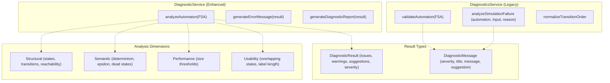

**DiagnosticService** (enhanced):

* Comprehensive analysis across 4 dimensions: structural, semantic, performance, usability
* Returns `DiagnosticResult` with categorized issues, warnings, and suggestions
* Includes helper methods for error message generation
* Located at `lib/core/services/diagnostic_service.dart`

**DiagnosticsService** (legacy/focused):

* Focused on validation and simulation failure analysis
* Returns `List<DiagnosticMessage>` with severity levels
* Includes state/transition normalization utilities
* Located at `lib/core/services/diagnostics_service.dart`

**Severity Levels:**

```
enum DiagnosticSeverity { error, warning, info }
```

**Example Diagnostic Checks:**

* Empty automaton detection
* Missing/multiple initial states
* Unreachable states
* Dead states (cannot reach accepting state)
* Non-deterministic transitions
* Epsilon transitions in DFA context
* Overlapping state positions
* Long transition labels

**Sources:** [lib/core/services/diagnostic_service.dart L1-L620](https://github.com/ThalesMMS/JFlutter/blob/32e808b4/lib/core/services/diagnostic_service.dart#L1-L620)

 (truncated), [lib/core/services/diagnostics_service.dart L1-L455](https://github.com/ThalesMMS/JFlutter/blob/32e808b4/lib/core/services/diagnostics_service.dart#L1-L455)

---

## Result Type and Error Handling

The Core Layer uses a functional `Result<T>` type for consistent error handling across all operations.

### Result Type Structure

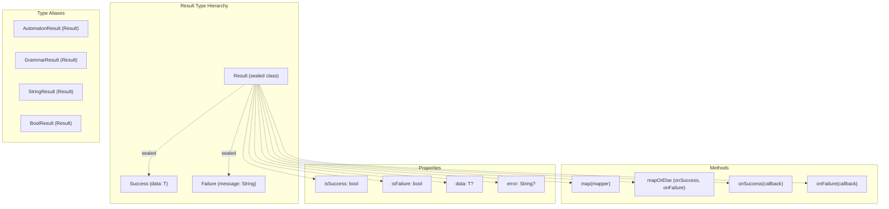

**Result API:**

| Operation | Purpose | Example |
| --- | --- | --- |
| `Result<T>` | Sealed base class | `Result<FSA>` |
| `Success(data)` | Successful result | `Success(convertedDfa)` |
| `Failure(message)` | Error result | `Failure("NFA has no initial state")` |
| `isSuccess` | Check success | `if (result.isSuccess) { ... }` |
| `isFailure` | Check failure | `if (result.isFailure) { ... }` |
| `data` | Extract value | `final fsa = result.data!` |
| `error` | Extract error | `print(result.error)` |
| `map<R>(mapper)` | Transform success | `result.map((fsa) => fsa.states.length)` |
| `onSuccess(callback)` | Side effect on success | `result.onSuccess((fsa) => print(fsa))` |
| `onFailure(callback)` | Side effect on failure | `result.onFailure((err) => log(err))` |

**Extension Methods:**

```
// Convert any value to Successfinal result = myValue.toSuccess(); // Result<T>// Convert string to Failurefinal failure = "Error message".toFailure<T>(); // Result<T>
```

**List Extensions** ([lib/core/result.dart L121-L146](https://github.com/ThalesMMS/JFlutter/blob/32e808b4/lib/core/result.dart#L121-L146)

):

* `allSuccessful`: Returns true if all results succeeded
* `anyFailure`: Returns true if any result failed
* `successfulData`: Collects all successful values
* `errorMessages`: Collects all error messages
* `collect()`: Aggregates results into single `Result<List<T>>`

**mapOrElse Preservation:** The `mapOrElse` method correctly preserves failure state and messages ([test/unit/core/result_test.dart L14-L27](https://github.com/ThalesMMS/JFlutter/blob/32e808b4/test/unit/core/result_test.dart#L14-L27)

).

**Sources:** [lib/core/result.dart L1-L163](https://github.com/ThalesMMS/JFlutter/blob/32e808b4/lib/core/result.dart#L1-L163)

 [test/unit/core/result_test.dart L1-L29](https://github.com/ThalesMMS/JFlutter/blob/32e808b4/test/unit/core/result_test.dart#L1-L29)

### ErrorHandler Utilities

The `ErrorHandler` class provides UI-aware error handling utilities:

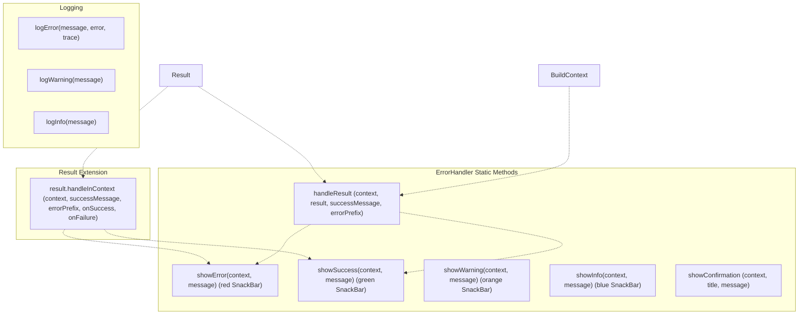

**Usage Pattern:**

```javascript
// Direct handlingErrorHandler.handleResult(  context,  algorithmResult,  successMessage: "Conversion successful",  errorPrefix: "Conversion failed",);// Extension methodresult.handleInContext(  context,  successMessage: "Operation completed",  onSuccess: (data) => print("Got: $data"),  onFailure: (error) => print("Failed: $error"),);
```

**SnackBar Actions:** All SnackBars include a "Fechar" (Close) action button ([lib/core/error_handler.dart L32-L40](https://github.com/ThalesMMS/JFlutter/blob/32e808b4/lib/core/error_handler.dart#L32-L40)

).

**Sources:** [lib/core/error_handler.dart L1-L222](https://github.com/ThalesMMS/JFlutter/blob/32e808b4/lib/core/error_handler.dart#L1-L222)

### AlgoLog (Algorithm Logging)

The `AlgoLog` class provides reactive logging for algorithm execution visualization:

```
// Add log entriesAlgoLog.addLine("Processing state q0");AlgoLog.addLines(["Step 1", "Step 2", "Step 3"]);// Highlight statesAlgoLog.highlightStates({"q0", "q1"});// ClearAlgoLog.clear();// Access via notifiersAlgoLog.lines.value; // List<String>AlgoLog.highlights.value; // Set<String>
```

**Reactive UI Integration:** UI widgets can listen to `AlgoLog.lines` and `AlgoLog.highlights` ValueNotifiers for real-time updates during algorithm execution.

**Sources:** [lib/core/algo_log.dart L1-L61](https://github.com/ThalesMMS/JFlutter/blob/32e808b4/lib/core/algo_log.dart#L1-L61)

---

## Validation

Input validation ensures structural correctness before algorithm execution.

### InputValidators

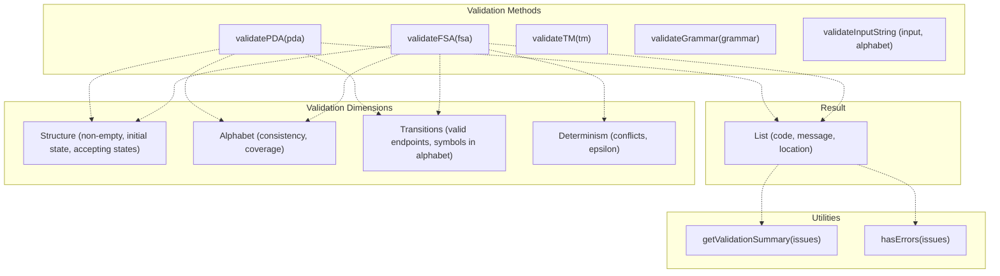

**ValidationIssue Structure:**

```
class ValidationIssue {  final String code;        // e.g., "FSA_NO_INITIAL"  final String message;     // Human-readable description  final String? location;   // Optional location hint}
```

**FSA Validation Checks** ([lib/core/validators/input_validators.dart L30-L128](https://github.com/ThalesMMS/JFlutter/blob/32e808b4/lib/core/validators/input_validators.dart#L30-L128)

):

* Empty state set → `FSA_EMPTY`
* Missing initial state → `FSA_NO_INITIAL`
* Initial state not in state set → `FSA_INVALID_INITIAL`
* Empty alphabet → `FSA_EMPTY_ALPHABET`
* Accepting state not in state set → `FSA_INVALID_ACCEPTING`
* Transition from unknown state → `FSA_BAD_FROM`
* Transition to unknown state → `FSA_BAD_TO`
* Transition symbol not in alphabet → `FSA_BAD_SYMBOL`
* Multiple transitions on same symbol → `FSA_NONDETERMINISTIC`

**PDA Validation Additions** ([lib/core/validators/input_validators.dart L130-L242](https://github.com/ThalesMMS/JFlutter/blob/32e808b4/lib/core/validators/input_validators.dart#L130-L242)

):

* Stack alphabet validation
* Initial stack symbol in stack alphabet
* PDA transition input/pop/push symbol validation

**TM Validation Additions** ([lib/core/validators/input_validators.dart L332-L460](https://github.com/ThalesMMS/JFlutter/blob/32e808b4/lib/core/validators/input_validators.dart#L332-L460)

):

* Tape alphabet validation
* Blank symbol in tape alphabet
* Input alphabet subset of tape alphabet
* Read/write symbols in tape alphabet
* Move direction validation

**Grammar Validation** ([lib/core/validators/input_validators.dart L244-L330](https://github.com/ThalesMMS/JFlutter/blob/32e808b4/lib/core/validators/input_validators.dart#L244-L330)

):

* Non-empty productions
* Start symbol is non-terminal
* Production left side is non-terminal
* Production right side symbols in terminals ∪ non-terminals

**Utility Methods:**

```
// Get summary stringfinal summary = InputValidators.getValidationSummary(issues);// "Validation found 3 issue(s):\n  • 2 error(s)\n  • 1 warning(s)"// Check for critical errorsif (InputValidators.hasErrors(issues)) {  // Prevent algorithm execution}
```

**Sources:** [lib/core/validators/input_validators.dart L1-L519](https://github.com/ThalesMMS/JFlutter/blob/32e808b4/lib/core/validators/input_validators.dart#L1-L519)

---

## Integration with Presentation Layer

The Core Layer integrates with the Presentation Layer through use cases and services:

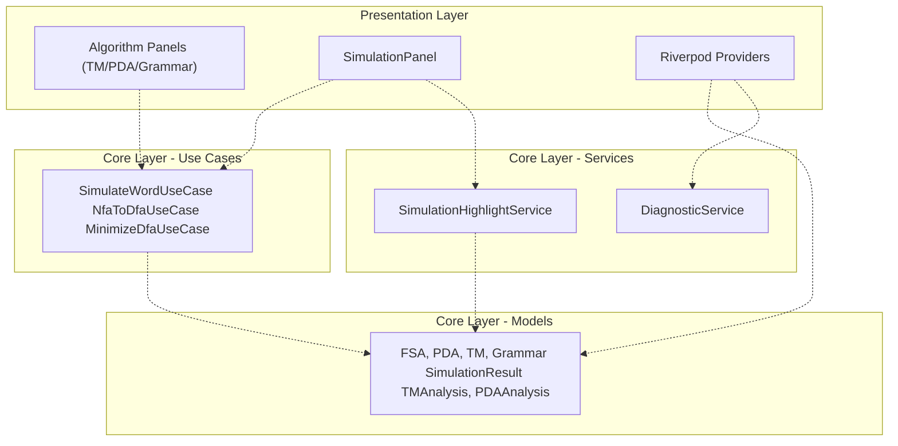

**Key Integration Points:**

1. **Algorithm Execution:** Panels call use case `execute()` methods asynchronously
2. **Result Handling:** Use cases return `Result<T>`, handled via `ErrorHandler.handleResult`
3. **Highlighting:** `SimulationHighlightService` emits highlights to canvas controllers
4. **Validation:** `InputValidators` validate models before algorithm execution
5. **Analysis Display:** Algorithm panels format analysis results (e.g., `TMAnalysis`) for display

**Example Integration Flow:**

```
// In TMAlgorithmPanelFuture<void> _performAnalysis(_TMAnalysisFocus focus) async {  final tm = ref.read(tmEditorProvider).tm;    // Core layer validation  final Result<TMAnalysis> result = AlgorithmOperations.analyzeTm(tm);    // Core layer error handling  if (result.isSuccess) {    _analysis = result.data;  } else {    _analysisError = result.error;  }}
```

**Sources:** [lib/presentation/widgets/tm_algorithm_panel.dart L543-L585](https://github.com/ThalesMMS/JFlutter/blob/32e808b4/lib/presentation/widgets/tm_algorithm_panel.dart#L543-L585)

 [lib/presentation/widgets/pda_algorithm_panel.dart L654-L688](https://github.com/ThalesMMS/JFlutter/blob/32e808b4/lib/presentation/widgets/pda_algorithm_panel.dart#L654-L688)


### On this page

* [Core Domain Layer](#2.2-core-domain-layer)
* [Purpose and Scope](#2.2-purpose-and-scope)
* [Architecture Overview](#2.2-architecture-overview)
* [Domain Models](#2.2-domain-models)
* [Model Hierarchy](#2.2-model-hierarchy)
* [Algorithms](#2.2-algorithms)
* [FSA Algorithms](#2.2-fsa-algorithms)
* [PDA Algorithms](#2.2-pda-algorithms)
* [TM Algorithms](#2.2-tm-algorithms)
* [Grammar Algorithms](#2.2-grammar-algorithms)
* [Simulation System](#2.2-simulation-system)
* [Simulation Execution Flow](#2.2-simulation-execution-flow)
* [SimulationStep Construction](#2.2-simulationstep-construction)
* [Highlight Channel Architecture](#2.2-highlight-channel-architecture)
* [Use Cases](#2.2-use-cases)
* [Use Case Structure](#2.2-use-case-structure)
* [Services](#2.2-services)
* [SimulationHighlightService](#2.2-simulationhighlightservice)
* [DiagnosticService vs DiagnosticsService](#2.2-diagnosticservice-vs-diagnosticsservice)
* [Result Type and Error Handling](#2.2-result-type-and-error-handling)
* [Result Type Structure](#2.2-result-type-structure)
* [ErrorHandler Utilities](#2.2-errorhandler-utilities)
* [AlgoLog (Algorithm Logging)](#2.2-algolog-algorithm-logging)
* [Validation](#2.2-validation)
* [InputValidators](#2.2-inputvalidators)
* [Integration with Presentation Layer](#2.2-integration-with-presentation-layer)

Ask Devin about JFlutter