# Data Layer

> **Relevant source files**
> * [lib/core/dfa_algorithms.dart](https://github.com/ThalesMMS/JFlutter/blob/32e808b4/lib/core/dfa_algorithms.dart)
> * [lib/core/entities/automaton_entity.dart](https://github.com/ThalesMMS/JFlutter/blob/32e808b4/lib/core/entities/automaton_entity.dart)
> * [lib/data/repositories/automaton_repository_impl.dart](https://github.com/ThalesMMS/JFlutter/blob/32e808b4/lib/data/repositories/automaton_repository_impl.dart)
> * [lib/data/services/automaton_service.dart](https://github.com/ThalesMMS/JFlutter/blob/32e808b4/lib/data/services/automaton_service.dart)
> * [lib/data/services/serialization_service.dart](https://github.com/ThalesMMS/JFlutter/blob/32e808b4/lib/data/services/serialization_service.dart)
> * [lib/injection/dependency_injection.dart](https://github.com/ThalesMMS/JFlutter/blob/32e808b4/lib/injection/dependency_injection.dart)
> * [lib/presentation/providers/automaton_provider.dart](https://github.com/ThalesMMS/JFlutter/blob/32e808b4/lib/presentation/providers/automaton_provider.dart)
> * [test/core/services/simulation_highlight_service_test.dart](https://github.com/ThalesMMS/JFlutter/blob/32e808b4/test/core/services/simulation_highlight_service_test.dart)
> * [test/integration/io/examples_roundtrip_test.dart](https://github.com/ThalesMMS/JFlutter/blob/32e808b4/test/integration/io/examples_roundtrip_test.dart)
> * [test/integration/io/interoperability_roundtrip_test.dart](https://github.com/ThalesMMS/JFlutter/blob/32e808b4/test/integration/io/interoperability_roundtrip_test.dart)

The Data Layer manages persistence, serialization, and data access for JFlutter. It provides an abstraction boundary between domain logic and external data sources, handling JFLAP XML interoperability, JSON serialization, in-memory storage, embedded examples, and simulation trace persistence. For business logic and algorithms, see [Core Domain Layer](2b%20Core-Domain-Layer.md). For UI state management, see [State Management](6%20State-Management.md).

---

## Architecture Overview

The Data Layer implements a repository pattern with multiple data sources and services. Repositories mediate between domain entities (from the Core layer) and data services, while serialization services handle format conversions for JFLAP interoperability.

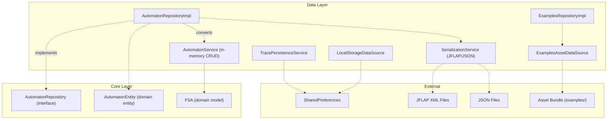

**Data Flow Pattern**: Domain entities (`AutomatonEntity`) are converted to domain models (`FSA`) via repositories, which delegate to services for storage and serialization. The inverse conversion happens during load operations.

**Sources**: [lib/injection/dependency_injection.dart L15-L81](https://github.com/ThalesMMS/JFlutter/blob/32e808b4/lib/injection/dependency_injection.dart#L15-L81)

 [lib/data/repositories/automaton_repository_impl.dart L1-L329](https://github.com/ThalesMMS/JFlutter/blob/32e808b4/lib/data/repositories/automaton_repository_impl.dart#L1-L329)

 [lib/data/services/automaton_service.dart L1-L327](https://github.com/ThalesMMS/JFlutter/blob/32e808b4/lib/data/services/automaton_service.dart#L1-L327)

 [lib/data/services/serialization_service.dart L1-L308](https://github.com/ThalesMMS/JFlutter/blob/32e808b4/lib/data/services/serialization_service.dart#L1-L308)

---

## Repository Layer

Repositories implement interfaces defined in the Core layer, providing a stable API for data operations while hiding implementation details.

### AutomatonRepositoryImpl

The primary repository for automaton persistence and serialization. It converts between `AutomatonEntity` (domain) and `FSA` (internal model) while delegating CRUD operations to `AutomatonService`.

| Method | Purpose | Conversions |
| --- | --- | --- |
| `saveAutomaton` | Persist automaton | `AutomatonEntity` → `CreateAutomatonRequest` → `FSA` |
| `loadAutomaton` | Retrieve by ID | `FSA` → `AutomatonEntity` |
| `loadAllAutomatons` | List all automatons | `List<FSA>` → `List<AutomatonEntity>` |
| `deleteAutomaton` | Remove by ID | Delegates to service |
| `exportAutomaton` | Serialize to JSON | `AutomatonEntity` → `FSA` → JSON string |
| `importAutomaton` | Deserialize from JSON | JSON string → `FSA` → `AutomatonEntity` |
| `validateAutomaton` | Check validity | `AutomatonEntity` → `FSA` → validation |

**Conversion Methods**:

* `_convertEntityToFsa`: [lib/data/repositories/automaton_repository_impl.dart L226-L306](https://github.com/ThalesMMS/JFlutter/blob/32e808b4/lib/data/repositories/automaton_repository_impl.dart#L226-L306)  - Builds `FSA` with states, transitions, and bounds
* `_convertFsaToEntity`: [lib/data/repositories/automaton_repository_impl.dart L175-L224](https://github.com/ThalesMMS/JFlutter/blob/32e808b4/lib/data/repositories/automaton_repository_impl.dart#L175-L224)  - Extracts `AutomatonEntity` with type detection
* `_convertEntityToRequest`: [lib/data/repositories/automaton_repository_impl.dart L132-L173](https://github.com/ThalesMMS/JFlutter/blob/32e808b4/lib/data/repositories/automaton_repository_impl.dart#L132-L173)  - Creates `CreateAutomatonRequest` for service layer

**Key Implementation Details**:

* Transition keys follow format `"fromStateId|symbol"` (e.g., `"q0|a"`)
* Epsilon symbols are normalized via `normalizeToEpsilon()` from [lib/core/utils/epsilon_utils.dart](https://github.com/ThalesMMS/JFlutter/blob/32e808b4/lib/core/utils/epsilon_utils.dart)
* Automaton type is inferred: `AutomatonType.nfaLambda` if epsilon transitions present, `AutomatonType.dfa` if deterministic, else `AutomatonType.nfa`
* Bounds are calculated with 50px padding: [lib/data/repositories/automaton_repository_impl.dart L308-L328](https://github.com/ThalesMMS/JFlutter/blob/32e808b4/lib/data/repositories/automaton_repository_impl.dart#L308-L328)

**Sources**: [lib/data/repositories/automaton_repository_impl.dart L1-L329](https://github.com/ThalesMMS/JFlutter/blob/32e808b4/lib/data/repositories/automaton_repository_impl.dart#L1-L329)

 [lib/core/repositories/automaton_repository.dart](https://github.com/ThalesMMS/JFlutter/blob/32e808b4/lib/core/repositories/automaton_repository.dart)

### ExamplesRepositoryImpl

Provides access to embedded example automatons, grammars, and Turing machines stored as assets.

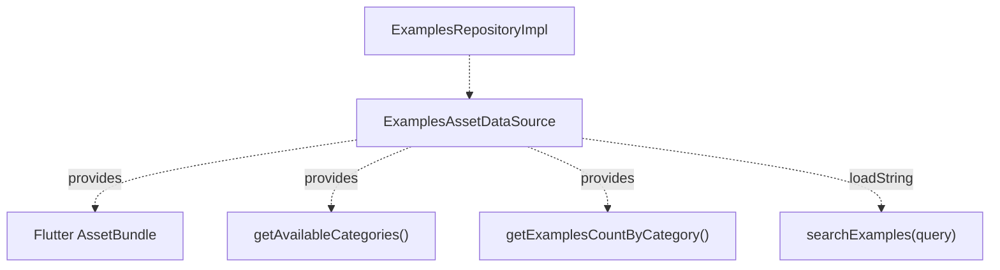

The examples system categorizes assets by type:

| Category | DisplayName | Path Pattern |
| --- | --- | --- |
| `ExampleCategory.dfa` | DFA | `assets/examples/dfa/*.jff` |
| `ExampleCategory.nfa` | NFA | `assets/examples/nfa/*.jff` |
| `ExampleCategory.cfg` | CFG | `assets/examples/cfg/*.jff` |
| `ExampleCategory.pda` | PDA | `assets/examples/pda/*.jff` |
| `ExampleCategory.tm` | TM | `assets/examples/tm/*.jff` |

**Sources**: [lib/data/repositories/examples_repository_impl.dart](https://github.com/ThalesMMS/JFlutter/blob/32e808b4/lib/data/repositories/examples_repository_impl.dart)

 [lib/data/data_sources/examples_asset_data_source.dart](https://github.com/ThalesMMS/JFlutter/blob/32e808b4/lib/data/data_sources/examples_asset_data_source.dart)

 [lib/injection/dependency_injection.dart L71-L75](https://github.com/ThalesMMS/JFlutter/blob/32e808b4/lib/injection/dependency_injection.dart#L71-L75)

### Additional Repositories

| Repository | Purpose | Location |
| --- | --- | --- |
| `AlgorithmRepositoryImpl` | Algorithm operations facade | [lib/data/repositories/algorithm_repository_impl.dart](https://github.com/ThalesMMS/JFlutter/blob/32e808b4/lib/data/repositories/algorithm_repository_impl.dart) |
| `LayoutRepositoryImpl` | Auto-layout via SugiyamaAlgorithm | [lib/features/layout/layout_repository_impl.dart](https://github.com/ThalesMMS/JFlutter/blob/32e808b4/lib/features/layout/layout_repository_impl.dart) |

**Sources**: [lib/injection/dependency_injection.dart L77-L81](https://github.com/ThalesMMS/JFlutter/blob/32e808b4/lib/injection/dependency_injection.dart#L77-L81)

---

## Services

### AutomatonService

An in-memory CRUD service managing automaton lifecycle. Does not persist to disk; serves as a transient storage layer.

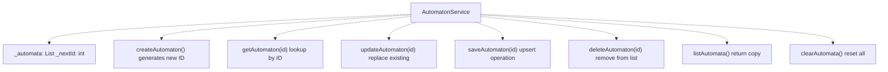

**Key Methods**:

* `createAutomaton(CreateAutomatonRequest)`: [lib/data/services/automaton_service.dart L108-L124](https://github.com/ThalesMMS/JFlutter/blob/32e808b4/lib/data/services/automaton_service.dart#L108-L124)  - Auto-generates ID, adds to list
* `saveAutomaton(id, CreateAutomatonRequest)`: [lib/data/services/automaton_service.dart L160-L182](https://github.com/ThalesMMS/JFlutter/blob/32e808b4/lib/data/services/automaton_service.dart#L160-L182)  - Upserts with specific ID
* `_buildAutomatonFromRequest(request)`: [lib/data/services/automaton_service.dart L24-L105](https://github.com/ThalesMMS/JFlutter/blob/32e808b4/lib/data/services/automaton_service.dart#L24-L105)  - Constructs `FSA` from request, normalizing epsilon symbols

**Data Structures**:

```
class CreateAutomatonRequest {  String name;  String? description;  List<StateData> states;          // id, name, position, flags  List<TransitionData> transitions; // fromStateId, toStateId, symbol  List<String> alphabet;  Rect bounds;}
```

**ID Generation**: Auto-increments `_nextId` starting from 1. Not suitable for persistent storage without external ID management.

**Sources**: [lib/data/services/automaton_service.dart L1-L327](https://github.com/ThalesMMS/JFlutter/blob/32e808b4/lib/data/services/automaton_service.dart#L1-L327)

### SerializationService

Handles bidirectional conversion between internal data structures and external formats (JFLAP XML, JSON).

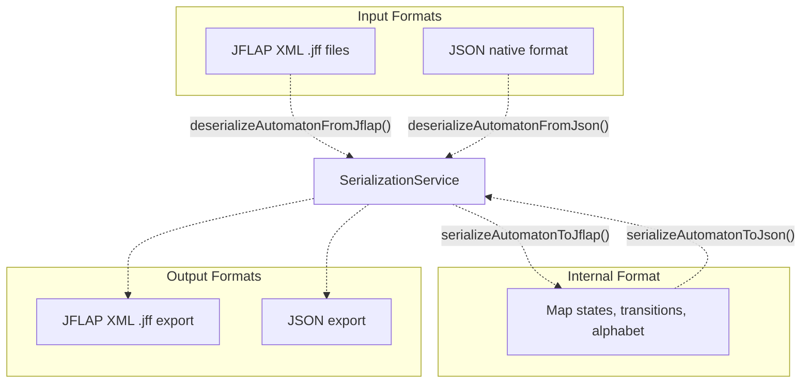

#### JFLAP XML Serialization

**Format Structure**:

```xml
<?xml version="1.0" encoding="UTF-8"?><structure type="fa">  <type>fa</type>  <automaton>    <state id="q0" name="q0">      <x>100.0</x>      <y>100.0</y>      <initial/>    </state>    <transition>      <from>q0</from>      <to>q1</to>      <read>a</read>    </transition>  </automaton></structure>
```

**Serialization**: [lib/data/services/serialization_service.dart L18-L103](https://github.com/ThalesMMS/JFlutter/blob/32e808b4/lib/data/services/serialization_service.dart#L18-L103)

* Maps automaton type: `dfa`/`nfa` → `fa`, preserves others
* Iterates `transitions` map with keys `"fromState|symbol"`, expands to multiple `<transition>` elements per target
* Normalizes epsilon symbols via `_normalizeTransitionSymbol()`: [lib/data/services/serialization_service.dart L199-L201](https://github.com/ThalesMMS/JFlutter/blob/32e808b4/lib/data/services/serialization_service.dart#L199-L201)
* Forces explicit `<automaton>` open/close tags (not self-closing) for parser compatibility

**Deserialization**: [lib/data/services/serialization_service.dart L106-L197](https://github.com/ThalesMMS/JFlutter/blob/32e808b4/lib/data/services/serialization_service.dart#L106-L197)

* Parses XML using `xml` package: `XmlDocument.parse(xmlString)`
* Extracts states from `<state>` elements with `id`, `name`, `x`, `y`, `<initial/>`, `<final/>` markers
* Builds transitions map with normalized epsilon symbols
* Returns `Result<Map<String, dynamic>>` with `states`, `transitions`, `initialId`, `type`

**Epsilon Normalization**: All variants (`ε`, `λ`, `lambda`, `vazio`, empty string) are canonicalized to `ε` (U+03B5) via `normalizeToEpsilon()` from [lib/core/utils/epsilon_utils.dart](https://github.com/ThalesMMS/JFlutter/blob/32e808b4/lib/core/utils/epsilon_utils.dart)

**Sources**: [lib/data/services/serialization_service.dart L1-L308](https://github.com/ThalesMMS/JFlutter/blob/32e808b4/lib/data/services/serialization_service.dart#L1-L308)

 [test/integration/io/interoperability_roundtrip_test.dart L36-L248](https://github.com/ThalesMMS/JFlutter/blob/32e808b4/test/integration/io/interoperability_roundtrip_test.dart#L36-L248)

#### JSON Serialization

Uses `AutomatonDto` for structured serialization:

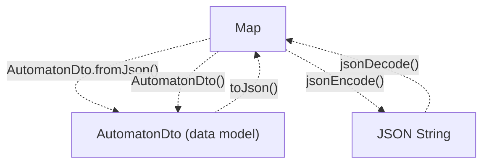

**Serialization**: [lib/data/services/serialization_service.dart L204-L233](https://github.com/ThalesMMS/JFlutter/blob/32e808b4/lib/data/services/serialization_service.dart#L204-L233)

* Constructs `AutomatonDto` from data map with nested `StateDto` objects
* Encodes via `jsonEncode(dto.toJson())`

**Deserialization**: [lib/data/services/serialization_service.dart L236-L256](https://github.com/ThalesMMS/JFlutter/blob/32e808b4/lib/data/services/serialization_service.dart#L236-L256)

* Decodes via `jsonDecode(jsonString)`
* Parses with `AutomatonDto.fromJson(json)`
* Returns structured data map

**DTO Structure**: Defined in [lib/data/models/automaton_dto.dart](https://github.com/ThalesMMS/JFlutter/blob/32e808b4/lib/data/models/automaton_dto.dart)

```
class AutomatonDto {  String id;  String name;  String type;  List<String> alphabet;  List<StateDto> states;  Map<String, List<String>> transitions; // "fromId|symbol" -> [toIds]  String? initialId;  int nextId;}class StateDto {  String id;  String name;  double x, y;  bool isInitial, isFinal;}
```

**Sources**: [lib/data/services/serialization_service.dart L204-L256](https://github.com/ThalesMMS/JFlutter/blob/32e808b4/lib/data/services/serialization_service.dart#L204-L256)

 [lib/data/models/automaton_dto.dart](https://github.com/ThalesMMS/JFlutter/blob/32e808b4/lib/data/models/automaton_dto.dart)

#### Round-Trip Testing

Validation strategy ensuring data integrity across format conversions:

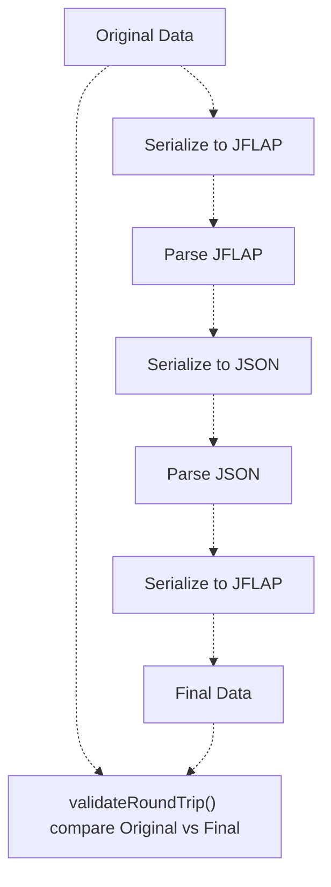

**Method**: `roundTripTest(automatonData, SerializationFormat)` [lib/data/services/serialization_service.dart L259-L286](https://github.com/ThalesMMS/JFlutter/blob/32e808b4/lib/data/services/serialization_service.dart#L259-L286)

* Serializes data to format (JFLAP or JSON)
* Immediately deserializes back
* Returns `Result<Map<String, dynamic>>`

**Validation**: `validateRoundTrip(original, roundTripped)` [lib/data/services/serialization_service.dart L289-L296](https://github.com/ThalesMMS/JFlutter/blob/32e808b4/lib/data/services/serialization_service.dart#L289-L296)

* Compares state count and transition count
* Ensures no data loss during conversion

**Test Coverage**: [test/integration/io/interoperability_roundtrip_test.dart](https://github.com/ThalesMMS/JFlutter/blob/32e808b4/test/integration/io/interoperability_roundtrip_test.dart)

 validates:

* JFF → JSON → JFF preservation
* JSON → JFF → JSON preservation
* Multi-format round-trips (Original → JFF → JSON → JFF → Final)
* Epsilon alias normalization (`λ`, `vazio`, empty string → `ε`)
* Empty automaton stability
* Complex automaton structure preservation

**Sources**: [lib/data/services/serialization_service.dart L259-L296](https://github.com/ThalesMMS/JFlutter/blob/32e808b4/lib/data/services/serialization_service.dart#L259-L296)

 [test/integration/io/interoperability_roundtrip_test.dart L27-L861](https://github.com/ThalesMMS/JFlutter/blob/32e808b4/test/integration/io/interoperability_roundtrip_test.dart#L27-L861)

---

## Persistence Strategy

### In-Memory Storage

The primary storage mechanism is in-memory via `AutomatonService._automata: List<FSA>`. This design choice prioritizes:

* **Performance**: No disk I/O latency during editing
* **Simplicity**: No database schema management
* **Portability**: Works identically across web, mobile, desktop

**Limitations**:

* Data lost on app termination (unless explicitly exported)
* No multi-user synchronization
* Limited by device memory

**Export/Import Flow**:

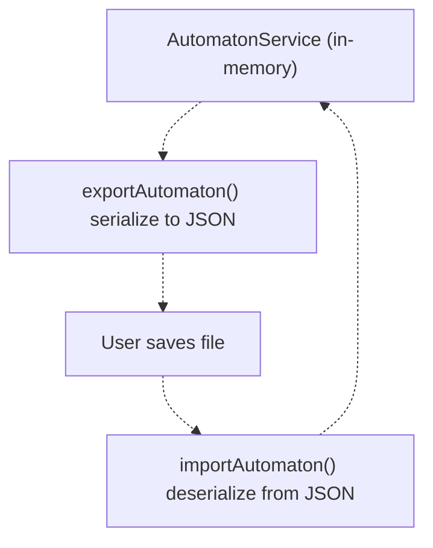

**Sources**: [lib/data/services/automaton_service.dart L20-L22](https://github.com/ThalesMMS/JFlutter/blob/32e808b4/lib/data/services/automaton_service.dart#L20-L22)

 [lib/data/services/automaton_service.dart L212-L245](https://github.com/ThalesMMS/JFlutter/blob/32e808b4/lib/data/services/automaton_service.dart#L212-L245)

### Trace Persistence

Simulation history is persisted via `SharedPreferences` for educational review.

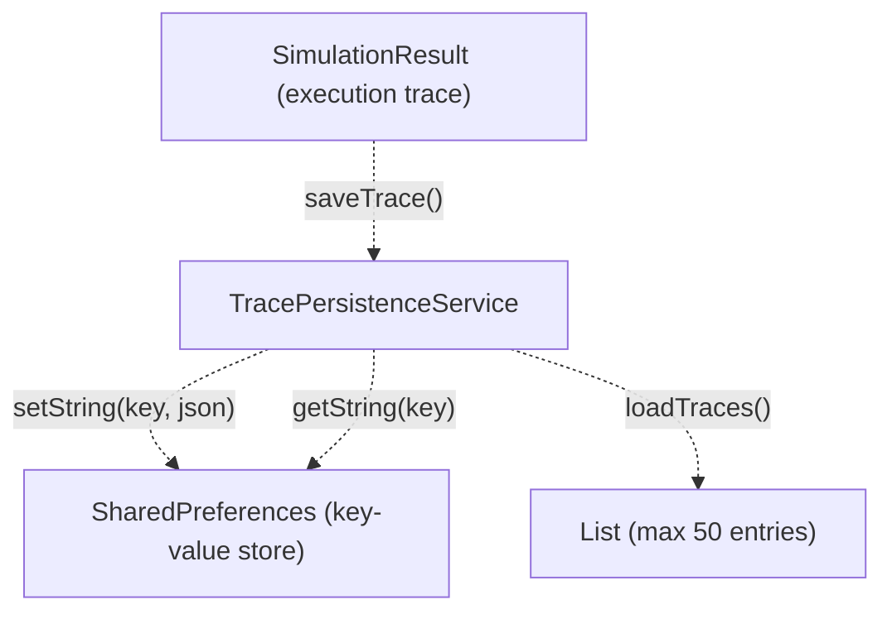

**Two Implementations**:

1. **Core Layer**: [lib/core/services/trace_persistence_service.dart](https://github.com/ThalesMMS/JFlutter/blob/32e808b4/lib/core/services/trace_persistence_service.dart)  - Abstract interface
2. **Data Layer**: [lib/data/services/trace_persistence_service.dart](https://github.com/ThalesMMS/JFlutter/blob/32e808b4/lib/data/services/trace_persistence_service.dart)  - Concrete implementation with `SharedPreferences`

**Key Methods** (Data Layer Implementation):

* `saveTrace(SimulationResult)`: Serializes result to JSON, stores with timestamp-based key
* `loadTraces()`: Deserializes all stored traces, returns most recent 50
* `clearTraces()`: Removes all trace data from storage

**Storage Strategy**:

* Each trace stored as separate key: `"trace_${timestamp}"`
* JSON format includes: input string, steps, acceptance status, timestamp
* Automatic pruning: oldest traces removed when limit (50) exceeded

**Integration**: Injected into `AutomatonProvider` [lib/presentation/providers/automaton_provider.dart L42-L44](https://github.com/ThalesMMS/JFlutter/blob/32e808b4/lib/presentation/providers/automaton_provider.dart#L42-L44)

 and called after successful simulation [lib/presentation/providers/automaton_provider.dart L1070-L1074](https://github.com/ThalesMMS/JFlutter/blob/32e808b4/lib/presentation/providers/automaton_provider.dart#L1070-L1074)

**Sources**: [lib/data/services/trace_persistence_service.dart](https://github.com/ThalesMMS/JFlutter/blob/32e808b4/lib/data/services/trace_persistence_service.dart)

 [lib/core/services/trace_persistence_service.dart](https://github.com/ThalesMMS/JFlutter/blob/32e808b4/lib/core/services/trace_persistence_service.dart)

 [lib/injection/dependency_injection.dart L59-L66](https://github.com/ThalesMMS/JFlutter/blob/32e808b4/lib/injection/dependency_injection.dart#L59-L66)

### SharedPreferences Usage

`SharedPreferences` provides platform-agnostic key-value persistence:

| Platform | Backend |
| --- | --- |
| Android | `SharedPreferences` (XML file) |
| iOS | `NSUserDefaults` |
| Web | `localStorage` |
| Desktop | Platform-specific preferences |

**Initialization**: [lib/injection/dependency_injection.dart L40](https://github.com/ThalesMMS/JFlutter/blob/32e808b4/lib/injection/dependency_injection.dart#L40-L40)

```
final prefs = await SharedPreferences.getInstance();
```

**Registered Services Using SharedPreferences**:

* `TracePersistenceService` (data layer) - simulation history
* `LocalStorageDataSource` - general key-value storage (registered but implementation not shown in provided files)

**Sources**: [lib/injection/dependency_injection.dart L38-L66](https://github.com/ThalesMMS/JFlutter/blob/32e808b4/lib/injection/dependency_injection.dart#L38-L66)

---

## Data Models and DTOs

### AutomatonDto

Data Transfer Object for JSON serialization, defined in [lib/data/models/automaton_dto.dart](https://github.com/ThalesMMS/JFlutter/blob/32e808b4/lib/data/models/automaton_dto.dart)

 Provides structured serialization with nested `StateDto` and flat transition map.

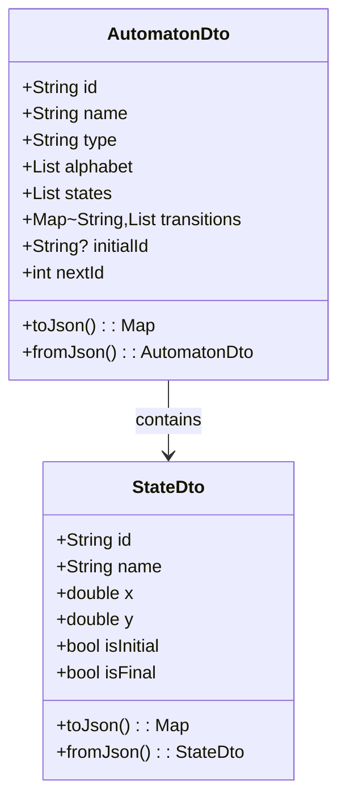

**Transition Map Format**: Keys are `"fromStateId|symbol"`, values are lists of destination state IDs. Example:

```
{  "q0|a": ["q1"],  "q1|b": ["q2", "q3"],  "q2|ε": ["q0"]}
```

**Sources**: [lib/data/models/automaton_dto.dart](https://github.com/ThalesMMS/JFlutter/blob/32e808b4/lib/data/models/automaton_dto.dart)

 [lib/data/services/serialization_service.dart L206-L232](https://github.com/ThalesMMS/JFlutter/blob/32e808b4/lib/data/services/serialization_service.dart#L206-L232)

### Service Request/Response Models

Defined in [lib/data/services/automaton_service.dart L262-L327](https://github.com/ThalesMMS/JFlutter/blob/32e808b4/lib/data/services/automaton_service.dart#L262-L327)

:

```
class CreateAutomatonRequest {  String name;  String? description;  List<StateData> states;  List<TransitionData> transitions;  List<String> alphabet;  Rect bounds;}class StateData {  String id;  String name;  Point position;  bool isInitial;  bool isAccepting;}class TransitionData {  String fromStateId;  String toStateId;  String symbol;}
```

**Usage**: Repositories convert `AutomatonEntity` to `CreateAutomatonRequest` before calling `AutomatonService` [lib/data/repositories/automaton_repository_impl.dart L132-L173](https://github.com/ThalesMMS/JFlutter/blob/32e808b4/lib/data/repositories/automaton_repository_impl.dart#L132-L173)

**Sources**: [lib/data/services/automaton_service.dart L262-L327](https://github.com/ThalesMMS/JFlutter/blob/32e808b4/lib/data/services/automaton_service.dart#L262-L327)

---

## Dependency Injection

All data layer components are registered in [lib/injection/dependency_injection.dart](https://github.com/ThalesMMS/JFlutter/blob/32e808b4/lib/injection/dependency_injection.dart)

 using GetIt for lazy singleton or factory instantiation.

### Registration Hierarchy

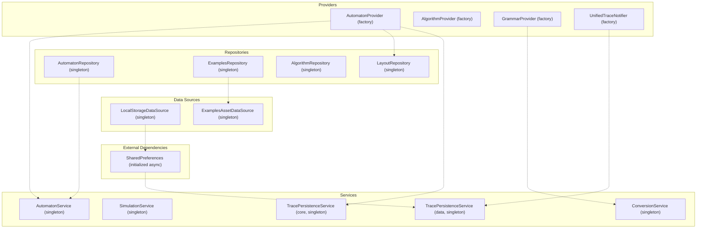

**Registration Pattern**: [lib/injection/dependency_injection.dart L38-L231](https://github.com/ThalesMMS/JFlutter/blob/32e808b4/lib/injection/dependency_injection.dart#L38-L231)

* `registerLazySingleton`: Services, repositories, data sources
* `registerFactory`: Providers (new instance per request)

**GetIt Access**:

```
final getIt = GetIt.instance;final service = getIt<AutomatonService>();
```

**Sources**: [lib/injection/dependency_injection.dart L1-L237](https://github.com/ThalesMMS/JFlutter/blob/32e808b4/lib/injection/dependency_injection.dart#L1-L237)

---

## Integration with Core and Presentation Layers

### Data Flow: User Action to Persistence

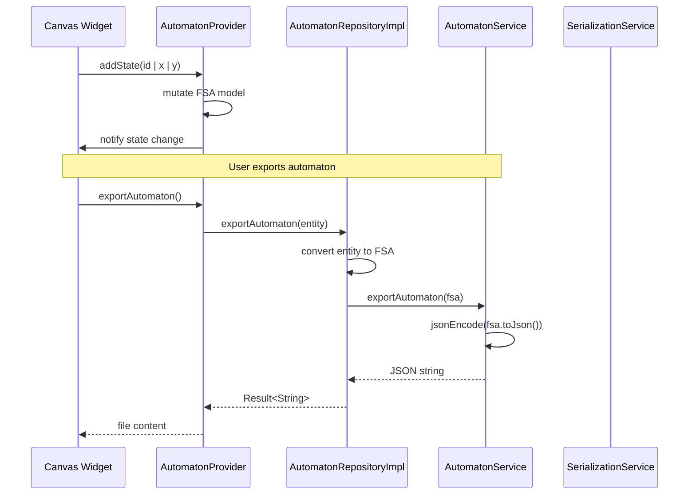

**Conversion Chain**:

1. **UI → Provider**: Canvas operations modify `FSA` directly via `AutomatonProvider`
2. **Provider → Repository**: Export converts `FSA` to `AutomatonEntity`
3. **Repository → Service**: Entity converts to `FSA` (again) or directly to request
4. **Service → External**: Serialization to JFLAP/JSON formats

**Why Multiple Conversions?**

* `FSA` (Core): Rich domain model with validation, algorithms
* `AutomatonEntity` (Core): Clean interface for repositories
* `CreateAutomatonRequest` (Data): Service layer request format
* DTOs (Data): Wire format for serialization

**Sources**: [lib/presentation/providers/automaton_provider.dart L115-L121](https://github.com/ThalesMMS/JFlutter/blob/32e808b4/lib/presentation/providers/automaton_provider.dart#L115-L121)

 [lib/data/repositories/automaton_repository_impl.dart L89-L101](https://github.com/ThalesMMS/JFlutter/blob/32e808b4/lib/data/repositories/automaton_repository_impl.dart#L89-L101)

 [lib/data/services/automaton_service.dart L212-L219](https://github.com/ThalesMMS/JFlutter/blob/32e808b4/lib/data/services/automaton_service.dart#L212-L219)

### Examples Loading Flow

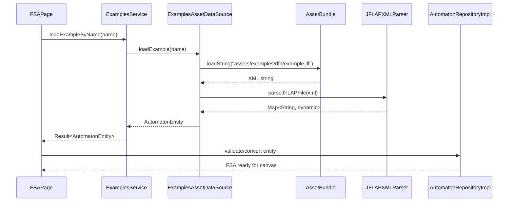

**Example Metadata**: [lib/data/data_sources/examples_asset_data_source.dart](https://github.com/ThalesMMS/JFlutter/blob/32e808b4/lib/data/data_sources/examples_asset_data_source.dart)

```
class ExampleEntity {  String name;  String description;  String category;  String subcategory;  DifficultyLevel difficultyLevel;  List<String> tags;  ComplexityLevel estimatedComplexity;  AutomatonEntity? automaton; // loaded lazily}
```

**Categories**:

* `ExampleCategory.dfa` → "DFA" → "Deterministic Finite Automaton"
* `ExampleCategory.nfa` → "NFA" → "Nondeterministic Finite Automaton"
* `ExampleCategory.cfg` → "CFG" → "Context-Free Grammar"
* `ExampleCategory.pda` → "PDA" → "Pushdown Automaton"
* `ExampleCategory.tm` → "TM" → "Turing Machine"

**Sources**: [lib/data/data_sources/examples_asset_data_source.dart](https://github.com/ThalesMMS/JFlutter/blob/32e808b4/lib/data/data_sources/examples_asset_data_source.dart)

 [lib/data/services/examples_service.dart](https://github.com/ThalesMMS/JFlutter/blob/32e808b4/lib/data/services/examples_service.dart)

 [test/integration/io/examples_roundtrip_test.dart L94-L273](https://github.com/ThalesMMS/JFlutter/blob/32e808b4/test/integration/io/examples_roundtrip_test.dart#L94-L273)

---

## File I/O System

### Export Pipeline

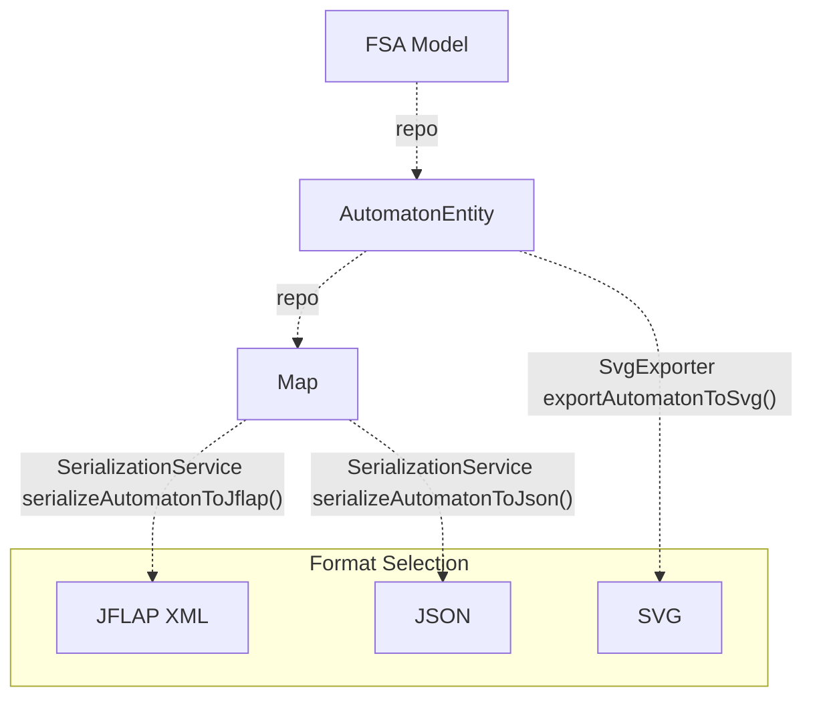

**Export Methods**:

1. **JFLAP**: [lib/data/services/serialization_service.dart L18-L103](https://github.com/ThalesMMS/JFlutter/blob/32e808b4/lib/data/services/serialization_service.dart#L18-L103)  - XML format for JFLAP tool compatibility
2. **JSON**: [lib/data/services/serialization_service.dart L204-L233](https://github.com/ThalesMMS/JFlutter/blob/32e808b4/lib/data/services/serialization_service.dart#L204-L233)  - Native format with full fidelity
3. **SVG**: [lib/presentation/widgets/export/svg_exporter.dart](https://github.com/ThalesMMS/JFlutter/blob/32e808b4/lib/presentation/widgets/export/svg_exporter.dart)  - Visual representation (not in Data Layer, but uses entities)

**File Operations Panel**: [lib/presentation/widgets/file_operations_panel.dart](https://github.com/ThalesMMS/JFlutter/blob/32e808b4/lib/presentation/widgets/file_operations_panel.dart)

 provides UI for:

* Import from JFLAP/JSON
* Export to JFLAP/JSON/SVG
* Platform-specific file pickers

**Sources**: [lib/data/services/serialization_service.dart L1-L308](https://github.com/ThalesMMS/JFlutter/blob/32e808b4/lib/data/services/serialization_service.dart#L1-L308)

 [test/integration/io/interoperability_roundtrip_test.dart L531-L651](https://github.com/ThalesMMS/JFlutter/blob/32e808b4/test/integration/io/interoperability_roundtrip_test.dart#L531-L651)

### Import Pipeline

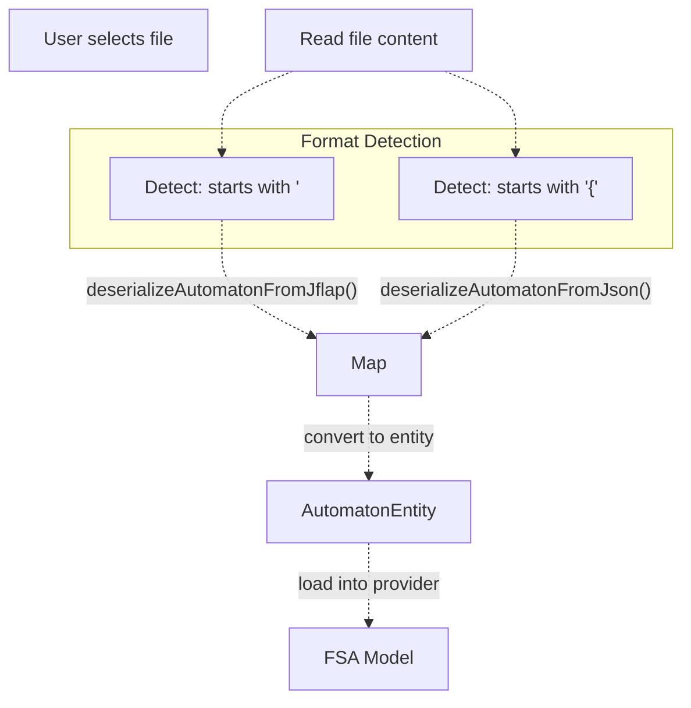

**Format Detection**: Simple heuristic based on file content prefix

* XML: Starts with `<?xml`
* JSON: Starts with `{`

**Error Handling**: Both deserializers return `Result<Map<String, dynamic>>` with descriptive error messages on parse failure

**Sources**: [lib/data/services/serialization_service.dart L106-L256](https://github.com/ThalesMMS/JFlutter/blob/32e808b4/lib/data/services/serialization_service.dart#L106-L256)

 [test/integration/io/interoperability_roundtrip_test.dart L192-L248](https://github.com/ThalesMMS/JFlutter/blob/32e808b4/test/integration/io/interoperability_roundtrip_test.dart#L192-L248)

---

## Testing Strategy

### Unit Tests

Data layer services have isolated unit tests:

* `AutomatonService`: CRUD operations, validation
* `SerializationService`: Format conversions, round-trips

### Integration Tests

Comprehensive round-trip testing validates data integrity:

**Interoperability Tests**: [test/integration/io/interoperability_roundtrip_test.dart](https://github.com/ThalesMMS/JFlutter/blob/32e808b4/test/integration/io/interoperability_roundtrip_test.dart)

* JFF round-trips (serialize → deserialize → compare)
* JSON round-trips
* Cross-format conversions (JFF → JSON → JFF)
* Epsilon alias normalization verification
* Malformed input handling
* Performance benchmarks (large automata)

**Examples Tests**: [test/integration/io/examples_roundtrip_test.dart](https://github.com/ThalesMMS/JFlutter/blob/32e808b4/test/integration/io/examples_roundtrip_test.dart)

* Asset loading from bundle
* Example metadata validation
* JFLAP XML parsing from embedded examples
* SVG export structure validation
* Serialization of all example types (DFA, NFA, CFG, PDA, TM)

**Test Patterns**:

```
test('JFF round-trip preserves automaton structure', () {  final original = _createTestDFA();  final data = _convertEntityToData(original);    // Serialize to JFF  final jffXml = serializationService.serializeAutomatonToJflap(data);    // Deserialize back  final result = JFLAPXMLParser.parseJFLAPFile(jffXml);  expect(result.isSuccess, true);    // Validate preservation  final parsed = result.data!;  expect(parsed['states'], isNotNull);  expect(parsed['transitions'], isNotNull);});
```

**Coverage Focus**:

* Data structure preservation across formats
* Edge cases (empty automatons, single states, no transitions)
* Symbol normalization (epsilon variants)
* Performance with large automatons (>100 states)

**Sources**: [test/integration/io/interoperability_roundtrip_test.dart L1-L1373](https://github.com/ThalesMMS/JFlutter/blob/32e808b4/test/integration/io/interoperability_roundtrip_test.dart#L1-L1373)

 [test/integration/io/examples_roundtrip_test.dart L1-L871](https://github.com/ThalesMMS/JFlutter/blob/32e808b4/test/integration/io/examples_roundtrip_test.dart#L1-L871)

---

## Known Limitations and Design Decisions

### In-Memory Only Storage

**Decision**: No persistent database (SQLite, Hive, etc.)
**Rationale**:

* Simplifies mobile/web deployment
* Eliminates schema migration complexity
* Forces explicit export/import workflow (educational benefit)

**Workaround**: Users export to JFLAP/JSON files for persistence

### Transition Key Format

**Decision**: Flat map with composite keys `"fromStateId|symbol"`
**Example**: `{"q0|a": ["q1", "q2"], "q0|b": ["q3"]}`

**Pros**:

* Easy to serialize to JSON
* Simple lookup for simulation

**Cons**:

* String manipulation required for queries
* Symbol cannot contain `|` character
* Less type-safe than nested structures

**Alternative Not Chosen**: Nested map `{fromId: {symbol: [toIds]}}`

**Sources**: [lib/data/repositories/automaton_repository_impl.dart L189-L206](https://github.com/ThalesMMS/JFlutter/blob/32e808b4/lib/data/repositories/automaton_repository_impl.dart#L189-L206)

 [lib/core/entities/automaton_entity.dart L22](https://github.com/ThalesMMS/JFlutter/blob/32e808b4/lib/core/entities/automaton_entity.dart#L22-L22)

### Epsilon Symbol Normalization

**Decision**: Canonicalize all epsilon variants to `ε` (U+03B5)
**Handled Variants**: `ε`, `λ`, `lambda`, `vazio`, empty string

**Implementation**: [lib/core/utils/epsilon_utils.dart](https://github.com/ThalesMMS/JFlutter/blob/32e808b4/lib/core/utils/epsilon_utils.dart)

```
String normalizeToEpsilon(String? symbol) {  if (isEpsilonSymbol(symbol)) return kEpsilonSymbol;  return symbol?.trim() ?? '';}bool isEpsilonSymbol(String? symbol) {  const variants = ['ε', 'λ', 'lambda', 'Λ', 'Lambda', '', 'vazio'];  return variants.contains(symbol?.trim());}
```

**Rationale**: Ensures JFLAP compatibility and internal consistency

**Sources**: [lib/core/utils/epsilon_utils.dart](https://github.com/ThalesMMS/JFlutter/blob/32e808b4/lib/core/utils/epsilon_utils.dart)

 [lib/data/services/serialization_service.dart L199-L201](https://github.com/ThalesMMS/JFlutter/blob/32e808b4/lib/data/services/serialization_service.dart#L199-L201)

 [test/integration/io/interoperability_roundtrip_test.dart L138-L190](https://github.com/ThalesMMS/JFlutter/blob/32e808b4/test/integration/io/interoperability_roundtrip_test.dart#L138-L190)

### Trace History Cap

**Decision**: Store maximum 50 simulation traces in `SharedPreferences`
**Implementation**: [lib/data/services/trace_persistence_service.dart](https://github.com/ThalesMMS/JFlutter/blob/32e808b4/lib/data/services/trace_persistence_service.dart)

**Rationale**:

* Prevents unbounded storage growth
* Maintains reasonable performance on mobile
* 50 traces sufficient for learning review

**Automatic Pruning**: Oldest traces removed when limit exceeded

**Sources**: [lib/data/services/trace_persistence_service.dart](https://github.com/ThalesMMS/JFlutter/blob/32e808b4/lib/data/services/trace_persistence_service.dart)


### On this page

* [Data Layer](#2.3-data-layer)
* [Architecture Overview](#2.3-architecture-overview)
* [Repository Layer](#2.3-repository-layer)
* [AutomatonRepositoryImpl](#2.3-automatonrepositoryimpl)
* [ExamplesRepositoryImpl](#2.3-examplesrepositoryimpl)
* [Additional Repositories](#2.3-additional-repositories)
* [Services](#2.3-services)
* [AutomatonService](#2.3-automatonservice)
* [SerializationService](#2.3-serializationservice)
* [Persistence Strategy](#2.3-persistence-strategy)
* [In-Memory Storage](#2.3-in-memory-storage)
* [Trace Persistence](#2.3-trace-persistence)
* [SharedPreferences Usage](#2.3-sharedpreferences-usage)
* [Data Models and DTOs](#2.3-data-models-and-dtos)
* [AutomatonDto](#2.3-automatondto)
* [Service Request/Response Models](#2.3-service-requestresponse-models)
* [Dependency Injection](#2.3-dependency-injection)
* [Registration Hierarchy](#2.3-registration-hierarchy)
* [Integration with Core and Presentation Layers](#2.3-integration-with-core-and-presentation-layers)
* [Data Flow: User Action to Persistence](#2.3-data-flow-user-action-to-persistence)
* [Examples Loading Flow](#2.3-examples-loading-flow)
* [File I/O System](#2.3-file-io-system)
* [Export Pipeline](#2.3-export-pipeline)
* [Import Pipeline](#2.3-import-pipeline)
* [Testing Strategy](#2.3-testing-strategy)
* [Unit Tests](#2.3-unit-tests)
* [Integration Tests](#2.3-integration-tests)
* [Known Limitations and Design Decisions](#2.3-known-limitations-and-design-decisions)
* [In-Memory Only Storage](#2.3-in-memory-only-storage)
* [Transition Key Format](#2.3-transition-key-format)
* [Epsilon Symbol Normalization](#2.3-epsilon-symbol-normalization)
* [Trace History Cap](#2.3-trace-history-cap)

Ask Devin about JFlutter