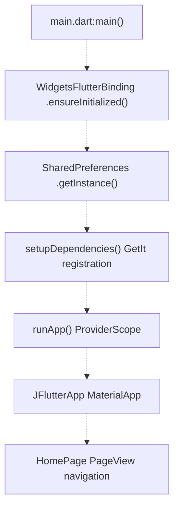
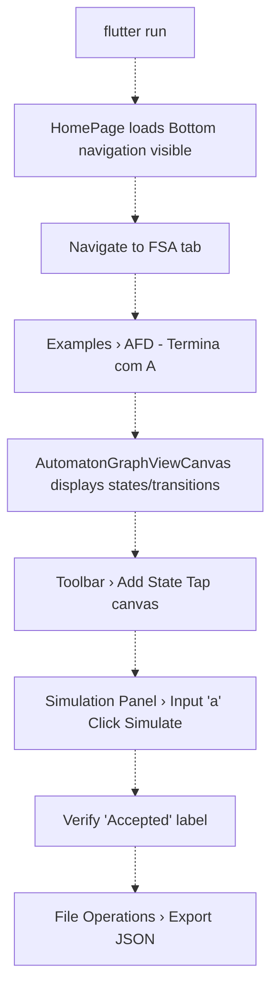
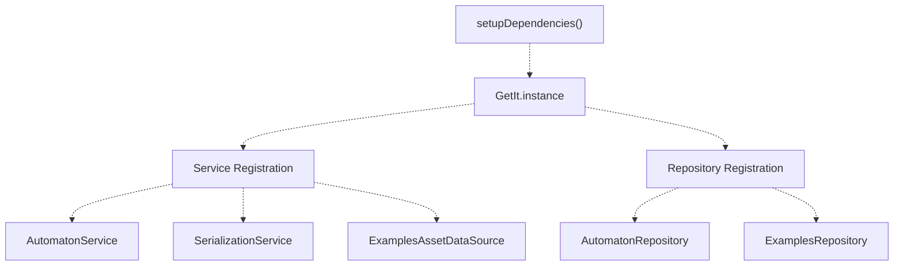

# Getting Started

> **Relevant source files**
> * [README.md](https://github.com/ThalesMMS/JFlutter/blob/32e808b4/README.md)
> * [USER_GUIDE](https://github.com/ThalesMMS/JFlutter/blob/32e808b4/USER_GUIDE)
> * [docs/canvas_bridge.md](https://github.com/ThalesMMS/JFlutter/blob/32e808b4/docs/canvas_bridge.md)
> * [integration_test/app_simulation_test.dart](https://github.com/ThalesMMS/JFlutter/blob/32e808b4/integration_test/app_simulation_test.dart)
> * [integration_test/driver.dart](https://github.com/ThalesMMS/JFlutter/blob/32e808b4/integration_test/driver.dart)
> * [pubspec.lock](https://github.com/ThalesMMS/JFlutter/blob/32e808b4/pubspec.lock)
> * [pubspec.yaml](https://github.com/ThalesMMS/JFlutter/blob/32e808b4/pubspec.yaml)

This page covers the installation, configuration, and initial execution of JFlutter. It provides step-by-step instructions for setting up a development environment, installing dependencies, running the application on different platforms, and verifying the setup through basic testing. For information about the overall architecture, see [JFlutter Overview](1%20JFlutter-Overview.md). For platform-specific UI components and responsive design patterns, see [Responsive Layout System](8b%20Responsive-Layout-System.md).

---

## Prerequisites

JFlutter requires the following tools and runtime versions:

| Requirement | Version | Purpose |
| --- | --- | --- |
| Flutter SDK | ≥3.24.0 | Framework runtime |
| Dart SDK | ≥3.8.0 | Language toolchain |
| IDE | Android Studio or VS Code | Recommended development environment |
| Git | Any recent version | Repository cloning and graphview fork dependency |

**Sources:** README.md

 [pubspec.yaml L26-L28](https://github.com/ThalesMMS/JFlutter/blob/32e808b4/pubspec.yaml#L26-L28)

---

## Project Dependencies

The application relies on a curated set of packages organized by function:

### Core Dependencies

```mermaid
flowchart TD

App["JFlutter Application"]
StateManagement["State Management"]
Riverpod["riverpod: 2.5.1"]
FlutterRiverpod["flutter_riverpod: 2.5.1"]
GetIt["get_it: 8.0.0"]
Provider["provider: 6.1.2"]
Canvas["Canvas & Visualization"]
GraphView["graphview (git fork)"]
VectorMath["vector_math: 2.1.4"]
Persistence["Data Persistence"]
SharedPrefs["shared_preferences: 2.3.2"]
PathProvider["path_provider: 2.1.4"]
IO["File I/O"]
FilePicker["file_picker: 8.0.0+1"]
SharePlus["share_plus: 12.0.0"]
XML["xml: 6.5.0"]
Parsing["Parsing & Utilities"]
PetitParser["petitparser: 7.0.1"]
Collection["collection: 1.18.0"]

App -.-> StateManagement
App -.-> Canvas
App -.-> Persistence
App -.-> IO
App -.-> Parsing
StateManagement -.-> Riverpod
StateManagement -.-> FlutterRiverpod
StateManagement -.-> GetIt
StateManagement -.-> Provider
Canvas -.-> GraphView
Canvas -.-> VectorMath
Persistence -.-> SharedPrefs
Persistence -.-> PathProvider
IO -.-> FilePicker
IO -.-> SharePlus
IO -.-> XML
Parsing -.-> PetitParser
Parsing -.-> Collection
```



**GraphView Fork**: The project depends on a custom fork at `https://github.com/ThalesMMS/graphview.git` (branch: `loop-edge-renderer`) that implements deterministic loop-edge rendering for self-transitions in automata.

**Sources:** [pubspec.yaml L36-L85](https://github.com/ThalesMMS/JFlutter/blob/32e808b4/pubspec.yaml#L36-L85)

 [pubspec.lock L373-L381](https://github.com/ThalesMMS/JFlutter/blob/32e808b4/pubspec.lock#L373-L381)

 [docs/canvas_bridge.md L5](https://github.com/ThalesMMS/JFlutter/blob/32e808b4/docs/canvas_bridge.md#L5-L5)

---

## Installation

### Clone Repository

```
git clone https://github.com/ThalesMMS/jflutter.gitcd jflutter
```

### Install Dependencies

```
flutter pub get
```

This command resolves all packages declared in `pubspec.yaml`, including the graphview git dependency. The Flutter toolchain will clone the fork and check out the `loop-edge-renderer` branch automatically.

**Sources:** [Project overview and setup](https://github.com/ThalesMMS/JFlutter/blob/32e808b4/README.md#L103-L108)

 [pubspec.yaml L54-L58](https://github.com/ThalesMMS/JFlutter/blob/32e808b4/pubspec.yaml#L54-L58)

---

## Running the Application

### Development Mode

```
flutter run
```

This launches the app in debug mode with hot reload enabled. The application entry point is `lib/main.dart`, which initializes:

1. `WidgetsFlutterBinding` for Flutter framework setup
2. `SharedPreferences` for persistence layer initialization
3. Dependency injection via `setupDependencies()` (GetIt registration)
4. Riverpod `ProviderScope` wrapping the root `JFlutterApp` widget



**Sources:** [Project overview and setup](https://github.com/ThalesMMS/JFlutter/blob/32e808b4/README.md#L110-L111)

 [integration_test/app_simulation_test.dart L16](https://github.com/ThalesMMS/JFlutter/blob/32e808b4/integration_test/app_simulation_test.dart#L16-L16)

### Platform-Specific Execution

| Platform | Command | Notes |
| --- | --- | --- |
| Android | `flutter run -d <device-id>` | Requires Android SDK and connected device/emulator |
| iOS | `flutter run -d <device-id>` | Requires Xcode and iOS Simulator or physical device |
| Web | `flutter run -d chrome` | Launches in Chrome browser |
| Windows | `flutter run -d windows` | Desktop build |
| macOS | `flutter run -d macos` | Desktop build |
| Linux | `flutter run -d linux` | Desktop build |

List available devices:

```
flutter devices
```

**Sources:** [Project overview and setup](https://github.com/ThalesMMS/JFlutter/blob/32e808b4/README.md#L141-L145)

---

## Building for Release

### Android Release Build

Android release builds use the `dev.jflutter.app` application ID and require keystore configuration.

#### Keystore Setup

The build process expects a properties file at `android/key.properties` containing:

```
storePassword=<JFLUTTER_KEYSTORE_PASSWORD>keyPassword=<JFLUTTER_KEY_PASSWORD>keyAlias=<JFLUTTER_KEY_ALIAS>storeFile=<JFLUTTER_KEYSTORE_PATH>
```

**Automated Generation Script:**

```
export JFLUTTER_KEYSTORE_PASSWORD="your_store_password"export JFLUTTER_KEY_ALIAS="your_key_alias"export JFLUTTER_KEY_PASSWORD="your_key_password"export JFLUTTER_KEYSTORE_PATH="keystores/jflutter-release.jks"  # Optional, defaults to keystores/jflutter-release.jks./android/scripts/create_key_properties.sh
```

The script `create_key_properties.sh` reads environment variables and generates `android/key.properties` automatically.

**Sources:** [Project overview and setup](https://github.com/ThalesMMS/JFlutter/blob/32e808b4/README.md#L114-L128)

#### CI/CD Workflow Example

For GitHub Actions or similar CI systems:

```
# Recreate keystore from base64-encoded secretmkdir -p android/keystoresecho "$JFLUTTER_KEYSTORE_BASE64" | base64 --decode > android/keystores/jflutter-release.jks# Export credentialsexport JFLUTTER_KEYSTORE_PASSWORD="$JFLUTTER_KEYSTORE_PASSWORD"export JFLUTTER_KEY_ALIAS="$JFLUTTER_KEY_ALIAS"export JFLUTTER_KEY_PASSWORD="$JFLUTTER_KEY_PASSWORD"# Generate key.properties./android/scripts/create_key_properties.sh# Build release APKflutter build apk --release
```

**Sources:** [Project overview and setup](https://github.com/ThalesMMS/JFlutter/blob/32e808b4/README.md#L129-L139)

#### Build Commands

```
# Android APKflutter build apk --release# Android App Bundle (for Play Store)flutter build appbundle --release# iOS (requires macOS)flutter build ios --release# Webflutter build web --release# Desktop (example for Windows)flutter build windows --release
```

**Sources:** [Project overview and setup](https://github.com/ThalesMMS/JFlutter/blob/32e808b4/README.md#L141-L145)

---

## Asset Configuration

The application bundles offline examples as assets, declared in `pubspec.yaml`:

```yaml
flutter:  assets:    # Finite automata examples    - jflutter_js/examples/afd_binary_divisible_by_3.json    - jflutter_js/examples/afd_ends_with_a.json    - jflutter_js/examples/afd_parity_AB.json    - jflutter_js/examples/afn_lambda_a_or_ab.json        # Context-free grammar examples    - jflutter_js/examples/glc_balanced_parentheses.json    - jflutter_js/examples/glc_palindrome.json        # Pushdown automaton example    - jflutter_js/examples/apda_palindrome.json        # Turing machine example    - jflutter_js/examples/tm_binary_to_unary.json
```

These files are loaded by `ExamplesAssetDataSource` and made available through the Examples Library feature.

**Sources:** [pubspec.yaml L117-L130](https://github.com/ThalesMMS/JFlutter/blob/32e808b4/pubspec.yaml#L117-L130)

 [README.md L36-L37](https://github.com/ThalesMMS/JFlutter/blob/32e808b4/README.md#L36-L37)

---

## Verification

### Running Tests

```
# Run all testsflutter test# Run specific test suitesflutter test test/unit/                    # Algorithm validation testsflutter test test/features/                # Canvas system testsflutter test test/integration/             # Round-trip and I/O testsflutter test test/widget/                  # Widget harness tests# Generate coverage reportflutter test --coveragelcov --list coverage/lcov.info# Static analysisflutter analyze
```

**Test Suite Structure:**

| Directory | Purpose | Example |
| --- | --- | --- |
| `test/unit/` | Algorithm validation (DFA/NFA conversions, regex, grammar) | NFA→DFA subset construction |
| `test/features/` | Canvas controllers, mappers, models | `graphview_canvas_controller_test.dart` |
| `test/integration/` | JFLAP XML/JSON round-trips, example validation | `io/` subdirectory |
| `test/widget/` | UI component behavior | Presentation layer widgets |

**Sources:** [Project overview and setup](https://github.com/ThalesMMS/JFlutter/blob/32e808b4/README.md#L169-L202)

### Integration Test

```
flutter test integration_test/app_simulation_test.dart
```

This test:

1. Launches the full application
2. Loads an example automaton ("AFD - Termina com A")
3. Replaces the current automaton via `automatonProvider`
4. Opens the simulation panel
5. Executes simulations with inputs "ba" (accepted) and "bb" (rejected)

**Sources:** [integration_test/app_simulation_test.dart L1-L71](https://github.com/ThalesMMS/JFlutter/blob/32e808b4/integration_test/app_simulation_test.dart#L1-L71)

### Manual Verification

After installation, confirm the setup by:

1. **Launch Application:** Run `flutter run` and verify the HomePage appears with navigation tabs
2. **Load Example:** Navigate to FSA page, open Examples menu, load "AFD - Termina com A"
3. **Canvas Interaction:** Add a state using the toolbar, drag it to reposition, verify GraphView rendering
4. **Simulation:** Enter input string "a", click Simulate, confirm "Accepted" result
5. **Export:** Test File Operations panel, export to JSON, verify output file



**Sources:** [Project overview and setup](https://github.com/ThalesMMS/JFlutter/blob/32e808b4/README.md#L147-L165)

 [USER_GUIDE L63-L70](https://github.com/ThalesMMS/JFlutter/blob/32e808b4/USER_GUIDE#L63-L70)

---

## Project Structure Overview

The codebase follows clean architecture with layer separation:

```markdown
lib/
├── main.dart                        # Entry point, DI setup, ProviderScope
├── app.dart                         # Root MaterialApp widget, theme config
├── core/                            # Domain layer
│   ├── algorithms/                  # FSA, PDA, TM algorithms
│   ├── entities/                    # Domain models (AutomatonEntity, GrammarEntity)
│   ├── services/                    # Core services (simulation, diagnostics)
│   └── repositories/                # Repository contracts
├── data/                            # Data layer
│   ├── data_sources/                # Asset loading, file system access
│   ├── models/                      # DTOs, serialization models
│   ├── repositories/                # Repository implementations
│   ├── services/                    # SerializationService, persistence
│   └── storage/                     # SharedPreferences adapters
├── features/                        # Cross-cutting features
│   ├── canvas/graphview/            # Canvas controllers, mappers, channels
│   └── layout/                      # Layout helpers
├── injection/                       # GetIt service registration
│   └── dependency_injection.dart
└── presentation/                    # UI layer
    ├── pages/                       # Workspace pages (FSA, TM, PDA, Grammar)
    ├── providers/                   # Riverpod state notifiers
    ├── theme/                       # Material 3 theme
    └── widgets/                     # Reusable UI components
```

**Sources:** README.md

---

## Dependency Injection Setup

The `setupDependencies()` function in `lib/injection/dependency_injection.dart` registers services with GetIt:



**Usage Example:**

```
// Access registered servicefinal examplesRepo = GetIt.instance<ExamplesRepository>();final result = await examplesRepo.loadExample('AFD - Termina com A');
```

**Sources:** README.md

 [integration_test/app_simulation_test.dart L33-L44](https://github.com/ThalesMMS/JFlutter/blob/32e808b4/integration_test/app_simulation_test.dart#L33-L44)

---

## Next Steps

After completing setup and verification:

* **Explore Workspace Pages:** See [Automaton Workspace Pages](5%20Automaton-Workspace-Pages.md) for FSA, PDA, TM, and Grammar editors
* **Canvas Editing:** Review [Canvas System](4%20Canvas-System.md) for interaction patterns and customization
* **State Management:** Understand [State Management](6%20State-Management.md) for Riverpod provider patterns
* **Import/Export:** Learn [Import and Export System](9%20Import-and-Export-System.md) for JFLAP interoperability
* **Examples Library:** See [Examples Library](10a%20Examples-Library.md) for embedded learning content
* **Testing Strategy:** Review [Testing](12%20Testing.md) for test suite organization

**Sources:** [Project overview and setup](https://github.com/ThalesMMS/JFlutter/blob/32e808b4/README.md#L232-L268)


### On this page

* [Getting Started](3%20Getting-Started.md)
* [Prerequisites](3%20Getting-Started.md)
* [Project Dependencies](3%20Getting-Started.md)
* [Core Dependencies](3%20Getting-Started.md)
* [Installation](3%20Getting-Started.md)
* [Clone Repository](3%20Getting-Started.md)
* [Install Dependencies](3%20Getting-Started.md)
* [Running the Application](3%20Getting-Started.md)
* [Development Mode](3%20Getting-Started.md)
* [Platform-Specific Execution](3%20Getting-Started.md)
* [Building for Release](3%20Getting-Started.md)
* [Android Release Build](3%20Getting-Started.md)
* [Asset Configuration](3%20Getting-Started.md)
* [Verification](3%20Getting-Started.md)
* [Running Tests](3%20Getting-Started.md)
* [Integration Test](3%20Getting-Started.md)
* [Manual Verification](3%20Getting-Started.md)
* [Project Structure Overview](3%20Getting-Started.md)
* [Dependency Injection Setup](3%20Getting-Started.md)
* [Next Steps](3%20Getting-Started.md)

Ask Devin about JFlutter