# Canvas System

> **Relevant source files**
> * [lib/features/canvas/graphview/base_graphview_canvas_controller.dart](https://github.com/ThalesMMS/JFlutter/blob/32e808b4/lib/features/canvas/graphview/base_graphview_canvas_controller.dart)
> * [lib/features/canvas/graphview/graphview_canvas_controller.dart](https://github.com/ThalesMMS/JFlutter/blob/32e808b4/lib/features/canvas/graphview/graphview_canvas_controller.dart)
> * [lib/features/canvas/graphview/graphview_pda_canvas_controller.dart](https://github.com/ThalesMMS/JFlutter/blob/32e808b4/lib/features/canvas/graphview/graphview_pda_canvas_controller.dart)
> * [lib/features/canvas/graphview/graphview_pda_mapper.dart](https://github.com/ThalesMMS/JFlutter/blob/32e808b4/lib/features/canvas/graphview/graphview_pda_mapper.dart)
> * [lib/features/canvas/graphview/graphview_tm_canvas_controller.dart](https://github.com/ThalesMMS/JFlutter/blob/32e808b4/lib/features/canvas/graphview/graphview_tm_canvas_controller.dart)
> * [lib/features/canvas/graphview/graphview_tm_mapper.dart](https://github.com/ThalesMMS/JFlutter/blob/32e808b4/lib/features/canvas/graphview/graphview_tm_mapper.dart)
> * [lib/features/canvas/graphview/graphview_viewport_highlight_mixin.dart](https://github.com/ThalesMMS/JFlutter/blob/32e808b4/lib/features/canvas/graphview/graphview_viewport_highlight_mixin.dart)
> * [lib/presentation/widgets/automaton_graphview_canvas.dart](https://github.com/ThalesMMS/JFlutter/blob/32e808b4/lib/presentation/widgets/automaton_graphview_canvas.dart)
> * [lib/presentation/widgets/graphview_canvas_toolbar.dart](https://github.com/ThalesMMS/JFlutter/blob/32e808b4/lib/presentation/widgets/graphview_canvas_toolbar.dart)
> * [test/widget/presentation/automaton_graphview_canvas_test.dart](https://github.com/ThalesMMS/JFlutter/blob/32e808b4/test/widget/presentation/automaton_graphview_canvas_test.dart)
> * [test/widget/presentation/graphview_canvas_toolbar_test.dart](https://github.com/ThalesMMS/JFlutter/blob/32e808b4/test/widget/presentation/graphview_canvas_toolbar_test.dart)
> * [test/widget/presentation/graphview_label_field_editor_test.dart](https://github.com/ThalesMMS/JFlutter/blob/32e808b4/test/widget/presentation/graphview_label_field_editor_test.dart)

## Purpose and Scope

The Canvas System is the core interactive visualization subsystem in JFlutter, responsible for rendering and editing automata (FSA, PDA, TM) using the GraphView library. It provides a unified canvas implementation that handles node positioning, edge routing, gesture interaction, tool management, and bidirectional synchronization with Riverpod state providers.

This document covers the canvas widget architecture, controller hierarchy, rendering pipeline, and interaction patterns. For information about specific automaton editor implementations that use this canvas system, see [Automaton Editors](#5). For state management patterns used by the canvas, see [State Management](#6).

**Sources:** [lib/presentation/widgets/automaton_graphview_canvas.dart L1-L14](https://github.com/ThalesMMS/JFlutter/blob/32e808b4/lib/presentation/widgets/automaton_graphview_canvas.dart#L1-L14)

---

## Canvas Architecture Overview

The canvas system is built around `AutomatonGraphViewCanvas`, a stateful widget that integrates the third-party GraphView library with JFlutter's automaton domain models. The architecture follows a controller pattern where specialized controllers manage the graph state and synchronize with domain providers.

### Core Components

| Component | Type | Responsibility |
| --- | --- | --- |
| `AutomatonGraphViewCanvas` | Widget | Main canvas widget, handles rendering and user interaction |
| `BaseGraphViewCanvasController<TDomain, TGraph>` | Abstract Controller | Base class defining graph manipulation operations |
| `GraphViewCanvasController` | FSA Controller | FSA-specific implementation with label-based transitions |
| `GraphViewPdaCanvasController` | PDA Controller | PDA-specific implementation with stack operations |
| `GraphViewTmCanvasController` | TM Controller | TM-specific implementation with tape operations |
| `AutomatonCanvasToolController` | Tool Manager | Manages active tool state (selection/addState/transition) |
| `GraphViewCanvasToolbar` | UI Component | Desktop and mobile toolbar for canvas commands |

```

```

**Sources:** [lib/presentation/widgets/automaton_graphview_canvas.dart L308-L333](https://github.com/ThalesMMS/JFlutter/blob/32e808b4/lib/presentation/widgets/automaton_graphview_canvas.dart#L308-L333)

 [lib/features/canvas/graphview/base_graphview_canvas_controller.dart](https://github.com/ThalesMMS/JFlutter/blob/32e808b4/lib/features/canvas/graphview/base_graphview_canvas_controller.dart)

 [lib/features/canvas/graphview/graphview_canvas_controller.dart](https://github.com/ThalesMMS/JFlutter/blob/32e808b4/lib/features/canvas/graphview/graphview_canvas_controller.dart)

 [lib/features/canvas/graphview/graphview_pda_canvas_controller.dart](https://github.com/ThalesMMS/JFlutter/blob/32e808b4/lib/features/canvas/graphview/graphview_pda_canvas_controller.dart)

---

## Canvas Widget Lifecycle

`AutomatonGraphViewCanvas` manages the complete lifecycle of the canvas, including controller initialization, synchronization scheduling, and highlight service integration.

### Initialization Process

The widget determines whether to create its own controller or use an externally provided one:

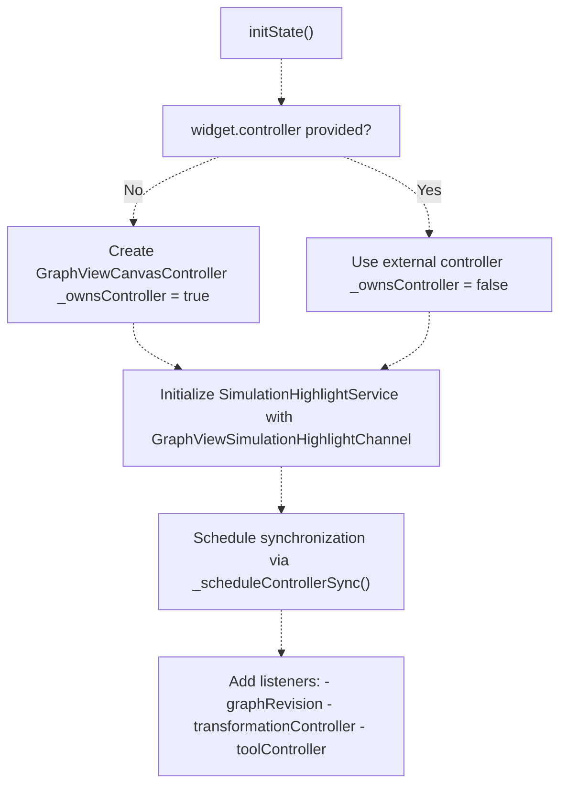

The canvas maintains ownership flags to ensure proper disposal of owned resources:

* `_ownsController`: true if canvas created the controller
* `_ownsToolController`: true if canvas created the tool controller

**Sources:** [lib/presentation/widgets/automaton_graphview_canvas.dart L387-L432](https://github.com/ThalesMMS/JFlutter/blob/32e808b4/lib/presentation/widgets/automaton_graphview_canvas.dart#L387-L432)

### Update and Synchronization

When the automaton model changes, synchronization is scheduled to update the graph:

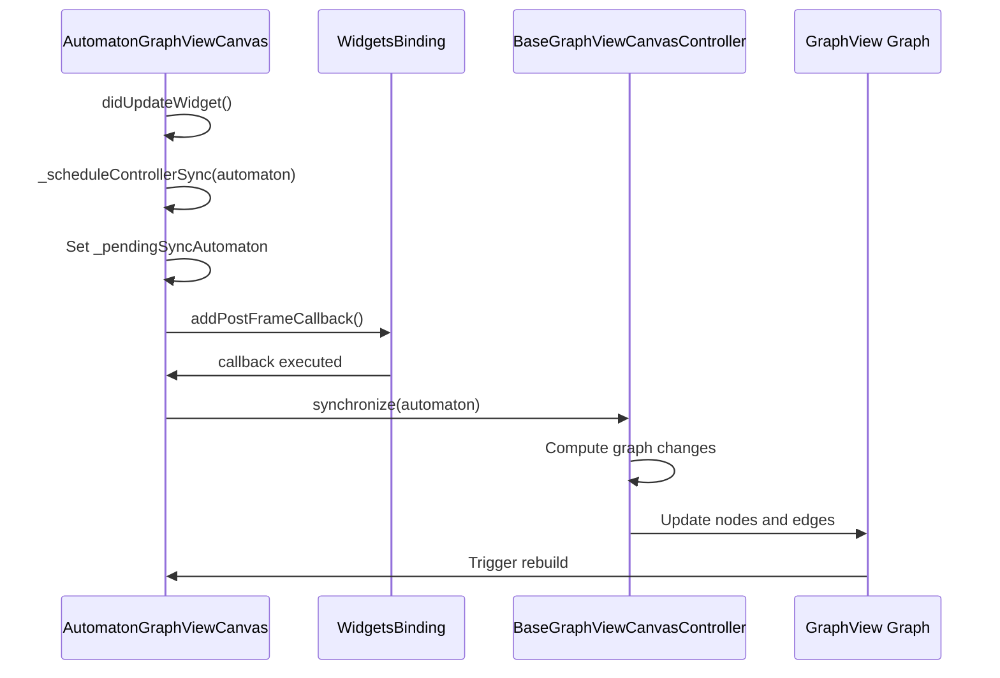

The synchronization is deferred to avoid redundant updates during rapid state changes:

**Sources:** [lib/presentation/widgets/automaton_graphview_canvas.dart L434-L505](https://github.com/ThalesMMS/JFlutter/blob/32e808b4/lib/presentation/widgets/automaton_graphview_canvas.dart#L434-L505)

 [lib/presentation/widgets/automaton_graphview_canvas.dart L576-L604](https://github.com/ThalesMMS/JFlutter/blob/32e808b4/lib/presentation/widgets/automaton_graphview_canvas.dart#L576-L604)

---

## Rendering Pipeline

The canvas uses GraphView's Sugiyama layout algorithm for automatic node positioning and edge routing. A custom algorithm wrapper (`_AutomatonGraphSugiyamaAlgorithm`) extends the base algorithm to integrate with the controller.

### Layout Configuration

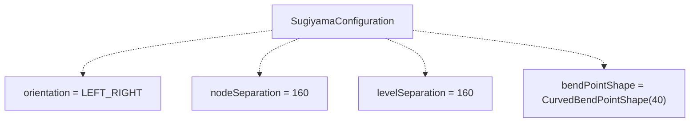

**Sources:** [lib/presentation/widgets/automaton_graphview_canvas.dart L606-L613](https://github.com/ThalesMMS/JFlutter/blob/32e808b4/lib/presentation/widgets/automaton_graphview_canvas.dart#L606-L613)

### Node and Edge Rendering

The canvas uses `GraphViewAllNodesBuilder` to render nodes and edges with custom painters:

| Visual Element | Rendering Mechanism | Customization |
| --- | --- | --- |
| State nodes | Circle with label | Initial states have incoming arrow |
| Accepting states | Double circle | Rendered with `AutomatonStatePainter` |
| Transitions | Curved or straight edges | Control points determine curvature |
| Transition labels | Positioned along edge | FSA: simple label, PDA: read/pop/push, TM: read/write/direction |
| Highlights | Overlay effects | Controlled by `SimulationHighlightService` |

**Sources:** [lib/features/canvas/graphview/graphview_all_nodes_builder.dart](https://github.com/ThalesMMS/JFlutter/blob/32e808b4/lib/features/canvas/graphview/graphview_all_nodes_builder.dart)

 [lib/presentation/widgets/automaton_graphview_canvas.dart L1163-L1394](https://github.com/ThalesMMS/JFlutter/blob/32e808b4/lib/presentation/widgets/automaton_graphview_canvas.dart#L1163-L1394)

### Viewport Transformations

The canvas provides viewport manipulation commands through the controller:

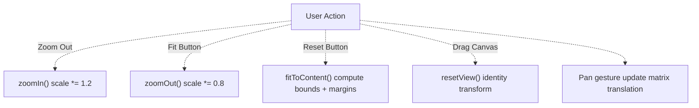

The transformations are managed by `TransformationController` from the `graphview` package.

**Sources:** [lib/presentation/widgets/automaton_graphview_canvas.dart L615-L629](https://github.com/ThalesMMS/JFlutter/blob/32e808b4/lib/presentation/widgets/automaton_graphview_canvas.dart#L615-L629)

---

## Canvas Controllers

Canvas controllers bridge the gap between domain models (FSA, PDA, TM) and GraphView's graph representation. They implement bidirectional synchronization and provide type-safe operations.

### Controller Hierarchy

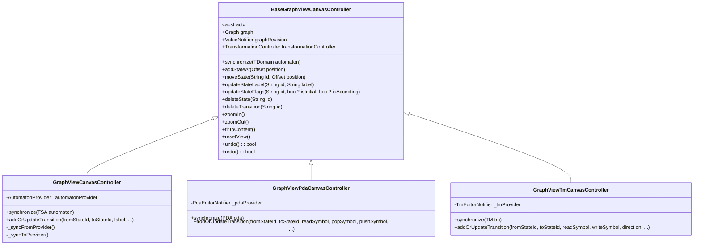

**Sources:** [lib/features/canvas/graphview/base_graphview_canvas_controller.dart](https://github.com/ThalesMMS/JFlutter/blob/32e808b4/lib/features/canvas/graphview/base_graphview_canvas_controller.dart)

 [lib/features/canvas/graphview/graphview_canvas_controller.dart](https://github.com/ThalesMMS/JFlutter/blob/32e808b4/lib/features/canvas/graphview/graphview_canvas_controller.dart)

 [lib/features/canvas/graphview/graphview_pda_canvas_controller.dart](https://github.com/ThalesMMS/JFlutter/blob/32e808b4/lib/features/canvas/graphview/graphview_pda_canvas_controller.dart)

### Synchronization Pattern

Controllers implement a bidirectional synchronization pattern:

1. **Provider → Controller:** `synchronize(automaton)` converts domain model to graph
2. **Controller → Provider:** Operations like `addStateAt()` update the provider, which then triggers re-synchronization

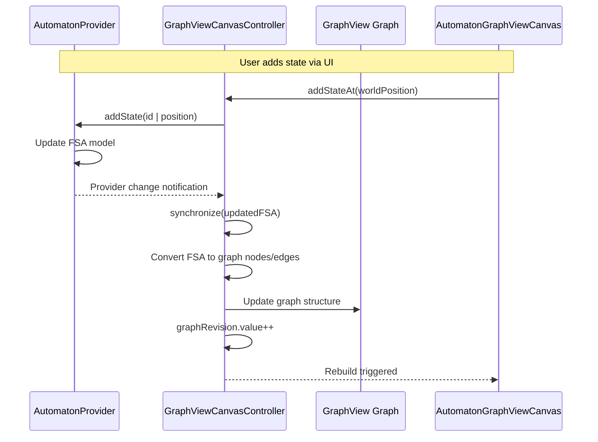

This pattern ensures the graph always reflects the current provider state, avoiding inconsistencies.

**Sources:** [lib/features/canvas/graphview/graphview_canvas_controller.dart](https://github.com/ThalesMMS/JFlutter/blob/32e808b4/lib/features/canvas/graphview/graphview_canvas_controller.dart)

 [lib/presentation/widgets/automaton_graphview_canvas.dart L422-L424](https://github.com/ThalesMMS/JFlutter/blob/32e808b4/lib/presentation/widgets/automaton_graphview_canvas.dart#L422-L424)

### Undo/Redo System

Controllers maintain a history stack for undo/redo operations:

| Property | Type | Description |
| --- | --- | --- |
| `_history` | `List<GraphViewCanvasSnapshot>` | Stack of previous graph states |
| `_historyIndex` | `int` | Current position in history stack |
| `canUndo` | `bool` | True if `_historyIndex > 0` |
| `canRedo` | `bool` | True if `_historyIndex < _history.length - 1` |

Each mutation operation (add/move/delete state or transition) saves a snapshot before applying changes.

**Sources:** [lib/features/canvas/graphview/base_graphview_canvas_controller.dart](https://github.com/ThalesMMS/JFlutter/blob/32e808b4/lib/features/canvas/graphview/base_graphview_canvas_controller.dart)

---

## Tool System and Interaction

The canvas supports three primary tools, managed by `AutomatonCanvasToolController`:

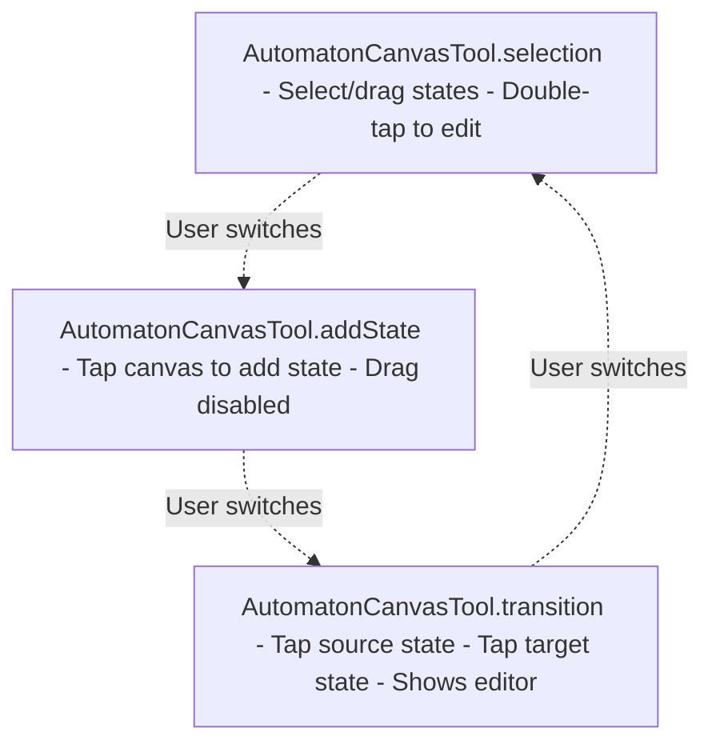

**Sources:** [lib/presentation/widgets/automaton_canvas_tool.dart](https://github.com/ThalesMMS/JFlutter/blob/32e808b4/lib/presentation/widgets/automaton_canvas_tool.dart)

 [lib/presentation/widgets/automaton_graphview_canvas.dart L339-L342](https://github.com/ThalesMMS/JFlutter/blob/32e808b4/lib/presentation/widgets/automaton_graphview_canvas.dart#L339-L342)

### Gesture Handling

The canvas employs a sophisticated gesture recognition system using `GestureArenaTeam` to coordinate between node dragging and canvas panning:

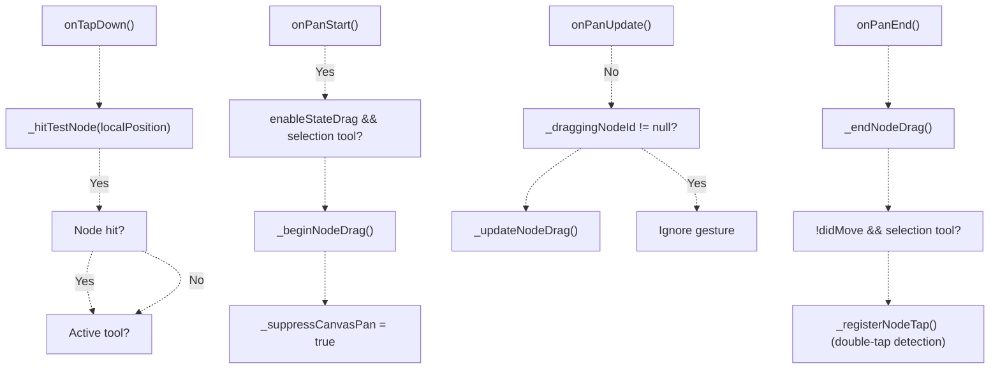

**Pan Suppression:** When dragging a node, `_suppressCanvasPan` is set to true to prevent the InteractiveViewer from panning the canvas simultaneously.

**Sources:** [lib/presentation/widgets/automaton_graphview_canvas.dart L358-L382](https://github.com/ThalesMMS/JFlutter/blob/32e808b4/lib/presentation/widgets/automaton_graphview_canvas.dart#L358-L382)

 [lib/presentation/widgets/automaton_graphview_canvas.dart L631-L663](https://github.com/ThalesMMS/JFlutter/blob/32e808b4/lib/presentation/widgets/automaton_graphview_canvas.dart#L631-L663)

 [lib/presentation/widgets/automaton_graphview_canvas.dart L781-L879](https://github.com/ThalesMMS/JFlutter/blob/32e808b4/lib/presentation/widgets/automaton_graphview_canvas.dart#L781-L879)

### State Editing Interaction

Double-tapping (or context-tapping) a state node opens a modal bottom sheet for editing:

| Field | Type | Effect |
| --- | --- | --- |
| Label text field | `TextField` | Updates state label |
| Initial state toggle | `SwitchListTile` | Marks state as initial |
| Final state toggle | `SwitchListTile` | Marks state as accepting |

Changes are applied immediately to the controller, which updates the provider.

**Sources:** [lib/presentation/widgets/automaton_graphview_canvas.dart L881-L962](https://github.com/ThalesMMS/JFlutter/blob/32e808b4/lib/presentation/widgets/automaton_graphview_canvas.dart#L881-L962)

---

## Transition Overlay System

The transition editing system uses a flexible overlay architecture that adapts to different automaton types (FSA, PDA, TM).

### Payload Types

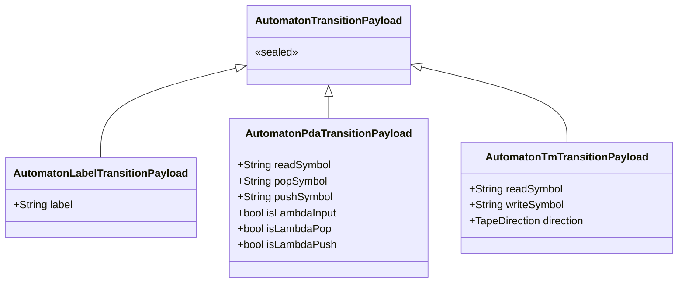

**Sources:** [lib/presentation/widgets/automaton_graphview_canvas.dart L52-L93](https://github.com/ThalesMMS/JFlutter/blob/32e808b4/lib/presentation/widgets/automaton_graphview_canvas.dart#L52-L93)

### Overlay Data Flow

When a transition is being edited, the following data structures coordinate the flow:

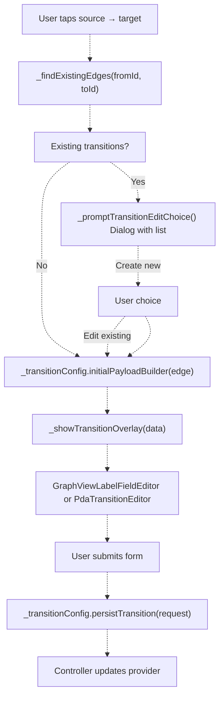

**Sources:** [lib/presentation/widgets/automaton_graphview_canvas.dart L964-L1072](https://github.com/ThalesMMS/JFlutter/blob/32e808b4/lib/presentation/widgets/automaton_graphview_canvas.dart#L964-L1072)

 [lib/presentation/widgets/automaton_graphview_canvas.dart L1074-L1120](https://github.com/ThalesMMS/JFlutter/blob/32e808b4/lib/presentation/widgets/automaton_graphview_canvas.dart#L1074-L1120)

### Customization System

The overlay system is configured through `AutomatonGraphViewCanvasCustomization`, which provides factory methods for each automaton type:

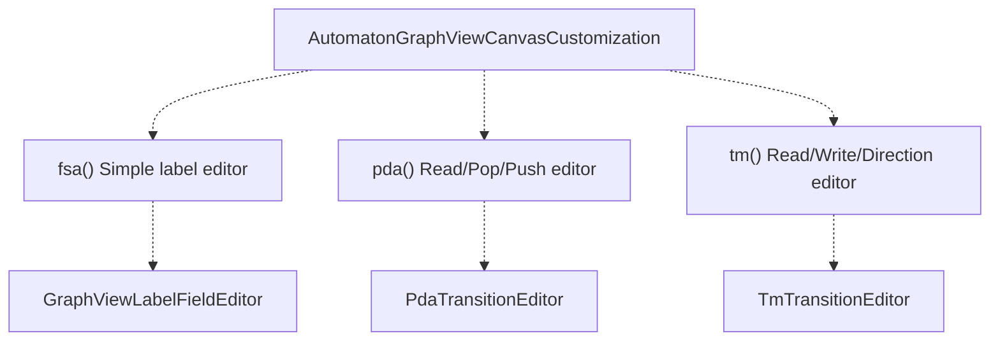

Each customization provides three functions:

1. `initialPayloadBuilder`: Creates initial payload from existing edge or defaults
2. `overlayBuilder`: Constructs the overlay widget
3. `persistTransition`: Saves the user's edits to the provider

**Sources:** [lib/presentation/widgets/automaton_graphview_canvas.dart L166-L301](https://github.com/ThalesMMS/JFlutter/blob/32e808b4/lib/presentation/widgets/automaton_graphview_canvas.dart#L166-L301)

---

## Canvas Toolbar

`GraphViewCanvasToolbar` provides viewport controls and editing tools in two layout modes.

### Layout Modes

| Layout | Use Case | Button Style | Position |
| --- | --- | --- | --- |
| `desktop` | Width ≥ 1400px | `IconButton` with tooltips | Top-right, vertical stack |
| `mobile` | Width < 1024px | `FilledButton` with labels | Bottom-center, wrapped row |

**Sources:** [lib/presentation/widgets/graphview_canvas_toolbar.dart L157-L328](https://github.com/ThalesMMS/JFlutter/blob/32e808b4/lib/presentation/widgets/graphview_canvas_toolbar.dart#L157-L328)

### Toolbar Actions

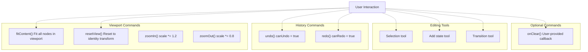

**Toggle Tools:** When `enableToolSelection = true`, the add state and transition buttons become toggle buttons that switch the active tool. The toolbar tracks `activeTool` and reflects it visually with different button styles.

**Sources:** [lib/presentation/widgets/graphview_canvas_toolbar.dart L20-L155](https://github.com/ThalesMMS/JFlutter/blob/32e808b4/lib/presentation/widgets/graphview_canvas_toolbar.dart#L20-L155)

---

## Simulation Highlighting

The canvas integrates with `SimulationHighlightService` to visualize simulation steps by highlighting states and transitions.

### Highlight Channel

`GraphViewSimulationHighlightChannel` implements the `SimulationHighlightChannel` interface:

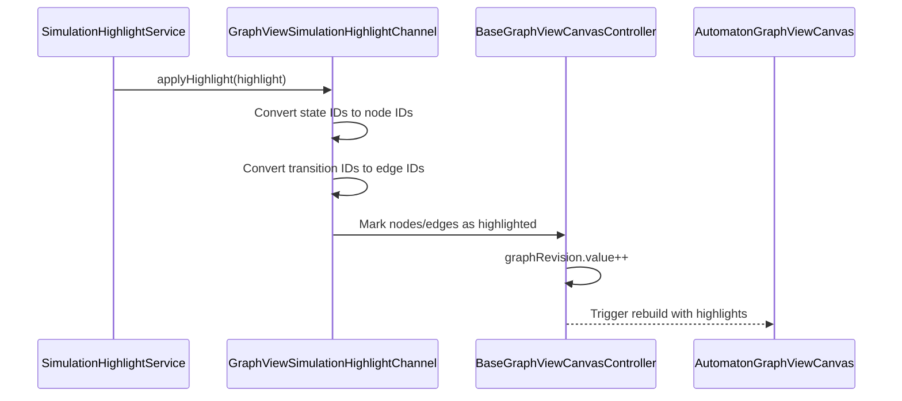

The canvas renders highlights by applying visual effects (colors, animations) to the marked nodes and edges.

**Sources:** [lib/features/canvas/graphview/graphview_highlight_channel.dart](https://github.com/ThalesMMS/JFlutter/blob/32e808b4/lib/features/canvas/graphview/graphview_highlight_channel.dart)

 [lib/presentation/widgets/automaton_graphview_canvas.dart L342-L344](https://github.com/ThalesMMS/JFlutter/blob/32e808b4/lib/presentation/widgets/automaton_graphview_canvas.dart#L342-L344)

 [lib/presentation/widgets/automaton_graphview_canvas.dart L409-L414](https://github.com/ThalesMMS/JFlutter/blob/32e808b4/lib/presentation/widgets/automaton_graphview_canvas.dart#L409-L414)

---

## Testing Patterns

Canvas tests validate gesture recognition, controller operations, and overlay workflows.

### Test Structure

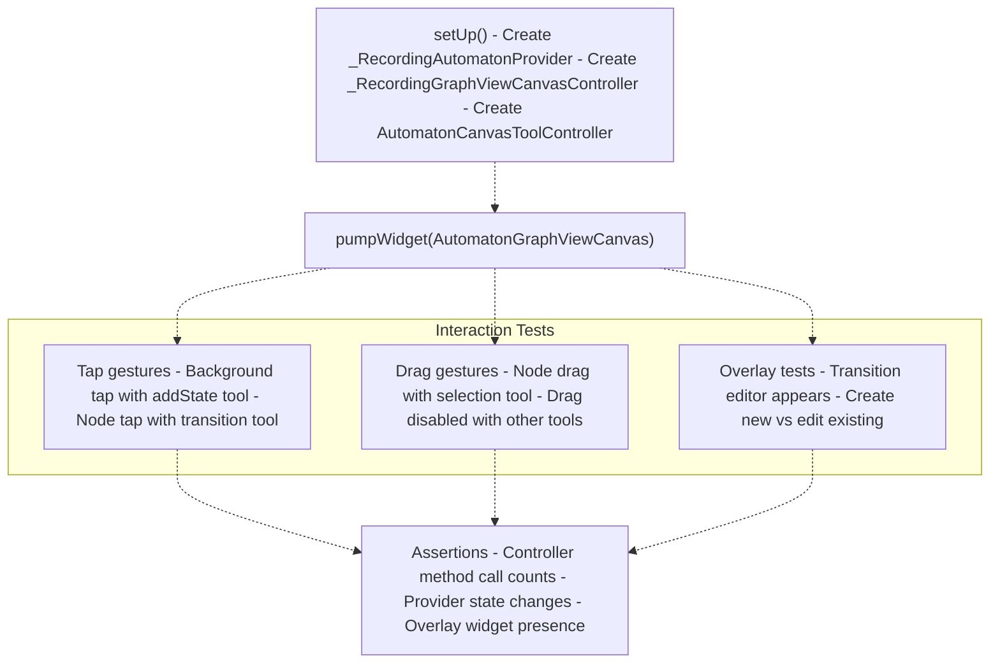

**Recording Wrappers:** Tests use recording wrappers (`_RecordingGraphViewCanvasController`, `_RecordingAutomatonProvider`) to track method invocations without mocking the entire behavior.

**Sources:** [test/widget/presentation/automaton_graphview_canvas_test.dart L64-L444](https://github.com/ThalesMMS/JFlutter/blob/32e808b4/test/widget/presentation/automaton_graphview_canvas_test.dart#L64-L444)

### Key Test Scenarios

| Test Scenario | Validation |
| --- | --- |
| Add state with addState tool | `controller.addStateAtCallCount` incremented |
| Drag ignored with transition tool | `controller.moveStateCallCount` remains 0 |
| Transition editor after jittery taps | `GraphViewLabelFieldEditor` widget found |
| Create new transition | New transition ID in `provider.transitionCalls` |
| Edit existing transition | Existing transition ID preserved |

**Jittery Tap Handling:** Tests verify that small movements (1px) during taps don't prevent the transition editor from appearing, ensuring robustness on touch devices.

**Sources:** [test/widget/presentation/automaton_graphview_canvas_test.dart L148-L259](https://github.com/ThalesMMS/JFlutter/blob/32e808b4/test/widget/presentation/automaton_graphview_canvas_test.dart#L148-L259)

 [test/widget/presentation/automaton_graphview_canvas_test.dart L331-L442](https://github.com/ThalesMMS/JFlutter/blob/32e808b4/test/widget/presentation/automaton_graphview_canvas_test.dart#L331-L442)

---

## Canvas Constants

The canvas system uses constants defined in `automaton_canvas.dart`:

| Constant | Value | Purpose |
| --- | --- | --- |
| `kAutomatonStateDiameter` | 48.0 | Visual size of state nodes |
| `kInitialArrowSize` | Size(24, 12) | Size of initial state arrow indicator |

**Sources:** [lib/core/constants/automaton_canvas.dart](https://github.com/ThalesMMS/JFlutter/blob/32e808b4/lib/core/constants/automaton_canvas.dart)

 [lib/presentation/widgets/automaton_graphview_canvas.dart L303-L305](https://github.com/ThalesMMS/JFlutter/blob/32e808b4/lib/presentation/widgets/automaton_graphview_canvas.dart#L303-L305)

---

## Summary

The Canvas System provides a flexible, type-safe abstraction over GraphView for automaton editing. Key design principles include:

1. **Controller Pattern:** Specialized controllers handle domain-specific logic while inheriting common viewport operations
2. **Bidirectional Synchronization:** Changes flow Provider → Controller → Graph and back, maintaining consistency
3. **Composable Overlays:** Transition editing adapts to automaton type through payload/builder/persist functions
4. **Gesture Coordination:** Arena-based gesture recognition prevents conflicts between node dragging and canvas panning
5. **Layout Adaptation:** Single canvas implementation supports desktop, tablet, and mobile form factors

This architecture enables page-specific editors (FSAPage, PDAPage, TMPage) to share a common canvas implementation while maintaining their unique editing semantics.

**Sources:** [lib/presentation/widgets/automaton_graphview_canvas.dart L1-L1500](https://github.com/ThalesMMS/JFlutter/blob/32e808b4/lib/presentation/widgets/automaton_graphview_canvas.dart#L1-L1500)

 [lib/features/canvas/graphview/base_graphview_canvas_controller.dart](https://github.com/ThalesMMS/JFlutter/blob/32e808b4/lib/features/canvas/graphview/base_graphview_canvas_controller.dart)

 [lib/features/canvas/graphview/graphview_canvas_controller.dart](https://github.com/ThalesMMS/JFlutter/blob/32e808b4/lib/features/canvas/graphview/graphview_canvas_controller.dart)

Refresh this wiki

Last indexed: 30 December 2025 ([32e808](https://github.com/ThalesMMS/JFlutter/commit/32e808b4))

### On this page

* [Canvas System](#4-canvas-system)
* [Purpose and Scope](#4-purpose-and-scope)
* [Canvas Architecture Overview](#4-canvas-architecture-overview)
* [Core Components](#4-core-components)
* [Canvas Widget Lifecycle](#4-canvas-widget-lifecycle)
* [Initialization Process](#4-initialization-process)
* [Update and Synchronization](#4-update-and-synchronization)
* [Rendering Pipeline](#4-rendering-pipeline)
* [Layout Configuration](#4-layout-configuration)
* [Node and Edge Rendering](#4-node-and-edge-rendering)
* [Viewport Transformations](#4-viewport-transformations)
* [Canvas Controllers](#4-canvas-controllers)
* [Controller Hierarchy](#4-controller-hierarchy)
* [Synchronization Pattern](#4-synchronization-pattern)
* [Undo/Redo System](#4-undoredo-system)
* [Tool System and Interaction](#4-tool-system-and-interaction)
* [Gesture Handling](#4-gesture-handling)
* [State Editing Interaction](#4-state-editing-interaction)
* [Transition Overlay System](#4-transition-overlay-system)
* [Payload Types](#4-payload-types)
* [Overlay Data Flow](#4-overlay-data-flow)
* [Customization System](#4-customization-system)
* [Canvas Toolbar](#4-canvas-toolbar)
* [Layout Modes](#4-layout-modes)
* [Toolbar Actions](#4-toolbar-actions)
* [Simulation Highlighting](#4-simulation-highlighting)
* [Highlight Channel](#4-highlight-channel)
* [Testing Patterns](#4-testing-patterns)
* [Test Structure](#4-test-structure)
* [Key Test Scenarios](#4-key-test-scenarios)
* [Canvas Constants](#4-canvas-constants)
* [Summary](#4-summary)

Ask Devin about JFlutter