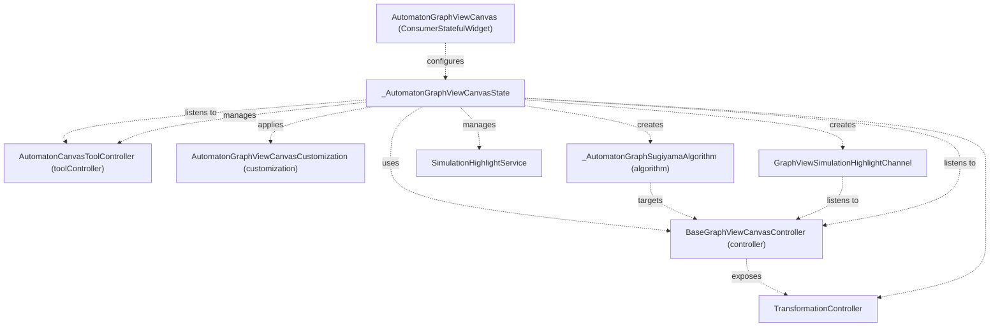
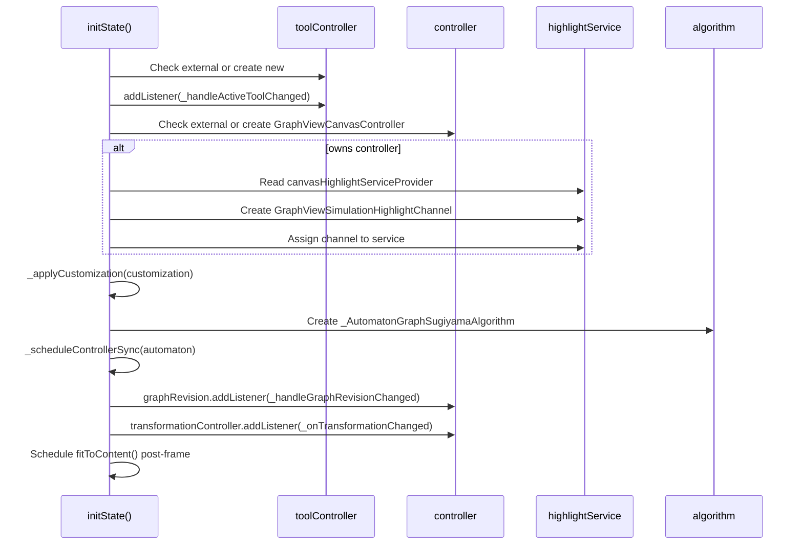
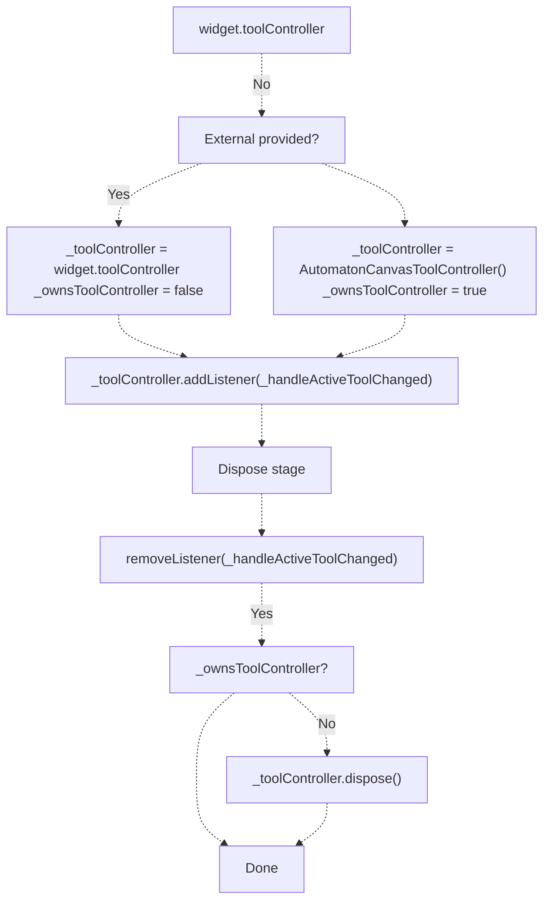
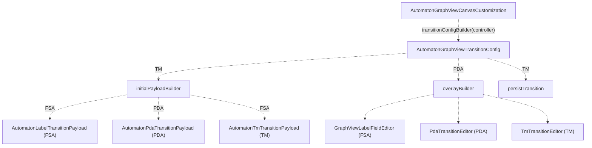
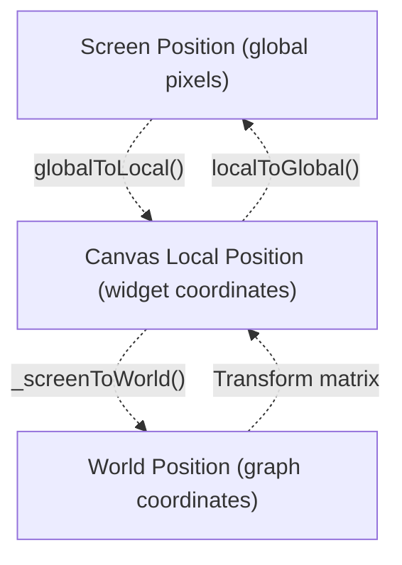
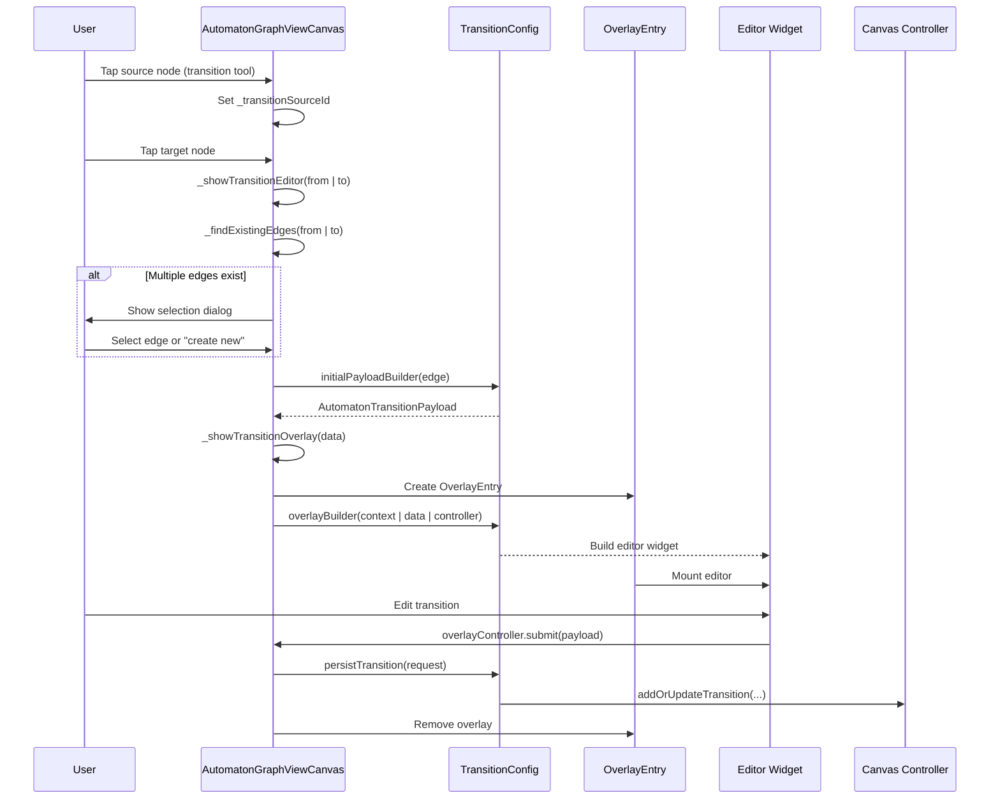
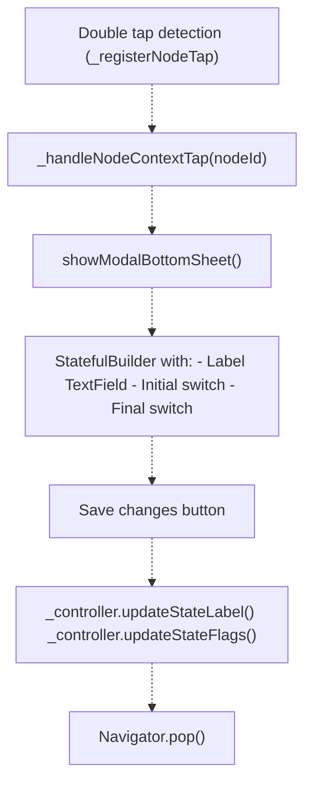
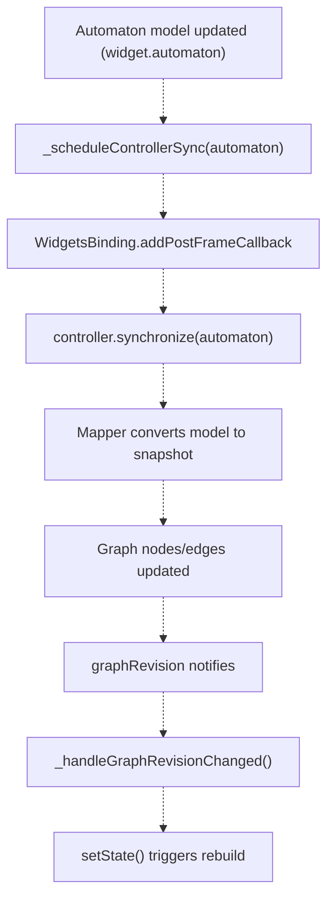
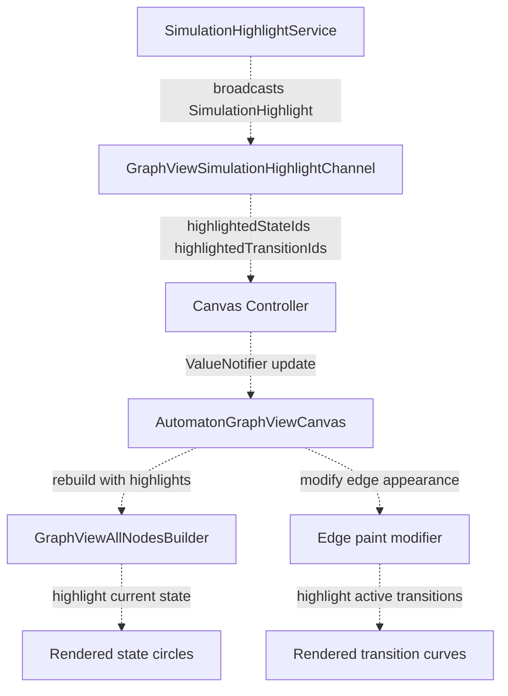
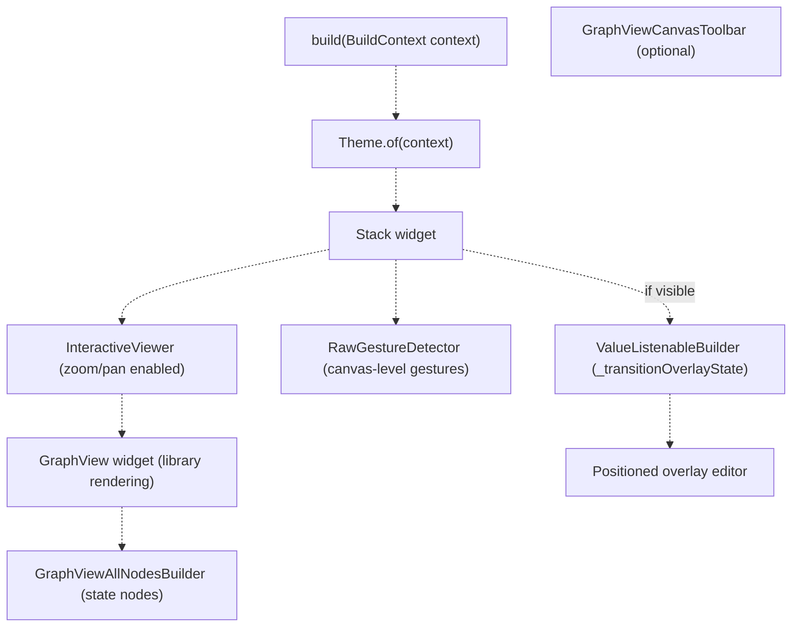

# AutomatonGraphViewCanvas Widget

> **Relevant source files**
> * [lib/presentation/widgets/automaton_canvas.dart](https://github.com/ThalesMMS/JFlutter/blob/32e808b4/lib/presentation/widgets/automaton_canvas.dart)
> * [lib/presentation/widgets/automaton_graphview_canvas.dart](https://github.com/ThalesMMS/JFlutter/blob/32e808b4/lib/presentation/widgets/automaton_graphview_canvas.dart)
> * [lib/presentation/widgets/graphview_canvas_toolbar.dart](https://github.com/ThalesMMS/JFlutter/blob/32e808b4/lib/presentation/widgets/graphview_canvas_toolbar.dart)
> * [test/widget/presentation/automaton_graphview_canvas_test.dart](https://github.com/ThalesMMS/JFlutter/blob/32e808b4/test/widget/presentation/automaton_graphview_canvas_test.dart)
> * [test/widget/presentation/graphview_canvas_toolbar_test.dart](https://github.com/ThalesMMS/JFlutter/blob/32e808b4/test/widget/presentation/graphview_canvas_toolbar_test.dart)
> * [test/widget/presentation/graphview_label_field_editor_test.dart](https://github.com/ThalesMMS/JFlutter/blob/32e808b4/test/widget/presentation/graphview_label_field_editor_test.dart)

This document provides a comprehensive reference for the `AutomatonGraphViewCanvas` widget, the primary interactive canvas component for editing and visualizing finite state automata, pushdown automata, and Turing machines. This widget serves as the universal editing surface that orchestrates controllers, tools, overlays, and gesture handling.

For information about the canvas controller architecture, see [Canvas Controllers](#4.2). For details on the customization system that enables type-specific behaviors, see [Canvas Customization System](#4.3). For tool selection and gesture handling strategies, see [Canvas Tools and Interaction](#4.4).

---

## Widget Overview

`AutomatonGraphViewCanvas` is a stateful widget built on Flutter's Riverpod state management system. It acts as the primary presentation layer component for all automaton editing workspaces, providing a unified interface regardless of the underlying automaton type (FSA, PDA, or TM).

### Core Responsibilities

| Responsibility | Implementation |
| --- | --- |
| **Graph Rendering** | Delegates to GraphView library for node/edge layout and rendering |
| **Gesture Handling** | Processes taps, drags, and pans based on active tool selection |
| **Coordinate Transformation** | Converts between viewport coordinates and world coordinates |
| **Controller Lifecycle** | Manages creation, synchronization, and disposal of canvas controllers |
| **State Synchronization** | Ensures canvas reflects current automaton state from providers |
| **Visual Feedback** | Integrates simulation highlight channels for step-by-step execution |
| **Overlay Management** | Shows/hides transition editors and state property dialogs |
| **Tool Coordination** | Responds to tool changes (selection, addState, transition) |

**Sources:** [lib/presentation/widgets/automaton_graphview_canvas.dart L1-L333](https://github.com/ThalesMMS/JFlutter/blob/32e808b4/lib/presentation/widgets/automaton_graphview_canvas.dart#L1-L333)

---

## Widget Structure and Lifecycle

The following diagram illustrates the widget's composition and its relationships with key dependencies:



**Sources:** [lib/presentation/widgets/automaton_graphview_canvas.dart L308-L333](https://github.com/ThalesMMS/JFlutter/blob/32e808b4/lib/presentation/widgets/automaton_graphview_canvas.dart#L308-L333)

 [lib/presentation/widgets/automaton_graphview_canvas.dart L335-L365](https://github.com/ThalesMMS/JFlutter/blob/32e808b4/lib/presentation/widgets/automaton_graphview_canvas.dart#L335-L365)

### Constructor Parameters

The widget accepts the following parameters to configure its behavior:

```
const AutomatonGraphViewCanvas({  required Object? automaton,           // Domain model (FSA, PDA, or TM)  required GlobalKey canvasKey,         // Key for coordinate calculations  SimulationResult? simulationResult,   // Optional simulation state  int? currentStepIndex,                // Current simulation step  bool showTrace = false,               // Display execution trace  BaseGraphViewCanvasController? controller,  // Optional external controller  AutomatonCanvasToolController? toolController,  // Optional tool controller  AutomatonGraphViewCanvasCustomization? customization,  // Type-specific config})
```

**Sources:** [lib/presentation/widgets/automaton_graphview_canvas.dart L308-L333](https://github.com/ThalesMMS/JFlutter/blob/32e808b4/lib/presentation/widgets/automaton_graphview_canvas.dart#L308-L333)

### State Initialization

The widget's `initState` method performs the following setup sequence:



**Sources:** [lib/presentation/widgets/automaton_graphview_canvas.dart L387-L432](https://github.com/ThalesMMS/JFlutter/blob/32e808b4/lib/presentation/widgets/automaton_graphview_canvas.dart#L387-L432)

---

## Controller Ownership and Lifecycle

The canvas supports both **managed** and **external** controller modes, enabling flexible integration patterns:

### Managed Controller Mode

When `controller` parameter is null, the widget creates and owns a `GraphViewCanvasController`:

| Lifecycle Stage | Action |
| --- | --- |
| **Creation** | Instantiate `GraphViewCanvasController` with `automatonProvider` from Riverpod |
| **Highlight Setup** | Create `GraphViewSimulationHighlightChannel` and wire to `SimulationHighlightService` |
| **Disposal** | Restore previous highlight channel, dispose controller |

**Sources:** [lib/presentation/widgets/automaton_graphview_canvas.dart L401-L415](https://github.com/ThalesMMS/JFlutter/blob/32e808b4/lib/presentation/widgets/automaton_graphview_canvas.dart#L401-L415)

 [lib/presentation/widgets/automaton_graphview_canvas.dart L515-L521](https://github.com/ThalesMMS/JFlutter/blob/32e808b4/lib/presentation/widgets/automaton_graphview_canvas.dart#L515-L521)

### External Controller Mode

When a `controller` is provided, the widget uses it without ownership responsibilities:

| Lifecycle Stage | Action |
| --- | --- |
| **Adoption** | Use provided controller, set `_ownsController = false` |
| **Highlight Setup** | Skip highlight service configuration (assumed handled externally) |
| **Disposal** | Remove listeners only, do not dispose controller |

**Sources:** [lib/presentation/widgets/automaton_graphview_canvas.dart L402-L415](https://github.com/ThalesMMS/JFlutter/blob/32e808b4/lib/presentation/widgets/automaton_graphview_canvas.dart#L402-L415)

 [lib/presentation/widgets/automaton_graphview_canvas.dart L462-L480](https://github.com/ThalesMMS/JFlutter/blob/32e808b4/lib/presentation/widgets/automaton_graphview_canvas.dart#L462-L480)

### Tool Controller Ownership

Similar dual-mode pattern applies to `AutomatonCanvasToolController`:



**Sources:** [lib/presentation/widgets/automaton_graphview_canvas.dart L390-L397](https://github.com/ThalesMMS/JFlutter/blob/32e808b4/lib/presentation/widgets/automaton_graphview_canvas.dart#L390-L397)

 [lib/presentation/widgets/automaton_graphview_canvas.dart L511-L514](https://github.com/ThalesMMS/JFlutter/blob/32e808b4/lib/presentation/widgets/automaton_graphview_canvas.dart#L511-L514)

---

## Customization System Architecture

The customization system enables the same canvas widget to handle different automaton types (FSA, PDA, TM) through type-specific configurations:



**Sources:** [lib/presentation/widgets/automaton_graphview_canvas.dart L166-L178](https://github.com/ThalesMMS/JFlutter/blob/32e808b4/lib/presentation/widgets/automaton_graphview_canvas.dart#L166-L178)

 [lib/presentation/widgets/automaton_graphview_canvas.dart L180-L301](https://github.com/ThalesMMS/JFlutter/blob/32e808b4/lib/presentation/widgets/automaton_graphview_canvas.dart#L180-L301)

### Factory Methods

Two built-in factory methods provide standard configurations:

#### FSA Customization

```javascript
factory AutomatonGraphViewCanvasCustomization.fsa() {  return AutomatonGraphViewCanvasCustomization(    transitionConfigBuilder: (controller) {      return AutomatonGraphViewTransitionConfig(        initialPayloadBuilder: (edge) =>             AutomatonLabelTransitionPayload(edge?.label ?? ''),        overlayBuilder: (context, data, overlayController) =>             GraphViewLabelFieldEditor(...),        persistTransition: (request) {          final controller = request.controller as GraphViewCanvasController;          controller.addOrUpdateTransition(...);        },      );    },  );}
```

**Sources:** [lib/presentation/widgets/automaton_graphview_canvas.dart L196-L227](https://github.com/ThalesMMS/JFlutter/blob/32e808b4/lib/presentation/widgets/automaton_graphview_canvas.dart#L196-L227)

#### PDA Customization

```javascript
factory AutomatonGraphViewCanvasCustomization.pda() {  return AutomatonGraphViewCanvasCustomization(    transitionConfigBuilder: (controller) {      return AutomatonGraphViewTransitionConfig(        initialPayloadBuilder: (edge) => AutomatonPdaTransitionPayload(...),        overlayBuilder: (context, data, overlayController) =>             PdaTransitionEditor(...),        persistTransition: (request) {          final pdaController = request.controller as GraphViewPdaCanvasController;          pdaController.addOrUpdateTransition(...);        },      );    },  );}
```

**Sources:** [lib/presentation/widgets/automaton_graphview_canvas.dart L229-L300](https://github.com/ThalesMMS/JFlutter/blob/32e808b4/lib/presentation/widgets/automaton_graphview_canvas.dart#L229-L300)

### Payload Type Hierarchy

The sealed class hierarchy for transition payloads:

| Payload Type | Fields | Used By |
| --- | --- | --- |
| `AutomatonLabelTransitionPayload` | `String label` | FSA |
| `AutomatonTmTransitionPayload` | `String readSymbol``String writeSymbol``TapeDirection direction` | Turing Machine |
| `AutomatonPdaTransitionPayload` | `String readSymbol``String popSymbol``String pushSymbol``bool isLambdaInput``bool isLambdaPop``bool isLambdaPush` | Pushdown Automaton |

**Sources:** [lib/presentation/widgets/automaton_graphview_canvas.dart L52-L93](https://github.com/ThalesMMS/JFlutter/blob/32e808b4/lib/presentation/widgets/automaton_graphview_canvas.dart#L52-L93)

---

## Gesture Handling System

The canvas processes user input through a sophisticated gesture recognition system that varies behavior based on the active tool:

```css
#mermaid-v4tvrjl8bib{font-family:ui-sans-serif,-apple-system,system-ui,Segoe UI,Helvetica;font-size:16px;fill:#ccc;}@keyframes edge-animation-frame{from{stroke-dashoffset:0;}}@keyframes dash{to{stroke-dashoffset:0;}}#mermaid-v4tvrjl8bib .edge-animation-slow{stroke-dasharray:9,5!important;stroke-dashoffset:900;animation:dash 50s linear infinite;stroke-linecap:round;}#mermaid-v4tvrjl8bib .edge-animation-fast{stroke-dasharray:9,5!important;stroke-dashoffset:900;animation:dash 20s linear infinite;stroke-linecap:round;}#mermaid-v4tvrjl8bib .error-icon{fill:#a44141;}#mermaid-v4tvrjl8bib .error-text{fill:#ddd;stroke:#ddd;}#mermaid-v4tvrjl8bib .edge-thickness-normal{stroke-width:1px;}#mermaid-v4tvrjl8bib .edge-thickness-thick{stroke-width:3.5px;}#mermaid-v4tvrjl8bib .edge-pattern-solid{stroke-dasharray:0;}#mermaid-v4tvrjl8bib .edge-thickness-invisible{stroke-width:0;fill:none;}#mermaid-v4tvrjl8bib .edge-pattern-dashed{stroke-dasharray:3;}#mermaid-v4tvrjl8bib .edge-pattern-dotted{stroke-dasharray:2;}#mermaid-v4tvrjl8bib .marker{fill:lightgrey;stroke:lightgrey;}#mermaid-v4tvrjl8bib .marker.cross{stroke:lightgrey;}#mermaid-v4tvrjl8bib svg{font-family:ui-sans-serif,-apple-system,system-ui,Segoe UI,Helvetica;font-size:16px;}#mermaid-v4tvrjl8bib p{margin:0;}#mermaid-v4tvrjl8bib defs #statediagram-barbEnd{fill:lightgrey;stroke:lightgrey;}#mermaid-v4tvrjl8bib g.stateGroup text{fill:#ccc;stroke:none;font-size:10px;}#mermaid-v4tvrjl8bib g.stateGroup text{fill:#ccc;stroke:none;font-size:10px;}#mermaid-v4tvrjl8bib g.stateGroup .state-title{font-weight:bolder;fill:#e0dfdf;}#mermaid-v4tvrjl8bib g.stateGroup rect{fill:#1f2020;stroke:#ccc;}#mermaid-v4tvrjl8bib g.stateGroup line{stroke:lightgrey;stroke-width:1;}#mermaid-v4tvrjl8bib .transition{stroke:lightgrey;stroke-width:1;fill:none;}#mermaid-v4tvrjl8bib .stateGroup .composit{fill:#333;border-bottom:1px;}#mermaid-v4tvrjl8bib .stateGroup .alt-composit{fill:#e0e0e0;border-bottom:1px;}#mermaid-v4tvrjl8bib .state-note{stroke:hsl(180, 0%, 18.3529411765%);fill:hsl(180, 1.5873015873%, 28.3529411765%);}#mermaid-v4tvrjl8bib .state-note text{fill:rgb(183.8476190475, 181.5523809523, 181.5523809523);stroke:none;font-size:10px;}#mermaid-v4tvrjl8bib .stateLabel .box{stroke:none;stroke-width:0;fill:#1f2020;opacity:0.5;}#mermaid-v4tvrjl8bib .edgeLabel .label rect{fill:#1f2020;opacity:0.5;}#mermaid-v4tvrjl8bib .edgeLabel{background-color:hsl(0, 0%, 34.4117647059%);text-align:center;}#mermaid-v4tvrjl8bib .edgeLabel p{background-color:hsl(0, 0%, 34.4117647059%);}#mermaid-v4tvrjl8bib .edgeLabel rect{opacity:0.5;background-color:hsl(0, 0%, 34.4117647059%);fill:hsl(0, 0%, 34.4117647059%);}#mermaid-v4tvrjl8bib .edgeLabel .label text{fill:#ccc;}#mermaid-v4tvrjl8bib .label div .edgeLabel{color:#ccc;}#mermaid-v4tvrjl8bib .stateLabel text{fill:#e0dfdf;font-size:10px;font-weight:bold;}#mermaid-v4tvrjl8bib .node circle.state-start{fill:#f4f4f4;stroke:#f4f4f4;}#mermaid-v4tvrjl8bib .node .fork-join{fill:#f4f4f4;stroke:#f4f4f4;}#mermaid-v4tvrjl8bib .node circle.state-end{fill:#cccccc;stroke:#333;stroke-width:1.5;}#mermaid-v4tvrjl8bib .end-state-inner{fill:#333;stroke-width:1.5;}#mermaid-v4tvrjl8bib .node rect{fill:#1f2020;stroke:#ccc;stroke-width:1px;}#mermaid-v4tvrjl8bib .node polygon{fill:#1f2020;stroke:#ccc;stroke-width:1px;}#mermaid-v4tvrjl8bib #statediagram-barbEnd{fill:lightgrey;}#mermaid-v4tvrjl8bib .statediagram-cluster rect{fill:#1f2020;stroke:#ccc;stroke-width:1px;}#mermaid-v4tvrjl8bib .cluster-label,#mermaid-v4tvrjl8bib .nodeLabel{color:#e0dfdf;}#mermaid-v4tvrjl8bib .statediagram-cluster rect.outer{rx:5px;ry:5px;}#mermaid-v4tvrjl8bib .statediagram-state .divider{stroke:#ccc;}#mermaid-v4tvrjl8bib .statediagram-state .title-state{rx:5px;ry:5px;}#mermaid-v4tvrjl8bib .statediagram-cluster.statediagram-cluster .inner{fill:#333;}#mermaid-v4tvrjl8bib .statediagram-cluster.statediagram-cluster-alt .inner{fill:#555;}#mermaid-v4tvrjl8bib .statediagram-cluster .inner{rx:0;ry:0;}#mermaid-v4tvrjl8bib .statediagram-state rect.basic{rx:5px;ry:5px;}#mermaid-v4tvrjl8bib .statediagram-state rect.divider{stroke-dasharray:10,10;fill:#555;}#mermaid-v4tvrjl8bib .note-edge{stroke-dasharray:5;}#mermaid-v4tvrjl8bib .statediagram-note rect{fill:hsl(180, 1.5873015873%, 28.3529411765%);stroke:hsl(180, 0%, 18.3529411765%);stroke-width:1px;rx:0;ry:0;}#mermaid-v4tvrjl8bib .statediagram-note rect{fill:hsl(180, 1.5873015873%, 28.3529411765%);stroke:hsl(180, 0%, 18.3529411765%);stroke-width:1px;rx:0;ry:0;}#mermaid-v4tvrjl8bib .statediagram-note text{fill:rgb(183.8476190475, 181.5523809523, 181.5523809523);}#mermaid-v4tvrjl8bib .statediagram-note .nodeLabel{color:rgb(183.8476190475, 181.5523809523, 181.5523809523);}#mermaid-v4tvrjl8bib .statediagram .edgeLabel{color:red;}#mermaid-v4tvrjl8bib #dependencyStart,#mermaid-v4tvrjl8bib #dependencyEnd{fill:lightgrey;stroke:lightgrey;stroke-width:1;}#mermaid-v4tvrjl8bib .statediagramTitleText{text-anchor:middle;font-size:18px;fill:#ccc;}#mermaid-v4tvrjl8bib :root{--mermaid-font-family:ui-sans-serif,-apple-system,system-ui,Segoe UI,Helvetica;}SelectionToolPan start on nodePan updateContinuePan end (no move)Double tap detectedSingle tapPan end (moved)IdleNodeDragNodeMoveDoubleTapCheckShowStateOptionsAddStateToolTap up on backgroundWaitingCallAddStateAtTransitionToolTap nodeTap nodeEditor closedNoSourceSourceSelectedShowEditor
```

**Sources:** [lib/presentation/widgets/automaton_graphview_canvas.dart L695-L779](https://github.com/ThalesMMS/JFlutter/blob/32e808b4/lib/presentation/widgets/automaton_graphview_canvas.dart#L695-L779)

 [lib/presentation/widgets/automaton_graphview_canvas.dart L781-L819](https://github.com/ThalesMMS/JFlutter/blob/32e808b4/lib/presentation/widgets/automaton_graphview_canvas.dart#L781-L819)

 [lib/presentation/widgets/automaton_graphview_canvas.dart L821-L850](https://github.com/ThalesMMS/JFlutter/blob/32e808b4/lib/presentation/widgets/automaton_graphview_canvas.dart#L821-L850)

### Gesture Handler Methods

| Method | Purpose | Active Tools |
| --- | --- | --- |
| `_handleCanvasTapDown` | Log tap for debugging | All |
| `_handleCanvasTapUp` | Process tap completion based on tool | All |
| `_handleNodePanStart` | Begin node drag if enabled | Selection (when `enableStateDrag`) |
| `_handleNodePanUpdate` | Update dragged node position | Selection |
| `_handleNodePanEnd` | Finalize drag or register tap | Selection |
| `_handleNodePanCancel` | Abort drag operation | Selection |

**Sources:** [lib/presentation/widgets/automaton_graphview_canvas.dart L695-L819](https://github.com/ThalesMMS/JFlutter/blob/32e808b4/lib/presentation/widgets/automaton_graphview_canvas.dart#L695-L819)

### Canvas Pan Suppression

To prevent conflicts between node dragging and canvas panning, the widget uses an arena team approach:

```
final GestureArenaTeam _gestureArenaTeam = GestureArenaTeam();bool _suppressCanvasPan = false;void _setCanvasPanSuppressed(bool value, {String reason = ''}) {  setState(() {    _suppressCanvasPan = value;  });}
```

The `_suppressCanvasPan` flag is set to `true` during node drag operations and restored to `false` on completion.

**Sources:** [lib/presentation/widgets/automaton_graphview_canvas.dart L358-L382](https://github.com/ThalesMMS/JFlutter/blob/32e808b4/lib/presentation/widgets/automaton_graphview_canvas.dart#L358-L382)

 [lib/presentation/widgets/automaton_graphview_canvas.dart L1233-L1292](https://github.com/ThalesMMS/JFlutter/blob/32e808b4/lib/presentation/widgets/automaton_graphview_canvas.dart#L1233-L1292)

---

## Coordinate System Transformations

The canvas maintains two coordinate spaces: **viewport coordinates** (screen pixels) and **world coordinates** (logical graph positions). Transformations between these spaces enable accurate hit testing and positioning.

### Transformation Pipeline



### Core Transformation Methods

#### Screen to World

```
Offset _screenToWorld(Offset localPosition) {  final controller = _transformationController;  if (controller == null) return localPosition;    final matrix = Matrix4.copy(controller.value);  final determinant = matrix.invert();  if (determinant == 0) return localPosition;    final vector = matrix.transform3(    vmath.Vector3(localPosition.dx, localPosition.dy, 0),  );  return Offset(vector.x, vector.y);}
```

**Sources:** [lib/presentation/widgets/automaton_graphview_canvas.dart L615-L629](https://github.com/ThalesMMS/JFlutter/blob/32e808b4/lib/presentation/widgets/automaton_graphview_canvas.dart#L615-L629)

#### Global to Canvas Local

```
Offset _globalToCanvasLocal(Offset globalPosition) {  final renderBox =       widget.canvasKey.currentContext?.findRenderObject() as RenderBox?;  if (renderBox == null) return globalPosition;  return renderBox.globalToLocal(globalPosition);}
```

**Sources:** [lib/presentation/widgets/automaton_graphview_canvas.dart L665-L672](https://github.com/ThalesMMS/JFlutter/blob/32e808b4/lib/presentation/widgets/automaton_graphview_canvas.dart#L665-L672)

### Hit Testing

Node hit testing uses world coordinates and radius-based detection:

```
GraphViewCanvasNode? _hitTestNode(Offset localPosition, {bool logDetails = true}) {  final world = _screenToWorld(localPosition);  GraphViewCanvasNode? closest;  var closestDistance = double.infinity;    for (final node in _controller.nodes) {    final center = Offset(node.x + _kNodeRadius, node.y + _kNodeRadius);    final dx = world.dx - center.dx;    final dy = world.dy - center.dy;    final distanceSquared = dx * dx + dy * dy;        if (distanceSquared <= _kNodeRadius * _kNodeRadius &&        distanceSquared < closestDistance) {      closest = node;      closestDistance = distanceSquared;    }  }  return closest;}
```

**Sources:** [lib/presentation/widgets/automaton_graphview_canvas.dart L631-L663](https://github.com/ThalesMMS/JFlutter/blob/32e808b4/lib/presentation/widgets/automaton_graphview_canvas.dart#L631-L663)

---

## Transition Editing Flow

The transition editing system uses an overlay-based approach that adapts to different automaton types through the customization system:



**Sources:** [lib/presentation/widgets/automaton_graphview_canvas.dart L970-L1072](https://github.com/ThalesMMS/JFlutter/blob/32e808b4/lib/presentation/widgets/automaton_graphview_canvas.dart#L970-L1072)

 [lib/presentation/widgets/automaton_graphview_canvas.dart L1122-L1222](https://github.com/ThalesMMS/JFlutter/blob/32e808b4/lib/presentation/widgets/automaton_graphview_canvas.dart#L1122-L1222)

### Transition Overlay State Management

The canvas maintains overlay state through a `ValueNotifier`:

```
class _GraphViewTransitionOverlayState {  _GraphViewTransitionOverlayState({    required this.data,    required this.controller,    required this.displayPosition,  });  AutomatonTransitionOverlayData data;  AutomatonTransitionOverlayController controller;  Offset displayPosition;}final ValueNotifier<_GraphViewTransitionOverlayState?> _transitionOverlayState =    ValueNotifier(null);
```

**Sources:** [lib/presentation/widgets/automaton_graphview_canvas.dart L1704-L1727](https://github.com/ThalesMMS/JFlutter/blob/32e808b4/lib/presentation/widgets/automaton_graphview_canvas.dart#L1704-L1727)

### Overlay Position Updates

The overlay position updates dynamically as the viewport transforms:

```
void _updateTransitionOverlayPosition() {  final state = _transitionOverlayState.value;  if (state == null) return;    final worldAnchor = state.data.worldAnchor;  final controller = _transformationController;  if (controller == null) return;    final matrix = controller.value;  final transformed = matrix.transform3(    vmath.Vector3(worldAnchor.dx, worldAnchor.dy, 0),  );    _transitionOverlayState.value = _GraphViewTransitionOverlayState(    data: state.data,    controller: state.controller,    displayPosition: Offset(transformed.x, transformed.y),  );}
```

**Sources:** [lib/presentation/widgets/automaton_graphview_canvas.dart L1294-L1320](https://github.com/ThalesMMS/JFlutter/blob/32e808b4/lib/presentation/widgets/automaton_graphview_canvas.dart#L1294-L1320)

---

## State Editing Modal

Double-tapping a node in selection mode opens a modal bottom sheet for editing state properties:



**Sources:** [lib/presentation/widgets/automaton_graphview_canvas.dart L865-L879](https://github.com/ThalesMMS/JFlutter/blob/32e808b4/lib/presentation/widgets/automaton_graphview_canvas.dart#L865-L879)

 [lib/presentation/widgets/automaton_graphview_canvas.dart L881-L962](https://github.com/ThalesMMS/JFlutter/blob/32e808b4/lib/presentation/widgets/automaton_graphview_canvas.dart#L881-L962)

### Modal Structure

The modal provides three main controls:

| Control | Type | Property Modified | Controller Method |
| --- | --- | --- | --- |
| Label field | `TextField` | State label | `updateStateLabel(nodeId, label)` |
| Initial switch | `SwitchListTile.adaptive` | Is initial state | `updateStateFlags(nodeId, isInitial: bool)` |
| Final switch | `SwitchListTile.adaptive` | Is accepting state | `updateStateFlags(nodeId, isAccepting: bool)` |

**Sources:** [lib/presentation/widgets/automaton_graphview_canvas.dart L886-L960](https://github.com/ThalesMMS/JFlutter/blob/32e808b4/lib/presentation/widgets/automaton_graphview_canvas.dart#L886-L960)

---

## Controller Synchronization

The widget maintains bidirectional synchronization between the domain model and the canvas graph representation:



**Sources:** [lib/presentation/widgets/automaton_graphview_canvas.dart L576-L604](https://github.com/ThalesMMS/JFlutter/blob/32e808b4/lib/presentation/widgets/automaton_graphview_canvas.dart#L576-L604)

 [lib/presentation/widgets/automaton_graphview_canvas.dart L1729-L1738](https://github.com/ThalesMMS/JFlutter/blob/32e808b4/lib/presentation/widgets/automaton_graphview_canvas.dart#L1729-L1738)

### Synchronization Scheduling

To avoid synchronization during the build phase, the widget uses a post-frame callback:

```
void _scheduleControllerSync(Object? data) {  _pendingSyncAutomaton = data;  if (_syncScheduled) return;    _syncScheduled = true;  WidgetsBinding.instance.addPostFrameCallback((_) {    _syncScheduled = false;    if (!mounted) {      _pendingSyncAutomaton = null;      return;    }    final target = _pendingSyncAutomaton;    _pendingSyncAutomaton = null;    final dynamic synchronizable = _controller;    synchronizable.synchronize(target);  });}
```

**Sources:** [lib/presentation/widgets/automaton_graphview_canvas.dart L576-L604](https://github.com/ThalesMMS/JFlutter/blob/32e808b4/lib/presentation/widgets/automaton_graphview_canvas.dart#L576-L604)

---

## Graph Rendering and Layout

The canvas delegates rendering to the GraphView library through a custom algorithm wrapper:

### Algorithm Configuration

```
class _AutomatonGraphSugiyamaAlgorithm extends SugiyamaAlgorithm {  _AutomatonGraphSugiyamaAlgorithm({    required this.controller,    required super.configuration,  });  final BaseGraphViewCanvasController<dynamic, dynamic> controller;  @override  Size run(Graph graph, double shiftX, double shiftY) {    // Custom layout implementation  }}SugiyamaConfiguration _buildConfiguration() {  return SugiyamaConfiguration()    ..orientation = SugiyamaConfiguration.ORIENTATION_LEFT_RIGHT    ..nodeSeparation = 160    ..levelSeparation = 160    ..bendPointShape = CurvedBendPointShape(curveLength: 40);}
```

**Sources:** [lib/presentation/widgets/automaton_graphview_canvas.dart L606-L613](https://github.com/ThalesMMS/JFlutter/blob/32e808b4/lib/presentation/widgets/automaton_graphview_canvas.dart#L606-L613)

 [lib/presentation/widgets/automaton_graphview_canvas.dart L1668-L1702](https://github.com/ThalesMMS/JFlutter/blob/32e808b4/lib/presentation/widgets/automaton_graphview_canvas.dart#L1668-L1702)

### Node Builder

The canvas uses `GraphViewAllNodesBuilder` to render individual state nodes:

```javascript
GraphViewAllNodesBuilder(  controller: _controller,  builder: (context, node) {    // Node rendering with:    // - Circle for state boundary    // - Double circle for accepting states    // - Initial arrow indicator    // - Label text    // - Highlight effects during simulation  },  onNodeTapped: (nodeId) => _handleNodeTap(nodeId),  onNodeLongPressed: (nodeId) => _handleNodeContextTap(nodeId),)
```

**Sources:** [lib/presentation/widgets/automaton_graphview_canvas.dart L1322-L1588](https://github.com/ThalesMMS/JFlutter/blob/32e808b4/lib/presentation/widgets/automaton_graphview_canvas.dart#L1322-L1588)

---

## Simulation Highlight Integration

The canvas integrates with the simulation system to provide visual feedback during step-by-step execution:



**Sources:** [lib/presentation/widgets/automaton_graphview_canvas.dart L409-L415](https://github.com/ThalesMMS/JFlutter/blob/32e808b4/lib/presentation/widgets/automaton_graphview_canvas.dart#L409-L415)

 [lib/core/services/simulation_highlight_service.dart L1-L50](https://github.com/ThalesMMS/JFlutter/blob/32e808b4/lib/core/services/simulation_highlight_service.dart#L1-L50)

 (implied from imports)

### Highlight Application

During rendering, the canvas queries highlight state from the controller:

```
final isHighlighted = _controller.isStateHighlighted(node.id);final color = isHighlighted     ? colorScheme.primary.withOpacity(0.9)    : colorScheme.onSurface;// Apply to state circle stroke// Apply to label text color// Optionally pulse animation
```

**Sources:** [lib/presentation/widgets/automaton_graphview_canvas.dart L1322-L1588](https://github.com/ThalesMMS/JFlutter/blob/32e808b4/lib/presentation/widgets/automaton_graphview_canvas.dart#L1322-L1588)

---

## Build Method Structure

The main build method orchestrates the visual assembly:



**Sources:** [lib/presentation/widgets/automaton_graphview_canvas.dart L1229-L1666](https://github.com/ThalesMMS/JFlutter/blob/32e808b4/lib/presentation/widgets/automaton_graphview_canvas.dart#L1229-L1666)

### Key Render Layers

| Layer | Widget Type | Purpose |
| --- | --- | --- |
| **Base** | `InteractiveViewer` | Provides zoom and pan transformations |
| **Graph** | `GraphView` | Renders edges and executes layout algorithm |
| **Nodes** | `GraphViewAllNodesBuilder` | Renders state circles with labels |
| **Gestures** | `RawGestureDetector` | Captures canvas-level taps and drags |
| **Overlay** | `Positioned` + editor widget | Shows transition editor at world position |

**Sources:** [lib/presentation/widgets/automaton_graphview_canvas.dart L1233-L1292](https://github.com/ThalesMMS/JFlutter/blob/32e808b4/lib/presentation/widgets/automaton_graphview_canvas.dart#L1233-L1292)

 [lib/presentation/widgets/automaton_graphview_canvas.dart L1322-L1588](https://github.com/ThalesMMS/JFlutter/blob/32e808b4/lib/presentation/widgets/automaton_graphview_canvas.dart#L1322-L1588)

 [lib/presentation/widgets/automaton_graphview_canvas.dart L1590-L1666](https://github.com/ThalesMMS/JFlutter/blob/32e808b4/lib/presentation/widgets/automaton_graphview_canvas.dart#L1590-L1666)

---

## Integration with Test Suite

The widget's test coverage validates gesture handling, controller integration, and overlay behavior:

### Test Scenarios

| Test File | Scenario | Verification |
| --- | --- | --- |
| `automaton_graphview_canvas_test.dart:148-190` | Add state tool tap delegation | `controller.addStateAtCallCount` increments |
| `automaton_graphview_canvas_test.dart:192-259` | Drag suppression during tool use | `controller.moveStateCallCount` remains 0 |
| `automaton_graphview_canvas_test.dart:331-355` | Jittery tap handling | `GraphViewLabelFieldEditor` appears |
| `automaton_graphview_canvas_test.dart:357-398` | Create new transition when edge exists | New transition ID generated |
| `automaton_graphview_canvas_test.dart:400-442` | Edit existing transition | Existing ID preserved, label updated |

**Sources:** [test/widget/presentation/automaton_graphview_canvas_test.dart L125-L444](https://github.com/ThalesMMS/JFlutter/blob/32e808b4/test/widget/presentation/automaton_graphview_canvas_test.dart#L125-L444)

### Mock Infrastructure

Tests use recording wrappers to verify method invocations:

```
class _RecordingGraphViewCanvasController extends GraphViewCanvasController {  int addStateAtCallCount = 0;  Offset? lastAddStateWorldOffset;  int moveStateCallCount = 0;  String? lastMoveStateId;  Offset? lastMoveStatePosition;  @override  void addStateAt(Offset worldPosition) {    addStateAtCallCount++;    lastAddStateWorldOffset = worldPosition;  }}
```

**Sources:** [test/widget/presentation/automaton_graphview_canvas_test.dart L101-L123](https://github.com/ThalesMMS/JFlutter/blob/32e808b4/test/widget/presentation/automaton_graphview_canvas_test.dart#L101-L123)

---

## Constants and Configuration

The widget uses several constants for visual consistency:

```
const double _kNodeDiameter = kAutomatonStateDiameter;  // From constants fileconst double _kNodeRadius = _kNodeDiameter / 2;const Size _kInitialArrowSize = Size(24, 12);
```

**Sources:** [lib/presentation/widgets/automaton_graphview_canvas.dart L303-L305](https://github.com/ThalesMMS/JFlutter/blob/32e808b4/lib/presentation/widgets/automaton_graphview_canvas.dart#L303-L305)

 [lib/core/constants/automaton_canvas.dart L1-L20](https://github.com/ThalesMMS/JFlutter/blob/32e808b4/lib/core/constants/automaton_canvas.dart#L1-L20)

 (implied)

### Layout Parameters

The Sugiyama algorithm configuration uses these spacing values:

| Parameter | Value | Purpose |
| --- | --- | --- |
| `nodeSeparation` | 160 | Horizontal spacing between nodes in same level |
| `levelSeparation` | 160 | Vertical spacing between hierarchical levels |
| `curveLength` | 40 | Bezier curve control point distance for edges |

**Sources:** [lib/presentation/widgets/automaton_graphview_canvas.dart L606-L613](https://github.com/ThalesMMS/JFlutter/blob/32e808b4/lib/presentation/widgets/automaton_graphview_canvas.dart#L606-L613)

---

## Common Integration Patterns

### Pattern 1: Standalone Canvas with Managed Controller

```
AutomatonGraphViewCanvas(  automaton: fsaModel,  canvasKey: GlobalKey(),  customization: AutomatonGraphViewCanvasCustomization.fsa(),)// Controller and highlight service automatically configured via Riverpod
```

### Pattern 2: External Controller with Shared Tool State

```
final controller = ref.watch(fsaControllerProvider);final toolController = ref.watch(toolControllerProvider);AutomatonGraphViewCanvas(  automaton: fsaModel,  canvasKey: GlobalKey(),  controller: controller,  toolController: toolController,  customization: AutomatonGraphViewCanvasCustomization.fsa(),)
```

### Pattern 3: Simulation Playback

```
final simulationResult = ref.watch(simulationResultProvider);final currentStep = ref.watch(currentStepProvider);AutomatonGraphViewCanvas(  automaton: fsaModel,  canvasKey: GlobalKey(),  simulationResult: simulationResult,  currentStepIndex: currentStep,  showTrace: true,)
```

**Sources:** [lib/presentation/pages/fsa_page.dart L1-L500](https://github.com/ThalesMMS/JFlutter/blob/32e808b4/lib/presentation/pages/fsa_page.dart#L1-L500)

 (implied usage patterns)

---

## Related Components

The canvas widget collaborates with several other components in the canvas system:

* **[GraphViewCanvasToolbar](#8.4)**: Provides zoom, fit, undo/redo controls
* **[AutomatonCanvasToolController](#4.4)**: Manages tool selection state
* **[GraphViewCanvasController](#4.2)**: FSA-specific controller implementation
* **[GraphViewPdaCanvasController](#4.2)**: PDA-specific controller implementation
* **[GraphViewTmCanvasController](#4.2)**: TM-specific controller implementation
* **[GraphViewLabelFieldEditor](#4.4)**: Simple text editor for FSA transitions
* **[PdaTransitionEditor](#4.3)**: Stack operation editor for PDA transitions
* **[SimulationHighlightService](#7.2)**: Broadcasts simulation state changes

**Sources:** [lib/presentation/widgets/automaton_graphview_canvas.dart L1-L50](https://github.com/ThalesMMS/JFlutter/blob/32e808b4/lib/presentation/widgets/automaton_graphview_canvas.dart#L1-L50)

 (imports section)

Refresh this wiki

Last indexed: 30 December 2025 ([32e808](https://github.com/ThalesMMS/JFlutter/commit/32e808b4))

### On this page

* [AutomatonGraphViewCanvas Widget](#4.1-automatongraphviewcanvas-widget)
* [Widget Overview](#4.1-widget-overview)
* [Core Responsibilities](#4.1-core-responsibilities)
* [Widget Structure and Lifecycle](#4.1-widget-structure-and-lifecycle)
* [Constructor Parameters](#4.1-constructor-parameters)
* [State Initialization](#4.1-state-initialization)
* [Controller Ownership and Lifecycle](#4.1-controller-ownership-and-lifecycle)
* [Managed Controller Mode](#4.1-managed-controller-mode)
* [External Controller Mode](#4.1-external-controller-mode)
* [Tool Controller Ownership](#4.1-tool-controller-ownership)
* [Customization System Architecture](#4.1-customization-system-architecture)
* [Factory Methods](#4.1-factory-methods)
* [Payload Type Hierarchy](#4.1-payload-type-hierarchy)
* [Gesture Handling System](#4.1-gesture-handling-system)
* [Gesture Handler Methods](#4.1-gesture-handler-methods)
* [Canvas Pan Suppression](#4.1-canvas-pan-suppression)
* [Coordinate System Transformations](#4.1-coordinate-system-transformations)
* [Transformation Pipeline](#4.1-transformation-pipeline)
* [Core Transformation Methods](#4.1-core-transformation-methods)
* [Hit Testing](#4.1-hit-testing)
* [Transition Editing Flow](#4.1-transition-editing-flow)
* [Transition Overlay State Management](#4.1-transition-overlay-state-management)
* [Overlay Position Updates](#4.1-overlay-position-updates)
* [State Editing Modal](#4.1-state-editing-modal)
* [Modal Structure](#4.1-modal-structure)
* [Controller Synchronization](#4.1-controller-synchronization)
* [Synchronization Scheduling](#4.1-synchronization-scheduling)
* [Graph Rendering and Layout](#4.1-graph-rendering-and-layout)
* [Algorithm Configuration](#4.1-algorithm-configuration)
* [Node Builder](#4.1-node-builder)
* [Simulation Highlight Integration](#4.1-simulation-highlight-integration)
* [Highlight Application](#4.1-highlight-application)
* [Build Method Structure](#4.1-build-method-structure)
* [Key Render Layers](#4.1-key-render-layers)
* [Integration with Test Suite](#4.1-integration-with-test-suite)
* [Test Scenarios](#4.1-test-scenarios)
* [Mock Infrastructure](#4.1-mock-infrastructure)
* [Constants and Configuration](#4.1-constants-and-configuration)
* [Layout Parameters](#4.1-layout-parameters)
* [Common Integration Patterns](#4.1-common-integration-patterns)
* [Pattern 1: Standalone Canvas with Managed Controller](#4.1-pattern-1-standalone-canvas-with-managed-controller)
* [Pattern 2: External Controller with Shared Tool State](#4.1-pattern-2-external-controller-with-shared-tool-state)
* [Pattern 3: Simulation Playback](#4.1-pattern-3-simulation-playback)
* [Related Components](#4.1-related-components)

Ask Devin about JFlutter