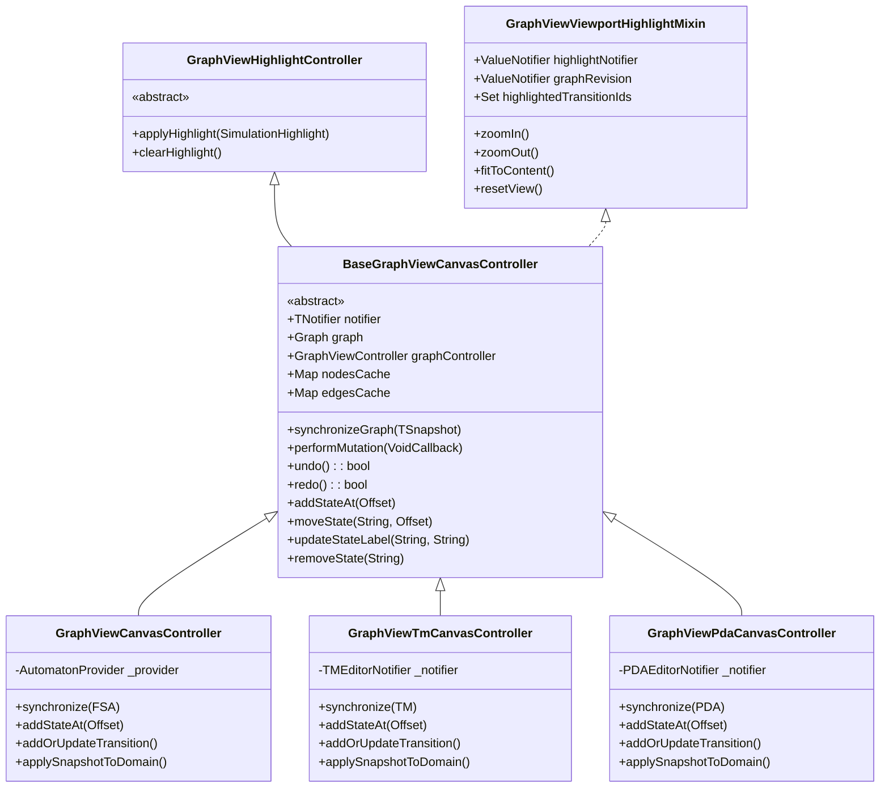
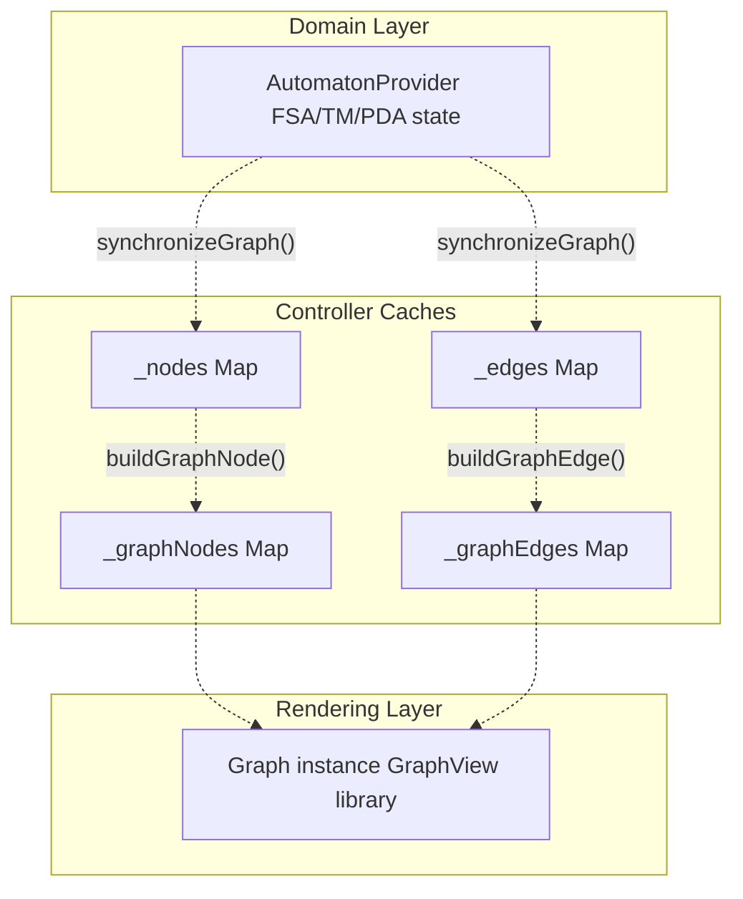
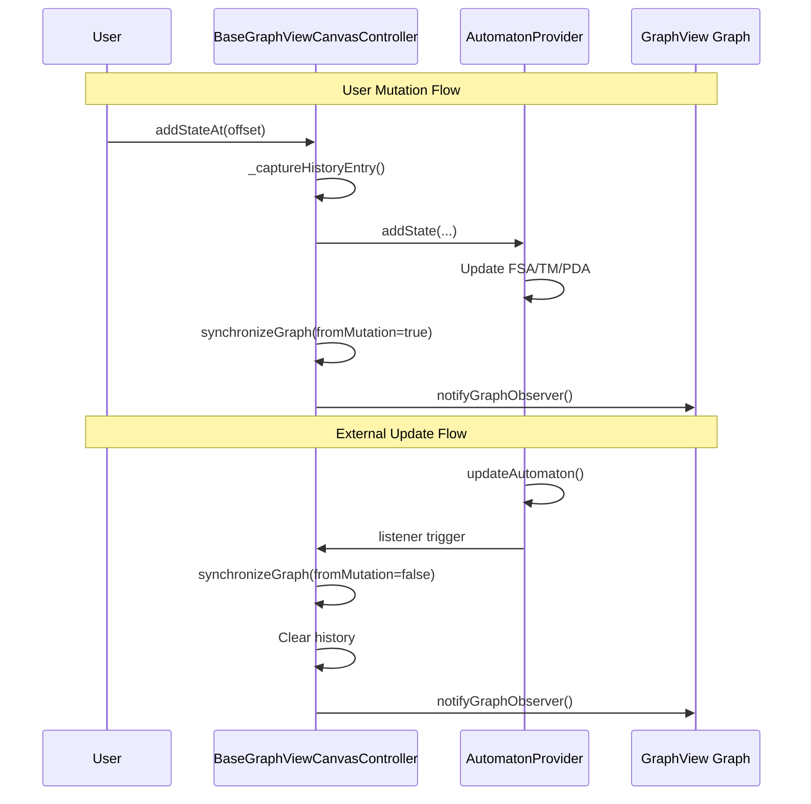
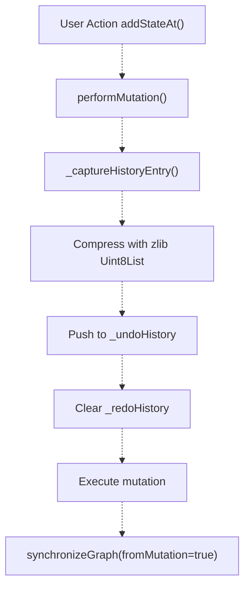
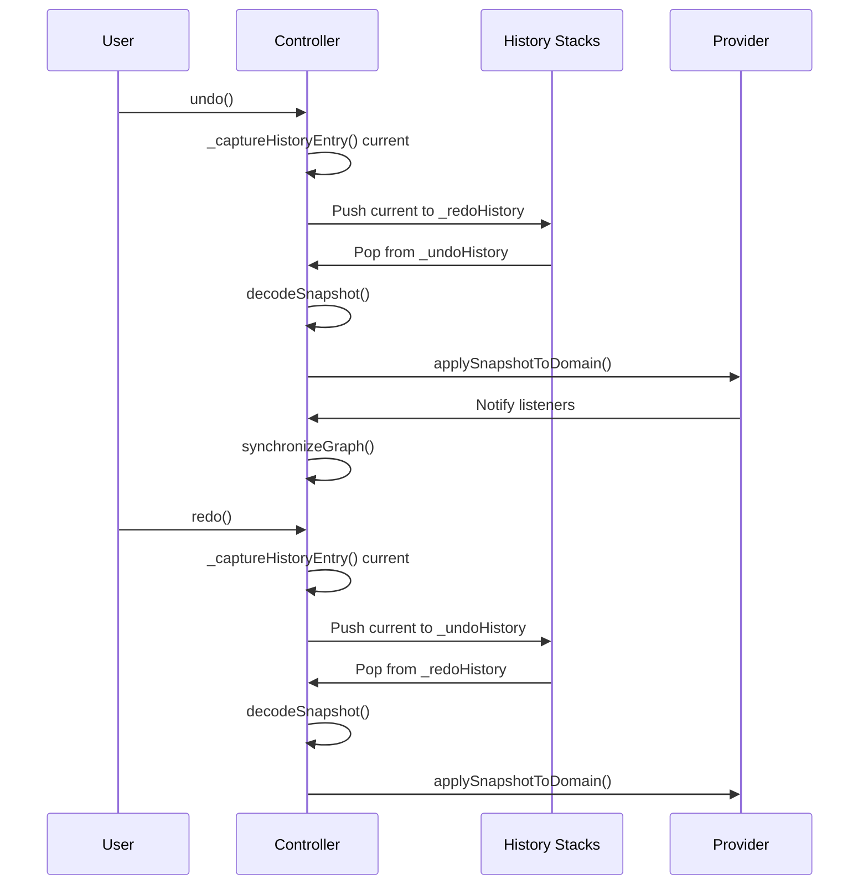
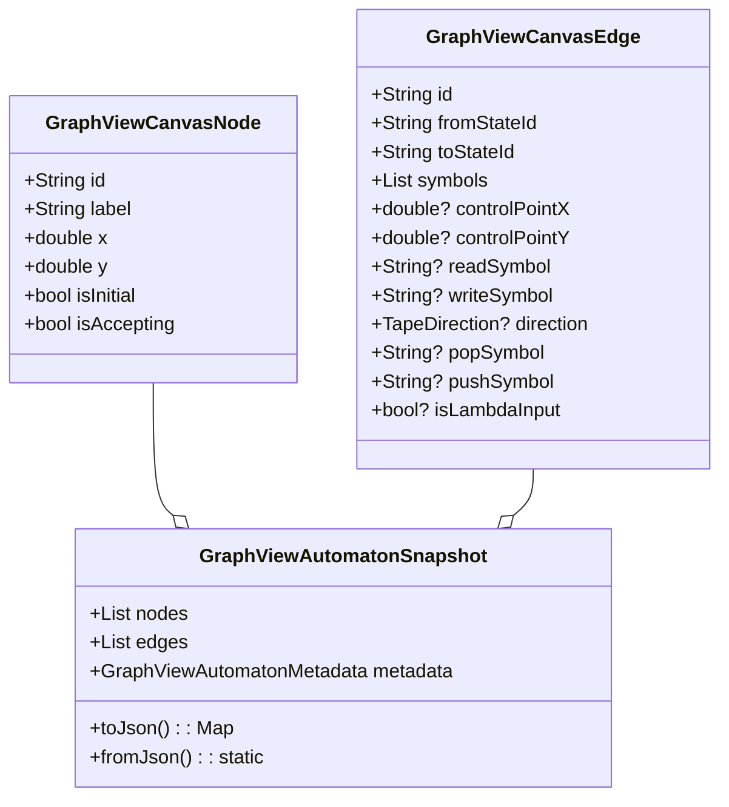
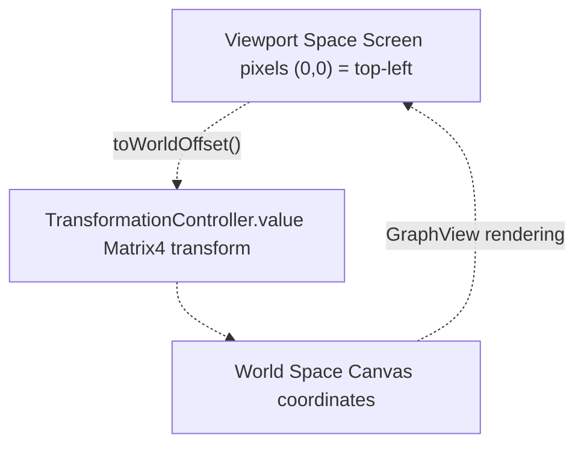
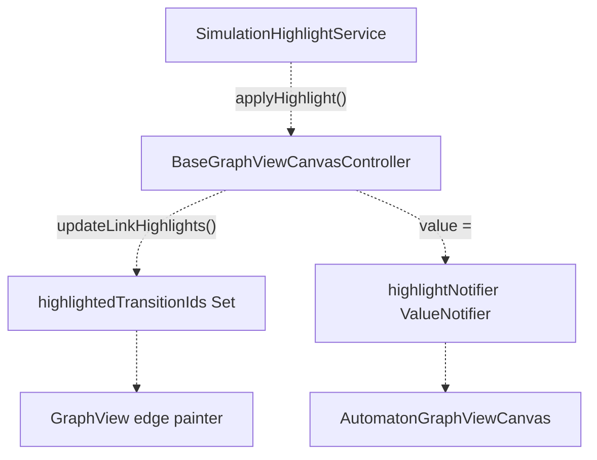

# Canvas Controllers

> **Relevant source files**
> * [lib/features/canvas/graphview/base_graphview_canvas_controller.dart](https://github.com/ThalesMMS/JFlutter/blob/32e808b4/lib/features/canvas/graphview/base_graphview_canvas_controller.dart)
> * [lib/features/canvas/graphview/graphview_canvas_controller.dart](https://github.com/ThalesMMS/JFlutter/blob/32e808b4/lib/features/canvas/graphview/graphview_canvas_controller.dart)
> * [lib/features/canvas/graphview/graphview_pda_canvas_controller.dart](https://github.com/ThalesMMS/JFlutter/blob/32e808b4/lib/features/canvas/graphview/graphview_pda_canvas_controller.dart)
> * [lib/features/canvas/graphview/graphview_pda_mapper.dart](https://github.com/ThalesMMS/JFlutter/blob/32e808b4/lib/features/canvas/graphview/graphview_pda_mapper.dart)
> * [lib/features/canvas/graphview/graphview_tm_canvas_controller.dart](https://github.com/ThalesMMS/JFlutter/blob/32e808b4/lib/features/canvas/graphview/graphview_tm_canvas_controller.dart)
> * [lib/features/canvas/graphview/graphview_tm_mapper.dart](https://github.com/ThalesMMS/JFlutter/blob/32e808b4/lib/features/canvas/graphview/graphview_tm_mapper.dart)
> * [lib/features/canvas/graphview/graphview_viewport_highlight_mixin.dart](https://github.com/ThalesMMS/JFlutter/blob/32e808b4/lib/features/canvas/graphview/graphview_viewport_highlight_mixin.dart)
> * [lib/presentation/widgets/automaton_canvas_tool.dart](https://github.com/ThalesMMS/JFlutter/blob/32e808b4/lib/presentation/widgets/automaton_canvas_tool.dart)
> * [lib/presentation/widgets/mobile_automaton_controls.dart](https://github.com/ThalesMMS/JFlutter/blob/32e808b4/lib/presentation/widgets/mobile_automaton_controls.dart)
> * [lib/presentation/widgets/pda_canvas_graphview.dart](https://github.com/ThalesMMS/JFlutter/blob/32e808b4/lib/presentation/widgets/pda_canvas_graphview.dart)
> * [lib/presentation/widgets/tm_canvas_graphview.dart](https://github.com/ThalesMMS/JFlutter/blob/32e808b4/lib/presentation/widgets/tm_canvas_graphview.dart)

## Purpose and Scope

Canvas Controllers mediate between Riverpod state providers (domain layer) and the GraphView rendering system (presentation layer). They manage bidirectional synchronization, maintain visual caches, coordinate user interactions, and provide undo/redo functionality through compressed snapshot history.

This page documents the controller architecture, specialization patterns, and synchronization mechanisms. For information about canvas rendering and visual components, see [Canvas Architecture](#4.1). For tool-based interactions and gesture handling, see [Canvas Tools and Interaction](#4.3).

**Sources:** [lib/features/canvas/graphview/base_graphview_canvas_controller.dart L1-L595](https://github.com/ThalesMMS/JFlutter/blob/32e808b4/lib/features/canvas/graphview/base_graphview_canvas_controller.dart#L1-L595)

---

## Controller Hierarchy

The canvas controller system uses a base class pattern with specialized implementations for each automaton type:



**Sources:** [lib/features/canvas/graphview/base_graphview_canvas_controller.dart L58-L60](https://github.com/ThalesMMS/JFlutter/blob/32e808b4/lib/features/canvas/graphview/base_graphview_canvas_controller.dart#L58-L60)

 [lib/features/canvas/graphview/graphview_canvas_controller.dart L33-L34](https://github.com/ThalesMMS/JFlutter/blob/32e808b4/lib/features/canvas/graphview/graphview_canvas_controller.dart#L33-L34)

 [lib/features/canvas/graphview/graphview_tm_canvas_controller.dart L37-L38](https://github.com/ThalesMMS/JFlutter/blob/32e808b4/lib/features/canvas/graphview/graphview_tm_canvas_controller.dart#L37-L38)

 [lib/features/canvas/graphview/graphview_pda_canvas_controller.dart L34-L35](https://github.com/ThalesMMS/JFlutter/blob/32e808b4/lib/features/canvas/graphview/graphview_pda_canvas_controller.dart#L34-L35)

---

## Base Controller Infrastructure

### Core Responsibilities

`BaseGraphViewCanvasController` provides shared infrastructure for all canvas controllers:

| Component | Type | Purpose |
| --- | --- | --- |
| `notifier` | `TNotifier` | Reference to domain state provider |
| `graph` | `Graph` | GraphView graph instance |
| `graphController` | `GraphViewController` | Viewport and transformation control |
| `_nodes` | `Map<String, GraphViewCanvasNode>` | Node cache for rendering |
| `_edges` | `Map<String, GraphViewCanvasEdge>` | Edge cache for rendering |
| `_graphNodes` | `Map<String, Node>` | GraphView node instances |
| `_graphEdges` | `Map<String, Edge>` | GraphView edge instances |
| `_undoHistory` | `List<_GraphHistoryEntry>` | Compressed undo snapshots |
| `_redoHistory` | `List<_GraphHistoryEntry>` | Compressed redo snapshots |

**Sources:** [lib/features/canvas/graphview/base_graphview_canvas_controller.dart L87-L109](https://github.com/ThalesMMS/JFlutter/blob/32e808b4/lib/features/canvas/graphview/base_graphview_canvas_controller.dart#L87-L109)

### Cache Management

Controllers maintain two parallel cache systems:

1. **Canvas Model Cache**: `_nodes` and `_edges` store `GraphViewCanvasNode`/`GraphViewCanvasEdge` for rendering metadata
2. **GraphView Instance Cache**: `_graphNodes` and `_graphEdges` hold `Node`/`Edge` instances managed by the `Graph`



**Sources:** [lib/features/canvas/graphview/base_graphview_canvas_controller.dart L98-L101](https://github.com/ThalesMMS/JFlutter/blob/32e808b4/lib/features/canvas/graphview/base_graphview_canvas_controller.dart#L98-L101)

 [lib/features/canvas/graphview/base_graphview_canvas_controller.dart L326-L494](https://github.com/ThalesMMS/JFlutter/blob/32e808b4/lib/features/canvas/graphview/base_graphview_canvas_controller.dart#L326-L494)

### Cache Eviction

When the incoming snapshot exceeds `cacheEvictionThreshold` (default 250), the controller evicts all cached instances to prevent memory issues:

```
final shouldEvictCaches =    incomingNodes.length > cacheEvictionThreshold ||    incomingEdges.length > cacheEvictionThreshold;if (shouldEvictCaches) {  _evictGraphCaches(notifyGraph: false);}
```

**Sources:** [lib/features/canvas/graphview/base_graphview_canvas_controller.dart L346-L354](https://github.com/ThalesMMS/JFlutter/blob/32e808b4/lib/features/canvas/graphview/base_graphview_canvas_controller.dart#L346-L354)

 [lib/features/canvas/graphview/base_graphview_canvas_controller.dart L572-L594](https://github.com/ThalesMMS/JFlutter/blob/32e808b4/lib/features/canvas/graphview/base_graphview_canvas_controller.dart#L572-L594)

---

## Synchronization Mechanism

### Bidirectional Data Flow

Controllers synchronize in both directions:



**Sources:** [lib/features/canvas/graphview/base_graphview_canvas_controller.dart L255-L281](https://github.com/ThalesMMS/JFlutter/blob/32e808b4/lib/features/canvas/graphview/base_graphview_canvas_controller.dart#L255-L281)

 [lib/features/canvas/graphview/base_graphview_canvas_controller.dart L326-L494](https://github.com/ThalesMMS/JFlutter/blob/32e808b4/lib/features/canvas/graphview/base_graphview_canvas_controller.dart#L326-L494)

### Synchronization Algorithm

The `synchronizeGraph` method performs incremental updates:

1. **Convert domain data to snapshot**: `toSnapshot(TSnapshot)`
2. **External sync detection**: Clear history if `!fromMutation`
3. **Eviction check**: Clear caches if size exceeds threshold
4. **Compute diffs**: * Identify removed nodes → remove from `_nodes`, `_graphNodes`, and `graph` * Identify removed edges → remove from `_edges`, `_graphEdges`, and `graph` * Update existing nodes if position or metadata changed * Add new nodes/edges as needed
5. **Sanitize highlights**: Remove highlights for deleted elements
6. **Notify observers**: Call `graph.notifyGraphObserver()` if dirty

**Sources:** [lib/features/canvas/graphview/base_graphview_canvas_controller.dart L326-L494](https://github.com/ThalesMMS/JFlutter/blob/32e808b4/lib/features/canvas/graphview/base_graphview_canvas_controller.dart#L326-L494)

---

## Specialized Controllers

### FSA Controller: GraphViewCanvasController

Manages finite state automata with `AutomatonProvider`:

| Method | Provider Operation | Notes |
| --- | --- | --- |
| `addStateAt(Offset)` | `addState(...)` | First state auto-marked initial |
| `moveState(String, Offset)` | `moveState(...)` | Updates position only |
| `updateStateLabel(String, String)` | `updateStateLabel(...)` | Empty label defaults to ID |
| `updateStateFlags(String, ...)` | `updateStateFlags(...)` | Sets initial/accepting flags |
| `addOrUpdateTransition(...)` | `addOrUpdateTransition(...)` | Supports multi-symbol transitions |
| `removeState(String)` | `removeState(id)` | Cascades to transitions |
| `removeTransition(String)` | `removeTransition(id)` | Removes single transition |

**ID Generation**: Uses `state_N` for IDs, `qN` for labels, where `N` is the first available index.

**Sources:** [lib/features/canvas/graphview/graphview_canvas_controller.dart L33-L277](https://github.com/ThalesMMS/JFlutter/blob/32e808b4/lib/features/canvas/graphview/graphview_canvas_controller.dart#L33-L277)

### TM Controller: GraphViewTmCanvasController

Manages Turing machines with `TMEditorNotifier`:

| Method | Provider Operation | Special Handling |
| --- | --- | --- |
| `addStateAt(Offset)` | `upsertState(...)` | Uses `upsertState` not `addState` |
| `addOrUpdateTransition(...)` | `addOrUpdateTransition(...)` | Includes `readSymbol`, `writeSymbol`, `direction` |
| `updateTransitionControlPoint(...)` | `addOrUpdateTransition(...)` | Partial update preserving symbols |

**Tape Direction Mapping**: Transitions include `TapeDirection` enum (left/right/stay) and optional `tapeNumber` for multi-tape TMs.

**Sources:** [lib/features/canvas/graphview/graphview_tm_canvas_controller.dart L37-L313](https://github.com/ThalesMMS/JFlutter/blob/32e808b4/lib/features/canvas/graphview/graphview_tm_canvas_controller.dart#L37-L313)

### PDA Controller: GraphViewPdaCanvasController

Manages pushdown automata with `PDAEditorNotifier`:

| Method | Provider Operation | Stack Handling |
| --- | --- | --- |
| `addStateAt(Offset)` | `addOrUpdateState(...)` | Standard state creation |
| `addOrUpdateTransition(...)` | `upsertTransition(...)` | Includes `readSymbol`, `popSymbol`, `pushSymbol` |
|  |  | Plus `isLambdaInput`, `isLambdaPop`, `isLambdaPush` |
| `updateTransitionControlPoint(...)` | `upsertTransition(id, controlPoint)` | Partial update preserving stack ops |

**Lambda Handling**: Boolean flags indicate whether each component (input/pop/push) is a lambda (ε) transition.

**Sources:** [lib/features/canvas/graphview/graphview_pda_canvas_controller.dart L34-L303](https://github.com/ThalesMMS/JFlutter/blob/32e808b4/lib/features/canvas/graphview/graphview_pda_canvas_controller.dart#L34-L303)

---

## Mutation and History System

### Mutation Wrapper

All user-initiated changes flow through `performMutation`:



**Sources:** [lib/features/canvas/graphview/base_graphview_canvas_controller.dart L255-L281](https://github.com/ThalesMMS/JFlutter/blob/32e808b4/lib/features/canvas/graphview/base_graphview_canvas_controller.dart#L255-L281)

### History Entry Structure

```
class _GraphHistoryEntry {  const _GraphHistoryEntry({    required this.serializedSnapshot,    required this.highlight,  });  final Uint8List serializedSnapshot;  // Compressed JSON  final SimulationHighlight highlight;  // Active highlights}
```

The snapshot stores:

* All nodes with positions, labels, flags
* All edges with control points, symbols
* Metadata (id, name, alphabet)
* Current highlight state

**Compression**: Snapshots are JSON-encoded, UTF-8 byte-encoded, then zlib-compressed to minimize memory usage.

**Sources:** [lib/features/canvas/graphview/base_graphview_canvas_controller.dart L33-L55](https://github.com/ThalesMMS/JFlutter/blob/32e808b4/lib/features/canvas/graphview/base_graphview_canvas_controller.dart#L33-L55)

 [lib/features/canvas/graphview/base_graphview_canvas_controller.dart L525-L543](https://github.com/ThalesMMS/JFlutter/blob/32e808b4/lib/features/canvas/graphview/base_graphview_canvas_controller.dart#L525-L543)

### Undo/Redo Operations



**History Limit**: Default 20 entries (`kDefaultHistoryLimit`). When exceeded, oldest entries are discarded.

**Sources:** [lib/features/canvas/graphview/base_graphview_canvas_controller.dart L283-L323](https://github.com/ThalesMMS/JFlutter/blob/32e808b4/lib/features/canvas/graphview/base_graphview_canvas_controller.dart#L283-L323)

 [lib/features/canvas/graphview/base_graphview_canvas_controller.dart L545-L570](https://github.com/ThalesMMS/JFlutter/blob/32e808b4/lib/features/canvas/graphview/base_graphview_canvas_controller.dart#L545-L570)

### History Invalidation

External synchronization (not from `performMutation`) clears history:

```
final isExternalSync = !fromMutation;if (isExternalSync &&    (_undoHistory.isNotEmpty || _redoHistory.isNotEmpty)) {  _undoHistory.clear();  _redoHistory.clear();  graphRevision.value++;}
```

This prevents inconsistencies when:

* Loading a new automaton
* Applying algorithm results
* Importing from file

**Sources:** [lib/features/canvas/graphview/base_graphview_canvas_controller.dart L328-L337](https://github.com/ThalesMMS/JFlutter/blob/32e808b4/lib/features/canvas/graphview/base_graphview_canvas_controller.dart#L328-L337)

---

## Snapshot and Domain Conversion

### Snapshot Architecture

Controllers use `GraphViewAutomatonSnapshot` as an intermediate format:



**Sources:** [lib/features/canvas/graphview/graphview_canvas_models.dart](https://github.com/ThalesMMS/JFlutter/blob/32e808b4/lib/features/canvas/graphview/graphview_canvas_models.dart)

 (referenced in tests)

### Mapper Classes

Each controller uses a specialized mapper:

| Mapper | Domain Type | Key Conversions |
| --- | --- | --- |
| `GraphViewAutomatonMapper` | `FSA` | Groups transitions by (from, to) pair, merges symbols |
| `GraphViewTmMapper` | `TM` | Preserves tape direction, read/write symbols |
| `GraphViewPdaMapper` | `PDA` | Handles stack symbols, lambda flags |

**Conversion Flow**:

1. **Domain → Snapshot**: `Mapper.toSnapshot(FSA/TM/PDA)`
2. **Snapshot → Domain**: `Mapper.mergeIntoTemplate(snapshot, template)`

The `mergeIntoTemplate` method rebuilds domain objects by:

* Creating `State` objects from nodes
* Reconstructing typed transitions (`FSATransition`, `TMTransition`, `PDATransition`)
* Inferring alphabets from transition symbols
* Identifying initial state and accepting states

**Sources:** [lib/features/canvas/graphview/graphview_automaton_mapper.dart](https://github.com/ThalesMMS/JFlutter/blob/32e808b4/lib/features/canvas/graphview/graphview_automaton_mapper.dart)

 [lib/features/canvas/graphview/graphview_tm_mapper.dart](https://github.com/ThalesMMS/JFlutter/blob/32e808b4/lib/features/canvas/graphview/graphview_tm_mapper.dart)

 [lib/features/canvas/graphview/graphview_pda_mapper.dart](https://github.com/ThalesMMS/JFlutter/blob/32e808b4/lib/features/canvas/graphview/graphview_pda_mapper.dart)

---

## Viewport Transformation

### Coordinate Systems

Controllers manage two coordinate spaces:



**Transformation Operations**:

* `toWorldOffset(Offset)`: Converts screen tap to world position
* `resolveViewportCenterWorld()`: Finds world coordinates of viewport center
* `addStateAtCenter()`: Uses viewport center for new state placement

**Sources:** [lib/features/canvas/graphview/base_graphview_canvas_controller.dart L177-L210](https://github.com/ThalesMMS/JFlutter/blob/32e808b4/lib/features/canvas/graphview/base_graphview_canvas_controller.dart#L177-L210)

### Viewport Utilities

The `GraphViewViewportHighlightMixin` provides viewport operations:

| Method | Purpose | Implementation |
| --- | --- | --- |
| `zoomIn()` | Scale by 1.2× | Extract current scale, multiply, clamp to [0.05, 10.0] |
| `zoomOut()` | Scale by 1/1.2× | Extract current scale, divide, clamp to [0.05, 10.0] |
| `resetView()` | Reset to identity | Set transformation to `Matrix4.identity()` |
| `fitToContent()` | Frame all nodes | Calculate bounds, compute scale, center content |

**Fit to Content Algorithm**:

1. Calculate graph bounding box using `graph.calculateGraphBounds()`
2. Compute scale factors: `scaleX = viewport.width / contentWidth`
3. Take minimum scale (preserve aspect ratio) × 0.9 (padding)
4. Clamp to `[0.05, fitToContentMaxScale]` (default 1.75)
5. Center content in viewport

**Sources:** [lib/features/canvas/graphview/graphview_viewport_highlight_mixin.dart L100-L181](https://github.com/ThalesMMS/JFlutter/blob/32e808b4/lib/features/canvas/graphview/graphview_viewport_highlight_mixin.dart#L100-L181)

---

## Highlight Coordination

### Simulation Highlights

Controllers implement `GraphViewHighlightController` for visual feedback during simulation:



**Highlight State**:

* `highlightNotifier`: Broadcasts `SimulationHighlight` with state and transition IDs
* `highlightedTransitionIds`: Set of edge IDs for custom edge rendering
* `graphRevision`: Incremented to trigger repaint when highlights change

**Sanitization**: During synchronization, highlights are pruned to remove references to deleted states/transitions.

**Sources:** [lib/features/canvas/graphview/base_graphview_canvas_controller.dart L465-L478](https://github.com/ThalesMMS/JFlutter/blob/32e808b4/lib/features/canvas/graphview/base_graphview_canvas_controller.dart#L465-L478)

 [lib/features/canvas/graphview/graphview_viewport_highlight_mixin.dart L183-L217](https://github.com/ThalesMMS/JFlutter/blob/32e808b4/lib/features/canvas/graphview/graphview_viewport_highlight_mixin.dart#L183-L217)

---

## Lifecycle Management

### Initialization

Controllers are typically created by canvas widgets:

```
// FSA examplefinal controller = GraphViewCanvasController(  automatonProvider: ref.read(automatonProvider.notifier),  historyLimit: 20,  cacheEvictionThreshold: 250,);
```

**Constructor Parameters**:

* `notifier`: Domain provider instance
* `graph`: Optional pre-existing `Graph` (usually auto-created)
* `viewController`: Optional `GraphViewController` (usually auto-created)
* `transformationController`: Optional `TransformationController` (usually auto-created)
* `historyLimit`: Max undo stack depth
* `cacheEvictionThreshold`: Cache size trigger for eviction

**Sources:** [lib/features/canvas/graphview/base_graphview_canvas_controller.dart L66-L85](https://github.com/ThalesMMS/JFlutter/blob/32e808b4/lib/features/canvas/graphview/base_graphview_canvas_controller.dart#L66-L85)

### Disposal

Controllers must be explicitly disposed to release resources:

```
void dispose() {  _undoHistory.clear();  _redoHistory.clear();  highlightedTransitionIds.clear();  _evictGraphCaches(notifyGraph: false);  disposeViewportHighlight();  // Note: TransformationController disposal handled by GraphView}
```

**Important**: The `TransformationController` is NOT manually disposed even when created by the controller, as GraphView disposes it during widget teardown. Manual disposal causes access-after-disposal errors.

**Sources:** [lib/features/canvas/graphview/base_graphview_canvas_controller.dart L213-L226](https://github.com/ThalesMMS/JFlutter/blob/32e808b4/lib/features/canvas/graphview/base_graphview_canvas_controller.dart#L213-L226)

---

## Testing Strategy

### Controller Tests

Test coverage focuses on:

1. **State Mutations**: Verify provider calls and ID generation
2. **Synchronization**: Ensure cache reflects provider state
3. **History Operations**: Validate undo/redo behavior
4. **Cache Eviction**: Test threshold-based eviction
5. **Coordinate Transformation**: Verify screen-to-world conversions

**Example Test Pattern**:

```
test('addStateAt generates id and forwards to provider', () {  controller.addStateAt(const Offset(120, 80));    expect(provider.addStateCalls, hasLength(1));  final call = provider.addStateCalls.single;  expect(call['id'], isNotEmpty);  expect(call['label'], equals('q0'));  expect(call['x'], closeTo(120, 0.0001));});
```

**Sources:** [test/features/canvas/graphview/graphview_canvas_controller_test.dart](https://github.com/ThalesMMS/JFlutter/blob/32e808b4/test/features/canvas/graphview/graphview_canvas_controller_test.dart)

 [test/features/canvas/graphview/graphview_tm_canvas_controller_test.dart](https://github.com/ThalesMMS/JFlutter/blob/32e808b4/test/features/canvas/graphview/graphview_tm_canvas_controller_test.dart)

 [test/features/canvas/graphview/graphview_pda_canvas_controller_test.dart](https://github.com/ThalesMMS/JFlutter/blob/32e808b4/test/features/canvas/graphview/graphview_pda_canvas_controller_test.dart)

### Mapper Tests

Mapper tests verify:

* **Snapshot Encoding**: Domain → Snapshot preserves all data
* **Template Merging**: Snapshot → Domain reconstructs correctly
* **Alphabet Inference**: Transition symbols populate alphabets
* **State Reconstruction**: Positions, labels, flags preserved

**Sources:** [test/features/canvas/graphview/graphview_automaton_mapper_test.dart](https://github.com/ThalesMMS/JFlutter/blob/32e808b4/test/features/canvas/graphview/graphview_automaton_mapper_test.dart)

 [test/features/canvas/graphview/graphview_tm_mapper_test.dart](https://github.com/ThalesMMS/JFlutter/blob/32e808b4/test/features/canvas/graphview/graphview_tm_mapper_test.dart)

 [test/features/canvas/graphview/graphview_pda_mapper_test.dart](https://github.com/ThalesMMS/JFlutter/blob/32e808b4/test/features/canvas/graphview/graphview_pda_mapper_test.dart)

---

## Implementation Notes

### Synchronization Flag

The `_isSynchronizing` flag prevents recursive synchronization:

```
bool _isSynchronizing = false;void performMutation(VoidCallback mutation) {  if (_isSynchronizing) {    mutation();  // Don't capture history during sync    return;  }  // ... capture history, execute mutation}
```

This ensures history is only captured for direct user actions, not during internal synchronization operations.

**Sources:** [lib/features/canvas/graphview/base_graphview_canvas_controller.dart L106](https://github.com/ThalesMMS/JFlutter/blob/32e808b4/lib/features/canvas/graphview/base_graphview_canvas_controller.dart#L106-L106)

 [lib/features/canvas/graphview/base_graphview_canvas_controller.dart L257-L262](https://github.com/ThalesMMS/JFlutter/blob/32e808b4/lib/features/canvas/graphview/base_graphview_canvas_controller.dart#L257-L262)

### Graph Revision Counter

The `graphRevision` notifier triggers repaints when the graph structure changes but GraphView doesn't detect it:

```
graphRevision.value++;  // Increment to force repaint
```

Useful for:

* Highlight changes without structural changes
* Metadata updates (labels, flags)
* External synchronization events

**Sources:** [lib/features/canvas/graphview/graphview_viewport_highlight_mixin.dart L61](https://github.com/ThalesMMS/JFlutter/blob/32e808b4/lib/features/canvas/graphview/graphview_viewport_highlight_mixin.dart#L61-L61)

### Control Point Handling

Control points define transition curve geometry:

* `null` control point → straight line
* Non-null control point → quadratic Bézier curve

Controllers preserve control points during partial updates (e.g., label changes) by reading existing edge data and resubmitting with updated fields.

**Sources:** [lib/features/canvas/graphview/graphview_tm_canvas_controller.dart L234-L261](https://github.com/ThalesMMS/JFlutter/blob/32e808b4/lib/features/canvas/graphview/graphview_tm_canvas_controller.dart#L234-L261)

 [lib/features/canvas/graphview/graphview_pda_canvas_controller.dart L242-L256](https://github.com/ThalesMMS/JFlutter/blob/32e808b4/lib/features/canvas/graphview/graphview_pda_canvas_controller.dart#L242-L256)

Refresh this wiki

Last indexed: 30 December 2025 ([32e808](https://github.com/ThalesMMS/JFlutter/commit/32e808b4))

### On this page

* [Canvas Controllers](#4.2-canvas-controllers)
* [Purpose and Scope](#4.2-purpose-and-scope)
* [Controller Hierarchy](#4.2-controller-hierarchy)
* [Base Controller Infrastructure](#4.2-base-controller-infrastructure)
* [Core Responsibilities](#4.2-core-responsibilities)
* [Cache Management](#4.2-cache-management)
* [Cache Eviction](#4.2-cache-eviction)
* [Synchronization Mechanism](#4.2-synchronization-mechanism)
* [Bidirectional Data Flow](#4.2-bidirectional-data-flow)
* [Synchronization Algorithm](#4.2-synchronization-algorithm)
* [Specialized Controllers](#4.2-specialized-controllers)
* [FSA Controller: GraphViewCanvasController](#4.2-fsa-controller-object-object)
* [TM Controller: GraphViewTmCanvasController](#4.2-tm-controller-object-object)
* [PDA Controller: GraphViewPdaCanvasController](#4.2-pda-controller-object-object)
* [Mutation and History System](#4.2-mutation-and-history-system)
* [Mutation Wrapper](#4.2-mutation-wrapper)
* [History Entry Structure](#4.2-history-entry-structure)
* [Undo/Redo Operations](#4.2-undoredo-operations)
* [History Invalidation](#4.2-history-invalidation)
* [Snapshot and Domain Conversion](#4.2-snapshot-and-domain-conversion)
* [Snapshot Architecture](#4.2-snapshot-architecture)
* [Mapper Classes](#4.2-mapper-classes)
* [Viewport Transformation](#4.2-viewport-transformation)
* [Coordinate Systems](#4.2-coordinate-systems)
* [Viewport Utilities](#4.2-viewport-utilities)
* [Highlight Coordination](#4.2-highlight-coordination)
* [Simulation Highlights](#4.2-simulation-highlights)
* [Lifecycle Management](#4.2-lifecycle-management)
* [Initialization](#4.2-initialization)
* [Disposal](#4.2-disposal)
* [Testing Strategy](#4.2-testing-strategy)
* [Controller Tests](#4.2-controller-tests)
* [Mapper Tests](#4.2-mapper-tests)
* [Implementation Notes](#4.2-implementation-notes)
* [Synchronization Flag](#4.2-synchronization-flag)
* [Graph Revision Counter](#4.2-graph-revision-counter)
* [Control Point Handling](#4.2-control-point-handling)

Ask Devin about JFlutter