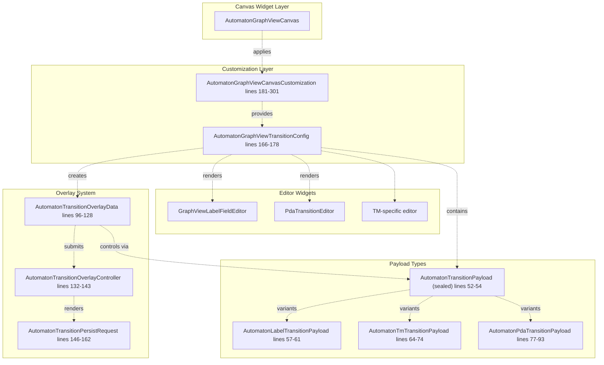
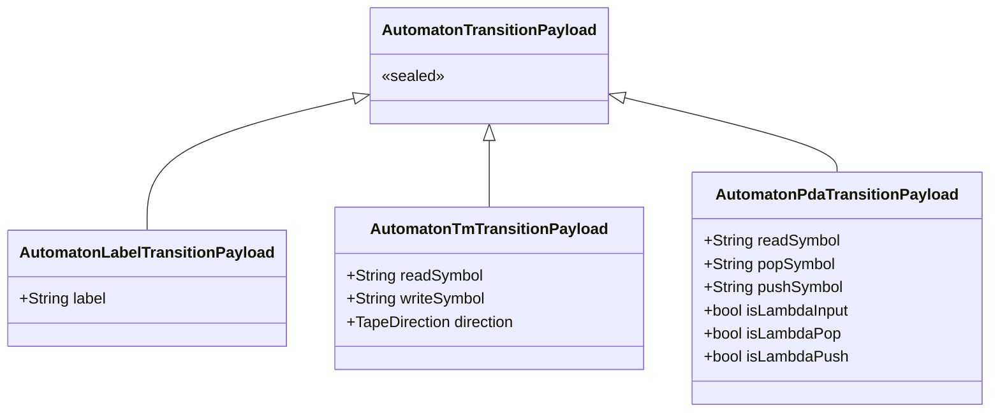
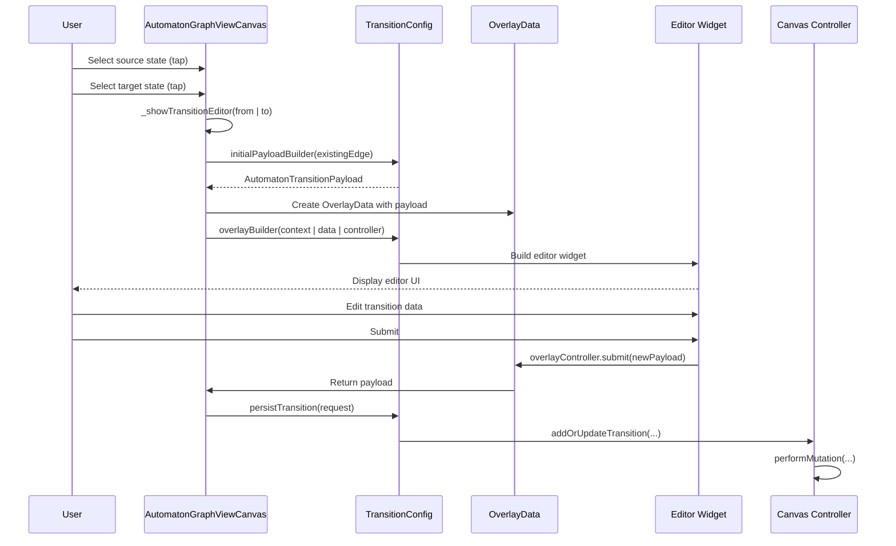
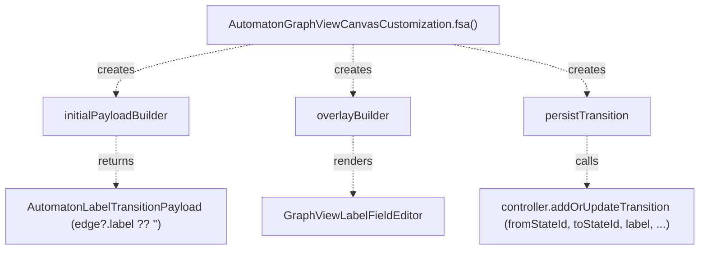
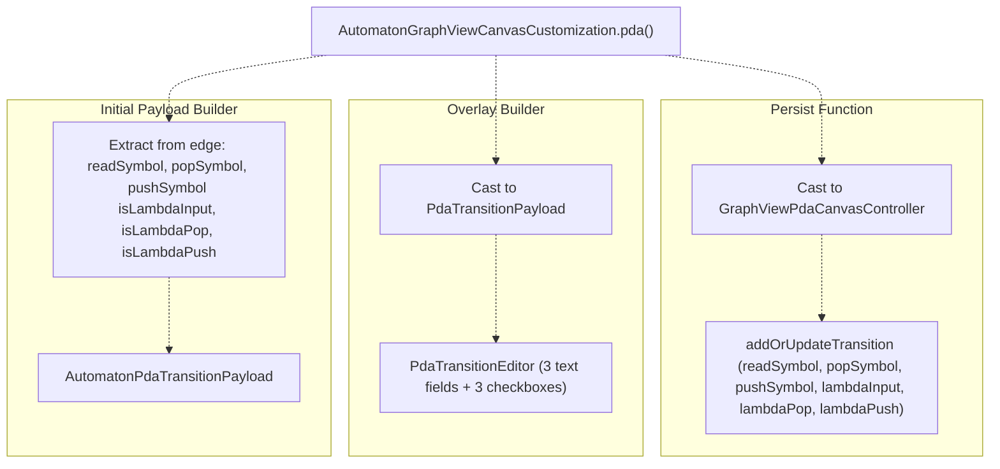
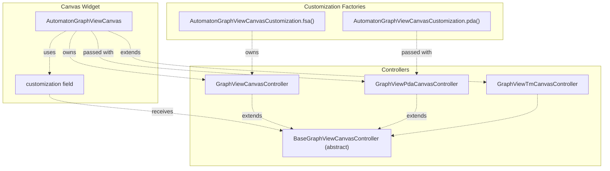

# Canvas Customization System

> **Relevant source files**
> * [lib/features/canvas/graphview/base_graphview_canvas_controller.dart](https://github.com/ThalesMMS/JFlutter/blob/32e808b4/lib/features/canvas/graphview/base_graphview_canvas_controller.dart)
> * [lib/features/canvas/graphview/graphview_canvas_controller.dart](https://github.com/ThalesMMS/JFlutter/blob/32e808b4/lib/features/canvas/graphview/graphview_canvas_controller.dart)
> * [lib/features/canvas/graphview/graphview_pda_canvas_controller.dart](https://github.com/ThalesMMS/JFlutter/blob/32e808b4/lib/features/canvas/graphview/graphview_pda_canvas_controller.dart)
> * [lib/features/canvas/graphview/graphview_pda_mapper.dart](https://github.com/ThalesMMS/JFlutter/blob/32e808b4/lib/features/canvas/graphview/graphview_pda_mapper.dart)
> * [lib/features/canvas/graphview/graphview_tm_canvas_controller.dart](https://github.com/ThalesMMS/JFlutter/blob/32e808b4/lib/features/canvas/graphview/graphview_tm_canvas_controller.dart)
> * [lib/features/canvas/graphview/graphview_tm_mapper.dart](https://github.com/ThalesMMS/JFlutter/blob/32e808b4/lib/features/canvas/graphview/graphview_tm_mapper.dart)
> * [lib/features/canvas/graphview/graphview_viewport_highlight_mixin.dart](https://github.com/ThalesMMS/JFlutter/blob/32e808b4/lib/features/canvas/graphview/graphview_viewport_highlight_mixin.dart)
> * [lib/presentation/widgets/automaton_graphview_canvas.dart](https://github.com/ThalesMMS/JFlutter/blob/32e808b4/lib/presentation/widgets/automaton_graphview_canvas.dart)
> * [lib/presentation/widgets/graphview_canvas_toolbar.dart](https://github.com/ThalesMMS/JFlutter/blob/32e808b4/lib/presentation/widgets/graphview_canvas_toolbar.dart)
> * [test/widget/presentation/automaton_graphview_canvas_test.dart](https://github.com/ThalesMMS/JFlutter/blob/32e808b4/test/widget/presentation/automaton_graphview_canvas_test.dart)
> * [test/widget/presentation/graphview_canvas_toolbar_test.dart](https://github.com/ThalesMMS/JFlutter/blob/32e808b4/test/widget/presentation/graphview_canvas_toolbar_test.dart)
> * [test/widget/presentation/graphview_label_field_editor_test.dart](https://github.com/ThalesMMS/JFlutter/blob/32e808b4/test/widget/presentation/graphview_label_field_editor_test.dart)

## Purpose and Scope

The Canvas Customization System provides a polymorphic architecture that allows the `AutomatonGraphViewCanvas` widget to handle different automaton types (FSA, PDA, TM) without requiring separate canvas implementations. This system defines how transitions are created, edited, and persisted based on the specific requirements of each automaton type.

For information about the canvas widget itself, see [AutomatonGraphViewCanvas Widget](4a%20AutomatonGraphViewCanvas-Widget.md). For controller implementations, see [Canvas Controllers](4b%20Canvas-Controllers.md). For user interaction patterns, see [Canvas Tools and Interaction](4d%20Canvas-Tools-and-Interaction.md).

**Sources:** [lib/presentation/widgets/automaton_graphview_canvas.dart L1-L301](https://github.com/ThalesMMS/JFlutter/blob/32e808b4/lib/presentation/widgets/automaton_graphview_canvas.dart#L1-L301)

---

## Architecture Overview

The customization system consists of three layers that work together to provide type-specific behavior:



**Sources:** [lib/presentation/widgets/automaton_graphview_canvas.dart L52-L301](https://github.com/ThalesMMS/JFlutter/blob/32e808b4/lib/presentation/widgets/automaton_graphview_canvas.dart#L52-L301)

---

## Customization Components

### AutomatonGraphViewCanvasCustomization

The root customization object that defines type-specific canvas behavior. It contains a single required field and two optional flags:

| Field | Type | Purpose |
| --- | --- | --- |
| `transitionConfigBuilder` | `Function(BaseGraphViewCanvasController) → AutomatonGraphViewTransitionConfig` | Builds the transition configuration for the current automaton type |
| `enableStateDrag` | `bool` | Whether state dragging is allowed (default: `true`) |
| `enableToolSelection` | `bool` | Whether tool selection is enabled (default: `true`) |

The canvas applies customization during initialization and whenever the customization object changes:

[lib/presentation/widgets/automaton_graphview_canvas.dart L562-L574](https://github.com/ThalesMMS/JFlutter/blob/32e808b4/lib/presentation/widgets/automaton_graphview_canvas.dart#L562-L574)

**Sources:** [lib/presentation/widgets/automaton_graphview_canvas.dart L181-L195](https://github.com/ThalesMMS/JFlutter/blob/32e808b4/lib/presentation/widgets/automaton_graphview_canvas.dart#L181-L195)

### AutomatonGraphViewTransitionConfig

Describes how to handle transition creation and editing for a specific automaton type:

| Field | Type | Purpose |
| --- | --- | --- |
| `initialPayloadBuilder` | `Function(GraphViewCanvasEdge?) → AutomatonTransitionPayload` | Creates the initial payload from an existing edge (for editing) or empty values (for creation) |
| `overlayBuilder` | `AutomatonTransitionOverlayBuilder` | Renders the editor widget for the transition |
| `persistTransition` | `Function(AutomatonTransitionPersistRequest)` | Persists the edited transition to the domain model |

**Sources:** [lib/presentation/widgets/automaton_graphview_canvas.dart L166-L178](https://github.com/ThalesMMS/JFlutter/blob/32e808b4/lib/presentation/widgets/automaton_graphview_canvas.dart#L166-L178)

### Payload Type Hierarchy

The system uses a sealed class hierarchy to represent transition data:



**Sources:** [lib/presentation/widgets/automaton_graphview_canvas.dart L52-L93](https://github.com/ThalesMMS/JFlutter/blob/32e808b4/lib/presentation/widgets/automaton_graphview_canvas.dart#L52-L93)

---

## Transition Editing Flow

The transition editing workflow follows a consistent pattern regardless of automaton type:



**Sources:** [lib/presentation/widgets/automaton_graphview_canvas.dart L970-L1072](https://github.com/ThalesMMS/JFlutter/blob/32e808b4/lib/presentation/widgets/automaton_graphview_canvas.dart#L970-L1072)

### Overlay System Components

**AutomatonTransitionOverlayData** (lines 96-128) contains immutable information about the current editing session:

| Field | Type | Purpose |
| --- | --- | --- |
| `fromStateId` | `String` | Source state identifier |
| `toStateId` | `String` | Target state identifier |
| `worldAnchor` | `Offset` | Control point position in world coordinates |
| `payload` | `AutomatonTransitionPayload` | Current transition data |
| `transitionId` | `String?` | Existing transition ID (null for new transitions) |
| `edge` | `GraphViewCanvasEdge?` | Reference to existing edge being edited |

**AutomatonTransitionOverlayController** (lines 132-143) provides callbacks for the editor widget:

* `submit(AutomatonTransitionPayload)` - Persists the edited transition
* `cancel()` - Dismisses the editor without changes

**AutomatonTransitionPersistRequest** (lines 146-162) packages the submitted data for persistence:

| Field | Purpose |
| --- | --- |
| `fromStateId`, `toStateId` | State identifiers |
| `transitionId` | Existing ID or null for new transitions |
| `payload` | The submitted payload |
| `worldAnchor` | Control point position |
| `controller` | Canvas controller to invoke |

**Sources:** [lib/presentation/widgets/automaton_graphview_canvas.dart L96-L162](https://github.com/ThalesMMS/JFlutter/blob/32e808b4/lib/presentation/widgets/automaton_graphview_canvas.dart#L96-L162)

---

## Factory Implementations

### FSA Customization

The FSA customization uses simple string labels for transitions:



Implementation details:

1. **Initial Payload Builder** (lines 200-201): * Extracts label from existing edge or uses empty string * Returns `AutomatonLabelTransitionPayload(edge?.label ?? '')`
2. **Overlay Builder** (lines 202-210): * Casts payload to `AutomatonLabelTransitionPayload` * Renders `GraphViewLabelFieldEditor` with the current label * Wires up submit/cancel callbacks
3. **Persist Function** (lines 212-223): * Casts payload to `AutomatonLabelTransitionPayload` * Casts controller to `GraphViewCanvasController` * Invokes `addOrUpdateTransition` with label and control point

**Sources:** [lib/presentation/widgets/automaton_graphview_canvas.dart L196-L227](https://github.com/ThalesMMS/JFlutter/blob/32e808b4/lib/presentation/widgets/automaton_graphview_canvas.dart#L196-L227)

### PDA Customization

The PDA customization handles stack operations with lambda flags:



Implementation details:

1. **Initial Payload Builder** (lines 234-246): * Extracts `readSymbol`, `popSymbol`, `pushSymbol` from edge (or empty strings) * Extracts lambda flags from edge (or defaults to `false`) * Returns `AutomatonPdaTransitionPayload` with all fields
2. **Overlay Builder** (lines 247-277): * Casts payload to `AutomatonPdaTransitionPayload` * Renders `PdaTransitionEditor` with initial values * Provides callback that constructs new payload from editor fields
3. **Persist Function** (lines 279-296): * Casts payload to `AutomatonPdaTransitionPayload` * Casts controller to `GraphViewPdaCanvasController` * Invokes PDA-specific `addOrUpdateTransition` with stack operation parameters

**Sources:** [lib/presentation/widgets/automaton_graphview_canvas.dart L229-L300](https://github.com/ThalesMMS/JFlutter/blob/32e808b4/lib/presentation/widgets/automaton_graphview_canvas.dart#L229-L300)

 [lib/presentation/widgets/transition_editors/pda_transition_editor.dart L1-L300](https://github.com/ThalesMMS/JFlutter/blob/32e808b4/lib/presentation/widgets/transition_editors/pda_transition_editor.dart#L1-L300)

---

## Integration with Canvas Controllers

The customization system integrates with canvas controllers through polymorphic controller operations:



The `transitionConfigBuilder` receives the controller and returns configuration that can invoke controller-specific methods:

| Automaton Type | Controller Class | Transition Method |
| --- | --- | --- |
| FSA | `GraphViewCanvasController` | `addOrUpdateTransition(fromStateId, toStateId, label, transitionId, controlPointX, controlPointY)` |
| PDA | `GraphViewPdaCanvasController` | `addOrUpdateTransition(fromStateId, toStateId, readSymbol, popSymbol, pushSymbol, isLambdaInput, isLambdaPop, isLambdaPush, transitionId, controlPointX, controlPointY)` |
| TM | `GraphViewTmCanvasController` | `addOrUpdateTransition(fromStateId, toStateId, readSymbol, writeSymbol, direction, transitionId, controlPointX, controlPointY)` |

**Sources:** [lib/features/canvas/graphview/graphview_canvas_controller.dart L208-L230](https://github.com/ThalesMMS/JFlutter/blob/32e808b4/lib/features/canvas/graphview/graphview_canvas_controller.dart#L208-L230)

 [lib/features/canvas/graphview/graphview_pda_canvas_controller.dart L204-L239](https://github.com/ThalesMMS/JFlutter/blob/32e808b4/lib/features/canvas/graphview/graphview_pda_canvas_controller.dart#L204-L239)

 [lib/features/canvas/graphview/graphview_tm_canvas_controller.dart L204-L232](https://github.com/ThalesMMS/JFlutter/blob/32e808b4/lib/features/canvas/graphview/graphview_tm_canvas_controller.dart#L204-L232)

### Canvas Initialization with Customization

The canvas applies customization during widget initialization:

[lib/presentation/widgets/automaton_graphview_canvas.dart L417](https://github.com/ThalesMMS/JFlutter/blob/32e808b4/lib/presentation/widgets/automaton_graphview_canvas.dart#L417-L417)

And whenever the customization changes:

[lib/presentation/widgets/automaton_graphview_canvas.dart L501-L504](https://github.com/ThalesMMS/JFlutter/blob/32e808b4/lib/presentation/widgets/automaton_graphview_canvas.dart#L501-L504)

The `_applyCustomization` method resolves defaults and enforces constraints:

[lib/presentation/widgets/automaton_graphview_canvas.dart L562-L574](https://github.com/ThalesMMS/JFlutter/blob/32e808b4/lib/presentation/widgets/automaton_graphview_canvas.dart#L562-L574)

**Sources:** [lib/presentation/widgets/automaton_graphview_canvas.dart L387-L432](https://github.com/ThalesMMS/JFlutter/blob/32e808b4/lib/presentation/widgets/automaton_graphview_canvas.dart#L387-L432)

 [lib/presentation/widgets/automaton_graphview_canvas.dart L562-L574](https://github.com/ThalesMMS/JFlutter/blob/32e808b4/lib/presentation/widgets/automaton_graphview_canvas.dart#L562-L574)

---

## Extension Points

The customization system can be extended for new automaton types by:

### 1. Define a New Payload Type

Create a new class extending `AutomatonTransitionPayload`:

```
class AutomatonNewTypeTransitionPayload extends AutomatonTransitionPayload {  const AutomatonNewTypeTransitionPayload({    required this.fieldA,    required this.fieldB,  });  final String fieldA;  final int fieldB;}
```

### 2. Create a Custom Editor Widget

Implement a widget that accepts initial values and provides submit/cancel callbacks:

```
class NewTypeTransitionEditor extends StatelessWidget {  const NewTypeTransitionEditor({    required this.initialFieldA,    required this.initialFieldB,    required this.onSubmit,    required this.onCancel,  });  final String initialFieldA;  final int initialFieldB;  final void Function({required String fieldA, required int fieldB}) onSubmit;  final VoidCallback onCancel;  // ... implementation}
```

### 3. Implement the Customization Factory

Create a factory method that wires together the three components:

```javascript
factory AutomatonGraphViewCanvasCustomization.newType() {  return AutomatonGraphViewCanvasCustomization(    transitionConfigBuilder: (controller) {      return AutomatonGraphViewTransitionConfig(        initialPayloadBuilder: (edge) => AutomatonNewTypeTransitionPayload(          fieldA: edge?.customFieldA ?? '',          fieldB: edge?.customFieldB ?? 0,        ),        overlayBuilder: (context, data, overlayController) {          final payload = data.payload as AutomatonNewTypeTransitionPayload;          return NewTypeTransitionEditor(            initialFieldA: payload.fieldA,            initialFieldB: payload.fieldB,            onSubmit: ({required fieldA, required fieldB}) {              overlayController.submit(                AutomatonNewTypeTransitionPayload(                  fieldA: fieldA,                  fieldB: fieldB,                ),              );            },            onCancel: overlayController.cancel,          );        },        persistTransition: (request) {          final payload = request.payload as AutomatonNewTypeTransitionPayload;          final controller = request.controller as NewTypeCanvasController;          controller.addOrUpdateTransition(            fromStateId: request.fromStateId,            toStateId: request.toStateId,            fieldA: payload.fieldA,            fieldB: payload.fieldB,            transitionId: request.transitionId,            controlPointX: request.worldAnchor.dx,            controlPointY: request.worldAnchor.dy,          );        },      );    },  );}
```

### 4. Extend GraphViewCanvasEdge Model

Add new fields to `GraphViewCanvasEdge` to store the custom transition data:

[lib/features/canvas/graphview/graphview_canvas_models.dart L40-L120](https://github.com/ThalesMMS/JFlutter/blob/32e808b4/lib/features/canvas/graphview/graphview_canvas_models.dart#L40-L120)

### 5. Implement Mapper Logic

Create a mapper class to convert between domain models and canvas snapshots:

* See `GraphViewAutomatonMapper` for FSA example: [lib/features/canvas/graphview/graphview_automaton_mapper.dart L1-L150](https://github.com/ThalesMMS/JFlutter/blob/32e808b4/lib/features/canvas/graphview/graphview_automaton_mapper.dart#L1-L150)
* See `GraphViewPdaMapper` for PDA example: [lib/features/canvas/graphview/graphview_pda_mapper.dart L1-L173](https://github.com/ThalesMMS/JFlutter/blob/32e808b4/lib/features/canvas/graphview/graphview_pda_mapper.dart#L1-L173)
* See `GraphViewTmMapper` for TM example: [lib/features/canvas/graphview/graphview_tm_mapper.dart L1-L152](https://github.com/ThalesMMS/JFlutter/blob/32e808b4/lib/features/canvas/graphview/graphview_tm_mapper.dart#L1-L152)

**Sources:** [lib/presentation/widgets/automaton_graphview_canvas.dart L196-L300](https://github.com/ThalesMMS/JFlutter/blob/32e808b4/lib/presentation/widgets/automaton_graphview_canvas.dart#L196-L300)

 [lib/features/canvas/graphview/graphview_canvas_models.dart L40-L120](https://github.com/ThalesMMS/JFlutter/blob/32e808b4/lib/features/canvas/graphview/graphview_canvas_models.dart#L40-L120)

 [lib/features/canvas/graphview/graphview_automaton_mapper.dart L1-L150](https://github.com/ThalesMMS/JFlutter/blob/32e808b4/lib/features/canvas/graphview/graphview_automaton_mapper.dart#L1-L150)

 [lib/features/canvas/graphview/graphview_pda_mapper.dart L1-L173](https://github.com/ThalesMMS/JFlutter/blob/32e808b4/lib/features/canvas/graphview/graphview_pda_mapper.dart#L1-L173)

 [lib/features/canvas/graphview/graphview_tm_mapper.dart L1-L152](https://github.com/ThalesMMS/JFlutter/blob/32e808b4/lib/features/canvas/graphview/graphview_tm_mapper.dart#L1-L152)

---

## Testing

The customization system is validated through widget tests that exercise the overlay system and editor integration:

**Multiple Transitions Between States** - Tests the choice dialog when multiple edges exist and verifies creating new vs editing existing:
[test/widget/presentation/automaton_graphview_canvas_test.dart L357-L398](https://github.com/ThalesMMS/JFlutter/blob/32e808b4/test/widget/presentation/automaton_graphview_canvas_test.dart#L357-L398)

 [test/widget/presentation/automaton_graphview_canvas_test.dart L400-L442](https://github.com/ThalesMMS/JFlutter/blob/32e808b4/test/widget/presentation/automaton_graphview_canvas_test.dart#L400-L442)

**Jittery Tap Handling** - Validates that the editor appears even with imperfect tap gestures:
[test/widget/presentation/automaton_graphview_canvas_test.dart L331-L354](https://github.com/ThalesMMS/JFlutter/blob/32e808b4/test/widget/presentation/automaton_graphview_canvas_test.dart#L331-L354)

**Sources:** [test/widget/presentation/automaton_graphview_canvas_test.dart L1-L444](https://github.com/ThalesMMS/JFlutter/blob/32e808b4/test/widget/presentation/automaton_graphview_canvas_test.dart#L1-L444)


### On this page

* [Canvas Customization System](#4.3-canvas-customization-system)
* [Purpose and Scope](#4.3-purpose-and-scope)
* [Architecture Overview](#4.3-architecture-overview)
* [Customization Components](#4.3-customization-components)
* [AutomatonGraphViewCanvasCustomization](#4.3-automatongraphviewcanvascustomization)
* [AutomatonGraphViewTransitionConfig](#4.3-automatongraphviewtransitionconfig)
* [Payload Type Hierarchy](#4.3-payload-type-hierarchy)
* [Transition Editing Flow](#4.3-transition-editing-flow)
* [Overlay System Components](#4.3-overlay-system-components)
* [Factory Implementations](#4.3-factory-implementations)
* [FSA Customization](#4.3-fsa-customization)
* [PDA Customization](#4.3-pda-customization)
* [Integration with Canvas Controllers](#4.3-integration-with-canvas-controllers)
* [Canvas Initialization with Customization](#4.3-canvas-initialization-with-customization)
* [Extension Points](#4.3-extension-points)
* [1. Define a New Payload Type](#4.3-1-define-a-new-payload-type)
* [2. Create a Custom Editor Widget](#4.3-2-create-a-custom-editor-widget)
* [3. Implement the Customization Factory](#4.3-3-implement-the-customization-factory)
* [4. Extend GraphViewCanvasEdge Model](#4.3-4-extend-graphviewcanvasedge-model)
* [5. Implement Mapper Logic](#4.3-5-implement-mapper-logic)
* [Testing](#4.3-testing)

Ask Devin about JFlutter