# Canvas Tools and Interaction

> **Relevant source files**
> * [lib/presentation/widgets/automaton_canvas_tool.dart](https://github.com/ThalesMMS/JFlutter/blob/32e808b4/lib/presentation/widgets/automaton_canvas_tool.dart)
> * [lib/presentation/widgets/automaton_graphview_canvas.dart](https://github.com/ThalesMMS/JFlutter/blob/32e808b4/lib/presentation/widgets/automaton_graphview_canvas.dart)
> * [lib/presentation/widgets/graphview_canvas_toolbar.dart](https://github.com/ThalesMMS/JFlutter/blob/32e808b4/lib/presentation/widgets/graphview_canvas_toolbar.dart)
> * [lib/presentation/widgets/mobile_automaton_controls.dart](https://github.com/ThalesMMS/JFlutter/blob/32e808b4/lib/presentation/widgets/mobile_automaton_controls.dart)
> * [lib/presentation/widgets/pda_canvas_graphview.dart](https://github.com/ThalesMMS/JFlutter/blob/32e808b4/lib/presentation/widgets/pda_canvas_graphview.dart)
> * [lib/presentation/widgets/tm_canvas_graphview.dart](https://github.com/ThalesMMS/JFlutter/blob/32e808b4/lib/presentation/widgets/tm_canvas_graphview.dart)
> * [test/widget/presentation/automaton_graphview_canvas_test.dart](https://github.com/ThalesMMS/JFlutter/blob/32e808b4/test/widget/presentation/automaton_graphview_canvas_test.dart)
> * [test/widget/presentation/graphview_canvas_toolbar_test.dart](https://github.com/ThalesMMS/JFlutter/blob/32e808b4/test/widget/presentation/graphview_canvas_toolbar_test.dart)
> * [test/widget/presentation/graphview_label_field_editor_test.dart](https://github.com/ThalesMMS/JFlutter/blob/32e808b4/test/widget/presentation/graphview_label_field_editor_test.dart)

This page documents the tool system, gesture recognition, and user interaction patterns for the canvas-based automaton editors. It covers how user inputs (taps, drags, double-taps) are processed and routed to appropriate handlers based on the active tool mode.

For information about the canvas rendering architecture and widget structure, see [Canvas Architecture](4a%20AutomatonGraphViewCanvas-Widget.md). For details about the underlying controllers that persist changes, see [Canvas Controllers](4b%20Canvas-Controllers.md).

## Purpose and Scope

The canvas interaction system provides three distinct editing modes (`selection`, `addState`, `transition`) that determine how user gestures are interpreted. This page explains:

* The tool enumeration and controller mechanism
* Gesture recognition pipeline and hit testing
* Tool-specific interaction behaviors
* The transition editing overlay workflow
* Mobile and desktop control surfaces
* Integration with state management providers

## Tool System Overview

The canvas supports three mutually exclusive tools defined in the `AutomatonCanvasTool` enum:

| Tool | Purpose | Primary Gesture |
| --- | --- | --- |
| `selection` | Select and move states, edit properties | Drag to move, double-tap for options |
| `addState` | Create new states | Tap empty canvas area |
| `transition` | Create/edit transitions | Tap source state, then target state |

The `AutomatonCanvasToolController` manages the active tool and broadcasts changes to listeners:

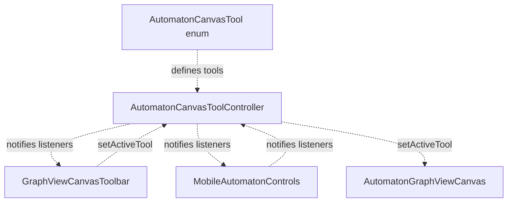

**Sources**: [lib/presentation/widgets/automaton_canvas_tool.dart L15-L36](https://github.com/ThalesMMS/JFlutter/blob/32e808b4/lib/presentation/widgets/automaton_canvas_tool.dart#L15-L36)

The controller uses Flutter's `ChangeNotifier` pattern to propagate tool changes. When `setActiveTool()` is called, all registered listeners receive notifications and can update their UI accordingly.

### Tool Controller Lifecycle

The canvas widget observes the tool controller and updates internal state when the tool changes:

```css
#mermaid-p6fr70wont{font-family:ui-sans-serif,-apple-system,system-ui,Segoe UI,Helvetica;font-size:16px;fill:#ccc;}@keyframes edge-animation-frame{from{stroke-dashoffset:0;}}@keyframes dash{to{stroke-dashoffset:0;}}#mermaid-p6fr70wont .edge-animation-slow{stroke-dasharray:9,5!important;stroke-dashoffset:900;animation:dash 50s linear infinite;stroke-linecap:round;}#mermaid-p6fr70wont .edge-animation-fast{stroke-dasharray:9,5!important;stroke-dashoffset:900;animation:dash 20s linear infinite;stroke-linecap:round;}#mermaid-p6fr70wont .error-icon{fill:#a44141;}#mermaid-p6fr70wont .error-text{fill:#ddd;stroke:#ddd;}#mermaid-p6fr70wont .edge-thickness-normal{stroke-width:1px;}#mermaid-p6fr70wont .edge-thickness-thick{stroke-width:3.5px;}#mermaid-p6fr70wont .edge-pattern-solid{stroke-dasharray:0;}#mermaid-p6fr70wont .edge-thickness-invisible{stroke-width:0;fill:none;}#mermaid-p6fr70wont .edge-pattern-dashed{stroke-dasharray:3;}#mermaid-p6fr70wont .edge-pattern-dotted{stroke-dasharray:2;}#mermaid-p6fr70wont .marker{fill:lightgrey;stroke:lightgrey;}#mermaid-p6fr70wont .marker.cross{stroke:lightgrey;}#mermaid-p6fr70wont svg{font-family:ui-sans-serif,-apple-system,system-ui,Segoe UI,Helvetica;font-size:16px;}#mermaid-p6fr70wont p{margin:0;}#mermaid-p6fr70wont defs #statediagram-barbEnd{fill:lightgrey;stroke:lightgrey;}#mermaid-p6fr70wont g.stateGroup text{fill:#ccc;stroke:none;font-size:10px;}#mermaid-p6fr70wont g.stateGroup text{fill:#ccc;stroke:none;font-size:10px;}#mermaid-p6fr70wont g.stateGroup .state-title{font-weight:bolder;fill:#e0dfdf;}#mermaid-p6fr70wont g.stateGroup rect{fill:#1f2020;stroke:#ccc;}#mermaid-p6fr70wont g.stateGroup line{stroke:lightgrey;stroke-width:1;}#mermaid-p6fr70wont .transition{stroke:lightgrey;stroke-width:1;fill:none;}#mermaid-p6fr70wont .stateGroup .composit{fill:#333;border-bottom:1px;}#mermaid-p6fr70wont .stateGroup .alt-composit{fill:#e0e0e0;border-bottom:1px;}#mermaid-p6fr70wont .state-note{stroke:hsl(180, 0%, 18.3529411765%);fill:hsl(180, 1.5873015873%, 28.3529411765%);}#mermaid-p6fr70wont .state-note text{fill:rgb(183.8476190475, 181.5523809523, 181.5523809523);stroke:none;font-size:10px;}#mermaid-p6fr70wont .stateLabel .box{stroke:none;stroke-width:0;fill:#1f2020;opacity:0.5;}#mermaid-p6fr70wont .edgeLabel .label rect{fill:#1f2020;opacity:0.5;}#mermaid-p6fr70wont .edgeLabel{background-color:hsl(0, 0%, 34.4117647059%);text-align:center;}#mermaid-p6fr70wont .edgeLabel p{background-color:hsl(0, 0%, 34.4117647059%);}#mermaid-p6fr70wont .edgeLabel rect{opacity:0.5;background-color:hsl(0, 0%, 34.4117647059%);fill:hsl(0, 0%, 34.4117647059%);}#mermaid-p6fr70wont .edgeLabel .label text{fill:#ccc;}#mermaid-p6fr70wont .label div .edgeLabel{color:#ccc;}#mermaid-p6fr70wont .stateLabel text{fill:#e0dfdf;font-size:10px;font-weight:bold;}#mermaid-p6fr70wont .node circle.state-start{fill:#f4f4f4;stroke:#f4f4f4;}#mermaid-p6fr70wont .node .fork-join{fill:#f4f4f4;stroke:#f4f4f4;}#mermaid-p6fr70wont .node circle.state-end{fill:#cccccc;stroke:#333;stroke-width:1.5;}#mermaid-p6fr70wont .end-state-inner{fill:#333;stroke-width:1.5;}#mermaid-p6fr70wont .node rect{fill:#1f2020;stroke:#ccc;stroke-width:1px;}#mermaid-p6fr70wont .node polygon{fill:#1f2020;stroke:#ccc;stroke-width:1px;}#mermaid-p6fr70wont #statediagram-barbEnd{fill:lightgrey;}#mermaid-p6fr70wont .statediagram-cluster rect{fill:#1f2020;stroke:#ccc;stroke-width:1px;}#mermaid-p6fr70wont .cluster-label,#mermaid-p6fr70wont .nodeLabel{color:#e0dfdf;}#mermaid-p6fr70wont .statediagram-cluster rect.outer{rx:5px;ry:5px;}#mermaid-p6fr70wont .statediagram-state .divider{stroke:#ccc;}#mermaid-p6fr70wont .statediagram-state .title-state{rx:5px;ry:5px;}#mermaid-p6fr70wont .statediagram-cluster.statediagram-cluster .inner{fill:#333;}#mermaid-p6fr70wont .statediagram-cluster.statediagram-cluster-alt .inner{fill:#555;}#mermaid-p6fr70wont .statediagram-cluster .inner{rx:0;ry:0;}#mermaid-p6fr70wont .statediagram-state rect.basic{rx:5px;ry:5px;}#mermaid-p6fr70wont .statediagram-state rect.divider{stroke-dasharray:10,10;fill:#555;}#mermaid-p6fr70wont .note-edge{stroke-dasharray:5;}#mermaid-p6fr70wont .statediagram-note rect{fill:hsl(180, 1.5873015873%, 28.3529411765%);stroke:hsl(180, 0%, 18.3529411765%);stroke-width:1px;rx:0;ry:0;}#mermaid-p6fr70wont .statediagram-note rect{fill:hsl(180, 1.5873015873%, 28.3529411765%);stroke:hsl(180, 0%, 18.3529411765%);stroke-width:1px;rx:0;ry:0;}#mermaid-p6fr70wont .statediagram-note text{fill:rgb(183.8476190475, 181.5523809523, 181.5523809523);}#mermaid-p6fr70wont .statediagram-note .nodeLabel{color:rgb(183.8476190475, 181.5523809523, 181.5523809523);}#mermaid-p6fr70wont .statediagram .edgeLabel{color:red;}#mermaid-p6fr70wont #dependencyStart,#mermaid-p6fr70wont #dependencyEnd{fill:lightgrey;stroke:lightgrey;stroke-width:1;}#mermaid-p6fr70wont .statediagramTitleText{text-anchor:middle;font-size:18px;fill:#ccc;}#mermaid-p6fr70wont :root{--mermaid-font-family:ui-sans-serif,-apple-system,system-ui,Segoe UI,Helvetica;}addListener_handleActiveToolChangedsetStatedisposeInitControllerObservingToolToolChangedUpdateCanvasDisposed
```

**Sources**: [lib/presentation/widgets/automaton_graphview_canvas.dart L398-L399](https://github.com/ThalesMMS/JFlutter/blob/32e808b4/lib/presentation/widgets/automaton_graphview_canvas.dart#L398-L399)

 [lib/presentation/widgets/automaton_graphview_canvas.dart L528-L555](https://github.com/ThalesMMS/JFlutter/blob/32e808b4/lib/presentation/widgets/automaton_graphview_canvas.dart#L528-L555)

## Gesture Recognition and Handling

The canvas employs a sophisticated gesture handling pipeline that coordinates multiple gesture recognizers using a `GestureArenaTeam`. This ensures node dragging takes priority over canvas panning when appropriate.

### Gesture Detection Pipeline

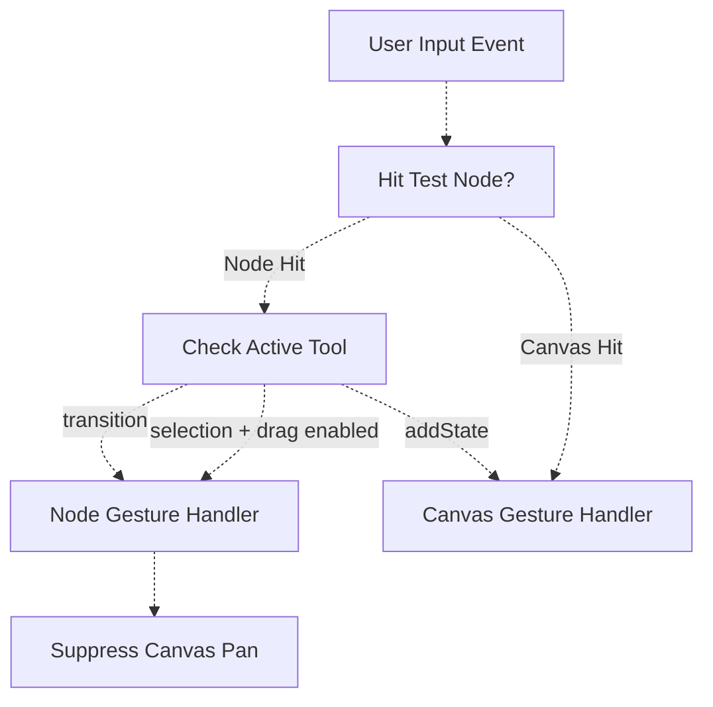

**Sources**: [lib/presentation/widgets/automaton_graphview_canvas.dart L358-L382](https://github.com/ThalesMMS/JFlutter/blob/32e808b4/lib/presentation/widgets/automaton_graphview_canvas.dart#L358-L382)

 [lib/presentation/widgets/automaton_graphview_canvas.dart L631-L663](https://github.com/ThalesMMS/JFlutter/blob/32e808b4/lib/presentation/widgets/automaton_graphview_canvas.dart#L631-L663)

### Hit Testing Implementation

The `_hitTestNode` method converts screen coordinates to world coordinates and performs circular hit detection on nodes:

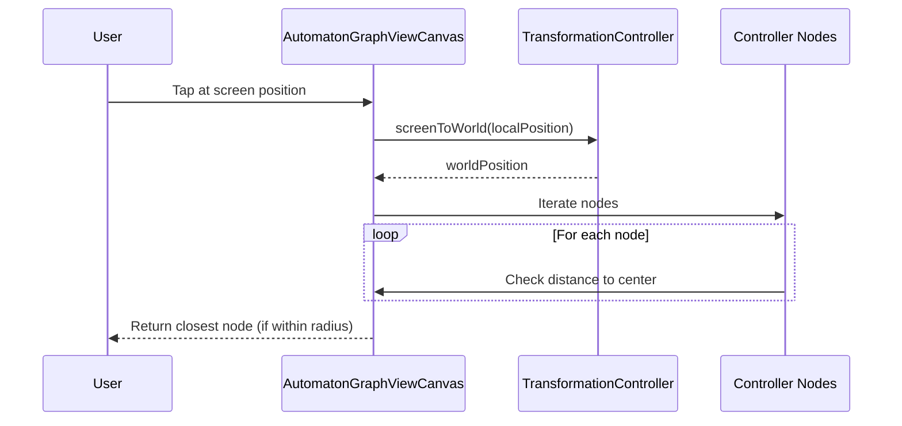

The method compares the squared distance to avoid expensive square root calculations:

* Node radius: `kAutomatonStateDiameter / 2` (typically 35 pixels)
* Distance calculation: `dx * dx + dy * dy`
* Hit condition: `distanceSquared <= radius * radius`

**Sources**: [lib/presentation/widgets/automaton_graphview_canvas.dart L631-L663](https://github.com/ThalesMMS/JFlutter/blob/32e808b4/lib/presentation/widgets/automaton_graphview_canvas.dart#L631-L663)

## Tool-Specific Interaction Patterns

Each tool interprets user gestures differently. The canvas routes gestures based on `_activeTool` state.

### Selection Tool Behavior

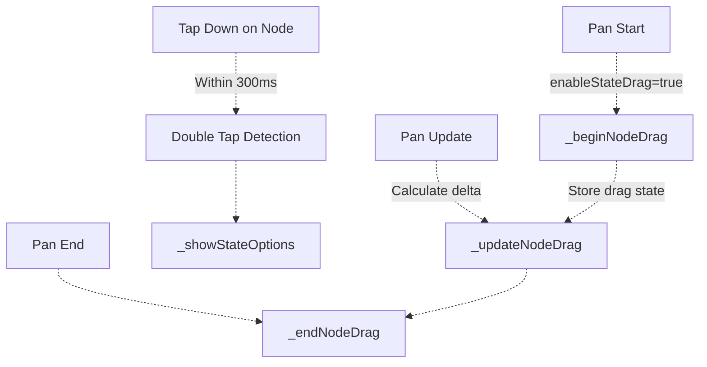

**Sources**: [lib/presentation/widgets/automaton_graphview_canvas.dart L701-L735](https://github.com/ThalesMMS/JFlutter/blob/32e808b4/lib/presentation/widgets/automaton_graphview_canvas.dart#L701-L735)

 [lib/presentation/widgets/automaton_graphview_canvas.dart L781-L819](https://github.com/ThalesMMS/JFlutter/blob/32e808b4/lib/presentation/widgets/automaton_graphview_canvas.dart#L781-L819)

 [lib/presentation/widgets/automaton_graphview_canvas.dart L865-L879](https://github.com/ThalesMMS/JFlutter/blob/32e808b4/lib/presentation/widgets/automaton_graphview_canvas.dart#L865-L879)

The selection tool implements:

* **Single Tap + Hold + Drag**: Moves the state to new position
* **Double Tap**: Opens state options modal (label, initial flag, accepting flag)
* **Drag Start**: Suppresses canvas pan with `_setCanvasPanSuppressed(true)`
* **Drag Update**: Calculates world-space delta and calls `controller.moveState()`
* **Drag End**: Restores canvas pan suppression

### Add State Tool Behavior

When `addState` tool is active, taps on empty canvas areas create new states:

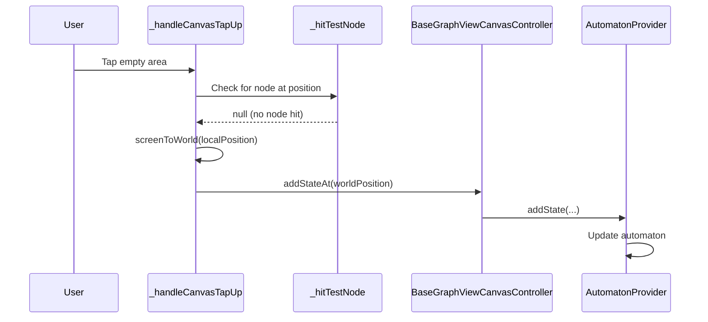

**Sources**: [lib/presentation/widgets/automaton_graphview_canvas.dart L746-L753](https://github.com/ThalesMMS/JFlutter/blob/32e808b4/lib/presentation/widgets/automaton_graphview_canvas.dart#L746-L753)

The tool is disabled when dragging nodes (`_isDraggingNode || _didMoveDraggedNode`), preventing accidental state creation during drag gestures.

### Transition Tool Behavior

The transition tool implements a two-step interaction pattern:

```css
#mermaid-acbiq9o2xc9{font-family:ui-sans-serif,-apple-system,system-ui,Segoe UI,Helvetica;font-size:16px;fill:#ccc;}@keyframes edge-animation-frame{from{stroke-dashoffset:0;}}@keyframes dash{to{stroke-dashoffset:0;}}#mermaid-acbiq9o2xc9 .edge-animation-slow{stroke-dasharray:9,5!important;stroke-dashoffset:900;animation:dash 50s linear infinite;stroke-linecap:round;}#mermaid-acbiq9o2xc9 .edge-animation-fast{stroke-dasharray:9,5!important;stroke-dashoffset:900;animation:dash 20s linear infinite;stroke-linecap:round;}#mermaid-acbiq9o2xc9 .error-icon{fill:#a44141;}#mermaid-acbiq9o2xc9 .error-text{fill:#ddd;stroke:#ddd;}#mermaid-acbiq9o2xc9 .edge-thickness-normal{stroke-width:1px;}#mermaid-acbiq9o2xc9 .edge-thickness-thick{stroke-width:3.5px;}#mermaid-acbiq9o2xc9 .edge-pattern-solid{stroke-dasharray:0;}#mermaid-acbiq9o2xc9 .edge-thickness-invisible{stroke-width:0;fill:none;}#mermaid-acbiq9o2xc9 .edge-pattern-dashed{stroke-dasharray:3;}#mermaid-acbiq9o2xc9 .edge-pattern-dotted{stroke-dasharray:2;}#mermaid-acbiq9o2xc9 .marker{fill:lightgrey;stroke:lightgrey;}#mermaid-acbiq9o2xc9 .marker.cross{stroke:lightgrey;}#mermaid-acbiq9o2xc9 svg{font-family:ui-sans-serif,-apple-system,system-ui,Segoe UI,Helvetica;font-size:16px;}#mermaid-acbiq9o2xc9 p{margin:0;}#mermaid-acbiq9o2xc9 defs #statediagram-barbEnd{fill:lightgrey;stroke:lightgrey;}#mermaid-acbiq9o2xc9 g.stateGroup text{fill:#ccc;stroke:none;font-size:10px;}#mermaid-acbiq9o2xc9 g.stateGroup text{fill:#ccc;stroke:none;font-size:10px;}#mermaid-acbiq9o2xc9 g.stateGroup .state-title{font-weight:bolder;fill:#e0dfdf;}#mermaid-acbiq9o2xc9 g.stateGroup rect{fill:#1f2020;stroke:#ccc;}#mermaid-acbiq9o2xc9 g.stateGroup line{stroke:lightgrey;stroke-width:1;}#mermaid-acbiq9o2xc9 .transition{stroke:lightgrey;stroke-width:1;fill:none;}#mermaid-acbiq9o2xc9 .stateGroup .composit{fill:#333;border-bottom:1px;}#mermaid-acbiq9o2xc9 .stateGroup .alt-composit{fill:#e0e0e0;border-bottom:1px;}#mermaid-acbiq9o2xc9 .state-note{stroke:hsl(180, 0%, 18.3529411765%);fill:hsl(180, 1.5873015873%, 28.3529411765%);}#mermaid-acbiq9o2xc9 .state-note text{fill:rgb(183.8476190475, 181.5523809523, 181.5523809523);stroke:none;font-size:10px;}#mermaid-acbiq9o2xc9 .stateLabel .box{stroke:none;stroke-width:0;fill:#1f2020;opacity:0.5;}#mermaid-acbiq9o2xc9 .edgeLabel .label rect{fill:#1f2020;opacity:0.5;}#mermaid-acbiq9o2xc9 .edgeLabel{background-color:hsl(0, 0%, 34.4117647059%);text-align:center;}#mermaid-acbiq9o2xc9 .edgeLabel p{background-color:hsl(0, 0%, 34.4117647059%);}#mermaid-acbiq9o2xc9 .edgeLabel rect{opacity:0.5;background-color:hsl(0, 0%, 34.4117647059%);fill:hsl(0, 0%, 34.4117647059%);}#mermaid-acbiq9o2xc9 .edgeLabel .label text{fill:#ccc;}#mermaid-acbiq9o2xc9 .label div .edgeLabel{color:#ccc;}#mermaid-acbiq9o2xc9 .stateLabel text{fill:#e0dfdf;font-size:10px;font-weight:bold;}#mermaid-acbiq9o2xc9 .node circle.state-start{fill:#f4f4f4;stroke:#f4f4f4;}#mermaid-acbiq9o2xc9 .node .fork-join{fill:#f4f4f4;stroke:#f4f4f4;}#mermaid-acbiq9o2xc9 .node circle.state-end{fill:#cccccc;stroke:#333;stroke-width:1.5;}#mermaid-acbiq9o2xc9 .end-state-inner{fill:#333;stroke-width:1.5;}#mermaid-acbiq9o2xc9 .node rect{fill:#1f2020;stroke:#ccc;stroke-width:1px;}#mermaid-acbiq9o2xc9 .node polygon{fill:#1f2020;stroke:#ccc;stroke-width:1px;}#mermaid-acbiq9o2xc9 #statediagram-barbEnd{fill:lightgrey;}#mermaid-acbiq9o2xc9 .statediagram-cluster rect{fill:#1f2020;stroke:#ccc;stroke-width:1px;}#mermaid-acbiq9o2xc9 .cluster-label,#mermaid-acbiq9o2xc9 .nodeLabel{color:#e0dfdf;}#mermaid-acbiq9o2xc9 .statediagram-cluster rect.outer{rx:5px;ry:5px;}#mermaid-acbiq9o2xc9 .statediagram-state .divider{stroke:#ccc;}#mermaid-acbiq9o2xc9 .statediagram-state .title-state{rx:5px;ry:5px;}#mermaid-acbiq9o2xc9 .statediagram-cluster.statediagram-cluster .inner{fill:#333;}#mermaid-acbiq9o2xc9 .statediagram-cluster.statediagram-cluster-alt .inner{fill:#555;}#mermaid-acbiq9o2xc9 .statediagram-cluster .inner{rx:0;ry:0;}#mermaid-acbiq9o2xc9 .statediagram-state rect.basic{rx:5px;ry:5px;}#mermaid-acbiq9o2xc9 .statediagram-state rect.divider{stroke-dasharray:10,10;fill:#555;}#mermaid-acbiq9o2xc9 .note-edge{stroke-dasharray:5;}#mermaid-acbiq9o2xc9 .statediagram-note rect{fill:hsl(180, 1.5873015873%, 28.3529411765%);stroke:hsl(180, 0%, 18.3529411765%);stroke-width:1px;rx:0;ry:0;}#mermaid-acbiq9o2xc9 .statediagram-note rect{fill:hsl(180, 1.5873015873%, 28.3529411765%);stroke:hsl(180, 0%, 18.3529411765%);stroke-width:1px;rx:0;ry:0;}#mermaid-acbiq9o2xc9 .statediagram-note text{fill:rgb(183.8476190475, 181.5523809523, 181.5523809523);}#mermaid-acbiq9o2xc9 .statediagram-note .nodeLabel{color:rgb(183.8476190475, 181.5523809523, 181.5523809523);}#mermaid-acbiq9o2xc9 .statediagram .edgeLabel{color:red;}#mermaid-acbiq9o2xc9 #dependencyStart,#mermaid-acbiq9o2xc9 #dependencyEnd{fill:lightgrey;stroke:lightgrey;stroke-width:1;}#mermaid-acbiq9o2xc9 .statediagramTitleText{text-anchor:middle;font-size:18px;fill:#ccc;}#mermaid-acbiq9o2xc9 :root{--mermaid-font-family:ui-sans-serif,-apple-system,system-ui,Segoe UI,Helvetica;}transition tool activetap node A_transitionSourceId = Atap node Beditor closedAwaitingSourceSourceSelectedAwaitingTargetShowEditorVisual feedback:source node highlightedCalls _showTransitionEditorwith fromId and toId
```

**Sources**: [lib/presentation/widgets/automaton_graphview_canvas.dart L821-L850](https://github.com/ThalesMMS/JFlutter/blob/32e808b4/lib/presentation/widgets/automaton_graphview_canvas.dart#L821-L850)

Key implementation details:

* First tap sets `_transitionSourceId` to the node ID
* Second tap calls `_showTransitionEditor(sourceId, targetId)`
* Self-loops are supported (source == target)
* Tool remains active after editor closes for rapid transition creation

## Transition Editing Workflow

The transition editing system uses an overlay-based approach with customizable payload types to support different automaton types (FSA, PDA, TM).

### Transition Configuration Architecture

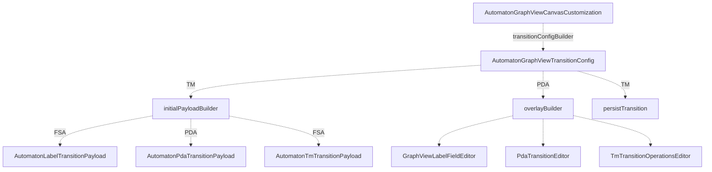

**Sources**: [lib/presentation/widgets/automaton_graphview_canvas.dart L166-L178](https://github.com/ThalesMMS/JFlutter/blob/32e808b4/lib/presentation/widgets/automaton_graphview_canvas.dart#L166-L178)

 [lib/presentation/widgets/automaton_graphview_canvas.dart L196-L301](https://github.com/ThalesMMS/JFlutter/blob/32e808b4/lib/presentation/widgets/automaton_graphview_canvas.dart#L196-L301)

### Transition Overlay Lifecycle

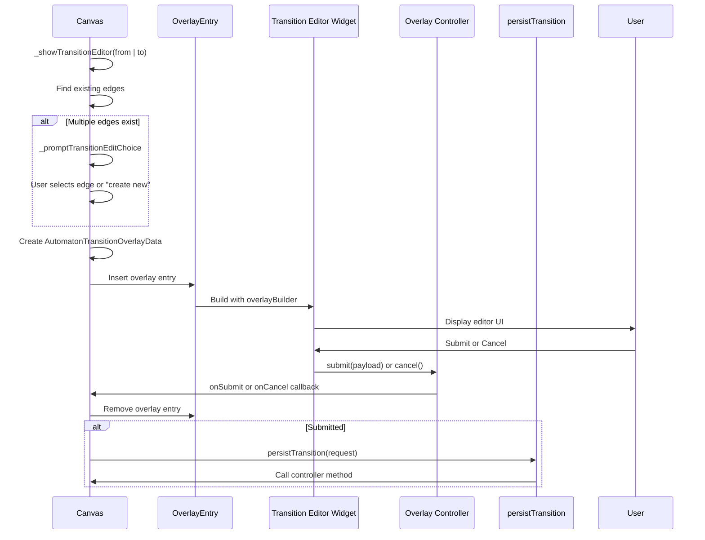

**Sources**: [lib/presentation/widgets/automaton_graphview_canvas.dart L970-L1072](https://github.com/ThalesMMS/JFlutter/blob/32e808b4/lib/presentation/widgets/automaton_graphview_canvas.dart#L970-L1072)

 [lib/presentation/widgets/automaton_graphview_canvas.dart L1074-L1115](https://github.com/ThalesMMS/JFlutter/blob/32e808b4/lib/presentation/widgets/automaton_graphview_canvas.dart#L1074-L1115)

### Payload Types and Editors

Each automaton type uses a specialized payload class:

| Automaton Type | Payload Class | Editor Widget | Fields |
| --- | --- | --- | --- |
| FSA | `AutomatonLabelTransitionPayload` | `GraphViewLabelFieldEditor` | `label: String` |
| PDA | `AutomatonPdaTransitionPayload` | `PdaTransitionEditor` | `readSymbol`, `popSymbol`, `pushSymbol`, lambda flags |
| TM | `AutomatonTmTransitionPayload` | `TmTransitionOperationsEditor` | `readSymbol`, `writeSymbol`, `direction` |

**Sources**: [lib/presentation/widgets/automaton_graphview_canvas.dart L52-L93](https://github.com/ThalesMMS/JFlutter/blob/32e808b4/lib/presentation/widgets/automaton_graphview_canvas.dart#L52-L93)

 [lib/presentation/widgets/automaton_graphview_canvas.dart L196-L227](https://github.com/ThalesMMS/JFlutter/blob/32e808b4/lib/presentation/widgets/automaton_graphview_canvas.dart#L196-L227)

### Handling Multiple Edges

When multiple transitions exist between the same states, the canvas prompts the user to choose:

```

```

The dialog presents options with keys like `automaton-transition-choice-${edge.id}` for each existing edge and `automaton-transition-choice-create-new` for new transitions.

**Sources**: [lib/presentation/widgets/automaton_graphview_canvas.dart L964-L968](https://github.com/ThalesMMS/JFlutter/blob/32e808b4/lib/presentation/widgets/automaton_graphview_canvas.dart#L964-L968)

 [lib/presentation/widgets/automaton_graphview_canvas.dart L1074-L1115](https://github.com/ThalesMMS/JFlutter/blob/32e808b4/lib/presentation/widgets/automaton_graphview_canvas.dart#L1074-L1115)

## Mobile vs Desktop Controls

The canvas provides two distinct control surfaces optimized for their respective platforms.

### Mobile Controls Architecture

`MobileAutomatonControls` consolidates all editing actions into a single floating panel:

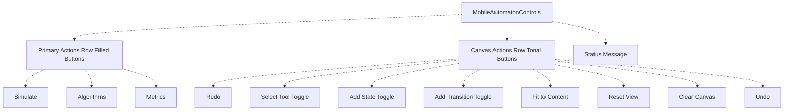

**Sources**: [lib/presentation/widgets/mobile_automaton_controls.dart L24-L226](https://github.com/ThalesMMS/JFlutter/blob/32e808b4/lib/presentation/widgets/mobile_automaton_controls.dart#L24-L226)

Key characteristics:

* **Bottom-aligned**: Uses `Alignment.bottomCenter` with `SafeArea`
* **Two action tiers**: Primary actions (filled) vs canvas actions (tonal)
* **Tool toggles**: Visual selection state with `secondaryContainer` background
* **Conditional rendering**: Only shows tools when callbacks are provided
* **Max width constraint**: `560px` for tablet readability

### Desktop Toolbar Architecture

`GraphViewCanvasToolbar` provides a compact, icon-based toolbar:

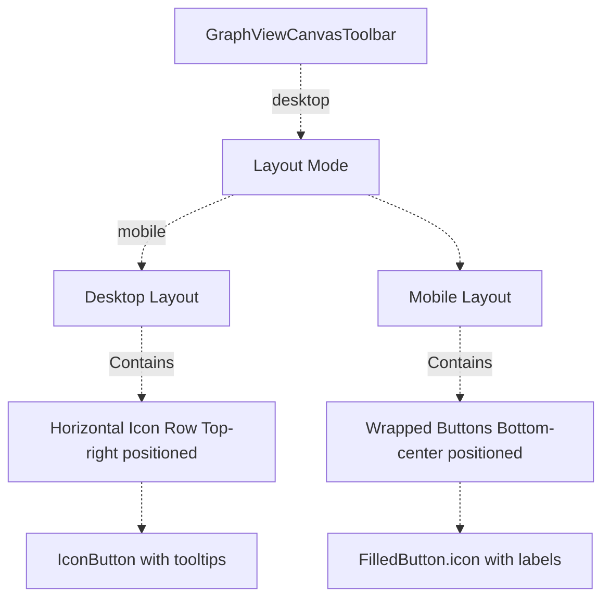

**Sources**: [lib/presentation/widgets/graphview_canvas_toolbar.dart L20-L155](https://github.com/ThalesMMS/JFlutter/blob/32e808b4/lib/presentation/widgets/graphview_canvas_toolbar.dart#L20-L155)

Desktop layout features:

* **Compact design**: Icon buttons only, no labels
* **Visual separators**: 1px dividers between actions
* **Toggle styling**: Primary container background for selected tools
* **Shadow elevation**: Subtle shadow for depth
* **Dynamic enable/disable**: Undo/redo buttons reflect controller state

### Control Surface Comparison

| Feature | Mobile Controls | Desktop Toolbar |
| --- | --- | --- |
| **Position** | Bottom center | Top right |
| **Button style** | Filled/Tonal with labels | Icon-only with tooltips |
| **Tool selection** | Toggle buttons in canvas section | Icon buttons with styled backgrounds |
| **Actions included** | Simulation + canvas tools | Canvas tools only |
| **Max width** | 560px | Auto (content-based) |
| **Layout** | Wrap (multi-row) | Row (single-row) |

**Sources**: [lib/presentation/widgets/mobile_automaton_controls.dart L161-L225](https://github.com/ThalesMMS/JFlutter/blob/32e808b4/lib/presentation/widgets/mobile_automaton_controls.dart#L161-L225)

 [lib/presentation/widgets/graphview_canvas_toolbar.dart L159-L256](https://github.com/ThalesMMS/JFlutter/blob/32e808b4/lib/presentation/widgets/graphview_canvas_toolbar.dart#L159-L256)

## State Management Integration

The tool controller and gesture handlers interact with Riverpod providers to persist changes:

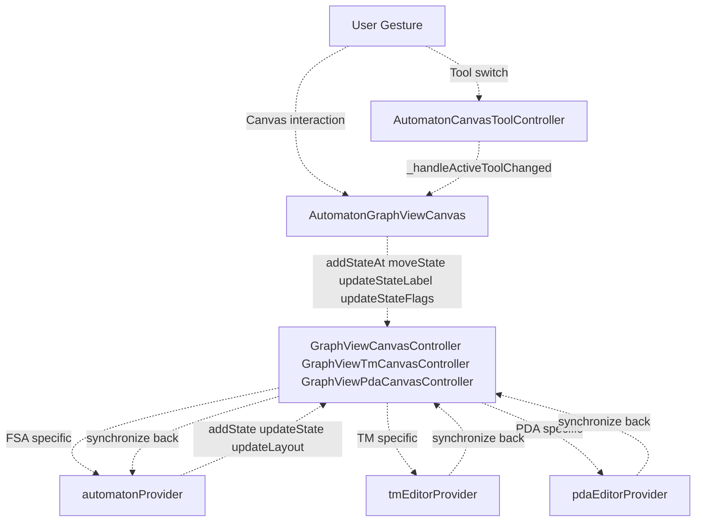

**Sources**: [lib/presentation/widgets/automaton_graphview_canvas.dart L337-L365](https://github.com/ThalesMMS/JFlutter/blob/32e808b4/lib/presentation/widgets/automaton_graphview_canvas.dart#L337-L365)

 [lib/presentation/widgets/automaton_graphview_canvas.dart L401-L431](https://github.com/ThalesMMS/JFlutter/blob/32e808b4/lib/presentation/widgets/automaton_graphview_canvas.dart#L401-L431)

### Synchronization Flow

Changes flow bidirectionally between canvas and providers:

1. **User → Canvas**: Gesture detected, tool-specific handler invoked
2. **Canvas → Controller**: Canvas calls controller method (e.g., `addStateAt`)
3. **Controller → Provider**: Controller updates provider state
4. **Provider → Automaton**: Provider creates new automaton instance
5. **Automaton → Canvas**: Canvas receives update via `didUpdateWidget`
6. **Canvas → Controller**: Canvas calls `controller.synchronize(automaton)`
7. **Controller → Graph**: Controller rebuilds internal graph representation

**Sources**: [lib/presentation/widgets/automaton_graphview_canvas.dart L576-L604](https://github.com/ThalesMMS/JFlutter/blob/32e808b4/lib/presentation/widgets/automaton_graphview_canvas.dart#L576-L604)

### Tool Controller Lifecycle in Canvas

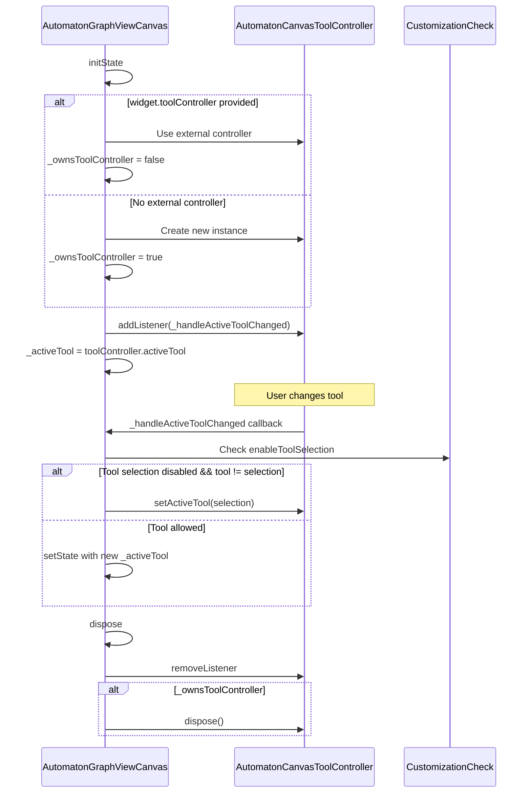

**Sources**: [lib/presentation/widgets/automaton_graphview_canvas.dart L388-L432](https://github.com/ThalesMMS/JFlutter/blob/32e808b4/lib/presentation/widgets/automaton_graphview_canvas.dart#L388-L432)

 [lib/presentation/widgets/automaton_graphview_canvas.dart L528-L555](https://github.com/ThalesMMS/JFlutter/blob/32e808b4/lib/presentation/widgets/automaton_graphview_canvas.dart#L528-L555)

## Gesture Suppression and Arena Team

The canvas uses a `GestureArenaTeam` to coordinate competing gestures and prevent unwanted canvas panning during node manipulation:

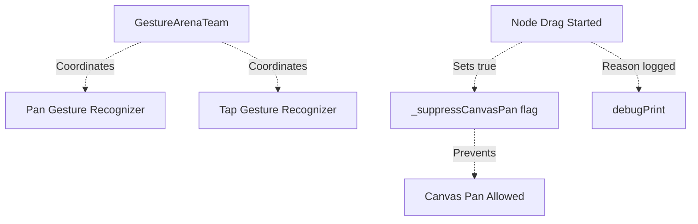

When `_setCanvasPanSuppressed(true)` is called during node drag start, the canvas pan gesture is temporarily disabled. This prevents the viewport from moving when the user intends to reposition a state.

**Sources**: [lib/presentation/widgets/automaton_graphview_canvas.dart L358-L382](https://github.com/ThalesMMS/JFlutter/blob/32e808b4/lib/presentation/widgets/automaton_graphview_canvas.dart#L358-L382)

 [lib/presentation/widgets/automaton_graphview_canvas.dart L793](https://github.com/ThalesMMS/JFlutter/blob/32e808b4/lib/presentation/widgets/automaton_graphview_canvas.dart#L793-L793)

The suppression is restored to `false` when:

* Node drag ends (`_endNodeDrag`)
* Pan gesture is cancelled (`_handleNodePanCancel`)

This mechanism ensures a smooth user experience where node dragging takes priority over viewport navigation.


### On this page

* [Canvas Tools and Interaction](#4.4-canvas-tools-and-interaction)
* [Purpose and Scope](#4.4-purpose-and-scope)
* [Tool System Overview](#4.4-tool-system-overview)
* [Tool Controller Lifecycle](#4.4-tool-controller-lifecycle)
* [Gesture Recognition and Handling](#4.4-gesture-recognition-and-handling)
* [Gesture Detection Pipeline](#4.4-gesture-detection-pipeline)
* [Hit Testing Implementation](#4.4-hit-testing-implementation)
* [Tool-Specific Interaction Patterns](#4.4-tool-specific-interaction-patterns)
* [Selection Tool Behavior](#4.4-selection-tool-behavior)
* [Add State Tool Behavior](#4.4-add-state-tool-behavior)
* [Transition Tool Behavior](#4.4-transition-tool-behavior)
* [Transition Editing Workflow](#4.4-transition-editing-workflow)
* [Transition Configuration Architecture](#4.4-transition-configuration-architecture)
* [Transition Overlay Lifecycle](#4.4-transition-overlay-lifecycle)
* [Payload Types and Editors](#4.4-payload-types-and-editors)
* [Handling Multiple Edges](#4.4-handling-multiple-edges)
* [Mobile vs Desktop Controls](#4.4-mobile-vs-desktop-controls)
* [Mobile Controls Architecture](#4.4-mobile-controls-architecture)
* [Desktop Toolbar Architecture](#4.4-desktop-toolbar-architecture)
* [Control Surface Comparison](#4.4-control-surface-comparison)
* [State Management Integration](#4.4-state-management-integration)
* [Synchronization Flow](#4.4-synchronization-flow)
* [Tool Controller Lifecycle in Canvas](#4.4-tool-controller-lifecycle-in-canvas)
* [Gesture Suppression and Arena Team](#4.4-gesture-suppression-and-arena-team)

Ask Devin about JFlutter