# Coordinate Systems and Viewport

> **Relevant source files**
> * [lib/features/canvas/graphview/base_graphview_canvas_controller.dart](https://github.com/ThalesMMS/JFlutter/blob/32e808b4/lib/features/canvas/graphview/base_graphview_canvas_controller.dart)
> * [lib/features/canvas/graphview/graphview_canvas_controller.dart](https://github.com/ThalesMMS/JFlutter/blob/32e808b4/lib/features/canvas/graphview/graphview_canvas_controller.dart)
> * [lib/features/canvas/graphview/graphview_pda_canvas_controller.dart](https://github.com/ThalesMMS/JFlutter/blob/32e808b4/lib/features/canvas/graphview/graphview_pda_canvas_controller.dart)
> * [lib/features/canvas/graphview/graphview_pda_mapper.dart](https://github.com/ThalesMMS/JFlutter/blob/32e808b4/lib/features/canvas/graphview/graphview_pda_mapper.dart)
> * [lib/features/canvas/graphview/graphview_tm_canvas_controller.dart](https://github.com/ThalesMMS/JFlutter/blob/32e808b4/lib/features/canvas/graphview/graphview_tm_canvas_controller.dart)
> * [lib/features/canvas/graphview/graphview_tm_mapper.dart](https://github.com/ThalesMMS/JFlutter/blob/32e808b4/lib/features/canvas/graphview/graphview_tm_mapper.dart)
> * [lib/features/canvas/graphview/graphview_viewport_highlight_mixin.dart](https://github.com/ThalesMMS/JFlutter/blob/32e808b4/lib/features/canvas/graphview/graphview_viewport_highlight_mixin.dart)
> * [lib/presentation/widgets/automaton_graphview_canvas.dart](https://github.com/ThalesMMS/JFlutter/blob/32e808b4/lib/presentation/widgets/automaton_graphview_canvas.dart)
> * [lib/presentation/widgets/graphview_canvas_toolbar.dart](https://github.com/ThalesMMS/JFlutter/blob/32e808b4/lib/presentation/widgets/graphview_canvas_toolbar.dart)
> * [test/widget/presentation/automaton_graphview_canvas_test.dart](https://github.com/ThalesMMS/JFlutter/blob/32e808b4/test/widget/presentation/automaton_graphview_canvas_test.dart)
> * [test/widget/presentation/graphview_canvas_toolbar_test.dart](https://github.com/ThalesMMS/JFlutter/blob/32e808b4/test/widget/presentation/graphview_canvas_toolbar_test.dart)
> * [test/widget/presentation/graphview_label_field_editor_test.dart](https://github.com/ThalesMMS/JFlutter/blob/32e808b4/test/widget/presentation/graphview_label_field_editor_test.dart)

## Purpose and Scope

This page documents the coordinate system transformations and viewport management within the JFlutter canvas system. It covers how the canvas maps between different coordinate spaces (world, viewport, global), how the transformation matrix controls zoom and pan, and the viewport operations available to users. For information about the canvas widget itself, see [AutomatonGraphViewCanvas Widget](#4.1). For canvas interaction gestures, see [Canvas Tools and Interaction](#4.4).

---

## Coordinate Systems Overview

The canvas system operates with three distinct coordinate spaces that must be converted between for proper rendering and interaction.

### Coordinate Space Definitions

| Coordinate Space | Description | Origin | Use Cases |
| --- | --- | --- | --- |
| **World Coordinates** | Logical automaton space where states have fixed positions | Arbitrary; typically (0, 0) at top-left | State positions, transition control points, layout algorithms |
| **Viewport Coordinates** | Transformed screen space after zoom/pan applied | Canvas widget's top-left corner | Hit testing, gesture processing, rendering |
| **Global Screen Coordinates** | Flutter's global coordinate system | Top-left of entire screen | Touch events, overlay positioning |

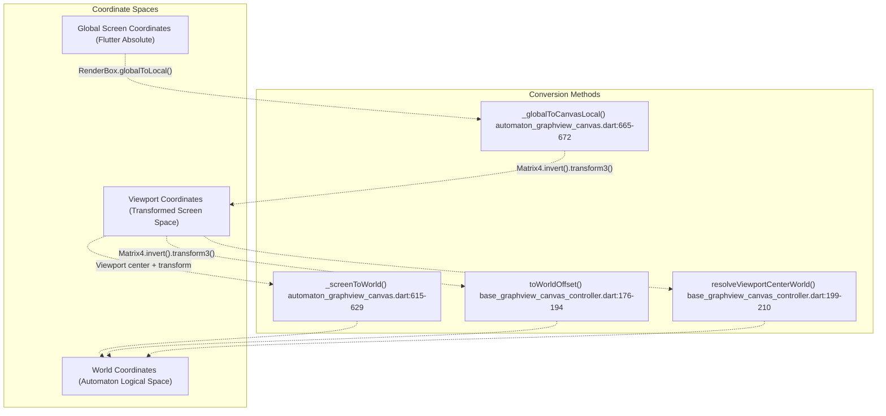

**Sources:** [lib/presentation/widgets/automaton_graphview_canvas.dart L615-L672](https://github.com/ThalesMMS/JFlutter/blob/32e808b4/lib/presentation/widgets/automaton_graphview_canvas.dart#L615-L672)

 [lib/features/canvas/graphview/base_graphview_canvas_controller.dart L176-L210](https://github.com/ThalesMMS/JFlutter/blob/32e808b4/lib/features/canvas/graphview/base_graphview_canvas_controller.dart#L176-L210)

---

## Transformation Matrix Architecture

The canvas uses Flutter's `TransformationController` to manage a `Matrix4` that encodes both translation (pan) and scale (zoom) transformations.

### Transformation Controller Structure

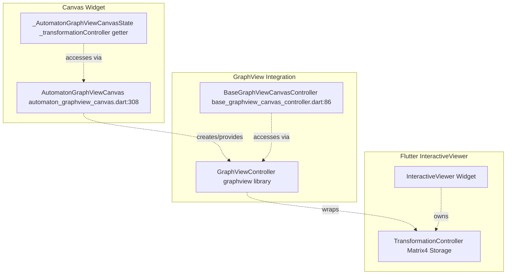

**Sources:** [lib/features/canvas/graphview/base_graphview_canvas_controller.dart L66-L85](https://github.com/ThalesMMS/JFlutter/blob/32e808b4/lib/features/canvas/graphview/base_graphview_canvas_controller.dart#L66-L85)

 [lib/presentation/widgets/automaton_graphview_canvas.dart L384-L385](https://github.com/ThalesMMS/JFlutter/blob/32e808b4/lib/presentation/widgets/automaton_graphview_canvas.dart#L384-L385)

### Matrix4 Structure

The transformation matrix is a 4×4 matrix where:

* Elements [0], [5], [10] encode scale on x, y, z axes
* Elements [12], [13], [14] encode translation (pan offset)

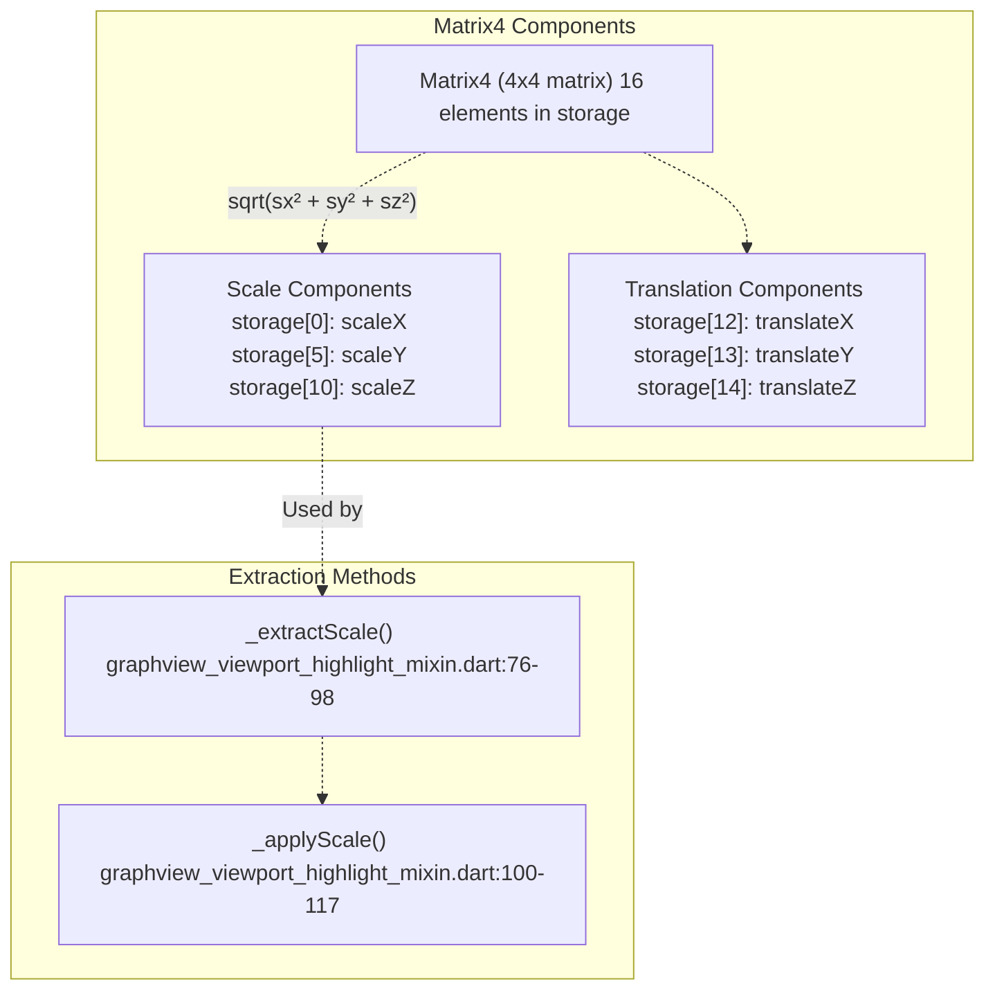

**Sources:** [lib/features/canvas/graphview/graphview_viewport_highlight_mixin.dart L76-L117](https://github.com/ThalesMMS/JFlutter/blob/32e808b4/lib/features/canvas/graphview/graphview_viewport_highlight_mixin.dart#L76-L117)

---

## Coordinate Conversion Methods

### World to Viewport Conversion

The forward transformation (world → viewport) is handled automatically by the `InteractiveViewer` during rendering. No explicit method is needed as the transformation matrix is applied during the paint phase.

### Viewport to World Conversion

Converting from viewport (screen) coordinates to world coordinates requires inverting the transformation matrix.

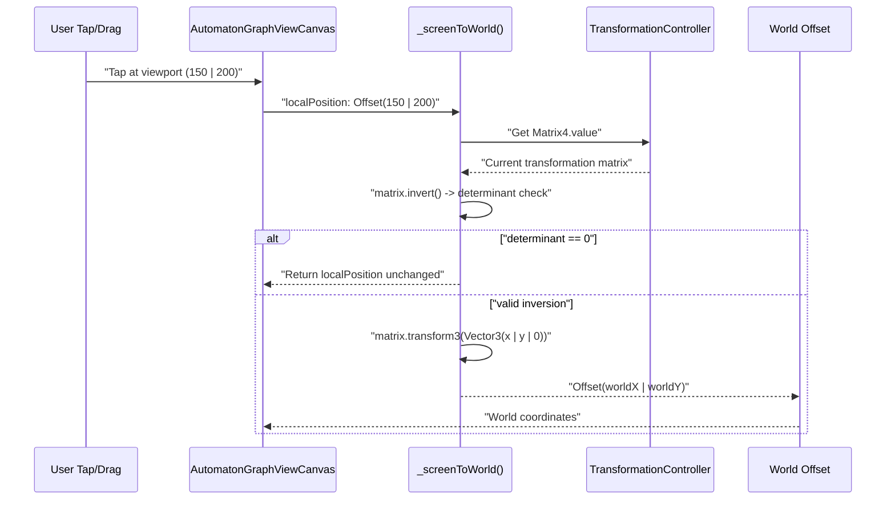

**Implementation Details:**

| Method | File | Lines | Purpose |
| --- | --- | --- | --- |
| `_screenToWorld` | automaton_graphview_canvas.dart | 615-629 | Canvas widget's conversion method |
| `toWorldOffset` | base_graphview_canvas_controller.dart | 176-194 | Controller's conversion method |
| `resolveViewportCenterWorld` | base_graphview_canvas_controller.dart | 199-210 | Converts viewport center to world coordinates |

**Sources:** [lib/presentation/widgets/automaton_graphview_canvas.dart L615-L629](https://github.com/ThalesMMS/JFlutter/blob/32e808b4/lib/presentation/widgets/automaton_graphview_canvas.dart#L615-L629)

 [lib/features/canvas/graphview/base_graphview_canvas_controller.dart L176-L210](https://github.com/ThalesMMS/JFlutter/blob/32e808b4/lib/features/canvas/graphview/base_graphview_canvas_controller.dart#L176-L210)

#### Algorithm: Viewport to World Conversion

1. **Obtain transformation matrix** from `TransformationController`
2. **Copy and invert** the matrix: `Matrix4.copy(controller.value).invert()`
3. **Check determinant**: If zero, matrix is non-invertible (return input unchanged)
4. **Transform point**: Apply inverted matrix to viewport coordinates using `matrix.transform3(Vector3(x, y, 0))`
5. **Extract result**: Return `Offset(vector.x, vector.y)`

**Example Usage in Canvas:**

```
_screenToWorld(Offset localPosition) → world coordinates
```

This method is called during:

* State addition at tap position [lib/presentation/widgets/automaton_graphview_canvas.dart L750](https://github.com/ThalesMMS/JFlutter/blob/32e808b4/lib/presentation/widgets/automaton_graphview_canvas.dart#L750-L750)
* Node hit testing [lib/presentation/widgets/automaton_graphview_canvas.dart L635](https://github.com/ThalesMMS/JFlutter/blob/32e808b4/lib/presentation/widgets/automaton_graphview_canvas.dart#L635-L635)
* Transition anchor positioning [lib/presentation/widgets/automaton_graphview_canvas.dart L679](https://github.com/ThalesMMS/JFlutter/blob/32e808b4/lib/presentation/widgets/automaton_graphview_canvas.dart#L679-L679)

**Sources:** [lib/presentation/widgets/automaton_graphview_canvas.dart L615-L629](https://github.com/ThalesMMS/JFlutter/blob/32e808b4/lib/presentation/widgets/automaton_graphview_canvas.dart#L615-L629)

 [lib/presentation/widgets/automaton_graphview_canvas.dart L750](https://github.com/ThalesMMS/JFlutter/blob/32e808b4/lib/presentation/widgets/automaton_graphview_canvas.dart#L750-L750)

 [lib/features/canvas/graphview/base_graphview_canvas_controller.dart L176-L194](https://github.com/ThalesMMS/JFlutter/blob/32e808b4/lib/features/canvas/graphview/base_graphview_canvas_controller.dart#L176-L194)

### Global to Canvas-Local Conversion

Converting from global screen coordinates (from touch events) to canvas-local coordinates.

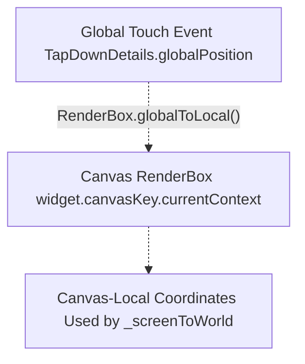

**Implementation:** [lib/presentation/widgets/automaton_graphview_canvas.dart L665-L672](https://github.com/ThalesMMS/JFlutter/blob/32e808b4/lib/presentation/widgets/automaton_graphview_canvas.dart#L665-L672)

```
_globalToCanvasLocal(Offset globalPosition) {
  final renderBox = widget.canvasKey.currentContext?.findRenderObject() as RenderBox?;
  return renderBox?.globalToLocal(globalPosition) ?? globalPosition;
}
```

**Sources:** [lib/presentation/widgets/automaton_graphview_canvas.dart L665-L672](https://github.com/ThalesMMS/JFlutter/blob/32e808b4/lib/presentation/widgets/automaton_graphview_canvas.dart#L665-L672)

---

## Viewport Size Tracking

The canvas controller tracks the viewport dimensions to support accurate coordinate conversions and viewport operations.

```css
#mermaid-4t1y6ivb6z8{font-family:ui-sans-serif,-apple-system,system-ui,Segoe UI,Helvetica;font-size:16px;fill:#ccc;}@keyframes edge-animation-frame{from{stroke-dashoffset:0;}}@keyframes dash{to{stroke-dashoffset:0;}}#mermaid-4t1y6ivb6z8 .edge-animation-slow{stroke-dasharray:9,5!important;stroke-dashoffset:900;animation:dash 50s linear infinite;stroke-linecap:round;}#mermaid-4t1y6ivb6z8 .edge-animation-fast{stroke-dasharray:9,5!important;stroke-dashoffset:900;animation:dash 20s linear infinite;stroke-linecap:round;}#mermaid-4t1y6ivb6z8 .error-icon{fill:#a44141;}#mermaid-4t1y6ivb6z8 .error-text{fill:#ddd;stroke:#ddd;}#mermaid-4t1y6ivb6z8 .edge-thickness-normal{stroke-width:1px;}#mermaid-4t1y6ivb6z8 .edge-thickness-thick{stroke-width:3.5px;}#mermaid-4t1y6ivb6z8 .edge-pattern-solid{stroke-dasharray:0;}#mermaid-4t1y6ivb6z8 .edge-thickness-invisible{stroke-width:0;fill:none;}#mermaid-4t1y6ivb6z8 .edge-pattern-dashed{stroke-dasharray:3;}#mermaid-4t1y6ivb6z8 .edge-pattern-dotted{stroke-dasharray:2;}#mermaid-4t1y6ivb6z8 .marker{fill:lightgrey;stroke:lightgrey;}#mermaid-4t1y6ivb6z8 .marker.cross{stroke:lightgrey;}#mermaid-4t1y6ivb6z8 svg{font-family:ui-sans-serif,-apple-system,system-ui,Segoe UI,Helvetica;font-size:16px;}#mermaid-4t1y6ivb6z8 p{margin:0;}#mermaid-4t1y6ivb6z8 defs #statediagram-barbEnd{fill:lightgrey;stroke:lightgrey;}#mermaid-4t1y6ivb6z8 g.stateGroup text{fill:#ccc;stroke:none;font-size:10px;}#mermaid-4t1y6ivb6z8 g.stateGroup text{fill:#ccc;stroke:none;font-size:10px;}#mermaid-4t1y6ivb6z8 g.stateGroup .state-title{font-weight:bolder;fill:#e0dfdf;}#mermaid-4t1y6ivb6z8 g.stateGroup rect{fill:#1f2020;stroke:#ccc;}#mermaid-4t1y6ivb6z8 g.stateGroup line{stroke:lightgrey;stroke-width:1;}#mermaid-4t1y6ivb6z8 .transition{stroke:lightgrey;stroke-width:1;fill:none;}#mermaid-4t1y6ivb6z8 .stateGroup .composit{fill:#333;border-bottom:1px;}#mermaid-4t1y6ivb6z8 .stateGroup .alt-composit{fill:#e0e0e0;border-bottom:1px;}#mermaid-4t1y6ivb6z8 .state-note{stroke:hsl(180, 0%, 18.3529411765%);fill:hsl(180, 1.5873015873%, 28.3529411765%);}#mermaid-4t1y6ivb6z8 .state-note text{fill:rgb(183.8476190475, 181.5523809523, 181.5523809523);stroke:none;font-size:10px;}#mermaid-4t1y6ivb6z8 .stateLabel .box{stroke:none;stroke-width:0;fill:#1f2020;opacity:0.5;}#mermaid-4t1y6ivb6z8 .edgeLabel .label rect{fill:#1f2020;opacity:0.5;}#mermaid-4t1y6ivb6z8 .edgeLabel{background-color:hsl(0, 0%, 34.4117647059%);text-align:center;}#mermaid-4t1y6ivb6z8 .edgeLabel p{background-color:hsl(0, 0%, 34.4117647059%);}#mermaid-4t1y6ivb6z8 .edgeLabel rect{opacity:0.5;background-color:hsl(0, 0%, 34.4117647059%);fill:hsl(0, 0%, 34.4117647059%);}#mermaid-4t1y6ivb6z8 .edgeLabel .label text{fill:#ccc;}#mermaid-4t1y6ivb6z8 .label div .edgeLabel{color:#ccc;}#mermaid-4t1y6ivb6z8 .stateLabel text{fill:#e0dfdf;font-size:10px;font-weight:bold;}#mermaid-4t1y6ivb6z8 .node circle.state-start{fill:#f4f4f4;stroke:#f4f4f4;}#mermaid-4t1y6ivb6z8 .node .fork-join{fill:#f4f4f4;stroke:#f4f4f4;}#mermaid-4t1y6ivb6z8 .node circle.state-end{fill:#cccccc;stroke:#333;stroke-width:1.5;}#mermaid-4t1y6ivb6z8 .end-state-inner{fill:#333;stroke-width:1.5;}#mermaid-4t1y6ivb6z8 .node rect{fill:#1f2020;stroke:#ccc;stroke-width:1px;}#mermaid-4t1y6ivb6z8 .node polygon{fill:#1f2020;stroke:#ccc;stroke-width:1px;}#mermaid-4t1y6ivb6z8 #statediagram-barbEnd{fill:lightgrey;}#mermaid-4t1y6ivb6z8 .statediagram-cluster rect{fill:#1f2020;stroke:#ccc;stroke-width:1px;}#mermaid-4t1y6ivb6z8 .cluster-label,#mermaid-4t1y6ivb6z8 .nodeLabel{color:#e0dfdf;}#mermaid-4t1y6ivb6z8 .statediagram-cluster rect.outer{rx:5px;ry:5px;}#mermaid-4t1y6ivb6z8 .statediagram-state .divider{stroke:#ccc;}#mermaid-4t1y6ivb6z8 .statediagram-state .title-state{rx:5px;ry:5px;}#mermaid-4t1y6ivb6z8 .statediagram-cluster.statediagram-cluster .inner{fill:#333;}#mermaid-4t1y6ivb6z8 .statediagram-cluster.statediagram-cluster-alt .inner{fill:#555;}#mermaid-4t1y6ivb6z8 .statediagram-cluster .inner{rx:0;ry:0;}#mermaid-4t1y6ivb6z8 .statediagram-state rect.basic{rx:5px;ry:5px;}#mermaid-4t1y6ivb6z8 .statediagram-state rect.divider{stroke-dasharray:10,10;fill:#555;}#mermaid-4t1y6ivb6z8 .note-edge{stroke-dasharray:5;}#mermaid-4t1y6ivb6z8 .statediagram-note rect{fill:hsl(180, 1.5873015873%, 28.3529411765%);stroke:hsl(180, 0%, 18.3529411765%);stroke-width:1px;rx:0;ry:0;}#mermaid-4t1y6ivb6z8 .statediagram-note rect{fill:hsl(180, 1.5873015873%, 28.3529411765%);stroke:hsl(180, 0%, 18.3529411765%);stroke-width:1px;rx:0;ry:0;}#mermaid-4t1y6ivb6z8 .statediagram-note text{fill:rgb(183.8476190475, 181.5523809523, 181.5523809523);}#mermaid-4t1y6ivb6z8 .statediagram-note .nodeLabel{color:rgb(183.8476190475, 181.5523809523, 181.5523809523);}#mermaid-4t1y6ivb6z8 .statediagram .edgeLabel{color:red;}#mermaid-4t1y6ivb6z8 #dependencyStart,#mermaid-4t1y6ivb6z8 #dependencyEnd{fill:lightgrey;stroke:lightgrey;stroke-width:1;}#mermaid-4t1y6ivb6z8 .statediagramTitleText{text-anchor:middle;font-size:18px;fill:#ccc;}#mermaid-4t1y6ivb6z8 :root{--mermaid-font-family:ui-sans-serif,-apple-system,system-ui,Segoe UI,Helvetica;}"Controller initialization""updateViewportSize() with new size""updateViewportSize() called"NoSizeSizeKnown"Size(width, height)""Check isFinite""Valid dimensions""Invalid dimensions"StoredValidateFiniteReject
```

**Key Method:**

| Method | Purpose | File | Lines |
| --- | --- | --- | --- |
| `updateViewportSize` | Updates cached viewport dimensions | base_graphview_canvas_controller.dart | 161-173 |
| `currentViewportSize` | Returns last known size (used by mixin) | base_graphview_canvas_controller.dart | 126 |

**Usage:**

* `resolveViewportCenterWorld()` uses viewport size to compute center point [lib/features/canvas/graphview/base_graphview_canvas_controller.dart L202-L204](https://github.com/ThalesMMS/JFlutter/blob/32e808b4/lib/features/canvas/graphview/base_graphview_canvas_controller.dart#L202-L204)
* `fitToContent()` uses viewport size to compute optimal scale [lib/features/canvas/graphview/graphview_viewport_highlight_mixin.dart L149-L154](https://github.com/ThalesMMS/JFlutter/blob/32e808b4/lib/features/canvas/graphview/graphview_viewport_highlight_mixin.dart#L149-L154)

**Sources:** [lib/features/canvas/graphview/base_graphview_canvas_controller.dart L161-L173](https://github.com/ThalesMMS/JFlutter/blob/32e808b4/lib/features/canvas/graphview/base_graphview_canvas_controller.dart#L161-L173)

 [lib/features/canvas/graphview/graphview_viewport_highlight_mixin.dart L149-L154](https://github.com/ThalesMMS/JFlutter/blob/32e808b4/lib/features/canvas/graphview/graphview_viewport_highlight_mixin.dart#L149-L154)

---

## Viewport Operations

The canvas provides user-facing viewport manipulation operations through the `GraphViewViewportHighlightMixin`.

### Zoom Operations

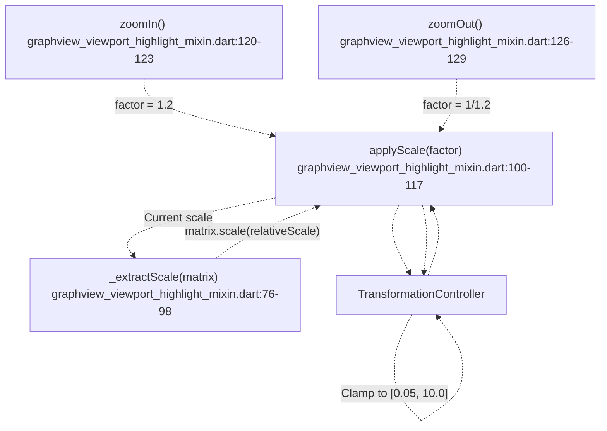

**Zoom Algorithm:**

1. **Extract current scale** from transformation matrix
2. **Compute target scale**: `currentScale × factor`
3. **Clamp target**: Ensure scale stays within `[0.05, 10.0]`
4. **Compute relative scale**: `targetScale / currentScale`
5. **Apply to matrix**: `matrix.scale(relativeScale)`

**Zoom Factors:**

* Zoom in: multiply by `1.2` (20% increase)
* Zoom out: multiply by `1/1.2` ≈ `0.833` (17% decrease)

**Sources:** [lib/features/canvas/graphview/graphview_viewport_highlight_mixin.dart L76-L129](https://github.com/ThalesMMS/JFlutter/blob/32e808b4/lib/features/canvas/graphview/graphview_viewport_highlight_mixin.dart#L76-L129)

### Fit to Content Operation

The `fitToContent()` method adjusts the viewport to show all nodes with optimal zoom and centering.

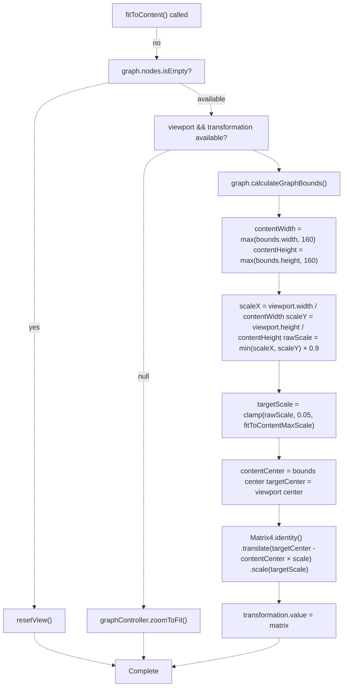

**Fit to Content Parameters:**

| Parameter | Value | Purpose |
| --- | --- | --- |
| `fitToContentMaxScale` | 1.75 (default) | Maximum zoom when fitting content |
| `_kFitToContentFallbackExtent` | 160.0 | Minimum content size to prevent excessive zoom |
| Scale padding | 0.9 (90%) | Leaves 10% margin around content |

**TM Canvas Override:** The Turing Machine canvas uses a lower max scale of `1.35` to accommodate tape visualization [lib/features/canvas/graphview/graphview_tm_canvas_controller.dart L33](https://github.com/ThalesMMS/JFlutter/blob/32e808b4/lib/features/canvas/graphview/graphview_tm_canvas_controller.dart#L33-L33)

**Sources:** [lib/features/canvas/graphview/graphview_viewport_highlight_mixin.dart L140-L181](https://github.com/ThalesMMS/JFlutter/blob/32e808b4/lib/features/canvas/graphview/graphview_viewport_highlight_mixin.dart#L140-L181)

 [lib/features/canvas/graphview/graphview_tm_canvas_controller.dart L33](https://github.com/ThalesMMS/JFlutter/blob/32e808b4/lib/features/canvas/graphview/graphview_tm_canvas_controller.dart#L33-L33)

### Reset View Operation

Restores the viewport to identity transformation (no zoom, no pan).

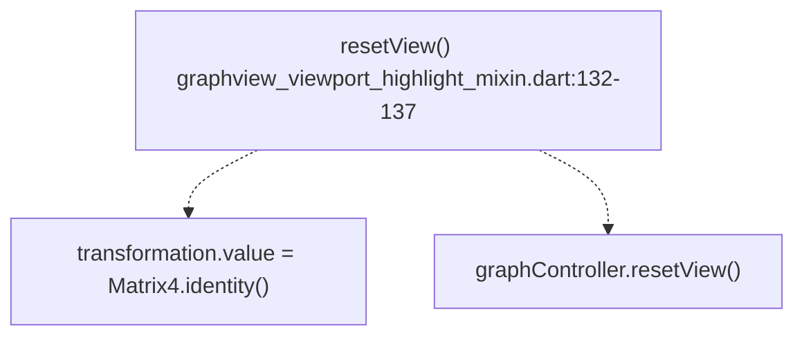

**Implementation:**

* Sets transformation matrix to `Matrix4.identity()`
* Delegates to `GraphViewController.resetView()` for additional cleanup

**Sources:** [lib/features/canvas/graphview/graphview_viewport_highlight_mixin.dart L132-L137](https://github.com/ThalesMMS/JFlutter/blob/32e808b4/lib/features/canvas/graphview/graphview_viewport_highlight_mixin.dart#L132-L137)

---

## Integration with Canvas Toolbar

The viewport operations are exposed to users through the `GraphViewCanvasToolbar` widget.

```

```

**Toolbar Layouts:**

| Layout | Widget Type | Use Case |
| --- | --- | --- |
| Desktop | `IconButton` in horizontal row | Wide screens (≥1024px) |
| Mobile | `FilledButton.icon` in wrapped grid | Small screens (<1024px) |

**Button State Management:**

* Toolbar observes `controller.graphRevision` to rebuild when history changes [lib/presentation/widgets/graphview_canvas_toolbar.dart L61](https://github.com/ThalesMMS/JFlutter/blob/32e808b4/lib/presentation/widgets/graphview_canvas_toolbar.dart#L61-L61)
* Undo/Redo buttons enabled based on `controller.canUndo` / `controller.canRedo` [lib/presentation/widgets/graphview_canvas_toolbar.dart L118-L136](https://github.com/ThalesMMS/JFlutter/blob/32e808b4/lib/presentation/widgets/graphview_canvas_toolbar.dart#L118-L136)

**Sources:** [lib/presentation/widgets/graphview_canvas_toolbar.dart L20-L154](https://github.com/ThalesMMS/JFlutter/blob/32e808b4/lib/presentation/widgets/graphview_canvas_toolbar.dart#L20-L154)

 [lib/presentation/widgets/graphview_canvas_toolbar.dart L61-L86](https://github.com/ThalesMMS/JFlutter/blob/32e808b4/lib/presentation/widgets/graphview_canvas_toolbar.dart#L61-L86)

---

## Coordinate Conversion Use Cases

### Use Case 1: Adding State at Tap Position

When the user taps the canvas with the "Add State" tool active:

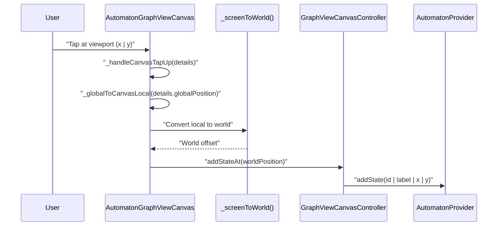

**File References:**

* Tap handler: [lib/presentation/widgets/automaton_graphview_canvas.dart L737-L752](https://github.com/ThalesMMS/JFlutter/blob/32e808b4/lib/presentation/widgets/automaton_graphview_canvas.dart#L737-L752)
* Add state logic: [lib/features/canvas/graphview/graphview_canvas_controller.dart L141-L161](https://github.com/ThalesMMS/JFlutter/blob/32e808b4/lib/features/canvas/graphview/graphview_canvas_controller.dart#L141-L161)

**Sources:** [lib/presentation/widgets/automaton_graphview_canvas.dart L737-L752](https://github.com/ThalesMMS/JFlutter/blob/32e808b4/lib/presentation/widgets/automaton_graphview_canvas.dart#L737-L752)

 [lib/features/canvas/graphview/graphview_canvas_controller.dart L141-L161](https://github.com/ThalesMMS/JFlutter/blob/32e808b4/lib/features/canvas/graphview/graphview_canvas_controller.dart#L141-L161)

### Use Case 2: Node Drag Positioning

When the user drags a state node:

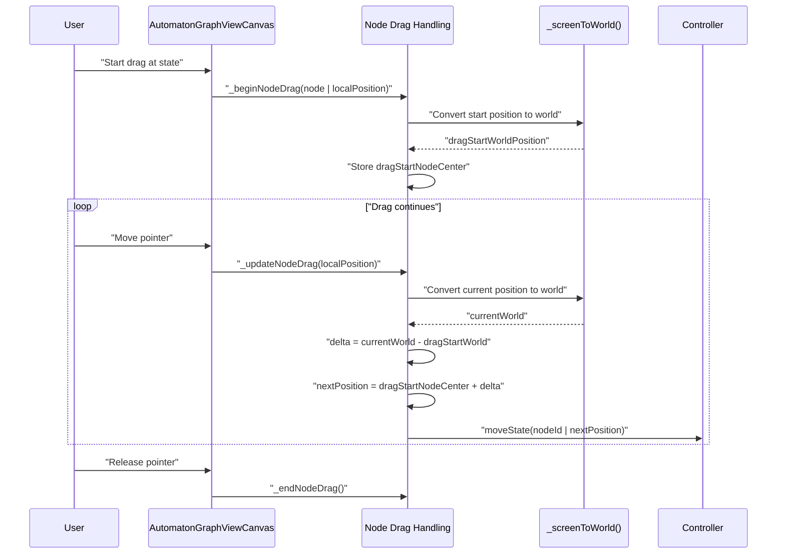

**Drag State Variables:**

* `_draggingNodeId`: ID of node being dragged [lib/presentation/widgets/automaton_graphview_canvas.dart L355](https://github.com/ThalesMMS/JFlutter/blob/32e808b4/lib/presentation/widgets/automaton_graphview_canvas.dart#L355-L355)
* `_dragStartWorldPosition`: World position when drag began [lib/presentation/widgets/automaton_graphview_canvas.dart L356](https://github.com/ThalesMMS/JFlutter/blob/32e808b4/lib/presentation/widgets/automaton_graphview_canvas.dart#L356-L356)
* `_dragStartNodeCenter`: Original node center in world coordinates [lib/presentation/widgets/automaton_graphview_canvas.dart L357](https://github.com/ThalesMMS/JFlutter/blob/32e808b4/lib/presentation/widgets/automaton_graphview_canvas.dart#L357-L357)

**File References:**

* Begin drag: [lib/presentation/widgets/automaton_graphview_canvas.dart L701-L710](https://github.com/ThalesMMS/JFlutter/blob/32e808b4/lib/presentation/widgets/automaton_graphview_canvas.dart#L701-L710)
* Update drag: [lib/presentation/widgets/automaton_graphview_canvas.dart L712-L726](https://github.com/ThalesMMS/JFlutter/blob/32e808b4/lib/presentation/widgets/automaton_graphview_canvas.dart#L712-L726)
* End drag: [lib/presentation/widgets/automaton_graphview_canvas.dart L728-L735](https://github.com/ThalesMMS/JFlutter/blob/32e808b4/lib/presentation/widgets/automaton_graphview_canvas.dart#L728-L735)

**Sources:** [lib/presentation/widgets/automaton_graphview_canvas.dart L701-L735](https://github.com/ThalesMMS/JFlutter/blob/32e808b4/lib/presentation/widgets/automaton_graphview_canvas.dart#L701-L735)

### Use Case 3: Transition Overlay Positioning

When displaying the transition editor overlay:

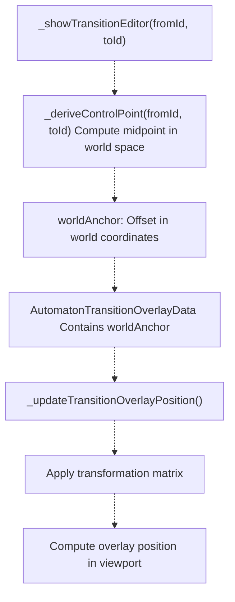

The transition overlay stores its anchor in **world coordinates** but must be positioned in **viewport coordinates** for rendering. The position is recomputed whenever the transformation changes [lib/presentation/widgets/automaton_graphview_canvas.dart L557-L560](https://github.com/ThalesMMS/JFlutter/blob/32e808b4/lib/presentation/widgets/automaton_graphview_canvas.dart#L557-L560)

**Sources:** [lib/presentation/widgets/automaton_graphview_canvas.dart L970-L1072](https://github.com/ThalesMMS/JFlutter/blob/32e808b4/lib/presentation/widgets/automaton_graphview_canvas.dart#L970-L1072)

 [lib/presentation/widgets/automaton_graphview_canvas.dart L557-L560](https://github.com/ThalesMMS/JFlutter/blob/32e808b4/lib/presentation/widgets/automaton_graphview_canvas.dart#L557-L560)

---

## Viewport Center Resolution

The `resolveViewportCenterWorld()` method is critical for operations that add states at the viewport center.

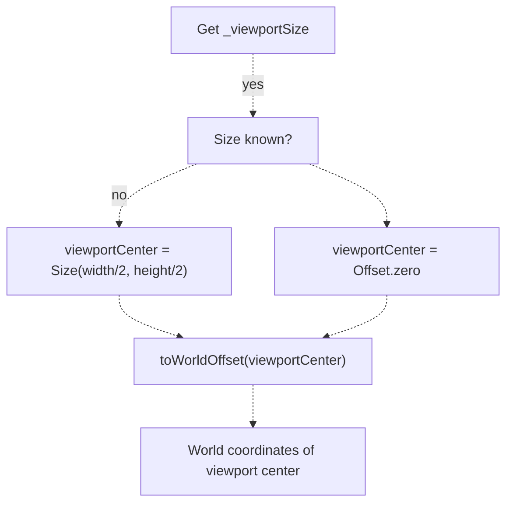

**Method Signature:**

```
Offset resolveViewportCenterWorld()
```

**Used By:**

* `GraphViewCanvasController.addStateAtCenter()` [lib/features/canvas/graphview/graphview_canvas_controller.dart L136](https://github.com/ThalesMMS/JFlutter/blob/32e808b4/lib/features/canvas/graphview/graphview_canvas_controller.dart#L136-L136)
* `GraphViewTmCanvasController.addStateAtCenter()` [lib/features/canvas/graphview/graphview_tm_canvas_controller.dart L141](https://github.com/ThalesMMS/JFlutter/blob/32e808b4/lib/features/canvas/graphview/graphview_tm_canvas_controller.dart#L141-L141)
* `GraphViewPdaCanvasController.addStateAtCenter()` [lib/features/canvas/graphview/graphview_pda_canvas_controller.dart L135](https://github.com/ThalesMMS/JFlutter/blob/32e808b4/lib/features/canvas/graphview/graphview_pda_canvas_controller.dart#L135-L135)

**Sources:** [lib/features/canvas/graphview/base_graphview_canvas_controller.dart L199-L210](https://github.com/ThalesMMS/JFlutter/blob/32e808b4/lib/features/canvas/graphview/base_graphview_canvas_controller.dart#L199-L210)

 [lib/features/canvas/graphview/graphview_canvas_controller.dart L134-L138](https://github.com/ThalesMMS/JFlutter/blob/32e808b4/lib/features/canvas/graphview/graphview_canvas_controller.dart#L134-L138)

---

## Coordinate System Best Practices

### When to Use Each Coordinate Space

| Operation | Coordinate Space | Rationale |
| --- | --- | --- |
| Store state positions | World | Stable across zoom/pan |
| Hit testing nodes | World | Compare against stored positions |
| Render nodes | Viewport | Transformed by `InteractiveViewer` |
| Handle touch events | Global → Canvas-local → World | Touch events arrive in global space |
| Compute control points | World | Consistent with state positions |
| Display overlays | World (stored) → Viewport (rendered) | Anchor in world, render in viewport |

### Common Pitfalls

1. **Forgetting to check matrix determinant**: A zero determinant means the matrix is non-invertible, and the conversion will fail. Always check before inverting [lib/presentation/widgets/automaton_graphview_canvas.dart L621-L624](https://github.com/ThalesMMS/JFlutter/blob/32e808b4/lib/presentation/widgets/automaton_graphview_canvas.dart#L621-L624)
2. **Not updating viewport size**: The `fitToContent()` method requires accurate viewport dimensions. Ensure `updateViewportSize()` is called when the canvas resizes [lib/features/canvas/graphview/base_graphview_canvas_controller.dart L161-L173](https://github.com/ThalesMMS/JFlutter/blob/32e808b4/lib/features/canvas/graphview/base_graphview_canvas_controller.dart#L161-L173)
3. **Mixing coordinate spaces**: Always convert to the correct space before performing calculations. For example, don't compare a world coordinate directly with a viewport coordinate.
4. **Transformation timing**: The transformation matrix is mutable and changes during user interaction. Always read the current value from `TransformationController` rather than caching it.

**Sources:** [lib/presentation/widgets/automaton_graphview_canvas.dart L621-L624](https://github.com/ThalesMMS/JFlutter/blob/32e808b4/lib/presentation/widgets/automaton_graphview_canvas.dart#L621-L624)

 [lib/features/canvas/graphview/base_graphview_canvas_controller.dart L161-L173](https://github.com/ThalesMMS/JFlutter/blob/32e808b4/lib/features/canvas/graphview/base_graphview_canvas_controller.dart#L161-L173)

---

## Summary

The JFlutter canvas coordinate system provides a robust foundation for interactive automaton editing:

* **Three coordinate spaces** (world, viewport, global) are used for different purposes
* **Transformation matrix** stored in `TransformationController` encodes zoom and pan
* **Bidirectional conversion** methods transform between coordinate spaces with proper matrix inversion
* **Viewport operations** (zoom, fit, reset) are exposed through mixin and toolbar
* **Viewport size tracking** enables accurate center resolution and fit-to-content calculations

The architecture separates concerns cleanly: world coordinates represent stable logical positions, viewport coordinates handle rendering and interaction, and the transformation matrix bridges between them. This design allows the canvas to handle complex interactions while maintaining data consistency.

Refresh this wiki

Last indexed: 30 December 2025 ([32e808](https://github.com/ThalesMMS/JFlutter/commit/32e808b4))

### On this page

* [Coordinate Systems and Viewport](#4.5-coordinate-systems-and-viewport)
* [Purpose and Scope](#4.5-purpose-and-scope)
* [Coordinate Systems Overview](#4.5-coordinate-systems-overview)
* [Coordinate Space Definitions](#4.5-coordinate-space-definitions)
* [Transformation Matrix Architecture](#4.5-transformation-matrix-architecture)
* [Transformation Controller Structure](#4.5-transformation-controller-structure)
* [Matrix4 Structure](#4.5-matrix4-structure)
* [Coordinate Conversion Methods](#4.5-coordinate-conversion-methods)
* [World to Viewport Conversion](#4.5-world-to-viewport-conversion)
* [Viewport to World Conversion](#4.5-viewport-to-world-conversion)
* [Global to Canvas-Local Conversion](#4.5-global-to-canvas-local-conversion)
* [Viewport Size Tracking](#4.5-viewport-size-tracking)
* [Viewport Operations](#4.5-viewport-operations)
* [Zoom Operations](#4.5-zoom-operations)
* [Fit to Content Operation](#4.5-fit-to-content-operation)
* [Reset View Operation](#4.5-reset-view-operation)
* [Integration with Canvas Toolbar](#4.5-integration-with-canvas-toolbar)
* [Coordinate Conversion Use Cases](#4.5-coordinate-conversion-use-cases)
* [Use Case 1: Adding State at Tap Position](#4.5-use-case-1-adding-state-at-tap-position)
* [Use Case 2: Node Drag Positioning](#4.5-use-case-2-node-drag-positioning)
* [Use Case 3: Transition Overlay Positioning](#4.5-use-case-3-transition-overlay-positioning)
* [Viewport Center Resolution](#4.5-viewport-center-resolution)
* [Coordinate System Best Practices](#4.5-coordinate-system-best-practices)
* [When to Use Each Coordinate Space](#4.5-when-to-use-each-coordinate-space)
* [Common Pitfalls](#4.5-common-pitfalls)
* [Summary](#4.5-summary)

Ask Devin about JFlutter