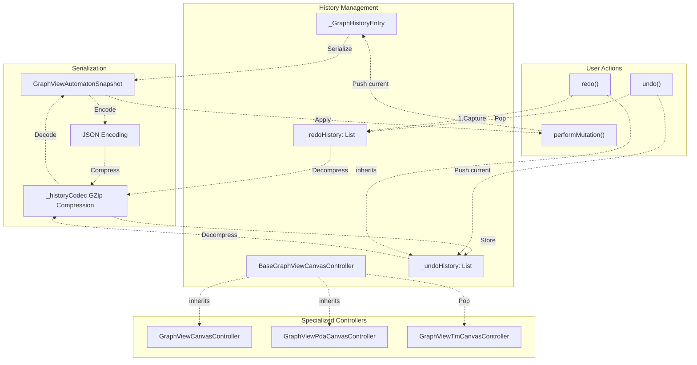
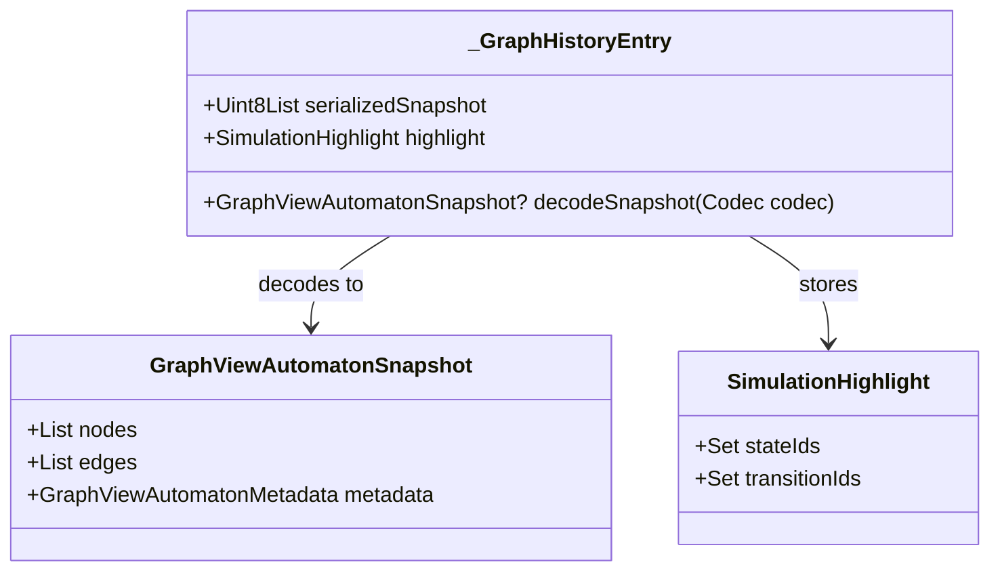
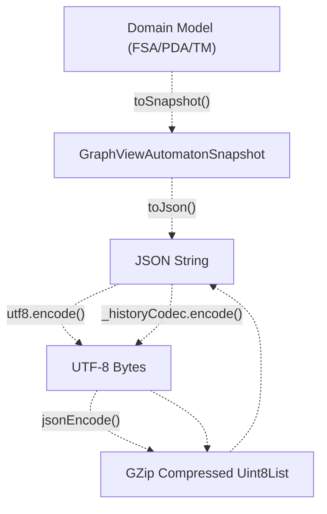
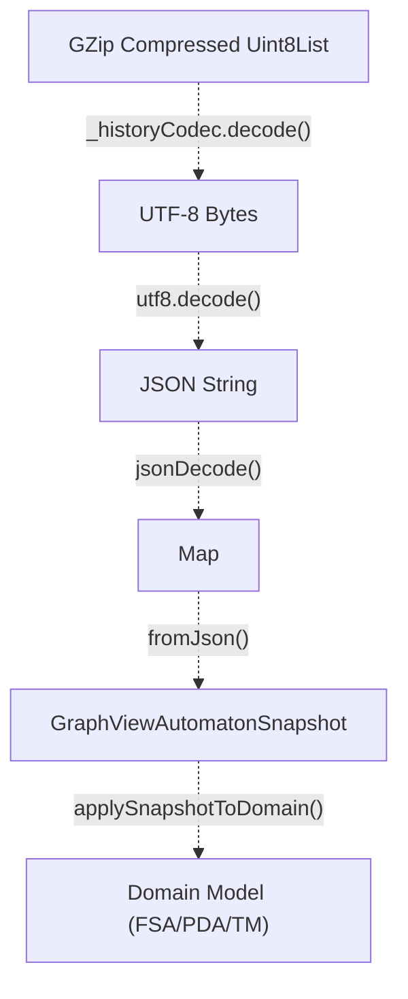
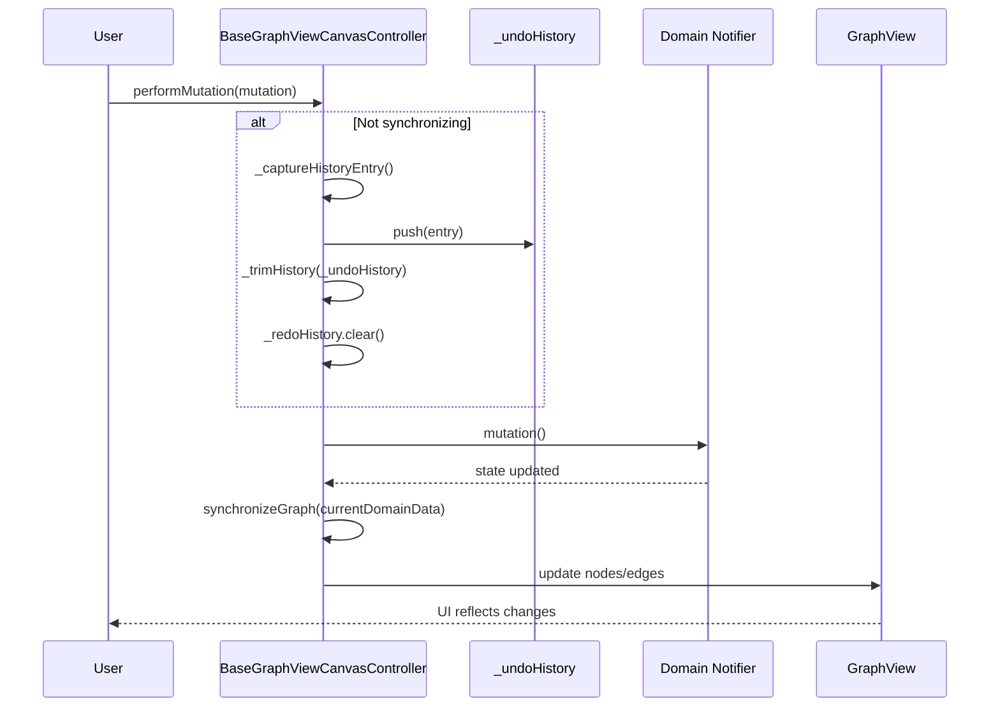
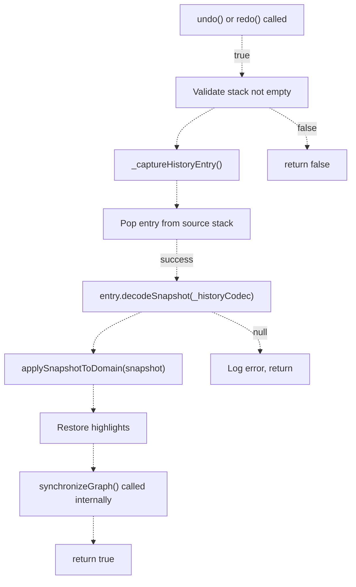
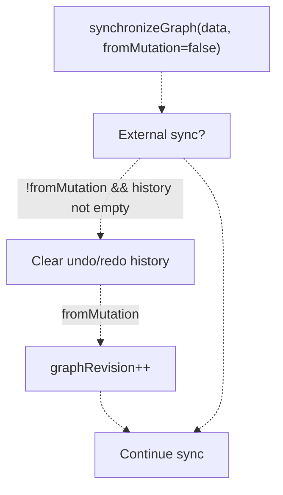
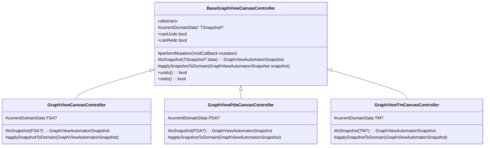
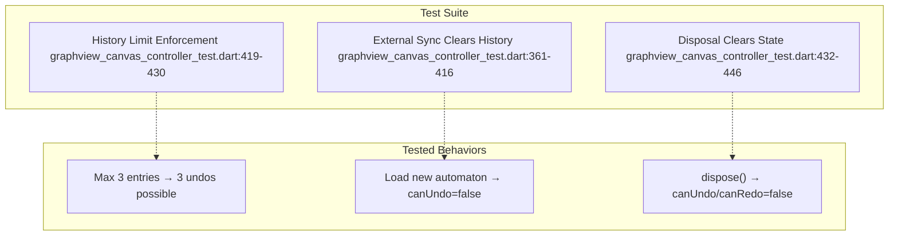

# Undo/Redo System

> **Relevant source files**
> * [lib/features/canvas/graphview/base_graphview_canvas_controller.dart](https://github.com/ThalesMMS/JFlutter/blob/32e808b4/lib/features/canvas/graphview/base_graphview_canvas_controller.dart)
> * [lib/features/canvas/graphview/graphview_canvas_controller.dart](https://github.com/ThalesMMS/JFlutter/blob/32e808b4/lib/features/canvas/graphview/graphview_canvas_controller.dart)
> * [lib/features/canvas/graphview/graphview_pda_canvas_controller.dart](https://github.com/ThalesMMS/JFlutter/blob/32e808b4/lib/features/canvas/graphview/graphview_pda_canvas_controller.dart)
> * [lib/features/canvas/graphview/graphview_pda_mapper.dart](https://github.com/ThalesMMS/JFlutter/blob/32e808b4/lib/features/canvas/graphview/graphview_pda_mapper.dart)
> * [lib/features/canvas/graphview/graphview_tm_canvas_controller.dart](https://github.com/ThalesMMS/JFlutter/blob/32e808b4/lib/features/canvas/graphview/graphview_tm_canvas_controller.dart)
> * [lib/features/canvas/graphview/graphview_tm_mapper.dart](https://github.com/ThalesMMS/JFlutter/blob/32e808b4/lib/features/canvas/graphview/graphview_tm_mapper.dart)
> * [lib/features/canvas/graphview/graphview_viewport_highlight_mixin.dart](https://github.com/ThalesMMS/JFlutter/blob/32e808b4/lib/features/canvas/graphview/graphview_viewport_highlight_mixin.dart)
> * [test/features/canvas/graphview/graphview_automaton_mapper_test.dart](https://github.com/ThalesMMS/JFlutter/blob/32e808b4/test/features/canvas/graphview/graphview_automaton_mapper_test.dart)
> * [test/features/canvas/graphview/graphview_canvas_controller_test.dart](https://github.com/ThalesMMS/JFlutter/blob/32e808b4/test/features/canvas/graphview/graphview_canvas_controller_test.dart)
> * [test/features/canvas/graphview/graphview_canvas_models_test.dart](https://github.com/ThalesMMS/JFlutter/blob/32e808b4/test/features/canvas/graphview/graphview_canvas_models_test.dart)
> * [test/features/canvas/graphview/graphview_pda_canvas_controller_test.dart](https://github.com/ThalesMMS/JFlutter/blob/32e808b4/test/features/canvas/graphview/graphview_pda_canvas_controller_test.dart)
> * [test/features/canvas/graphview/graphview_pda_mapper_test.dart](https://github.com/ThalesMMS/JFlutter/blob/32e808b4/test/features/canvas/graphview/graphview_pda_mapper_test.dart)
> * [test/features/canvas/graphview/graphview_tm_canvas_controller_test.dart](https://github.com/ThalesMMS/JFlutter/blob/32e808b4/test/features/canvas/graphview/graphview_tm_canvas_controller_test.dart)
> * [test/features/canvas/graphview/graphview_tm_mapper_test.dart](https://github.com/ThalesMMS/JFlutter/blob/32e808b4/test/features/canvas/graphview/graphview_tm_mapper_test.dart)
> * [test/widget/presentation/mobile_automaton_controls_test.dart](https://github.com/ThalesMMS/JFlutter/blob/32e808b4/test/widget/presentation/mobile_automaton_controls_test.dart)
> * [test/widget/presentation/pda_canvas_graphview_test.dart](https://github.com/ThalesMMS/JFlutter/blob/32e808b4/test/widget/presentation/pda_canvas_graphview_test.dart)
> * [test/widget/presentation/tm_canvas_graphview_test.dart](https://github.com/ThalesMMS/JFlutter/blob/32e808b4/test/widget/presentation/tm_canvas_graphview_test.dart)
> * [test/widget/presentation/visualizations_test.dart](https://github.com/ThalesMMS/JFlutter/blob/32e808b4/test/widget/presentation/visualizations_test.dart)

The undo/redo system provides history management for canvas editing operations across all automaton types (FSA, PDA, TM). It captures snapshots of the entire graph state before each mutation, enabling users to revert or reapply changes. The system integrates tightly with the canvas controller hierarchy and includes compression to minimize memory overhead.

For information about canvas controllers and their lifecycle, see [Canvas Controllers](#4.2). For details on snapshot serialization format, see [Canvas Customization System](#4.3).

---

## Architecture Overview

The undo/redo system is implemented as part of the `BaseGraphViewCanvasController` abstract base class, making it available to all specialized controllers (FSA, PDA, TM). History entries store compressed snapshots of both the graph structure and any active simulation highlights.



**Sources:** [lib/features/canvas/graphview/base_graphview_canvas_controller.dart L1-L595](https://github.com/ThalesMMS/JFlutter/blob/32e808b4/lib/features/canvas/graphview/base_graphview_canvas_controller.dart#L1-L595)

---

## History Entry Structure

Each history entry stores a serialized and compressed snapshot of the entire canvas state along with any active simulation highlights. The entry is immutable and includes a decoding method for restoration.

### _GraphHistoryEntry Class



| Field | Type | Description |
| --- | --- | --- |
| `serializedSnapshot` | `Uint8List` | GZip-compressed JSON snapshot of graph state |
| `highlight` | `SimulationHighlight` | Active state/transition highlights at capture time |

The `decodeSnapshot()` method performs decompression → UTF-8 decoding → JSON parsing → snapshot deserialization. It returns `null` if any step fails, allowing graceful degradation.

**Sources:** [lib/features/canvas/graphview/base_graphview_canvas_controller.dart L33-L55](https://github.com/ThalesMMS/JFlutter/blob/32e808b4/lib/features/canvas/graphview/base_graphview_canvas_controller.dart#L33-L55)

---

## Snapshot Serialization

History entries use a multi-stage compression pipeline to minimize memory footprint. The default history limit of 20 entries typically consumes less than 1 MB even for complex automata.

### Encoding Pipeline



### Decoding Pipeline



The codec is created once at class initialization: [lib/features/canvas/graphview/base_graphview_canvas_controller.dart L63-L64](https://github.com/ThalesMMS/JFlutter/blob/32e808b4/lib/features/canvas/graphview/base_graphview_canvas_controller.dart#L63-L64)

 It wraps the standard `GZipCodec` and is shared across all history operations.

**Sources:** [lib/features/canvas/graphview/base_graphview_canvas_controller.dart L63-L64](https://github.com/ThalesMMS/JFlutter/blob/32e808b4/lib/features/canvas/graphview/base_graphview_canvas_controller.dart#L63-L64)

 [lib/features/canvas/graphview/base_graphview_canvas_controller.dart L525-L543](https://github.com/ThalesMMS/JFlutter/blob/32e808b4/lib/features/canvas/graphview/base_graphview_canvas_controller.dart#L525-L543)

 [lib/features/canvas/graphview/base_graphview_canvas_controller.dart L42-L54](https://github.com/ThalesMMS/JFlutter/blob/32e808b4/lib/features/canvas/graphview/base_graphview_canvas_controller.dart#L42-L54)

---

## Mutation Recording

All canvas modifications must be wrapped in `performMutation()` to enable undo/redo. This method captures the current state before executing the mutation, then synchronizes the graph with the updated domain data.

### performMutation() Flow



**Key Behaviors:**

| Scenario | Behavior |
| --- | --- |
| Normal mutation | Captures history entry, clears redo stack |
| During synchronization | Skips history capture (set by `_isSynchronizing` flag) |
| During undo/redo | Skips history capture (mutations triggered by history application) |
| Serialization failure | Logs warning, continues with mutation |

The `_isSynchronizing` flag prevents recursive history captures when `synchronizeGraph()` triggers internal state updates: [lib/features/canvas/graphview/base_graphview_canvas_controller.dart L106](https://github.com/ThalesMMS/JFlutter/blob/32e808b4/lib/features/canvas/graphview/base_graphview_canvas_controller.dart#L106-L106)

 [lib/features/canvas/graphview/base_graphview_canvas_controller.dart L258-L261](https://github.com/ThalesMMS/JFlutter/blob/32e808b4/lib/features/canvas/graphview/base_graphview_canvas_controller.dart#L258-L261)

**Sources:** [lib/features/canvas/graphview/base_graphview_canvas_controller.dart L256-L281](https://github.com/ThalesMMS/JFlutter/blob/32e808b4/lib/features/canvas/graphview/base_graphview_canvas_controller.dart#L256-L281)

---

## Undo/Redo Operations

Undo and redo operations transfer entries between the two history stacks while restoring the corresponding graph state and highlights.

### State Diagram

```css
#mermaid-h80c9rgz3as{font-family:ui-sans-serif,-apple-system,system-ui,Segoe UI,Helvetica;font-size:16px;fill:#ccc;}@keyframes edge-animation-frame{from{stroke-dashoffset:0;}}@keyframes dash{to{stroke-dashoffset:0;}}#mermaid-h80c9rgz3as .edge-animation-slow{stroke-dasharray:9,5!important;stroke-dashoffset:900;animation:dash 50s linear infinite;stroke-linecap:round;}#mermaid-h80c9rgz3as .edge-animation-fast{stroke-dasharray:9,5!important;stroke-dashoffset:900;animation:dash 20s linear infinite;stroke-linecap:round;}#mermaid-h80c9rgz3as .error-icon{fill:#a44141;}#mermaid-h80c9rgz3as .error-text{fill:#ddd;stroke:#ddd;}#mermaid-h80c9rgz3as .edge-thickness-normal{stroke-width:1px;}#mermaid-h80c9rgz3as .edge-thickness-thick{stroke-width:3.5px;}#mermaid-h80c9rgz3as .edge-pattern-solid{stroke-dasharray:0;}#mermaid-h80c9rgz3as .edge-thickness-invisible{stroke-width:0;fill:none;}#mermaid-h80c9rgz3as .edge-pattern-dashed{stroke-dasharray:3;}#mermaid-h80c9rgz3as .edge-pattern-dotted{stroke-dasharray:2;}#mermaid-h80c9rgz3as .marker{fill:lightgrey;stroke:lightgrey;}#mermaid-h80c9rgz3as .marker.cross{stroke:lightgrey;}#mermaid-h80c9rgz3as svg{font-family:ui-sans-serif,-apple-system,system-ui,Segoe UI,Helvetica;font-size:16px;}#mermaid-h80c9rgz3as p{margin:0;}#mermaid-h80c9rgz3as defs #statediagram-barbEnd{fill:lightgrey;stroke:lightgrey;}#mermaid-h80c9rgz3as g.stateGroup text{fill:#ccc;stroke:none;font-size:10px;}#mermaid-h80c9rgz3as g.stateGroup text{fill:#ccc;stroke:none;font-size:10px;}#mermaid-h80c9rgz3as g.stateGroup .state-title{font-weight:bolder;fill:#e0dfdf;}#mermaid-h80c9rgz3as g.stateGroup rect{fill:#1f2020;stroke:#ccc;}#mermaid-h80c9rgz3as g.stateGroup line{stroke:lightgrey;stroke-width:1;}#mermaid-h80c9rgz3as .transition{stroke:lightgrey;stroke-width:1;fill:none;}#mermaid-h80c9rgz3as .stateGroup .composit{fill:#333;border-bottom:1px;}#mermaid-h80c9rgz3as .stateGroup .alt-composit{fill:#e0e0e0;border-bottom:1px;}#mermaid-h80c9rgz3as .state-note{stroke:hsl(180, 0%, 18.3529411765%);fill:hsl(180, 1.5873015873%, 28.3529411765%);}#mermaid-h80c9rgz3as .state-note text{fill:rgb(183.8476190475, 181.5523809523, 181.5523809523);stroke:none;font-size:10px;}#mermaid-h80c9rgz3as .stateLabel .box{stroke:none;stroke-width:0;fill:#1f2020;opacity:0.5;}#mermaid-h80c9rgz3as .edgeLabel .label rect{fill:#1f2020;opacity:0.5;}#mermaid-h80c9rgz3as .edgeLabel{background-color:hsl(0, 0%, 34.4117647059%);text-align:center;}#mermaid-h80c9rgz3as .edgeLabel p{background-color:hsl(0, 0%, 34.4117647059%);}#mermaid-h80c9rgz3as .edgeLabel rect{opacity:0.5;background-color:hsl(0, 0%, 34.4117647059%);fill:hsl(0, 0%, 34.4117647059%);}#mermaid-h80c9rgz3as .edgeLabel .label text{fill:#ccc;}#mermaid-h80c9rgz3as .label div .edgeLabel{color:#ccc;}#mermaid-h80c9rgz3as .stateLabel text{fill:#e0dfdf;font-size:10px;font-weight:bold;}#mermaid-h80c9rgz3as .node circle.state-start{fill:#f4f4f4;stroke:#f4f4f4;}#mermaid-h80c9rgz3as .node .fork-join{fill:#f4f4f4;stroke:#f4f4f4;}#mermaid-h80c9rgz3as .node circle.state-end{fill:#cccccc;stroke:#333;stroke-width:1.5;}#mermaid-h80c9rgz3as .end-state-inner{fill:#333;stroke-width:1.5;}#mermaid-h80c9rgz3as .node rect{fill:#1f2020;stroke:#ccc;stroke-width:1px;}#mermaid-h80c9rgz3as .node polygon{fill:#1f2020;stroke:#ccc;stroke-width:1px;}#mermaid-h80c9rgz3as #statediagram-barbEnd{fill:lightgrey;}#mermaid-h80c9rgz3as .statediagram-cluster rect{fill:#1f2020;stroke:#ccc;stroke-width:1px;}#mermaid-h80c9rgz3as .cluster-label,#mermaid-h80c9rgz3as .nodeLabel{color:#e0dfdf;}#mermaid-h80c9rgz3as .statediagram-cluster rect.outer{rx:5px;ry:5px;}#mermaid-h80c9rgz3as .statediagram-state .divider{stroke:#ccc;}#mermaid-h80c9rgz3as .statediagram-state .title-state{rx:5px;ry:5px;}#mermaid-h80c9rgz3as .statediagram-cluster.statediagram-cluster .inner{fill:#333;}#mermaid-h80c9rgz3as .statediagram-cluster.statediagram-cluster-alt .inner{fill:#555;}#mermaid-h80c9rgz3as .statediagram-cluster .inner{rx:0;ry:0;}#mermaid-h80c9rgz3as .statediagram-state rect.basic{rx:5px;ry:5px;}#mermaid-h80c9rgz3as .statediagram-state rect.divider{stroke-dasharray:10,10;fill:#555;}#mermaid-h80c9rgz3as .note-edge{stroke-dasharray:5;}#mermaid-h80c9rgz3as .statediagram-note rect{fill:hsl(180, 1.5873015873%, 28.3529411765%);stroke:hsl(180, 0%, 18.3529411765%);stroke-width:1px;rx:0;ry:0;}#mermaid-h80c9rgz3as .statediagram-note rect{fill:hsl(180, 1.5873015873%, 28.3529411765%);stroke:hsl(180, 0%, 18.3529411765%);stroke-width:1px;rx:0;ry:0;}#mermaid-h80c9rgz3as .statediagram-note text{fill:rgb(183.8476190475, 181.5523809523, 181.5523809523);}#mermaid-h80c9rgz3as .statediagram-note .nodeLabel{color:rgb(183.8476190475, 181.5523809523, 181.5523809523);}#mermaid-h80c9rgz3as .statediagram .edgeLabel{color:red;}#mermaid-h80c9rgz3as #dependencyStart,#mermaid-h80c9rgz3as #dependencyEnd{fill:lightgrey;stroke:lightgrey;stroke-width:1;}#mermaid-h80c9rgz3as .statediagramTitleText{text-anchor:middle;font-size:18px;fill:#ccc;}#mermaid-h80c9rgz3as :root{--mermaid-font-family:ui-sans-serif,-apple-system,system-ui,Segoe UI,Helvetica;}Initial StateperformMutation()performMutation()undo()undo()redo()undo() [all entries]external syncexternal syncredo() [if redo stack not empty]EmptyHasUndoCanRedoAndUndocanUndo = falsecanRedo = falsecanUndo = truecanRedo = falsecanUndo = truecanRedo = true
```

### undo() Implementation

The undo operation follows these steps:

1. **Validate**: Check `_undoHistory.isNotEmpty`
2. **Capture current**: Create entry for current state and push to `_redoHistory`
3. **Pop history**: Remove last entry from `_undoHistory`
4. **Restore**: Decode snapshot and apply to domain via `applySnapshotToDomain()`
5. **Restore highlights**: Update `highlightNotifier` and `highlightedTransitionIds`

[lib/features/canvas/graphview/base_graphview_canvas_controller.dart L284-L302](https://github.com/ThalesMMS/JFlutter/blob/32e808b4/lib/features/canvas/graphview/base_graphview_canvas_controller.dart#L284-L302)

### redo() Implementation

Redo mirrors undo but operates on the redo stack:

1. **Validate**: Check `_redoHistory.isNotEmpty`
2. **Capture current**: Create entry for current state and push to `_undoHistory`
3. **Pop redo**: Remove last entry from `_redoHistory`
4. **Restore**: Decode snapshot and apply to domain
5. **Restore highlights**: Update highlight state

[lib/features/canvas/graphview/base_graphview_canvas_controller.dart L305-L323](https://github.com/ThalesMMS/JFlutter/blob/32e808b4/lib/features/canvas/graphview/base_graphview_canvas_controller.dart#L305-L323)

### Restoration Process



**Sources:** [lib/features/canvas/graphview/base_graphview_canvas_controller.dart L284-L323](https://github.com/ThalesMMS/JFlutter/blob/32e808b4/lib/features/canvas/graphview/base_graphview_canvas_controller.dart#L284-L323)

 [lib/features/canvas/graphview/base_graphview_canvas_controller.dart L545-L563](https://github.com/ThalesMMS/JFlutter/blob/32e808b4/lib/features/canvas/graphview/base_graphview_canvas_controller.dart#L545-L563)

---

## History Management

The system enforces configurable limits and automatically clears history when external synchronization occurs.

### Configuration Parameters

| Parameter | Default | Description |
| --- | --- | --- |
| `historyLimit` | 20 | Maximum entries per stack (undo or redo) |
| `kDefaultHistoryLimit` | 20 | Constant default value |

These are set via constructor parameters: [lib/features/canvas/graphview/base_graphview_canvas_controller.dart L66-L76](https://github.com/ThalesMMS/JFlutter/blob/32e808b4/lib/features/canvas/graphview/base_graphview_canvas_controller.dart#L66-L76)

### History Trimming

When a history stack exceeds its limit, the oldest entries are removed:

```
void _trimHistory(List<_GraphHistoryEntry> history) {  final excess = history.length - historyLimit;  if (excess > 0) {    history.removeRange(0, excess);  }}
```

[lib/features/canvas/graphview/base_graphview_canvas_controller.dart L565-L570](https://github.com/ThalesMMS/JFlutter/blob/32e808b4/lib/features/canvas/graphview/base_graphview_canvas_controller.dart#L565-L570)

Trimming occurs after each `performMutation()` call: [lib/features/canvas/graphview/base_graphview_canvas_controller.dart L267](https://github.com/ThalesMMS/JFlutter/blob/32e808b4/lib/features/canvas/graphview/base_graphview_canvas_controller.dart#L267-L267)

### External Synchronization Handling

When `synchronizeGraph()` is called without the `fromMutation` flag, it indicates an external state change (e.g., loading a file, switching automata). In this case, both history stacks are cleared:



This prevents users from undoing across different automata or file loads: [lib/features/canvas/graphview/base_graphview_canvas_controller.dart L327-L337](https://github.com/ThalesMMS/JFlutter/blob/32e808b4/lib/features/canvas/graphview/base_graphview_canvas_controller.dart#L327-L337)

**Sources:** [lib/features/canvas/graphview/base_graphview_canvas_controller.dart L327-L337](https://github.com/ThalesMMS/JFlutter/blob/32e808b4/lib/features/canvas/graphview/base_graphview_canvas_controller.dart#L327-L337)

 [lib/features/canvas/graphview/base_graphview_canvas_controller.dart L565-L570](https://github.com/ThalesMMS/JFlutter/blob/32e808b4/lib/features/canvas/graphview/base_graphview_canvas_controller.dart#L565-L570)

---

## Controller Integration

All three specialized canvas controllers inherit undo/redo functionality from `BaseGraphViewCanvasController` without additional implementation. They must implement the abstract methods that enable history operations.

### Required Abstract Methods



### Implementation Examples

**FSA Controller** ([lib/features/canvas/graphview/graphview_canvas_controller.dart L58-L60](https://github.com/ThalesMMS/JFlutter/blob/32e808b4/lib/features/canvas/graphview/graphview_canvas_controller.dart#L58-L60)

 [lib/features/canvas/graphview/graphview_canvas_controller.dart L241-L276](https://github.com/ThalesMMS/JFlutter/blob/32e808b4/lib/features/canvas/graphview/graphview_canvas_controller.dart#L241-L276)

):

* Uses `GraphViewAutomatonMapper` for conversions
* Returns `_provider.state.currentAutomaton` for current data
* Applies snapshots via `_provider.updateAutomaton(merged)`

**PDA Controller** ([lib/features/canvas/graphview/graphview_pda_canvas_controller.dart L59-L61](https://github.com/ThalesMMS/JFlutter/blob/32e808b4/lib/features/canvas/graphview/graphview_pda_canvas_controller.dart#L59-L61)

 [lib/features/canvas/graphview/graphview_pda_canvas_controller.dart L267-L302](https://github.com/ThalesMMS/JFlutter/blob/32e808b4/lib/features/canvas/graphview/graphview_pda_canvas_controller.dart#L267-L302)

):

* Uses `GraphViewPdaMapper` for conversions
* Returns `_notifier.state.pda` for current data
* Applies snapshots via `_notifier.setPda(merged)`

**TM Controller** ([lib/features/canvas/graphview/graphview_tm_canvas_controller.dart L65-L67](https://github.com/ThalesMMS/JFlutter/blob/32e808b4/lib/features/canvas/graphview/graphview_tm_canvas_controller.dart#L65-L67)

 [lib/features/canvas/graphview/graphview_tm_canvas_controller.dart L272-L313](https://github.com/ThalesMMS/JFlutter/blob/32e808b4/lib/features/canvas/graphview/graphview_tm_canvas_controller.dart#L272-L313)

):

* Uses `GraphViewTmMapper` for conversions
* Returns `_notifier.state.tm` for current data
* Applies snapshots via `_notifier.setTm(merged)`

**Sources:** [lib/features/canvas/graphview/base_graphview_canvas_controller.dart L228-L240](https://github.com/ThalesMMS/JFlutter/blob/32e808b4/lib/features/canvas/graphview/base_graphview_canvas_controller.dart#L228-L240)

 [lib/features/canvas/graphview/graphview_canvas_controller.dart L33-L277](https://github.com/ThalesMMS/JFlutter/blob/32e808b4/lib/features/canvas/graphview/graphview_canvas_controller.dart#L33-L277)

 [lib/features/canvas/graphview/graphview_pda_canvas_controller.dart L35-L303](https://github.com/ThalesMMS/JFlutter/blob/32e808b4/lib/features/canvas/graphview/graphview_pda_canvas_controller.dart#L35-L303)

 [lib/features/canvas/graphview/graphview_tm_canvas_controller.dart L38-L313](https://github.com/ThalesMMS/JFlutter/blob/32e808b4/lib/features/canvas/graphview/graphview_tm_canvas_controller.dart#L38-L313)

---

## History Limits and Memory Management

The system includes safeguards to prevent unbounded memory growth and handle large automata gracefully.

### Memory Considerations

| Factor | Impact |
| --- | --- |
| Compression ratio | ~3-5x for typical automata (JSON → GZip) |
| Snapshot size | ~100-500 bytes per state/transition |
| 20-entry history | ~0.5-2 MB for moderate automata (50 states, 100 transitions) |

### Cache Eviction Threshold

In addition to history limits, the controller includes a `cacheEvictionThreshold` that clears internal caches when snapshots exceed a size threshold:

* **Default**: 250 nodes/edges ([lib/features/canvas/graphview/base_graphview_canvas_controller.dart L62](https://github.com/ThalesMMS/JFlutter/blob/32e808b4/lib/features/canvas/graphview/base_graphview_canvas_controller.dart#L62-L62) )
* **Purpose**: Prevent memory pressure from very large automata
* **Behavior**: Clears `_nodes`, `_edges`, `_graphNodes`, `_graphEdges` maps

[lib/features/canvas/graphview/base_graphview_canvas_controller.dart L346-L354](https://github.com/ThalesMMS/JFlutter/blob/32e808b4/lib/features/canvas/graphview/base_graphview_canvas_controller.dart#L346-L354)

### Disposal

When the controller is disposed, all history is explicitly cleared:

```
void dispose() {  _undoHistory.clear();  _redoHistory.clear();  highlightedTransitionIds.clear();  _evictGraphCaches(notifyGraph: false);  disposeViewportHighlight();}
```

[lib/features/canvas/graphview/base_graphview_canvas_controller.dart L213-L226](https://github.com/ThalesMMS/JFlutter/blob/32e808b4/lib/features/canvas/graphview/base_graphview_canvas_controller.dart#L213-L226)

**Sources:** [lib/features/canvas/graphview/base_graphview_canvas_controller.dart L61-L104](https://github.com/ThalesMMS/JFlutter/blob/32e808b4/lib/features/canvas/graphview/base_graphview_canvas_controller.dart#L61-L104)

 [lib/features/canvas/graphview/base_graphview_canvas_controller.dart L213-L226](https://github.com/ThalesMMS/JFlutter/blob/32e808b4/lib/features/canvas/graphview/base_graphview_canvas_controller.dart#L213-L226)

 [lib/features/canvas/graphview/base_graphview_canvas_controller.dart L346-L354](https://github.com/ThalesMMS/JFlutter/blob/32e808b4/lib/features/canvas/graphview/base_graphview_canvas_controller.dart#L346-L354)

---

## Testing

The undo/redo system is tested through the canvas controller test suites, covering both basic operations and edge cases.

### Core Test Coverage



### Test: History Limit Enforcement

[test/features/canvas/graphview/graphview_canvas_controller_test.dart L419-L430](https://github.com/ThalesMMS/JFlutter/blob/32e808b4/test/features/canvas/graphview/graphview_canvas_controller_test.dart#L419-L430)

```yaml
Given: historyLimit = 3
When: Perform 4 mutations (add state 4 times)
Then: Can undo 3 times, 4th undo returns false
```

This test verifies that `_trimHistory()` correctly removes the oldest entry when the limit is exceeded.

### Test: External Synchronization

[test/features/canvas/graphview/graphview_canvas_controller_test.dart L361-L416](https://github.com/ThalesMMS/JFlutter/blob/32e808b4/test/features/canvas/graphview/graphview_canvas_controller_test.dart#L361-L416)

```yaml
Given: Automaton A with undo history
When: Load Automaton B via external synchronization
Then: canUndo = false, graphRevision incremented
```

This test ensures that switching between automata doesn't allow undo across different contexts.

### Test: Disposal

[test/features/canvas/graphview/graphview_canvas_controller_test.dart L432-L446](https://github.com/ThalesMMS/JFlutter/blob/32e808b4/test/features/canvas/graphview/graphview_canvas_controller_test.dart#L432-L446)

```yaml
Given: Controller with undo/redo history
When: dispose() is called
Then: Both stacks cleared, caches empty
```

**Sources:** [test/features/canvas/graphview/graphview_canvas_controller_test.dart L419-L446](https://github.com/ThalesMMS/JFlutter/blob/32e808b4/test/features/canvas/graphview/graphview_canvas_controller_test.dart#L419-L446)

 [test/features/canvas/graphview/graphview_canvas_controller_test.dart L361-L416](https://github.com/ThalesMMS/JFlutter/blob/32e808b4/test/features/canvas/graphview/graphview_canvas_controller_test.dart#L361-L416)

---

## Usage Example

The undo/redo system is transparent to controller users. All mutations automatically participate in history:

```
// Normal mutation - automatically recordedcontroller.addStateAt(Offset(100, 100));controller.moveState('state_0', Offset(150, 150));// Check if undo is availableif (controller.canUndo) {  controller.undo();  // Restores state before move}// Check if redo is availableif (controller.canRedo) {  controller.redo();  // Reapplies the move}
```

Specialized controllers like `GraphViewCanvasController`, `GraphViewPdaCanvasController`, and `GraphViewTmCanvasController` automatically inherit this behavior. All operations that modify states or transitions—including `addStateAt()`, `moveState()`, `updateStateLabel()`, `addOrUpdateTransition()`, and `removeState()`—are wrapped in `performMutation()` internally.

**Sources:** [lib/features/canvas/graphview/graphview_canvas_controller.dart L141-L161](https://github.com/ThalesMMS/JFlutter/blob/32e808b4/lib/features/canvas/graphview/graphview_canvas_controller.dart#L141-L161)

 [lib/features/canvas/graphview/graphview_canvas_controller.dart L164-L170](https://github.com/ThalesMMS/JFlutter/blob/32e808b4/lib/features/canvas/graphview/graphview_canvas_controller.dart#L164-L170)

 [lib/features/canvas/graphview/base_graphview_canvas_controller.dart L256-L281](https://github.com/ThalesMMS/JFlutter/blob/32e808b4/lib/features/canvas/graphview/base_graphview_canvas_controller.dart#L256-L281)

Refresh this wiki

Last indexed: 30 December 2025 ([32e808](https://github.com/ThalesMMS/JFlutter/commit/32e808b4))

### On this page

* [Undo/Redo System](#4.6-undoredo-system)
* [Architecture Overview](#4.6-architecture-overview)
* [History Entry Structure](#4.6-history-entry-structure)
* [_GraphHistoryEntry Class](#4.6-object-object-class)
* [Snapshot Serialization](#4.6-snapshot-serialization)
* [Encoding Pipeline](#4.6-encoding-pipeline)
* [Decoding Pipeline](#4.6-decoding-pipeline)
* [Mutation Recording](#4.6-mutation-recording)
* [performMutation() Flow](#4.6-object-object-flow)
* [Undo/Redo Operations](#4.6-undoredo-operations)
* [State Diagram](#4.6-state-diagram)
* [undo() Implementation](#4.6-object-object-implementation)
* [redo() Implementation](#4.6-object-object-implementation-1)
* [Restoration Process](#4.6-restoration-process)
* [History Management](#4.6-history-management)
* [Configuration Parameters](#4.6-configuration-parameters)
* [History Trimming](#4.6-history-trimming)
* [External Synchronization Handling](#4.6-external-synchronization-handling)
* [Controller Integration](#4.6-controller-integration)
* [Required Abstract Methods](#4.6-required-abstract-methods)
* [Implementation Examples](#4.6-implementation-examples)
* [History Limits and Memory Management](#4.6-history-limits-and-memory-management)
* [Memory Considerations](#4.6-memory-considerations)
* [Cache Eviction Threshold](#4.6-cache-eviction-threshold)
* [Disposal](#4.6-disposal)
* [Testing](#4.6-testing)
* [Core Test Coverage](#4.6-core-test-coverage)
* [Test: History Limit Enforcement](#4.6-test-history-limit-enforcement)
* [Test: External Synchronization](#4.6-test-external-synchronization)
* [Test: Disposal](#4.6-test-disposal)
* [Usage Example](#4.6-usage-example)

Ask Devin about JFlutter