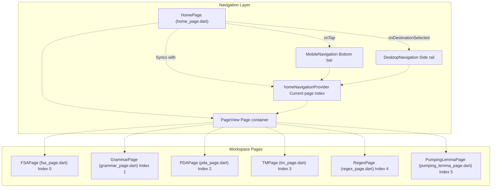
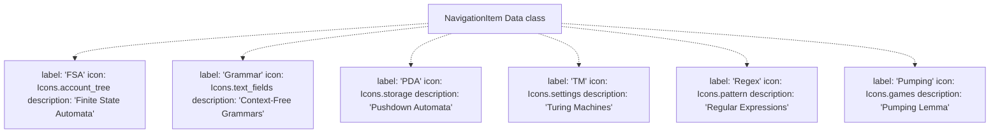
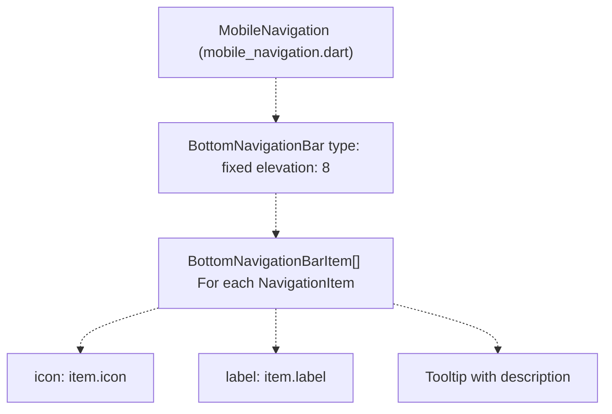
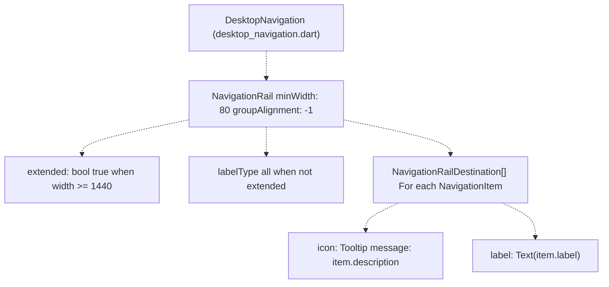
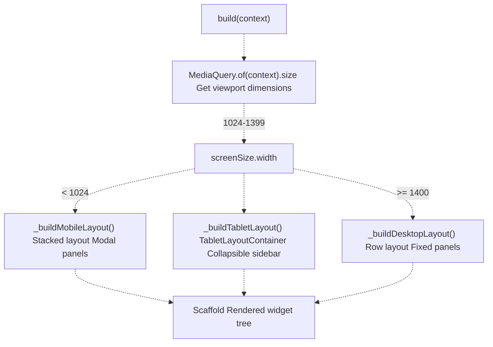
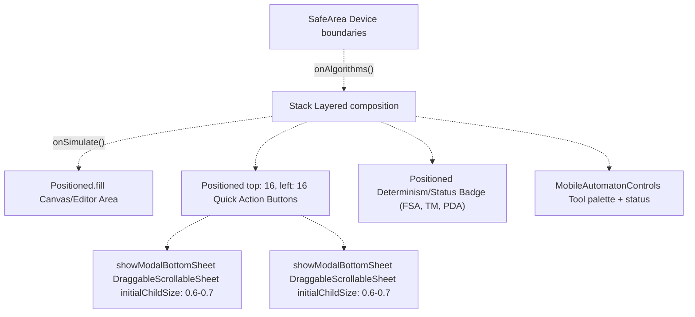
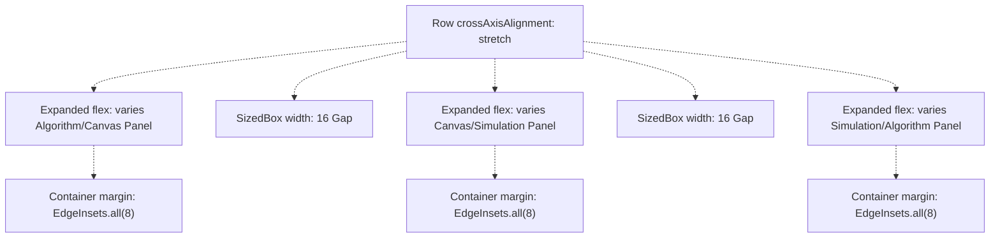
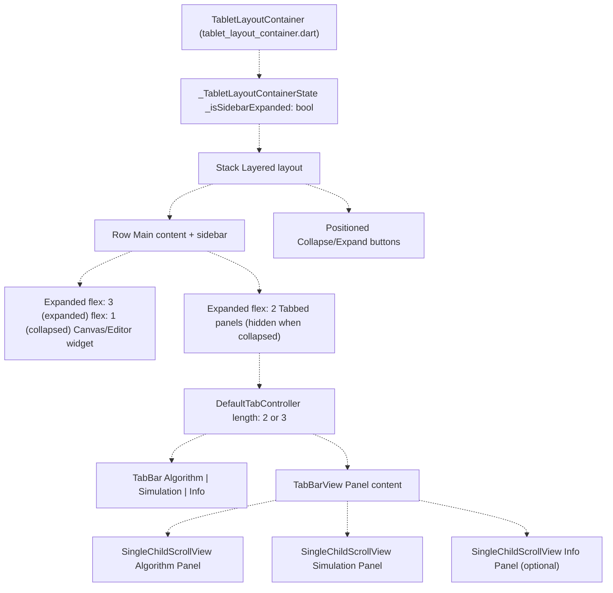

# Automaton Workspace Pages

> **Relevant source files**
> * [lib/core/parsers/jflap_xml_parser.dart](https://github.com/ThalesMMS/JFlutter/blob/32e808b4/lib/core/parsers/jflap_xml_parser.dart)
> * [lib/core/services/trace_persistence_service_stub.dart](https://github.com/ThalesMMS/JFlutter/blob/32e808b4/lib/core/services/trace_persistence_service_stub.dart)
> * [lib/presentation/pages/fsa_page.dart](https://github.com/ThalesMMS/JFlutter/blob/32e808b4/lib/presentation/pages/fsa_page.dart)
> * [lib/presentation/pages/grammar_page.dart](https://github.com/ThalesMMS/JFlutter/blob/32e808b4/lib/presentation/pages/grammar_page.dart)
> * [lib/presentation/pages/home_page.dart](https://github.com/ThalesMMS/JFlutter/blob/32e808b4/lib/presentation/pages/home_page.dart)
> * [lib/presentation/pages/pda_page.dart](https://github.com/ThalesMMS/JFlutter/blob/32e808b4/lib/presentation/pages/pda_page.dart)
> * [lib/presentation/pages/pumping_lemma_page.dart](https://github.com/ThalesMMS/JFlutter/blob/32e808b4/lib/presentation/pages/pumping_lemma_page.dart)
> * [lib/presentation/pages/regex_page.dart](https://github.com/ThalesMMS/JFlutter/blob/32e808b4/lib/presentation/pages/regex_page.dart)
> * [lib/presentation/pages/tm_page.dart](https://github.com/ThalesMMS/JFlutter/blob/32e808b4/lib/presentation/pages/tm_page.dart)
> * [lib/presentation/theme/app_theme.dart](https://github.com/ThalesMMS/JFlutter/blob/32e808b4/lib/presentation/theme/app_theme.dart)
> * [lib/presentation/widgets/desktop_navigation.dart](https://github.com/ThalesMMS/JFlutter/blob/32e808b4/lib/presentation/widgets/desktop_navigation.dart)
> * [lib/presentation/widgets/grammar_editor.dart](https://github.com/ThalesMMS/JFlutter/blob/32e808b4/lib/presentation/widgets/grammar_editor.dart)
> * [lib/presentation/widgets/tablet_layout_container.dart](https://github.com/ThalesMMS/JFlutter/blob/32e808b4/lib/presentation/widgets/tablet_layout_container.dart)
> * [test/tablet_layout_test.dart](https://github.com/ThalesMMS/JFlutter/blob/32e808b4/test/tablet_layout_test.dart)
> * [test/widget/presentation/home_page_test.dart](https://github.com/ThalesMMS/JFlutter/blob/32e808b4/test/widget/presentation/home_page_test.dart)

This page documents the workspace page system in JFlutter and its responsive layout strategy. JFlutter provides six specialized workspace pages for different formal language theory concepts: Finite State Automata (FSA), Pushdown Automata (PDA), Turing Machines (TM), Context-Free Grammars, Regular Expressions, and the Pumping Lemma Game. Each workspace follows consistent responsive layout patterns while accommodating the unique features of its automaton type.

For detailed information about specific workspace pages, see:

* **FSA Page**: [FSA Page](5a%20FSA-Page.md)
* **PDA Page**: [PDA Page](5b%20PDA-Page.md)
* **TM Page**: [TM Page](5c%20TM-Page.md)
* **Grammar Page**: [Grammar Page](5d%20Grammar-Page.md)
* **Regex and Pumping Lemma Pages**: [Regex and Pumping Lemma Pages](5e%20Regex-and-Pumping-Lemma-Pages.md)

For information about the canvas rendering system, see [Canvas System](4%20Canvas-System.md). For state management details, see [State Management](6%20State-Management.md).

## Workspace System Overview

JFlutter's workspace system is organized around `HomePage`, which serves as a navigation hub coordinating six specialized workspace pages through a `PageView` widget. Each workspace page provides a complete environment for working with a specific type of formal language construct.

**Workspace Page Architecture**



**Sources:** [lib/presentation/pages/home_page.dart L1-L278](https://github.com/ThalesMMS/JFlutter/blob/32e808b4/lib/presentation/pages/home_page.dart#L1-L278)

 [lib/presentation/pages/fsa_page.dart L1-L714](https://github.com/ThalesMMS/JFlutter/blob/32e808b4/lib/presentation/pages/fsa_page.dart#L1-L714)

 [lib/presentation/pages/tm_page.dart L1-L643](https://github.com/ThalesMMS/JFlutter/blob/32e808b4/lib/presentation/pages/tm_page.dart#L1-L643)

 [lib/presentation/pages/pda_page.dart L1-L564](https://github.com/ThalesMMS/JFlutter/blob/32e808b4/lib/presentation/pages/pda_page.dart#L1-L564)

 [lib/presentation/pages/grammar_page.dart L1-L203](https://github.com/ThalesMMS/JFlutter/blob/32e808b4/lib/presentation/pages/grammar_page.dart#L1-L203)

 [lib/presentation/pages/regex_page.dart L1-L1003](https://github.com/ThalesMMS/JFlutter/blob/32e808b4/lib/presentation/pages/regex_page.dart#L1-L1003)

 [lib/presentation/pages/pumping_lemma_page.dart L1-L170](https://github.com/ThalesMMS/JFlutter/blob/32e808b4/lib/presentation/pages/pumping_lemma_page.dart#L1-L170)

## Navigation System

### HomePage as Navigation Hub

`HomePage` implements the primary navigation system using a `PageView` with six pages and state managed by `homeNavigationProvider`. The navigation UI adapts to screen size: mobile devices (<1024px) display `MobileNavigation` as a bottom bar, while desktop layouts (≥1024px) show `DesktopNavigation` as a side rail.

**Navigation Item Structure:**



**PageView and Provider Synchronization:**

[lib/presentation/pages/home_page.dart L74-L80](https://github.com/ThalesMMS/JFlutter/blob/32e808b4/lib/presentation/pages/home_page.dart#L74-L80)

 initializes the `PageController` with the current navigation index:

```
void initState() {  super.initState();  final initialIndex = ref.read(homeNavigationProvider);  _pageController = PageController(initialPage: initialIndex);  _lastNavigationIndex = initialIndex;}
```

The `_onNavigationTap()` method [lib/presentation/pages/home_page.dart L89-L91](https://github.com/ThalesMMS/JFlutter/blob/32e808b4/lib/presentation/pages/home_page.dart#L89-L91)

 updates the provider, which triggers a page change via the `_onPageChanged()` callback [lib/presentation/pages/home_page.dart L93-L95](https://github.com/ThalesMMS/JFlutter/blob/32e808b4/lib/presentation/pages/home_page.dart#L93-L95)

 The system maintains bidirectional synchronization: navigation taps update the provider, and provider changes update the page view.

**Sources:** [lib/presentation/pages/home_page.dart L28-L277](https://github.com/ThalesMMS/JFlutter/blob/32e808b4/lib/presentation/pages/home_page.dart#L28-L277)

 [lib/presentation/pages/home_page.dart L41-L72](https://github.com/ThalesMMS/JFlutter/blob/32e808b4/lib/presentation/pages/home_page.dart#L41-L72)

 [lib/presentation/pages/home_page.dart L74-L96](https://github.com/ThalesMMS/JFlutter/blob/32e808b4/lib/presentation/pages/home_page.dart#L74-L96)

 [lib/presentation/pages/home_page.dart L133-L145](https://github.com/ThalesMMS/JFlutter/blob/32e808b4/lib/presentation/pages/home_page.dart#L133-L145)

### Mobile Navigation

`MobileNavigation` provides a compact bottom navigation bar with icons and labels for each workspace:



The mobile navigation bar is displayed when `screenSize.width < 1024` [lib/presentation/pages/home_page.dart L109-L110](https://github.com/ThalesMMS/JFlutter/blob/32e808b4/lib/presentation/pages/home_page.dart#L109-L110)

 and positioned at the bottom via `Scaffold.bottomNavigationBar` [lib/presentation/pages/home_page.dart L209-L215](https://github.com/ThalesMMS/JFlutter/blob/32e808b4/lib/presentation/pages/home_page.dart#L209-L215)

**Sources:** [lib/presentation/widgets/mobile_navigation.dart L1-L78](https://github.com/ThalesMMS/JFlutter/blob/32e808b4/lib/presentation/widgets/mobile_navigation.dart#L1-L78)

 [lib/presentation/pages/home_page.dart L209-L215](https://github.com/ThalesMMS/JFlutter/blob/32e808b4/lib/presentation/pages/home_page.dart#L209-L215)

### Desktop Navigation

`DesktopNavigation` implements a `NavigationRail` that displays vertically alongside the page content:



The navigation rail is displayed when `screenSize.width >= 1024` [lib/presentation/pages/home_page.dart L193-L207](https://github.com/ThalesMMS/JFlutter/blob/32e808b4/lib/presentation/pages/home_page.dart#L193-L207)

 and positioned to the left of the page content in a `Row` layout. The rail extends to show full labels when `screenSize.width >= 1440` [lib/presentation/pages/home_page.dart L202](https://github.com/ThalesMMS/JFlutter/blob/32e808b4/lib/presentation/pages/home_page.dart#L202-L202)

**Sources:** [lib/presentation/widgets/desktop_navigation.dart L1-L62](https://github.com/ThalesMMS/JFlutter/blob/32e808b4/lib/presentation/widgets/desktop_navigation.dart#L1-L62)

 [lib/presentation/pages/home_page.dart L193-L207](https://github.com/ThalesMMS/JFlutter/blob/32e808b4/lib/presentation/pages/home_page.dart#L193-L207)

## Workspace Page Structure

All workspace pages follow a consistent structure with three responsive layout variants. Each page is a `ConsumerStatefulWidget` that manages its own controllers and integrates with Riverpod providers for state management.

### Common Workspace Components

Canvas-based workspace pages (FSA, TM, PDA) initialize similar components in their `initState()` methods:

| Component | Purpose | Workspace Pages |
| --- | --- | --- |
| Canvas Controller | Manages GraphView nodes/edges | FSA, TM, PDA |
| Tool Controller | Tracks active editing tool | FSA, TM, PDA |
| Highlight Service | Visual feedback during simulation | FSA, TM, PDA |
| Highlight Channel | Bridge between service and canvas | FSA, TM, PDA |
| State Provider | Manages domain model state | All pages |

**FSA Initialization Example:**

[lib/presentation/pages/fsa_page.dart L46-L56](https://github.com/ThalesMMS/JFlutter/blob/32e808b4/lib/presentation/pages/fsa_page.dart#L46-L56)

 demonstrates the standard initialization pattern:

```
@overridevoid initState() {  super.initState();  _canvasController = GraphViewCanvasController(    automatonProvider: ref.read(automatonProvider.notifier),  );  _canvasController.synchronize(ref.read(automatonProvider).currentAutomaton);  _highlightChannel = GraphViewSimulationHighlightChannel(_canvasController);  _highlightService = SimulationHighlightService(channel: _highlightChannel);  _toolController = AutomatonCanvasToolController();}
```

**Sources:** [lib/presentation/pages/fsa_page.dart L46-L56](https://github.com/ThalesMMS/JFlutter/blob/32e808b4/lib/presentation/pages/fsa_page.dart#L46-L56)

 [lib/presentation/pages/tm_page.dart L62-L71](https://github.com/ThalesMMS/JFlutter/blob/32e808b4/lib/presentation/pages/tm_page.dart#L62-L71)

 [lib/presentation/pages/pda_page.dart L53-L62](https://github.com/ThalesMMS/JFlutter/blob/32e808b4/lib/presentation/pages/pda_page.dart#L53-L62)

## Responsive Layout Strategy

JFlutter implements a mobile-first responsive design with three distinct layout tiers. Each workspace page dynamically selects its layout based on viewport width, ensuring optimal user experience across devices.

### Layout Breakpoints

All workspace pages use consistent breakpoints:

| Breakpoint | Width Range | Layout Strategy | Navigation |
| --- | --- | --- | --- |
| Mobile | < 1024px | Stacked vertical, modal sheets | Bottom bar |
| Tablet | 1024px - 1399px | `TabletLayoutContainer` with collapsible sidebar | Desktop rail |
| Desktop | ≥ 1400px | Multi-column row layout with fixed panels | Desktop rail |

**Layout Selection Pattern:**



**Standard Build Method Pattern:**

Every workspace page implements the same layout selection logic in its `build()` method. [lib/presentation/pages/fsa_page.dart L527-L543](https://github.com/ThalesMMS/JFlutter/blob/32e808b4/lib/presentation/pages/fsa_page.dart#L527-L543)

 exemplifies this pattern:

```
@overrideWidget build(BuildContext context) {  final state = ref.watch(automatonProvider);  final screenSize = MediaQuery.of(context).size;  final isMobile = screenSize.width < 1024;  return ProviderScope(    overrides: [      canvasHighlightServiceProvider.overrideWithValue(_highlightService),    ],    child: Scaffold(      body: isMobile           ? _buildMobileLayout(state)           : screenSize.width < 1400               ? _buildTabletLayout(state)               : _buildDesktopLayout(state),    ),  );}
```

The same pattern appears in TM [lib/presentation/pages/tm_page.dart L129-L145](https://github.com/ThalesMMS/JFlutter/blob/32e808b4/lib/presentation/pages/tm_page.dart#L129-L145)

 PDA [lib/presentation/pages/pda_page.dart L115-L131](https://github.com/ThalesMMS/JFlutter/blob/32e808b4/lib/presentation/pages/pda_page.dart#L115-L131)

 Grammar [lib/presentation/pages/grammar_page.dart L33-L43](https://github.com/ThalesMMS/JFlutter/blob/32e808b4/lib/presentation/pages/grammar_page.dart#L33-L43)

 and Pumping Lemma [lib/presentation/pages/pumping_lemma_page.dart L33-L43](https://github.com/ThalesMMS/JFlutter/blob/32e808b4/lib/presentation/pages/pumping_lemma_page.dart#L33-L43)

 pages.

**Sources:** [lib/presentation/pages/fsa_page.dart L527-L543](https://github.com/ThalesMMS/JFlutter/blob/32e808b4/lib/presentation/pages/fsa_page.dart#L527-L543)

 [lib/presentation/pages/tm_page.dart L129-L145](https://github.com/ThalesMMS/JFlutter/blob/32e808b4/lib/presentation/pages/tm_page.dart#L129-L145)

 [lib/presentation/pages/pda_page.dart L115-L131](https://github.com/ThalesMMS/JFlutter/blob/32e808b4/lib/presentation/pages/pda_page.dart#L115-L131)

 [lib/presentation/pages/grammar_page.dart L33-L43](https://github.com/ThalesMMS/JFlutter/blob/32e808b4/lib/presentation/pages/grammar_page.dart#L33-L43)

 [lib/presentation/pages/pumping_lemma_page.dart L33-L43](https://github.com/ThalesMMS/JFlutter/blob/32e808b4/lib/presentation/pages/pumping_lemma_page.dart#L33-L43)

## Mobile Layout Pattern

### Full-Screen Canvas with Modal Panels

Mobile layouts (<1024px) maximize canvas space by presenting the main editing area full-screen and displaying secondary panels (simulation, algorithms) as modal bottom sheets. This approach prioritizes the primary workspace while keeping advanced features accessible.

**Mobile Layout Structure:**



**FSA Mobile Layout:**

[lib/presentation/pages/fsa_page.dart L546-L556](https://github.com/ThalesMMS/JFlutter/blob/32e808b4/lib/presentation/pages/fsa_page.dart#L546-L556)

 implements a minimal mobile structure:

```css
Widget _buildMobileLayout(AutomatonState state) {  return Column(    children: [      Expanded(        child: Container(          margin: const EdgeInsets.all(8),          child: _buildCanvasArea(state: state, isMobile: true),        ),      ),    ],  );}
```

The `_buildCanvasArea()` method [lib/presentation/pages/fsa_page.dart L386-L488](https://github.com/ThalesMMS/JFlutter/blob/32e808b4/lib/presentation/pages/fsa_page.dart#L386-L488)

 layers the canvas with overlays:

* Full-screen canvas fills the viewport [lib/presentation/pages/fsa_page.dart L414-L416](https://github.com/ThalesMMS/JFlutter/blob/32e808b4/lib/presentation/pages/fsa_page.dart#L414-L416)
* Quick action buttons in top-left [lib/presentation/pages/fsa_page.dart L417-L425](https://github.com/ThalesMMS/JFlutter/blob/32e808b4/lib/presentation/pages/fsa_page.dart#L417-L425)
* FSA determinism badge overlay [lib/presentation/pages/fsa_page.dart L427](https://github.com/ThalesMMS/JFlutter/blob/32e808b4/lib/presentation/pages/fsa_page.dart#L427-L427)
* `MobileAutomatonControls` at bottom [lib/presentation/pages/fsa_page.dart L428-L456](https://github.com/ThalesMMS/JFlutter/blob/32e808b4/lib/presentation/pages/fsa_page.dart#L428-L456)

**Modal Bottom Sheets:**

When users tap quick action buttons, panels appear as draggable modal sheets:

[lib/presentation/pages/fsa_page.dart L590-L626](https://github.com/ThalesMMS/JFlutter/blob/32e808b4/lib/presentation/pages/fsa_page.dart#L590-L626)

 shows the simulation sheet implementation:

```css
Future<void> _openSimulationSheet() async {  await showModalBottomSheet<void>(    context: context,    isScrollControlled: true,    builder: (context) {      return SafeArea(        child: DraggableScrollableSheet(          expand: false,          initialChildSize: 0.6,          minChildSize: 0.4,          maxChildSize: 0.95,          builder: (context, scrollController) {            return SingleChildScrollView(              controller: scrollController,              child: Padding(                padding: const EdgeInsets.all(16),                child: Consumer(                  builder: (context, sheetRef, _) {                    final sheetState = sheetRef.watch(automatonProvider);                    return SimulationPanel(/* ... */);                  },                ),              ),            );          },        ),      );    },  );}
```

**Sources:** [lib/presentation/pages/fsa_page.dart L546-L556](https://github.com/ThalesMMS/JFlutter/blob/32e808b4/lib/presentation/pages/fsa_page.dart#L546-L556)

 [lib/presentation/pages/fsa_page.dart L386-L488](https://github.com/ThalesMMS/JFlutter/blob/32e808b4/lib/presentation/pages/fsa_page.dart#L386-L488)

 [lib/presentation/pages/fsa_page.dart L590-L626](https://github.com/ThalesMMS/JFlutter/blob/32e808b4/lib/presentation/pages/fsa_page.dart#L590-L626)

 [lib/presentation/pages/fsa_page.dart L559-L588](https://github.com/ThalesMMS/JFlutter/blob/32e808b4/lib/presentation/pages/fsa_page.dart#L559-L588)

 [lib/presentation/pages/tm_page.dart L147-L180](https://github.com/ThalesMMS/JFlutter/blob/32e808b4/lib/presentation/pages/tm_page.dart#L147-L180)

 [lib/presentation/pages/pda_page.dart L133-L165](https://github.com/ThalesMMS/JFlutter/blob/32e808b4/lib/presentation/pages/pda_page.dart#L133-L165)

## Desktop Layout Pattern

### Multi-Column Row Layout

Desktop layouts (≥1400px) use a multi-column `Row` structure with fixed panels displayed side-by-side. This layout maximizes horizontal screen real estate and provides immediate access to all workspace features without modal overlays.

**Desktop Layout Structure:**



**Desktop Layout Flex Ratios by Workspace:**

| Workspace | Left Panel | Center Panel | Right Panel | Optional Panel |
| --- | --- | --- | --- | --- |
| FSA | 2 (Algorithm) | 3 (Canvas) | 2 (Simulation) | — |
| TM | 2 (Canvas) | 1 (Simulation) | 1 (Algorithm) | 1 (Info) [Flexible] |
| PDA | 2 (Canvas) | 1 (Simulation) | 1 (Algorithm) | — |
| Grammar | 2 (Editor) | 1 (Simulation) | 1 (Algorithm) | — |
| Pumping Lemma | 2 (Game) | 1 (Help) | 1 (Progress) | — |

**FSA Desktop Layout:**

[lib/presentation/pages/fsa_page.dart L628-L656](https://github.com/ThalesMMS/JFlutter/blob/32e808b4/lib/presentation/pages/fsa_page.dart#L628-L656)

 implements a balanced three-column layout:

```
Widget _buildDesktopLayout(AutomatonState state) {  return Row(    children: [      // Left panel - Controls      Expanded(        flex: 2,        child: Column(children: [_buildAlgorithmPanelForState(state)]),      ),      const SizedBox(width: 16),      // Center panel - Canvas      Expanded(        flex: 3,        child: _buildCanvasArea(state: state, isMobile: false),      ),      const SizedBox(width: 16),      // Right panel - Simulation      Expanded(        flex: 2,        child: SimulationPanel(/* ... */),      ),    ],  );}
```

The canvas receives the most space (flex: 3) as the primary workspace, while algorithm and simulation panels flank it with equal weight (flex: 2 each).

**TM Desktop Layout with Four Panels:**

[lib/presentation/pages/tm_page.dart L182-L220](https://github.com/ThalesMMS/JFlutter/blob/32e808b4/lib/presentation/pages/tm_page.dart#L182-L220)

 adds a fourth info panel using `Flexible`:

```
Widget _buildDesktopLayout() {  return Row(    children: [      Expanded(flex: 2, child: /* Canvas */),      const SizedBox(width: 16),      Expanded(flex: 1, child: TMSimulationPanel(/* ... */)),      const SizedBox(width: 16),      Expanded(flex: 1, child: const TMAlgorithmPanel()),      const SizedBox(width: 16),      Flexible(child: _buildInfoPanel(context)),    ],  );}
```

The `Flexible` wrapper allows the info panel to shrink if needed, preventing overflow on narrower desktop screens.

**Sources:** [lib/presentation/pages/fsa_page.dart L628-L656](https://github.com/ThalesMMS/JFlutter/blob/32e808b4/lib/presentation/pages/fsa_page.dart#L628-L656)

 [lib/presentation/pages/tm_page.dart L182-L220](https://github.com/ThalesMMS/JFlutter/blob/32e808b4/lib/presentation/pages/tm_page.dart#L182-L220)

 [lib/presentation/pages/pda_page.dart L254-L284](https://github.com/ThalesMMS/JFlutter/blob/32e808b4/lib/presentation/pages/pda_page.dart#L254-L284)

 [lib/presentation/pages/grammar_page.dart L111-L142](https://github.com/ThalesMMS/JFlutter/blob/32e808b4/lib/presentation/pages/grammar_page.dart#L111-L142)

 [lib/presentation/pages/pumping_lemma_page.dart L137-L168](https://github.com/ThalesMMS/JFlutter/blob/32e808b4/lib/presentation/pages/pumping_lemma_page.dart#L137-L168)

## Tablet Layout Pattern

### TabletLayoutContainer Component

Tablet layouts (1024px-1399px) use the reusable `TabletLayoutContainer` component, which provides a split-screen design with a collapsible sidebar. This layout balances the space constraints of tablets by allowing users to temporarily hide secondary panels and focus on the main workspace.

**TabletLayoutContainer Architecture:**



**Collapsible Sidebar Behavior:**

The sidebar state is controlled by `_isSidebarExpanded` [lib/presentation/widgets/tablet_layout_container.dart L28](https://github.com/ThalesMMS/JFlutter/blob/32e808b4/lib/presentation/widgets/tablet_layout_container.dart#L28-L28)

 When expanded (default), the main area receives `flex: 3` and the sidebar `flex: 2`. When collapsed, the main area becomes `flex: 1` and the sidebar is hidden.

**Collapse/Expand Controls:**

[lib/presentation/widgets/tablet_layout_container.dart L124-L149](https://github.com/ThalesMMS/JFlutter/blob/32e808b4/lib/presentation/widgets/tablet_layout_container.dart#L124-L149)

 positions toggle buttons absolutely:

```javascript
// Toggle ButtonPositioned(  right: _isSidebarExpanded ? null : 16,  left: _isSidebarExpanded ? null : null,  top: 24,  child: _isSidebarExpanded     ? const SizedBox.shrink()    : FloatingActionButton.small(        onPressed: () => setState(() => _isSidebarExpanded = true),        child: const Icon(Icons.menu_open),      ),),// Collapse Button (inside sidebar if expanded)if (_isSidebarExpanded)   Positioned(    right: 24,    top: 24,    child: IconButton(      icon: const Icon(Icons.close_fullscreen),      tooltip: 'Collapse Sidebar',      onPressed: () => setState(() => _isSidebarExpanded = false),      // ...    ),  ),
```

**Tabbed Panel System:**

[lib/presentation/widgets/tablet_layout_container.dart L68-L117](https://github.com/ThalesMMS/JFlutter/blob/32e808b4/lib/presentation/widgets/tablet_layout_container.dart#L68-L117)

 implements the `DefaultTabController`:

```
DefaultTabController(  length: widget.infoPanel != null ? 3 : 2,  child: Column(    children: [      TabBar(        tabs: [          Tab(            text: widget.algorithmTabTitle,            icon: const Icon(Icons.auto_awesome),          ),          Tab(            text: widget.simulationTabTitle,            icon: const Icon(Icons.play_arrow),          ),          if (widget.infoPanel != null)            Tab(              text: widget.infoTabTitle,              icon: const Icon(Icons.info_outline),            ),        ],        // ... styling      ),      Expanded(        child: TabBarView(          children: [            SingleChildScrollView(              padding: const EdgeInsets.all(16),              child: widget.algorithmPanel,            ),            SingleChildScrollView(              padding: const EdgeInsets.all(16),              child: widget.simulationPanel,            ),            if (widget.infoPanel != null)              SingleChildScrollView(                padding: const EdgeInsets.all(16),                child: widget.infoPanel,              ),          ],        ),      ),    ],  ),)
```

**Workspace Integration:**

All workspace pages use `TabletLayoutContainer` for their tablet layouts:

[lib/presentation/pages/fsa_page.dart L659-L671](https://github.com/ThalesMMS/JFlutter/blob/32e808b4/lib/presentation/pages/fsa_page.dart#L659-L671)

 shows typical usage:

```javascript
Widget _buildTabletLayout(AutomatonState state) {  return TabletLayoutContainer(    canvas: _buildCanvasArea(state: state, isMobile: false),    algorithmPanel: _buildAlgorithmPanelForState(state),    simulationPanel: SimulationPanel(      onSimulate: (inputString) => ref          .read(automatonProvider.notifier)          .simulateAutomaton(inputString),      simulationResult: state.simulationResult,      regexResult: state.regexResult,      highlightService: _highlightService,    ),  );}
```

**Custom Tab Titles:**

Some workspaces customize the default tab titles. [lib/presentation/pages/pumping_lemma_page.dart L46-L54](https://github.com/ThalesMMS/JFlutter/blob/32e808b4/lib/presentation/pages/pumping_lemma_page.dart#L46-L54)

 uses custom titles for its unique panels:

```
Widget _buildTabletLayout() {  return TabletLayoutContainer(    canvas: const PumpingLemmaGame(),    algorithmPanel: const PumpingLemmaHelp(),    simulationPanel: const PumpingLemmaProgress(),    algorithmTabTitle: 'Help',    simulationTabTitle: 'Progress',  );}
```

**Sources:** [lib/presentation/widgets/tablet_layout_container.dart L1-L153](https://github.com/ThalesMMS/JFlutter/blob/32e808b4/lib/presentation/widgets/tablet_layout_container.dart#L1-L153)

 [lib/presentation/widgets/tablet_layout_container.dart L28](https://github.com/ThalesMMS/JFlutter/blob/32e808b4/lib/presentation/widgets/tablet_layout_container.dart#L28-L28)

 [lib/presentation/widgets/tablet_layout_container.dart L68-L117](https://github.com/ThalesMMS/JFlutter/blob/32e808b4/lib/presentation/widgets/tablet_layout_container.dart#L68-L117)

 [lib/presentation/widgets/tablet_layout_container.dart L124-L149](https://github.com/ThalesMMS/JFlutter/blob/32e808b4/lib/presentation/widgets/tablet_layout_container.dart#L124-L149)

 [lib/presentation/pages/fsa_page.dart L659-L671](https://github.com/ThalesMMS/JFlutter/blob/32e808b4/lib/presentation/pages/fsa_page.dart#L659-L671)

 [lib/presentation/pages/tm_page.dart L375-L382](https://github.com/ThalesMMS/JFlutter/blob/32e808b4/lib/presentation/pages/tm_page.dart#L375-L382)

 [lib/presentation/pages/pda_page.dart L516-L522](https://github.com/ThalesMMS/JFlutter/blob/32e808b4/lib/presentation/pages/pda_page.dart#L516-L522)

 [lib/presentation/pages/pumping_lemma_page.dart L46-L54](https://github.com/ThalesMMS/JFlutter/blob/32e808b4/lib/presentation/pages/pumping_lemma_page.dart#L46-L54)

## Common UI Components

### Canvas Toolbars and Controls

Canvas-based workspaces provide tool selection and canvas operations through platform-specific controls:

**Desktop Toolbar:**

`GraphViewCanvasToolbar` provides desktop-optimized controls with a vertical layout [lib/presentation/pages/fsa_page.dart L469-L481](https://github.com/ThalesMMS/JFlutter/blob/32e808b4/lib/presentation/pages/fsa_page.dart#L469-L481)

:

```javascript
GraphViewCanvasToolbar(  layout: GraphViewCanvasToolbarLayout.desktop,  controller: _canvasController,  enableToolSelection: true,  activeTool: _toolController.activeTool,  onAddState: _handleAddStatePressed,  onAddTransition: () =>      _toggleCanvasTool(AutomatonCanvasTool.transition),  onClear: () =>      ref.read(automatonProvider.notifier).clearAutomaton(),  statusMessage: statusMessage,)
```

**Mobile Controls:**

`MobileAutomatonControls` provides touch-optimized UI at the bottom of the canvas [lib/presentation/pages/fsa_page.dart L429-L455](https://github.com/ThalesMMS/JFlutter/blob/32e808b4/lib/presentation/pages/fsa_page.dart#L429-L455)

:

```javascript
MobileAutomatonControls(  enableToolSelection: true,  activeTool: _toolController.activeTool,  onAddState: _handleAddStatePressed,  onAddTransition: () =>      _toggleCanvasTool(AutomatonCanvasTool.transition),  onFitToContent: _canvasController.fitToContent,  onResetView: _canvasController.resetView,  onClear: () =>      ref.read(automatonProvider.notifier).clearAutomaton(),  onUndo: _canvasController.canUndo      ? () => _canvasController.undo()      : null,  onRedo: _canvasController.canRedo      ? () => _canvasController.redo()      : null,  canUndo: _canvasController.canUndo,  canRedo: _canvasController.canRedo,  statusMessage: statusMessage,)
```

**Sources:** [lib/presentation/pages/fsa_page.dart L469-L481](https://github.com/ThalesMMS/JFlutter/blob/32e808b4/lib/presentation/pages/fsa_page.dart#L469-L481)

 [lib/presentation/pages/fsa_page.dart L429-L455](https://github.com/ThalesMMS/JFlutter/blob/32e808b4/lib/presentation/pages/fsa_page.dart#L429-L455)

 [lib/presentation/pages/tm_page.dart L292-L313](https://github.com/ThalesMMS/JFlutter/blob/32e808b4/lib/presentation/pages/tm_page.dart#L292-L313)

 [lib/presentation/pages/pda_page.dart L389-L421](https://github.com/ThalesMMS/JFlutter/blob/32e808b4/lib/presentation/pages/pda_page.dart#L389-L421)

### Quick Action Buttons

Mobile and tablet layouts include floating quick action buttons for fast access to simulation and algorithms without opening the full panels:

**Quick Action Implementation:**

[lib/presentation/pages/fsa_page.dart L675-L714](https://github.com/ThalesMMS/JFlutter/blob/32e808b4/lib/presentation/pages/fsa_page.dart#L675-L714)

 defines the `_CanvasQuickActions` widget:

```css
class _CanvasQuickActions extends StatelessWidget {  const _CanvasQuickActions({this.onSimulate, this.onAlgorithms});  final VoidCallback? onSimulate;  final VoidCallback? onAlgorithms;  @override  Widget build(BuildContext context) {    final theme = Theme.of(context);    final colorScheme = theme.colorScheme;    return Material(      elevation: 6,      borderRadius: BorderRadius.circular(32),      color: colorScheme.surface.withOpacity(0.92),      child: Padding(        padding: const EdgeInsets.symmetric(horizontal: 6, vertical: 4),        child: Row(          mainAxisSize: MainAxisSize.min,          children: [            if (onSimulate != null)              IconButton(                tooltip: 'Simulate',                icon: const Icon(Icons.play_arrow),                onPressed: onSimulate,              ),            if (onSimulate != null && onAlgorithms != null)              const SizedBox(width: 4),            if (onAlgorithms != null)              IconButton(                tooltip: 'Algorithms',                icon: const Icon(Icons.auto_awesome),                onPressed: onAlgorithms,              ),          ],        ),      ),    );  }}
```

The buttons are positioned in the top-left corner of the canvas [lib/presentation/pages/fsa_page.dart L418-L424](https://github.com/ThalesMMS/JFlutter/blob/32e808b4/lib/presentation/pages/fsa_page.dart#L418-L424)

 and trigger modal bottom sheets when tapped.

**Sources:** [lib/presentation/pages/fsa_page.dart L675-L714](https://github.com/ThalesMMS/JFlutter/blob/32e808b4/lib/presentation/pages/fsa_page.dart#L675-L714)

 [lib/presentation/pages/fsa_page.dart L418-L424](https://github.com/ThalesMMS/JFlutter/blob/32e808b4/lib/presentation/pages/fsa_page.dart#L418-L424)

 [lib/presentation/pages/tm_page.dart L589-L642](https://github.com/ThalesMMS/JFlutter/blob/32e808b4/lib/presentation/pages/tm_page.dart#L589-L642)

 [lib/presentation/pages/pda_page.dart L525-L563](https://github.com/ThalesMMS/JFlutter/blob/32e808b4/lib/presentation/pages/pda_page.dart#L525-L563)

### Status Messages

All canvas-based workspaces display contextual status information in their toolbars and controls. Status messages combine validation warnings with state/transition counts.

**Status Message Pattern:**

Each workspace implements a `_buildToolbarStatusMessage()` method that follows this pattern:

1. Check if automaton/model exists
2. Gather validation warnings (missing start state, no accepting states, nondeterminism, etc.)
3. Format element counts (states, transitions)
4. Combine warnings and counts into a single message

**FSA Status Message:**

[lib/presentation/pages/fsa_page.dart L490-L519](https://github.com/ThalesMMS/JFlutter/blob/32e808b4/lib/presentation/pages/fsa_page.dart#L490-L519)

 demonstrates the pattern:

```
String _buildToolbarStatusMessage(AutomatonState state) {  final automaton = state.currentAutomaton;  if (automaton == null) {    return 'No automaton loaded';  }  final warnings = <String>[];  if (automaton.initialState == null) {    warnings.add('Missing start state');  }  if (automaton.acceptingStates.isEmpty) {    warnings.add('No accepting states');  }  if (!automaton.isDeterministic) {    warnings.add('Nondeterministic');  }  if (automaton.hasEpsilonTransitions) {    warnings.add('λ-transitions present');  }  final counts =      '${_formatCount('state', 'states', automaton.states.length)} · '      '${_formatCount('transition', 'transitions', automaton.transitions.length)}';  if (warnings.isEmpty) {    return counts;  }  return '⚠ ${warnings.join(' · ')} · $counts';}
```

The status message appears in the toolbar on desktop layouts and the mobile controls on mobile layouts, providing consistent feedback across all screen sizes.

**Sources:** [lib/presentation/pages/fsa_page.dart L490-L519](https://github.com/ThalesMMS/JFlutter/blob/32e808b4/lib/presentation/pages/fsa_page.dart#L490-L519)

 [lib/presentation/pages/tm_page.dart L336-L368](https://github.com/ThalesMMS/JFlutter/blob/32e808b4/lib/presentation/pages/tm_page.dart#L336-L368)

 [lib/presentation/pages/pda_page.dart L475-L509](https://github.com/ThalesMMS/JFlutter/blob/32e808b4/lib/presentation/pages/pda_page.dart#L475-L509)

## Workspace-Specific Features

Each workspace page includes specialized UI components tailored to its automaton type:

### FSA: Determinism Badge

FSA pages display a floating badge indicating whether the current automaton is a DFA, NFA, or ε-NFA. The `FSADeterminismOverlay` widget [lib/presentation/pages/fsa_page.dart L427](https://github.com/ThalesMMS/JFlutter/blob/32e808b4/lib/presentation/pages/fsa_page.dart#L427-L427)

 positions this badge over the canvas.

### TM: Tape Panel

Turing Machine pages include a `TMTapePanel` for visualizing and manipulating the tape. The panel floats in the top-right corner [lib/presentation/pages/tm_page.dart L161-L176](https://github.com/ThalesMMS/JFlutter/blob/32e808b4/lib/presentation/pages/tm_page.dart#L161-L176)

 and displays:

* Current tape contents
* Tape head position
* Tape alphabet
* Clear tape button

### PDA: Stack Panel

Pushdown Automata pages include a `PDAStackPanel` for visualizing the stack. The panel floats in the top-right corner [lib/presentation/pages/pda_page.dart L147-L161](https://github.com/ThalesMMS/JFlutter/blob/32e808b4/lib/presentation/pages/pda_page.dart#L147-L161)

 and displays:

* Current stack contents
* Initial stack symbol
* Stack alphabet
* Clear stack button

### Grammar: Text Editor

The Grammar page uses a text-based editor (`GrammarEditor`) [lib/presentation/widgets/grammar_editor.dart L1-L678](https://github.com/ThalesMMS/JFlutter/blob/32e808b4/lib/presentation/widgets/grammar_editor.dart#L1-L678)

 rather than a canvas, allowing users to define production rules through text fields. This approach better suits the nature of grammar definitions.

### Regex: Validation Display

The Regex page provides real-time validation feedback for regular expression syntax, with visual indicators for valid/invalid expressions [lib/presentation/pages/regex_page.dart L1-L1003](https://github.com/ThalesMMS/JFlutter/blob/32e808b4/lib/presentation/pages/regex_page.dart#L1-L1003)

### Pumping Lemma: Game Interface

The Pumping Lemma page implements an interactive game interface for learning the pumping lemma, with custom tab titles ("Help" and "Progress") [lib/presentation/pages/pumping_lemma_page.dart L46-L53](https://github.com/ThalesMMS/JFlutter/blob/32e808b4/lib/presentation/pages/pumping_lemma_page.dart#L46-L53)

**Sources:** [lib/presentation/pages/fsa_page.dart L427](https://github.com/ThalesMMS/JFlutter/blob/32e808b4/lib/presentation/pages/fsa_page.dart#L427-L427)

 [lib/presentation/pages/fsa_page.dart L465](https://github.com/ThalesMMS/JFlutter/blob/32e808b4/lib/presentation/pages/fsa_page.dart#L465-L465)

 [lib/presentation/pages/tm_page.dart L161-L176](https://github.com/ThalesMMS/JFlutter/blob/32e808b4/lib/presentation/pages/tm_page.dart#L161-L176)

 [lib/presentation/pages/pda_page.dart L147-L161](https://github.com/ThalesMMS/JFlutter/blob/32e808b4/lib/presentation/pages/pda_page.dart#L147-L161)

 [lib/presentation/widgets/grammar_editor.dart L1-L678](https://github.com/ThalesMMS/JFlutter/blob/32e808b4/lib/presentation/widgets/grammar_editor.dart#L1-L678)

 [lib/presentation/pages/regex_page.dart L1-L1003](https://github.com/ThalesMMS/JFlutter/blob/32e808b4/lib/presentation/pages/regex_page.dart#L1-L1003)

 [lib/presentation/pages/pumping_lemma_page.dart L46-L53](https://github.com/ThalesMMS/JFlutter/blob/32e808b4/lib/presentation/pages/pumping_lemma_page.dart#L46-L53)

## Summary of Common Patterns

| Pattern | Implementation | All Editors? |
| --- | --- | --- |
| Three-tier responsive layout | Mobile/Tablet/Desktop breakpoints | ✓ Yes |
| Canvas controller | Specialized for automaton type | ✓ (except Grammar) |
| Tool controller | `AutomatonCanvasToolController` | ✓ (except Grammar) |
| Highlight service | `SimulationHighlightService` | ✓ (canvas editors) |
| Status messages | `_buildToolbarStatusMessage()` | ✓ Yes |
| Modal sheets (mobile) | `DraggableScrollableSheet` | ✓ Yes |
| Tablet container | `TabletLayoutContainer` | ✓ Yes |
| Provider sync | Bidirectional state/canvas | ✓ (canvas editors) |
| Error feedback | `_showSnack()` snackbars | ✓ Yes |

**Sources:** [lib/presentation/pages/fsa_page.dart L1-L714](https://github.com/ThalesMMS/JFlutter/blob/32e808b4/lib/presentation/pages/fsa_page.dart#L1-L714)

 [lib/presentation/pages/tm_page.dart L1-L610](https://github.com/ThalesMMS/JFlutter/blob/32e808b4/lib/presentation/pages/tm_page.dart#L1-L610)

 [lib/presentation/pages/pda_page.dart L1-L548](https://github.com/ThalesMMS/JFlutter/blob/32e808b4/lib/presentation/pages/pda_page.dart#L1-L548)

 [lib/presentation/pages/grammar_page.dart L1-L203](https://github.com/ThalesMMS/JFlutter/blob/32e808b4/lib/presentation/pages/grammar_page.dart#L1-L203)

 [lib/presentation/widgets/tablet_layout_container.dart L1-L153](https://github.com/ThalesMMS/JFlutter/blob/32e808b4/lib/presentation/widgets/tablet_layout_container.dart#L1-L153)


### On this page

* [Automaton Workspace Pages](5%20Automaton-Workspace-Pages.md)
* [Workspace System Overview](5%20Automaton-Workspace-Pages.md)
* [Navigation System](5%20Automaton-Workspace-Pages.md)
* [HomePage as Navigation Hub](5%20Automaton-Workspace-Pages.md)
* [Mobile Navigation](5%20Automaton-Workspace-Pages.md)
* [Desktop Navigation](5%20Automaton-Workspace-Pages.md)
* [Workspace Page Structure](5%20Automaton-Workspace-Pages.md)
* [Common Workspace Components](5%20Automaton-Workspace-Pages.md)
* [Responsive Layout Strategy](5%20Automaton-Workspace-Pages.md)
* [Layout Breakpoints](5%20Automaton-Workspace-Pages.md)
* [Mobile Layout Pattern](5%20Automaton-Workspace-Pages.md)
* [Full-Screen Canvas with Modal Panels](5%20Automaton-Workspace-Pages.md)
* [Desktop Layout Pattern](5%20Automaton-Workspace-Pages.md)
* [Multi-Column Row Layout](5%20Automaton-Workspace-Pages.md)
* [Tablet Layout Pattern](5%20Automaton-Workspace-Pages.md)
* [TabletLayoutContainer Component](5%20Automaton-Workspace-Pages.md)
* [Common UI Components](5%20Automaton-Workspace-Pages.md)
* [Canvas Toolbars and Controls](5%20Automaton-Workspace-Pages.md)
* [Quick Action Buttons](5%20Automaton-Workspace-Pages.md)
* [Status Messages](5%20Automaton-Workspace-Pages.md)
* [Workspace-Specific Features](5%20Automaton-Workspace-Pages.md)
* [FSA: Determinism Badge](5%20Automaton-Workspace-Pages.md)
* [TM: Tape Panel](5%20Automaton-Workspace-Pages.md)
* [PDA: Stack Panel](5%20Automaton-Workspace-Pages.md)
* [Grammar: Text Editor](5%20Automaton-Workspace-Pages.md)
* [Regex: Validation Display](5%20Automaton-Workspace-Pages.md)
* [Pumping Lemma: Game Interface](5%20Automaton-Workspace-Pages.md)
* [Summary of Common Patterns](5%20Automaton-Workspace-Pages.md)

Ask Devin about JFlutter