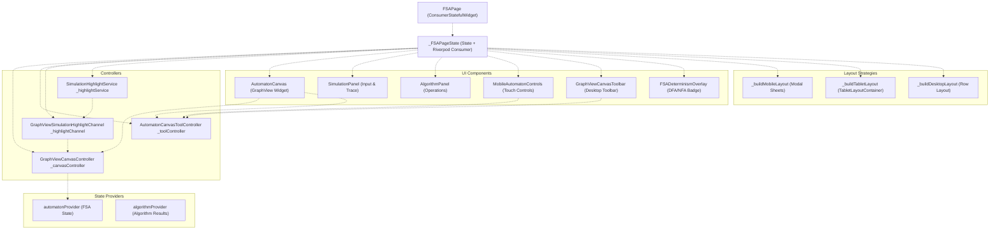
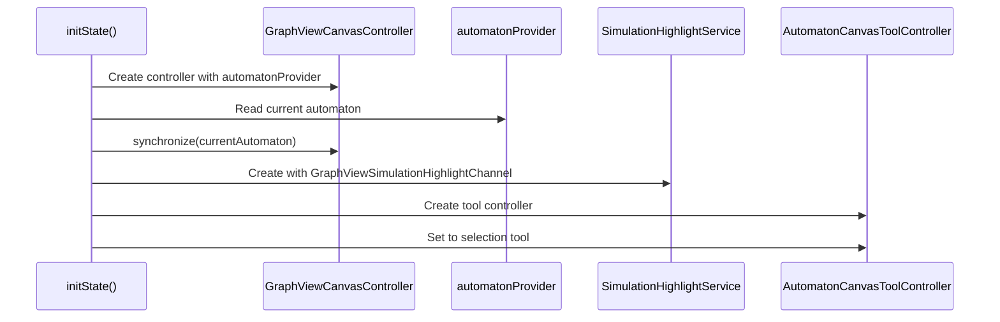
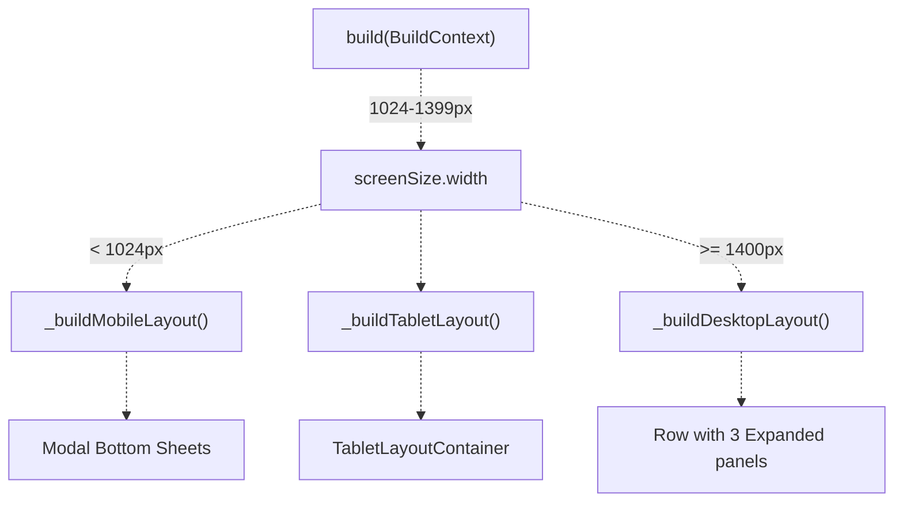
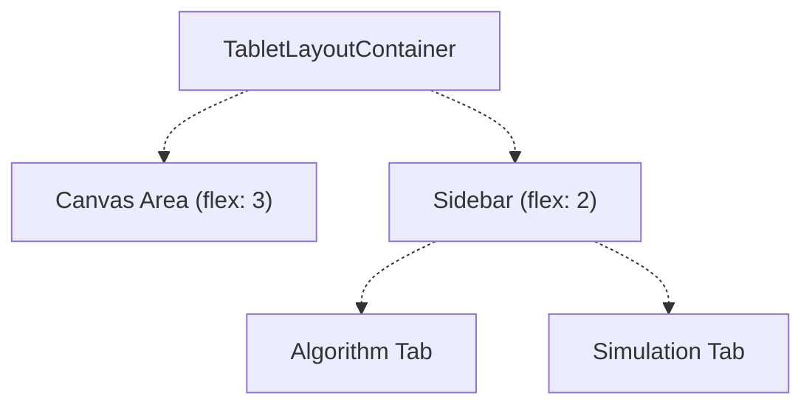
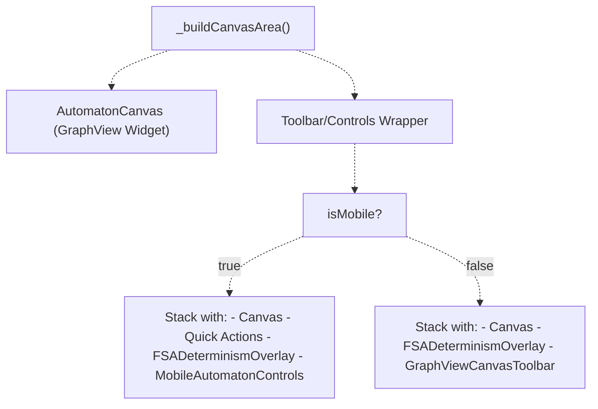
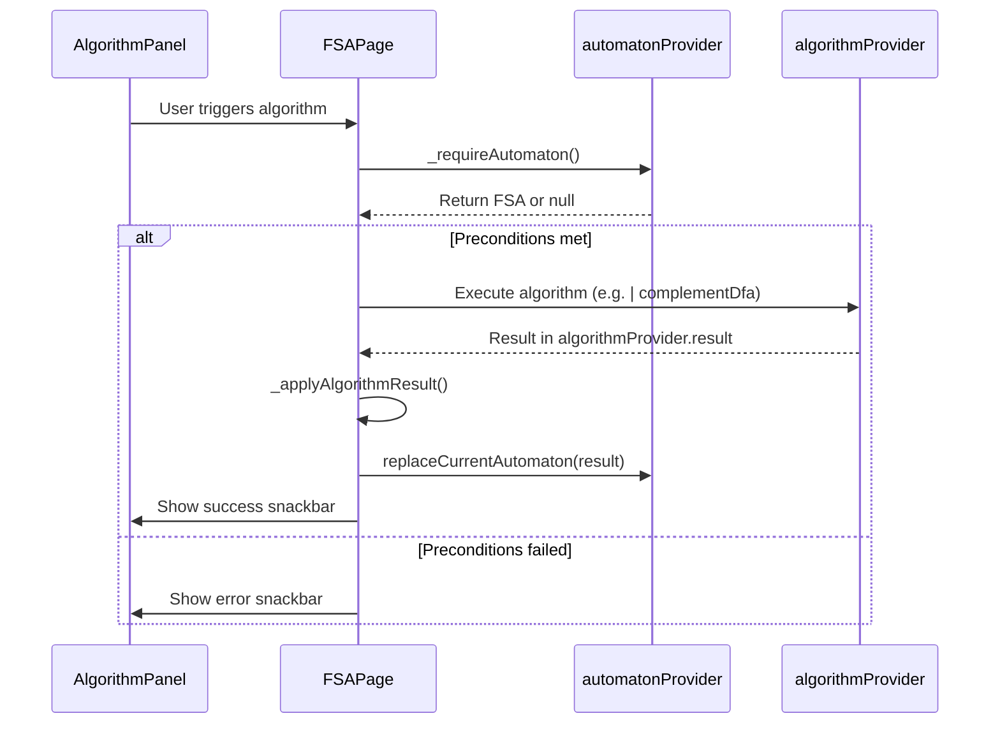

# FSA Page

> **Relevant source files**
> * [lib/core/parsers/jflap_xml_parser.dart](https://github.com/ThalesMMS/JFlutter/blob/32e808b4/lib/core/parsers/jflap_xml_parser.dart)
> * [lib/presentation/pages/fsa_page.dart](https://github.com/ThalesMMS/JFlutter/blob/32e808b4/lib/presentation/pages/fsa_page.dart)
> * [lib/presentation/pages/grammar_page.dart](https://github.com/ThalesMMS/JFlutter/blob/32e808b4/lib/presentation/pages/grammar_page.dart)
> * [lib/presentation/pages/pda_page.dart](https://github.com/ThalesMMS/JFlutter/blob/32e808b4/lib/presentation/pages/pda_page.dart)
> * [lib/presentation/pages/pumping_lemma_page.dart](https://github.com/ThalesMMS/JFlutter/blob/32e808b4/lib/presentation/pages/pumping_lemma_page.dart)
> * [lib/presentation/pages/regex_page.dart](https://github.com/ThalesMMS/JFlutter/blob/32e808b4/lib/presentation/pages/regex_page.dart)
> * [lib/presentation/pages/tm_page.dart](https://github.com/ThalesMMS/JFlutter/blob/32e808b4/lib/presentation/pages/tm_page.dart)
> * [lib/presentation/widgets/automaton_canvas_tool.dart](https://github.com/ThalesMMS/JFlutter/blob/32e808b4/lib/presentation/widgets/automaton_canvas_tool.dart)
> * [lib/presentation/widgets/mobile_automaton_controls.dart](https://github.com/ThalesMMS/JFlutter/blob/32e808b4/lib/presentation/widgets/mobile_automaton_controls.dart)
> * [lib/presentation/widgets/pda_canvas_graphview.dart](https://github.com/ThalesMMS/JFlutter/blob/32e808b4/lib/presentation/widgets/pda_canvas_graphview.dart)
> * [lib/presentation/widgets/tablet_layout_container.dart](https://github.com/ThalesMMS/JFlutter/blob/32e808b4/lib/presentation/widgets/tablet_layout_container.dart)
> * [lib/presentation/widgets/tm_canvas_graphview.dart](https://github.com/ThalesMMS/JFlutter/blob/32e808b4/lib/presentation/widgets/tm_canvas_graphview.dart)
> * [test/tablet_layout_test.dart](https://github.com/ThalesMMS/JFlutter/blob/32e808b4/test/tablet_layout_test.dart)

The FSA Page is the primary workspace for creating, editing, and analyzing Finite State Automata (DFA, NFA, and ε-NFA). It coordinates the canvas editing surface, simulation panel, and algorithm panel through a responsive layout system that adapts to mobile, tablet, and desktop screen sizes.

For information about the canvas system used by this page, see [Canvas System](4%20Canvas-System.md). For PDA and TM workspaces with similar structure, see [PDA Page](5b%20PDA-Page.md) and [TM Page](5c%20TM-Page.md).

---

## Architecture Overview

The `FSAPage` widget is a `ConsumerStatefulWidget` that integrates multiple subsystems: the GraphView-based canvas for visual editing, state providers for reactive data flow, simulation and algorithm panels for operations, and responsive layout logic to adapt to different screen sizes.

### FSA Page Component Architecture



**Sources:** [lib/presentation/pages/fsa_page.dart L32-L673](https://github.com/ThalesMMS/JFlutter/blob/32e808b4/lib/presentation/pages/fsa_page.dart#L32-L673)

---

## State Management and Lifecycle

### Initialization Sequence

The `FSAPage` initializes controllers and services in `initState` and synchronizes them with the current automaton state from the provider.



**Key initialization code:**

* Controller creation: [lib/presentation/pages/fsa_page.dart L49-L52](https://github.com/ThalesMMS/JFlutter/blob/32e808b4/lib/presentation/pages/fsa_page.dart#L49-L52)
* Highlight service setup: [lib/presentation/pages/fsa_page.dart L53-L54](https://github.com/ThalesMMS/JFlutter/blob/32e808b4/lib/presentation/pages/fsa_page.dart#L53-L54)
* Tool controller initialization: [lib/presentation/pages/fsa_page.dart L55](https://github.com/ThalesMMS/JFlutter/blob/32e808b4/lib/presentation/pages/fsa_page.dart#L55-L55)

**Sources:** [lib/presentation/pages/fsa_page.dart L46-L56](https://github.com/ThalesMMS/JFlutter/blob/32e808b4/lib/presentation/pages/fsa_page.dart#L46-L56)

### State Synchronization

The page watches `automatonProvider` to rebuild when the automaton changes. The canvas controller provides bidirectional synchronization between the visual graph and the domain model.

| Component | Provider | Synchronization Direction |
| --- | --- | --- |
| `GraphViewCanvasController` | `automatonProvider.notifier` | Bidirectional |
| `SimulationPanel` | `automatonProvider` (read-only) | Provider → UI |
| `AlgorithmPanel` | `automatonProvider` + `algorithmProvider` | Provider → UI, Algorithm → Provider |

**Sources:** [lib/presentation/pages/fsa_page.dart L528](https://github.com/ThalesMMS/JFlutter/blob/32e808b4/lib/presentation/pages/fsa_page.dart#L528-L528)

---

## Responsive Layout System

The FSA Page implements three distinct layouts based on screen width breakpoints:

| Layout | Width Constraint | Strategy |
| --- | --- | --- |
| Mobile | `< 1024px` | Modal bottom sheets for panels, floating quick actions |
| Tablet | `1024px - 1399px` | `TabletLayoutContainer` with collapsible sidebar tabs |
| Desktop | `≥ 1400px` | Side-by-side row layout with all panels visible |

### Layout Decision Flow



**Sources:** [lib/presentation/pages/fsa_page.dart L527-L544](https://github.com/ThalesMMS/JFlutter/blob/32e808b4/lib/presentation/pages/fsa_page.dart#L527-L544)

### Mobile Layout

Mobile layout uses a full-screen canvas with floating quick action buttons and `MobileAutomatonControls` at the bottom.

**Key features:**

* Canvas fills the screen: [lib/presentation/pages/fsa_page.dart L546-L557](https://github.com/ThalesMMS/JFlutter/blob/32e808b4/lib/presentation/pages/fsa_page.dart#L546-L557)
* Floating `_CanvasQuickActions` for Simulate/Algorithms: [lib/presentation/pages/fsa_page.dart L417-L425](https://github.com/ThalesMMS/JFlutter/blob/32e808b4/lib/presentation/pages/fsa_page.dart#L417-L425)
* `MobileAutomatonControls` provides tool selection and viewport controls: [lib/presentation/pages/fsa_page.dart L428-L456](https://github.com/ThalesMMS/JFlutter/blob/32e808b4/lib/presentation/pages/fsa_page.dart#L428-L456)
* Modal sheets for simulation and algorithms: [lib/presentation/pages/fsa_page.dart L559-L626](https://github.com/ThalesMMS/JFlutter/blob/32e808b4/lib/presentation/pages/fsa_page.dart#L559-L626)
* `FSADeterminismOverlay` badge shows DFA/NFA/ε-NFA status: [lib/presentation/pages/fsa_page.dart L427](https://github.com/ThalesMMS/JFlutter/blob/32e808b4/lib/presentation/pages/fsa_page.dart#L427-L427)

**Sources:** [lib/presentation/pages/fsa_page.dart L546-L557](https://github.com/ThalesMMS/JFlutter/blob/32e808b4/lib/presentation/pages/fsa_page.dart#L546-L557)

 [lib/presentation/pages/fsa_page.dart L417-L456](https://github.com/ThalesMMS/JFlutter/blob/32e808b4/lib/presentation/pages/fsa_page.dart#L417-L456)

 [lib/presentation/pages/fsa_page.dart L559-L626](https://github.com/ThalesMMS/JFlutter/blob/32e808b4/lib/presentation/pages/fsa_page.dart#L559-L626)

### Tablet Layout

Tablet layout uses `TabletLayoutContainer`, which provides a collapsible sidebar with tabs for Algorithm and Simulation panels.



**Implementation:**

* [lib/presentation/pages/fsa_page.dart L659-L672](https://github.com/ThalesMMS/JFlutter/blob/32e808b4/lib/presentation/pages/fsa_page.dart#L659-L672)

**Sources:** [lib/presentation/pages/fsa_page.dart L659-L672](https://github.com/ThalesMMS/JFlutter/blob/32e808b4/lib/presentation/pages/fsa_page.dart#L659-L672)

 [lib/presentation/widgets/tablet_layout_container.dart L1-L154](https://github.com/ThalesMMS/JFlutter/blob/32e808b4/lib/presentation/widgets/tablet_layout_container.dart#L1-L154)

### Desktop Layout

Desktop layout arranges all three panels side-by-side using a `Row` with `Expanded` widgets.

**Panel distribution:**

* Algorithm Panel (left): `flex: 2`
* Canvas (center): `flex: 3`
* Simulation Panel (right): `flex: 2`

**Sources:** [lib/presentation/pages/fsa_page.dart L628-L657](https://github.com/ThalesMMS/JFlutter/blob/32e808b4/lib/presentation/pages/fsa_page.dart#L628-L657)

---

## Canvas Integration

### Canvas Area Construction

The `_buildCanvasArea` method constructs the canvas with appropriate toolbar and overlays based on layout mode.



**Sources:** [lib/presentation/pages/fsa_page.dart L386-L488](https://github.com/ThalesMMS/JFlutter/blob/32e808b4/lib/presentation/pages/fsa_page.dart#L386-L488)

### Tool Controller Integration

The `AutomatonCanvasToolController` tracks the active editing tool (selection, addState, transition). The page provides toggle behavior where selecting an active tool switches back to selection mode.

**Tool handling methods:**

* `_toggleCanvasTool`: [lib/presentation/pages/fsa_page.dart L66-L73](https://github.com/ThalesMMS/JFlutter/blob/32e808b4/lib/presentation/pages/fsa_page.dart#L66-L73)
* `_handleAddStatePressed`: [lib/presentation/pages/fsa_page.dart L75-L80](https://github.com/ThalesMMS/JFlutter/blob/32e808b4/lib/presentation/pages/fsa_page.dart#L75-L80)

**Sources:** [lib/presentation/pages/fsa_page.dart L44](https://github.com/ThalesMMS/JFlutter/blob/32e808b4/lib/presentation/pages/fsa_page.dart#L44-L44)

 [lib/presentation/pages/fsa_page.dart L66-L80](https://github.com/ThalesMMS/JFlutter/blob/32e808b4/lib/presentation/pages/fsa_page.dart#L66-L80)

### Status Message Generation

The toolbar displays a status message that summarizes the automaton's state and any validation warnings.

**Status components:**

* State/transition counts
* Missing initial state warning
* No accepting states warning
* Nondeterminism indicator
* ε-transition presence indicator

**Implementation:** [lib/presentation/pages/fsa_page.dart L490-L524](https://github.com/ThalesMMS/JFlutter/blob/32e808b4/lib/presentation/pages/fsa_page.dart#L490-L524)

**Sources:** [lib/presentation/pages/fsa_page.dart L490-L524](https://github.com/ThalesMMS/JFlutter/blob/32e808b4/lib/presentation/pages/fsa_page.dart#L490-L524)

---

## Algorithm Operations

The FSA Page provides a comprehensive set of algorithms through the `AlgorithmPanel`. Algorithm execution follows a pattern: check preconditions, execute via `algorithmProvider`, then apply results to `automatonProvider`.

### Algorithm Execution Pattern



**Sources:** [lib/presentation/pages/fsa_page.dart L98-L159](https://github.com/ThalesMMS/JFlutter/blob/32e808b4/lib/presentation/pages/fsa_page.dart#L98-L159)

### Unary Algorithm Handlers

Unary algorithms operate on the current automaton. The `_runUnaryAlgorithm` helper abstracts the precondition checking and result handling pattern.

**Available unary algorithms:**

* **Remove λ-transitions**: [lib/presentation/pages/fsa_page.dart L232-L240](https://github.com/ThalesMMS/JFlutter/blob/32e808b4/lib/presentation/pages/fsa_page.dart#L232-L240)
* **Complement DFA**: [lib/presentation/pages/fsa_page.dart L242-L250](https://github.com/ThalesMMS/JFlutter/blob/32e808b4/lib/presentation/pages/fsa_page.dart#L242-L250)
* **Prefix closure**: [lib/presentation/pages/fsa_page.dart L252-L260](https://github.com/ThalesMMS/JFlutter/blob/32e808b4/lib/presentation/pages/fsa_page.dart#L252-L260)
* **Suffix closure**: [lib/presentation/pages/fsa_page.dart L262-L270](https://github.com/ThalesMMS/JFlutter/blob/32e808b4/lib/presentation/pages/fsa_page.dart#L262-L270)

**Sources:** [lib/presentation/pages/fsa_page.dart L160-L191](https://github.com/ThalesMMS/JFlutter/blob/32e808b4/lib/presentation/pages/fsa_page.dart#L160-L191)

 [lib/presentation/pages/fsa_page.dart L232-L270](https://github.com/ThalesMMS/JFlutter/blob/32e808b4/lib/presentation/pages/fsa_page.dart#L232-L270)

### Binary Algorithm Handlers

Binary algorithms combine the current automaton with a loaded automaton. The user selects a second automaton from a file picker, then the algorithm executes.

**Available binary algorithms:**

* **Union**: [lib/presentation/pages/fsa_page.dart L272-L282](https://github.com/ThalesMMS/JFlutter/blob/32e808b4/lib/presentation/pages/fsa_page.dart#L272-L282)
* **Intersection**: [lib/presentation/pages/fsa_page.dart L284-L294](https://github.com/ThalesMMS/JFlutter/blob/32e808b4/lib/presentation/pages/fsa_page.dart#L284-L294)
* **Difference**: [lib/presentation/pages/fsa_page.dart L296-L306](https://github.com/ThalesMMS/JFlutter/blob/32e808b4/lib/presentation/pages/fsa_page.dart#L296-L306)

**Sources:** [lib/presentation/pages/fsa_page.dart L193-L230](https://github.com/ThalesMMS/JFlutter/blob/32e808b4/lib/presentation/pages/fsa_page.dart#L193-L230)

 [lib/presentation/pages/fsa_page.dart L272-L306](https://github.com/ThalesMMS/JFlutter/blob/32e808b4/lib/presentation/pages/fsa_page.dart#L272-L306)

### Algorithm Panel Construction

The `_buildAlgorithmPanelForState` method constructs the `AlgorithmPanel` with callbacks enabled/disabled based on automaton properties.

**Enablement logic:**

| Algorithm | Condition | Location |
| --- | --- | --- |
| NFA→DFA | `hasAutomaton` | [lib/presentation/pages/fsa_page.dart L319-L321](https://github.com/ThalesMMS/JFlutter/blob/32e808b4/lib/presentation/pages/fsa_page.dart#L319-L321) |
| Remove λ | `hasLambda` | [lib/presentation/pages/fsa_page.dart L322](https://github.com/ThalesMMS/JFlutter/blob/32e808b4/lib/presentation/pages/fsa_page.dart#L322-L322) |
| Minimize DFA | `isDfa` | [lib/presentation/pages/fsa_page.dart L323](https://github.com/ThalesMMS/JFlutter/blob/32e808b4/lib/presentation/pages/fsa_page.dart#L323-L323) |
| Complete DFA | `isDfa` | [lib/presentation/pages/fsa_page.dart L324](https://github.com/ThalesMMS/JFlutter/blob/32e808b4/lib/presentation/pages/fsa_page.dart#L324-L324) |
| Complement DFA | `isDfa` | [lib/presentation/pages/fsa_page.dart L325](https://github.com/ThalesMMS/JFlutter/blob/32e808b4/lib/presentation/pages/fsa_page.dart#L325-L325) |
| Binary DFA ops | `isDfa` | [lib/presentation/pages/fsa_page.dart L326-L328](https://github.com/ThalesMMS/JFlutter/blob/32e808b4/lib/presentation/pages/fsa_page.dart#L326-L328) |
| FSA→Grammar | `hasAutomaton` | [lib/presentation/pages/fsa_page.dart L331](https://github.com/ThalesMMS/JFlutter/blob/32e808b4/lib/presentation/pages/fsa_page.dart#L331-L331) |
| Auto Layout | `hasAutomaton` | [lib/presentation/pages/fsa_page.dart L332-L334](https://github.com/ThalesMMS/JFlutter/blob/32e808b4/lib/presentation/pages/fsa_page.dart#L332-L334) |

**Sources:** [lib/presentation/pages/fsa_page.dart L308-L343](https://github.com/ThalesMMS/JFlutter/blob/32e808b4/lib/presentation/pages/fsa_page.dart#L308-L343)

---

## Simulation System

### Simulation Panel Integration

The `SimulationPanel` provides an input field for test strings and displays execution traces. On mobile, it appears as a modal bottom sheet; on tablet/desktop, it's always visible.

**Simulation flow:**

1. User enters input string in `SimulationPanel`
2. Panel calls `automatonProvider.notifier.simulateAutomaton(inputString)`
3. Provider updates `simulationResult` in state
4. `SimulationHighlightService` broadcasts highlights via `GraphViewSimulationHighlightChannel`
5. Canvas controller receives highlights and updates visual feedback

**Sources:** [lib/presentation/pages/fsa_page.dart L609-L625](https://github.com/ThalesMMS/JFlutter/blob/32e808b4/lib/presentation/pages/fsa_page.dart#L609-L625)

 [lib/presentation/pages/fsa_page.dart L646-L654](https://github.com/ThalesMMS/JFlutter/blob/32e808b4/lib/presentation/pages/fsa_page.dart#L646-L654)

### Highlight Service Setup

The highlight service coordinates between simulation execution and canvas visual feedback.

**Initialization:**

```
_highlightChannel = GraphViewSimulationHighlightChannel(_canvasController);
_highlightService = SimulationHighlightService(channel: _highlightChannel);
```

**Provider override:**
The page overrides `canvasHighlightServiceProvider` to inject the local highlight service into child widgets:

[lib/presentation/pages/fsa_page.dart L532-L535](https://github.com/ThalesMMS/JFlutter/blob/32e808b4/lib/presentation/pages/fsa_page.dart#L532-L535)

**Sources:** [lib/presentation/pages/fsa_page.dart L53-L54](https://github.com/ThalesMMS/JFlutter/blob/32e808b4/lib/presentation/pages/fsa_page.dart#L53-L54)

 [lib/presentation/pages/fsa_page.dart L532-L535](https://github.com/ThalesMMS/JFlutter/blob/32e808b4/lib/presentation/pages/fsa_page.dart#L532-L535)

---

## UI Components

### FSA Determinism Badge

The `FSADeterminismOverlay` displays a badge indicating whether the current automaton is a DFA, NFA, or ε-NFA. It's positioned as an overlay on the canvas.

**Badge logic:**

* DFA: No ε-transitions, deterministic
* ε-NFA: Has ε-transitions
* NFA: Nondeterministic but no ε-transitions

**Sources:** [lib/presentation/pages/fsa_page.dart L427](https://github.com/ThalesMMS/JFlutter/blob/32e808b4/lib/presentation/pages/fsa_page.dart#L427-L427)

 [lib/presentation/pages/fsa_page.dart L465](https://github.com/ThalesMMS/JFlutter/blob/32e808b4/lib/presentation/pages/fsa_page.dart#L465-L465)

### Quick Actions (Mobile)

The `_CanvasQuickActions` widget provides floating buttons for Simulate and Algorithms on mobile layouts.

**Implementation:**

```
class _CanvasQuickActions extends StatelessWidget {  final VoidCallback? onSimulate;  final VoidCallback? onAlgorithms;  // ...}
```

**Location:** [lib/presentation/pages/fsa_page.dart L675-L714](https://github.com/ThalesMMS/JFlutter/blob/32e808b4/lib/presentation/pages/fsa_page.dart#L675-L714)

**Sources:** [lib/presentation/pages/fsa_page.dart L675-L714](https://github.com/ThalesMMS/JFlutter/blob/32e808b4/lib/presentation/pages/fsa_page.dart#L675-L714)

### Mobile Automaton Controls

The `MobileAutomatonControls` widget consolidates tool selection, viewport controls, and undo/redo in a touch-optimized bottom panel.

**Features:**

* Tool selection (selection, addState, transition)
* Viewport controls (fit, reset, clear)
* Undo/redo buttons
* Status message display

**Integration:** [lib/presentation/pages/fsa_page.dart L428-L456](https://github.com/ThalesMMS/JFlutter/blob/32e808b4/lib/presentation/pages/fsa_page.dart#L428-L456)

**Sources:** [lib/presentation/pages/fsa_page.dart L428-L456](https://github.com/ThalesMMS/JFlutter/blob/32e808b4/lib/presentation/pages/fsa_page.dart#L428-L456)

 [lib/presentation/widgets/mobile_automaton_controls.dart L1-L318](https://github.com/ThalesMMS/JFlutter/blob/32e808b4/lib/presentation/widgets/mobile_automaton_controls.dart#L1-L318)

### Desktop Toolbar

The `GraphViewCanvasToolbar` provides tool buttons and status display for desktop layouts.

**Integration:** [lib/presentation/pages/fsa_page.dart L466-L483](https://github.com/ThalesMMS/JFlutter/blob/32e808b4/lib/presentation/pages/fsa_page.dart#L466-L483)

**Sources:** [lib/presentation/pages/fsa_page.dart L466-L483](https://github.com/ThalesMMS/JFlutter/blob/32e808b4/lib/presentation/pages/fsa_page.dart#L466-L483)

---

## Modal Sheet Patterns

### Algorithm Sheet

The algorithm sheet is a draggable modal that displays the `AlgorithmPanel` on mobile devices.

**Configuration:**

* Initial height: 70% of screen
* Min height: 40%
* Max height: 95%

**Implementation:** [lib/presentation/pages/fsa_page.dart L559-L588](https://github.com/ThalesMMS/JFlutter/blob/32e808b4/lib/presentation/pages/fsa_page.dart#L559-L588)

**Sources:** [lib/presentation/pages/fsa_page.dart L559-L588](https://github.com/ThalesMMS/JFlutter/blob/32e808b4/lib/presentation/pages/fsa_page.dart#L559-L588)

### Simulation Sheet

The simulation sheet is similar to the algorithm sheet but with different sizing defaults.

**Configuration:**

* Initial height: 60% of screen
* Min height: 40%
* Max height: 95%

**Implementation:** [lib/presentation/pages/fsa_page.dart L590-L626](https://github.com/ThalesMMS/JFlutter/blob/32e808b4/lib/presentation/pages/fsa_page.dart#L590-L626)

**Sources:** [lib/presentation/pages/fsa_page.dart L590-L626](https://github.com/ThalesMMS/JFlutter/blob/32e808b4/lib/presentation/pages/fsa_page.dart#L590-L626)

---

## Conversion Operations

### FSA to Grammar Conversion

The page provides conversion to grammar through `_handleFsaToGrammar`, which navigates to the Grammar Page upon success.

**Flow:**

1. Call `automatonProvider.notifier.convertFsaToGrammar()`
2. If successful, navigate to `GrammarPage`
3. Grammar is stored in `grammarProvider`

**Sources:** [lib/presentation/pages/fsa_page.dart L361-L375](https://github.com/ThalesMMS/JFlutter/blob/32e808b4/lib/presentation/pages/fsa_page.dart#L361-L375)

### FSA to Regex Conversion

Similarly, `_handleFaToRegex` converts the automaton to a regular expression and navigates to `RegexPage`.

**Sources:** [lib/presentation/pages/fsa_page.dart L345-L359](https://github.com/ThalesMMS/JFlutter/blob/32e808b4/lib/presentation/pages/fsa_page.dart#L345-L359)

### Equivalence Comparison

The equivalence comparison operation allows comparing two DFAs for language equivalence.

**Implementation:** [lib/presentation/pages/fsa_page.dart L377-L384](https://github.com/ThalesMMS/JFlutter/blob/32e808b4/lib/presentation/pages/fsa_page.dart#L377-L384)

**Sources:** [lib/presentation/pages/fsa_page.dart L377-L384](https://github.com/ThalesMMS/JFlutter/blob/32e808b4/lib/presentation/pages/fsa_page.dart#L377-L384)

---

## Cleanup and Disposal

The `dispose` method ensures proper cleanup of controllers and services to prevent memory leaks.

**Cleanup order:**

1. Clear highlight service
2. Dispose canvas controller
3. Dispose tool controller

**Implementation:** [lib/presentation/pages/fsa_page.dart L58-L64](https://github.com/ThalesMMS/JFlutter/blob/32e808b4/lib/presentation/pages/fsa_page.dart#L58-L64)

**Sources:** [lib/presentation/pages/fsa_page.dart L58-L64](https://github.com/ThalesMMS/JFlutter/blob/32e808b4/lib/presentation/pages/fsa_page.dart#L58-L64)

---

## Testing

The FSA Page is tested for responsive layout behavior in [test/tablet_layout_test.dart L16-L24](https://github.com/ThalesMMS/JFlutter/blob/32e808b4/test/tablet_layout_test.dart#L16-L24)

**Test coverage:**

* Tablet layout uses `TabletLayoutContainer` at 1366x1024
* Desktop layout verification
* Mobile layout verification

**Sources:** [test/tablet_layout_test.dart L16-L24](https://github.com/ThalesMMS/JFlutter/blob/32e808b4/test/tablet_layout_test.dart#L16-L24)


### On this page

* [FSA Page](#5.1-fsa-page)
* [Architecture Overview](#5.1-architecture-overview)
* [FSA Page Component Architecture](#5.1-fsa-page-component-architecture)
* [State Management and Lifecycle](#5.1-state-management-and-lifecycle)
* [Initialization Sequence](#5.1-initialization-sequence)
* [State Synchronization](#5.1-state-synchronization)
* [Responsive Layout System](#5.1-responsive-layout-system)
* [Layout Decision Flow](#5.1-layout-decision-flow)
* [Mobile Layout](#5.1-mobile-layout)
* [Tablet Layout](#5.1-tablet-layout)
* [Desktop Layout](#5.1-desktop-layout)
* [Canvas Integration](#5.1-canvas-integration)
* [Canvas Area Construction](#5.1-canvas-area-construction)
* [Tool Controller Integration](#5.1-tool-controller-integration)
* [Status Message Generation](#5.1-status-message-generation)
* [Algorithm Operations](#5.1-algorithm-operations)
* [Algorithm Execution Pattern](#5.1-algorithm-execution-pattern)
* [Unary Algorithm Handlers](#5.1-unary-algorithm-handlers)
* [Binary Algorithm Handlers](#5.1-binary-algorithm-handlers)
* [Algorithm Panel Construction](#5.1-algorithm-panel-construction)
* [Simulation System](#5.1-simulation-system)
* [Simulation Panel Integration](#5.1-simulation-panel-integration)
* [Highlight Service Setup](#5.1-highlight-service-setup)
* [UI Components](#5.1-ui-components)
* [FSA Determinism Badge](#5.1-fsa-determinism-badge)
* [Quick Actions (Mobile)](#5.1-quick-actions-mobile)
* [Mobile Automaton Controls](#5.1-mobile-automaton-controls)
* [Desktop Toolbar](#5.1-desktop-toolbar)
* [Modal Sheet Patterns](#5.1-modal-sheet-patterns)
* [Algorithm Sheet](#5.1-algorithm-sheet)
* [Simulation Sheet](#5.1-simulation-sheet)
* [Conversion Operations](#5.1-conversion-operations)
* [FSA to Grammar Conversion](#5.1-fsa-to-grammar-conversion)
* [FSA to Regex Conversion](#5.1-fsa-to-regex-conversion)
* [Equivalence Comparison](#5.1-equivalence-comparison)
* [Cleanup and Disposal](#5.1-cleanup-and-disposal)
* [Testing](#5.1-testing)

Ask Devin about JFlutter