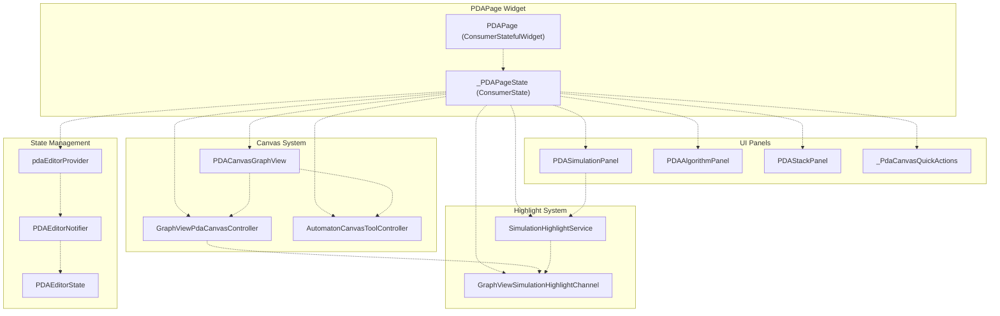
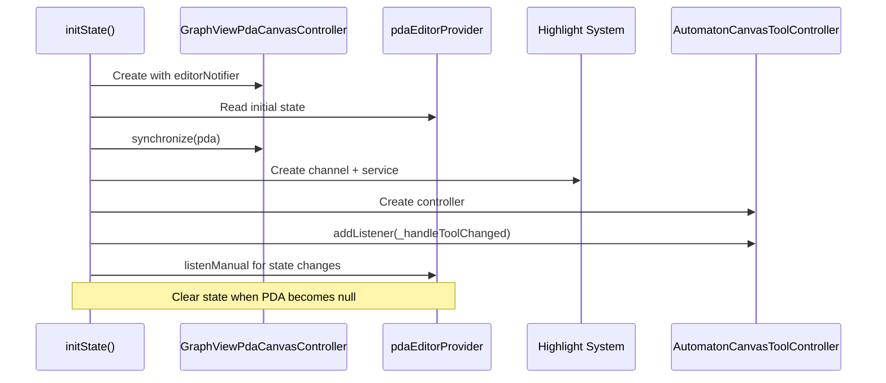
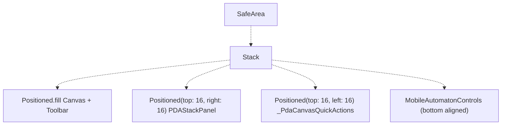
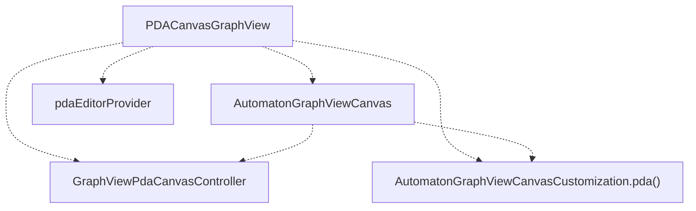
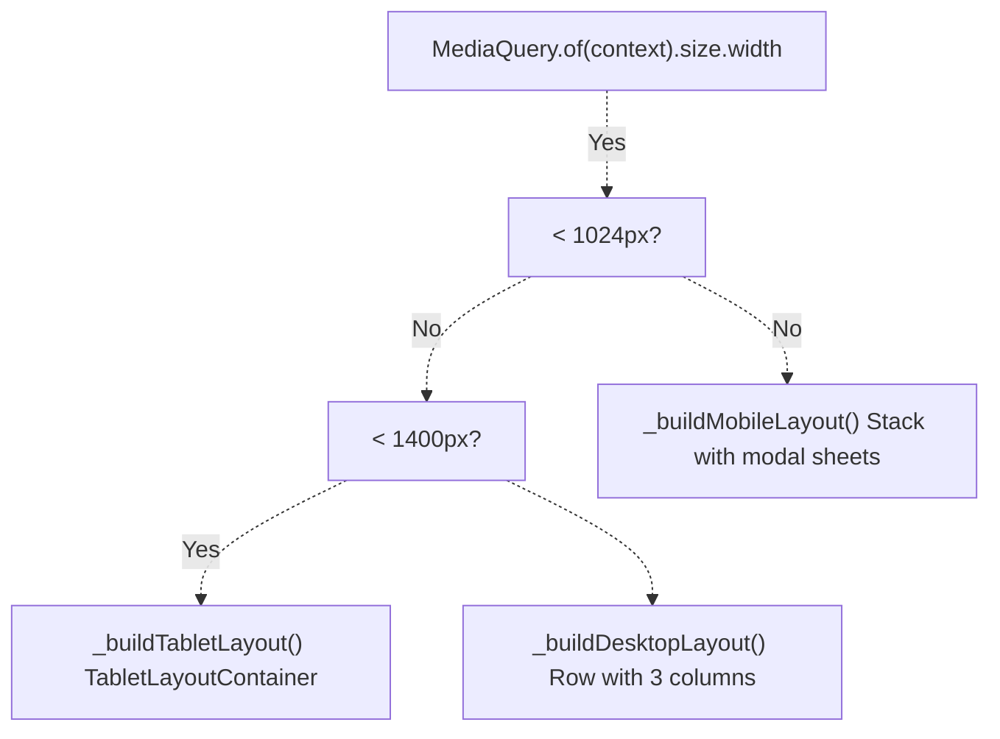

# PDA Page

> **Relevant source files**
> * [lib/core/parsers/jflap_xml_parser.dart](https://github.com/ThalesMMS/JFlutter/blob/32e808b4/lib/core/parsers/jflap_xml_parser.dart)
> * [lib/presentation/pages/fsa_page.dart](https://github.com/ThalesMMS/JFlutter/blob/32e808b4/lib/presentation/pages/fsa_page.dart)
> * [lib/presentation/pages/grammar_page.dart](https://github.com/ThalesMMS/JFlutter/blob/32e808b4/lib/presentation/pages/grammar_page.dart)
> * [lib/presentation/pages/pda_page.dart](https://github.com/ThalesMMS/JFlutter/blob/32e808b4/lib/presentation/pages/pda_page.dart)
> * [lib/presentation/pages/pumping_lemma_page.dart](https://github.com/ThalesMMS/JFlutter/blob/32e808b4/lib/presentation/pages/pumping_lemma_page.dart)
> * [lib/presentation/pages/regex_page.dart](https://github.com/ThalesMMS/JFlutter/blob/32e808b4/lib/presentation/pages/regex_page.dart)
> * [lib/presentation/pages/tm_page.dart](https://github.com/ThalesMMS/JFlutter/blob/32e808b4/lib/presentation/pages/tm_page.dart)
> * [lib/presentation/widgets/automaton_canvas_tool.dart](https://github.com/ThalesMMS/JFlutter/blob/32e808b4/lib/presentation/widgets/automaton_canvas_tool.dart)
> * [lib/presentation/widgets/mobile_automaton_controls.dart](https://github.com/ThalesMMS/JFlutter/blob/32e808b4/lib/presentation/widgets/mobile_automaton_controls.dart)
> * [lib/presentation/widgets/pda_canvas_graphview.dart](https://github.com/ThalesMMS/JFlutter/blob/32e808b4/lib/presentation/widgets/pda_canvas_graphview.dart)
> * [lib/presentation/widgets/tablet_layout_container.dart](https://github.com/ThalesMMS/JFlutter/blob/32e808b4/lib/presentation/widgets/tablet_layout_container.dart)
> * [lib/presentation/widgets/tm_canvas_graphview.dart](https://github.com/ThalesMMS/JFlutter/blob/32e808b4/lib/presentation/widgets/tm_canvas_graphview.dart)
> * [test/tablet_layout_test.dart](https://github.com/ThalesMMS/JFlutter/blob/32e808b4/test/tablet_layout_test.dart)

The PDA Page provides a workspace for creating, editing, simulating, and analyzing Pushdown Automata (PDAs). This page implements a responsive layout with canvas-based editing, simulation capabilities, algorithm operations, and stack visualization.

For finite state automata, see [FSA Page](#5.1). For Turing machines, see [TM Page](#5.3). For general canvas system architecture, see [Canvas System](#4).

---

## Purpose and Scope

The PDA Page (`PDAPage`) serves as the primary workspace for working with pushdown automata. It integrates:

* **Canvas editing** via GraphView-based controller and customization
* **Stack visualization** through floating panel showing current stack state
* **Simulation** with input string testing and step-by-step execution
* **Algorithm operations** including simplification and conversions
* **Responsive layouts** adapting to mobile (<1024px), tablet (1024-1400px), and desktop (≥1400px) screen sizes

**Sources:** [lib/presentation/pages/pda_page.dart L1-L565](https://github.com/ThalesMMS/JFlutter/blob/32e808b4/lib/presentation/pages/pda_page.dart#L1-L565)

---

## Page Architecture



**Sources:** [lib/presentation/pages/pda_page.dart L32-L103](https://github.com/ThalesMMS/JFlutter/blob/32e808b4/lib/presentation/pages/pda_page.dart#L32-L103)

 [lib/presentation/widgets/pda_canvas_graphview.dart L21-L128](https://github.com/ThalesMMS/JFlutter/blob/32e808b4/lib/presentation/widgets/pda_canvas_graphview.dart#L21-L128)

---

## Layout Variants

The PDA Page implements three responsive layout variants based on screen width:

| Layout | Width Range | Characteristics |
| --- | --- | --- |
| **Mobile** | < 1024px | Canvas with floating stack panel, modal bottom sheets for simulation/algorithms, `MobileAutomatonControls` at bottom, `_PdaCanvasQuickActions` floating buttons |
| **Tablet** | 1024-1400px | `TabletLayoutContainer` with collapsible sidebar containing tabbed panels (Algorithms, Simulation), canvas on left |
| **Desktop** | ≥ 1400px | Three-column `Row` layout: canvas (flex: 2), simulation (flex: 1), algorithms (flex: 1) |

**Sources:** [lib/presentation/pages/pda_page.dart L115-L131](https://github.com/ThalesMMS/JFlutter/blob/32e808b4/lib/presentation/pages/pda_page.dart#L115-L131)

 [lib/presentation/pages/pda_page.dart L133-L165](https://github.com/ThalesMMS/JFlutter/blob/32e808b4/lib/presentation/pages/pda_page.dart#L133-L165)

 [lib/presentation/pages/pda_page.dart L254-L285](https://github.com/ThalesMMS/JFlutter/blob/32e808b4/lib/presentation/pages/pda_page.dart#L254-L285)

 [lib/presentation/pages/pda_page.dart L516-L522](https://github.com/ThalesMMS/JFlutter/blob/32e808b4/lib/presentation/pages/pda_page.dart#L516-L522)

---

## State Management and Lifecycle

### State Properties

The `_PDAPageState` class maintains several state properties:

| Property | Type | Purpose |
| --- | --- | --- |
| `_latestPda` | `PDA?` | Most recent PDA instance from canvas/provider |
| `_stateCount` | `int` | Number of states in current PDA |
| `_transitionCount` | `int` | Number of transitions in current PDA |
| `_hasUnsavedChanges` | `bool` | Flag indicating pending modifications |
| `_currentStack` | `StackState` | Current stack state for visualization |
| `_canvasController` | `GraphViewPdaCanvasController` | Controller for canvas operations |
| `_highlightChannel` | `GraphViewSimulationHighlightChannel` | Bridge between simulation and canvas |
| `_highlightService` | `SimulationHighlightService` | Service managing simulation highlights |
| `_toolController` | `AutomatonCanvasToolController` | Controller for active canvas tool |
| `_activeTool` | `AutomatonCanvasTool` | Currently selected editing tool |
| `_pdaEditorSub` | `ProviderSubscription<PDAEditorState>?` | Subscription to provider changes |

**Sources:** [lib/presentation/pages/pda_page.dart L39-L50](https://github.com/ThalesMMS/JFlutter/blob/32e808b4/lib/presentation/pages/pda_page.dart#L39-L50)

### Initialization Sequence



**Sources:** [lib/presentation/pages/pda_page.dart L53-L77](https://github.com/ThalesMMS/JFlutter/blob/32e808b4/lib/presentation/pages/pda_page.dart#L53-L77)

### Provider Subscription

The page subscribes to `pdaEditorProvider` to reset metrics when the PDA is cleared:

```
_pdaEditorSub = ref.listenManual<PDAEditorState>(pdaEditorProvider, (  previous,  next,) {  if (!mounted) return;  if (next.pda == null && _latestPda != null) {    setState(() {      _latestPda = null;      _stateCount = 0;      _transitionCount = 0;      _hasUnsavedChanges = false;    });  }});
```

**Sources:** [lib/presentation/pages/pda_page.dart L63-L76](https://github.com/ThalesMMS/JFlutter/blob/32e808b4/lib/presentation/pages/pda_page.dart#L63-L76)

### Canvas Modification Callback

The `_handlePdaModified` callback is invoked whenever the PDA is modified through canvas operations:

```
void _handlePdaModified(PDA pda) {  setState(() {    _latestPda = pda;    _stateCount = pda.states.length;    _transitionCount = pda.pdaTransitions.length;    _hasUnsavedChanges = true;  });}
```

**Sources:** [lib/presentation/pages/pda_page.dart L105-L112](https://github.com/ThalesMMS/JFlutter/blob/32e808b4/lib/presentation/pages/pda_page.dart#L105-L112)

---

## Mobile Layout Implementation

### Layout Structure

The mobile layout uses a `Stack` with multiple layers:



**Sources:** [lib/presentation/pages/pda_page.dart L133-L165](https://github.com/ThalesMMS/JFlutter/blob/32e808b4/lib/presentation/pages/pda_page.dart#L133-L165)

### Quick Action Buttons

The `_PdaCanvasQuickActions` widget provides floating action buttons for simulation and algorithms:

```
class _PdaCanvasQuickActions extends StatelessWidget {  const _PdaCanvasQuickActions({this.onSimulate, this.onAlgorithms});  final VoidCallback? onSimulate;  final VoidCallback? onAlgorithms;    // Renders Material chip with IconButtons for Simulate and Algorithms}
```

Buttons are only displayed when a PDA with states exists (`hasPda`).

**Sources:** [lib/presentation/pages/pda_page.dart L525-L564](https://github.com/ThalesMMS/JFlutter/blob/32e808b4/lib/presentation/pages/pda_page.dart#L525-L564)

### Modal Bottom Sheets

The mobile layout uses draggable modal bottom sheets for panels via `_showPanelSheet`:

```
Future<void> _showPanelSheet({  required BuildContext context,  required String title,  required Widget child,  IconData? icon,}) async {  // Creates DraggableScrollableSheet with:  // - initialChildSize: 0.7  // - minChildSize: 0.4  // - maxChildSize: 0.95  // - Drag handle indicator  // - Title with icon  // - Close button}
```

**Sources:** [lib/presentation/pages/pda_page.dart L167-L252](https://github.com/ThalesMMS/JFlutter/blob/32e808b4/lib/presentation/pages/pda_page.dart#L167-L252)

---

## Canvas Integration

### PDACanvasGraphView Widget

The canvas is encapsulated in `PDACanvasGraphView`, which wraps `AutomatonGraphViewCanvas`:



**Sources:** [lib/presentation/widgets/pda_canvas_graphview.dart L21-L128](https://github.com/ThalesMMS/JFlutter/blob/32e808b4/lib/presentation/widgets/pda_canvas_graphview.dart#L21-L128)

### Canvas Controller Lifecycle

The canvas widget manages controller ownership:

1. **External controller provided**: Uses `widget.controller`, sets `_ownsController = false`
2. **No external controller**: Creates `GraphViewPdaCanvasController`, sets `_ownsController = true`, and manages highlight service integration

**Sources:** [lib/presentation/widgets/pda_canvas_graphview.dart L50-L70](https://github.com/ThalesMMS/JFlutter/blob/32e808b4/lib/presentation/widgets/pda_canvas_graphview.dart#L50-L70)

### Synchronization and Callbacks

The canvas widget:

* Synchronizes controller with initial PDA state on `initState()`
* Calls `fitToContent()` after first frame if PDA has states
* Subscribes to `pdaEditorProvider` to invoke `onPdaModified` callback
* Tracks last delivered PDA to avoid duplicate callbacks

**Sources:** [lib/presentation/widgets/pda_canvas_graphview.dart L72-L101](https://github.com/ThalesMMS/JFlutter/blob/32e808b4/lib/presentation/widgets/pda_canvas_graphview.dart#L72-L101)

---

## Canvas Toolbar and Controls

### Desktop Toolbar

The desktop canvas uses `GraphViewCanvasToolbar` with:

```javascript
GraphViewCanvasToolbar(  layout: GraphViewCanvasToolbarLayout.desktop,  controller: _canvasController,  enableToolSelection: true,  showSelectionTool: true,  activeTool: _activeTool,  onSelectTool: () => _toolController.setActiveTool(AutomatonCanvasTool.selection),  onAddState: _handleAddStatePressed,  onAddTransition: () => _toolController.setActiveTool(AutomatonCanvasTool.transition),  onClear: () => ref.read(pdaEditorProvider.notifier).updateFromCanvas(...),  statusMessage: statusMessage,)
```

**Sources:** [lib/presentation/pages/pda_page.dart L428-L454](https://github.com/ThalesMMS/JFlutter/blob/32e808b4/lib/presentation/pages/pda_page.dart#L428-L454)

### Mobile Controls

Mobile layout uses `MobileAutomatonControls` with the following configuration:

| Parameter | Value | Notes |
| --- | --- | --- |
| `enableToolSelection` | `true` | Enables tool toggle buttons |
| `showSelectionTool` | `true` | Shows selection tool button |
| `activeTool` | `_activeTool` | Synchronized with controller |
| `onAddState` | `_handleAddStatePressed` | Adds state and switches tool |
| `onAddTransition` | Sets transition tool | Toggles transition mode |
| `onUndo/onRedo` | Conditionally enabled | Based on `_canvasController.canUndo/canRedo` |
| `onSimulate` | `null` | Disabled (use quick actions) |
| `onAlgorithms` | `null` | Disabled (use quick actions) |

**Sources:** [lib/presentation/pages/pda_page.dart L386-L423](https://github.com/ThalesMMS/JFlutter/blob/32e808b4/lib/presentation/pages/pda_page.dart#L386-L423)

### Tool Selection Handler

The page handles tool changes through a listener:

```
void _handleToolChanged() {  if (!mounted) return;  setState(() {    _activeTool = _toolController.activeTool;  });}void _handleAddStatePressed() {  if (_toolController.activeTool != AutomatonCanvasTool.addState) {    _toolController.setActiveTool(AutomatonCanvasTool.addState);  }  _canvasController.addStateAtCenter();}
```

**Sources:** [lib/presentation/pages/pda_page.dart L79-L93](https://github.com/ThalesMMS/JFlutter/blob/32e808b4/lib/presentation/pages/pda_page.dart#L79-L93)

---

## Status Message System

The toolbar displays a dynamic status message reflecting PDA state:

```
String _buildToolbarStatusMessage(PDAEditorState editorState) {  final pda = editorState.pda;  final hasPda = pda != null && pda.states.isNotEmpty;  final stateCount = pda?.states.length ?? 0;  final transitionCount = pda?.pdaTransitions.length ?? 0;    final messageParts = <String>[];    // Unsaved changes indicator  if (_hasUnsavedChanges) {    messageParts.add('Unsaved changes');  }    // Warnings  final warnings = <String>[];  if (editorState.nondeterministicTransitionIds.isNotEmpty) {    warnings.add('Nondeterministic transitions');  }  if (editorState.lambdaTransitionIds.isNotEmpty) {    warnings.add('λ-transitions present');  }    if (warnings.isNotEmpty) {    messageParts.add('⚠ ${warnings.join(' · ')}');  }    // State/transition counts or "No PDA loaded"  if (hasPda) {    messageParts.add('${stateCount} states · ${transitionCount} transitions');  } else {    messageParts.add('No PDA loaded');  }    return messageParts.join(' · ');}
```

**Sources:** [lib/presentation/pages/pda_page.dart L475-L509](https://github.com/ThalesMMS/JFlutter/blob/32e808b4/lib/presentation/pages/pda_page.dart#L475-L509)

---

## Stack Panel Visualization

The PDA Page displays a floating `PDAStackPanel` showing the current stack state:

### Panel Properties

| Property | Source | Purpose |
| --- | --- | --- |
| `stackState` | `_currentStack` | Current stack contents |
| `initialStackSymbol` | `pda.initialStackSymbol` | Default stack symbol (e.g., 'Z') |
| `stackAlphabet` | `pda.stackAlphabet` | Valid stack symbols |
| `onClear` | Callback | Resets stack to empty state |

### Positioning

* **Mobile**: `Positioned(top: 16, right: 16)` in main stack
* **Desktop**: `Positioned(bottom: 16, right: 16)` in canvas stack

**Sources:** [lib/presentation/pages/pda_page.dart L147-L161](https://github.com/ThalesMMS/JFlutter/blob/32e808b4/lib/presentation/pages/pda_page.dart#L147-L161)

 [lib/presentation/pages/pda_page.dart L455-L470](https://github.com/ThalesMMS/JFlutter/blob/32e808b4/lib/presentation/pages/pda_page.dart#L455-L470)

---

## Responsive Layout Breakpoints

### Layout Decision Tree



**Sources:** [lib/presentation/pages/pda_page.dart L115-L131](https://github.com/ThalesMMS/JFlutter/blob/32e808b4/lib/presentation/pages/pda_page.dart#L115-L131)

### Tablet Layout

The tablet layout delegates to `TabletLayoutContainer`:

```
Widget _buildTabletLayout() {  return TabletLayoutContainer(    canvas: _buildCanvasWithToolbar(isMobile: false),    algorithmPanel: const PDAAlgorithmPanel(useExpanded: false),    simulationPanel: PDASimulationPanel(highlightService: _highlightService),  );}
```

The container provides:

* Collapsible sidebar with tabs
* "Algorithms" and "Simulation" tabs
* Drag handle and close button
* Responsive flex sizing (canvas: 3, sidebar: 2 when expanded)

**Sources:** [lib/presentation/pages/pda_page.dart L516-L522](https://github.com/ThalesMMS/JFlutter/blob/32e808b4/lib/presentation/pages/pda_page.dart#L516-L522)

 [lib/presentation/widgets/tablet_layout_container.dart L1-L154](https://github.com/ThalesMMS/JFlutter/blob/32e808b4/lib/presentation/widgets/tablet_layout_container.dart#L1-L154)

---

## Highlight Service Integration

The PDA Page provides the `SimulationHighlightService` to descendant widgets via `ProviderScope`:

```
return ProviderScope(  overrides: [    canvasHighlightServiceProvider.overrideWithValue(_highlightService),  ],  child: Scaffold(    body: // layout...  ),);
```

This allows simulation panels to request canvas highlighting through the service without direct controller coupling.

**Sources:** [lib/presentation/pages/pda_page.dart L119-L131](https://github.com/ThalesMMS/JFlutter/blob/32e808b4/lib/presentation/pages/pda_page.dart#L119-L131)

---

## Disposal and Cleanup

The `dispose()` method ensures proper resource cleanup:

```
@overridevoid dispose() {  _pdaEditorSub?.close();                           // Close provider subscription  _toolController.removeListener(_handleToolChanged); // Remove tool listener  _toolController.dispose();                         // Dispose tool controller  _highlightService.clear();                        // Clear highlights  _canvasController.dispose();                      // Dispose canvas controller  super.dispose();}
```

**Sources:** [lib/presentation/pages/pda_page.dart L96-L103](https://github.com/ThalesMMS/JFlutter/blob/32e808b4/lib/presentation/pages/pda_page.dart#L96-L103)

---

## Key Differences from FSA and TM Pages

| Feature | PDA Page | FSA Page | TM Page |
| --- | --- | --- | --- |
| **Canvas Widget** | `PDACanvasGraphView` | `AutomatonCanvas` | `TMCanvasGraphView` |
| **Controller** | `GraphViewPdaCanvasController` | `GraphViewCanvasController` | `GraphViewTmCanvasController` |
| **Provider** | `pdaEditorProvider` | `automatonProvider` | `tmEditorProvider` |
| **Auxiliary Panel** | `PDAStackPanel` (stack) | `FSADeterminismOverlay` (DFA/NFA badge) | `TMTapePanel` (tape) |
| **Algorithm Panel** | `PDAAlgorithmPanel` | `AlgorithmPanel` | `TMAlgorithmPanel` |
| **Simulation Panel** | `PDASimulationPanel` | `SimulationPanel` | `TMSimulationPanel` |
| **Metrics Tracking** | State/transition count, unsaved flag | State/transition count, determinism | State/transition count, nondeterminism, tape symbols |
| **Quick Actions** | Simulate, Algorithms | Simulate, Algorithms | Simulate, Algorithms, Metrics |

**Sources:** [lib/presentation/pages/pda_page.dart L1-L565](https://github.com/ThalesMMS/JFlutter/blob/32e808b4/lib/presentation/pages/pda_page.dart#L1-L565)

 [lib/presentation/pages/fsa_page.dart L1-L715](https://github.com/ThalesMMS/JFlutter/blob/32e808b4/lib/presentation/pages/fsa_page.dart#L1-L715)

 [lib/presentation/pages/tm_page.dart L1-L643](https://github.com/ThalesMMS/JFlutter/blob/32e808b4/lib/presentation/pages/tm_page.dart#L1-L643)

---

## Testing Considerations

The PDA Page is validated through tablet layout integration tests:

```
testWidgets('PDAPage uses TabletLayoutContainer on tablet width', (tester) async {  tester.view.physicalSize = const Size(1366, 1024);  tester.view.devicePixelRatio = 1.0;  await tester.pumpWidget(const ProviderScope(child: MaterialApp(home: PDAPage())));  await tester.pumpAndSettle();  expect(find.byType(TabletLayoutContainer), findsOneWidget);});
```

**Sources:** [test/tablet_layout_test.dart L65-L73](https://github.com/ThalesMMS/JFlutter/blob/32e808b4/test/tablet_layout_test.dart#L65-L73)

Refresh this wiki

Last indexed: 30 December 2025 ([32e808](https://github.com/ThalesMMS/JFlutter/commit/32e808b4))

### On this page

* [PDA Page](#5.2-pda-page)
* [Purpose and Scope](#5.2-purpose-and-scope)
* [Page Architecture](#5.2-page-architecture)
* [Layout Variants](#5.2-layout-variants)
* [State Management and Lifecycle](#5.2-state-management-and-lifecycle)
* [State Properties](#5.2-state-properties)
* [Initialization Sequence](#5.2-initialization-sequence)
* [Provider Subscription](#5.2-provider-subscription)
* [Canvas Modification Callback](#5.2-canvas-modification-callback)
* [Mobile Layout Implementation](#5.2-mobile-layout-implementation)
* [Layout Structure](#5.2-layout-structure)
* [Quick Action Buttons](#5.2-quick-action-buttons)
* [Modal Bottom Sheets](#5.2-modal-bottom-sheets)
* [Canvas Integration](#5.2-canvas-integration)
* [PDACanvasGraphView Widget](#5.2-pdacanvasgraphview-widget)
* [Canvas Controller Lifecycle](#5.2-canvas-controller-lifecycle)
* [Synchronization and Callbacks](#5.2-synchronization-and-callbacks)
* [Canvas Toolbar and Controls](#5.2-canvas-toolbar-and-controls)
* [Desktop Toolbar](#5.2-desktop-toolbar)
* [Mobile Controls](#5.2-mobile-controls)
* [Tool Selection Handler](#5.2-tool-selection-handler)
* [Status Message System](#5.2-status-message-system)
* [Stack Panel Visualization](#5.2-stack-panel-visualization)
* [Panel Properties](#5.2-panel-properties)
* [Positioning](#5.2-positioning)
* [Responsive Layout Breakpoints](#5.2-responsive-layout-breakpoints)
* [Layout Decision Tree](#5.2-layout-decision-tree)
* [Tablet Layout](#5.2-tablet-layout)
* [Highlight Service Integration](#5.2-highlight-service-integration)
* [Disposal and Cleanup](#5.2-disposal-and-cleanup)
* [Key Differences from FSA and TM Pages](#5.2-key-differences-from-fsa-and-tm-pages)
* [Testing Considerations](#5.2-testing-considerations)

Ask Devin about JFlutter