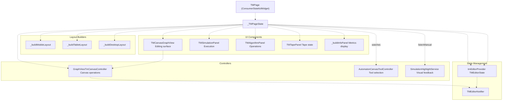
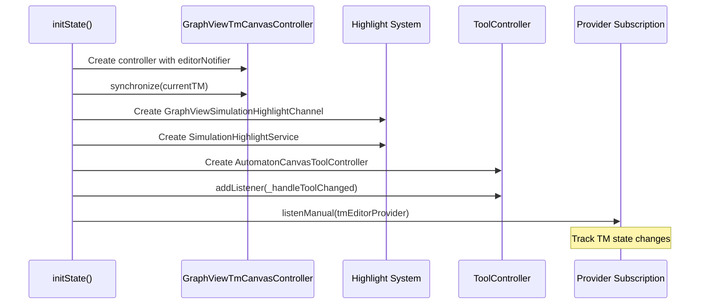
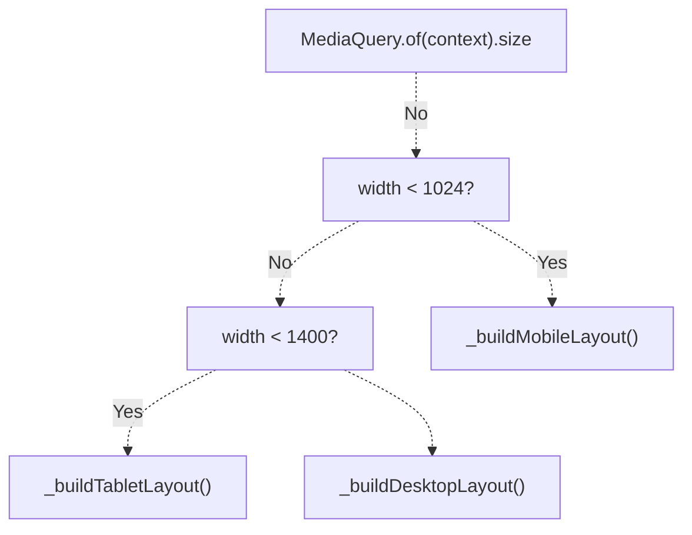
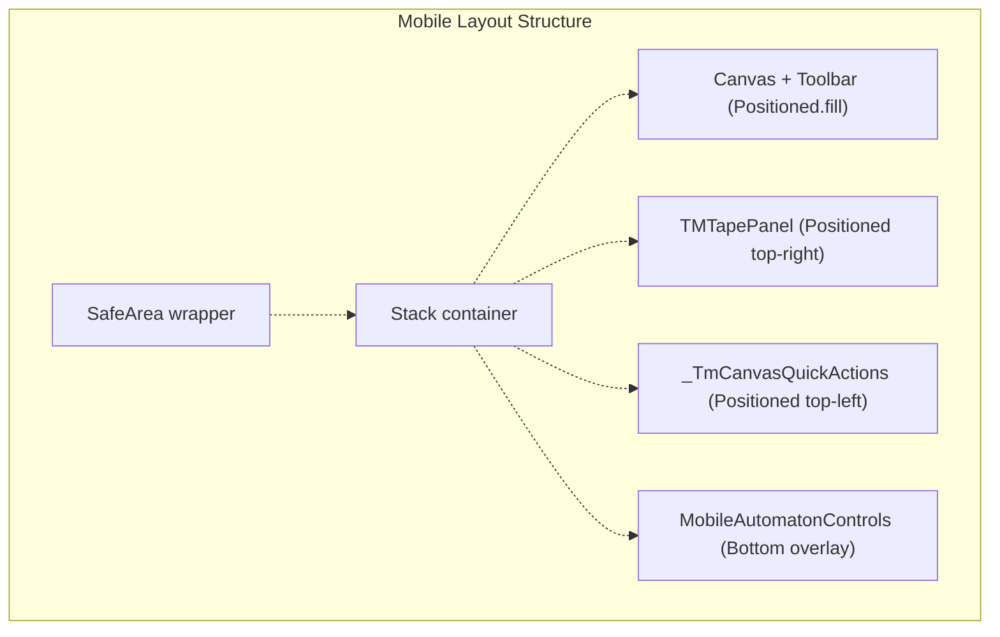
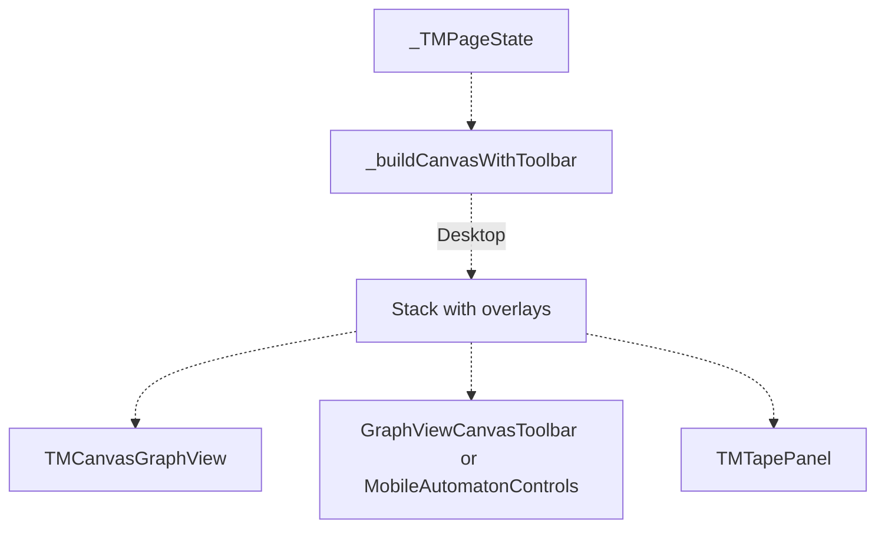
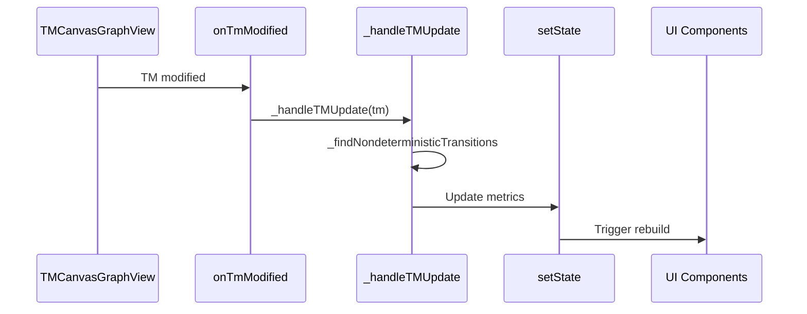

# TM Page

> **Relevant source files**
> * [lib/core/parsers/jflap_xml_parser.dart](https://github.com/ThalesMMS/JFlutter/blob/32e808b4/lib/core/parsers/jflap_xml_parser.dart)
> * [lib/presentation/pages/fsa_page.dart](https://github.com/ThalesMMS/JFlutter/blob/32e808b4/lib/presentation/pages/fsa_page.dart)
> * [lib/presentation/pages/grammar_page.dart](https://github.com/ThalesMMS/JFlutter/blob/32e808b4/lib/presentation/pages/grammar_page.dart)
> * [lib/presentation/pages/pda_page.dart](https://github.com/ThalesMMS/JFlutter/blob/32e808b4/lib/presentation/pages/pda_page.dart)
> * [lib/presentation/pages/pumping_lemma_page.dart](https://github.com/ThalesMMS/JFlutter/blob/32e808b4/lib/presentation/pages/pumping_lemma_page.dart)
> * [lib/presentation/pages/regex_page.dart](https://github.com/ThalesMMS/JFlutter/blob/32e808b4/lib/presentation/pages/regex_page.dart)
> * [lib/presentation/pages/tm_page.dart](https://github.com/ThalesMMS/JFlutter/blob/32e808b4/lib/presentation/pages/tm_page.dart)
> * [lib/presentation/widgets/automaton_canvas_tool.dart](https://github.com/ThalesMMS/JFlutter/blob/32e808b4/lib/presentation/widgets/automaton_canvas_tool.dart)
> * [lib/presentation/widgets/mobile_automaton_controls.dart](https://github.com/ThalesMMS/JFlutter/blob/32e808b4/lib/presentation/widgets/mobile_automaton_controls.dart)
> * [lib/presentation/widgets/pda_canvas_graphview.dart](https://github.com/ThalesMMS/JFlutter/blob/32e808b4/lib/presentation/widgets/pda_canvas_graphview.dart)
> * [lib/presentation/widgets/tablet_layout_container.dart](https://github.com/ThalesMMS/JFlutter/blob/32e808b4/lib/presentation/widgets/tablet_layout_container.dart)
> * [lib/presentation/widgets/tm_canvas_graphview.dart](https://github.com/ThalesMMS/JFlutter/blob/32e808b4/lib/presentation/widgets/tm_canvas_graphview.dart)
> * [test/tablet_layout_test.dart](https://github.com/ThalesMMS/JFlutter/blob/32e808b4/test/tablet_layout_test.dart)

## Purpose and Scope

The TM Page provides the dedicated workspace for creating, editing, simulating, and analyzing Turing Machines. It is one of the main workspace pages in the JFlutter application (see [Automaton Workspace Pages](#5) for the complete workspace system). This page integrates the canvas editor, simulation panel, algorithm operations, and machine metrics into a responsive layout that adapts to mobile, tablet, and desktop screen sizes.

For information about the canvas system that powers the TM editing surface, see [Canvas System](#4). For details on the PDA workspace, see [PDA Page](#5.2). For FSA workspace, see [FSA Page](#5.1).

**Sources:** [lib/presentation/pages/tm_page.dart L1-L643](https://github.com/ThalesMMS/JFlutter/blob/32e808b4/lib/presentation/pages/tm_page.dart#L1-L643)

---

## Architecture Overview

The TM Page follows a standard workspace page architecture with specialized components for Turing Machine operations. The page maintains local state for metrics tracking while delegating domain model management to `TMEditorProvider`.

### Component Structure



**Sources:** [lib/presentation/pages/tm_page.dart L32-L145](https://github.com/ThalesMMS/JFlutter/blob/32e808b4/lib/presentation/pages/tm_page.dart#L32-L145)

---

## Page Lifecycle and Initialization

The `_TMPageState` class manages component lifecycle and subscription to state changes.

### Initialization Sequence



**Key initialization steps:**

| Step | Component | Purpose |
| --- | --- | --- |
| 1 | `GraphViewTmCanvasController` | Canvas editing operations for TM |
| 2 | `synchronize(tm)` | Load existing TM into canvas |
| 3 | `GraphViewSimulationHighlightChannel` | Bridge highlights to canvas |
| 4 | `SimulationHighlightService` | Manage simulation visual feedback |
| 5 | `AutomatonCanvasToolController` | Track active editing tool |
| 6 | `listenManual` subscription | React to TM state changes |

**Sources:** [lib/presentation/pages/tm_page.dart L62-L91](https://github.com/ThalesMMS/JFlutter/blob/32e808b4/lib/presentation/pages/tm_page.dart#L62-L91)

 [lib/presentation/pages/tm_page.dart L93-L100](https://github.com/ThalesMMS/JFlutter/blob/32e808b4/lib/presentation/pages/tm_page.dart#L93-L100)

### State Tracking Variables

The page maintains local state for UI responsiveness and metrics display:

```
TM? _currentTM;int _stateCount = 0;int _transitionCount = 0;Set<String> _tapeSymbols = const <String>{};Set<String> _moveDirections = const <String>{};Set<String> _nondeterministicTransitionIds = const <String>{};bool _hasInitialState = false;bool _hasAcceptingState = false;TapeState _currentTape = TapeState.initial();AutomatonCanvasTool _activeTool = AutomatonCanvasTool.selection;
```

These variables are updated through the `_handleTMUpdate` callback when the canvas modifies the TM.

**Sources:** [lib/presentation/pages/tm_page.dart L40-L54](https://github.com/ThalesMMS/JFlutter/blob/32e808b4/lib/presentation/pages/tm_page.dart#L40-L54)

---

## Responsive Layout System

The TM Page implements a three-tier responsive layout strategy based on screen width breakpoints.

### Layout Selection Logic



**Sources:** [lib/presentation/pages/tm_page.dart L129-L145](https://github.com/ThalesMMS/JFlutter/blob/32e808b4/lib/presentation/pages/tm_page.dart#L129-L145)

### Layout Breakpoints

| Layout | Width Range | Characteristics |
| --- | --- | --- |
| Mobile | < 1024px | Full-screen canvas, modal bottom sheets for panels |
| Tablet | 1024px - 1399px | Canvas + collapsible sidebar with tabs (`TabletLayoutContainer`) |
| Desktop | ≥ 1400px | Multi-column Row layout with all panels visible |

### Mobile Layout

Mobile layout prioritizes the canvas with floating controls and quick action buttons:



The quick actions provide one-tap access to:

* **Simulate** button (if `_isMachineReady`)
* **Algorithms** button (if `_hasMachine`)
* **Metrics** button (if `_hasMachine`)

Panels open as draggable bottom sheets via `_showDraggableSheet`.

**Sources:** [lib/presentation/pages/tm_page.dart L147-L180](https://github.com/ThalesMMS/JFlutter/blob/32e808b4/lib/presentation/pages/tm_page.dart#L147-L180)

 [lib/presentation/pages/tm_page.dart L589-L642](https://github.com/ThalesMMS/JFlutter/blob/32e808b4/lib/presentation/pages/tm_page.dart#L589-L642)

### Desktop Layout

Desktop layout uses a Row with fixed flex proportions:

```yaml
Row:
  - Canvas (flex: 2)
  - Simulation Panel (flex: 1)
  - Algorithm Panel (flex: 1)
  - Info Panel (flexible, no flex specified)
```

**Sources:** [lib/presentation/pages/tm_page.dart L182-L220](https://github.com/ThalesMMS/JFlutter/blob/32e808b4/lib/presentation/pages/tm_page.dart#L182-L220)

### Tablet Layout

Uses `TabletLayoutContainer` with tabs for Algorithms, Simulation, and Info:

```
TabletLayoutContainer(  canvas: _buildCanvasWithToolbar(isMobile: false),  algorithmPanel: const TMAlgorithmPanel(useExpanded: false),  simulationPanel: TMSimulationPanel(highlightService: _highlightService),  infoPanel: _buildInfoPanel(context),)
```

The sidebar can be collapsed to maximize canvas space.

**Sources:** [lib/presentation/pages/tm_page.dart L375-L382](https://github.com/ThalesMMS/JFlutter/blob/32e808b4/lib/presentation/pages/tm_page.dart#L375-L382)

---

## Canvas Integration

The TM Page integrates the canvas through `TMCanvasGraphView`, which wraps the universal `AutomatonGraphViewCanvas` with TM-specific customization.

### Canvas Construction



The canvas is built with:

* `controller`: `GraphViewTmCanvasController` instance
* `toolController`: `AutomatonCanvasToolController` instance
* `onTmModified`: `_handleTMUpdate` callback

**Sources:** [lib/presentation/pages/tm_page.dart L222-L334](https://github.com/ThalesMMS/JFlutter/blob/32e808b4/lib/presentation/pages/tm_page.dart#L222-L334)

 [lib/presentation/widgets/tm_canvas_graphview.dart L26-L184](https://github.com/ThalesMMS/JFlutter/blob/32e808b4/lib/presentation/widgets/tm_canvas_graphview.dart#L26-L184)

### Tool Management

The page responds to tool changes through a listener:

```
_toolController.addListener(_handleToolChanged);void _handleToolChanged() {  if (!mounted) return;  setState(() {    _activeTool = _toolController.activeTool;  });}
```

Available tools:

* `AutomatonCanvasTool.selection` - Select and move states
* `AutomatonCanvasTool.addState` - Add new states
* `AutomatonCanvasTool.transition` - Add new transitions

**Sources:** [lib/presentation/pages/tm_page.dart L71](https://github.com/ThalesMMS/JFlutter/blob/32e808b4/lib/presentation/pages/tm_page.dart#L71-L71)

 [lib/presentation/pages/tm_page.dart L93-L100](https://github.com/ThalesMMS/JFlutter/blob/32e808b4/lib/presentation/pages/tm_page.dart#L93-L100)

 [lib/presentation/pages/tm_page.dart L102-L116](https://github.com/ThalesMMS/JFlutter/blob/32e808b4/lib/presentation/pages/tm_page.dart#L102-L116)

---

## Metrics and Validation

The page tracks TM metrics to enable/disable operations and display status information.

### Metrics Update Flow



**Sources:** [lib/presentation/pages/tm_page.dart L384-L402](https://github.com/ThalesMMS/JFlutter/blob/32e808b4/lib/presentation/pages/tm_page.dart#L384-L402)

### Validation Checks

```javascript
bool get _isMachineReady =>    _currentTM != null && _hasInitialState && _hasAcceptingState;bool get _hasMachine => _currentTM != null && _stateCount > 0;
```

These computed properties control feature availability:

* **Simulation enabled**: `_isMachineReady` is true
* **Algorithm/Metrics enabled**: `_hasMachine` is true

**Sources:** [lib/presentation/pages/tm_page.dart L56-L59](https://github.com/ThalesMMS/JFlutter/blob/32e808b4/lib/presentation/pages/tm_page.dart#L56-L59)

### Nondeterminism Detection

The page identifies nondeterministic transitions by grouping transitions with the same (fromState, readSymbol, tapeNumber) tuple:

```javascript
Set<String> _findNondeterministicTransitions(Set<TMTransition> transitions) {  final grouped = <String, List<TMTransition>>{};    for (final transition in transitions) {    final key = [      transition.fromState.id,      transition.readSymbol,      transition.tapeNumber.toString(),    ].join('|');        grouped.putIfAbsent(key, () => <TMTransition>[]).add(transition);  }    return grouped.values      .where((list) => list.length > 1)      .expand((list) => list.map((transition) => transition.id))      .toSet();}
```

**Sources:** [lib/presentation/pages/tm_page.dart L569-L586](https://github.com/ThalesMMS/JFlutter/blob/32e808b4/lib/presentation/pages/tm_page.dart#L569-L586)

---

## Panel Components

The TM Page coordinates three main panel types: simulation, algorithms, and info/metrics.

### Simulation Panel

`TMSimulationPanel` provides input/execution controls and is always passed the `highlightService` for visual feedback:

```
TMSimulationPanel(highlightService: _highlightService)
```

The panel can be accessed:

* **Desktop**: Always visible in center column
* **Tablet**: Tab in collapsible sidebar
* **Mobile**: Modal bottom sheet via `_openSimulationSheet()`

**Sources:** [lib/presentation/pages/tm_page.dart L199](https://github.com/ThalesMMS/JFlutter/blob/32e808b4/lib/presentation/pages/tm_page.dart#L199-L199)

 [lib/presentation/pages/tm_page.dart L379](https://github.com/ThalesMMS/JFlutter/blob/32e808b4/lib/presentation/pages/tm_page.dart#L379-L379)

### Algorithm Panel

`TMAlgorithmPanel` displays available TM operations. On tablet layout, it uses `useExpanded: false` to fit within the tabbed sidebar:

```
const TMAlgorithmPanel(useExpanded: false)
```

**Sources:** [lib/presentation/pages/tm_page.dart L208](https://github.com/ThalesMMS/JFlutter/blob/32e808b4/lib/presentation/pages/tm_page.dart#L208-L208)

 [lib/presentation/pages/tm_page.dart L378](https://github.com/ThalesMMS/JFlutter/blob/32e808b4/lib/presentation/pages/tm_page.dart#L378-L378)

### Info Panel (Metrics)

The info panel displays machine overview metrics:

| Metric | Description |
| --- | --- |
| States | Count of states in the TM |
| Transitions | Count of transitions |
| Tape Symbols | Comma-separated list of symbols in tape alphabet |
| Move Directions | Directions used (L, R, S) |
| Initial State | Yes/No |
| Accepting State | Yes/No |
| Simulation Ready | Yes/No (requires initial + accepting) |
| Nondeterministic Transitions | Count of conflicting transitions |

```css
Widget _buildInfoPanel(BuildContext context, {EdgeInsetsGeometry? margin}) {  final theme = Theme.of(context);  return Container(    margin: margin,    padding: const EdgeInsets.all(16),    decoration: BoxDecoration(      color: theme.colorScheme.surfaceContainerHighest,      borderRadius: BorderRadius.circular(8),    ),    child: Column(/* metrics rows */),  );}
```

**Sources:** [lib/presentation/pages/tm_page.dart L488-L550](https://github.com/ThalesMMS/JFlutter/blob/32e808b4/lib/presentation/pages/tm_page.dart#L488-L550)

### Tape Panel

`TMTapePanel` is a floating component that displays and manages the current tape state:

```
TMTapePanel(  tapeState: _currentTape,  tapeAlphabet: tm.tapeAlphabet,  onClear: () {    setState(() {      _currentTape = TapeState.initial(blankSymbol: tm.blankSymbol);    });  },)
```

Positioned:

* **Mobile**: Top-right floating (if TM exists)
* **Desktop**: Bottom-right floating

**Sources:** [lib/presentation/pages/tm_page.dart L161-L176](https://github.com/ThalesMMS/JFlutter/blob/32e808b4/lib/presentation/pages/tm_page.dart#L161-L176)

 [lib/presentation/pages/tm_page.dart L315-L331](https://github.com/ThalesMMS/JFlutter/blob/32e808b4/lib/presentation/pages/tm_page.dart#L315-L331)

---

## Toolbar Status Messages

The toolbar displays contextual status information built from the current editor state.

### Status Message Construction

```
String _buildToolbarStatusMessage(TMEditorState editorState) {  final messageParts = <String>[];    // Warnings  final warnings = <String>[];  if (tm == null || tm.initialState == null) {    warnings.add('Missing start state');  }  if (tm == null || tm.acceptingStates.isEmpty) {    warnings.add('No accepting states');  }  if (editorState.nondeterministicTransitionIds.isNotEmpty) {    warnings.add('Nondeterministic transitions');  }    if (warnings.isNotEmpty) {    messageParts.add('⚠ ${warnings.join(' · ')}');  }    // Counts  if (stateCount == 0 && transitionCount == 0) {    messageParts.add('No machine defined');  } else {    messageParts.add('$stateCount state(s) · $transitionCount transition(s)');  }    return messageParts.join(' · ');}
```

Example status messages:

* `"⚠ Missing start state · No accepting states · 3 states · 5 transitions"`
* `"5 states · 8 transitions"`
* `"No machine defined"`

**Sources:** [lib/presentation/pages/tm_page.dart L336-L373](https://github.com/ThalesMMS/JFlutter/blob/32e808b4/lib/presentation/pages/tm_page.dart#L336-L373)

---

## Modal Bottom Sheets (Mobile)

Mobile layout uses draggable bottom sheets for panels with a reusable builder function.

### Sheet Configuration

```
Future<void> _showDraggableSheet({  required Widget Function(BuildContext context, ScrollController controller) builder,  double initialChildSize = 0.6,  double minChildSize = 0.3,  double maxChildSize = 0.9,})
```

The sheet includes:

* Rounded top corners with visual indicator
* Material surface styling
* SafeArea padding
* Scroll controller integration

### Sheet Usage

```css
void _openSimulationSheet() {  if (!_isMachineReady) return;    _showDraggableSheet(    builder: (context, controller) {      return ListView(        controller: controller,        padding: const EdgeInsets.all(16),        children: [TMSimulationPanel(highlightService: _highlightService)],      );    },    initialChildSize: 0.7,  );}
```

Three sheet variants:

* **Simulation**: `initialChildSize: 0.7`
* **Algorithms**: `initialChildSize: 0.6`
* **Metrics**: `initialChildSize: 0.45`, `maxChildSize: 0.75`

**Sources:** [lib/presentation/pages/tm_page.dart L404-L486](https://github.com/ThalesMMS/JFlutter/blob/32e808b4/lib/presentation/pages/tm_page.dart#L404-L486)

---

## State Synchronization

The page maintains two-way synchronization between the canvas and the provider.

### Provider → Page

```
_tmEditorSub = ref.listenManual<TMEditorState>(tmEditorProvider, (previous, next) {  if (!mounted) return;  if (next.tm == null && _currentTM != null) {    setState(() {      _currentTM = null;      _stateCount = 0;      _transitionCount = 0;      // ... reset all metrics    });  }});
```

This subscription resets local state when the provider clears the TM.

**Sources:** [lib/presentation/pages/tm_page.dart L73-L90](https://github.com/ThalesMMS/JFlutter/blob/32e808b4/lib/presentation/pages/tm_page.dart#L73-L90)

### Canvas → Page

```javascript
void _handleTMUpdate(TM tm) {  final transitions = tm.tmTransitions;  final nondeterministic = _findNondeterministicTransitions(transitions);  final hasInitial = tm.initialState != null;  final hasAccepting = tm.acceptingStates.isNotEmpty;    setState(() {    _currentTM = tm;    _stateCount = tm.states.length;    _transitionCount = transitions.length;    _tapeSymbols = Set<String>.unmodifiable(tm.tapeAlphabet);    _moveDirections = Set<String>.unmodifiable(      transitions.map((t) => t.direction.name.toUpperCase()),    );    _nondeterministicTransitionIds = nondeterministic;    _hasInitialState = hasInitial;    _hasAcceptingState = hasAccepting;  });}
```

This callback updates all local metrics whenever the canvas modifies the TM.

**Sources:** [lib/presentation/pages/tm_page.dart L384-L402](https://github.com/ThalesMMS/JFlutter/blob/32e808b4/lib/presentation/pages/tm_page.dart#L384-L402)

---

## Quick Actions Component

The `_TmCanvasQuickActions` widget provides floating action buttons for mobile canvas.

```
class _TmCanvasQuickActions extends StatelessWidget {  const _TmCanvasQuickActions({    this.onSimulate,    this.onAlgorithms,    this.onMetrics,  });  final VoidCallback? onSimulate;  final VoidCallback? onAlgorithms;  final VoidCallback? onMetrics;
```

Renders as a Material surface with horizontal IconButtons:

* **Simulate**: `Icons.play_arrow` - Opens simulation sheet
* **Algorithms**: `Icons.auto_awesome` - Opens algorithms sheet
* **Metrics**: `Icons.bar_chart` - Opens metrics sheet

Buttons are conditionally shown based on callback availability.

**Sources:** [lib/presentation/pages/tm_page.dart L589-L642](https://github.com/ThalesMMS/JFlutter/blob/32e808b4/lib/presentation/pages/tm_page.dart#L589-L642)

---

## Disposal and Cleanup

The page properly disposes of all managed resources:

```
@overridevoid dispose() {  _tmEditorSub?.close();  _toolController.removeListener(_handleToolChanged);  _toolController.dispose();  _highlightService.clear();  _canvasController.dispose();  super.dispose();}
```

Disposal order:

1. Close provider subscription
2. Remove tool controller listener
3. Dispose tool controller
4. Clear highlight service
5. Dispose canvas controller

**Sources:** [lib/presentation/pages/tm_page.dart L118-L126](https://github.com/ThalesMMS/JFlutter/blob/32e808b4/lib/presentation/pages/tm_page.dart#L118-L126)

---

## Summary

The TM Page provides a complete Turing Machine workspace with:

* **Responsive layouts** adapting to mobile, tablet, and desktop screens
* **Canvas integration** through `TMCanvasGraphView` and `GraphViewTmCanvasController`
* **Real-time metrics** tracking states, transitions, symbols, and validation status
* **Nondeterminism detection** to warn users about conflicting transitions
* **Three panel types**: simulation, algorithms, and info/metrics
* **Tool management** via `AutomatonCanvasToolController`
* **Highlight system** for simulation visual feedback
* **Tape visualization** via floating `TMTapePanel`
* **Modal sheets** for mobile panel access

The page follows the same architectural pattern as other workspace pages (FSA, PDA, Grammar) but with TM-specific metrics and validation logic.

**Sources:** [lib/presentation/pages/tm_page.dart L1-L643](https://github.com/ThalesMMS/JFlutter/blob/32e808b4/lib/presentation/pages/tm_page.dart#L1-L643)

Refresh this wiki

Last indexed: 30 December 2025 ([32e808](https://github.com/ThalesMMS/JFlutter/commit/32e808b4))

### On this page

* [TM Page](#5.3-tm-page)
* [Purpose and Scope](#5.3-purpose-and-scope)
* [Architecture Overview](#5.3-architecture-overview)
* [Component Structure](#5.3-component-structure)
* [Page Lifecycle and Initialization](#5.3-page-lifecycle-and-initialization)
* [Initialization Sequence](#5.3-initialization-sequence)
* [State Tracking Variables](#5.3-state-tracking-variables)
* [Responsive Layout System](#5.3-responsive-layout-system)
* [Layout Selection Logic](#5.3-layout-selection-logic)
* [Layout Breakpoints](#5.3-layout-breakpoints)
* [Mobile Layout](#5.3-mobile-layout)
* [Desktop Layout](#5.3-desktop-layout)
* [Tablet Layout](#5.3-tablet-layout)
* [Canvas Integration](#5.3-canvas-integration)
* [Canvas Construction](#5.3-canvas-construction)
* [Tool Management](#5.3-tool-management)
* [Metrics and Validation](#5.3-metrics-and-validation)
* [Metrics Update Flow](#5.3-metrics-update-flow)
* [Validation Checks](#5.3-validation-checks)
* [Nondeterminism Detection](#5.3-nondeterminism-detection)
* [Panel Components](#5.3-panel-components)
* [Simulation Panel](#5.3-simulation-panel)
* [Algorithm Panel](#5.3-algorithm-panel)
* [Info Panel (Metrics)](#5.3-info-panel-metrics)
* [Tape Panel](#5.3-tape-panel)
* [Toolbar Status Messages](#5.3-toolbar-status-messages)
* [Status Message Construction](#5.3-status-message-construction)
* [Modal Bottom Sheets (Mobile)](#5.3-modal-bottom-sheets-mobile)
* [Sheet Configuration](#5.3-sheet-configuration)
* [Sheet Usage](#5.3-sheet-usage)
* [State Synchronization](#5.3-state-synchronization)
* [Provider → Page](#5.3-provider-page)
* [Canvas → Page](#5.3-canvas-page)
* [Quick Actions Component](#5.3-quick-actions-component)
* [Disposal and Cleanup](#5.3-disposal-and-cleanup)
* [Summary](#5.3-summary)

Ask Devin about JFlutter