# Grammar Page

> **Relevant source files**
> * [lib/core/parsers/jflap_xml_parser.dart](https://github.com/ThalesMMS/JFlutter/blob/32e808b4/lib/core/parsers/jflap_xml_parser.dart)
> * [lib/core/services/trace_persistence_service_stub.dart](https://github.com/ThalesMMS/JFlutter/blob/32e808b4/lib/core/services/trace_persistence_service_stub.dart)
> * [lib/presentation/pages/fsa_page.dart](https://github.com/ThalesMMS/JFlutter/blob/32e808b4/lib/presentation/pages/fsa_page.dart)
> * [lib/presentation/pages/grammar_page.dart](https://github.com/ThalesMMS/JFlutter/blob/32e808b4/lib/presentation/pages/grammar_page.dart)
> * [lib/presentation/pages/home_page.dart](https://github.com/ThalesMMS/JFlutter/blob/32e808b4/lib/presentation/pages/home_page.dart)
> * [lib/presentation/pages/pda_page.dart](https://github.com/ThalesMMS/JFlutter/blob/32e808b4/lib/presentation/pages/pda_page.dart)
> * [lib/presentation/pages/pumping_lemma_page.dart](https://github.com/ThalesMMS/JFlutter/blob/32e808b4/lib/presentation/pages/pumping_lemma_page.dart)
> * [lib/presentation/pages/regex_page.dart](https://github.com/ThalesMMS/JFlutter/blob/32e808b4/lib/presentation/pages/regex_page.dart)
> * [lib/presentation/pages/tm_page.dart](https://github.com/ThalesMMS/JFlutter/blob/32e808b4/lib/presentation/pages/tm_page.dart)
> * [lib/presentation/theme/app_theme.dart](https://github.com/ThalesMMS/JFlutter/blob/32e808b4/lib/presentation/theme/app_theme.dart)
> * [lib/presentation/widgets/desktop_navigation.dart](https://github.com/ThalesMMS/JFlutter/blob/32e808b4/lib/presentation/widgets/desktop_navigation.dart)
> * [lib/presentation/widgets/grammar_editor.dart](https://github.com/ThalesMMS/JFlutter/blob/32e808b4/lib/presentation/widgets/grammar_editor.dart)
> * [lib/presentation/widgets/tablet_layout_container.dart](https://github.com/ThalesMMS/JFlutter/blob/32e808b4/lib/presentation/widgets/tablet_layout_container.dart)
> * [test/tablet_layout_test.dart](https://github.com/ThalesMMS/JFlutter/blob/32e808b4/test/tablet_layout_test.dart)
> * [test/widget/presentation/home_page_test.dart](https://github.com/ThalesMMS/JFlutter/blob/32e808b4/test/widget/presentation/home_page_test.dart)

The **Grammar Page** workspace provides a comprehensive environment for working with Context-Free Grammars (CFGs). It features a grammar editor for defining production rules, a simulation panel for parsing input strings, and an algorithm panel for grammar transformations and analysis. The page implements a responsive layout strategy that adapts from mobile to desktop screen sizes.

For information about other workspace pages (FSA, PDA, TM), see [FSA Page](5a%20FSA-Page.md), [PDA Page](5b%20PDA-Page.md), and [TM Page](5c%20TM-Page.md). For regular expression tools, see [Regex and Pumping Lemma Pages](5e%20Regex-and-Pumping-Lemma-Pages.md).

---

## Page Architecture

The Grammar Page follows the same architectural pattern as other workspace pages in JFlutter, implementing responsive layouts with three distinct breakpoints: mobile, tablet, and desktop.

### Grammar Page Component Structure

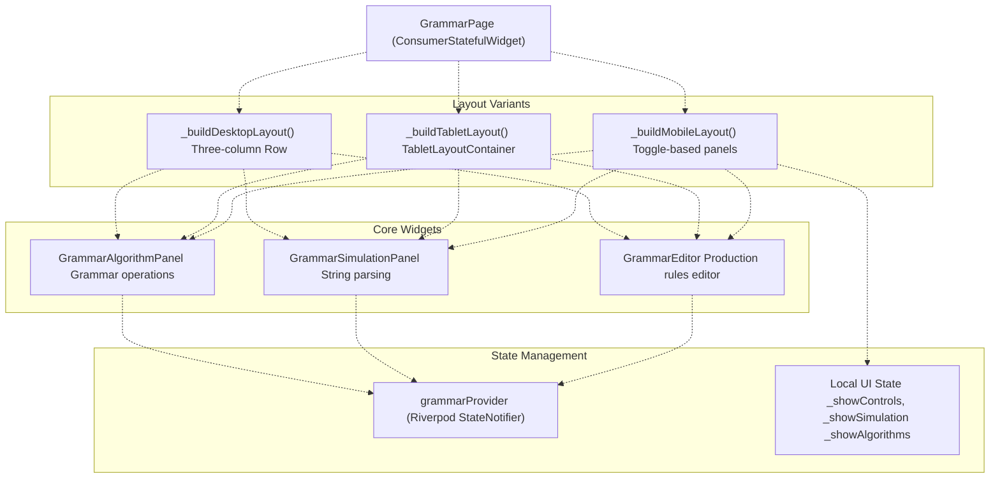

**Sources:** [lib/presentation/pages/grammar_page.dart L1-L203](https://github.com/ThalesMMS/JFlutter/blob/32e808b4/lib/presentation/pages/grammar_page.dart#L1-L203)

 [lib/presentation/widgets/grammar_editor.dart L1-L20](https://github.com/ThalesMMS/JFlutter/blob/32e808b4/lib/presentation/widgets/grammar_editor.dart#L1-L20)

---

## Responsive Layout System

The Grammar Page implements three distinct layout strategies based on viewport width, using the same breakpoints as other workspace pages.

### Layout Breakpoints and Strategies

| Breakpoint | Width Range | Layout Strategy | Component |
| --- | --- | --- | --- |
| Mobile | < 1024px | Single column with collapsible panels | `_buildMobileLayout()` |
| Tablet | 1024-1400px | Canvas + tabbed sidebar | `TabletLayoutContainer` |
| Desktop | ≥ 1400px | Three-column side-by-side | `_buildDesktopLayout()` |

### Mobile Layout (< 1024px)

The mobile layout uses a vertical column with toggle buttons that control panel visibility. This allows users to focus on one aspect at a time while conserving screen space.

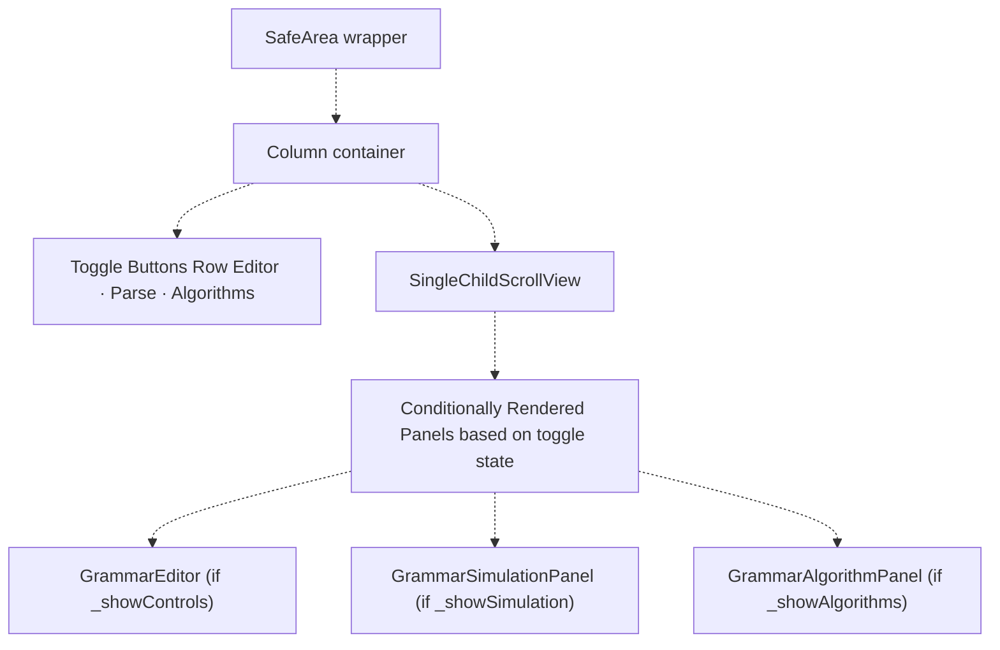

**Implementation Details:**

* Toggle buttons at top: "Editor", "Parse", "Algorithms" ([lib/presentation/pages/grammar_page.dart L51-L85](https://github.com/ThalesMMS/JFlutter/blob/32e808b4/lib/presentation/pages/grammar_page.dart#L51-L85) )
* Each button updates local boolean state (`_showControls`, `_showSimulation`, `_showAlgorithms`)
* Panels render conditionally based on state ([lib/presentation/pages/grammar_page.dart L95-L101](https://github.com/ThalesMMS/JFlutter/blob/32e808b4/lib/presentation/pages/grammar_page.dart#L95-L101) )
* `SingleChildScrollView` wraps all content for vertical scrolling ([lib/presentation/pages/grammar_page.dart L89-L104](https://github.com/ThalesMMS/JFlutter/blob/32e808b4/lib/presentation/pages/grammar_page.dart#L89-L104) )

**Sources:** [lib/presentation/pages/grammar_page.dart L46-L109](https://github.com/ThalesMMS/JFlutter/blob/32e808b4/lib/presentation/pages/grammar_page.dart#L46-L109)

### Tablet Layout (1024-1400px)

The tablet layout uses `TabletLayoutContainer`, providing a collapsible sidebar with tabs. The main content area (grammar editor) occupies the left side, while simulation and algorithm panels are accessible via tabs on the right.

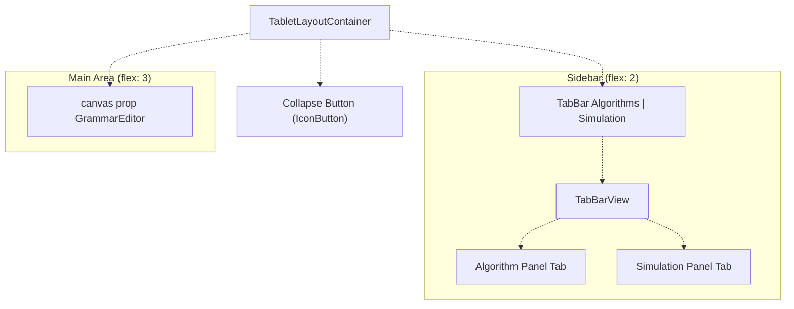

**Key Features:**

* Sidebar can be collapsed via `IconButton` ([lib/presentation/widgets/tablet_layout_container.dart L137-L149](https://github.com/ThalesMMS/JFlutter/blob/32e808b4/lib/presentation/widgets/tablet_layout_container.dart#L137-L149) )
* Tabs use Material 3 `TabBar` and `TabBarView` ([lib/presentation/widgets/tablet_layout_container.dart L72-L114](https://github.com/ThalesMMS/JFlutter/blob/32e808b4/lib/presentation/widgets/tablet_layout_container.dart#L72-L114) )
* Custom tab titles supported via `algorithmTabTitle` and `simulationTabTitle` props ([lib/presentation/widgets/tablet_layout_container.dart L8-L10](https://github.com/ThalesMMS/JFlutter/blob/32e808b4/lib/presentation/widgets/tablet_layout_container.dart#L8-L10) )
* Grammar Page uses default titles "Algorithms" and "Simulation" ([lib/presentation/pages/grammar_page.dart L196-L202](https://github.com/ThalesMMS/JFlutter/blob/32e808b4/lib/presentation/pages/grammar_page.dart#L196-L202) )

**Sources:** [lib/presentation/pages/grammar_page.dart L196-L202](https://github.com/ThalesMMS/JFlutter/blob/32e808b4/lib/presentation/pages/grammar_page.dart#L196-L202)

 [lib/presentation/widgets/tablet_layout_container.dart L1-L153](https://github.com/ThalesMMS/JFlutter/blob/32e808b4/lib/presentation/widgets/tablet_layout_container.dart#L1-L153)

### Desktop Layout (≥ 1400px)

The desktop layout provides maximum screen real estate with a three-column `Row` layout. All panels are visible simultaneously without tabs or collapse controls.

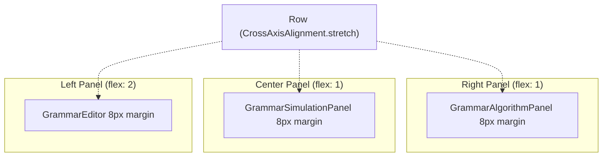

**Layout Configuration:**

* Editor panel: `flex: 2` (largest area for production rule editing)
* Simulation panel: `flex: 1` (center column)
* Algorithm panel: `flex: 1` (right column)
* 8px margin on all panels, 16px spacing between columns ([lib/presentation/pages/grammar_page.dart L111-L141](https://github.com/ThalesMMS/JFlutter/blob/32e808b4/lib/presentation/pages/grammar_page.dart#L111-L141) )

**Sources:** [lib/presentation/pages/grammar_page.dart L111-L141](https://github.com/ThalesMMS/JFlutter/blob/32e808b4/lib/presentation/pages/grammar_page.dart#L111-L141)

---

## Grammar Editor Component

The `GrammarEditor` widget provides the primary interface for defining and managing context-free grammars. It handles production rule CRUD operations, start symbol configuration, and grammar metadata.

### Grammar Editor Structure

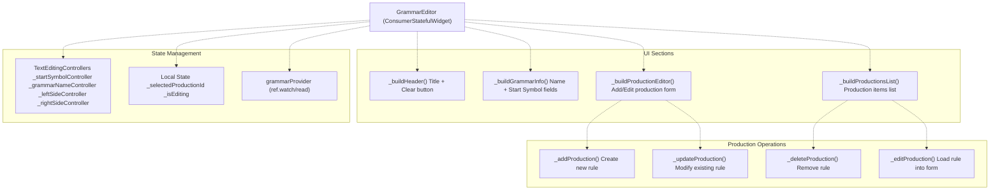

**Sources:** [lib/presentation/widgets/grammar_editor.dart L20-L648](https://github.com/ThalesMMS/JFlutter/blob/32e808b4/lib/presentation/widgets/grammar_editor.dart#L20-L648)

### Production Rule Management

Production rules follow the standard CFG notation: `A → αBβ` where `A` is a non-terminal and `αBβ` is a string of terminals and non-terminals.

#### Production Data Flow

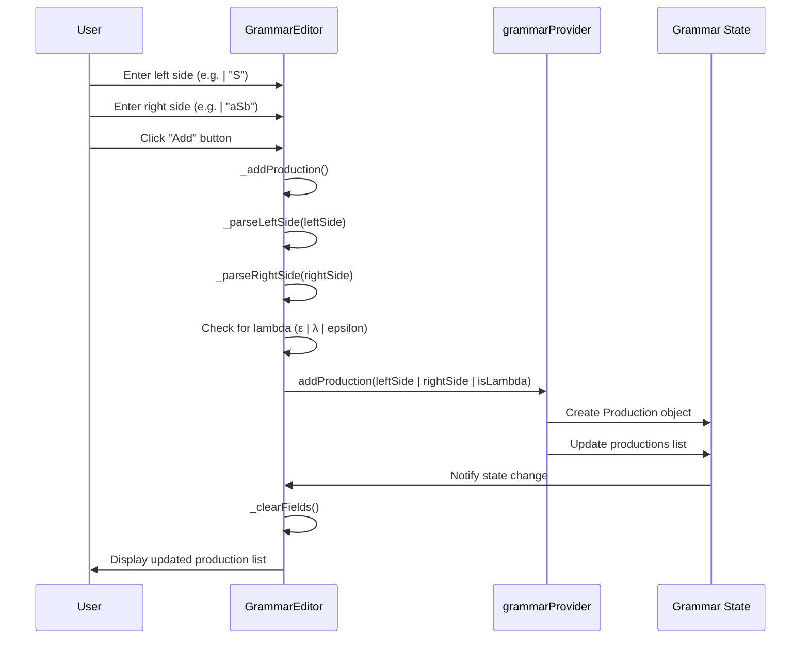

**Key Implementation Details:**

1. **Input Parsing** ([lib/presentation/widgets/grammar_editor.dart L523-L537](https://github.com/ThalesMMS/JFlutter/blob/32e808b4/lib/presentation/widgets/grammar_editor.dart#L523-L537) ): * `_parseLeftSide()`: Splits input into symbols, validates non-terminal * `_parseRightSide()`: Splits production into symbol sequence * Lambda detection: Checks for `ε`, `λ`, or `epsilon` ([lib/presentation/widgets/grammar_editor.dart L535-L537](https://github.com/ThalesMMS/JFlutter/blob/32e808b4/lib/presentation/widgets/grammar_editor.dart#L535-L537) )
2. **Lambda Productions** ([lib/presentation/widgets/grammar_editor.dart L535-L537](https://github.com/ThalesMMS/JFlutter/blob/32e808b4/lib/presentation/widgets/grammar_editor.dart#L535-L537) ): * Represented internally as empty right side (`[]`) * Display format: Shows `ε` symbol in UI ([lib/presentation/widgets/grammar_editor.dart L630-L635](https://github.com/ThalesMMS/JFlutter/blob/32e808b4/lib/presentation/widgets/grammar_editor.dart#L630-L635) )
3. **Production CRUD** ([lib/presentation/widgets/grammar_editor.dart L515-L622](https://github.com/ThalesMMS/JFlutter/blob/32e808b4/lib/presentation/widgets/grammar_editor.dart#L515-L622) ): * Create: `_addProduction()` validates and adds new rule * Read: `_buildProductionsList()` displays all productions * Update: `_updateProduction()` modifies selected rule * Delete: `_deleteProduction()` removes rule by ID

**Sources:** [lib/presentation/widgets/grammar_editor.dart L515-L648](https://github.com/ThalesMMS/JFlutter/blob/32e808b4/lib/presentation/widgets/grammar_editor.dart#L515-L648)

### Grammar Metadata Fields

The editor provides input fields for grammar-level metadata:

| Field | Controller | Purpose | Validation |
| --- | --- | --- | --- |
| Grammar Name | `_grammarNameController` | Human-readable identifier | None (optional) |
| Start Symbol | `_startSymbolController` | Initial non-terminal | Must be valid symbol |

Both fields synchronize with `grammarProvider` on change via `onChanged` callbacks ([lib/presentation/widgets/grammar_editor.dart L167-L181](https://github.com/ThalesMMS/JFlutter/blob/32e808b4/lib/presentation/widgets/grammar_editor.dart#L167-L181)

).

**Sources:** [lib/presentation/widgets/grammar_editor.dart L142-L224](https://github.com/ThalesMMS/JFlutter/blob/32e808b4/lib/presentation/widgets/grammar_editor.dart#L142-L224)

### Responsive Editor Layout

The editor adapts its internal layout based on available width using `LayoutBuilder`:

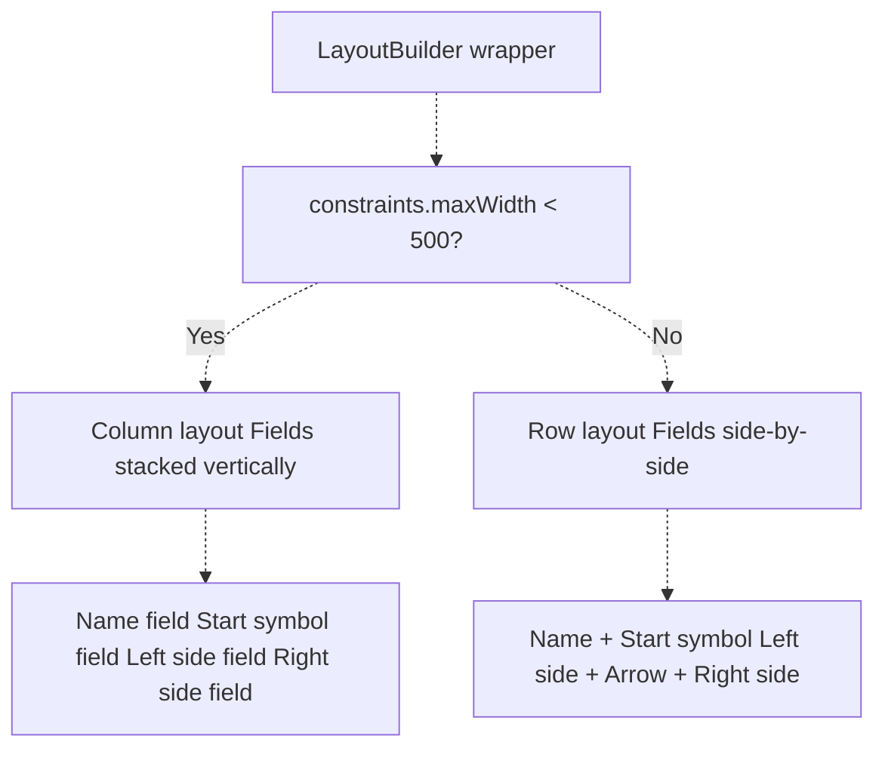

**Breakpoint Details:**

* Small screen (< 500px): Vertical stacking ([lib/presentation/widgets/grammar_editor.dart L162-L188](https://github.com/ThalesMMS/JFlutter/blob/32e808b4/lib/presentation/widgets/grammar_editor.dart#L162-L188) )
* Regular screen (≥ 500px): Horizontal rows ([lib/presentation/widgets/grammar_editor.dart L191-L219](https://github.com/ThalesMMS/JFlutter/blob/32e808b4/lib/presentation/widgets/grammar_editor.dart#L191-L219) )
* Production editor arrows change: downward (↓) on small, forward (→) on regular ([lib/presentation/widgets/grammar_editor.dart L260-L263](https://github.com/ThalesMMS/JFlutter/blob/32e808b4/lib/presentation/widgets/grammar_editor.dart#L260-L263)  [lib/presentation/widgets/grammar_editor.dart L290-L293](https://github.com/ThalesMMS/JFlutter/blob/32e808b4/lib/presentation/widgets/grammar_editor.dart#L290-L293) )

**Sources:** [lib/presentation/widgets/grammar_editor.dart L159-L308](https://github.com/ThalesMMS/JFlutter/blob/32e808b4/lib/presentation/widgets/grammar_editor.dart#L159-L308)

---

## Grammar Simulation Panel

The `GrammarSimulationPanel` provides string parsing functionality, allowing users to test whether input strings belong to the language defined by the grammar.

### Simulation Panel Architecture

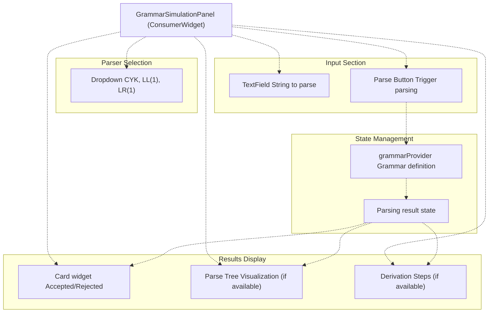

**Note:** The actual implementation details of `GrammarSimulationPanel` are not fully visible in the provided files, but it follows the standard pattern of other simulation panels in the codebase.

**Sources:** [lib/presentation/pages/grammar_page.dart L15](https://github.com/ThalesMMS/JFlutter/blob/32e808b4/lib/presentation/pages/grammar_page.dart#L15-L15)

 [lib/presentation/widgets/grammar_simulation_panel.dart](https://github.com/ThalesMMS/JFlutter/blob/32e808b4/lib/presentation/widgets/grammar_simulation_panel.dart)

 (referenced but not provided)

---

## Grammar Algorithm Panel

The `GrammarAlgorithmPanel` provides operations for grammar analysis and transformation, including conversions to/from automata, grammar simplification, and first/follow set computation.

### Algorithm Panel Operations

```mermaid
flowchart TD

AlgoPanel["GrammarAlgorithmPanel (ConsumerWidget)"]
ToFSA["Grammar → FSA Regular grammar conversion"]
FromFSA["FSA → Grammar Automaton to grammar"]
FirstFollow["First/Follow Sets LL parser preparation"]
Nullable["Nullable Analysis Lambda production detection"]
ChomskyNF["Chomsky Normal Form Grammar normalization"]
RemoveEpsilon["Remove ε-productions"]
RemoveUnit["Remove unit productions"]
RemoveUseless["Remove useless symbols"]
Validate["Validate Grammar Check well-formedness"]
AutoLayout["Auto-arrange (N/A for grammars)"]
Clear["Clear Grammar Reset to empty"]

AlgoPanel -.-> ToFSA
AlgoPanel -.-> FromFSA
AlgoPanel -.-> FirstFollow
AlgoPanel -.-> Nullable
AlgoPanel -.-> ChomskyNF
AlgoPanel -.-> RemoveEpsilon
AlgoPanel -.-> RemoveUnit
AlgoPanel -.-> RemoveUseless
AlgoPanel -.-> Validate
AlgoPanel -.-> AutoLayout
AlgoPanel -.-> Clear

subgraph subGraph3 ["Utility Operations"]
    Validate
    AutoLayout
    Clear
end

subgraph Simplification ["Simplification"]
    RemoveEpsilon
    RemoveUnit
    RemoveUseless
end

subgraph subGraph1 ["Analysis Operations"]
    FirstFollow
    Nullable
    ChomskyNF
end

subgraph subGraph0 ["Conversion Operations"]
    ToFSA
    FromFSA
end
```

**Key Algorithm Services:**

* `GrammarAnalyzer`: Computes first/follow sets, nullable non-terminals ([referenced from system diagrams](https://github.com/ThalesMMS/JFlutter/blob/32e808b4/referenced%20from%20system%20diagrams) )
* `FSAToGrammarConverter`: Converts finite automata to regular grammars ([lib/presentation/pages/fsa_page.dart L331](https://github.com/ThalesMMS/JFlutter/blob/32e808b4/lib/presentation/pages/fsa_page.dart#L331-L331) )
* Grammar simplification algorithms for CFG transformations ([referenced from system diagrams](https://github.com/ThalesMMS/JFlutter/blob/32e808b4/referenced%20from%20system%20diagrams) )

**Sources:** [lib/presentation/pages/grammar_page.dart L16](https://github.com/ThalesMMS/JFlutter/blob/32e808b4/lib/presentation/pages/grammar_page.dart#L16-L16)

 [lib/presentation/widgets/grammar_algorithm_panel.dart](https://github.com/ThalesMMS/JFlutter/blob/32e808b4/lib/presentation/widgets/grammar_algorithm_panel.dart)

 (referenced but not provided)

---

## State Management Integration

The Grammar Page integrates with Riverpod state management through `grammarProvider`, which maintains the current grammar state across all components.

### Grammar Provider Structure

```mermaid
flowchart TD

GrammarProvider["grammarProvider (StateNotifierProvider)"]
Name["name: String Grammar identifier"]
StartSymbol["startSymbol: String Initial non-terminal"]
Productions["productions: List Rule set"]
Error["error: String? Validation errors"]
UpdateName["updateName(String)"]
UpdateStart["updateStartSymbol(String)"]
AddProd["addProduction(...)"]
UpdateProd["updateProduction(...)"]
DeleteProd["deleteProduction(String)"]
Clear["clearGrammar()"]

GrammarProvider -.-> Name
GrammarProvider -.-> StartSymbol
GrammarProvider -.-> Productions
GrammarProvider -.-> Error
GrammarProvider -.-> UpdateName
GrammarProvider -.-> UpdateStart
GrammarProvider -.-> AddProd
GrammarProvider -.-> UpdateProd
GrammarProvider -.-> DeleteProd
GrammarProvider -.-> Clear

subgraph subGraph1 ["Provider Operations"]
    UpdateName
    UpdateStart
    AddProd
    UpdateProd
    DeleteProd
    Clear
end

subgraph subGraph0 ["Grammar State"]
    Name
    StartSymbol
    Productions
    Error
end
```

### Provider Usage Pattern

Components consume the grammar provider using standard Riverpod patterns:

```
// Reading grammar state (reactive)final grammarState = ref.watch(grammarProvider);// Updating grammar state (non-reactive)ref.read(grammarProvider.notifier).addProduction(...);
```

**Implementation References:**

* Grammar state reading: [lib/presentation/widgets/grammar_editor.dart L43-L45](https://github.com/ThalesMMS/JFlutter/blob/32e808b4/lib/presentation/widgets/grammar_editor.dart#L43-L45)  [lib/presentation/widgets/grammar_editor.dart L59](https://github.com/ThalesMMS/JFlutter/blob/32e808b4/lib/presentation/widgets/grammar_editor.dart#L59-L59)
* Grammar state mutation: [lib/presentation/widgets/grammar_editor.dart L167-L170](https://github.com/ThalesMMS/JFlutter/blob/32e808b4/lib/presentation/widgets/grammar_editor.dart#L167-L170)  [lib/presentation/widgets/grammar_editor.dart L539-L545](https://github.com/ThalesMMS/JFlutter/blob/32e808b4/lib/presentation/widgets/grammar_editor.dart#L539-L545)
* Provider override for testing: [test/tablet_layout_test.dart L41-L48](https://github.com/ThalesMMS/JFlutter/blob/32e808b4/test/tablet_layout_test.dart#L41-L48)

**Sources:** [lib/presentation/widgets/grammar_editor.dart L17-L18](https://github.com/ThalesMMS/JFlutter/blob/32e808b4/lib/presentation/widgets/grammar_editor.dart#L17-L18)

 [lib/presentation/providers/grammar_provider.dart](https://github.com/ThalesMMS/JFlutter/blob/32e808b4/lib/presentation/providers/grammar_provider.dart)

 (referenced but not provided), [test/tablet_layout_test.dart L41-L48](https://github.com/ThalesMMS/JFlutter/blob/32e808b4/test/tablet_layout_test.dart#L41-L48)

---

## Navigation and Integration

The Grammar Page is one of six primary workspace pages accessible through the main navigation system.

### Navigation Context

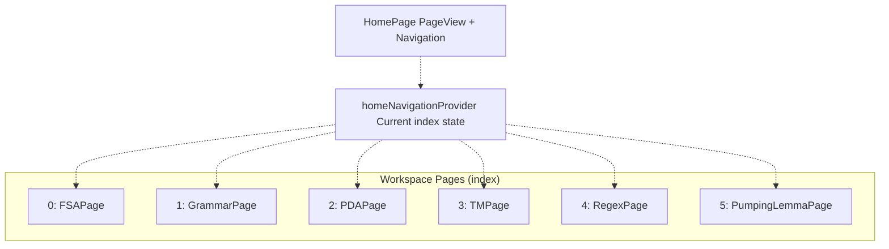

**Navigation Details:**

* Grammar Page index: `1` ([lib/presentation/pages/home_page.dart L139](https://github.com/ThalesMMS/JFlutter/blob/32e808b4/lib/presentation/pages/home_page.dart#L139-L139) )
* Navigation label: "Grammar" ([lib/presentation/pages/home_page.dart L48](https://github.com/ThalesMMS/JFlutter/blob/32e808b4/lib/presentation/pages/home_page.dart#L48-L48) )
* Navigation description: "Context-Free Grammars" ([lib/presentation/pages/home_page.dart L50](https://github.com/ThalesMMS/JFlutter/blob/32e808b4/lib/presentation/pages/home_page.dart#L50-L50) )
* Icon: `Icons.text_fields` ([lib/presentation/pages/home_page.dart L49](https://github.com/ThalesMMS/JFlutter/blob/32e808b4/lib/presentation/pages/home_page.dart#L49-L49) )

**Cross-Page Navigation:**

* FSA → Grammar: Triggered by "FSA to Grammar" algorithm ([lib/presentation/pages/fsa_page.dart L361-L375](https://github.com/ThalesMMS/JFlutter/blob/32e808b4/lib/presentation/pages/fsa_page.dart#L361-L375) )
* Navigation uses `MaterialPageRoute` push ([lib/presentation/pages/fsa_page.dart L372-L374](https://github.com/ThalesMMS/JFlutter/blob/32e808b4/lib/presentation/pages/fsa_page.dart#L372-L374) )

**Sources:** [lib/presentation/pages/home_page.dart L41-L72](https://github.com/ThalesMMS/JFlutter/blob/32e808b4/lib/presentation/pages/home_page.dart#L41-L72)

 [lib/presentation/pages/home_page.dart L133-L145](https://github.com/ThalesMMS/JFlutter/blob/32e808b4/lib/presentation/pages/home_page.dart#L133-L145)

 [lib/presentation/pages/fsa_page.dart L361-L375](https://github.com/ThalesMMS/JFlutter/blob/32e808b4/lib/presentation/pages/fsa_page.dart#L361-L375)

---

## Testing Coverage

The Grammar Page has dedicated integration tests for layout behavior across different screen sizes.

### Tablet Layout Test

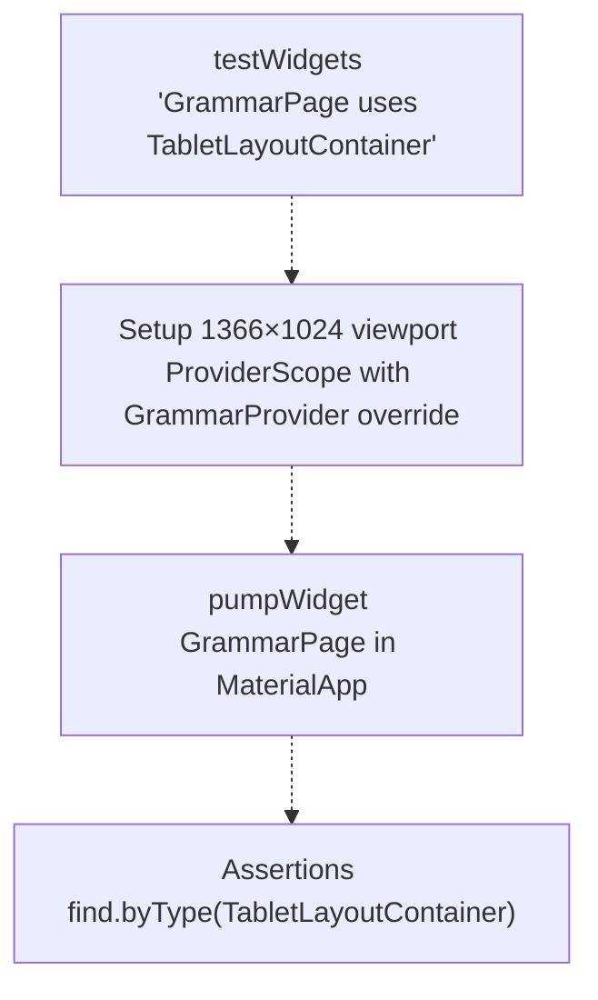

**Test Implementation:**

* Viewport size: 1366×1024 (tablet breakpoint) ([test/tablet_layout_test.dart L37-L38](https://github.com/ThalesMMS/JFlutter/blob/32e808b4/test/tablet_layout_test.dart#L37-L38) )
* Provider override required for `grammarProvider` ([test/tablet_layout_test.dart L41-L48](https://github.com/ThalesMMS/JFlutter/blob/32e808b4/test/tablet_layout_test.dart#L41-L48) )
* Verifies `TabletLayoutContainer` usage ([test/tablet_layout_test.dart L52](https://github.com/ThalesMMS/JFlutter/blob/32e808b4/test/tablet_layout_test.dart#L52-L52) )

**Additional Test Coverage:**

* `TabletLayoutContainer` collapse/expand behavior ([test/tablet_layout_test.dart L87-L122](https://github.com/ThalesMMS/JFlutter/blob/32e808b4/test/tablet_layout_test.dart#L87-L122) )
* Sidebar toggle functionality ([test/tablet_layout_test.dart L107-L121](https://github.com/ThalesMMS/JFlutter/blob/32e808b4/test/tablet_layout_test.dart#L107-L121) )

**Sources:** [test/tablet_layout_test.dart L36-L53](https://github.com/ThalesMMS/JFlutter/blob/32e808b4/test/tablet_layout_test.dart#L36-L53)

 [test/tablet_layout_test.dart L87-L122](https://github.com/ThalesMMS/JFlutter/blob/32e808b4/test/tablet_layout_test.dart#L87-L122)

---

## File Operations and Persistence

Grammar definitions can be saved and loaded through the serialization system, supporting both native JSON format and JFLAP `.cfg` files.

### Grammar Serialization Flow

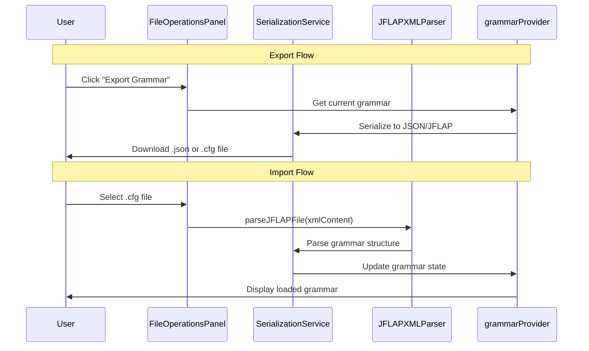

**JFLAP Grammar Format:**

* File extension: `.cfg` (context-free grammar)
* XML structure with `<grammar>` root element
* Production rules encoded in `<production>` elements
* Epsilon normalization via `epsilon_utils` ([lib/core/parsers/jflap_xml_parser.dart L14](https://github.com/ThalesMMS/JFlutter/blob/32e808b4/lib/core/parsers/jflap_xml_parser.dart#L14-L14) )

**Sources:** [lib/core/parsers/jflap_xml_parser.dart L1-L144](https://github.com/ThalesMMS/JFlutter/blob/32e808b4/lib/core/parsers/jflap_xml_parser.dart#L1-L144)

 [lib/core/utils/epsilon_utils.dart](https://github.com/ThalesMMS/JFlutter/blob/32e808b4/lib/core/utils/epsilon_utils.dart)

 (referenced)

---

## Key Differences from Canvas-Based Pages

Unlike FSA, PDA, and TM pages which use graph-based canvas editors, the Grammar Page uses a form-based editor for production rules. This creates several architectural differences:

| Aspect | Canvas Pages (FSA/PDA/TM) | Grammar Page |
| --- | --- | --- |
| Editor Type | `AutomatonGraphViewCanvas` | Form-based `GrammarEditor` |
| Visual Representation | Graph with nodes/edges | Text list of productions |
| User Interaction | Drag, click, gesture-based | Text input, CRUD buttons |
| State Model | Spatial (x, y coordinates) | Sequential (list of rules) |
| Undo/Redo | Canvas history snapshots | Not implemented |
| Highlight System | `SimulationHighlightService` | N/A (no visual graph) |

**No Canvas Controller:**
The Grammar Page does not instantiate any `GraphViewCanvasController` subclass, unlike:

* FSA: `GraphViewCanvasController` ([lib/presentation/pages/fsa_page.dart L41-L56](https://github.com/ThalesMMS/JFlutter/blob/32e808b4/lib/presentation/pages/fsa_page.dart#L41-L56) )
* TM: `GraphViewTmCanvasController` ([lib/presentation/pages/tm_page.dart L64-L68](https://github.com/ThalesMMS/JFlutter/blob/32e808b4/lib/presentation/pages/tm_page.dart#L64-L68) )
* PDA: `GraphViewPdaCanvasController` ([lib/presentation/pages/pda_page.dart L55-L58](https://github.com/ThalesMMS/JFlutter/blob/32e808b4/lib/presentation/pages/pda_page.dart#L55-L58) )

**No Tool Controller:**
The Grammar Page does not use `AutomatonCanvasToolController` for tool selection (add state, add transition, etc.) since there is no canvas interaction model.

**Sources:** [lib/presentation/pages/grammar_page.dart L1-L203](https://github.com/ThalesMMS/JFlutter/blob/32e808b4/lib/presentation/pages/grammar_page.dart#L1-L203)

 [lib/presentation/pages/fsa_page.dart L39-L65](https://github.com/ThalesMMS/JFlutter/blob/32e808b4/lib/presentation/pages/fsa_page.dart#L39-L65)

 [lib/presentation/pages/tm_page.dart L50-L71](https://github.com/ThalesMMS/JFlutter/blob/32e808b4/lib/presentation/pages/tm_page.dart#L50-L71)

 [lib/presentation/pages/pda_page.dart L46-L62](https://github.com/ThalesMMS/JFlutter/blob/32e808b4/lib/presentation/pages/pda_page.dart#L46-L62)

---

## Summary

The Grammar Page provides a form-based workspace for Context-Free Grammar manipulation, complementing the graph-based automata pages. Its key characteristics include:

1. **Responsive Design**: Three layout strategies (mobile toggle panels, tablet sidebar tabs, desktop three-column)
2. **Form-Based Editor**: Production rule CRUD with text input fields rather than visual canvas
3. **Grammar Operations**: Simulation (parsing), algorithms (conversion, analysis, simplification)
4. **State Management**: Riverpod `grammarProvider` for reactive grammar state
5. **JFLAP Compatibility**: Import/export `.cfg` files with epsilon normalization

The page follows JFlutter's consistent workspace pattern while adapting the UI paradigm to the non-spatial nature of grammar representations.

**Sources:** [lib/presentation/pages/grammar_page.dart L1-L203](https://github.com/ThalesMMS/JFlutter/blob/32e808b4/lib/presentation/pages/grammar_page.dart#L1-L203)

 [lib/presentation/widgets/grammar_editor.dart L1-L648](https://github.com/ThalesMMS/JFlutter/blob/32e808b4/lib/presentation/widgets/grammar_editor.dart#L1-L648)


### On this page

* [Grammar Page](#5.4-grammar-page)
* [Page Architecture](#5.4-page-architecture)
* [Grammar Page Component Structure](#5.4-grammar-page-component-structure)
* [Responsive Layout System](#5.4-responsive-layout-system)
* [Layout Breakpoints and Strategies](#5.4-layout-breakpoints-and-strategies)
* [Mobile Layout (< 1024px)](#5.4-mobile-layout-1024px)
* [Tablet Layout (1024-1400px)](#5.4-tablet-layout-1024-1400px)
* [Desktop Layout (≥ 1400px)](#5.4-desktop-layout-1400px)
* [Grammar Editor Component](#5.4-grammar-editor-component)
* [Grammar Editor Structure](#5.4-grammar-editor-structure)
* [Production Rule Management](#5.4-production-rule-management)
* [Grammar Metadata Fields](#5.4-grammar-metadata-fields)
* [Responsive Editor Layout](#5.4-responsive-editor-layout)
* [Grammar Simulation Panel](#5.4-grammar-simulation-panel)
* [Simulation Panel Architecture](#5.4-simulation-panel-architecture)
* [Grammar Algorithm Panel](#5.4-grammar-algorithm-panel)
* [Algorithm Panel Operations](#5.4-algorithm-panel-operations)
* [State Management Integration](#5.4-state-management-integration)
* [Grammar Provider Structure](#5.4-grammar-provider-structure)
* [Provider Usage Pattern](#5.4-provider-usage-pattern)
* [Navigation and Integration](#5.4-navigation-and-integration)
* [Navigation Context](#5.4-navigation-context)
* [Testing Coverage](#5.4-testing-coverage)
* [Tablet Layout Test](#5.4-tablet-layout-test)
* [File Operations and Persistence](#5.4-file-operations-and-persistence)
* [Grammar Serialization Flow](#5.4-grammar-serialization-flow)
* [Key Differences from Canvas-Based Pages](#5.4-key-differences-from-canvas-based-pages)
* [Summary](#5.4-summary)

Ask Devin about JFlutter