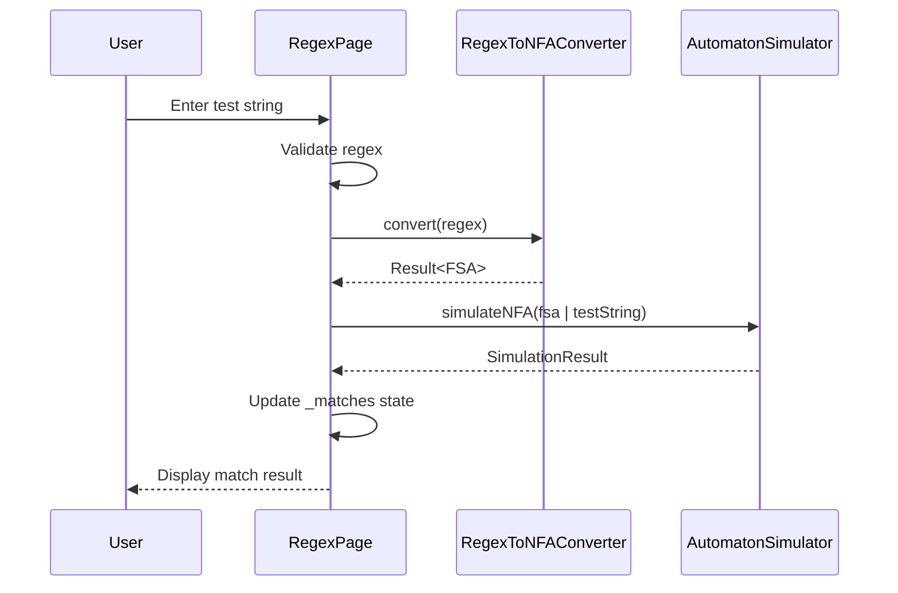
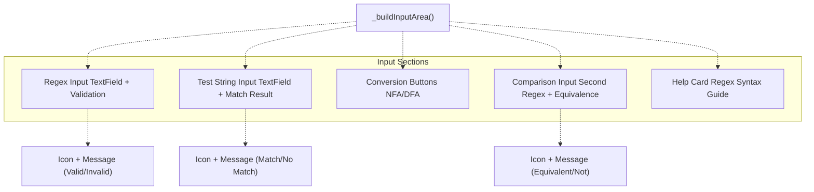
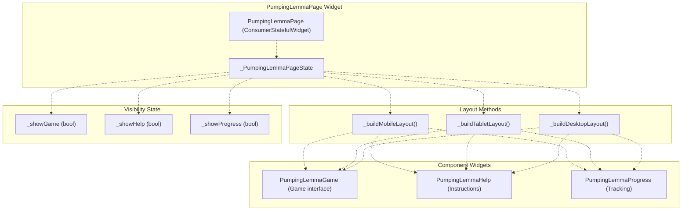
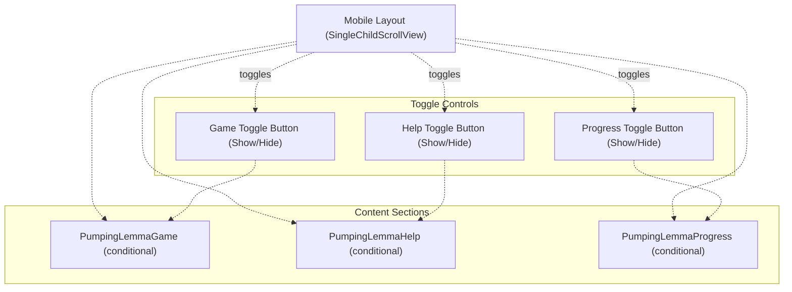
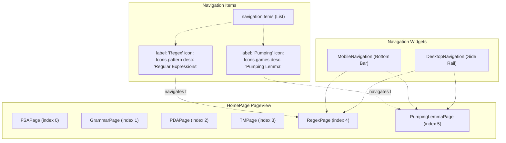
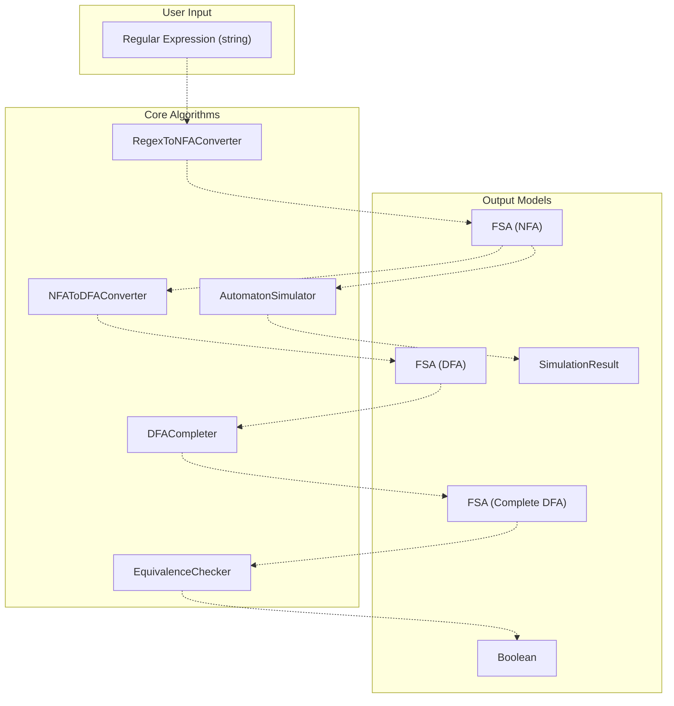
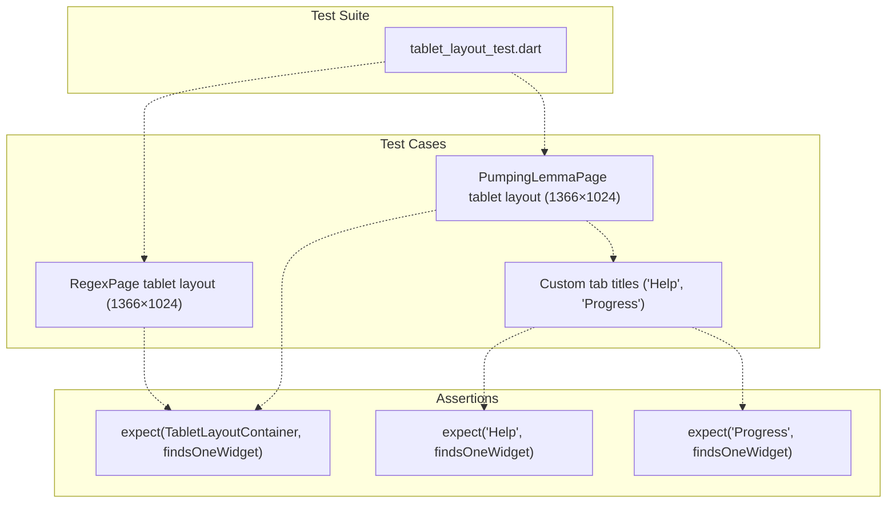

# Regex and Pumping Lemma Pages

> **Relevant source files**
> * [lib/core/parsers/jflap_xml_parser.dart](https://github.com/ThalesMMS/JFlutter/blob/32e808b4/lib/core/parsers/jflap_xml_parser.dart)
> * [lib/core/services/trace_persistence_service_stub.dart](https://github.com/ThalesMMS/JFlutter/blob/32e808b4/lib/core/services/trace_persistence_service_stub.dart)
> * [lib/presentation/pages/fsa_page.dart](https://github.com/ThalesMMS/JFlutter/blob/32e808b4/lib/presentation/pages/fsa_page.dart)
> * [lib/presentation/pages/grammar_page.dart](https://github.com/ThalesMMS/JFlutter/blob/32e808b4/lib/presentation/pages/grammar_page.dart)
> * [lib/presentation/pages/home_page.dart](https://github.com/ThalesMMS/JFlutter/blob/32e808b4/lib/presentation/pages/home_page.dart)
> * [lib/presentation/pages/pda_page.dart](https://github.com/ThalesMMS/JFlutter/blob/32e808b4/lib/presentation/pages/pda_page.dart)
> * [lib/presentation/pages/pumping_lemma_page.dart](https://github.com/ThalesMMS/JFlutter/blob/32e808b4/lib/presentation/pages/pumping_lemma_page.dart)
> * [lib/presentation/pages/regex_page.dart](https://github.com/ThalesMMS/JFlutter/blob/32e808b4/lib/presentation/pages/regex_page.dart)
> * [lib/presentation/pages/tm_page.dart](https://github.com/ThalesMMS/JFlutter/blob/32e808b4/lib/presentation/pages/tm_page.dart)
> * [lib/presentation/theme/app_theme.dart](https://github.com/ThalesMMS/JFlutter/blob/32e808b4/lib/presentation/theme/app_theme.dart)
> * [lib/presentation/widgets/desktop_navigation.dart](https://github.com/ThalesMMS/JFlutter/blob/32e808b4/lib/presentation/widgets/desktop_navigation.dart)
> * [lib/presentation/widgets/grammar_editor.dart](https://github.com/ThalesMMS/JFlutter/blob/32e808b4/lib/presentation/widgets/grammar_editor.dart)
> * [lib/presentation/widgets/tablet_layout_container.dart](https://github.com/ThalesMMS/JFlutter/blob/32e808b4/lib/presentation/widgets/tablet_layout_container.dart)
> * [test/tablet_layout_test.dart](https://github.com/ThalesMMS/JFlutter/blob/32e808b4/test/tablet_layout_test.dart)
> * [test/widget/presentation/home_page_test.dart](https://github.com/ThalesMMS/JFlutter/blob/32e808b4/test/widget/presentation/home_page_test.dart)

This document describes the implementation of two educational workspace pages: the Regular Expression testing and conversion workspace (`RegexPage`) and the Pumping Lemma interactive learning game (`PumpingLemmaPage`). Both pages implement responsive layout strategies and integrate with the application's navigation system.

For information about other workspace pages (FSA, PDA, TM, Grammar), see [Automaton Workspace Pages](5%20Automaton-Workspace-Pages.md). For details on the responsive layout system used by both pages, see [Responsive Layout System](8b%20Responsive-Layout-System.md).

---

## Overview

The Regex and Pumping Lemma pages serve distinct educational purposes while sharing common architectural patterns:

| Page | Primary Purpose | Key Features |
| --- | --- | --- |
| `RegexPage` | Test and convert regular expressions | Regex validation, string matching, NFA/DFA conversion, equivalence checking |
| `PumpingLemmaPage` | Interactive Pumping Lemma learning | Game interface, instructional help, progress tracking |

Both pages implement three-tier responsive layouts (mobile, tablet, desktop) and use the `TabletLayoutContainer` widget for intermediate screen sizes.

**Sources:** [lib/presentation/pages/regex_page.dart L1-L30](https://github.com/ThalesMMS/JFlutter/blob/32e808b4/lib/presentation/pages/regex_page.dart#L1-L30)

 [lib/presentation/pages/pumping_lemma_page.dart L1-L25](https://github.com/ThalesMMS/JFlutter/blob/32e808b4/lib/presentation/pages/pumping_lemma_page.dart#L1-L25)

---

## RegexPage Architecture

### Page Structure



```mermaid
flowchart TD

RegexPage["RegexPage (ConsumerStatefulWidget)"]
State["_RegexPageState"]
RegexController["_regexController (TextEditingController)"]
TestController["_testStringController"]
CompareController["_comparisonRegexController"]
ValidationState["_isValid, _matches, _errorMessage"]
EquivState["_equivalenceResult, _equivalenceMessage"]
BuildMobile["_buildMobileLayout()"]
BuildTablet["_buildTabletLayout()"]
BuildDesktop["_buildDesktopLayout()"]
BuildInput["_buildInputArea()"]
ValidateRegex["_validateRegex()"]
TestMatch["_testStringMatch()"]
ConvertNFA["_convertToNFA()"]
ConvertDFA["_convertToDFA()"]
CompareEquiv["_compareRegexEquivalence()"]
RegexToNFAConv["RegexToNFAConverter.convert()"]
NFAToDFAConv["NFAToDFAConverter.convert()"]
DFAComp["DFACompleter.complete()"]
AutoSim["AutomatonSimulator.simulateNFA()"]
EquivCheck["EquivalenceChecker.areEquivalent()"]
AutoProv["automatonProvider"]
PushAutomaton["_pushAutomatonToProvider()"]

State -.-> RegexController
State -.-> TestController
State -.-> CompareController
State -.-> ValidationState
State -.-> EquivState
State -.-> BuildMobile
State -.-> BuildTablet
State -.-> BuildDesktop
State -.-> ValidateRegex
State -.-> TestMatch
State -.-> ConvertNFA
State -.-> ConvertDFA
State -.-> CompareEquiv
ValidateRegex -.-> RegexToNFAConv
TestMatch -.-> RegexToNFAConv
TestMatch -.-> AutoSim
ConvertNFA -.-> RegexToNFAConv
ConvertDFA -.-> RegexToNFAConv
ConvertDFA -.-> NFAToDFAConv
ConvertDFA -.-> DFAComp
CompareEquiv -.-> RegexToNFAConv
CompareEquiv -.-> NFAToDFAConv
CompareEquiv -.-> DFAComp
CompareEquiv -.-> EquivCheck
ConvertNFA -.-> PushAutomaton
ConvertDFA -.-> PushAutomaton

subgraph subGraph5 ["Provider Integration"]
    AutoProv
    PushAutomaton
    PushAutomaton -.-> AutoProv
end

subgraph subGraph4 ["Algorithm Integration"]
    RegexToNFAConv
    NFAToDFAConv
    DFAComp
    AutoSim
    EquivCheck
end

subgraph subGraph3 ["Core Operations"]
    ValidateRegex
    TestMatch
    ConvertNFA
    ConvertDFA
    CompareEquiv
end

subgraph subGraph2 ["Layout Methods"]
    BuildMobile
    BuildTablet
    BuildDesktop
    BuildInput
    BuildMobile -.-> BuildInput
    BuildTablet -.-> BuildInput
    BuildDesktop -.-> BuildInput
end

subgraph subGraph1 ["State Management"]
    RegexController
    TestController
    CompareController
    ValidationState
    EquivState
end

subgraph subGraph0 ["RegexPage Widget"]
    RegexPage
    State
    RegexPage -.-> State
end
```

**Diagram: RegexPage component architecture and algorithm integration**

**Sources:** [lib/presentation/pages/regex_page.dart L26-L340](https://github.com/ThalesMMS/JFlutter/blob/32e808b4/lib/presentation/pages/regex_page.dart#L26-L340)

### State Management

The `RegexPage` maintains local state using three `TextEditingController` instances and validation flags:

| Controller | Purpose | Line Reference |
| --- | --- | --- |
| `_regexController` | Primary regex input | [lib/presentation/pages/regex_page.dart L35](https://github.com/ThalesMMS/JFlutter/blob/32e808b4/lib/presentation/pages/regex_page.dart#L35-L35) |
| `_testStringController` | Test string input for matching | [lib/presentation/pages/regex_page.dart L36](https://github.com/ThalesMMS/JFlutter/blob/32e808b4/lib/presentation/pages/regex_page.dart#L36-L36) |
| `_comparisonRegexController` | Secondary regex for equivalence checking | [lib/presentation/pages/regex_page.dart L37-L38](https://github.com/ThalesMMS/JFlutter/blob/32e808b4/lib/presentation/pages/regex_page.dart#L37-L38) |

Validation state variables:

* `_currentRegex`: Current regex string
* `_isValid`: Boolean indicating if regex syntax is valid
* `_matches`: Boolean indicating if test string matches regex
* `_errorMessage`: Error message for validation failures
* `_equivalenceResult`: Nullable boolean for equivalence check result
* `_equivalenceMessage`: Message describing equivalence check result

**Sources:** [lib/presentation/pages/regex_page.dart L35-L45](https://github.com/ThalesMMS/JFlutter/blob/32e808b4/lib/presentation/pages/regex_page.dart#L35-L45)

### Core Operations

#### Regex Validation

The `_validateRegex()` method performs basic syntax checking for balanced parentheses and bracket pairs:

```
Validation Logic:
1. Check for empty regex
2. Track parenthesis and bracket balance
3. Handle escape sequences
4. Set _isValid and _errorMessage accordingly
```

The implementation uses a simple state machine to track nested structures:

**Sources:** [lib/presentation/pages/regex_page.dart L55-L78](https://github.com/ThalesMMS/JFlutter/blob/32e808b4/lib/presentation/pages/regex_page.dart#L55-L78)

 [lib/presentation/pages/regex_page.dart L80-L122](https://github.com/ThalesMMS/JFlutter/blob/32e808b4/lib/presentation/pages/regex_page.dart#L80-L122)

#### String Matching

The `_testStringMatch()` method converts the regex to an NFA and simulates execution:



**Diagram: String matching flow through regex conversion and simulation**

**Sources:** [lib/presentation/pages/regex_page.dart L124-L173](https://github.com/ThalesMMS/JFlutter/blob/32e808b4/lib/presentation/pages/regex_page.dart#L124-L173)

#### Automaton Conversion

Two conversion methods push results to `automatonProvider`:

1. **`_convertToNFA()`** - Converts regex to NFA, pushes to provider, shows snackbar
2. **`_convertToDFA()`** - Converts regex → NFA → DFA → Complete DFA, navigates to `FSAPage`

Both methods use the `_pushAutomatonToProvider()` helper to update the active automaton:

**Sources:** [lib/presentation/pages/regex_page.dart L175-L256](https://github.com/ThalesMMS/JFlutter/blob/32e808b4/lib/presentation/pages/regex_page.dart#L175-L256)

 [lib/presentation/pages/regex_page.dart L258-L260](https://github.com/ThalesMMS/JFlutter/blob/32e808b4/lib/presentation/pages/regex_page.dart#L258-L260)

#### Equivalence Checking

The `_compareRegexEquivalence()` method checks if two regexes accept the same language:

```
Equivalence Check Algorithm:
1. Convert both regexes to NFAs
2. Convert both NFAs to DFAs
3. Complete both DFAs (add trap states)
4. Run EquivalenceChecker.areEquivalent()
5. Display result
```

**Sources:** [lib/presentation/pages/regex_page.dart L262-L340](https://github.com/ThalesMMS/JFlutter/blob/32e808b4/lib/presentation/pages/regex_page.dart#L262-L340)

### Responsive Layout Implementation

The `RegexPage` implements three layout strategies based on screen width:

| Layout | Width Range | Method | Structure |
| --- | --- | --- | --- |
| Mobile | < 768px | `_buildMobileLayout()` | Single scrolling column |
| Tablet | 768-1400px | `_buildTabletLayout()` | `TabletLayoutContainer` with tabs |
| Desktop | ≥ 1400px | `_buildDesktopLayout()` | Two-column row (input + panels) |

**Mobile Layout:**

* Single scrollable column containing all sections
* Input area, validation status, test results, conversion buttons, equivalence checker, and help section arranged vertically

**Tablet Layout:**

* Uses `TabletLayoutContainer` with collapsible sidebar
* Input area in main canvas
* Algorithm and simulation panels in tabbed sidebar

**Desktop Layout:**

* Two-column row layout
* Left column (flex: 2): Input area via `_buildInputArea()`
* Right column (flex: 1): Algorithm and simulation panels stacked vertically

**Sources:** [lib/presentation/pages/regex_page.dart L342-L354](https://github.com/ThalesMMS/JFlutter/blob/32e808b4/lib/presentation/pages/regex_page.dart#L342-L354)

 [lib/presentation/pages/regex_page.dart L357-L605](https://github.com/ThalesMMS/JFlutter/blob/32e808b4/lib/presentation/pages/regex_page.dart#L357-L605)

 [lib/presentation/pages/regex_page.dart L607-L681](https://github.com/ThalesMMS/JFlutter/blob/32e808b4/lib/presentation/pages/regex_page.dart#L607-L681)

 [lib/presentation/pages/regex_page.dart L683-L709](https://github.com/ThalesMMS/JFlutter/blob/32e808b4/lib/presentation/pages/regex_page.dart#L683-L709)

### Input Area Widget

The `_buildInputArea()` method constructs the common input interface used across layouts:



**Diagram: Structure of the shared input area widget**

Each section provides real-time feedback with icons and colored status messages (green for success, red for errors, orange for warnings).

**Sources:** [lib/presentation/pages/regex_page.dart L711-L1072](https://github.com/ThalesMMS/JFlutter/blob/32e808b4/lib/presentation/pages/regex_page.dart#L711-L1072)

---

## PumpingLemmaPage Architecture

### Page Structure



**Diagram: PumpingLemmaPage component structure and layout delegation**

**Sources:** [lib/presentation/pages/pumping_lemma_page.dart L19-L169](https://github.com/ThalesMMS/JFlutter/blob/32e808b4/lib/presentation/pages/pumping_lemma_page.dart#L19-L169)

### Component Widgets

The page delegates content to three specialized widgets:

| Widget | Purpose | Usage |
| --- | --- | --- |
| `PumpingLemmaGame` | Interactive game interface | Main content area |
| `PumpingLemmaHelp` | Educational material and instructions | Side panel or collapsible section |
| `PumpingLemmaProgress` | User progress tracking and statistics | Side panel or collapsible section |

These widgets are referenced in the layout methods but implemented elsewhere in the codebase.

**Sources:** [lib/presentation/pages/pumping_lemma_page.dart L14-L16](https://github.com/ThalesMMS/JFlutter/blob/32e808b4/lib/presentation/pages/pumping_lemma_page.dart#L14-L16)

### Responsive Layout Implementation

The `PumpingLemmaPage` implements three layout strategies with different panel organizations:

#### Mobile Layout (< 1024px)

The mobile layout provides collapsible sections with toggle buttons:



**Diagram: Mobile layout with collapsible sections**

The toggle buttons use `setState()` to update visibility flags (`_showGame`, `_showHelp`, `_showProgress`). Each section is wrapped in a conditional rendering block and displayed within a margin container.

**Sources:** [lib/presentation/pages/pumping_lemma_page.dart L56-L135](https://github.com/ThalesMMS/JFlutter/blob/32e808b4/lib/presentation/pages/pumping_lemma_page.dart#L56-L135)

#### Tablet Layout (1024-1400px)

The tablet layout uses `TabletLayoutContainer` with custom tab titles:

```
TabletLayoutContainer(  canvas: const PumpingLemmaGame(),  algorithmPanel: const PumpingLemmaHelp(),  simulationPanel: const PumpingLemmaProgress(),  algorithmTabTitle: 'Help',  simulationTabTitle: 'Progress',)
```

This configuration:

* Places the game in the main canvas area
* Places help and progress in tabbed sidebar panels
* Overrides default tab titles to "Help" and "Progress" (instead of "Algorithms" and "Simulation")

**Sources:** [lib/presentation/pages/pumping_lemma_page.dart L46-L54](https://github.com/ThalesMMS/JFlutter/blob/32e808b4/lib/presentation/pages/pumping_lemma_page.dart#L46-L54)

 [lib/presentation/widgets/tablet_layout_container.dart L8-L21](https://github.com/ThalesMMS/JFlutter/blob/32e808b4/lib/presentation/widgets/tablet_layout_container.dart#L8-L21)

#### Desktop Layout (≥ 1400px)

The desktop layout arranges all three components in a horizontal row:

```
┌────────────────┬───────────┬──────────────┐
│                │           │              │
│  Game (flex:2) │ Help (1)  │ Progress (1) │
│                │           │              │
└────────────────┴───────────┴──────────────┘
```

Each component is wrapped in an `Expanded` widget with appropriate flex ratios and margin.

**Sources:** [lib/presentation/pages/pumping_lemma_page.dart L137-L168](https://github.com/ThalesMMS/JFlutter/blob/32e808b4/lib/presentation/pages/pumping_lemma_page.dart#L137-L168)

---

## Navigation Integration

Both pages are integrated into the main navigation system via `HomePage`:



**Diagram: Navigation integration for Regex and Pumping Lemma pages**

**Sources:** [lib/presentation/pages/home_page.dart L41-L72](https://github.com/ThalesMMS/JFlutter/blob/32e808b4/lib/presentation/pages/home_page.dart#L41-L72)

 [lib/presentation/pages/home_page.dart L133-L145](https://github.com/ThalesMMS/JFlutter/blob/32e808b4/lib/presentation/pages/home_page.dart#L133-L145)

The navigation configuration:

| Page | Index | Label | Icon | Description |
| --- | --- | --- | --- | --- |
| `RegexPage` | 4 | "Regex" | `Icons.pattern` | "Regular Expressions" |
| `PumpingLemmaPage` | 5 | "Pumping" | `Icons.games` | "Pumping Lemma" |

Navigation is managed by `homeNavigationProvider`, which synchronizes with a `PageController` to handle page transitions.

**Sources:** [lib/presentation/pages/home_page.dart L62-L71](https://github.com/ThalesMMS/JFlutter/blob/32e808b4/lib/presentation/pages/home_page.dart#L62-L71)

---

## Algorithm Integration (RegexPage)

The `RegexPage` integrates with several core algorithm services for regex operations:

### Conversion Pipeline



**Diagram: Algorithm integration flow for regex operations**

### Algorithm Usage Patterns

| Operation | Algorithms Used | Purpose |
| --- | --- | --- |
| Validate & Test | `RegexToNFAConverter` → `AutomatonSimulator` | Check if string matches regex |
| Convert to NFA | `RegexToNFAConverter` | Generate NFA for visualization |
| Convert to DFA | `RegexToNFAConverter` → `NFAToDFAConverter` → `DFACompleter` | Generate minimal complete DFA |
| Check Equivalence | `RegexToNFAConverter` (×2) → `NFAToDFAConverter` (×2) → `DFACompleter` (×2) → `EquivalenceChecker` | Determine if two regexes are equivalent |

**Sources:** [lib/presentation/pages/regex_page.dart L14-L18](https://github.com/ThalesMMS/JFlutter/blob/32e808b4/lib/presentation/pages/regex_page.dart#L14-L18)

 [lib/presentation/pages/regex_page.dart L124-L173](https://github.com/ThalesMMS/JFlutter/blob/32e808b4/lib/presentation/pages/regex_page.dart#L124-L173)

 [lib/presentation/pages/regex_page.dart L175-L256](https://github.com/ThalesMMS/JFlutter/blob/32e808b4/lib/presentation/pages/regex_page.dart#L175-L256)

 [lib/presentation/pages/regex_page.dart L262-L340](https://github.com/ThalesMMS/JFlutter/blob/32e808b4/lib/presentation/pages/regex_page.dart#L262-L340)

### Result Handling

All algorithm operations use the `Result<T>` type for error handling:

```
Result Type Pattern:
- Success<T>: Contains data of type T
- Failure: Contains error message string

Typical usage:
final result = RegexToNFAConverter.convert(regex);
if (!result.isSuccess || result.data == null) {
  // Handle error
  return;
}
// Use result.data
```

Error messages are displayed via `ScaffoldMessenger.showSnackBar()` with red background for errors.

**Sources:** [lib/presentation/pages/regex_page.dart L186-L194](https://github.com/ThalesMMS/JFlutter/blob/32e808b4/lib/presentation/pages/regex_page.dart#L186-L194)

 [lib/presentation/pages/regex_page.dart L217-L228](https://github.com/ThalesMMS/JFlutter/blob/32e808b4/lib/presentation/pages/regex_page.dart#L217-L228)

---

## Layout Breakpoints

Both pages use consistent responsive breakpoints:

| Breakpoint | Width Range | Layout Strategy |
| --- | --- | --- |
| Mobile | < 1024px | Vertical stacking or collapsible sections |
| Tablet | 1024px - 1400px | `TabletLayoutContainer` with sidebar tabs |
| Desktop | ≥ 1400px | Multi-column row layout |

**RegexPage Breakpoints:**

* Mobile: `screenSize.width < 768`
* Tablet: `screenSize.width >= 768 && screenSize.width < 1400`
* Desktop: `screenSize.width >= 1400`

**PumpingLemmaPage Breakpoints:**

* Mobile: `screenSize.width < 1024`
* Tablet: `screenSize.width >= 1024 && screenSize.width < 1400`
* Desktop: `screenSize.width >= 1400`

**Sources:** [lib/presentation/pages/regex_page.dart L343-L354](https://github.com/ThalesMMS/JFlutter/blob/32e808b4/lib/presentation/pages/regex_page.dart#L343-L354)

 [lib/presentation/pages/pumping_lemma_page.dart L33-L43](https://github.com/ThalesMMS/JFlutter/blob/32e808b4/lib/presentation/pages/pumping_lemma_page.dart#L33-L43)

---

## Testing Coverage

The tablet layout integration for both pages is verified through widget tests:



**Diagram: Test coverage for tablet layouts**

Key test scenarios:

1. Verify `TabletLayoutContainer` is rendered at tablet width (1366×1024)
2. Verify custom tab titles "Help" and "Progress" appear for `PumpingLemmaPage`
3. Verify sidebar collapse/expand functionality

**Sources:** [test/tablet_layout_test.dart L25-L34](https://github.com/ThalesMMS/JFlutter/blob/32e808b4/test/tablet_layout_test.dart#L25-L34)

 [test/tablet_layout_test.dart L75-L85](https://github.com/ThalesMMS/JFlutter/blob/32e808b4/test/tablet_layout_test.dart#L75-L85)

---

## Summary

The Regex and Pumping Lemma pages demonstrate JFlutter's consistent architectural patterns:

1. **Responsive Design**: Three-tier layout strategy (mobile/tablet/desktop) with shared breakpoints
2. **Component Reuse**: `TabletLayoutContainer` provides unified intermediate-width experience
3. **Algorithm Integration**: `RegexPage` integrates core conversion and validation algorithms
4. **Navigation Integration**: Both pages integrate seamlessly with `HomePage` navigation system
5. **Educational Focus**: Clear separation of learning content (game, help, progress) for Pumping Lemma
6. **State Management**: Local state with `TextEditingController` for forms, Riverpod providers for cross-page data

Both pages follow mobile-first design principles with progressive enhancement for larger screens, ensuring usability across all device types.

**Sources:** [lib/presentation/pages/regex_page.dart L1-L1072](https://github.com/ThalesMMS/JFlutter/blob/32e808b4/lib/presentation/pages/regex_page.dart#L1-L1072)

 [lib/presentation/pages/pumping_lemma_page.dart L1-L170](https://github.com/ThalesMMS/JFlutter/blob/32e808b4/lib/presentation/pages/pumping_lemma_page.dart#L1-L170)

 [lib/presentation/widgets/tablet_layout_container.dart L1-L154](https://github.com/ThalesMMS/JFlutter/blob/32e808b4/lib/presentation/widgets/tablet_layout_container.dart#L1-L154)


### On this page

* [Regex and Pumping Lemma Pages](#5.5-regex-and-pumping-lemma-pages)
* [Overview](#5.5-overview)
* [RegexPage Architecture](#5.5-regexpage-architecture)
* [Page Structure](#5.5-page-structure)
* [State Management](#5.5-state-management)
* [Core Operations](#5.5-core-operations)
* [Responsive Layout Implementation](#5.5-responsive-layout-implementation)
* [Input Area Widget](#5.5-input-area-widget)
* [PumpingLemmaPage Architecture](#5.5-pumpinglemmapage-architecture)
* [Page Structure](#5.5-page-structure-1)
* [Component Widgets](#5.5-component-widgets)
* [Responsive Layout Implementation](#5.5-responsive-layout-implementation-1)
* [Navigation Integration](#5.5-navigation-integration)
* [Algorithm Integration (RegexPage)](#5.5-algorithm-integration-regexpage)
* [Conversion Pipeline](#5.5-conversion-pipeline)
* [Algorithm Usage Patterns](#5.5-algorithm-usage-patterns)
* [Result Handling](#5.5-result-handling)
* [Layout Breakpoints](#5.5-layout-breakpoints)
* [Testing Coverage](#5.5-testing-coverage)
* [Summary](#5.5-summary)

Ask Devin about JFlutter