# State Management

> **Relevant source files**
> * [lib/core/dfa_algorithms.dart](https://github.com/ThalesMMS/JFlutter/blob/32e808b4/lib/core/dfa_algorithms.dart)
> * [lib/core/parsers/jflap_xml_parser.dart](https://github.com/ThalesMMS/JFlutter/blob/32e808b4/lib/core/parsers/jflap_xml_parser.dart)
> * [lib/injection/dependency_injection.dart](https://github.com/ThalesMMS/JFlutter/blob/32e808b4/lib/injection/dependency_injection.dart)
> * [lib/presentation/pages/fsa_page.dart](https://github.com/ThalesMMS/JFlutter/blob/32e808b4/lib/presentation/pages/fsa_page.dart)
> * [lib/presentation/pages/grammar_page.dart](https://github.com/ThalesMMS/JFlutter/blob/32e808b4/lib/presentation/pages/grammar_page.dart)
> * [lib/presentation/pages/pda_page.dart](https://github.com/ThalesMMS/JFlutter/blob/32e808b4/lib/presentation/pages/pda_page.dart)
> * [lib/presentation/pages/pumping_lemma_page.dart](https://github.com/ThalesMMS/JFlutter/blob/32e808b4/lib/presentation/pages/pumping_lemma_page.dart)
> * [lib/presentation/pages/regex_page.dart](https://github.com/ThalesMMS/JFlutter/blob/32e808b4/lib/presentation/pages/regex_page.dart)
> * [lib/presentation/pages/tm_page.dart](https://github.com/ThalesMMS/JFlutter/blob/32e808b4/lib/presentation/pages/tm_page.dart)
> * [lib/presentation/providers/automaton_provider.dart](https://github.com/ThalesMMS/JFlutter/blob/32e808b4/lib/presentation/providers/automaton_provider.dart)
> * [lib/presentation/widgets/tablet_layout_container.dart](https://github.com/ThalesMMS/JFlutter/blob/32e808b4/lib/presentation/widgets/tablet_layout_container.dart)
> * [test/tablet_layout_test.dart](https://github.com/ThalesMMS/JFlutter/blob/32e808b4/test/tablet_layout_test.dart)

This document explains the Riverpod-based state management architecture in JFlutter, including provider hierarchy, state flow patterns, synchronization mechanisms, and integration with the canvas system. For information about the canvas rendering and interaction system that consumes this state, see [Canvas System](#4). For details about algorithm execution that modifies state through providers, see [Algorithms and Simulation](#7).

## Purpose and Scope

JFlutter uses [Riverpod](https://riverpod.dev/) as its state management solution, implementing a unidirectional data flow pattern where providers serve as the single source of truth for application state. This page documents:

* Core provider architecture and responsibilities
* State synchronization between providers and canvas controllers
* Dependency injection setup and provider lifecycle
* Persistence mechanisms for automata and simulation traces
* State mutation patterns and immutability guarantees

## Provider Architecture Overview

The application organizes state management into specialized providers that correspond to domain models and editor contexts. Each provider extends `StateNotifier<T>` and exposes mutation methods that maintain immutable state snapshots.

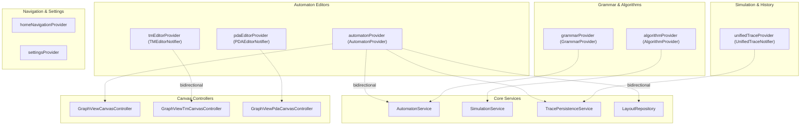

**Sources:** [lib/presentation/providers/automaton_provider.dart L1-L1716](https://github.com/ThalesMMS/JFlutter/blob/32e808b4/lib/presentation/providers/automaton_provider.dart#L1-L1716)

 [lib/presentation/providers/tm_editor_provider.dart L1-L530](https://github.com/ThalesMMS/JFlutter/blob/32e808b4/lib/presentation/providers/tm_editor_provider.dart#L1-L530)

 [lib/presentation/providers/pda_editor_provider.dart L1-L548](https://github.com/ThalesMMS/JFlutter/blob/32e808b4/lib/presentation/providers/pda_editor_provider.dart#L1-L548)

 [lib/injection/dependency_injection.dart L1-L237](https://github.com/ThalesMMS/JFlutter/blob/32e808b4/lib/injection/dependency_injection.dart#L1-L237)

## Core Automaton Providers

### AutomatonProvider

The `AutomatonProvider` manages finite state automata (FSA) including DFA and NFA configurations. It maintains the current automaton, simulation results, algorithm outputs, and equivalence checking state.

**State Structure:**

| Field | Type | Description |
| --- | --- | --- |
| `currentAutomaton` | `FSA?` | The active automaton being edited |
| `simulationResult` | `SimulationResult?` | Latest simulation execution result |
| `regexResult` | `String?` | Result of FA-to-regex conversion |
| `grammarResult` | `Grammar?` | Result of FSA-to-grammar conversion |
| `equivalenceResult` | `bool?` | Result of equivalence check with another automaton |
| `equivalenceDetails` | `String?` | Details about equivalence comparison |
| `simulationHistory` | `List<SimulationResult>` | Past simulation executions |
| `automatonHistory` | `List<FSA>` | Undo/redo stack for automaton edits |
| `isLoading` | `bool` | Indicates ongoing operation |
| `error` | `String?` | Error message if operation failed |

**Key Mutation Methods:**

```mermaid
flowchart TD

addState["addState()"]
moveState["moveState()"]
removeState["removeState()"]
addTransition["addOrUpdateTransition()"]
removeTransition["removeTransition()"]
updateFlags["updateStateFlags()"]
updateLabel["updateStateLabel()"]
simulate["simulateAutomaton()"]
nfaToDfa["convertNfaToDfa()"]
minimize["minimizeDfa()"]
complete["completeDfa()"]
toGrammar["convertFsaToGrammar()"]
toRegex["convertFaToRegex()"]
compare["compareEquivalence()"]
autoLayout["applyAutoLayout()"]
replace["replaceCurrentAutomaton()"]
clear["clearAutomaton()"]
FSA["FSA State Update"]
Results["Result Storage"]

addState -.-> FSA
moveState -.-> FSA
removeState -.-> FSA
addTransition -.-> FSA
removeTransition -.-> FSA
updateFlags -.-> FSA
updateLabel -.-> FSA
simulate -.-> Results
nfaToDfa -.-> FSA
minimize -.-> FSA
complete -.-> FSA
toGrammar -.-> Results
toRegex -.-> Results
compare -.-> Results
autoLayout -.-> FSA
replace -.-> FSA
clear -.-> FSA

subgraph subGraph2 ["Layout & Persistence"]
    autoLayout
    replace
    clear
end

subgraph subGraph1 ["Algorithm Operations"]
    simulate
    nfaToDfa
    minimize
    complete
    toGrammar
    toRegex
    compare
end

subgraph subGraph0 ["State Mutations"]
    addState
    moveState
    removeState
    addTransition
    removeTransition
    updateFlags
    updateLabel
end
```

**Internal Mutation Pipeline:**

The provider uses `_mutateAutomaton()` as a central mutation handler that ensures state consistency:

1. Retrieves current automaton or creates empty template
2. Applies transformation function
3. Validates state references and alphabet
4. Rebinds transitions to updated state instances
5. Updates initial state and accepting states
6. Publishes new immutable snapshot
7. Clears derived results (simulation, regex, etc.)

**Sources:** [lib/presentation/providers/automaton_provider.dart L40-L1716](https://github.com/ThalesMMS/JFlutter/blob/32e808b4/lib/presentation/providers/automaton_provider.dart#L40-L1716)

### TMEditorProvider

The `TMEditorNotifier` maintains Turing machine state with tape operations, read/write symbols, and move directions.

**State Structure:**

| Field | Type | Description |
| --- | --- | --- |
| `tm` | `TM?` | Current Turing machine configuration |
| `tapeSymbols` | `Set<String>` | Discovered tape alphabet symbols |
| `moveDirections` | `Set<String>` | Directions used in transitions (L/R/S) |
| `nondeterministicTransitionIds` | `Set<String>` | IDs of transitions with same (state, read) pair |
| `states` | `List<State>` | Immutable snapshot of canvas states |
| `transitions` | `List<TMTransition>` | Immutable snapshot of tape transitions |

**Mutation Pattern:**

Unlike `AutomatonProvider`, the TM editor maintains internal mutable lists (`_states`, `_transitions`) that are cloned during mutations and exposed as immutable snapshots in the state:

1. Canvas invokes mutation method (e.g., `upsertState()`)
2. Method updates internal `_states` or `_transitions` list
3. `_rebuildState()` constructs new `TM` instance
4. Derives metadata (nondeterminism, tape symbols)
5. Publishes immutable `TMEditorState` with unmodifiable views

**Sources:** [lib/presentation/providers/tm_editor_provider.dart L1-L530](https://github.com/ThalesMMS/JFlutter/blob/32e808b4/lib/presentation/providers/tm_editor_provider.dart#L1-L530)

### PDAEditorProvider

The `PDAEditorNotifier` manages pushdown automata with stack operations and lambda transitions.

**State Structure:**

| Field | Type | Description |
| --- | --- | --- |
| `pda` | `PDA?` | Current pushdown automaton |
| `nondeterministicTransitionIds` | `Set<String>` | Transitions sharing (state, input, pop) configuration |
| `lambdaTransitionIds` | `Set<String>` | Transitions using lambda for input/pop/push |

**Stack Alphabet Management:**

The provider automatically derives the stack alphabet from transition operations:

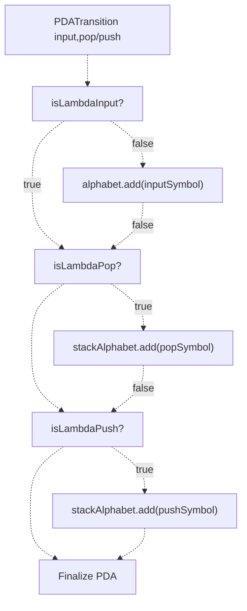

**Sources:** [lib/presentation/providers/pda_editor_provider.dart L1-L548](https://github.com/ThalesMMS/JFlutter/blob/32e808b4/lib/presentation/providers/pda_editor_provider.dart#L1-L548)

## State Synchronization with Canvas

The canvas system maintains a bidirectional synchronization pattern where controllers convert provider state into GraphView snapshots and relay user interactions back to providers.

### Synchronization Flow

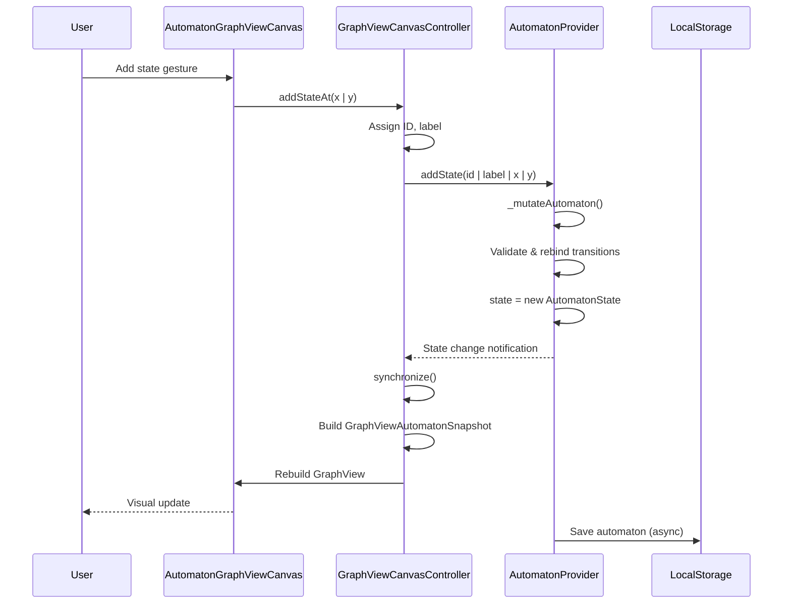

**GraphView Mutation Counter:**

The `AutomatonProvider` tracks a `_graphViewMutationCounter` for debugging synchronization issues:

```
void _mutateAutomaton(FSA Function(FSA current) transform) {  final current = state.currentAutomaton ?? _createEmptyAutomaton();  final updated = transform(current);  if (identical(updated, state.currentAutomaton)) {    _traceGraphView('mutation skipped', {'reason': 'identical-snapshot'});    return;  }  _graphViewMutationCounter++;  _traceGraphView('mutation applied', {    'seq': _graphViewMutationCounter,    'states': updated.states.length,    'transitions': updated.transitions.length,  });  state = state.copyWith(currentAutomaton: updated);}
```

**Sources:** [lib/presentation/providers/automaton_provider.dart L597-L624](https://github.com/ThalesMMS/JFlutter/blob/32e808b4/lib/presentation/providers/automaton_provider.dart#L597-L624)

 [lib/presentation/widgets/automaton_graphview_canvas.dart L254-L332](https://github.com/ThalesMMS/JFlutter/blob/32e808b4/lib/presentation/widgets/automaton_graphview_canvas.dart#L254-L332)

### Canvas-to-Provider Binding

Controllers expose high-level methods that wrap provider mutations with canvas-specific logic:

| Canvas Method | Provider Method | Additional Logic |
| --- | --- | --- |
| `addStateAt(x, y)` | `addState()` | Generates unique ID, calculates label |
| `moveState(id, delta)` | `moveState()` | Normalizes delta by zoom level |
| `updateStateLabel(id, label)` | `updateStateLabel()` | Validates label format |
| `addOrUpdateTransition()` | `addOrUpdateTransition()` | Calculates control points for curves |
| `removeState(id)` | `removeState()` | Confirms deletion dialog |
| `toggleStateFlag()` | `updateStateFlags()` | Ensures only one initial state |

**Sources:** [lib/features/canvas/graphview/graphview_canvas_controller.dart L60-L214](https://github.com/ThalesMMS/JFlutter/blob/32e808b4/lib/features/canvas/graphview/graphview_canvas_controller.dart#L60-L214)

## Provider Lifecycle and Dependency Injection

Providers are registered through GetIt during application initialization, enabling lazy instantiation and dependency injection.

### Dependency Graph

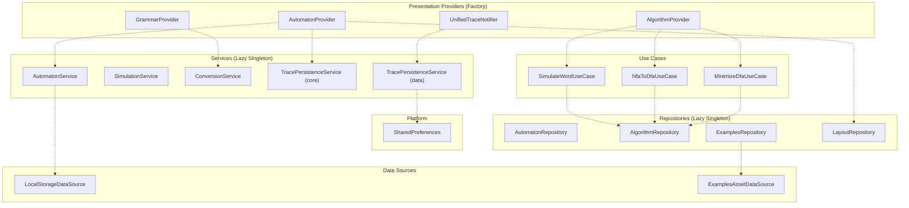

**Registration Code:**

The dependency injection setup follows this pattern:

1. Initialize `SharedPreferences` (async)
2. Register data sources as lazy singletons
3. Register services as lazy singletons
4. Register repositories as lazy singletons
5. Register use cases as lazy singletons
6. Register providers as factories (new instance per injection)

**Sources:** [lib/injection/dependency_injection.dart L38-L231](https://github.com/ThalesMMS/JFlutter/blob/32e808b4/lib/injection/dependency_injection.dart#L38-L231)

### Provider Factory vs Singleton

**Factory Providers** (created fresh for each page):

* `AutomatonProvider` - Each FSA editor page gets isolated state
* `TMEditorNotifier` - TM page maintains independent state
* `PDAEditorNotifier` - PDA page maintains independent state
* `GrammarProvider` - Grammar editor isolated state

**Shared Services** (application-wide singletons):

* `TracePersistenceService` - Unified history across all automaton types
* `AutomatonService` - Domain logic shared by all editors
* `LayoutRepository` - Auto-layout algorithm shared by all canvases

**Sources:** [lib/injection/dependency_injection.dart L194-L230](https://github.com/ThalesMMS/JFlutter/blob/32e808b4/lib/injection/dependency_injection.dart#L194-L230)

## State Persistence Patterns

### Automaton Persistence

The `AutomatonProvider` integrates with `LocalStorageDataSource` to persist automaton snapshots:

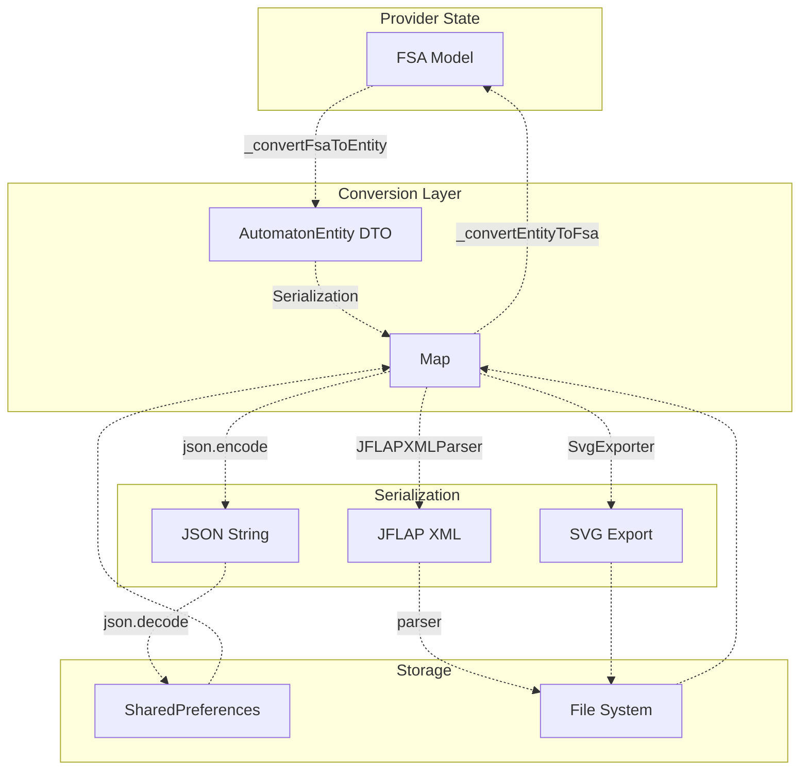

**Round-Trip Guarantee:**

The provider exposes conversion methods to ensure lossless round-trips:

* `convertFsaToEntity(automaton)` - FSA → AutomatonEntity
* `convertEntityToFsa(entity)` - AutomatonEntity → FSA
* `replaceCurrentAutomaton(entity)` - Replace with converted entity

**Sources:** [lib/presentation/providers/automaton_provider.dart L908-L937](https://github.com/ThalesMMS/JFlutter/blob/32e808b4/lib/presentation/providers/automaton_provider.dart#L908-L937)

 [lib/presentation/providers/automaton_provider.dart L1089-L1715](https://github.com/ThalesMMS/JFlutter/blob/32e808b4/lib/presentation/providers/automaton_provider.dart#L1089-L1715)

### Simulation Trace Persistence

The `UnifiedTraceNotifier` manages simulation history with automatic persistence:

**Trace Save Flow:**

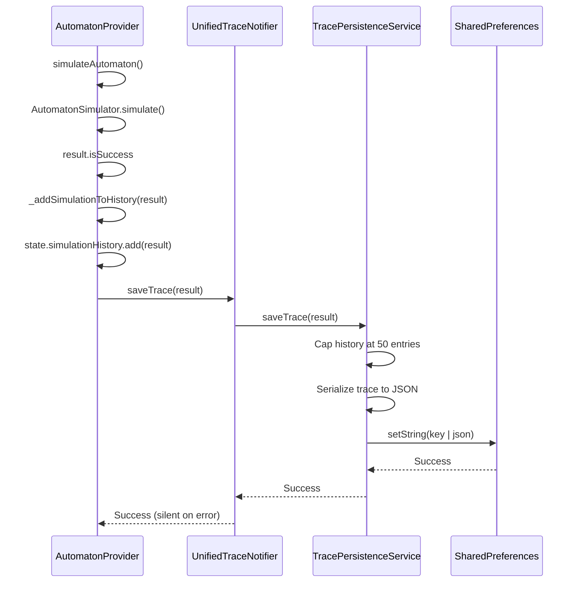

**History Cap Logic:**

To prevent unbounded storage growth, the trace service limits history to 50 entries:

```
Future<void> saveTrace(SimulationResult result) async {  final traces = await loadAllTraces();  traces.add(result);    // Keep only most recent 50 traces  if (traces.length > 50) {    traces.removeRange(0, traces.length - 50);  }    await _saveTraces(traces);}
```

**Sources:** [lib/presentation/providers/automaton_provider.dart L1065-L1074](https://github.com/ThalesMMS/JFlutter/blob/32e808b4/lib/presentation/providers/automaton_provider.dart#L1065-L1074)

 [lib/data/services/trace_persistence_service.dart L23-L49](https://github.com/ThalesMMS/JFlutter/blob/32e808b4/lib/data/services/trace_persistence_service.dart#L23-L49)

 [USER_GUIDE L32-L61](https://github.com/ThalesMMS/JFlutter/blob/32e808b4/USER_GUIDE#L32-L61)

## State Mutation Patterns

### Immutability Guarantees

All domain models (`FSA`, `PDA`, `TM`, `State`, `Transition`) are immutable classes with `copyWith()` methods:

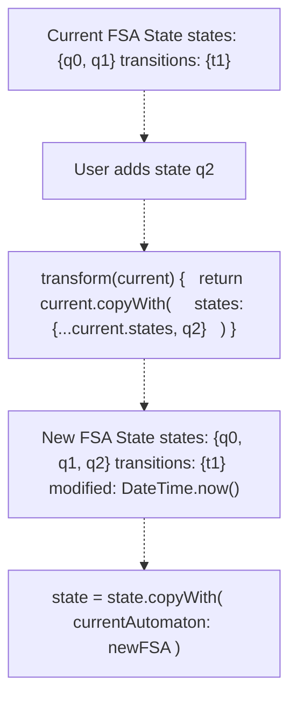

**Transition Rebinding:**

When states are modified, transitions must be rebound to new state instances to maintain referential consistency:

```javascript
Set<FSATransition> _rebindTransitions(  Iterable<FSATransition> transitions,  Map<String, State> statesById,) {  return transitions      .map((transition) => transition.copyWith(            fromState: statesById[transition.fromState.id] ?? transition.fromState,            toState: statesById[transition.toState.id] ?? transition.toState,          ))      .toSet();}
```

**Sources:** [lib/presentation/providers/automaton_provider.dart L626-L639](https://github.com/ThalesMMS/JFlutter/blob/32e808b4/lib/presentation/providers/automaton_provider.dart#L626-L639)

### Error Handling Pattern

Providers use the `Result<T>` type for operations that may fail:

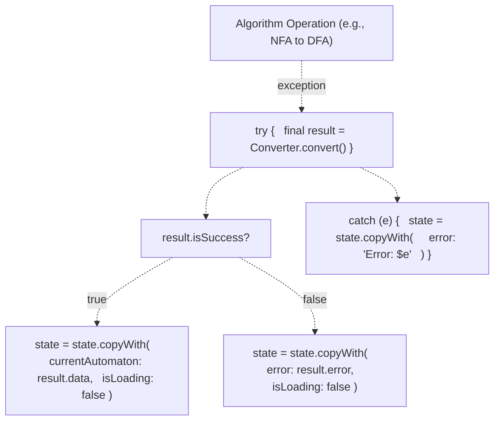

**Example from AutomatonProvider:**

```
Future<void> convertNfaToDfa() async {  state = state.copyWith(isLoading: true, error: null);  try {    final result = NFAToDFAConverter.convert(state.currentAutomaton!);    if (result.isSuccess) {      state = state.copyWith(        currentAutomaton: result.data,        isLoading: false,      );    } else {      state = state.copyWith(isLoading: false, error: result.error);    }  } catch (e) {    state = state.copyWith(      isLoading: false,      error: 'Error converting NFA to DFA: $e',    );  }}
```

**Sources:** [lib/presentation/providers/automaton_provider.dart L764-L793](https://github.com/ThalesMMS/JFlutter/blob/32e808b4/lib/presentation/providers/automaton_provider.dart#L764-L793)

 [lib/core/result.dart L1-L100](https://github.com/ThalesMMS/JFlutter/blob/32e808b4/lib/core/result.dart#L1-L100)

## Specialized Provider Patterns

### Algorithm Provider

The `AlgorithmProvider` wraps multiple use cases and exposes algorithm execution as reactive operations:

**Use Case Composition:**

```mermaid
flowchart TD

AlgoProv["AlgorithmProvider"]
NfaToDfaUC["NfaToDfaUseCase"]
MinimizeUC["MinimizeDfaUseCase"]
RegexToNfaUC["RegexToNfaUseCase"]
DfaToRegexUC["DfaToRegexUseCase"]
FsaToGrammarUC["FsaToGrammarUseCase"]
SimulateUC["SimulateWordUseCase"]
StepSimUC["CreateStepByStepSimulationUseCase"]
EquivUC["CheckEquivalenceUseCase"]
ComplementUC["ComplementDfaUseCase"]
UnionUC["UnionDfaUseCase"]
IntersectUC["IntersectionDfaUseCase"]
DiffUC["DifferenceDfaUseCase"]

AlgoProv -.-> NfaToDfaUC
AlgoProv -.-> MinimizeUC
AlgoProv -.-> RegexToNfaUC
AlgoProv -.-> DfaToRegexUC
AlgoProv -.-> FsaToGrammarUC
AlgoProv -.-> SimulateUC
AlgoProv -.-> StepSimUC
AlgoProv -.-> EquivUC
AlgoProv -.-> ComplementUC
AlgoProv -.-> UnionUC
AlgoProv -.-> IntersectUC
AlgoProv -.-> DiffUC

subgraph subGraph2 ["Set Operations"]
    ComplementUC
    UnionUC
    IntersectUC
    DiffUC
end

subgraph subGraph1 ["Analysis Use Cases"]
    SimulateUC
    StepSimUC
    EquivUC
end

subgraph subGraph0 ["Conversion Use Cases"]
    NfaToDfaUC
    MinimizeUC
    RegexToNfaUC
    DfaToRegexUC
    FsaToGrammarUC
end
```

**Sources:** [lib/injection/dependency_injection.dart L202-L221](https://github.com/ThalesMMS/JFlutter/blob/32e808b4/lib/injection/dependency_injection.dart#L202-L221)

### Unified Trace Provider

The `UnifiedTraceNotifier` centralizes trace management across all automaton types (FSA, PDA, TM):

**Trace Context Model:**

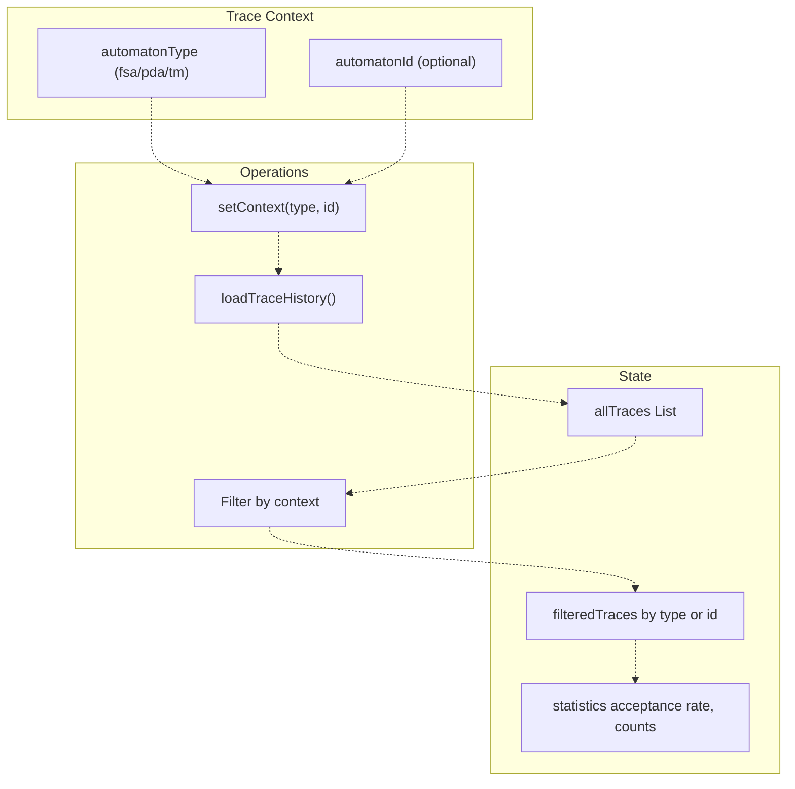

**Export/Import Flow:**

The trace provider supports JSON export/import for backup and sharing:

```
// Export all tracesfinal json = await traceNotifier.exportTraceHistory();// Save to file system// Import from filefinal jsonData = await readFile();await traceNotifier.importTraceHistory(jsonData);
```

**Sources:** [lib/presentation/providers/unified_trace_provider.dart L135-L309](https://github.com/ThalesMMS/JFlutter/blob/32e808b4/lib/presentation/providers/unified_trace_provider.dart#L135-L309)

 [lib/data/services/trace_persistence_service.dart L140-L213](https://github.com/ThalesMMS/JFlutter/blob/32e808b4/lib/data/services/trace_persistence_service.dart#L140-L213)

## Debug Tracing and Observability

Providers include debug logging to track state mutations and synchronization:

### GraphView Mutation Tracing

```javascript
void _traceGraphView(String operation, [Map<String, Object?>? metadata]) {  if (!kDebugMode) return;  final buffer = StringBuffer('[AutomatonProvider] $operation');  if (metadata != null && metadata.isNotEmpty) {    final formatted = metadata.entries        .map((entry) => '${entry.key}=${entry.value}')        .join(', ');    buffer.write(' {$formatted}');  }  debugPrint(buffer.toString());}
```

**Example Debug Output:**

```
[AutomatonProvider] addState {id=q2, label=q2, x=150.00, y=200.00, initial=false, accepting=false}
[AutomatonProvider] mutation applied {seq=5, states=3, transitions=2, initial=q0, accepting=1, alphabet=2}
[AutomatonProvider] addOrUpdateTransition {id=t3, from=q1, to=q2, label=a, cpX=null, cpY=null}
[AutomatonProvider] mutation applied {seq=6, states=3, transitions=3, initial=q0, accepting=1, alphabet=2}
```

**Sources:** [lib/presentation/providers/automaton_provider.dart L56-L70](https://github.com/ThalesMMS/JFlutter/blob/32e808b4/lib/presentation/providers/automaton_provider.dart#L56-L70)

 [USER_GUIDE L82-L84](https://github.com/ThalesMMS/JFlutter/blob/32e808b4/USER_GUIDE#L82-L84)

### Highlight Service Tracking

The `SimulationHighlightService` tracks dispatch counts and last highlight for diagnosing desynchronization:

```css
class SimulationHighlightService {  int _dispatchCount = 0;  Map<String, dynamic>? _lastHighlight;  void highlight(Map<String, dynamic> payload) {    _dispatchCount++;    _lastHighlight = payload;    _channel.dispatch(payload);    debugPrint('[HighlightService] Dispatch #$_dispatchCount: $payload');  }}
```

**Sources:** [lib/core/services/simulation_highlight_service.dart L8-L101](https://github.com/ThalesMMS/JFlutter/blob/32e808b4/lib/core/services/simulation_highlight_service.dart#L8-L101)

 [USER_GUIDE L83-L84](https://github.com/ThalesMMS/JFlutter/blob/32e808b4/USER_GUIDE#L83-L84)

## State Management Best Practices

### When to Use Each Provider Type

| Scenario | Provider Type | Example |
| --- | --- | --- |
| Page-specific editor state | Factory (StateNotifierProvider) | `automatonProvider`, `tmEditorProvider` |
| Application-wide shared state | Singleton service | `TracePersistenceService`, `SettingsRepository` |
| Computed/derived state | Provider with select/watch | Filtering trace history by type |
| Asynchronous initialization | FutureProvider | Loading examples from assets |
| Stream-based updates | StreamProvider | Real-time collaboration (future) |

### Mutation Method Naming Convention

| Pattern | Example | Purpose |
| --- | --- | --- |
| `add*` | `addState()`, `addTransition()` | Create new entity |
| `remove*` | `removeState()`, `removeTransition()` | Delete entity |
| `update*` | `updateStateLabel()`, `updateStateFlags()` | Modify existing entity |
| `move*` | `moveState()` | Change position |
| `upsert*` | `upsertTransition()` | Create or update |
| `convert*` | `convertNfaToDfa()` | Algorithm transformation |
| `clear*` | `clearAutomaton()`, `clearSimulation()` | Reset state |

**Sources:** [lib/presentation/providers/automaton_provider.dart L72-L1062](https://github.com/ThalesMMS/JFlutter/blob/32e808b4/lib/presentation/providers/automaton_provider.dart#L72-L1062)

### State Consistency Rules

1. **Single Initial State**: Ensure only one state has `isInitial = true`
2. **Transition Rebinding**: Always rebind transitions after state modifications
3. **Alphabet Synchronization**: Update alphabet when adding/modifying transitions
4. **Metadata Derivation**: Recalculate nondeterminism, lambda transitions after updates
5. **Error Clearing**: Clear error state before starting new operations
6. **Result Clearing**: Clear algorithm results when automaton is modified

**Sources:** [lib/presentation/providers/automaton_provider.dart L597-L624](https://github.com/ThalesMMS/JFlutter/blob/32e808b4/lib/presentation/providers/automaton_provider.dart#L597-L624)

 [lib/presentation/providers/pda_editor_provider.dart L475-L518](https://github.com/ThalesMMS/JFlutter/blob/32e808b4/lib/presentation/providers/pda_editor_provider.dart#L475-L518)

## Integration Examples

### Adding a State from Canvas

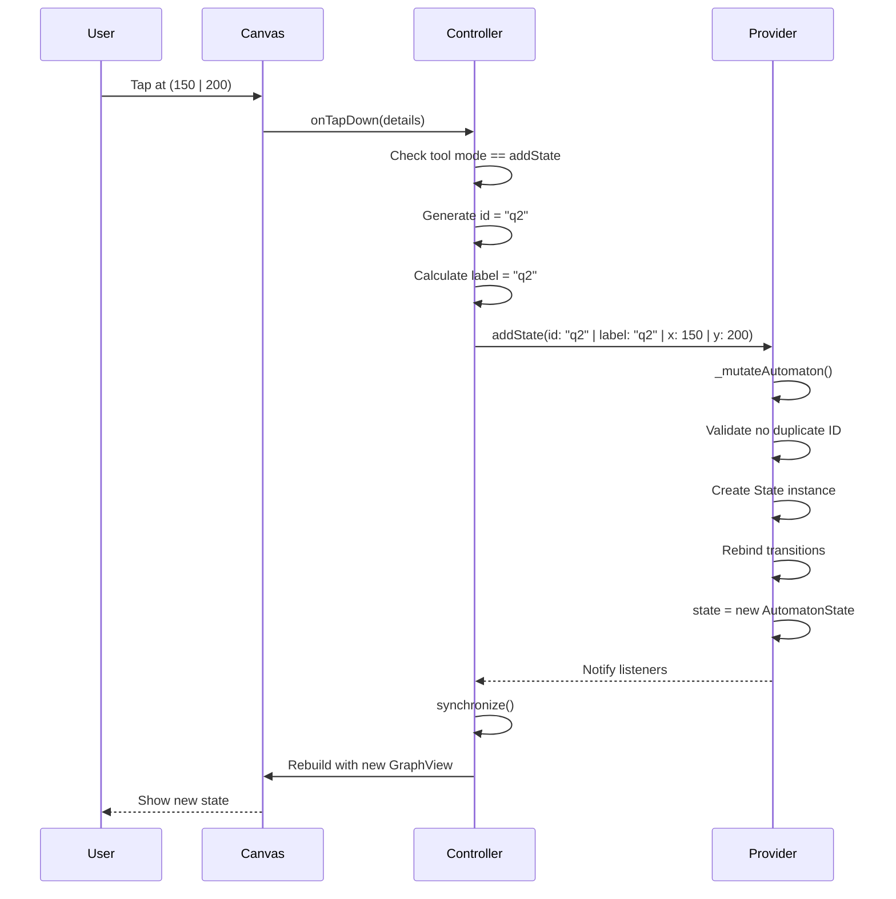

**Sources:** [lib/presentation/widgets/automaton_graphview_canvas.dart L254-L303](https://github.com/ThalesMMS/JFlutter/blob/32e808b4/lib/presentation/widgets/automaton_graphview_canvas.dart#L254-L303)

 [lib/features/canvas/graphview/graphview_canvas_controller.dart L106-L129](https://github.com/ThalesMMS/JFlutter/blob/32e808b4/lib/features/canvas/graphview/graphview_canvas_controller.dart#L106-L129)

### Executing an Algorithm

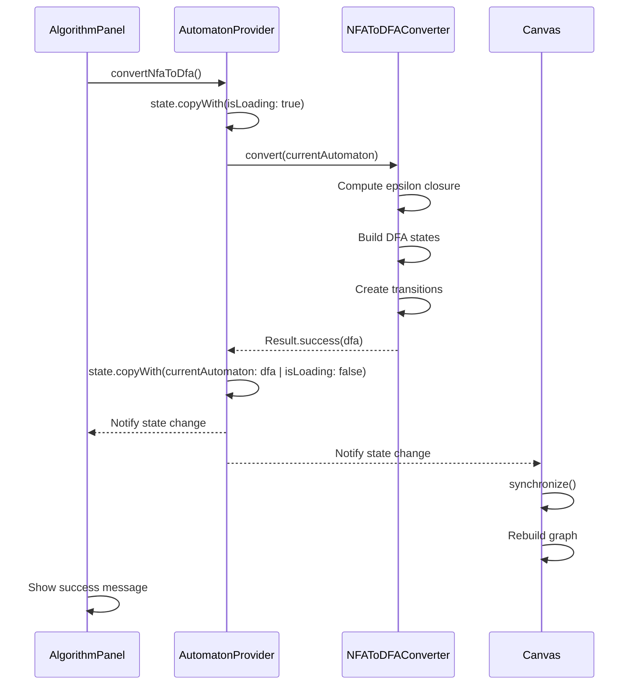

**Sources:** [lib/presentation/providers/automaton_provider.dart L764-L793](https://github.com/ThalesMMS/JFlutter/blob/32e808b4/lib/presentation/providers/automaton_provider.dart#L764-L793)

 [lib/core/algorithms/nfa_to_dfa_converter.dart L1-L200](https://github.com/ThalesMMS/JFlutter/blob/32e808b4/lib/core/algorithms/nfa_to_dfa_converter.dart#L1-L200)

Refresh this wiki

Last indexed: 30 December 2025 ([32e808](https://github.com/ThalesMMS/JFlutter/commit/32e808b4))

### On this page

* [State Management](#6-state-management)
* [Purpose and Scope](#6-purpose-and-scope)
* [Provider Architecture Overview](#6-provider-architecture-overview)
* [Core Automaton Providers](#6-core-automaton-providers)
* [AutomatonProvider](#6-automatonprovider)
* [TMEditorProvider](#6-tmeditorprovider)
* [PDAEditorProvider](#6-pdaeditorprovider)
* [State Synchronization with Canvas](#6-state-synchronization-with-canvas)
* [Synchronization Flow](#6-synchronization-flow)
* [Canvas-to-Provider Binding](#6-canvas-to-provider-binding)
* [Provider Lifecycle and Dependency Injection](#6-provider-lifecycle-and-dependency-injection)
* [Dependency Graph](#6-dependency-graph)
* [Provider Factory vs Singleton](#6-provider-factory-vs-singleton)
* [State Persistence Patterns](#6-state-persistence-patterns)
* [Automaton Persistence](#6-automaton-persistence)
* [Simulation Trace Persistence](#6-simulation-trace-persistence)
* [State Mutation Patterns](#6-state-mutation-patterns)
* [Immutability Guarantees](#6-immutability-guarantees)
* [Error Handling Pattern](#6-error-handling-pattern)
* [Specialized Provider Patterns](#6-specialized-provider-patterns)
* [Algorithm Provider](#6-algorithm-provider)
* [Unified Trace Provider](#6-unified-trace-provider)
* [Debug Tracing and Observability](#6-debug-tracing-and-observability)
* [GraphView Mutation Tracing](#6-graphview-mutation-tracing)
* [Highlight Service Tracking](#6-highlight-service-tracking)
* [State Management Best Practices](#6-state-management-best-practices)
* [When to Use Each Provider Type](#6-when-to-use-each-provider-type)
* [Mutation Method Naming Convention](#6-mutation-method-naming-convention)
* [State Consistency Rules](#6-state-consistency-rules)
* [Integration Examples](#6-integration-examples)
* [Adding a State from Canvas](#6-adding-a-state-from-canvas)
* [Executing an Algorithm](#6-executing-an-algorithm)

Ask Devin about JFlutter