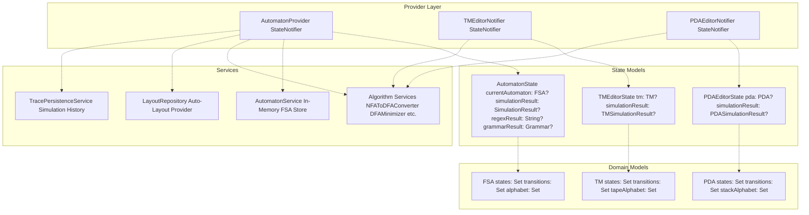
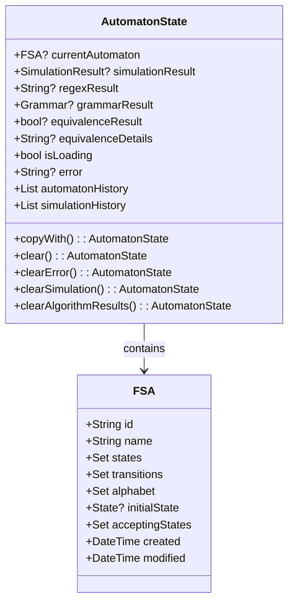
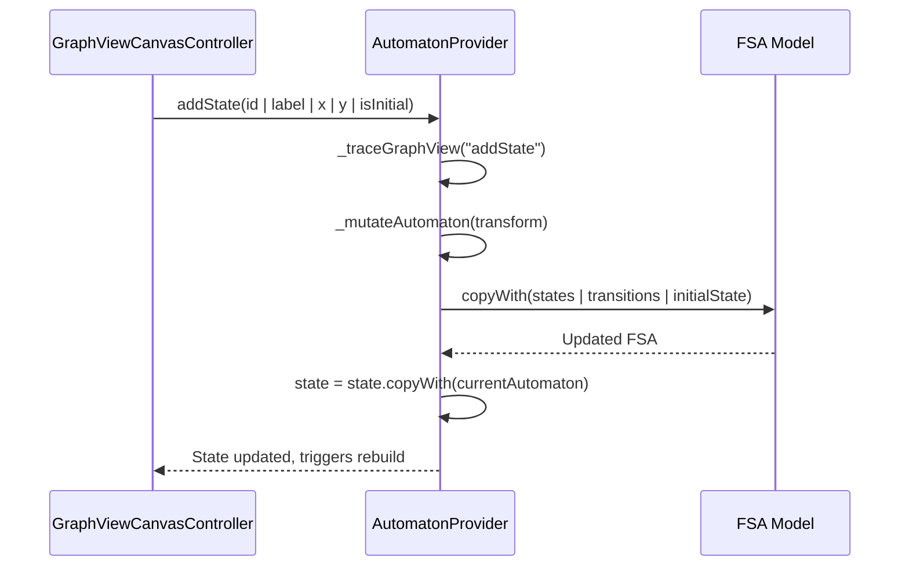
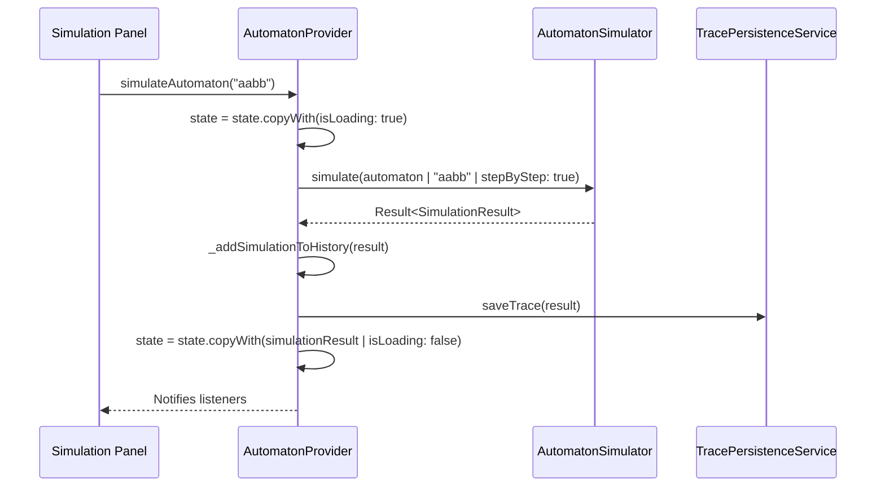
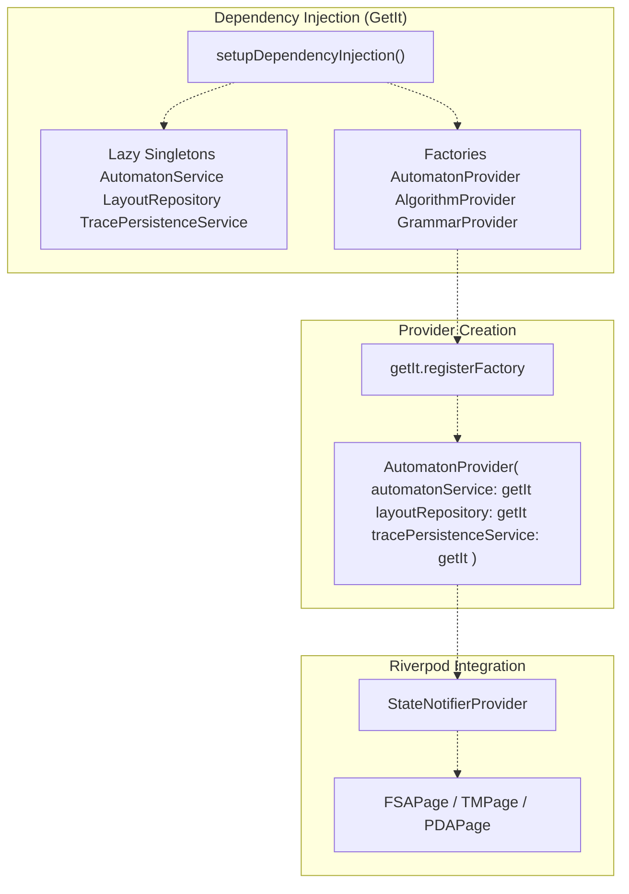
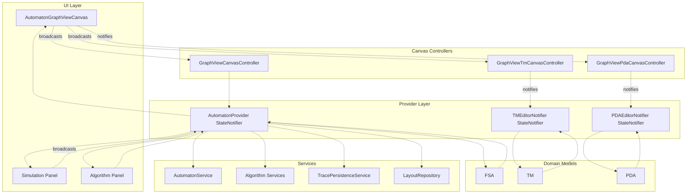

# Automaton Providers

> **Relevant source files**
> * [lib/core/dfa_algorithms.dart](https://github.com/ThalesMMS/JFlutter/blob/32e808b4/lib/core/dfa_algorithms.dart)
> * [lib/features/canvas/graphview/base_graphview_canvas_controller.dart](https://github.com/ThalesMMS/JFlutter/blob/32e808b4/lib/features/canvas/graphview/base_graphview_canvas_controller.dart)
> * [lib/features/canvas/graphview/graphview_canvas_controller.dart](https://github.com/ThalesMMS/JFlutter/blob/32e808b4/lib/features/canvas/graphview/graphview_canvas_controller.dart)
> * [lib/features/canvas/graphview/graphview_pda_canvas_controller.dart](https://github.com/ThalesMMS/JFlutter/blob/32e808b4/lib/features/canvas/graphview/graphview_pda_canvas_controller.dart)
> * [lib/features/canvas/graphview/graphview_pda_mapper.dart](https://github.com/ThalesMMS/JFlutter/blob/32e808b4/lib/features/canvas/graphview/graphview_pda_mapper.dart)
> * [lib/features/canvas/graphview/graphview_tm_canvas_controller.dart](https://github.com/ThalesMMS/JFlutter/blob/32e808b4/lib/features/canvas/graphview/graphview_tm_canvas_controller.dart)
> * [lib/features/canvas/graphview/graphview_tm_mapper.dart](https://github.com/ThalesMMS/JFlutter/blob/32e808b4/lib/features/canvas/graphview/graphview_tm_mapper.dart)
> * [lib/features/canvas/graphview/graphview_viewport_highlight_mixin.dart](https://github.com/ThalesMMS/JFlutter/blob/32e808b4/lib/features/canvas/graphview/graphview_viewport_highlight_mixin.dart)
> * [lib/injection/dependency_injection.dart](https://github.com/ThalesMMS/JFlutter/blob/32e808b4/lib/injection/dependency_injection.dart)
> * [lib/presentation/providers/automaton_provider.dart](https://github.com/ThalesMMS/JFlutter/blob/32e808b4/lib/presentation/providers/automaton_provider.dart)

This document describes the Riverpod-based state management providers that coordinate domain logic for automata editors in JFlutter. These providers expose reactive state for Finite State Automata (FSA), Pushdown Automata (PDA), and Turing Machines (TM), handling CRUD operations, algorithm execution, simulation, and persistence.

For information about how these providers synchronize with canvas controllers, see [Canvas-Provider Synchronization](#6.2). For the dependency injection setup that instantiates these providers, see [Dependency Injection](#6.3).

---

## Provider Architecture

JFlutter implements three specialized `StateNotifier` providers to manage different automaton types. Each provider maintains its own domain model, coordinates with core services, and exposes a unified interface for UI components and canvas controllers.

### Provider Type Hierarchy



**Sources:** [lib/presentation/providers/automaton_provider.dart L41-L185](https://github.com/ThalesMMS/JFlutter/blob/32e808b4/lib/presentation/providers/automaton_provider.dart#L41-L185)

 [lib/features/canvas/graphview/graphview_canvas_controller.dart L33-L50](https://github.com/ThalesMMS/JFlutter/blob/32e808b4/lib/features/canvas/graphview/graphview_canvas_controller.dart#L33-L50)

 [lib/features/canvas/graphview/graphview_tm_canvas_controller.dart L37-L54](https://github.com/ThalesMMS/JFlutter/blob/32e808b4/lib/features/canvas/graphview/graphview_tm_canvas_controller.dart#L37-L54)

 [lib/features/canvas/graphview/graphview_pda_canvas_controller.dart L34-L51](https://github.com/ThalesMMS/JFlutter/blob/32e808b4/lib/features/canvas/graphview/graphview_pda_canvas_controller.dart#L34-L51)

---

## AutomatonProvider

The `AutomatonProvider` class manages state for finite state automata editors. It extends `StateNotifier<AutomatonState>` and coordinates between UI interactions, domain models, algorithm execution, and persistence.

### Class Declaration and Dependencies

| Component | Type | Purpose |
| --- | --- | --- |
| `AutomatonProvider` | `StateNotifier<AutomatonState>` | Main state container |
| `AutomatonService` | Service | In-memory automaton CRUD |
| `LayoutRepository` | Repository | Auto-layout computation |
| `TracePersistenceService` | Service | Simulation trace storage |

The provider is instantiated with three required dependencies:

```
AutomatonProvider({
  required AutomatonService automatonService,
  required LayoutRepository layoutRepository,
  TracePersistenceService? tracePersistenceService,
})
```

**Sources:** [lib/presentation/providers/automaton_provider.dart L41-L54](https://github.com/ThalesMMS/JFlutter/blob/32e808b4/lib/presentation/providers/automaton_provider.dart#L41-L54)

### AutomatonState Structure



The state object maintains the current automaton alongside algorithm results, simulation outputs, and loading indicators. Specialized `clear*()` methods enable selective state reset without discarding the entire automaton.

**Sources:** [lib/presentation/providers/automaton_provider.dart L1188-L1227](https://github.com/ThalesMMS/JFlutter/blob/32e808b4/lib/presentation/providers/automaton_provider.dart#L1188-L1227)

### State Mutation Operations

The provider exposes canvas-oriented CRUD operations that accept world coordinates and identifiers generated by canvas controllers. Each mutation follows a consistent pattern:

1. Trace debug logs (development only)
2. Execute mutation via `_mutateAutomaton`
3. Rebind state references
4. Clear algorithm results
5. Update timestamp

#### State CRUD Methods

| Method | Parameters | Purpose |
| --- | --- | --- |
| `addState` | `id`, `label`, `x`, `y`, `isInitial?`, `isAccepting?` | Creates or updates a state at coordinates |
| `moveState` | `id`, `x`, `y` | Updates state position |
| `removeState` | `id` | Deletes state and connected transitions |
| `updateStateLabel` | `id`, `label` | Changes state display label |
| `updateStateFlags` | `id`, `isInitial?`, `isAccepting?` | Modifies initial/accepting markers |

**Example flow for `addState`:**



**Sources:** [lib/presentation/providers/automaton_provider.dart L125-L221](https://github.com/ThalesMMS/JFlutter/blob/32e808b4/lib/presentation/providers/automaton_provider.dart#L125-L221)

 [lib/presentation/providers/automaton_provider.dart L224-L259](https://github.com/ThalesMMS/JFlutter/blob/32e808b4/lib/presentation/providers/automaton_provider.dart#L224-L259)

 [lib/presentation/providers/automaton_provider.dart L262-L339](https://github.com/ThalesMMS/JFlutter/blob/32e808b4/lib/presentation/providers/automaton_provider.dart#L262-L339)

#### Transition CRUD Methods

| Method | Parameters | Purpose |
| --- | --- | --- |
| `addOrUpdateTransition` | `id`, `fromStateId`, `toStateId`, `label`, `controlPointX?`, `controlPointY?` | Creates or updates transition |
| `removeTransition` | `id` | Deletes transition |
| `updateTransitionLabel` | `id`, `label` | Changes transition label and symbol set |

The provider parses transition labels to extract input symbols and detect epsilon/lambda notation:

```
_parseTransitionLabel(label) → (symbols: Set<String>, lambdaSymbol: String?)
```

Labels are normalized using `epsilon_utils` to ensure consistent epsilon representation across JFLAP imports and manual entry.

**Sources:** [lib/presentation/providers/automaton_provider.dart L342-L430](https://github.com/ThalesMMS/JFlutter/blob/32e808b4/lib/presentation/providers/automaton_provider.dart#L342-L430)

 [lib/presentation/providers/automaton_provider.dart L433-L455](https://github.com/ThalesMMS/JFlutter/blob/32e808b4/lib/presentation/providers/automaton_provider.dart#L433-L455)

 [lib/presentation/providers/automaton_provider.dart L554-L595](https://github.com/ThalesMMS/JFlutter/blob/32e808b4/lib/presentation/providers/automaton_provider.dart#L554-L595)

 [lib/presentation/providers/automaton_provider.dart L641-L687](https://github.com/ThalesMMS/JFlutter/blob/32e808b4/lib/presentation/providers/automaton_provider.dart#L641-L687)

### Algorithm Integration

`AutomatonProvider` exposes asynchronous methods that delegate to core algorithm services. Each method follows this pattern:

1. Set `isLoading = true` and clear previous results
2. Invoke algorithm service
3. Update state with result or error
4. Set `isLoading = false`

#### Algorithm Methods

| Method | Service | Result Field |
| --- | --- | --- |
| `simulateAutomaton(input)` | `AutomatonSimulator.simulate()` | `simulationResult` |
| `convertNfaToDfa()` | `NFAToDFAConverter.convert()` | Updates `currentAutomaton` |
| `minimizeDfa()` | `DFAMinimizer.minimize()` | Updates `currentAutomaton` |
| `completeDfa()` | `DFACompleter.complete()` | Updates `currentAutomaton` |
| `convertFsaToGrammar()` | `FSAToGrammarConverter.convert()` | `grammarResult` |
| `convertRegexToNfa(regex)` | `RegexToNFAConverter.convert()` | Updates `currentAutomaton` |
| `convertFaToRegex()` | `FAToRegexConverter.convert()` | `regexResult` |
| `compareEquivalence(other)` | `EquivalenceChecker.areEquivalent()` | `equivalenceResult` |
| `applyAutoLayout()` | `LayoutRepository.applyAutoLayout()` | Updates `currentAutomaton` |

**Simulation Flow:**



**Sources:** [lib/presentation/providers/automaton_provider.dart L730-L761](https://github.com/ThalesMMS/JFlutter/blob/32e808b4/lib/presentation/providers/automaton_provider.dart#L730-L761)

 [lib/presentation/providers/automaton_provider.dart L764-L793](https://github.com/ThalesMMS/JFlutter/blob/32e808b4/lib/presentation/providers/automaton_provider.dart#L764-L793)

 [lib/presentation/providers/automaton_provider.dart L796-L825](https://github.com/ThalesMMS/JFlutter/blob/32e808b4/lib/presentation/providers/automaton_provider.dart#L796-L825)

 [lib/presentation/providers/automaton_provider.dart L828-L851](https://github.com/ThalesMMS/JFlutter/blob/32e808b4/lib/presentation/providers/automaton_provider.dart#L828-L851)

 [lib/presentation/providers/automaton_provider.dart L854-L870](https://github.com/ThalesMMS/JFlutter/blob/32e808b4/lib/presentation/providers/automaton_provider.dart#L854-L870)

 [lib/presentation/providers/automaton_provider.dart L940-L967](https://github.com/ThalesMMS/JFlutter/blob/32e808b4/lib/presentation/providers/automaton_provider.dart#L940-L967)

 [lib/presentation/providers/automaton_provider.dart L970-L994](https://github.com/ThalesMMS/JFlutter/blob/32e808b4/lib/presentation/providers/automaton_provider.dart#L970-L994)

 [lib/presentation/providers/automaton_provider.dart L997-L1029](https://github.com/ThalesMMS/JFlutter/blob/32e808b4/lib/presentation/providers/automaton_provider.dart#L997-L1029)

 [lib/presentation/providers/automaton_provider.dart L873-L905](https://github.com/ThalesMMS/JFlutter/blob/32e808b4/lib/presentation/providers/automaton_provider.dart#L873-L905)

### Entity Conversion System

The provider implements bidirectional conversion between `FSA` (internal domain model) and `AutomatonEntity` (repository/serialization format). This abstraction enables auto-layout and file I/O without coupling domain models to external representations.

#### Conversion Methods

| Method | Direction | Purpose |
| --- | --- | --- |
| `convertFsaToEntity(FSA)` | FSA → Entity | Prepares for layout/export |
| `convertEntityToFsa(AutomatonEntity)` | Entity → FSA | Reconstructs from layout/import |
| `replaceCurrentAutomaton(AutomatonEntity)` | Entity → State | Updates provider state |
| `currentAutomatonEntity` | Property | Exposes current automaton as entity |

**Conversion Logic (FSA → Entity):**

1. Map `State` objects to `StateEntity` (preserves `id`, `name`, `x`, `y`, `isInitial`, `isFinal`)
2. Build `transitions` map with keys formatted as `"fromId|symbol"` → `[toId1, toId2, ...]`
3. Extract `alphabet` from FSA
4. Set `type` to `AutomatonType.dfa` (default assumption)

**Conversion Logic (Entity → FSA):**

1. Map `StateEntity` to `State` objects
2. Iterate `transitions` map entries, parse `"fromId|symbol"` keys
3. Create `FSATransition` for each destination state
4. Reconstruct `initialState` and `acceptingStates` from state flags

**Sources:** [lib/presentation/providers/automaton_provider.dart L908-L937](https://github.com/ThalesMMS/JFlutter/blob/32e808b4/lib/presentation/providers/automaton_provider.dart#L908-L937)

 [lib/presentation/providers/automaton_provider.dart L1089-L1127](https://github.com/ThalesMMS/JFlutter/blob/32e808b4/lib/presentation/providers/automaton_provider.dart#L1089-L1127)

 [lib/presentation/providers/automaton_provider.dart L1130-L1184](https://github.com/ThalesMMS/JFlutter/blob/32e808b4/lib/presentation/providers/automaton_provider.dart#L1130-L1184)

---

## TMEditorProvider

The `TMEditorNotifier` manages state for Turing Machine editors. It follows a similar architecture to `AutomatonProvider` but handles TM-specific concerns like tape alphabets, multi-tape machines, and read/write/direction transitions.

### Key Differences from AutomatonProvider

| Aspect | AutomatonProvider | TMEditorNotifier |
| --- | --- | --- |
| Domain Model | `FSA` | `TM` |
| Transition Type | `FSATransition` (input symbols) | `TMTransition` (read/write/direction) |
| Alphabet | `Set<String> alphabet` | `Set<String> tapeAlphabet`, `String blankSymbol` |
| State Methods | `addState`, `updateStateFlags` | `upsertState`, `updateStateFlags` |
| Transition Methods | `addOrUpdateTransition(label)` | `addOrUpdateTransition(readSymbol, writeSymbol, direction)` |
| Special Features | Epsilon transitions, NFA→DFA | Multi-tape support, tape direction |

**Canvas Controller Integration:**

The `GraphViewTmCanvasController` interacts with `TMEditorNotifier` through specialized methods that accept TM-specific parameters:

```yaml
controller.addOrUpdateTransition(
  fromStateId: "q0",
  toStateId: "q1",
  readSymbol: "a",
  writeSymbol: "b",
  direction: TapeDirection.right,
  controlPointX: 150.0,
  controlPointY: 200.0,
)
```

**Sources:** [lib/features/canvas/graphview/graphview_tm_canvas_controller.dart L37-L54](https://github.com/ThalesMMS/JFlutter/blob/32e808b4/lib/features/canvas/graphview/graphview_tm_canvas_controller.dart#L37-L54)

 [lib/features/canvas/graphview/graphview_tm_canvas_controller.dart L204-L232](https://github.com/ThalesMMS/JFlutter/blob/32e808b4/lib/features/canvas/graphview/graphview_tm_canvas_controller.dart#L204-L232)

---

## PDAEditorProvider

The `PDAEditorNotifier` manages state for Pushdown Automata editors. It handles stack operations and lambda transitions for input, pop, and push operations.

### Key Differences from AutomatonProvider

| Aspect | AutomatonProvider | PDAEditorNotifier |
| --- | --- | --- |
| Domain Model | `FSA` | `PDA` |
| Transition Type | `FSATransition` | `PDATransition` (input/pop/push) |
| Alphabet | `Set<String> alphabet` | `Set<String> alphabet`, `Set<String> stackAlphabet`, `String initialStackSymbol` |
| Transition Methods | `addOrUpdateTransition(label)` | `upsertTransition(readSymbol, popSymbol, pushSymbol, isLambdaInput, isLambdaPop, isLambdaPush)` |
| Special Features | Symbol sets and epsilon | Stack symbol tracking, lambda flags per operation |

**Canvas Controller Integration:**

The `GraphViewPdaCanvasController` provides PDA-specific transition creation:

```yaml
controller.addOrUpdateTransition(
  fromStateId: "q0",
  toStateId: "q1",
  readSymbol: "a",
  popSymbol: "Z",
  pushSymbol: "aZ",
  isLambdaInput: false,
  isLambdaPop: false,
  isLambdaPush: false,
)
```

**Sources:** [lib/features/canvas/graphview/graphview_pda_canvas_controller.dart L34-L51](https://github.com/ThalesMMS/JFlutter/blob/32e808b4/lib/features/canvas/graphview/graphview_pda_canvas_controller.dart#L34-L51)

 [lib/features/canvas/graphview/graphview_pda_canvas_controller.dart L204-L239](https://github.com/ThalesMMS/JFlutter/blob/32e808b4/lib/features/canvas/graphview/graphview_pda_canvas_controller.dart#L204-L239)

---

## Provider Registration and Lifecycle

All providers are registered in the dependency injection container using `GetIt` with factory scope, ensuring each usage context receives a fresh instance.

### Registration Pattern



**Registration Code:**

```javascript
// lib/injection/dependency_injection.dart:194-200getIt.registerFactory<AutomatonProvider>(  () => AutomatonProvider(    automatonService: getIt<AutomatonService>(),    layoutRepository: getIt<LayoutRepository>(),    tracePersistenceService: getIt<TracePersistenceService>(),  ),);
```

**Riverpod Provider Declaration:**

Providers are exposed to the widget tree via `StateNotifierProvider`:

```javascript
final automatonProvider = StateNotifierProvider<AutomatonProvider, AutomatonState>(  (ref) => getIt<AutomatonProvider>(),);
```

**Sources:** [lib/injection/dependency_injection.dart L38-L61](https://github.com/ThalesMMS/JFlutter/blob/32e808b4/lib/injection/dependency_injection.dart#L38-L61)

 [lib/injection/dependency_injection.dart L194-L200](https://github.com/ThalesMMS/JFlutter/blob/32e808b4/lib/injection/dependency_injection.dart#L194-L200)

---

## Data Flow Architecture

The following diagram illustrates how user interactions flow through the provider layer to domain models and back to UI components.



**Synchronization Flow:**

1. User interacts with canvas (e.g., adds state at position `(x, y)`)
2. Canvas controller calls provider mutation method
3. Provider updates domain model (e.g., `FSA.copyWith(states: updatedStates)`)
4. Provider notifies listeners via `state = state.copyWith(...)`
5. Canvas controller receives notification, calls `synchronizeGraph()`
6. Canvas re-renders with updated GraphView snapshot

**Sources:** [lib/presentation/providers/automaton_provider.dart L597-L624](https://github.com/ThalesMMS/JFlutter/blob/32e808b4/lib/presentation/providers/automaton_provider.dart#L597-L624)

 [lib/features/canvas/graphview/base_graphview_canvas_controller.dart L326-L494](https://github.com/ThalesMMS/JFlutter/blob/32e808b4/lib/features/canvas/graphview/base_graphview_canvas_controller.dart#L326-L494)

---

## Mutation Tracking and Debug Logging

The `AutomatonProvider` implements comprehensive debug logging to trace GraphView mutations during development. This telemetry is conditionally compiled and only executes in debug mode.

### Logging Pattern

```javascript
void _traceGraphView(String operation, [Map<String, Object?>? metadata]) {  if (!kDebugMode) return;    final buffer = StringBuffer('[AutomatonProvider] $operation');  if (metadata != null && metadata.isNotEmpty) {    final formatted = metadata.entries        .map((entry) => '${entry.key}=${entry.value}')        .join(', ');    buffer.write(' {$formatted}');  }  debugPrint(buffer.toString());}
```

**Example Debug Output:**

```
[AutomatonProvider] addState {id=state_0, label=q0, x=150.00, y=200.00, initial=true, accepting=false}
[AutomatonProvider] mutation applied {seq=1, states=1, transitions=0, initial=state_0, accepting=0, alphabet=0}
```

Each mutation increments `_graphViewMutationCounter` and logs the resulting graph structure for debugging canvas synchronization issues.

**Sources:** [lib/presentation/providers/automaton_provider.dart L56-L70](https://github.com/ThalesMMS/JFlutter/blob/32e808b4/lib/presentation/providers/automaton_provider.dart#L56-L70)

 [lib/presentation/providers/automaton_provider.dart L133-L140](https://github.com/ThalesMMS/JFlutter/blob/32e808b4/lib/presentation/providers/automaton_provider.dart#L133-L140)

 [lib/presentation/providers/automaton_provider.dart L605-L614](https://github.com/ThalesMMS/JFlutter/blob/32e808b4/lib/presentation/providers/automaton_provider.dart#L605-L614)

---

## History Management

While undo/redo functionality is implemented in `BaseGraphViewCanvasController` (see [Canvas Controllers](#4.2)), providers maintain simulation and automaton history for trace playback and example loading.

### History Fields

| Field | Type | Purpose |
| --- | --- | --- |
| `automatonHistory` | `List<FSA>` | Previous automaton snapshots |
| `simulationHistory` | `List<SimulationResult>` | Previous simulation traces |

The `_addSimulationToHistory` method appends simulation results to the history list and persists them via `TracePersistenceService`. Trace persistence is capped at 50 entries to prevent unbounded growth.

**Sources:** [lib/presentation/providers/automaton_provider.dart L1065-L1074](https://github.com/ThalesMMS/JFlutter/blob/32e808b4/lib/presentation/providers/automaton_provider.dart#L1065-L1074)

 [lib/core/services/trace_persistence_service.dart L1-L50](https://github.com/ThalesMMS/JFlutter/blob/32e808b4/lib/core/services/trace_persistence_service.dart#L1-L50)

Refresh this wiki

Last indexed: 30 December 2025 ([32e808](https://github.com/ThalesMMS/JFlutter/commit/32e808b4))

### On this page

* [Automaton Providers](#6.1-automaton-providers)
* [Provider Architecture](#6.1-provider-architecture)
* [Provider Type Hierarchy](#6.1-provider-type-hierarchy)
* [AutomatonProvider](#6.1-automatonprovider)
* [Class Declaration and Dependencies](#6.1-class-declaration-and-dependencies)
* [AutomatonState Structure](#6.1-automatonstate-structure)
* [State Mutation Operations](#6.1-state-mutation-operations)
* [Algorithm Integration](#6.1-algorithm-integration)
* [Entity Conversion System](#6.1-entity-conversion-system)
* [TMEditorProvider](#6.1-tmeditorprovider)
* [Key Differences from AutomatonProvider](#6.1-key-differences-from-automatonprovider)
* [PDAEditorProvider](#6.1-pdaeditorprovider)
* [Key Differences from AutomatonProvider](#6.1-key-differences-from-automatonprovider-1)
* [Provider Registration and Lifecycle](#6.1-provider-registration-and-lifecycle)
* [Registration Pattern](#6.1-registration-pattern)
* [Data Flow Architecture](#6.1-data-flow-architecture)
* [Mutation Tracking and Debug Logging](#6.1-mutation-tracking-and-debug-logging)
* [Logging Pattern](#6.1-logging-pattern)
* [History Management](#6.1-history-management)
* [History Fields](#6.1-history-fields)

Ask Devin about JFlutter