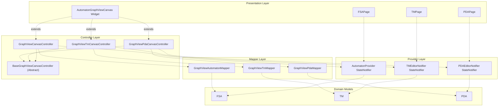
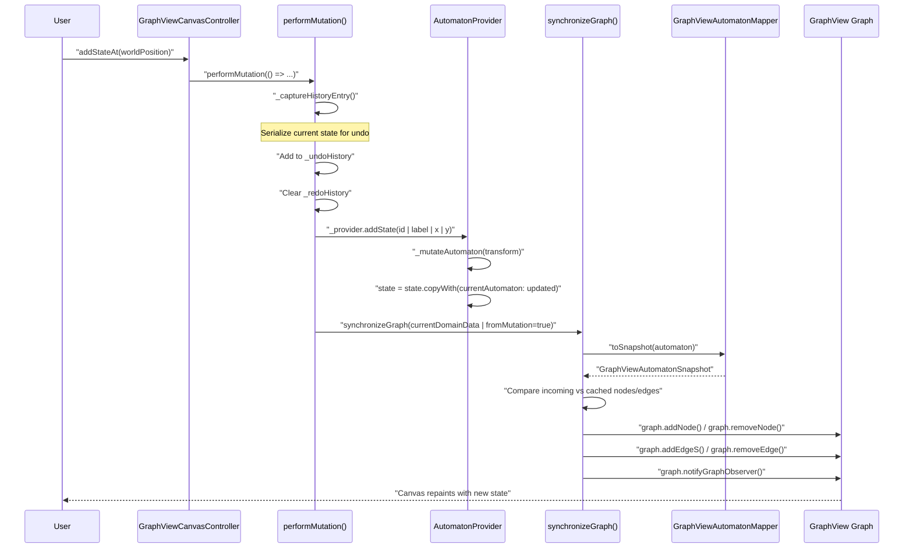
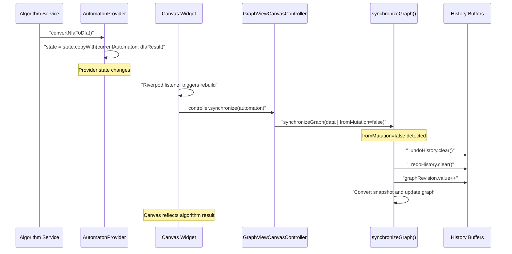
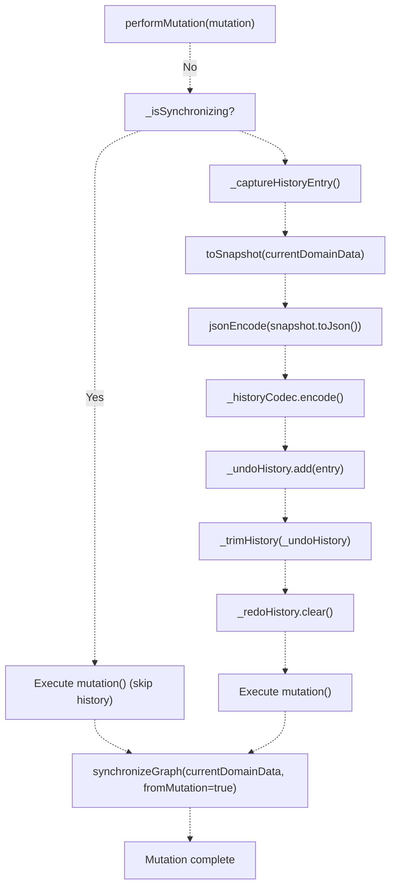
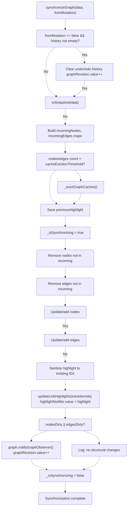
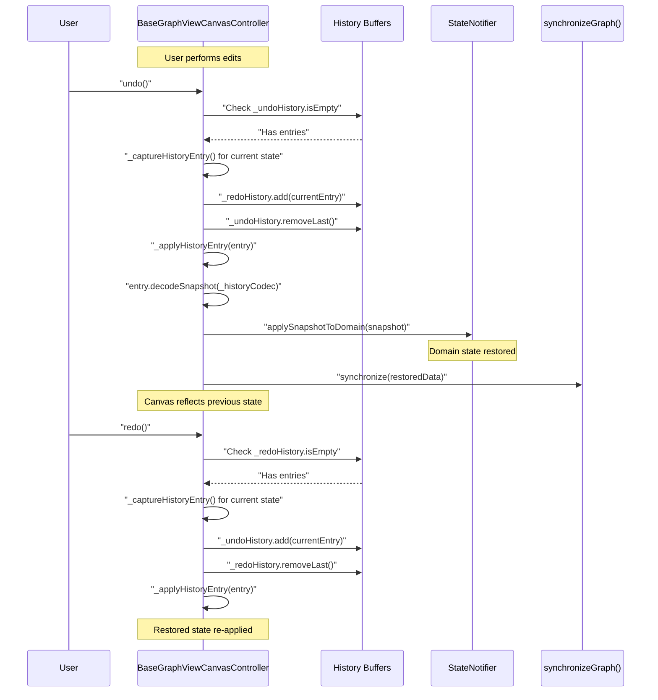

# Canvas-Provider Synchronization

> **Relevant source files**
> * [lib/core/dfa_algorithms.dart](https://github.com/ThalesMMS/JFlutter/blob/32e808b4/lib/core/dfa_algorithms.dart)
> * [lib/features/canvas/graphview/base_graphview_canvas_controller.dart](https://github.com/ThalesMMS/JFlutter/blob/32e808b4/lib/features/canvas/graphview/base_graphview_canvas_controller.dart)
> * [lib/features/canvas/graphview/graphview_canvas_controller.dart](https://github.com/ThalesMMS/JFlutter/blob/32e808b4/lib/features/canvas/graphview/graphview_canvas_controller.dart)
> * [lib/features/canvas/graphview/graphview_pda_canvas_controller.dart](https://github.com/ThalesMMS/JFlutter/blob/32e808b4/lib/features/canvas/graphview/graphview_pda_canvas_controller.dart)
> * [lib/features/canvas/graphview/graphview_pda_mapper.dart](https://github.com/ThalesMMS/JFlutter/blob/32e808b4/lib/features/canvas/graphview/graphview_pda_mapper.dart)
> * [lib/features/canvas/graphview/graphview_tm_canvas_controller.dart](https://github.com/ThalesMMS/JFlutter/blob/32e808b4/lib/features/canvas/graphview/graphview_tm_canvas_controller.dart)
> * [lib/features/canvas/graphview/graphview_tm_mapper.dart](https://github.com/ThalesMMS/JFlutter/blob/32e808b4/lib/features/canvas/graphview/graphview_tm_mapper.dart)
> * [lib/features/canvas/graphview/graphview_viewport_highlight_mixin.dart](https://github.com/ThalesMMS/JFlutter/blob/32e808b4/lib/features/canvas/graphview/graphview_viewport_highlight_mixin.dart)
> * [lib/injection/dependency_injection.dart](https://github.com/ThalesMMS/JFlutter/blob/32e808b4/lib/injection/dependency_injection.dart)
> * [lib/presentation/providers/automaton_provider.dart](https://github.com/ThalesMMS/JFlutter/blob/32e808b4/lib/presentation/providers/automaton_provider.dart)

## Purpose and Scope

This document describes the bidirectional synchronization mechanism between GraphView-based canvas controllers and Riverpod state providers. The system coordinates visual state (nodes, edges, positions) with domain models (FSA, TM, PDA) to maintain consistency during user interactions and algorithmic transformations.

For canvas widget architecture, see [AutomatonGraphViewCanvas Widget](#4.1). For provider implementations, see [Automaton Providers](#6.1). For undo/redo mechanics, see [Undo/Redo System](#4.6).

---

## Architecture Overview



**Synchronization Architecture**: Controllers hold references to providers and coordinate canvas state with domain models through mapper utilities. Each controller specializes for a specific automaton type while inheriting shared synchronization logic from the base controller.

Sources: [lib/features/canvas/graphview/base_graphview_canvas_controller.dart L57-L89](https://github.com/ThalesMMS/JFlutter/blob/32e808b4/lib/features/canvas/graphview/base_graphview_canvas_controller.dart#L57-L89)

 [lib/features/canvas/graphview/graphview_canvas_controller.dart L32-L50](https://github.com/ThalesMMS/JFlutter/blob/32e808b4/lib/features/canvas/graphview/graphview_canvas_controller.dart#L32-L50)

 [lib/features/canvas/graphview/graphview_tm_canvas_controller.dart L37-L54](https://github.com/ThalesMMS/JFlutter/blob/32e808b4/lib/features/canvas/graphview/graphview_tm_canvas_controller.dart#L37-L54)

 [lib/features/canvas/graphview/graphview_pda_canvas_controller.dart L34-L51](https://github.com/ThalesMMS/JFlutter/blob/32e808b4/lib/features/canvas/graphview/graphview_pda_canvas_controller.dart#L34-L51)

---

## Key Components

| Component | File | Purpose |
| --- | --- | --- |
| `BaseGraphViewCanvasController` | [lib/features/canvas/graphview/base_graphview_canvas_controller.dart L58-L595](https://github.com/ThalesMMS/JFlutter/blob/32e808b4/lib/features/canvas/graphview/base_graphview_canvas_controller.dart#L58-L595) | Abstract base providing synchronization primitives, cache management, and history tracking |
| `GraphViewCanvasController` | [lib/features/canvas/graphview/graphview_canvas_controller.dart L33-L277](https://github.com/ThalesMMS/JFlutter/blob/32e808b4/lib/features/canvas/graphview/graphview_canvas_controller.dart#L33-L277) | FSA-specific controller implementing finite automaton operations |
| `GraphViewTmCanvasController` | [lib/features/canvas/graphview/graphview_tm_canvas_controller.dart L37-L313](https://github.com/ThalesMMS/JFlutter/blob/32e808b4/lib/features/canvas/graphview/graphview_tm_canvas_controller.dart#L37-L313) | Turing Machine controller handling tape transitions |
| `GraphViewPdaCanvasController` | [lib/features/canvas/graphview/graphview_pda_canvas_controller.dart L34-L303](https://github.com/ThalesMMS/JFlutter/blob/32e808b4/lib/features/canvas/graphview/graphview_pda_canvas_controller.dart#L34-L303) | Pushdown Automaton controller managing stack operations |
| `AutomatonProvider` | [lib/presentation/providers/automaton_provider.dart L41-L1185](https://github.com/ThalesMMS/JFlutter/blob/32e808b4/lib/presentation/providers/automaton_provider.dart#L41-L1185) | FSA state provider with mutation operations |
| `GraphViewAutomatonMapper` | [lib/features/canvas/graphview/graphview_automaton_mapper.dart](https://github.com/ThalesMMS/JFlutter/blob/32e808b4/lib/features/canvas/graphview/graphview_automaton_mapper.dart) | FSA ↔ snapshot conversion |
| `GraphViewTmMapper` | [lib/features/canvas/graphview/graphview_tm_mapper.dart L22-L152](https://github.com/ThalesMMS/JFlutter/blob/32e808b4/lib/features/canvas/graphview/graphview_tm_mapper.dart#L22-L152) | TM ↔ snapshot conversion |
| `GraphViewPdaMapper` | [lib/features/canvas/graphview/graphview_pda_mapper.dart L22-L173](https://github.com/ThalesMMS/JFlutter/blob/32e808b4/lib/features/canvas/graphview/graphview_pda_mapper.dart#L22-L173) | PDA ↔ snapshot conversion |

Sources: [lib/features/canvas/graphview/base_graphview_canvas_controller.dart L58-L595](https://github.com/ThalesMMS/JFlutter/blob/32e808b4/lib/features/canvas/graphview/base_graphview_canvas_controller.dart#L58-L595)

 [lib/features/canvas/graphview/graphview_canvas_controller.dart L1-L277](https://github.com/ThalesMMS/JFlutter/blob/32e808b4/lib/features/canvas/graphview/graphview_canvas_controller.dart#L1-L277)

 [lib/presentation/providers/automaton_provider.dart L1-L1185](https://github.com/ThalesMMS/JFlutter/blob/32e808b4/lib/presentation/providers/automaton_provider.dart#L1-L1185)

---

## Synchronization Flow: User-Initiated Mutation



**User-Initiated Synchronization**: The `performMutation()` wrapper captures history, invokes provider methods, and triggers canvas synchronization. The mutation flag (`fromMutation=true`) preserves undo/redo history.

Sources: [lib/features/canvas/graphview/base_graphview_canvas_controller.dart L256-L281](https://github.com/ThalesMMS/JFlutter/blob/32e808b4/lib/features/canvas/graphview/base_graphview_canvas_controller.dart#L256-L281)

 [lib/features/canvas/graphview/graphview_canvas_controller.dart L141-L161](https://github.com/ThalesMMS/JFlutter/blob/32e808b4/lib/features/canvas/graphview/graphview_canvas_controller.dart#L141-L161)

 [lib/presentation/providers/automaton_provider.dart L125-L221](https://github.com/ThalesMMS/JFlutter/blob/32e808b4/lib/presentation/providers/automaton_provider.dart#L125-L221)

---

## Synchronization Flow: External Update



**External Synchronization**: Algorithm operations or file imports update the provider directly. The canvas detects provider changes and synchronizes with `fromMutation=false`, which clears undo/redo history since the change originated outside user interactions.

Sources: [lib/features/canvas/graphview/base_graphview_canvas_controller.dart L327-L337](https://github.com/ThalesMMS/JFlutter/blob/32e808b4/lib/features/canvas/graphview/base_graphview_canvas_controller.dart#L327-L337)

 [lib/features/canvas/graphview/graphview_canvas_controller.dart L63-L68](https://github.com/ThalesMMS/JFlutter/blob/32e808b4/lib/features/canvas/graphview/graphview_canvas_controller.dart#L63-L68)

 [lib/presentation/providers/automaton_provider.dart L764-L793](https://github.com/ThalesMMS/JFlutter/blob/32e808b4/lib/presentation/providers/automaton_provider.dart#L764-L793)

---

## Mutation Methods and Provider Coordination

### FSA Operations

The `GraphViewCanvasController` provides these mutation methods that coordinate with `AutomatonProvider`:

| Controller Method | Provider Method | Purpose |
| --- | --- | --- |
| `addStateAt(worldPosition)` | `addState(id, label, x, y, isInitial, isAccepting)` | Create or update state |
| `moveState(id, position)` | `moveState(id, x, y)` | Update state position |
| `updateStateLabel(id, label)` | `updateStateLabel(id, label)` | Change state label |
| `updateStateFlags(id, ...)` | `updateStateFlags(id, isInitial, isAccepting)` | Toggle initial/accepting flags |
| `removeState(id)` | `removeState(id)` | Delete state and connected transitions |
| `addOrUpdateTransition(...)` | `addOrUpdateTransition(id, fromStateId, toStateId, label, ...)` | Create/update transition |
| `removeTransition(id)` | `removeTransition(id)` | Delete transition |

**Pattern**: Each controller method generates stable IDs, resolves labels, and wraps the provider call in `performMutation()`.

Sources: [lib/features/canvas/graphview/graphview_canvas_controller.dart L141-L238](https://github.com/ThalesMMS/JFlutter/blob/32e808b4/lib/features/canvas/graphview/graphview_canvas_controller.dart#L141-L238)

 [lib/presentation/providers/automaton_provider.dart L125-L455](https://github.com/ThalesMMS/JFlutter/blob/32e808b4/lib/presentation/providers/automaton_provider.dart#L125-L455)

### TM Operations

`GraphViewTmCanvasController` extends this pattern with TM-specific methods:

```
void addOrUpdateTransition({  required String fromStateId,  required String toStateId,  String? readSymbol,  String? writeSymbol,  TapeDirection? direction,  String? transitionId,  double? controlPointX,  double? controlPointY,})
```

Sources: [lib/features/canvas/graphview/graphview_tm_canvas_controller.dart L204-L232](https://github.com/ThalesMMS/JFlutter/blob/32e808b4/lib/features/canvas/graphview/graphview_tm_canvas_controller.dart#L204-L232)

### PDA Operations

`GraphViewPdaCanvasController` handles stack operations:

```
void addOrUpdateTransition({  required String fromStateId,  required String toStateId,  String? readSymbol,  String? popSymbol,  String? pushSymbol,  bool? isLambdaInput,  bool? isLambdaPop,  bool? isLambdaPush,  String? transitionId,  double? controlPointX,  double? controlPointY,})
```

Sources: [lib/features/canvas/graphview/graphview_pda_canvas_controller.dart L204-L239](https://github.com/ThalesMMS/JFlutter/blob/32e808b4/lib/features/canvas/graphview/graphview_pda_canvas_controller.dart#L204-L239)

---

## The performMutation Workflow



**Mutation Workflow**: The `performMutation()` method in `BaseGraphViewCanvasController` wraps all state-changing operations with history capture and automatic synchronization. The `_isSynchronizing` flag prevents recursive history capture when `synchronizeGraph()` itself triggers updates.

Sources: [lib/features/canvas/graphview/base_graphview_canvas_controller.dart L256-L281](https://github.com/ThalesMMS/JFlutter/blob/32e808b4/lib/features/canvas/graphview/base_graphview_canvas_controller.dart#L256-L281)

---

## The synchronizeGraph Algorithm



**Synchronization Algorithm**: The core `synchronizeGraph()` method in `BaseGraphViewCanvasController` performs incremental updates by comparing incoming snapshots with cached nodes/edges. It preserves simulation highlights by sanitizing them to only include elements still present in the graph.

Sources: [lib/features/canvas/graphview/base_graphview_canvas_controller.dart L326-L494](https://github.com/ThalesMMS/JFlutter/blob/32e808b4/lib/features/canvas/graphview/base_graphview_canvas_controller.dart#L326-L494)

---

## Snapshot Conversion System

### GraphViewAutomatonSnapshot Structure

The snapshot format bridges domain models and canvas representation:

```
class GraphViewAutomatonSnapshot {  final List<GraphViewCanvasNode> nodes;  final List<GraphViewCanvasEdge> edges;  final GraphViewAutomatonMetadata metadata;}class GraphViewCanvasNode {  final String id;  final String label;  final double x;  final double y;  final bool isInitial;  final bool isAccepting;}class GraphViewCanvasEdge {  final String id;  final String fromStateId;  final String toStateId;  final String label;  final List<String> symbols;  final double? controlPointX;  final double? controlPointY;  // Type-specific fields:  final String? readSymbol;      // TM, PDA  final String? writeSymbol;     // TM  final TapeDirection? direction; // TM  final String? popSymbol;       // PDA  final String? pushSymbol;      // PDA  final bool? isLambdaInput;     // PDA  final bool? isLambdaPop;       // PDA  final bool? isLambdaPush;      // PDA}
```

Sources: [lib/features/canvas/graphview/graphview_canvas_models.dart](https://github.com/ThalesMMS/JFlutter/blob/32e808b4/lib/features/canvas/graphview/graphview_canvas_models.dart)

### Mapper Responsibilities

Each mapper implements bidirectional conversion:

**Domain → Snapshot** (`toSnapshot()`):

* Extract states as `GraphViewCanvasNode` objects with positions
* Extract transitions as `GraphViewCanvasEdge` objects with control points
* Preserve type-specific metadata (tape symbols, stack symbols)
* Package alphabet and automaton metadata

**Snapshot → Domain** (`mergeIntoTemplate()`):

* Reconstruct `State` objects from nodes
* Rebuild transitions with proper type wrappers (`FSATransition`, `TMTransition`, `PDATransition`)
* Infer lambda flags from empty symbols (PDA)
* Merge alphabet from template and snapshot
* Resolve initial/accepting states

Sources: [lib/features/canvas/graphview/graphview_automaton_mapper.dart](https://github.com/ThalesMMS/JFlutter/blob/32e808b4/lib/features/canvas/graphview/graphview_automaton_mapper.dart)

 [lib/features/canvas/graphview/graphview_tm_mapper.dart L26-L151](https://github.com/ThalesMMS/JFlutter/blob/32e808b4/lib/features/canvas/graphview/graphview_tm_mapper.dart#L26-L151)

 [lib/features/canvas/graphview/graphview_pda_mapper.dart L26-L172](https://github.com/ThalesMMS/JFlutter/blob/32e808b4/lib/features/canvas/graphview/graphview_pda_mapper.dart#L26-L172)

---

## History Management

### History Entry Format

```
class _GraphHistoryEntry {  final Uint8List serializedSnapshot;  // Compressed JSON  final SimulationHighlight highlight;  // Preserved highlight state}
```

History entries capture both the graph structure and the active simulation highlights using gzip compression via `createGraphHistoryCodec()`.

Sources: [lib/features/canvas/graphview/base_graphview_canvas_controller.dart L33-L55](https://github.com/ThalesMMS/JFlutter/blob/32e808b4/lib/features/canvas/graphview/base_graphview_canvas_controller.dart#L33-L55)

### Undo/Redo Implementation



**History Lifecycle**:

* `performMutation()` pushes to `_undoHistory` before mutations
* `undo()` pops from `_undoHistory`, pushes to `_redoHistory`, applies snapshot
* `redo()` pops from `_redoHistory`, pushes to `_undoHistory`, applies snapshot
* External synchronization (`fromMutation=false`) clears both buffers

**Limit**: History is capped at 20 entries (`kDefaultHistoryLimit`) with automatic trimming.

Sources: [lib/features/canvas/graphview/base_graphview_canvas_controller.dart L284-L323](https://github.com/ThalesMMS/JFlutter/blob/32e808b4/lib/features/canvas/graphview/base_graphview_canvas_controller.dart#L284-L323)

 [lib/features/canvas/graphview/base_graphview_canvas_controller.dart L525-L563](https://github.com/ThalesMMS/JFlutter/blob/32e808b4/lib/features/canvas/graphview/base_graphview_canvas_controller.dart#L525-L563)

---

## Cache Management

### Cache Structure

The base controller maintains four synchronized caches:

| Cache | Type | Purpose |
| --- | --- | --- |
| `_nodes` | `Map<String, GraphViewCanvasNode>` | Canvas-layer node metadata |
| `_edges` | `Map<String, GraphViewCanvasEdge>` | Canvas-layer edge metadata |
| `_graphNodes` | `Map<String, Node>` | GraphView library node instances |
| `_graphEdges` | `Map<String, Edge>` | GraphView library edge instances |

Sources: [lib/features/canvas/graphview/base_graphview_canvas_controller.dart L98-L101](https://github.com/ThalesMMS/JFlutter/blob/32e808b4/lib/features/canvas/graphview/base_graphview_canvas_controller.dart#L98-L101)

### Cache Eviction Strategy

```
final int cacheEvictionThreshold;  // Default: 250if (incomingNodes.length > cacheEvictionThreshold ||    incomingEdges.length > cacheEvictionThreshold) {  _evictGraphCaches(notifyGraph: false);}
```

When the graph exceeds the eviction threshold, all caches are cleared and rebuilt from scratch. This prevents memory bloat with large automata (e.g., after NFA→DFA conversion producing 1000+ states).

Sources: [lib/features/canvas/graphview/base_graphview_canvas_controller.dart L346-L354](https://github.com/ThalesMMS/JFlutter/blob/32e808b4/lib/features/canvas/graphview/base_graphview_canvas_controller.dart#L346-L354)

 [lib/features/canvas/graphview/base_graphview_canvas_controller.dart L572-L594](https://github.com/ThalesMMS/JFlutter/blob/32e808b4/lib/features/canvas/graphview/base_graphview_canvas_controller.dart#L572-L594)

### Incremental Update Logic

During `synchronizeGraph()`, the controller performs incremental cache updates:

1. **Removal Phase**: * Identify cached nodes not in incoming snapshot * Remove from `_nodes`, `_graphNodes`, and GraphView graph * Remove dependent edges automatically
2. **Edge Removal Phase**: * Identify cached edges not in incoming snapshot * Remove from `_edges`, `_graphEdges`, and GraphView graph
3. **Node Update Phase**: * For each incoming node: * If not cached: create `Node` instance, add to caches and graph * If cached: compare positions/metadata, update `Node.position` if changed
4. **Edge Update Phase**: * For each incoming edge: * If not cached: create `Edge` instance, add to caches and graph * If cached: update cache with new metadata

Sources: [lib/features/canvas/graphview/base_graphview_canvas_controller.dart L367-L463](https://github.com/ThalesMMS/JFlutter/blob/32e808b4/lib/features/canvas/graphview/base_graphview_canvas_controller.dart#L367-L463)

---

## Coordinate System Integration

Controllers convert viewport coordinates to world coordinates before invoking provider methods:

```
@protectedOffset toWorldOffset(Offset viewportOffset) {  final transformation = graphController.transformationController;  if (transformation == null) return viewportOffset;    final matrix = Matrix4.copy(transformation.value);  final determinant = matrix.invert();  if (determinant == 0) return viewportOffset;    final vector = matrix.transform3(    vmath.Vector3(viewportOffset.dx, viewportOffset.dy, 0),  );  return Offset(vector.x, vector.y);}
```

This ensures state positions stored in domain models represent world-space coordinates independent of viewport pan/zoom transformations.

Sources: [lib/features/canvas/graphview/base_graphview_canvas_controller.dart L177-L194](https://github.com/ThalesMMS/JFlutter/blob/32e808b4/lib/features/canvas/graphview/base_graphview_canvas_controller.dart#L177-L194)

---

## Highlight Preservation

### Highlight Sanitization

During synchronization, the controller sanitizes highlights to only include elements still present in the graph:

```javascript
final sanitizedHighlight = SimulationHighlight(  stateIds: previousHighlight.stateIds      .where((id) => incomingNodes.containsKey(id))      .toSet(),  transitionIds: previousHighlight.transitionIds      .where((id) => incomingEdges.containsKey(id))      .toSet(),);updateLinkHighlights(sanitizedHighlight.transitionIds);highlightNotifier.value = sanitizedHighlight;
```

This prevents dangling references when states/transitions are removed during mutations.

Sources: [lib/features/canvas/graphview/base_graphview_canvas_controller.dart L465-L478](https://github.com/ThalesMMS/JFlutter/blob/32e808b4/lib/features/canvas/graphview/base_graphview_canvas_controller.dart#L465-L478)

### Highlight Pruning

The `pruneLinkHighlight()` method removes highlights for specific edges:

```
@visibleForTestingvoid pruneLinkHighlight(String edgeId) {  if (!highlightedTransitionIds.contains(edgeId)) return;    final updatedHighlighted = Set<String>.from(highlightedTransitionIds)    ..remove(edgeId);  updateLinkHighlights(updatedHighlighted);    final currentHighlight = highlightNotifier.value;  if (currentHighlight.transitionIds.contains(edgeId)) {    final remaining = Set<String>.from(currentHighlight.transitionIds)      ..remove(edgeId);    if (remaining.isEmpty && currentHighlight.stateIds.isEmpty) {      highlightNotifier.value = SimulationHighlight.empty;    } else {      highlightNotifier.value = currentHighlight.copyWith(        transitionIds: remaining,      );    }  }}
```

This is invoked when edges are removed from the graph to maintain consistency.

Sources: [lib/features/canvas/graphview/base_graphview_canvas_controller.dart L496-L523](https://github.com/ThalesMMS/JFlutter/blob/32e808b4/lib/features/canvas/graphview/base_graphview_canvas_controller.dart#L496-L523)

---

## Type-Specific Synchronization

### FSA Synchronization

`GraphViewCanvasController` implements FSA-specific snapshot application:

```
@overridevoid applySnapshotToDomain(GraphViewAutomatonSnapshot snapshot) {  final template = _provider.state.currentAutomaton ??       FSA(/* default values */);    final merged = GraphViewAutomatonMapper.mergeIntoTemplate(snapshot, template)      .copyWith(        id: snapshot.metadata.id ?? template.id,        name: snapshot.metadata.name ?? template.name,        alphabet: snapshot.metadata.alphabet.isNotEmpty            ? snapshot.metadata.alphabet.toSet()            : template.alphabet,        modified: DateTime.now(),      );    _provider.updateAutomaton(merged);  synchronize(merged);}
```

Sources: [lib/features/canvas/graphview/graphview_canvas_controller.dart L240-L276](https://github.com/ThalesMMS/JFlutter/blob/32e808b4/lib/features/canvas/graphview/graphview_canvas_controller.dart#L240-L276)

### TM Synchronization

`GraphViewTmCanvasController` preserves TM-specific metadata:

```
@overridevoid applySnapshotToDomain(GraphViewAutomatonSnapshot snapshot) {  final template = _notifier.state.tm ?? TM(/* defaults with tapeAlphabet */);    final merged = GraphViewTmMapper.mergeIntoTemplate(snapshot, template)      .copyWith(        tapeAlphabet: snapshot.metadata.alphabet.isNotEmpty            ? snapshot.metadata.alphabet.toSet()            : template.tapeAlphabet,        modified: DateTime.now(),      );    _notifier.setTm(merged);  synchronize(merged);}
```

Sources: [lib/features/canvas/graphview/graphview_tm_canvas_controller.dart L272-L312](https://github.com/ThalesMMS/JFlutter/blob/32e808b4/lib/features/canvas/graphview/graphview_tm_canvas_controller.dart#L272-L312)

### PDA Synchronization

`GraphViewPdaCanvasController` handles stack alphabet:

```
@overridevoid applySnapshotToDomain(GraphViewAutomatonSnapshot snapshot) {  final template = _notifier.state.pda ??       PDA(/* defaults with stackAlphabet */);    final merged = GraphViewPdaMapper.mergeIntoTemplate(snapshot, template)      .copyWith(        alphabet: snapshot.metadata.alphabet.isNotEmpty            ? snapshot.metadata.alphabet.toSet()            : template.alphabet,        modified: DateTime.now(),      );    _notifier.setPda(merged);  synchronize(merged);}
```

Sources: [lib/features/canvas/graphview/graphview_pda_canvas_controller.dart L267-L302](https://github.com/ThalesMMS/JFlutter/blob/32e808b4/lib/features/canvas/graphview/graphview_pda_canvas_controller.dart#L267-L302)

---

## Dependency Injection Integration

Canvas controllers are instantiated with provider references via dependency injection:

```javascript
// In dependency_injection.dartgetIt.registerFactory<AutomatonProvider>(  () => AutomatonProvider(    automatonService: getIt<AutomatonService>(),    layoutRepository: getIt<LayoutRepository>(),    tracePersistenceService: getIt<TracePersistenceService>(),  ),);
```

Canvas widgets retrieve providers from Riverpod context and pass them to controller constructors:

```
final provider = ref.watch(automatonProvider.notifier);final controller = GraphViewCanvasController(  automatonProvider: provider,  // other parameters...);
```

This ensures controllers always operate on the current provider instance managing domain state.

Sources: [lib/injection/dependency_injection.dart L194-L200](https://github.com/ThalesMMS/JFlutter/blob/32e808b4/lib/injection/dependency_injection.dart#L194-L200)

---

## Debugging and Telemetry

### Debug Logging

Controllers emit structured debug logs in development mode:

```
void _logAutomatonCanvas(String message) {  if (kDebugMode) {    debugPrint('[GraphViewCanvasController] $message');  }}// Example usage:_logAutomatonCanvas(  'Synchronizing canvas with automaton id=${automaton?.id} states=${automaton?.states.length ?? 0} transitions=${automaton?.transitions.length ?? 0}',);
```

Log categories include:

* `[GraphViewBase]`: Base controller operations
* `[GraphViewCanvasController]`: FSA operations
* `[GraphViewTmCanvasController]`: TM operations
* `[GraphViewPdaCanvasController]`: PDA operations
* `[GraphViewViewport]`: Viewport/highlight operations

Sources: [lib/features/canvas/graphview/graphview_canvas_controller.dart L26-L30](https://github.com/ThalesMMS/JFlutter/blob/32e808b4/lib/features/canvas/graphview/graphview_canvas_controller.dart#L26-L30)

 [lib/features/canvas/graphview/base_graphview_canvas_controller.dart L27-L31](https://github.com/ThalesMMS/JFlutter/blob/32e808b4/lib/features/canvas/graphview/base_graphview_canvas_controller.dart#L27-L31)

### Mutation Tracing

`AutomatonProvider` includes detailed mutation telemetry:

```javascript
void _traceGraphView(String operation, [Map<String, Object?>? metadata]) {  if (!kDebugMode) return;    final buffer = StringBuffer('[AutomatonProvider] $operation');  if (metadata != null && metadata.isNotEmpty) {    final formatted = metadata.entries        .map((entry) => '${entry.key}=${entry.value}')        .join(', ');    buffer.write(' {$formatted}');  }    debugPrint(buffer.toString());}
```

This provides visibility into provider state changes during mutations:

```
[AutomatonProvider] addState {id=state_0, label=q0, x=250.00, y=150.00, initial=true, accepting=false}
[AutomatonProvider] mutation applied {seq=1, states=1, transitions=0, initial=state_0, accepting=0, alphabet=0}
```

Sources: [lib/presentation/providers/automaton_provider.dart L56-L70](https://github.com/ThalesMMS/JFlutter/blob/32e808b4/lib/presentation/providers/automaton_provider.dart#L56-L70)

 [lib/presentation/providers/automaton_provider.dart L605-L614](https://github.com/ThalesMMS/JFlutter/blob/32e808b4/lib/presentation/providers/automaton_provider.dart#L605-L614)

---

## Summary

The canvas-provider synchronization system implements a **bidirectional coordination pattern** where:

1. **User mutations** flow from canvas controllers → providers → domain models → back to canvas via `synchronizeGraph()`
2. **External updates** (algorithms, file imports) flow from services → providers → canvas via `synchronize()` calls
3. **Snapshot converters** provide lossless bidirectional mapping between domain models and canvas representations
4. **History management** captures compressed snapshots before mutations, enabling undo/redo
5. **Cache management** performs incremental updates for small changes and full rebuilds for large transformations
6. **Highlight preservation** sanitizes simulation highlights during synchronization to prevent dangling references

This architecture maintains strict consistency between visual representation and domain state while supporting complex operations like algorithm transformations, undo/redo, and real-time simulation highlighting.

Sources: [lib/features/canvas/graphview/base_graphview_canvas_controller.dart L1-L595](https://github.com/ThalesMMS/JFlutter/blob/32e808b4/lib/features/canvas/graphview/base_graphview_canvas_controller.dart#L1-L595)

 [lib/presentation/providers/automaton_provider.dart L1-L1185](https://github.com/ThalesMMS/JFlutter/blob/32e808b4/lib/presentation/providers/automaton_provider.dart#L1-L1185)

 [lib/features/canvas/graphview/graphview_canvas_controller.dart L1-L277](https://github.com/ThalesMMS/JFlutter/blob/32e808b4/lib/features/canvas/graphview/graphview_canvas_controller.dart#L1-L277)

Refresh this wiki

Last indexed: 30 December 2025 ([32e808](https://github.com/ThalesMMS/JFlutter/commit/32e808b4))

### On this page

* [Canvas-Provider Synchronization](#6.2-canvas-provider-synchronization)
* [Purpose and Scope](#6.2-purpose-and-scope)
* [Architecture Overview](#6.2-architecture-overview)
* [Key Components](#6.2-key-components)
* [Synchronization Flow: User-Initiated Mutation](#6.2-synchronization-flow-user-initiated-mutation)
* [Synchronization Flow: External Update](#6.2-synchronization-flow-external-update)
* [Mutation Methods and Provider Coordination](#6.2-mutation-methods-and-provider-coordination)
* [FSA Operations](#6.2-fsa-operations)
* [TM Operations](#6.2-tm-operations)
* [PDA Operations](#6.2-pda-operations)
* [The performMutation Workflow](#6.2-the-performmutation-workflow)
* [The synchronizeGraph Algorithm](#6.2-the-synchronizegraph-algorithm)
* [Snapshot Conversion System](#6.2-snapshot-conversion-system)
* [GraphViewAutomatonSnapshot Structure](#6.2-graphviewautomatonsnapshot-structure)
* [Mapper Responsibilities](#6.2-mapper-responsibilities)
* [History Management](#6.2-history-management)
* [History Entry Format](#6.2-history-entry-format)
* [Undo/Redo Implementation](#6.2-undoredo-implementation)
* [Cache Management](#6.2-cache-management)
* [Cache Structure](#6.2-cache-structure)
* [Cache Eviction Strategy](#6.2-cache-eviction-strategy)
* [Incremental Update Logic](#6.2-incremental-update-logic)
* [Coordinate System Integration](#6.2-coordinate-system-integration)
* [Highlight Preservation](#6.2-highlight-preservation)
* [Highlight Sanitization](#6.2-highlight-sanitization)
* [Highlight Pruning](#6.2-highlight-pruning)
* [Type-Specific Synchronization](#6.2-type-specific-synchronization)
* [FSA Synchronization](#6.2-fsa-synchronization)
* [TM Synchronization](#6.2-tm-synchronization)
* [PDA Synchronization](#6.2-pda-synchronization)
* [Dependency Injection Integration](#6.2-dependency-injection-integration)
* [Debugging and Telemetry](#6.2-debugging-and-telemetry)
* [Debug Logging](#6.2-debug-logging)
* [Mutation Tracing](#6.2-mutation-tracing)
* [Summary](#6.2-summary)

Ask Devin about JFlutter