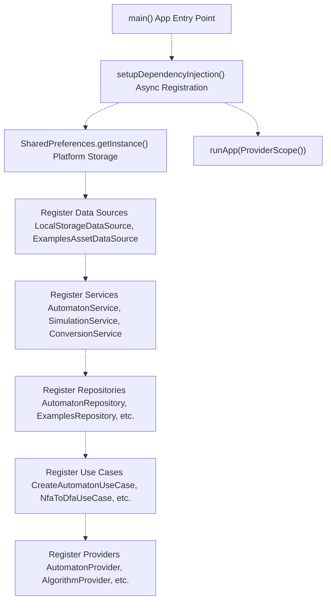
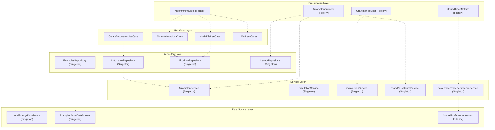
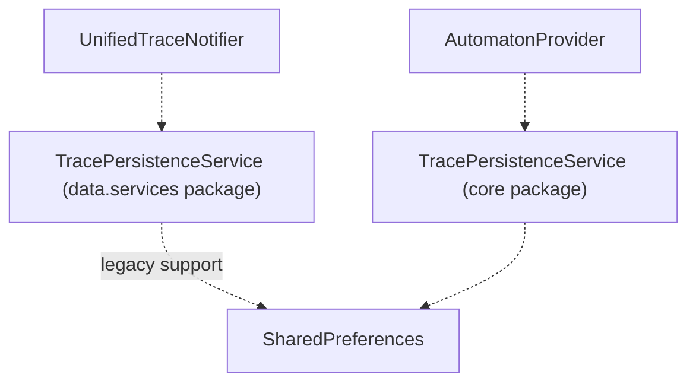

# Dependency Injection

> **Relevant source files**
> * [integration_test/app_simulation_test.dart](https://github.com/ThalesMMS/JFlutter/blob/32e808b4/integration_test/app_simulation_test.dart)
> * [integration_test/driver.dart](https://github.com/ThalesMMS/JFlutter/blob/32e808b4/integration_test/driver.dart)
> * [lib/core/dfa_algorithms.dart](https://github.com/ThalesMMS/JFlutter/blob/32e808b4/lib/core/dfa_algorithms.dart)
> * [lib/injection/dependency_injection.dart](https://github.com/ThalesMMS/JFlutter/blob/32e808b4/lib/injection/dependency_injection.dart)
> * [lib/presentation/providers/automaton_provider.dart](https://github.com/ThalesMMS/JFlutter/blob/32e808b4/lib/presentation/providers/automaton_provider.dart)
> * [pubspec.lock](https://github.com/ThalesMMS/JFlutter/blob/32e808b4/pubspec.lock)
> * [pubspec.yaml](https://github.com/ThalesMMS/JFlutter/blob/32e808b4/pubspec.yaml)

This page documents the dependency injection (DI) architecture used in JFlutter. The application uses **GetIt** as a service locator pattern to manage dependencies, providing a centralized container for instantiating and retrieving services, repositories, use cases, and providers throughout the application.

For information about how state management providers consume these dependencies, see [Automaton Providers](6a%20Automaton-Providers.md). For details on canvas-provider synchronization patterns, see [Canvas-Provider Synchronization](6b%20Canvas-Provider-Synchronization.md).

---

## Purpose and Scope

The dependency injection system serves three primary objectives:

1. **Decoupling**: Separates construction of objects from their usage, allowing components to depend on abstractions rather than concrete implementations
2. **Lifecycle Management**: Controls singleton vs. factory instantiation patterns to manage memory and state consistency
3. **Testability**: Enables dependency replacement and container reset for unit and integration testing

All dependency registration occurs in a single initialization function that must be called before the application starts.

**Sources:** [lib/injection/dependency_injection.dart L1-L237](https://github.com/ThalesMMS/JFlutter/blob/32e808b4/lib/injection/dependency_injection.dart#L1-L237)

---

## GetIt Container Architecture

### Global Service Locator

JFlutter uses a global `GetIt` instance as the service locator:

```
final GetIt getIt = GetIt.instance;
```

This instance is initialized once during application startup and provides access to all registered dependencies throughout the app lifecycle.

**Initialization Sequence:**



**Sources:** [lib/injection/dependency_injection.dart L35-L36](https://github.com/ThalesMMS/JFlutter/blob/32e808b4/lib/injection/dependency_injection.dart#L35-L36)

 [lib/injection/dependency_injection.dart L38-L231](https://github.com/ThalesMMS/JFlutter/blob/32e808b4/lib/injection/dependency_injection.dart#L38-L231)

---

## Registration Patterns

### Singleton vs. Factory Registration

GetIt supports two primary registration patterns used in JFlutter:

| Registration Type | Method | Lifecycle | Use Case |
| --- | --- | --- | --- |
| **Lazy Singleton** | `registerLazySingleton<T>()` | Single instance created on first access | Stateful services, repositories, data sources |
| **Factory** | `registerFactory<T>()` | New instance created on every access | Stateless providers, notifiers |

**Singleton Registration Example:**

```javascript
getIt.registerLazySingleton<AutomatonService>(() => AutomatonService());
```

**Factory Registration Example:**

```javascript
getIt.registerFactory<AutomatonProvider>(  () => AutomatonProvider(    automatonService: getIt<AutomatonService>(),    layoutRepository: getIt<LayoutRepository>(),    tracePersistenceService: getIt<TracePersistenceService>(),  ),);
```

**Sources:** [lib/injection/dependency_injection.dart L43-L81](https://github.com/ThalesMMS/JFlutter/blob/32e808b4/lib/injection/dependency_injection.dart#L43-L81)

 [lib/injection/dependency_injection.dart L194-L230](https://github.com/ThalesMMS/JFlutter/blob/32e808b4/lib/injection/dependency_injection.dart#L194-L230)

---

## Dependency Graph by Layer

The registration sequence follows clean architecture layer boundaries:



**Sources:** [lib/injection/dependency_injection.dart L38-L231](https://github.com/ThalesMMS/JFlutter/blob/32e808b4/lib/injection/dependency_injection.dart#L38-L231)

---

## Registered Components Inventory

### Data Sources

| Type | Registration | Purpose |
| --- | --- | --- |
| `LocalStorageDataSource` | Lazy Singleton | Persistent storage operations |
| `ExamplesAssetDataSource` | Lazy Singleton | Embedded example loading from assets |

**Sources:** [lib/injection/dependency_injection.dart L42-L49](https://github.com/ThalesMMS/JFlutter/blob/32e808b4/lib/injection/dependency_injection.dart#L42-L49)

### Services

| Type | Registration | Purpose |
| --- | --- | --- |
| `AutomatonService` | Lazy Singleton | In-memory automaton CRUD operations |
| `SimulationService` | Lazy Singleton | Execution engine for automata |
| `ConversionService` | Lazy Singleton | Grammar and format conversions |
| `TracePersistenceService` (core) | Lazy Singleton | Legacy trace persistence for `AutomatonProvider` |
| `TracePersistenceService` (data) | Lazy Singleton | Unified trace persistence with `SharedPreferences` |

**Sources:** [lib/injection/dependency_injection.dart L51-L66](https://github.com/ThalesMMS/JFlutter/blob/32e808b4/lib/injection/dependency_injection.dart#L51-L66)

### Repositories

| Type | Registration | Purpose |
| --- | --- | --- |
| `AutomatonRepository` | Lazy Singleton | Automaton data access abstraction |
| `ExamplesRepository` | Lazy Singleton | Example library access |
| `AlgorithmRepository` | Lazy Singleton | Algorithm execution coordination |
| `LayoutRepository` | Lazy Singleton | Auto-layout operations |

**Sources:** [lib/injection/dependency_injection.dart L68-L81](https://github.com/ThalesMMS/JFlutter/blob/32e808b4/lib/injection/dependency_injection.dart#L68-L81)

### Use Cases

The system registers **24 use cases** covering:

* **Automaton CRUD**: `CreateAutomatonUseCase`, `LoadAutomatonUseCase`, `SaveAutomatonUseCase`, `DeleteAutomatonUseCase`, `ExportAutomatonUseCase`, `ImportAutomatonUseCase`, `ValidateAutomatonUseCase`
* **State Operations**: `AddStateUseCase`, `RemoveStateUseCase`, `AddTransitionUseCase`, `RemoveTransitionUseCase`
* **Algorithms**: `NfaToDfaUseCase`, `MinimizeDfaUseCase`, `CompleteDfaUseCase`, `ComplementDfaUseCase`, `UnionDfaUseCase`, `IntersectionDfaUseCase`, `DifferenceDfaUseCase`, `PrefixClosureUseCase`, `SuffixClosureUseCase`, `RegexToNfaUseCase`, `DfaToRegexUseCase`, `FsaToGrammarUseCase`, `CheckEquivalenceUseCase`, `SimulateWordUseCase`, `CreateStepByStepSimulationUseCase`

All use cases are registered as **lazy singletons**.

**Sources:** [lib/injection/dependency_injection.dart L83-L191](https://github.com/ThalesMMS/JFlutter/blob/32e808b4/lib/injection/dependency_injection.dart#L83-L191)

### Providers

| Type | Registration | Dependencies | Purpose |
| --- | --- | --- | --- |
| `AutomatonProvider` | Factory | `AutomatonService`, `LayoutRepository`, `TracePersistenceService` | FSA state management |
| `AlgorithmProvider` | Factory | All algorithm use cases | Algorithm execution coordination |
| `GrammarProvider` | Factory | `ConversionService` | Grammar editing and analysis |
| `UnifiedTraceNotifier` | Factory | `data_trace.TracePersistenceService` | Centralized simulation history |

**Rationale for Factory Registration:** Providers are registered as factories because Riverpod manages their lifecycle. Each `StateNotifierProvider` or `StateProvider` in the widget tree requests a fresh instance from GetIt, allowing Riverpod to control disposal and rebuilding.

**Sources:** [lib/injection/dependency_injection.dart L193-L230](https://github.com/ThalesMMS/JFlutter/blob/32e808b4/lib/injection/dependency_injection.dart#L193-L230)

---

## SharedPreferences Initialization

The `SharedPreferences` instance is initialized asynchronously before other dependencies:

```javascript
Future<void> setupDependencyInjection() async {  // Initialize SharedPreferences for trace persistence  final prefs = await SharedPreferences.getInstance();    // ...later in registration:  getIt.registerLazySingleton<data_trace.TracePersistenceService>(    () => data_trace.TracePersistenceService(prefs),  );}
```

This ensures the platform-specific key-value storage is available before any services that depend on persistence are constructed.

**Sources:** [lib/injection/dependency_injection.dart L38-L66](https://github.com/ThalesMMS/JFlutter/blob/32e808b4/lib/injection/dependency_injection.dart#L38-L66)

---

## Dependency Resolution Patterns

### Constructor Injection

Dependencies are resolved via constructor parameters when registering components:

```javascript
getIt.registerFactory<AutomatonProvider>(  () => AutomatonProvider(    automatonService: getIt<AutomatonService>(),    layoutRepository: getIt<LayoutRepository>(),    tracePersistenceService: getIt<TracePersistenceService>(),  ),);
```

The `getIt<T>()` call retrieves the registered instance of type `T`. For singletons, this returns the same instance on every call. For factories, this creates a new instance.

**Sources:** [lib/injection/dependency_injection.dart L194-L200](https://github.com/ThalesMMS/JFlutter/blob/32e808b4/lib/injection/dependency_injection.dart#L194-L200)

### Provider Integration with Riverpod

Riverpod providers access GetIt-registered components through provider definitions:

```javascript
final automatonProvider = StateNotifierProvider<AutomatonProvider, AutomatonState>(  (ref) => getIt<AutomatonProvider>(),);
```

This bridges GetIt's service locator pattern with Riverpod's reactive state management, allowing providers to be both dependency-injected and lifecycle-managed by the widget tree.

**Sources:** [lib/presentation/providers/automaton_provider.dart L41-L54](https://github.com/ThalesMMS/JFlutter/blob/32e808b4/lib/presentation/providers/automaton_provider.dart#L41-L54)

---

## Testing Support

### Container Reset

The `resetDependencies()` function clears all registered dependencies:

```
void resetDependencies() {  getIt.reset();}
```

This is useful in unit tests to ensure each test starts with a clean dependency graph.

**Sources:** [lib/injection/dependency_injection.dart L233-L236](https://github.com/ThalesMMS/JFlutter/blob/32e808b4/lib/injection/dependency_injection.dart#L233-L236)

### Accessing Container in Integration Tests

Integration tests access the GetIt container through the Riverpod `ProviderScope`:

```
final container = ProviderScope.containerOf(  tester.element(materialAppFinder),  listen: false,);container.read(automatonProvider.notifier).replaceCurrentAutomaton(automaton!);
```

**Sources:** [integration_test/app_simulation_test.dart L28-L44](https://github.com/ThalesMMS/JFlutter/blob/32e808b4/integration_test/app_simulation_test.dart#L28-L44)

---

## Dual TracePersistenceService Registration

The system registers **two separate implementations** of `TracePersistenceService`:



| Service | Type | Consumer | Purpose |
| --- | --- | --- | --- |
| `TracePersistenceService` (core) | Interface/Factory | `AutomatonProvider` | Legacy trace storage abstraction |
| `data_trace.TracePersistenceService` | Concrete implementation | `UnifiedTraceNotifier` | Shared preferences-backed persistence |

This dual registration supports both legacy provider integration and the newer unified trace system without breaking existing functionality.

**Sources:** [lib/injection/dependency_injection.dart L58-L66](https://github.com/ThalesMMS/JFlutter/blob/32e808b4/lib/injection/dependency_injection.dart#L58-L66)

 [lib/injection/dependency_injection.dart L228-L230](https://github.com/ThalesMMS/JFlutter/blob/32e808b4/lib/injection/dependency_injection.dart#L228-L230)

---

## Registration Order and Dependencies

The registration sequence ensures dependencies are available before dependents:

1. **Async Prerequisites**: `SharedPreferences` instance created first
2. **Foundation Layer**: Data sources registered (no dependencies)
3. **Service Layer**: Services registered (may depend on data sources)
4. **Repository Layer**: Repositories registered (depend on services/data sources)
5. **Use Case Layer**: Use cases registered (depend on repositories)
6. **Presentation Layer**: Providers registered as factories (depend on services/use cases/repositories)

This ordering prevents `GetIt` resolution errors where a dependency is accessed before registration.

**Sources:** [lib/injection/dependency_injection.dart L38-L231](https://github.com/ThalesMMS/JFlutter/blob/32e808b4/lib/injection/dependency_injection.dart#L38-L231)

---

## Package Dependencies

The dependency injection system relies on the following packages:

| Package | Version | Purpose |
| --- | --- | --- |
| `get_it` | ^8.0.0 | Service locator container |
| `shared_preferences` | ^2.3.2 | Platform storage for persistence |
| `riverpod` / `flutter_riverpod` | ^2.5.1 | State management integration |

**Sources:** [pubspec.yaml L64-L67](https://github.com/ThalesMMS/JFlutter/blob/32e808b4/pubspec.yaml#L64-L67)


### On this page

* [Dependency Injection](#6.3-dependency-injection)
* [Purpose and Scope](#6.3-purpose-and-scope)
* [GetIt Container Architecture](#6.3-getit-container-architecture)
* [Global Service Locator](#6.3-global-service-locator)
* [Registration Patterns](#6.3-registration-patterns)
* [Singleton vs. Factory Registration](#6.3-singleton-vs-factory-registration)
* [Dependency Graph by Layer](#6.3-dependency-graph-by-layer)
* [Registered Components Inventory](#6.3-registered-components-inventory)
* [Data Sources](#6.3-data-sources)
* [Services](#6.3-services)
* [Repositories](#6.3-repositories)
* [Use Cases](#6.3-use-cases)
* [Providers](#6.3-providers)
* [SharedPreferences Initialization](#6.3-sharedpreferences-initialization)
* [Dependency Resolution Patterns](#6.3-dependency-resolution-patterns)
* [Constructor Injection](#6.3-constructor-injection)
* [Provider Integration with Riverpod](#6.3-provider-integration-with-riverpod)
* [Testing Support](#6.3-testing-support)
* [Container Reset](#6.3-container-reset)
* [Accessing Container in Integration Tests](#6.3-accessing-container-in-integration-tests)
* [Dual TracePersistenceService Registration](#6.3-dual-tracepersistenceservice-registration)
* [Registration Order and Dependencies](#6.3-registration-order-and-dependencies)
* [Package Dependencies](#6.3-package-dependencies)

Ask Devin about JFlutter