# Algorithms and Simulation

> **Relevant source files**
> * [docs/reference-deviations.md](https://github.com/ThalesMMS/JFlutter/blob/32e808b4/docs/reference-deviations.md)
> * [lib/core/algorithms/nfa_to_dfa_converter.dart](https://github.com/ThalesMMS/JFlutter/blob/32e808b4/lib/core/algorithms/nfa_to_dfa_converter.dart)
> * [lib/presentation/widgets/grammar_algorithm_panel.dart](https://github.com/ThalesMMS/JFlutter/blob/32e808b4/lib/presentation/widgets/grammar_algorithm_panel.dart)
> * [lib/presentation/widgets/grammar_simulation_panel.dart](https://github.com/ThalesMMS/JFlutter/blob/32e808b4/lib/presentation/widgets/grammar_simulation_panel.dart)
> * [lib/presentation/widgets/pda_algorithm_panel.dart](https://github.com/ThalesMMS/JFlutter/blob/32e808b4/lib/presentation/widgets/pda_algorithm_panel.dart)
> * [lib/presentation/widgets/tm_algorithm_panel.dart](https://github.com/ThalesMMS/JFlutter/blob/32e808b4/lib/presentation/widgets/tm_algorithm_panel.dart)
> * [test/unit/core/automata/fa_algorithms_test.dart](https://github.com/ThalesMMS/JFlutter/blob/32e808b4/test/unit/core/automata/fa_algorithms_test.dart)
> * [test/unit/core/cfg/cyk_parser_test.dart](https://github.com/ThalesMMS/JFlutter/blob/32e808b4/test/unit/core/cfg/cyk_parser_test.dart)
> * [test/unit/grammar_to_pda_validation_test.dart](https://github.com/ThalesMMS/JFlutter/blob/32e808b4/test/unit/grammar_to_pda_validation_test.dart)

## Purpose and Scope

This page provides an overview of JFlutter's algorithm execution and simulation infrastructure, covering how algorithms are invoked, how results are propagated, and how visual feedback is delivered to users. For detailed documentation on specific algorithms (NFA→DFA conversion, minimization, etc.), see [Core Algorithms](#7.1). For step-by-step simulation mechanics and trace persistence, see [Simulation System](#7.2). For UI-level algorithm panels and their integration patterns, see [Algorithm Panels](#7.3).

This document focuses on:

* The `Result<T>` pattern for functional error handling
* Use case orchestration between UI and core algorithms
* Simulation execution pipeline architecture
* Visual highlighting and user feedback mechanisms
* Diagnostic and validation services

---

## Architecture Overview

JFlutter implements a clean separation between algorithm execution (core layer) and user interaction (presentation layer), with use cases acting as boundary objects that translate between domain models and UI state.

### High-Level Algorithm Execution Flow


**Sources:** [lib/presentation/widgets/simulation_panel.dart L1-L697](https://github.com/ThalesMMS/JFlutter/blob/32e808b4/lib/presentation/widgets/simulation_panel.dart#L1-L697)

 [lib/core/use_cases/algorithm_use_cases.dart L1-L202](https://github.com/ThalesMMS/JFlutter/blob/32e808b4/lib/core/use_cases/algorithm_use_cases.dart#L1-L202)

 [lib/core/result.dart L1-L163](https://github.com/ThalesMMS/JFlutter/blob/32e808b4/lib/core/result.dart#L1-L163)

---

## Result Pattern for Error Handling

All algorithms in JFlutter return a `Result<T>` type, a sealed class with two variants: `Success<T>` and `Failure<T>`. This pattern eliminates null checks and provides composable error handling throughout the application.

### Result Type Definition

The `Result<T>` type is defined in [lib/core/result.dart L17-L66](https://github.com/ThalesMMS/JFlutter/blob/32e808b4/lib/core/result.dart#L17-L66)

 with the following structure:

| Variant | Purpose | Data Field |
| --- | --- | --- |
| `Success<T>` | Encapsulates successful computation | `T data` |
| `Failure<T>` | Encapsulates error message | `String message` |

**Key methods:**

* `isSuccess` / `isFailure` - Type checking properties
* `data` / `error` - Safe accessors that return nullable types
* `map<R>()` - Transform success value, propagate failure
* `onSuccess()` / `onFailure()` - Side-effect callbacks

### Result Usage Pattern


**Example from TM Algorithm Panel** [lib/presentation/widgets/tm_algorithm_panel.dart L561-L584](https://github.com/ThalesMMS/JFlutter/blob/32e808b4/lib/presentation/widgets/tm_algorithm_panel.dart#L561-L584)

:

```
final Result<TMAnalysis> result = AlgorithmOperations.analyzeTm(tm);setState(() {  _isAnalyzing = false;  if (result.isSuccess) {    _analysis = result.data;    _analyzedTm = tm;  } else {    _analysisError = result.error ?? 'Analysis failed...';  }});
```

**Sources:** [lib/core/result.dart L1-L163](https://github.com/ThalesMMS/JFlutter/blob/32e808b4/lib/core/result.dart#L1-L163)

 [lib/presentation/widgets/tm_algorithm_panel.dart L543-L585](https://github.com/ThalesMMS/JFlutter/blob/32e808b4/lib/presentation/widgets/tm_algorithm_panel.dart#L543-L585)

 [lib/core/error_handler.dart L98-L114](https://github.com/ThalesMMS/JFlutter/blob/32e808b4/lib/core/error_handler.dart#L98-L114)

---

## Use Case Architecture

Use cases provide a clean boundary between the presentation layer and core domain logic. Each use case encapsulates a single algorithm operation and handles repository interaction.

### Use Case Classes

The following use cases are defined in [lib/core/use_cases/algorithm_use_cases.dart L1-L202](https://github.com/ThalesMMS/JFlutter/blob/32e808b4/lib/core/use_cases/algorithm_use_cases.dart#L1-L202)

:

| Use Case | Purpose | Return Type |
| --- | --- | --- |
| `NfaToDfaUseCase` | Convert NFA to DFA | `Result<AutomatonEntity>` |
| `RemoveLambdaTransitionsUseCase` | Eliminate ε-transitions | `Result<AutomatonEntity>` |
| `MinimizeDfaUseCase` | Minimize DFA states | `Result<AutomatonEntity>` |
| `CompleteDfaUseCase` | Add sink state | `Result<AutomatonEntity>` |
| `ComplementDfaUseCase` | Complement DFA | `Result<AutomatonEntity>` |
| `UnionDfaUseCase` | Union of two DFAs | `Result<AutomatonEntity>` |
| `IntersectionDfaUseCase` | Intersection of DFAs | `Result<AutomatonEntity>` |
| `SimulateWordUseCase` | Execute simulation | `Result<SimulationResult>` |
| `CreateStepByStepSimulationUseCase` | Generate step sequence | `Result<List<SimulationStep>>` |

### Use Case Invocation Pattern


**Sources:** [lib/core/use_cases/algorithm_use_cases.dart L40-L48](https://github.com/ThalesMMS/JFlutter/blob/32e808b4/lib/core/use_cases/algorithm_use_cases.dart#L40-L48)

 [lib/presentation/widgets/pda_algorithm_panel.dart L341-L413](https://github.com/ThalesMMS/JFlutter/blob/32e808b4/lib/presentation/widgets/pda_algorithm_panel.dart#L341-L413)

---

## Simulation Execution Pipeline

Simulation involves executing an automaton on an input string and tracking the sequence of state transitions. JFlutter supports both immediate acceptance/rejection and step-by-step visualization.

### Simulation Data Flow


**Key Models:**

* `SimulationResult` - Contains acceptance verdict, steps, and error messages
* `SimulationStep` - Represents a single configuration during execution * `currentState`: Current automaton state * `remainingInput`: Unconsumed portion of input * `usedTransition`: Symbol/label of transition taken * `nextState`: Destination state (optional)

**Sources:** [lib/presentation/widgets/simulation_panel.dart L66-L88](https://github.com/ThalesMMS/JFlutter/blob/32e808b4/lib/presentation/widgets/simulation_panel.dart#L66-L88)

 [lib/core/use_cases/algorithm_use_cases.dart L176-L187](https://github.com/ThalesMMS/JFlutter/blob/32e808b4/lib/core/use_cases/algorithm_use_cases.dart#L176-L187)

---

## Visual Feedback System

JFlutter provides real-time visual feedback during step-by-step simulation by highlighting active states and transitions on the canvas.

### Simulation Highlight Architecture


**Highlight Computation Logic** [lib/core/services/simulation_highlight_service.dart L104-L143](https://github.com/ThalesMMS/JFlutter/blob/32e808b4/lib/core/services/simulation_highlight_service.dart#L104-L143)

:

1. Extract current step from list
2. Collect `currentState` and `nextState` IDs
3. Collect `usedTransition` ID if present
4. Build immutable `SimulationHighlight` with state and transition sets
5. Dispatch to registered channel

**Sources:** [lib/core/services/simulation_highlight_service.dart L62-L189](https://github.com/ThalesMMS/JFlutter/blob/32e808b4/lib/core/services/simulation_highlight_service.dart#L62-L189)

 [lib/presentation/widgets/simulation_panel.dart L685-L695](https://github.com/ThalesMMS/JFlutter/blob/32e808b4/lib/presentation/widgets/simulation_panel.dart#L685-L695)

---

## Algorithm Panel Integration

Each automaton type has a dedicated algorithm panel that groups related operations and manages execution state.

### Algorithm Panel Responsibilities

| Panel | Location | Key Algorithms |
| --- | --- | --- |
| FSA Algorithm Panel | Not shown in provided files | NFA→DFA, Minimization, Complement, Union, etc. |
| PDA Algorithm Panel | [lib/presentation/widgets/pda_algorithm_panel.dart](https://github.com/ThalesMMS/JFlutter/blob/32e808b4/lib/presentation/widgets/pda_algorithm_panel.dart) | PDA→CFG, Minimize, Check Determinism, Reachability, Language Analysis |
| TM Algorithm Panel | [lib/presentation/widgets/tm_algorithm_panel.dart](https://github.com/ThalesMMS/JFlutter/blob/32e808b4/lib/presentation/widgets/tm_algorithm_panel.dart) | Decidability Check, Reachability, Language Analysis, Tape Operations |
| Grammar Algorithm Panel | [lib/presentation/widgets/grammar_algorithm_panel.dart](https://github.com/ThalesMMS/JFlutter/blob/32e808b4/lib/presentation/widgets/grammar_algorithm_panel.dart) | Left Recursion Removal, Left Factoring, FIRST/FOLLOW, Parse Table, Ambiguity |

### Common Panel Pattern

All algorithm panels follow a consistent structure:


**Example: PDA Algorithm Panel Execution** [lib/presentation/widgets/pda_algorithm_panel.dart L654-L688](https://github.com/ThalesMMS/JFlutter/blob/32e808b4/lib/presentation/widgets/pda_algorithm_panel.dart#L654-L688)

:

```
void _performAnalysis(  String algorithmName,  Future<String> Function() analysisFunction, {  bool resetConvertedGrammar = true,}) {  setState(() {    _isAnalyzing = true;    _analysisResult = null;    if (resetConvertedGrammar) {      _latestConvertedGrammar = null;    }  });  Future.microtask(() async {    try {      final output = await analysisFunction();      if (!mounted) return;      setState(() {        _isAnalyzing = false;        _analysisResult = '=== $algorithmName ===\n\n$output';      });    } catch (error) {      // Handle error...    }  });}
```

**Sources:** [lib/presentation/widgets/pda_algorithm_panel.dart L654-L688](https://github.com/ThalesMMS/JFlutter/blob/32e808b4/lib/presentation/widgets/pda_algorithm_panel.dart#L654-L688)

 [lib/presentation/widgets/tm_algorithm_panel.dart L543-L585](https://github.com/ThalesMMS/JFlutter/blob/32e808b4/lib/presentation/widgets/tm_algorithm_panel.dart#L543-L585)

 [lib/presentation/widgets/grammar_algorithm_panel.dart L573-L622](https://github.com/ThalesMMS/JFlutter/blob/32e808b4/lib/presentation/widgets/grammar_algorithm_panel.dart#L573-L622)

---

## Error Handling and Diagnostics

JFlutter provides comprehensive error handling through the `ErrorHandler` utility and diagnostic services that analyze automaton structures.

### Error Display Utilities

The `ErrorHandler` class [lib/core/error_handler.dart L16-L196](https://github.com/ThalesMMS/JFlutter/blob/32e808b4/lib/core/error_handler.dart#L16-L196)

 provides static methods for displaying user feedback:

| Method | Purpose | Visual Style |
| --- | --- | --- |
| `showError()` | Display error messages | Red SnackBar, 4s duration |
| `showSuccess()` | Confirm successful operations | Green SnackBar, 3s duration |
| `showWarning()` | Non-critical issues | Orange SnackBar, 4s duration |
| `showInfo()` | Informational messages | Blue SnackBar, 3s duration |
| `handleResult<T>()` | Process Result automatically | Auto-select style based on success/failure |

### Diagnostic Services

Two diagnostic services analyze automaton structures:

1. **DiagnosticsService** [lib/core/services/diagnostics_service.dart L18-L455](https://github.com/ThalesMMS/JFlutter/blob/32e808b4/lib/core/services/diagnostics_service.dart#L18-L455) * `validateAutomaton(FSA)` - Structural validation * `analyzeSimulationFailure()` - Simulation error analysis * Returns `List<DiagnosticMessage>` with severity levels
2. **DiagnosticService** [lib/core/services/diagnostic_service.dart L18-L643](https://github.com/ThalesMMS/JFlutter/blob/32e808b4/lib/core/services/diagnostic_service.dart#L18-L643) * More comprehensive analysis with categories * Structural, semantic, performance, and usability checks * Returns `DiagnosticResult` with grouped issues

### Validation Flow


**Validation Categories** [lib/core/validators/input_validators.dart L22-L518](https://github.com/ThalesMMS/JFlutter/blob/32e808b4/lib/core/validators/input_validators.dart#L22-L518)

:

* Structure validation (empty automaton, missing initial state)
* Alphabet validation (alphabet coverage, symbol membership)
* Transition validation (valid source/target states, determinism)
* Semantic validation (reachability, dead states)

**Sources:** [lib/core/error_handler.dart L16-L221](https://github.com/ThalesMMS/JFlutter/blob/32e808b4/lib/core/error_handler.dart#L16-L221)

 [lib/core/validators/input_validators.dart L29-L518](https://github.com/ThalesMMS/JFlutter/blob/32e808b4/lib/core/validators/input_validators.dart#L29-L518)

 [lib/core/services/diagnostics_service.dart L18-L455](https://github.com/ThalesMMS/JFlutter/blob/32e808b4/lib/core/services/diagnostics_service.dart#L18-L455)

---

## Algorithm Logging

The `AlgoLog` utility [lib/core/algo_log.dart L16-L61](https://github.com/ThalesMMS/JFlutter/blob/32e808b4/lib/core/algo_log.dart#L16-L61)

 provides centralized logging for algorithm execution steps:

**Features:**

* `addLine(String)` - Append log entry
* `clear()` - Reset log state
* `highlightStates(Set<String>)` - Mark states for visual emphasis
* Reactive `ValueNotifier` streams for UI binding

**Usage Pattern:**

```
AlgoLog.clear();AlgoLog.addLine('Starting NFA to DFA conversion...');AlgoLog.highlightStates({'q0', 'q1'});// ... algorithm execution ...AlgoLog.addLine('Conversion complete: ${result.states.length} states');
```

This logging system is primarily used for debugging and educational purposes, allowing users to follow algorithm logic step-by-step.

**Sources:** [lib/core/algo_log.dart L16-L61](https://github.com/ThalesMMS/JFlutter/blob/32e808b4/lib/core/algo_log.dart#L16-L61)

---

## Grammar Simulation and Parsing

Grammar simulation follows a distinct pattern from automaton simulation, using parsing algorithms (CYK, LL, LR) to test string membership.

### Grammar Parser Flow

```mermaid
flowchart TD

SimPanel["GrammarSimulationPanel"]
AlgoSelector["Algorithm Selector CYK / LL / LR"]
InputField["Input String Field"]
ParseButton["Parse Button"]
MapHint["_mapSelectedAlgorithmToHint()"]
Hint["ParsingStrategyHint .cyk / .ll / .lr / .auto"]
GrammarParser["GrammarParser.parse"]
Strategy["Select Strategy"]
Execute["Execute Parser"]
ParseResult["ParseResult accepted: bool derivations: List<List<String>> executionTime: Duration errorMessage: String"]
ResultCard["Result Card Accepted/Rejected"]
StepsDisplay["Derivation Steps S ⇒ aS ⇒ aab"]
TimeDisplay["Execution Time μs / ms / s"]

ParseButton -.-> MapHint
Hint -.-> GrammarParser
Execute -.-> ParseResult
ParseResult -.-> ResultCard
ParseResult -.-> StepsDisplay
ParseResult -.-> TimeDisplay

subgraph subGraph4 ["Result Display"]
    ResultCard
    StepsDisplay
    TimeDisplay
end

subgraph subGraph3 ["Parse Result"]
    ParseResult
end

subgraph subGraph2 ["Core Parsing"]
    GrammarParser
    Strategy
    Execute
    GrammarParser -.-> Strategy
    Strategy -.-> Execute
end

subgraph subGraph1 ["Parser Selection"]
    MapHint
    Hint
    MapHint -.-> Hint
end

subgraph subGraph0 ["UI Layer"]
    SimPanel
    AlgoSelector
    InputField
    ParseButton
    SimPanel -.-> AlgoSelector
    AlgoSelector -.-> InputField
    InputField -.-> ParseButton
end
```



**Key Differences from Automaton Simulation:**

* No state-by-state stepping (derivation-based instead)
* Multiple parsing strategies available
* Focus on derivation trees rather than configuration sequences
* Execution time metrics for performance analysis

**Sources:** [lib/presentation/widgets/grammar_simulation_panel.dart L327-L395](https://github.com/ThalesMMS/JFlutter/blob/32e808b4/lib/presentation/widgets/grammar_simulation_panel.dart#L327-L395)

 [lib/presentation/widgets/grammar_simulation_panel.dart L414-L431](https://github.com/ThalesMMS/JFlutter/blob/32e808b4/lib/presentation/widgets/grammar_simulation_panel.dart#L414-L431)

---

## Summary

JFlutter's algorithm and simulation infrastructure provides:

1. **Consistent Error Handling**: `Result<T>` pattern eliminates exceptions and null checks
2. **Clean Use Case Boundaries**: Separation between UI, orchestration, and core logic
3. **Rich Visual Feedback**: Real-time highlighting during step-by-step execution
4. **Comprehensive Diagnostics**: Validation and analysis services for all model types
5. **Modular Panel Architecture**: Consistent UI patterns across algorithm types

For implementation details of specific algorithms, see [Core Algorithms](#7.1). For simulation trace persistence and step navigation, see [Simulation System](#7.2). For UI component details, see [Algorithm Panels](#7.3).

Refresh this wiki

Last indexed: 30 December 2025 ([32e808](https://github.com/ThalesMMS/JFlutter/commit/32e808b4))

### On this page

* [Algorithms and Simulation](#7-algorithms-and-simulation)
* [Purpose and Scope](#7-purpose-and-scope)
* [Architecture Overview](#7-architecture-overview)
* [High-Level Algorithm Execution Flow](#7-high-level-algorithm-execution-flow)
* [Result Pattern for Error Handling](#7-result-pattern-for-error-handling)
* [Result Type Definition](#7-result-type-definition)
* [Result Usage Pattern](#7-result-usage-pattern)
* [Use Case Architecture](#7-use-case-architecture)
* [Use Case Classes](#7-use-case-classes)
* [Use Case Invocation Pattern](#7-use-case-invocation-pattern)
* [Simulation Execution Pipeline](#7-simulation-execution-pipeline)
* [Simulation Data Flow](#7-simulation-data-flow)
* [Visual Feedback System](#7-visual-feedback-system)
* [Simulation Highlight Architecture](#7-simulation-highlight-architecture)
* [Algorithm Panel Integration](#7-algorithm-panel-integration)
* [Algorithm Panel Responsibilities](#7-algorithm-panel-responsibilities)
* [Common Panel Pattern](#7-common-panel-pattern)
* [Error Handling and Diagnostics](#7-error-handling-and-diagnostics)
* [Error Display Utilities](#7-error-display-utilities)
* [Diagnostic Services](#7-diagnostic-services)
* [Validation Flow](#7-validation-flow)
* [Algorithm Logging](#7-algorithm-logging)
* [Grammar Simulation and Parsing](#7-grammar-simulation-and-parsing)
* [Grammar Parser Flow](#7-grammar-parser-flow)
* [Summary](#7-summary)

Ask Devin about JFlutter