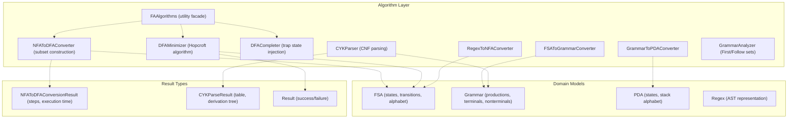
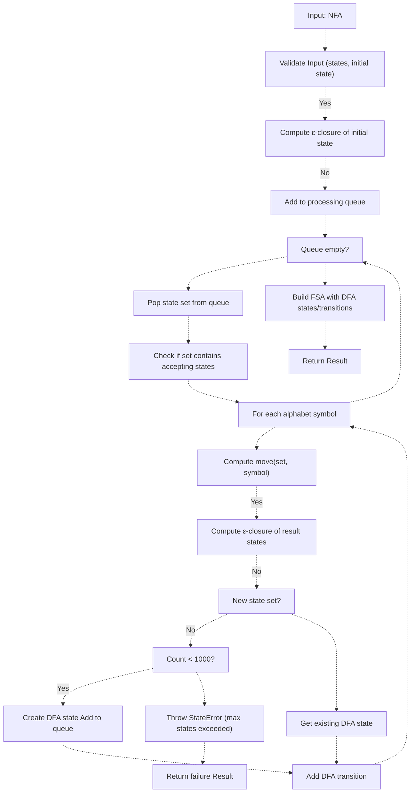
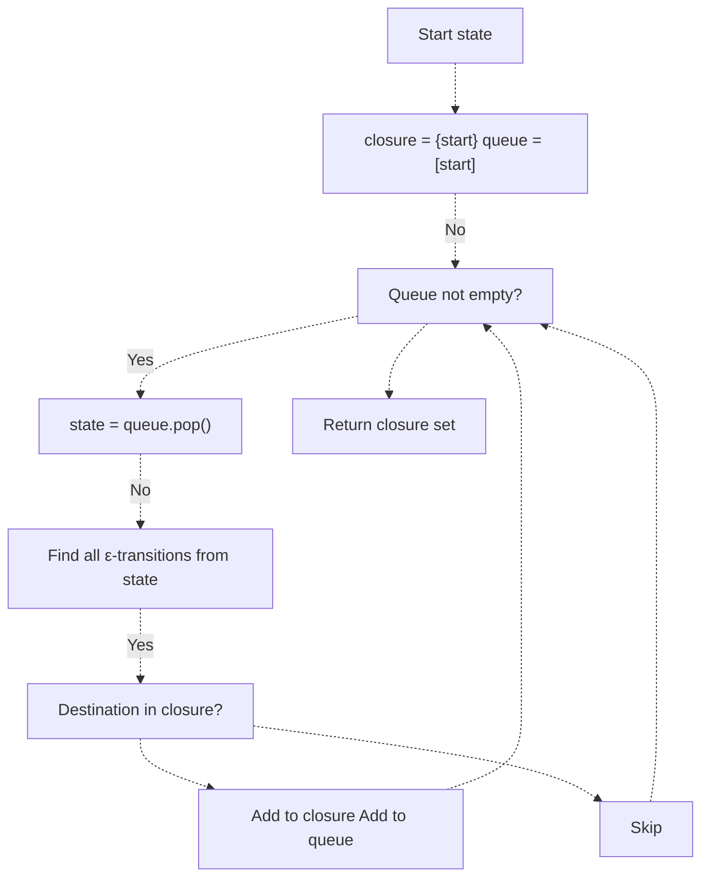
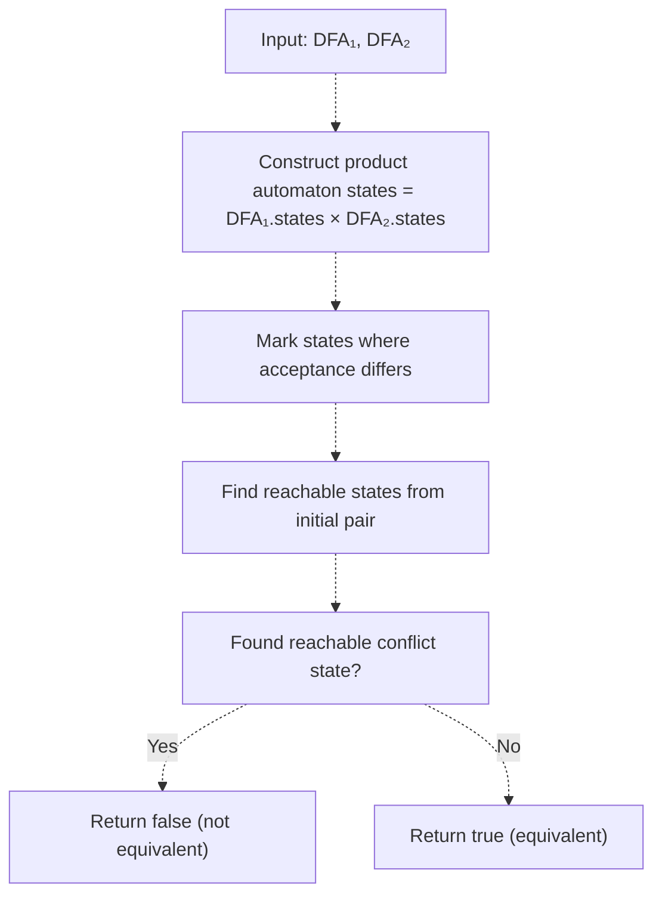
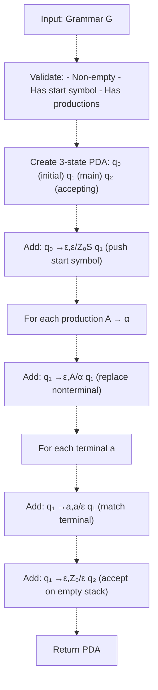
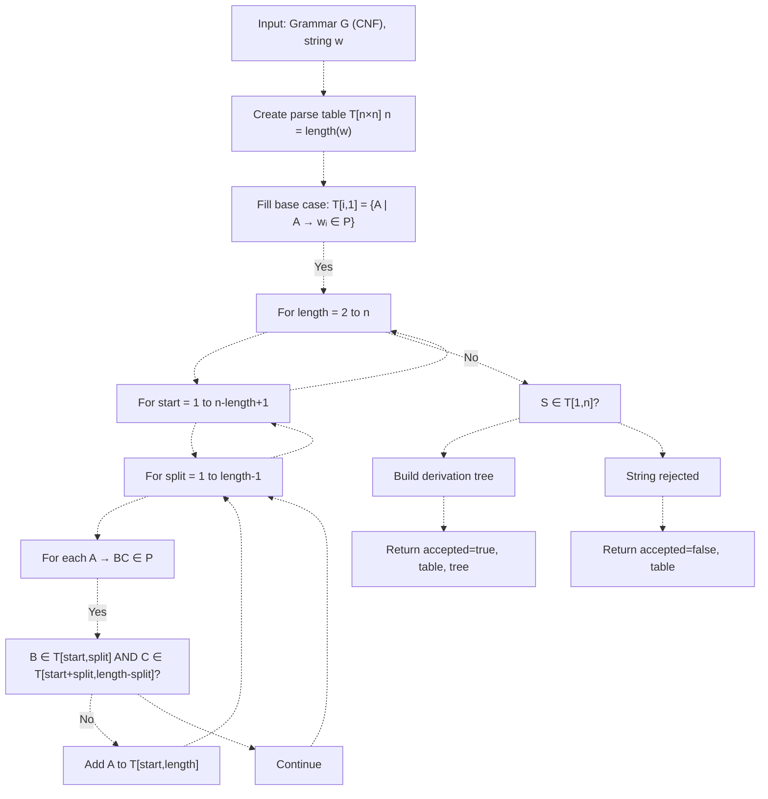
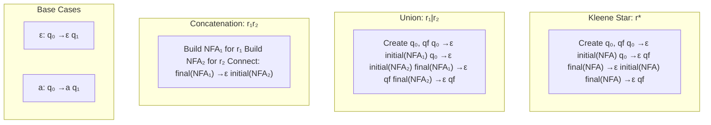
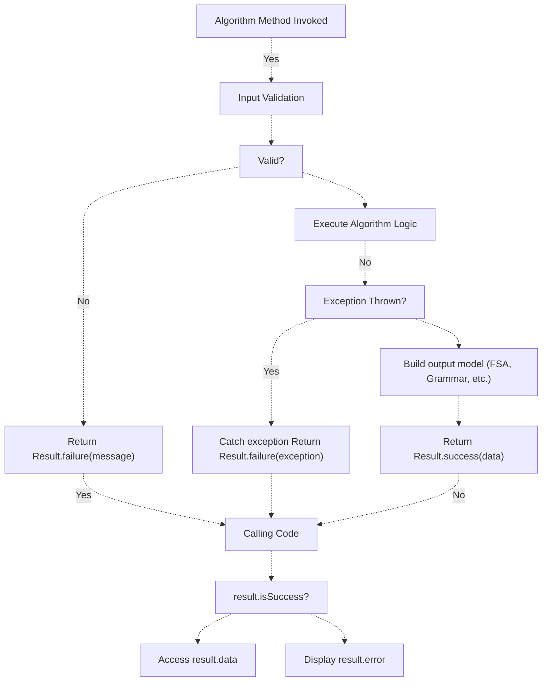

# Core Algorithms

> **Relevant source files**
> * [README.md](https://github.com/ThalesMMS/JFlutter/blob/32e808b4/README.md)
> * [USER_GUIDE](https://github.com/ThalesMMS/JFlutter/blob/32e808b4/USER_GUIDE)
> * [docs/canvas_bridge.md](https://github.com/ThalesMMS/JFlutter/blob/32e808b4/docs/canvas_bridge.md)
> * [docs/reference-deviations.md](https://github.com/ThalesMMS/JFlutter/blob/32e808b4/docs/reference-deviations.md)
> * [lib/core/algorithms/nfa_to_dfa_converter.dart](https://github.com/ThalesMMS/JFlutter/blob/32e808b4/lib/core/algorithms/nfa_to_dfa_converter.dart)
> * [test/unit/core/automata/fa_algorithms_test.dart](https://github.com/ThalesMMS/JFlutter/blob/32e808b4/test/unit/core/automata/fa_algorithms_test.dart)
> * [test/unit/core/cfg/cyk_parser_test.dart](https://github.com/ThalesMMS/JFlutter/blob/32e808b4/test/unit/core/cfg/cyk_parser_test.dart)
> * [test/unit/grammar_to_pda_validation_test.dart](https://github.com/ThalesMMS/JFlutter/blob/32e808b4/test/unit/grammar_to_pda_validation_test.dart)

This page documents the core algorithms that implement formal language theory operations in JFlutter. These algorithms transform, analyze, and validate finite automata, grammars, and regular expressions. For algorithm execution and simulation, see [Simulation System](#7.2). For the UI components that expose these algorithms to users, see [Algorithm Panels](#7.3).

---

## Scope and Organization

The core algorithms are organized into three primary categories:

| Category | Algorithms | Purpose |
| --- | --- | --- |
| **Finite Automaton Algorithms** | NFA→DFA, DFA Minimization, DFA Completion, Language Properties | Transform and analyze finite state automata |
| **Grammar Algorithms** | Grammar→PDA, CNF Conversion, CYK Parsing, First/Follow Sets | Process context-free grammars and enable parsing |
| **Regular Expression Algorithms** | Regex→NFA, Regex Simplification | Convert and manipulate regular expressions |

All algorithms follow a consistent pattern: they accept domain models (FSA, Grammar, etc.) as input and return `Result<T>` types that encapsulate either successful transformations or detailed error messages. This approach enables graceful error handling throughout the UI layer.

**Sources:** [README.md L24-L28](https://github.com/ThalesMMS/JFlutter/blob/32e808b4/README.md#L24-L28)

 [lib/core/algorithms/nfa_to_dfa_converter.dart L1-L46](https://github.com/ThalesMMS/JFlutter/blob/32e808b4/lib/core/algorithms/nfa_to_dfa_converter.dart#L1-L46)

---

## Algorithm Implementation Architecture



**Algorithm Layer to Code Entity Mapping**

The algorithm implementations are located in `lib/core/algorithms/` with the following key classes:

* `NFAToDFAConverter` - [lib/core/algorithms/nfa_to_dfa_converter.dart L19-L371](https://github.com/ThalesMMS/JFlutter/blob/32e808b4/lib/core/algorithms/nfa_to_dfa_converter.dart#L19-L371)
* `DFAMinimizer` - Referenced in [test/unit/core/automata/fa_algorithms_test.dart L145](https://github.com/ThalesMMS/JFlutter/blob/32e808b4/test/unit/core/automata/fa_algorithms_test.dart#L145-L145)
* `DFACompleter` - Referenced in [README.md L25](https://github.com/ThalesMMS/JFlutter/blob/32e808b4/README.md#L25-L25)
* `GrammarToPDAConverter` - [test/unit/grammar_to_pda_validation_test.dart L13](https://github.com/ThalesMMS/JFlutter/blob/32e808b4/test/unit/grammar_to_pda_validation_test.dart#L13-L13)
* `CYKParser` - [test/unit/core/cfg/cyk_parser_test.dart L11](https://github.com/ThalesMMS/JFlutter/blob/32e808b4/test/unit/core/cfg/cyk_parser_test.dart#L11-L11)
* `FAAlgorithms` - [test/unit/core/automata/fa_algorithms_test.dart L13](https://github.com/ThalesMMS/JFlutter/blob/32e808b4/test/unit/core/automata/fa_algorithms_test.dart#L13-L13)

**Sources:** [lib/core/algorithms/nfa_to_dfa_converter.dart L1-L463](https://github.com/ThalesMMS/JFlutter/blob/32e808b4/lib/core/algorithms/nfa_to_dfa_converter.dart#L1-L463)

 [test/unit/core/automata/fa_algorithms_test.dart L1-L268](https://github.com/ThalesMMS/JFlutter/blob/32e808b4/test/unit/core/automata/fa_algorithms_test.dart#L1-L268)

 [README.md L56-L73](https://github.com/ThalesMMS/JFlutter/blob/32e808b4/README.md#L56-L73)

---

## Finite State Automaton Algorithms

### NFA to DFA Conversion (Subset Construction)

The `NFAToDFAConverter` implements the standard subset construction algorithm with epsilon-closure support. The algorithm processes epsilon transitions through a flexible recognition system that treats multiple epsilon representations (ε, λ, "lambda", empty string) uniformly.

**Algorithm Overview:**



**Key Implementation Details:**

| Aspect | Implementation | Location |
| --- | --- | --- |
| **Epsilon Recognition** | Flexible normalization: treats 'ε', 'λ', 'lambda', empty as equivalent | [lib/core/algorithms/nfa_to_dfa_converter.dart L76-L82](https://github.com/ThalesMMS/JFlutter/blob/32e808b4/lib/core/algorithms/nfa_to_dfa_converter.dart#L76-L82) |
| **State Naming** | DFA states labeled as `{q0,q1,...}` showing NFA state composition | [lib/core/algorithms/nfa_to_dfa_converter.dart L293-L296](https://github.com/ThalesMMS/JFlutter/blob/32e808b4/lib/core/algorithms/nfa_to_dfa_converter.dart#L293-L296) |
| **Position Calculation** | DFA state position computed as centroid of NFA state positions | [lib/core/algorithms/nfa_to_dfa_converter.dart L298-L305](https://github.com/ThalesMMS/JFlutter/blob/32e808b4/lib/core/algorithms/nfa_to_dfa_converter.dart#L298-L305) |
| **State Limit** | Hard cap at 1000 states to prevent mobile OOM | [lib/core/algorithms/nfa_to_dfa_converter.dart L201-L204](https://github.com/ThalesMMS/JFlutter/blob/32e808b4/lib/core/algorithms/nfa_to_dfa_converter.dart#L201-L204) |

**Epsilon-Closure Algorithm:**

The `_epsilonClosureFlexible` function computes the epsilon-closure using breadth-first search:



The implementation at [lib/core/algorithms/nfa_to_dfa_converter.dart L375-L398](https://github.com/ThalesMMS/JFlutter/blob/32e808b4/lib/core/algorithms/nfa_to_dfa_converter.dart#L375-L398)

 handles both explicit epsilon transitions (where `isEpsilonTransition == true`) and transitions with epsilon-like symbols in the `inputSymbols` set.

**State Limit Rationale:**

The 1000-state cap is documented in [docs/reference-deviations.md L30](https://github.com/ThalesMMS/JFlutter/blob/32e808b4/docs/reference-deviations.md#L30-L30)

 as an intentional deviation from theoretical behavior. Without this limit, NFAs with many non-deterministic transitions can trigger exponential state explosion (up to 2^n states), causing memory exhaustion on mobile devices. The implementation throws a `StateError` when this limit is reached during subset construction at [lib/core/algorithms/nfa_to_dfa_converter.dart L246-L250](https://github.com/ThalesMMS/JFlutter/blob/32e808b4/lib/core/algorithms/nfa_to_dfa_converter.dart#L246-L250)

**Sources:** [lib/core/algorithms/nfa_to_dfa_converter.dart L19-L463](https://github.com/ThalesMMS/JFlutter/blob/32e808b4/lib/core/algorithms/nfa_to_dfa_converter.dart#L19-L463)

 [test/unit/core/automata/fa_algorithms_test.dart L20-L71](https://github.com/ThalesMMS/JFlutter/blob/32e808b4/test/unit/core/automata/fa_algorithms_test.dart#L20-L71)

 [docs/reference-deviations.md L26-L31](https://github.com/ThalesMMS/JFlutter/blob/32e808b4/docs/reference-deviations.md#L26-L31)

---

### DFA Minimization (Hopcroft Algorithm)

The `FAAlgorithms.minimizeDfa` method implements Hopcroft's algorithm to produce the canonical minimal DFA equivalent to the input DFA. The algorithm partitions states into equivalence classes and merges indistinguishable states.

**Algorithm Properties:**

| Property | Description |
| --- | --- |
| **Time Complexity** | O(n log n) where n is the number of states |
| **Space Complexity** | O(n²) for the partition refinement structure |
| **Correctness** | Produces the unique minimal DFA (up to isomorphism) |
| **Preservation** | Maintains language equivalence with original DFA |

The implementation merges states that are indistinguishable: two states are equivalent if they have the same acceptance status and transition to equivalent states on all alphabet symbols.

**Test Coverage:**

The test at [test/unit/core/automata/fa_algorithms_test.dart L73-L149](https://github.com/ThalesMMS/JFlutter/blob/32e808b4/test/unit/core/automata/fa_algorithms_test.dart#L73-L149)

 validates that the minimized DFA has fewer states than the original when redundant accepting states exist. The test constructs a DFA with states `s1` and `s2` that are both accepting and equivalent (they accept the same suffixes), confirming they merge during minimization.

**Sources:** [test/unit/core/automata/fa_algorithms_test.dart L73-L149](https://github.com/ThalesMMS/JFlutter/blob/32e808b4/test/unit/core/automata/fa_algorithms_test.dart#L73-L149)

 [README.md L26](https://github.com/ThalesMMS/JFlutter/blob/32e808b4/README.md#L26-L26)

---

### DFA Completion and Language Properties

**DFA Completion:**

The `DFACompleter` algorithm adds a trap state (sink state) to partial DFAs, ensuring a total transition function. For every state-symbol pair lacking a transition, the completer adds a transition to the trap state, which loops on all alphabet symbols.

**Language Property Checkers:**

The `FAAlgorithms` facade exposes several language property predicates:

| Method | Property | Algorithm |
| --- | --- | --- |
| `isEmpty(FSA)` | Language is empty (no accepting paths from initial state) | Reachability analysis via BFS |
| `isFinite(FSA)` | Language is finite (no cycles to accepting states) | Cycle detection using DFS |
| `areEquivalent(FSA, FSA)` | Two automata accept the same language | Product construction + emptiness check |

**Equivalence Check Implementation:**



The test at [test/unit/core/automata/fa_algorithms_test.dart L182-L224](https://github.com/ThalesMMS/JFlutter/blob/32e808b4/test/unit/core/automata/fa_algorithms_test.dart#L182-L224)

 validates equivalence checking by constructing two structurally identical DFAs and confirming they are detected as equivalent.

**Sources:** [test/unit/core/automata/fa_algorithms_test.dart L151-L225](https://github.com/ThalesMMS/JFlutter/blob/32e808b4/test/unit/core/automata/fa_algorithms_test.dart#L151-L225)

 [README.md L24-L28](https://github.com/ThalesMMS/JFlutter/blob/32e808b4/README.md#L24-L28)

---

## Grammar Algorithms

### Grammar to PDA Conversion

The `GrammarToPDAConverter` transforms context-free grammars into equivalent pushdown automata using the standard construction. The resulting PDA simulates leftmost derivations by pushing production right-hand sides onto the stack.

**Conversion Algorithm:**



**PDA Structure:**

| Component | Purpose |
| --- | --- |
| **States** | 3 states: q₀ (initialization), q₁ (main processing), q₂ (acceptance) |
| **Stack Alphabet** | Grammar nonterminals + terminals + bottom marker Z₀ |
| **Input Alphabet** | Grammar terminals |
| **Acceptance Mode** | Empty stack (string accepted when stack contains only Z₀) |

**Language Equivalence:**

The test suite at [test/unit/grammar_to_pda_validation_test.dart L104-L206](https://github.com/ThalesMMS/JFlutter/blob/32e808b4/test/unit/grammar_to_pda_validation_test.dart#L104-L206)

 validates language equivalence by:

1. Converting a grammar to a PDA
2. Simulating the PDA on strings generated by the grammar (expected: accept)
3. Simulating the PDA on strings not in the grammar (expected: reject)

For example, the grammar S → aSb | ε generates strings with equal numbers of 'a's and 'b's. The test confirms the converted PDA accepts "", "ab", "aabb", "aaabbb" and rejects "a", "b", "ba", "aab", "abb".

**Lambda Production Handling:**

The converter correctly handles epsilon (λ) productions by creating PDA transitions that pop the nonterminal without consuming input or pushing replacement symbols. The test at [test/unit/grammar_to_pda_validation_test.dart L174-L205](https://github.com/ThalesMMS/JFlutter/blob/32e808b4/test/unit/grammar_to_pda_validation_test.dart#L174-L205)

 validates this with a grammar containing S → aS | ε.

**Sources:** [test/unit/grammar_to_pda_validation_test.dart L1-L415](https://github.com/ThalesMMS/JFlutter/blob/32e808b4/test/unit/grammar_to_pda_validation_test.dart#L1-L415)

 [README.md L27](https://github.com/ThalesMMS/JFlutter/blob/32e808b4/README.md#L27-L27)

---

### CYK Parsing Algorithm

The `CYKParser` implements the Cocke-Younger-Kasami algorithm for parsing context-free grammars in Chomsky Normal Form (CNF). The algorithm constructs a parse table using dynamic programming and can extract derivation trees for accepted strings.

**CYK Table Construction:**



**Result Structure:**

The `CYKParseResult` contains:

| Field | Type | Description |
| --- | --- | --- |
| `accepted` | `bool` | Whether the string is in the grammar's language |
| `table` | `List<List<Set<String>>>` | The CYK parse table (nonterminals in each cell) |
| `derivation` | `CYKDerivation?` | Parse tree root (null if rejected) |
| `executionTime` | `Duration` | Time taken to parse |

**Derivation Tree Structure:**

Each `CYKDerivation` node represents a nonterminal in the parse tree, with `label` (the nonterminal symbol) and `children` (list of child derivations). Leaf nodes represent terminals.

**Test Coverage:**

The test suite at [test/unit/core/cfg/cyk_parser_test.dart L1-L631](https://github.com/ThalesMMS/JFlutter/blob/32e808b4/test/unit/core/cfg/cyk_parser_test.dart#L1-L631)

 validates:

* Parse table construction for valid/invalid strings [lines 37-88](https://github.com/ThalesMMS/JFlutter/blob/32e808b4/lines%2037-88)
* Derivation tree generation for accepted strings [lines 113-197](https://github.com/ThalesMMS/JFlutter/blob/32e808b4/lines%20113-197)
* Correct acceptance/rejection of strings [lines 200-274](https://github.com/ThalesMMS/JFlutter/blob/32e808b4/lines%20200-274)
* Handling of CNF conversion (lambda, unit productions) [lines 276-318](https://github.com/ThalesMMS/JFlutter/blob/32e808b4/lines%20276-318)
* Edge cases: single characters, empty strings, repeated characters [lines 320-378](https://github.com/ThalesMMS/JFlutter/blob/32e808b4/lines%20320-378)

**CNF Requirement:**

CYK parsing requires the grammar to be in CNF (productions of form A → BC or A → a). If the input grammar is not in CNF, the parser performs automatic conversion before building the parse table. The test at [test/unit/core/cfg/cyk_parser_test.dart L277-L296](https://github.com/ThalesMMS/JFlutter/blob/32e808b4/test/unit/core/cfg/cyk_parser_test.dart#L277-L296)

 verifies this works correctly with grammars containing unit productions.

**Sources:** [test/unit/core/cfg/cyk_parser_test.dart L1-L631](https://github.com/ThalesMMS/JFlutter/blob/32e808b4/test/unit/core/cfg/cyk_parser_test.dart#L1-L631)

 [README.md L27](https://github.com/ThalesMMS/JFlutter/blob/32e808b4/README.md#L27-L27)

---

### Grammar Analysis

The `GrammarAnalyzer` service computes First and Follow sets for context-free grammars, which are essential for LL(1) and LR parser construction.

**First and Follow Sets:**

| Set Type | Definition | Usage |
| --- | --- | --- |
| **First(α)** | Set of terminals that can begin strings derived from α | Predict which production to apply during top-down parsing |
| **Follow(A)** | Set of terminals that can appear immediately after A in sentential forms | Determine when to reduce a production during bottom-up parsing |

**Computation Algorithm:**

First sets are computed iteratively:

1. First(a) = {a} for terminal a
2. First(A) includes First(α) for each production A → α
3. If α derives ε, include First(β) where A → αβ

Follow sets require First sets as input:

1. Follow(S) includes $ (end marker) for start symbol S
2. For production A → αBβ, Follow(B) includes First(β) - {ε}
3. For production A → αB or A → αBβ where ε ∈ First(β), Follow(B) includes Follow(A)

The analyzer iterates these rules until the sets reach a fixed point (no more changes).

**Sources:** [README.md L27](https://github.com/ThalesMMS/JFlutter/blob/32e808b4/README.md#L27-L27)

---

## Regular Expression Algorithms

### Regex to NFA Conversion (Thompson Construction)

The `RegexToNFAConverter` implements Thompson's construction algorithm, which recursively builds NFAs for regular expressions using epsilon transitions to connect subautomata.

**Construction Rules:**



**Properties:**

| Property | Value |
| --- | --- |
| **NFA States** | O(n) where n is regex length |
| **Epsilon Transitions** | O(n) |
| **Determinism** | Always produces NFA (can be converted to DFA via subset construction) |
| **Correctness** | Resulting NFA accepts exactly the language denoted by the regex |

Thompson construction produces NFAs with structural properties that make them easy to understand: each operator creates a small, recognizable subgraph with a single entry and exit state.

**Sources:** [README.md L25-L26](https://github.com/ThalesMMS/JFlutter/blob/32e808b4/README.md#L25-L26)

---

## Algorithm Execution Model

All core algorithms follow a consistent execution pattern designed for error handling and observability:



**Result Type Pattern:**

The `Result<T>` type at [lib/core/result.dart](https://github.com/ThalesMMS/JFlutter/blob/32e808b4/lib/core/result.dart)

 provides a type-safe wrapper for success/failure outcomes:

```
// Typical algorithm signaturestatic Result<FSA> convert(FSA nfa) {  try {    // Validation    final validationResult = _validateInput(nfa);    if (!validationResult.isSuccess) {      return ResultFactory.failure(validationResult.error!);    }        // Algorithm logic    final dfa = _buildDFAWithEpsilon(nfa);        return ResultFactory.success(dfa);  } catch (e) {    return ResultFactory.failure('Error converting NFA to DFA: $e');  }}
```

This pattern is implemented consistently across:

* `NFAToDFAConverter.convert` - [lib/core/algorithms/nfa_to_dfa_converter.dart L21-L46](https://github.com/ThalesMMS/JFlutter/blob/32e808b4/lib/core/algorithms/nfa_to_dfa_converter.dart#L21-L46)
* `GrammarToPDAConverter.convert` - [test/unit/grammar_to_pda_validation_test.dart L35-L61](https://github.com/ThalesMMS/JFlutter/blob/32e808b4/test/unit/grammar_to_pda_validation_test.dart#L35-L61)
* `CYKParser.parse` - [test/unit/core/cfg/cyk_parser_test.dart L38-L60](https://github.com/ThalesMMS/JFlutter/blob/32e808b4/test/unit/core/cfg/cyk_parser_test.dart#L38-L60)

**Error Handling:**

Algorithms report three categories of errors:

1. **Validation Errors**: Input preconditions violated (empty states, missing initial state)
2. **Resource Limits**: Algorithm guards exceeded (1000-state cap in NFA→DFA)
3. **Unexpected Exceptions**: Runtime errors during computation

All error messages include context about what failed and why, enabling the UI layer to display actionable feedback to users.

**Sources:** [lib/core/algorithms/nfa_to_dfa_converter.dart L21-L46](https://github.com/ThalesMMS/JFlutter/blob/32e808b4/lib/core/algorithms/nfa_to_dfa_converter.dart#L21-L46)

 [lib/core/result.dart](https://github.com/ThalesMMS/JFlutter/blob/32e808b4/lib/core/result.dart)

---

## Performance Considerations and Algorithmic Complexity

### Complexity Summary

| Algorithm | Time Complexity | Space Complexity | Bottleneck |
| --- | --- | --- | --- |
| **NFA→DFA** | O(2^n × \|Σ\|) worst case | O(2^n) states | Exponential state explosion |
| **DFA Minimization** | O(n log n) | O(n²) | Partition refinement |
| **CYK Parsing** | O(n³ × \|G\|) | O(n² × \|N\|) | Table filling |
| **Thompson Construction** | O(\|r\|) | O(\|r\|) | Linear in regex length |
| **Grammar→PDA** | O(\|P\|) | O(\|N\| + \|Σ\|) | Number of productions |

Where:

* n = number of states
* |Σ| = alphabet size
* |G| = grammar size (productions)
* |N| = number of nonterminals
* |r| = regex length
* |P| = number of productions

### Mobile Platform Constraints

The NFA→DFA algorithm includes a 1000-state guard to prevent memory exhaustion on mobile devices. This is documented as an intentional deviation at [docs/reference-deviations.md L26-L31](https://github.com/ThalesMMS/JFlutter/blob/32e808b4/docs/reference-deviations.md#L26-L31)

 The guard is checked during subset construction at [lib/core/algorithms/nfa_to_dfa_converter.dart L201-L250](https://github.com/ThalesMMS/JFlutter/blob/32e808b4/lib/core/algorithms/nfa_to_dfa_converter.dart#L201-L250)

:

```sql
const int maxStates = 1000;while (queue.isNotEmpty) {  // ... process current state set ...    if (stateCounter >= maxStates) {    throw StateError(      'Exceeded maximum number of DFA states ($maxStates) during subset construction.',    );  }  // ... create new DFA state ...}
```

The test at [test/unit/core/automata/fa_algorithms_test.dart L227-L265](https://github.com/ThalesMMS/JFlutter/blob/32e808b4/test/unit/core/automata/fa_algorithms_test.dart#L227-L265)

 validates that the guard triggers correctly by constructing an NFA with 1001 states and confirming the conversion returns a failure Result with the appropriate error message.

### Algorithm Selection Guidelines

When working with large automata or grammars:

1. **For NFAs with many ε-transitions**: Consider epsilon-removal as a preprocessing step before conversion
2. **For large DFAs**: Use minimization to reduce state count before further operations
3. **For grammars with long strings**: Be aware of CYK's O(n³) parsing time; consider LL/LR for linear parsing
4. **For complex regular expressions**: Thompson construction may produce NFAs with many states; convert to DFA and minimize

**Sources:** [docs/reference-deviations.md L26-L31](https://github.com/ThalesMMS/JFlutter/blob/32e808b4/docs/reference-deviations.md#L26-L31)

 [lib/core/algorithms/nfa_to_dfa_converter.dart L201-L250](https://github.com/ThalesMMS/JFlutter/blob/32e808b4/lib/core/algorithms/nfa_to_dfa_converter.dart#L201-L250)

 [test/unit/core/automata/fa_algorithms_test.dart L227-L265](https://github.com/ThalesMMS/JFlutter/blob/32e808b4/test/unit/core/automata/fa_algorithms_test.dart#L227-L265)

---

## Testing and Validation

The algorithm implementations are validated through comprehensive test suites:

| Test Suite | Coverage | Location |
| --- | --- | --- |
| **FA Algorithms** | NFA→DFA, minimization, language properties, state limit guard | [test/unit/core/automata/fa_algorithms_test.dart](https://github.com/ThalesMMS/JFlutter/blob/32e808b4/test/unit/core/automata/fa_algorithms_test.dart) |
| **Grammar→PDA** | Conversion correctness, language equivalence, lambda productions | [test/unit/grammar_to_pda_validation_test.dart](https://github.com/ThalesMMS/JFlutter/blob/32e808b4/test/unit/grammar_to_pda_validation_test.dart) |
| **CYK Parser** | Table construction, derivation trees, CNF handling, edge cases | [test/unit/core/cfg/cyk_parser_test.dart](https://github.com/ThalesMMS/JFlutter/blob/32e808b4/test/unit/core/cfg/cyk_parser_test.dart) |

Each test suite validates both algorithmic correctness (does it produce the right output?) and error handling (does it fail gracefully on invalid input?).

**Reference Validation:**

The algorithms are cross-validated against reference implementations in the `References/` directory:

* **Python automata-main**: NFA→DFA conversion, DFA minimization - [README.md L313-L316](https://github.com/ThalesMMS/JFlutter/blob/32e808b4/README.md#L313-L316)
* **Dart AutomataTheory**: Finite automata operations - [README.md L323-L326](https://github.com/ThalesMMS/JFlutter/blob/32e808b4/README.md#L323-L326)
* **nfa_2_dfa**: NFA→DFA conversion algorithms - [README.md L329-L331](https://github.com/ThalesMMS/JFlutter/blob/32e808b4/README.md#L329-L331)

The reference validation process is documented at [README.md L204-L230](https://github.com/ThalesMMS/JFlutter/blob/32e808b4/README.md#L204-L230)

 Any deviations from reference behavior are tracked in [docs/reference-deviations.md](https://github.com/ThalesMMS/JFlutter/blob/32e808b4/docs/reference-deviations.md)

**Sources:** [test/unit/core/automata/fa_algorithms_test.dart L1-L268](https://github.com/ThalesMMS/JFlutter/blob/32e808b4/test/unit/core/automata/fa_algorithms_test.dart#L1-L268)

 [test/unit/grammar_to_pda_validation_test.dart L1-L415](https://github.com/ThalesMMS/JFlutter/blob/32e808b4/test/unit/grammar_to_pda_validation_test.dart#L1-L415)

 [test/unit/core/cfg/cyk_parser_test.dart L1-L631](https://github.com/ThalesMMS/JFlutter/blob/32e808b4/test/unit/core/cfg/cyk_parser_test.dart#L1-L631)

 [README.md L204-L230](https://github.com/ThalesMMS/JFlutter/blob/32e808b4/README.md#L204-L230)

 [docs/reference-deviations.md L1-L56](https://github.com/ThalesMMS/JFlutter/blob/32e808b4/docs/reference-deviations.md#L1-L56)

Refresh this wiki

Last indexed: 30 December 2025 ([32e808](https://github.com/ThalesMMS/JFlutter/commit/32e808b4))

### On this page

* [Core Algorithms](#7.1-core-algorithms)
* [Scope and Organization](#7.1-scope-and-organization)
* [Algorithm Implementation Architecture](#7.1-algorithm-implementation-architecture)
* [Finite State Automaton Algorithms](#7.1-finite-state-automaton-algorithms)
* [NFA to DFA Conversion (Subset Construction)](#7.1-nfa-to-dfa-conversion-subset-construction)
* [DFA Minimization (Hopcroft Algorithm)](#7.1-dfa-minimization-hopcroft-algorithm)
* [DFA Completion and Language Properties](#7.1-dfa-completion-and-language-properties)
* [Grammar Algorithms](#7.1-grammar-algorithms)
* [Grammar to PDA Conversion](#7.1-grammar-to-pda-conversion)
* [CYK Parsing Algorithm](#7.1-cyk-parsing-algorithm)
* [Grammar Analysis](#7.1-grammar-analysis)
* [Regular Expression Algorithms](#7.1-regular-expression-algorithms)
* [Regex to NFA Conversion (Thompson Construction)](#7.1-regex-to-nfa-conversion-thompson-construction)
* [Algorithm Execution Model](#7.1-algorithm-execution-model)
* [Performance Considerations and Algorithmic Complexity](#7.1-performance-considerations-and-algorithmic-complexity)
* [Complexity Summary](#7.1-complexity-summary)
* [Mobile Platform Constraints](#7.1-mobile-platform-constraints)
* [Algorithm Selection Guidelines](#7.1-algorithm-selection-guidelines)
* [Testing and Validation](#7.1-testing-and-validation)

Ask Devin about JFlutter