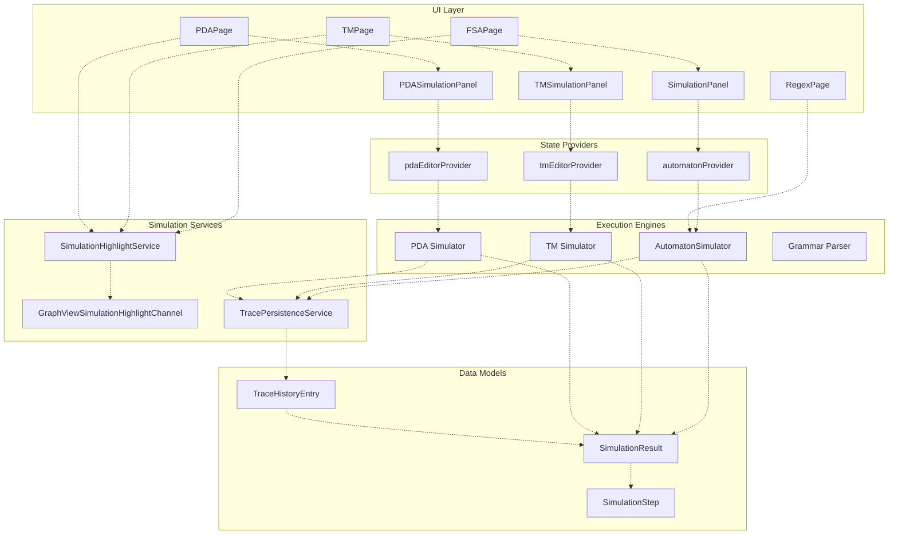
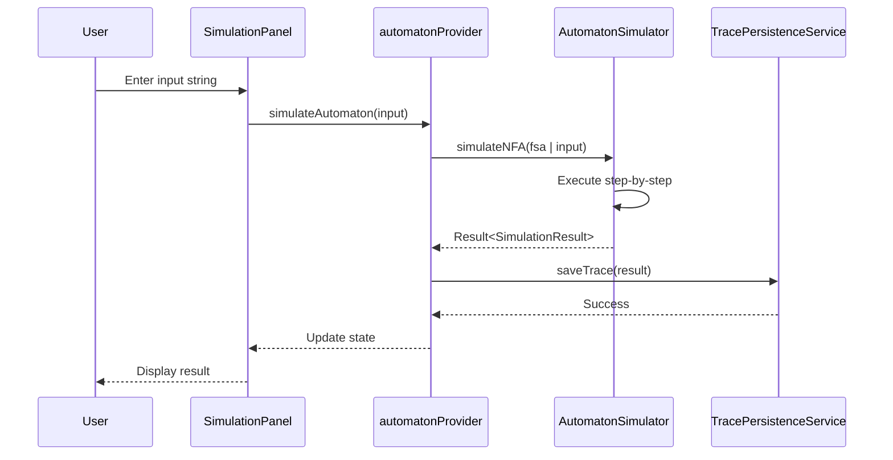
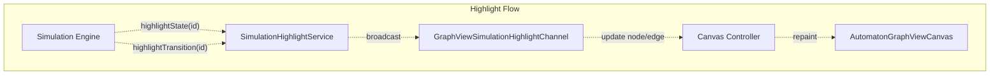
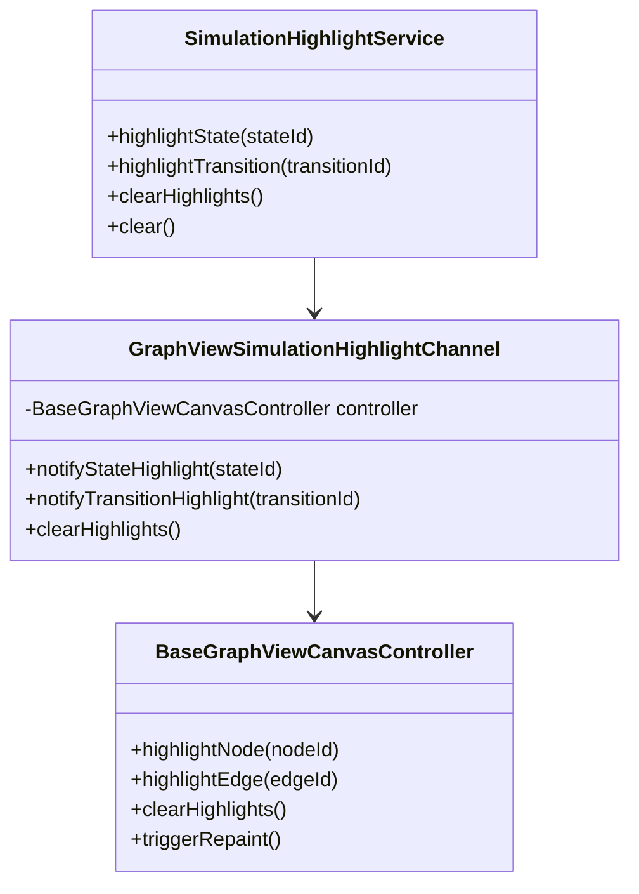
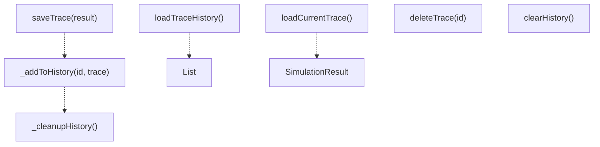
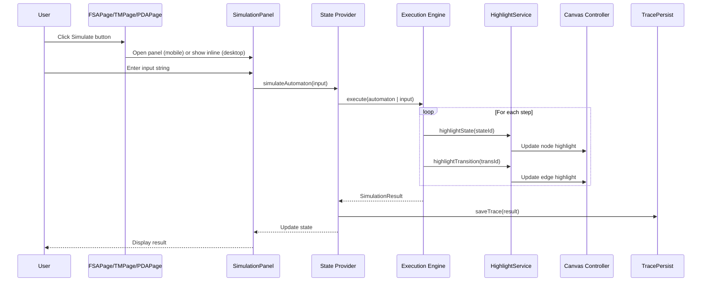

# Simulation System

> **Relevant source files**
> * [lib/core/parsers/jflap_xml_parser.dart](https://github.com/ThalesMMS/JFlutter/blob/32e808b4/lib/core/parsers/jflap_xml_parser.dart)
> * [lib/core/services/trace_persistence_service_stub.dart](https://github.com/ThalesMMS/JFlutter/blob/32e808b4/lib/core/services/trace_persistence_service_stub.dart)
> * [lib/presentation/pages/fsa_page.dart](https://github.com/ThalesMMS/JFlutter/blob/32e808b4/lib/presentation/pages/fsa_page.dart)
> * [lib/presentation/pages/grammar_page.dart](https://github.com/ThalesMMS/JFlutter/blob/32e808b4/lib/presentation/pages/grammar_page.dart)
> * [lib/presentation/pages/home_page.dart](https://github.com/ThalesMMS/JFlutter/blob/32e808b4/lib/presentation/pages/home_page.dart)
> * [lib/presentation/pages/pda_page.dart](https://github.com/ThalesMMS/JFlutter/blob/32e808b4/lib/presentation/pages/pda_page.dart)
> * [lib/presentation/pages/pumping_lemma_page.dart](https://github.com/ThalesMMS/JFlutter/blob/32e808b4/lib/presentation/pages/pumping_lemma_page.dart)
> * [lib/presentation/pages/regex_page.dart](https://github.com/ThalesMMS/JFlutter/blob/32e808b4/lib/presentation/pages/regex_page.dart)
> * [lib/presentation/pages/tm_page.dart](https://github.com/ThalesMMS/JFlutter/blob/32e808b4/lib/presentation/pages/tm_page.dart)
> * [lib/presentation/theme/app_theme.dart](https://github.com/ThalesMMS/JFlutter/blob/32e808b4/lib/presentation/theme/app_theme.dart)
> * [lib/presentation/widgets/desktop_navigation.dart](https://github.com/ThalesMMS/JFlutter/blob/32e808b4/lib/presentation/widgets/desktop_navigation.dart)
> * [lib/presentation/widgets/grammar_editor.dart](https://github.com/ThalesMMS/JFlutter/blob/32e808b4/lib/presentation/widgets/grammar_editor.dart)
> * [lib/presentation/widgets/tablet_layout_container.dart](https://github.com/ThalesMMS/JFlutter/blob/32e808b4/lib/presentation/widgets/tablet_layout_container.dart)
> * [test/tablet_layout_test.dart](https://github.com/ThalesMMS/JFlutter/blob/32e808b4/test/tablet_layout_test.dart)
> * [test/widget/presentation/home_page_test.dart](https://github.com/ThalesMMS/JFlutter/blob/32e808b4/test/widget/presentation/home_page_test.dart)

## Purpose and Scope

The Simulation System executes automata and grammars against input strings, generating step-by-step execution traces with real-time visual feedback. This page documents the execution engines, highlight mechanism, trace persistence, and UI integration. For algorithm operations that transform automata (e.g., NFA→DFA conversion), see [Core Algorithms](#7.1). For UI panels that display simulation controls, see [Algorithm Panels](#7.3).

---

## Architecture Overview

The simulation system consists of four major subsystems: execution engines that process input strings, a highlight service that provides real-time visual feedback, a trace persistence layer that manages simulation history, and UI integration components that coordinate simulation requests from workspace pages.



**Sources:** [lib/presentation/pages/fsa_page.dart L1-L673](https://github.com/ThalesMMS/JFlutter/blob/32e808b4/lib/presentation/pages/fsa_page.dart#L1-L673)

 [lib/presentation/pages/tm_page.dart L1-L643](https://github.com/ThalesMMS/JFlutter/blob/32e808b4/lib/presentation/pages/tm_page.dart#L1-L643)

 [lib/presentation/pages/pda_page.dart L1-L565](https://github.com/ThalesMMS/JFlutter/blob/32e808b4/lib/presentation/pages/pda_page.dart#L1-L565)

 [lib/presentation/pages/regex_page.dart L1-L1050](https://github.com/ThalesMMS/JFlutter/blob/32e808b4/lib/presentation/pages/regex_page.dart#L1-L1050)

 [lib/core/services/trace_persistence_service_stub.dart L1-L261](https://github.com/ThalesMMS/JFlutter/blob/32e808b4/lib/core/services/trace_persistence_service_stub.dart#L1-L261)

---

## Execution Engines

### FSA Simulation with AutomatonSimulator

The `AutomatonSimulator` class executes finite state automata against input strings, tracking all possible computation paths for nondeterministic automata. It returns a `SimulationResult` containing acceptance status, execution steps, and error messages.

| Method | Purpose | Input Model | Output |
| --- | --- | --- | --- |
| `simulateNFA` | Execute NFA with ε-transitions | `FSA` | `Result<SimulationResult>` |
| `simulateDFA` | Execute deterministic automaton | `FSA` | `Result<SimulationResult>` |

The simulator is invoked through state providers, which handle model conversion and result propagation to UI components.



**Sources:** [lib/presentation/pages/regex_page.dart L124-L173](https://github.com/ThalesMMS/JFlutter/blob/32e808b4/lib/presentation/pages/regex_page.dart#L124-L173)

 [lib/presentation/pages/fsa_page.dart L608-L626](https://github.com/ThalesMMS/JFlutter/blob/32e808b4/lib/presentation/pages/fsa_page.dart#L608-L626)

### Turing Machine Simulation

TM simulation extends the FSA model with tape operations. The simulator tracks tape state, head position, and transition history, supporting single-tape and multi-tape configurations.

The `TMSimulationPanel` provides tape visualization and step controls, allowing users to observe tape modifications during execution.

**Sources:** [lib/presentation/pages/tm_page.dart L39-L127](https://github.com/ThalesMMS/JFlutter/blob/32e808b4/lib/presentation/pages/tm_page.dart#L39-L127)

 [lib/presentation/pages/tm_page.dart L404-L417](https://github.com/ThalesMMS/JFlutter/blob/32e808b4/lib/presentation/pages/tm_page.dart#L404-L417)

### Pushdown Automata Simulation

PDA simulation maintains a stack alongside state transitions. The execution engine tracks stack operations (push, pop) and validates acceptance by empty stack or final state.

The `PDASimulationPanel` visualizes stack contents during execution, displaying the current stack state and operations performed at each step.

**Sources:** [lib/presentation/pages/pda_page.dart L39-L131](https://github.com/ThalesMMS/JFlutter/blob/32e808b4/lib/presentation/pages/pda_page.dart#L39-L131)

 [lib/presentation/pages/pda_page.dart L356-L371](https://github.com/ThalesMMS/JFlutter/blob/32e808b4/lib/presentation/pages/pda_page.dart#L356-L371)

### Grammar Parsing

Grammar simulation uses parsing algorithms (CYK, LL, LR) to determine if an input string belongs to the language defined by a context-free grammar. The `GrammarParser` generates parse trees and step-by-step derivations.

**Sources:** [lib/presentation/pages/regex_page.dart L1-L1050](https://github.com/ThalesMMS/JFlutter/blob/32e808b4/lib/presentation/pages/regex_page.dart#L1-L1050)

---

## Simulation Highlight System

### Real-Time Visual Feedback

The highlight system provides animated feedback during simulation by broadcasting state and transition highlights to canvas controllers. This enables users to follow execution visually as the automaton processes input symbols.



**Sources:** [lib/presentation/pages/fsa_page.dart L26-L64](https://github.com/ThalesMMS/JFlutter/blob/32e808b4/lib/presentation/pages/fsa_page.dart#L26-L64)

 [lib/presentation/pages/tm_page.dart L26-L127](https://github.com/ThalesMMS/JFlutter/blob/32e808b4/lib/presentation/pages/tm_page.dart#L26-L127)

 [lib/presentation/pages/pda_page.dart L26-L103](https://github.com/ThalesMMS/JFlutter/blob/32e808b4/lib/presentation/pages/pda_page.dart#L26-L103)

### SimulationHighlightService

The `SimulationHighlightService` acts as a centralized event broadcaster for simulation highlights. It is provided via Riverpod at the page level, with each workspace page creating its own instance to isolate highlights between different automata.

**Lifecycle Management:**

| Stage | Action | Location |
| --- | --- | --- |
| Initialization | Create service with channel | `initState()` in workspace pages |
| Simulation | Broadcast highlight events | During step execution |
| Cleanup | Clear all highlights | `dispose()` in workspace pages |



**Sources:** [lib/presentation/pages/fsa_page.dart L40-L64](https://github.com/ThalesMMS/JFlutter/blob/32e808b4/lib/presentation/pages/fsa_page.dart#L40-L64)

 [lib/presentation/pages/tm_page.dart L50-L127](https://github.com/ThalesMMS/JFlutter/blob/32e808b4/lib/presentation/pages/tm_page.dart#L50-L127)

 [lib/presentation/pages/pda_page.dart L46-L103](https://github.com/ThalesMMS/JFlutter/blob/32e808b4/lib/presentation/pages/pda_page.dart#L46-L103)

### Provider Override Pattern

Each workspace page overrides `canvasHighlightServiceProvider` to inject its page-specific highlight service instance. This ensures that simulations in different workspace tabs do not interfere with each other's visual feedback.

```
// From fsa_page.dart:532-543return ProviderScope(  overrides: [    canvasHighlightServiceProvider.overrideWithValue(_highlightService),  ],  child: Scaffold(...));
```

**Sources:** [lib/presentation/pages/fsa_page.dart L532-L543](https://github.com/ThalesMMS/JFlutter/blob/32e808b4/lib/presentation/pages/fsa_page.dart#L532-L543)

 [lib/presentation/pages/tm_page.dart L133-L144](https://github.com/ThalesMMS/JFlutter/blob/32e808b4/lib/presentation/pages/tm_page.dart#L133-L144)

 [lib/presentation/pages/pda_page.dart L119-L131](https://github.com/ThalesMMS/JFlutter/blob/32e808b4/lib/presentation/pages/pda_page.dart#L119-L131)

---

## Trace Management and Persistence

### SimulationResult Model

The `SimulationResult` class encapsulates the complete execution trace of a simulation, including acceptance status, step-by-step execution history, and error messages.

**Key Properties:**

| Property | Type | Purpose |
| --- | --- | --- |
| `inputString` | `String` | The input string processed |
| `accepted` | `bool` | Whether the input was accepted |
| `steps` | `List<SimulationStep>` | Ordered execution steps |
| `stepCount` | `int` | Total number of steps |
| `errorMessage` | `String` | Error details if simulation failed |
| `isAccepted` | `bool` (getter) | Alias for `accepted` |

Each `SimulationStep` captures the state at a particular moment during execution, including current state, input position, stack/tape state (for PDA/TM), and the transition taken.

**Sources:** [lib/core/services/trace_persistence_service_stub.dart L13-L261](https://github.com/ThalesMMS/JFlutter/blob/32e808b4/lib/core/services/trace_persistence_service_stub.dart#L13-L261)

### TracePersistenceService

The `TracePersistenceService` manages simulation history using `SharedPreferences` for cross-platform persistence. It stores a maximum of 50 traces by default, automatically pruning older entries when the limit is reached.

**Core Operations:**



**Sources:** [lib/core/services/trace_persistence_service_stub.dart L20-L188](https://github.com/ThalesMMS/JFlutter/blob/32e808b4/lib/core/services/trace_persistence_service_stub.dart#L20-L188)

### TraceHistoryEntry

Each entry in the trace history is wrapped in a `TraceHistoryEntry` that adds metadata for efficient retrieval and display:

| Field | Type | Purpose |
| --- | --- | --- |
| `id` | `String` | Unique identifier (timestamp-based) |
| `trace` | `SimulationResult` | Complete simulation result |
| `timestamp` | `DateTime` | When the simulation was executed |
| `inputString` | `String` | Cached for quick display |
| `accepted` | `bool` | Cached for filtering |
| `stepCount` | `int` | Cached for sorting |

**Sources:** [lib/core/services/trace_persistence_service_stub.dart L190-L244](https://github.com/ThalesMMS/JFlutter/blob/32e808b4/lib/core/services/trace_persistence_service_stub.dart#L190-L244)

### History Management

The service enforces a configurable maximum history size (default 50 entries). When the limit is exceeded, older traces are automatically removed during the `_cleanupHistory()` operation.

```
// Automatic cleanup after adding new traceFuture<void> _cleanupHistory() async {  final maxSize = await getMaxHistorySize();  final history = await loadTraceHistory();    if (history.length > maxSize) {    final trimmedHistory = history.take(maxSize).toList();    // Save trimmed history back to SharedPreferences  }}
```

**Sources:** [lib/core/services/trace_persistence_service_stub.dart L167-L180](https://github.com/ThalesMMS/JFlutter/blob/32e808b4/lib/core/services/trace_persistence_service_stub.dart#L167-L180)

---

## UI Integration

### Simulation Panels

Each automaton type has a dedicated simulation panel widget that provides input controls, execution triggers, and result display:

| Panel Widget | Automaton Type | Key Features |
| --- | --- | --- |
| `SimulationPanel` | FSA | Input field, step visualization, acceptance status |
| `TMSimulationPanel` | Turing Machine | Tape display, step controls, execution trace |
| `PDASimulationPanel` | Pushdown Automata | Stack visualization, input tracking |
| `GrammarSimulationPanel` | Context-Free Grammar | Parse tree display, derivation steps |

All panels follow a consistent pattern:

1. Accept an `onSimulate` callback from their parent page
2. Display the current `simulationResult` from the state provider
3. Integrate with `SimulationHighlightService` for visual feedback

**Sources:** [lib/presentation/pages/fsa_page.dart L608-L673](https://github.com/ThalesMMS/JFlutter/blob/32e808b4/lib/presentation/pages/fsa_page.dart#L608-L673)

 [lib/presentation/pages/tm_page.dart L404-L417](https://github.com/ThalesMMS/JFlutter/blob/32e808b4/lib/presentation/pages/tm_page.dart#L404-L417)

 [lib/presentation/pages/pda_page.dart L356-L371](https://github.com/ThalesMMS/JFlutter/blob/32e808b4/lib/presentation/pages/pda_page.dart#L356-L371)

### Responsive Layout Integration

Simulation panels adapt to screen size using the responsive layout system:

**Mobile (< 1024px):** Panels displayed in modal bottom sheets triggered by floating action buttons

```
// From fsa_page.dart:590-626Future<void> _openSimulationSheet() async {  await showModalBottomSheet<void>(    context: context,    isScrollControlled: true,    builder: (context) {      return DraggableScrollableSheet(        initialChildSize: 0.6,        child: SimulationPanel(...)      );    }  );}
```

**Tablet (1024-1400px):** Panels displayed in a collapsible sidebar with tab navigation via `TabletLayoutContainer`

**Desktop (≥ 1400px):** Panels displayed side-by-side in a multi-column layout

**Sources:** [lib/presentation/pages/fsa_page.dart L527-L673](https://github.com/ThalesMMS/JFlutter/blob/32e808b4/lib/presentation/pages/fsa_page.dart#L527-L673)

 [lib/presentation/pages/tm_page.dart L129-L220](https://github.com/ThalesMMS/JFlutter/blob/32e808b4/lib/presentation/pages/tm_page.dart#L129-L220)

 [lib/presentation/pages/pda_page.dart L115-L285](https://github.com/ThalesMMS/JFlutter/blob/32e808b4/lib/presentation/pages/pda_page.dart#L115-L285)

 [test/tablet_layout_test.dart L1-L124](https://github.com/ThalesMMS/JFlutter/blob/32e808b4/test/tablet_layout_test.dart#L1-L124)

 [lib/presentation/widgets/tablet_layout_container.dart L1-L154](https://github.com/ThalesMMS/JFlutter/blob/32e808b4/lib/presentation/widgets/tablet_layout_container.dart#L1-L154)

### Simulation Trigger Flow

The complete flow from user interaction to visual feedback follows this sequence:



**Sources:** [lib/presentation/pages/fsa_page.dart L590-L626](https://github.com/ThalesMMS/JFlutter/blob/32e808b4/lib/presentation/pages/fsa_page.dart#L590-L626)

 [lib/presentation/pages/tm_page.dart L404-L417](https://github.com/ThalesMMS/JFlutter/blob/32e808b4/lib/presentation/pages/tm_page.dart#L404-L417)

 [lib/presentation/pages/pda_page.dart L356-L371](https://github.com/ThalesMMS/JFlutter/blob/32e808b4/lib/presentation/pages/pda_page.dart#L356-L371)

### State Synchronization

State providers handle the coordination between simulation engines and UI components. When a simulation completes:

1. The provider updates its internal `simulationResult` property
2. Riverpod notifies all watching widgets (panels, canvas)
3. The highlight service broadcasts state/transition highlights
4. The trace persistence service saves the result to history

This ensures that simulation results are immediately reflected across all UI components without manual synchronization.

**Sources:** [lib/presentation/pages/fsa_page.dart L40-L96](https://github.com/ThalesMMS/JFlutter/blob/32e808b4/lib/presentation/pages/fsa_page.dart#L40-L96)

 [lib/presentation/pages/tm_page.dart L62-L127](https://github.com/ThalesMMS/JFlutter/blob/32e808b4/lib/presentation/pages/tm_page.dart#L62-L127)

 [lib/presentation/pages/pda_page.dart L52-L113](https://github.com/ThalesMMS/JFlutter/blob/32e808b4/lib/presentation/pages/pda_page.dart#L52-L113)

---

## Error Handling and Edge Cases

### Simulation Failures

Simulation engines return `Result<SimulationResult>` types, encapsulating both success and failure cases. Common failure scenarios include:

| Error Condition | Handling Strategy |
| --- | --- |
| Missing initial state | Return error in `SimulationResult.errorMessage` |
| Invalid input symbol | Reject with error message |
| Infinite loop detection | Implement step limit (configurable) |
| Nondeterministic deadlock | Track all computation paths, accept if any succeeds |

**Sources:** [lib/presentation/pages/regex_page.dart L139-L173](https://github.com/ThalesMMS/JFlutter/blob/32e808b4/lib/presentation/pages/regex_page.dart#L139-L173)

 [lib/presentation/pages/fsa_page.dart L98-L133](https://github.com/ThalesMMS/JFlutter/blob/32e808b4/lib/presentation/pages/fsa_page.dart#L98-L133)

### Trace Persistence Exceptions

The `TracePersistenceService` throws domain-specific exceptions for persistence failures:

* `TracePersistenceException`: General persistence errors
* `TraceNotFoundException`: Attempting to load non-existent trace

On web platforms, file import/export operations throw `TracePersistenceException` with a clear message indicating the operation is unsupported.

**Sources:** [lib/core/services/trace_persistence_service_stub.dart L246-L260](https://github.com/ThalesMMS/JFlutter/blob/32e808b4/lib/core/services/trace_persistence_service_stub.dart#L246-L260)

### Highlight Service Cleanup

The highlight service must be explicitly cleared when navigating away from a workspace page or when starting a new simulation. Failure to clear highlights can result in stale visual feedback from previous simulations.

All workspace pages call `_highlightService.clear()` in their `dispose()` method to ensure cleanup.

**Sources:** [lib/presentation/pages/fsa_page.dart L58-L64](https://github.com/ThalesMMS/JFlutter/blob/32e808b4/lib/presentation/pages/fsa_page.dart#L58-L64)

 [lib/presentation/pages/tm_page.dart L119-L126](https://github.com/ThalesMMS/JFlutter/blob/32e808b4/lib/presentation/pages/tm_page.dart#L119-L126)

 [lib/presentation/pages/pda_page.dart L96-L103](https://github.com/ThalesMMS/JFlutter/blob/32e808b4/lib/presentation/pages/pda_page.dart#L96-L103)

---

## Platform-Specific Considerations

### Web Platform Limitations

On web platforms, the trace persistence service uses a stub implementation that limits functionality:

* **Supported:** In-memory trace storage via `SharedPreferences`
* **Supported:** Current trace and history management
* **Unsupported:** File export/import operations

The stub implementation throws explicit exceptions for unsupported operations rather than silently failing.

**Sources:** [lib/core/services/trace_persistence_service_stub.dart L89-L98](https://github.com/ThalesMMS/JFlutter/blob/32e808b4/lib/core/services/trace_persistence_service_stub.dart#L89-L98)

### Cross-Platform Persistence

The `SharedPreferences` backend provides cross-platform trace history persistence, storing traces as JSON-serialized strings. This ensures consistent behavior across mobile, web, and desktop platforms.

**Sources:** [lib/core/services/trace_persistence_service_stub.dart L26-L39](https://github.com/ThalesMMS/JFlutter/blob/32e808b4/lib/core/services/trace_persistence_service_stub.dart#L26-L39)

Refresh this wiki

Last indexed: 30 December 2025 ([32e808](https://github.com/ThalesMMS/JFlutter/commit/32e808b4))

### On this page

* [Simulation System](#7.2-simulation-system)
* [Purpose and Scope](#7.2-purpose-and-scope)
* [Architecture Overview](#7.2-architecture-overview)
* [Execution Engines](#7.2-execution-engines)
* [FSA Simulation with AutomatonSimulator](#7.2-fsa-simulation-with-automatonsimulator)
* [Turing Machine Simulation](#7.2-turing-machine-simulation)
* [Pushdown Automata Simulation](#7.2-pushdown-automata-simulation)
* [Grammar Parsing](#7.2-grammar-parsing)
* [Simulation Highlight System](#7.2-simulation-highlight-system)
* [Real-Time Visual Feedback](#7.2-real-time-visual-feedback)
* [SimulationHighlightService](#7.2-simulationhighlightservice)
* [Provider Override Pattern](#7.2-provider-override-pattern)
* [Trace Management and Persistence](#7.2-trace-management-and-persistence)
* [SimulationResult Model](#7.2-simulationresult-model)
* [TracePersistenceService](#7.2-tracepersistenceservice)
* [TraceHistoryEntry](#7.2-tracehistoryentry)
* [History Management](#7.2-history-management)
* [UI Integration](#7.2-ui-integration)
* [Simulation Panels](#7.2-simulation-panels)
* [Responsive Layout Integration](#7.2-responsive-layout-integration)
* [Simulation Trigger Flow](#7.2-simulation-trigger-flow)
* [State Synchronization](#7.2-state-synchronization)
* [Error Handling and Edge Cases](#7.2-error-handling-and-edge-cases)
* [Simulation Failures](#7.2-simulation-failures)
* [Trace Persistence Exceptions](#7.2-trace-persistence-exceptions)
* [Highlight Service Cleanup](#7.2-highlight-service-cleanup)
* [Platform-Specific Considerations](#7.2-platform-specific-considerations)
* [Web Platform Limitations](#7.2-web-platform-limitations)
* [Cross-Platform Persistence](#7.2-cross-platform-persistence)

Ask Devin about JFlutter