# Algorithm Panels

> **Relevant source files**
> * [lib/core/parsers/jflap_xml_parser.dart](https://github.com/ThalesMMS/JFlutter/blob/32e808b4/lib/core/parsers/jflap_xml_parser.dart)
> * [lib/presentation/pages/fsa_page.dart](https://github.com/ThalesMMS/JFlutter/blob/32e808b4/lib/presentation/pages/fsa_page.dart)
> * [lib/presentation/pages/grammar_page.dart](https://github.com/ThalesMMS/JFlutter/blob/32e808b4/lib/presentation/pages/grammar_page.dart)
> * [lib/presentation/pages/pda_page.dart](https://github.com/ThalesMMS/JFlutter/blob/32e808b4/lib/presentation/pages/pda_page.dart)
> * [lib/presentation/pages/pumping_lemma_page.dart](https://github.com/ThalesMMS/JFlutter/blob/32e808b4/lib/presentation/pages/pumping_lemma_page.dart)
> * [lib/presentation/pages/regex_page.dart](https://github.com/ThalesMMS/JFlutter/blob/32e808b4/lib/presentation/pages/regex_page.dart)
> * [lib/presentation/pages/tm_page.dart](https://github.com/ThalesMMS/JFlutter/blob/32e808b4/lib/presentation/pages/tm_page.dart)
> * [lib/presentation/widgets/grammar_algorithm_panel.dart](https://github.com/ThalesMMS/JFlutter/blob/32e808b4/lib/presentation/widgets/grammar_algorithm_panel.dart)
> * [lib/presentation/widgets/grammar_simulation_panel.dart](https://github.com/ThalesMMS/JFlutter/blob/32e808b4/lib/presentation/widgets/grammar_simulation_panel.dart)
> * [lib/presentation/widgets/pda_algorithm_panel.dart](https://github.com/ThalesMMS/JFlutter/blob/32e808b4/lib/presentation/widgets/pda_algorithm_panel.dart)
> * [lib/presentation/widgets/tablet_layout_container.dart](https://github.com/ThalesMMS/JFlutter/blob/32e808b4/lib/presentation/widgets/tablet_layout_container.dart)
> * [lib/presentation/widgets/tm_algorithm_panel.dart](https://github.com/ThalesMMS/JFlutter/blob/32e808b4/lib/presentation/widgets/tm_algorithm_panel.dart)
> * [test/tablet_layout_test.dart](https://github.com/ThalesMMS/JFlutter/blob/32e808b4/test/tablet_layout_test.dart)

## Purpose and Scope

This document describes the UI panels that provide user-facing controls for executing algorithms on automata and grammars. Algorithm panels serve as the primary interface for running transformations, conversions, and analyses on finite state automata, pushdown automata, Turing machines, and context-free grammars.

For information about the underlying algorithm implementations, see [Core Algorithms](#7.1). For information about simulation execution and trace visualization, see [Simulation System](#7.2).

## Overview

JFlutter provides three specialized algorithm panels, each tailored to a specific automaton or grammar type:

| Panel Class | Target Type | Primary Operations | Location |
| --- | --- | --- | --- |
| `TMAlgorithmPanel` | Turing Machines | Decidability, reachability, tape analysis | [lib/presentation/widgets/tm_algorithm_panel.dart](https://github.com/ThalesMMS/JFlutter/blob/32e808b4/lib/presentation/widgets/tm_algorithm_panel.dart) |
| `PDAAlgorithmPanel` | Pushdown Automata | PDA→CFG conversion, minimization, determinism | [lib/presentation/widgets/pda_algorithm_panel.dart](https://github.com/ThalesMMS/JFlutter/blob/32e808b4/lib/presentation/widgets/pda_algorithm_panel.dart) |
| `GrammarAlgorithmPanel` | Context-Free Grammars | Transformations, FIRST/FOLLOW, parse tables | [lib/presentation/widgets/grammar_algorithm_panel.dart](https://github.com/ThalesMMS/JFlutter/blob/32e808b4/lib/presentation/widgets/grammar_algorithm_panel.dart) |

All panels follow a consistent three-section layout: algorithm selection buttons, execution controls, and a results display area. They manage local state for analysis execution and coordinate with Riverpod providers for access to domain models.

**Sources:** [lib/presentation/widgets/tm_algorithm_panel.dart L1-L858](https://github.com/ThalesMMS/JFlutter/blob/32e808b4/lib/presentation/widgets/tm_algorithm_panel.dart#L1-L858)

 [lib/presentation/widgets/pda_algorithm_panel.dart L1-L787](https://github.com/ThalesMMS/JFlutter/blob/32e808b4/lib/presentation/widgets/pda_algorithm_panel.dart#L1-L787)

 [lib/presentation/widgets/grammar_algorithm_panel.dart L1-L771](https://github.com/ThalesMMS/JFlutter/blob/32e808b4/lib/presentation/widgets/grammar_algorithm_panel.dart#L1-L771)

## Common Architecture Pattern

### Panel Component Structure

All algorithm panels implement a `ConsumerStatefulWidget` with a consistent component hierarchy:

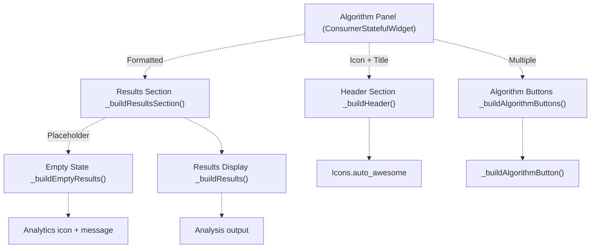

**Sources:** [lib/presentation/widgets/tm_algorithm_panel.dart L61-L78](https://github.com/ThalesMMS/JFlutter/blob/32e808b4/lib/presentation/widgets/tm_algorithm_panel.dart#L61-L78)

 [lib/presentation/widgets/pda_algorithm_panel.dart L36-L52](https://github.com/ThalesMMS/JFlutter/blob/32e808b4/lib/presentation/widgets/pda_algorithm_panel.dart#L36-L52)

 [lib/presentation/widgets/grammar_algorithm_panel.dart L41-L57](https://github.com/ThalesMMS/JFlutter/blob/32e808b4/lib/presentation/widgets/grammar_algorithm_panel.dart#L41-L57)

### State Management Pattern

Each panel maintains local state for analysis execution while reading automaton/grammar state from Riverpod providers:

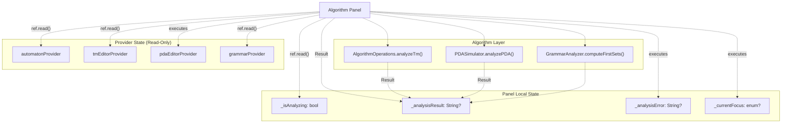

**Sources:** [lib/presentation/widgets/tm_algorithm_panel.dart L54-L59](https://github.com/ThalesMMS/JFlutter/blob/32e808b4/lib/presentation/widgets/tm_algorithm_panel.dart#L54-L59)

 [lib/presentation/widgets/pda_algorithm_panel.dart L29-L33](https://github.com/ThalesMMS/JFlutter/blob/32e808b4/lib/presentation/widgets/pda_algorithm_panel.dart#L29-L33)

 [lib/presentation/widgets/grammar_algorithm_panel.dart L36-L38](https://github.com/ThalesMMS/JFlutter/blob/32e808b4/lib/presentation/widgets/grammar_algorithm_panel.dart#L36-L38)

### Execution Flow

The standard algorithm execution pattern across all panels:

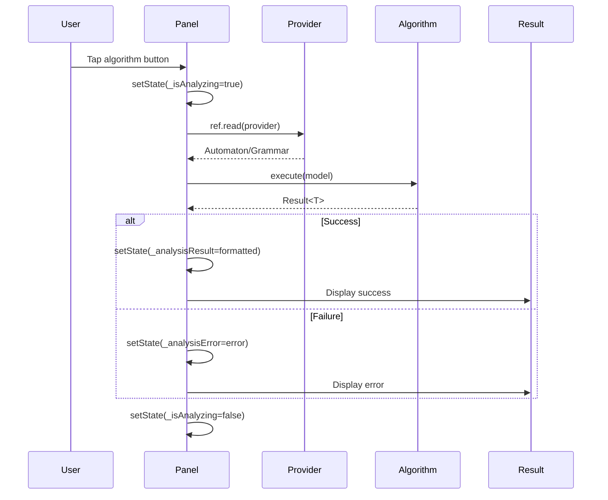

**Sources:** [lib/presentation/widgets/tm_algorithm_panel.dart L543-L585](https://github.com/ThalesMMS/JFlutter/blob/32e808b4/lib/presentation/widgets/tm_algorithm_panel.dart#L543-L585)

 [lib/presentation/widgets/pda_algorithm_panel.dart L654-L688](https://github.com/ThalesMMS/JFlutter/blob/32e808b4/lib/presentation/widgets/pda_algorithm_panel.dart#L654-L688)

 [lib/presentation/widgets/grammar_algorithm_panel.dart L573-L622](https://github.com/ThalesMMS/JFlutter/blob/32e808b4/lib/presentation/widgets/grammar_algorithm_panel.dart#L573-L622)

## TM Algorithm Panel

### Analysis Categories

`TMAlgorithmPanel` organizes Turing machine analysis into six focused categories:

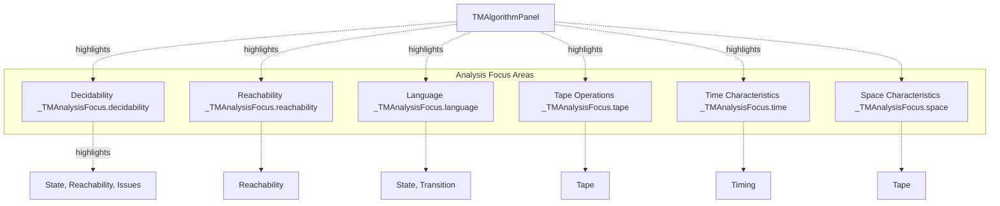

The `_TMAnalysisFocus` enum [lib/presentation/widgets/tm_algorithm_panel.dart L26-L33](https://github.com/ThalesMMS/JFlutter/blob/32e808b4/lib/presentation/widgets/tm_algorithm_panel.dart#L26-L33)

 tracks which analysis category the user selected, enabling contextual highlighting of relevant result sections [lib/presentation/widgets/tm_algorithm_panel.dart L668-L693](https://github.com/ThalesMMS/JFlutter/blob/32e808b4/lib/presentation/widgets/tm_algorithm_panel.dart#L668-L693)

**Sources:** [lib/presentation/widgets/tm_algorithm_panel.dart L26-L33](https://github.com/ThalesMMS/JFlutter/blob/32e808b4/lib/presentation/widgets/tm_algorithm_panel.dart#L26-L33)

 [lib/presentation/widgets/tm_algorithm_panel.dart L95-L147](https://github.com/ThalesMMS/JFlutter/blob/32e808b4/lib/presentation/widgets/tm_algorithm_panel.dart#L95-L147)

 [lib/presentation/widgets/tm_algorithm_panel.dart L668-L693](https://github.com/ThalesMMS/JFlutter/blob/32e808b4/lib/presentation/widgets/tm_algorithm_panel.dart#L668-L693)

### Analysis Execution

All TM analyses execute through a single entry point:

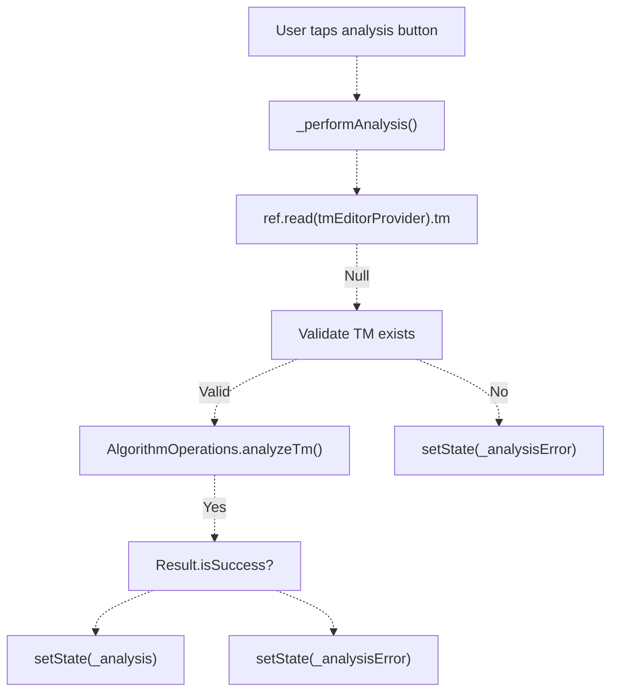

The unified analysis approach [lib/presentation/widgets/tm_algorithm_panel.dart L543-L585](https://github.com/ThalesMMS/JFlutter/blob/32e808b4/lib/presentation/widgets/tm_algorithm_panel.dart#L543-L585)

 calls `AlgorithmOperations.analyzeTm()` once, then extracts different metrics based on the selected focus. This produces a comprehensive `TMAnalysis` object containing:

* **State Analysis**: Total states, accepting states, reachability
* **Transition Analysis**: Total transitions, TM vs FSA transitions
* **Tape Analysis**: Read/write symbols, move directions, tape alphabet
* **Reachability Analysis**: Reachable/unreachable states
* **Execution Time**: Analysis duration

**Sources:** [lib/presentation/widgets/tm_algorithm_panel.dart L543-L585](https://github.com/ThalesMMS/JFlutter/blob/32e808b4/lib/presentation/widgets/tm_algorithm_panel.dart#L543-L585)

 [lib/presentation/widgets/tm_algorithm_panel.dart L17-L24](https://github.com/ThalesMMS/JFlutter/blob/32e808b4/lib/presentation/widgets/tm_algorithm_panel.dart#L17-L24)

### Result Display Structure

TM analysis results are organized into section cards with conditional highlighting:

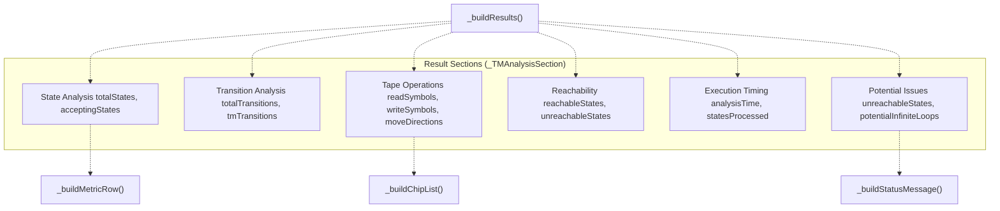

Each section card uses `_shouldHighlight()` [lib/presentation/widgets/tm_algorithm_panel.dart L668-L693](https://github.com/ThalesMMS/JFlutter/blob/32e808b4/lib/presentation/widgets/tm_algorithm_panel.dart#L668-L693)

 to determine whether to apply primary color highlighting based on the current `_TMAnalysisFocus`. Metric rows display key-value pairs, chip lists show collections of symbols/states, and status messages provide warnings or confirmations.

The panel detects potential infinite loops by identifying self-transitions that read and write the same symbol while using `TapeDirection.stay` [lib/presentation/widgets/tm_algorithm_panel.dart L846-L856](https://github.com/ThalesMMS/JFlutter/blob/32e808b4/lib/presentation/widgets/tm_algorithm_panel.dart#L846-L856)

**Sources:** [lib/presentation/widgets/tm_algorithm_panel.dart L292-L541](https://github.com/ThalesMMS/JFlutter/blob/32e808b4/lib/presentation/widgets/tm_algorithm_panel.dart#L292-L541)

 [lib/presentation/widgets/tm_algorithm_panel.dart L629-L666](https://github.com/ThalesMMS/JFlutter/blob/32e808b4/lib/presentation/widgets/tm_algorithm_panel.dart#L629-L666)

 [lib/presentation/widgets/tm_algorithm_panel.dart L846-L856](https://github.com/ThalesMMS/JFlutter/blob/32e808b4/lib/presentation/widgets/tm_algorithm_panel.dart#L846-L856)

## PDA Algorithm Panel

### Algorithm Categories

`PDAAlgorithmPanel` provides six distinct PDA analysis operations:

| Button | Operation | Implementation | Output Type |
| --- | --- | --- | --- |
| Convert to CFG | PDA→Grammar conversion | `ConversionService.convertPdaToCfg()` | `Grammar` |
| Minimize PDA | Remove unreachable/nonproductive states | `PDASimulator.simplify()` | `SimplificationSummary` |
| Check Determinism | Identify nondeterministic transitions | Provider state check | Analysis text |
| Find Reachable States | BFS from initial state | `PDASimulator.analyzePDA()` | `PDAAnalysis` |
| Language Analysis | Sample accepted/rejected strings | `PDASimulator.findAcceptedStrings()` | Sample strings |
| Stack Operations | Analyze push/pop operations | `PDASimulator.analyzePDA()` | `StackAnalysis` |

**Sources:** [lib/presentation/widgets/pda_algorithm_panel.dart L69-L121](https://github.com/ThalesMMS/JFlutter/blob/32e808b4/lib/presentation/widgets/pda_algorithm_panel.dart#L69-L121)

### PDA to CFG Conversion Flow

The conversion operation integrates with the grammar system:

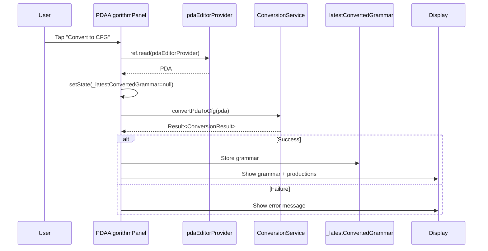

The panel retains the converted grammar in `_latestConvertedGrammar` [lib/presentation/widgets/pda_algorithm_panel.dart L32](https://github.com/ThalesMMS/JFlutter/blob/32e808b4/lib/presentation/widgets/pda_algorithm_panel.dart#L32-L32)

 and displays it using `_buildGrammarSummary()` [lib/presentation/widgets/pda_algorithm_panel.dart L690-L763](https://github.com/ThalesMMS/JFlutter/blob/32e808b4/lib/presentation/widgets/pda_algorithm_panel.dart#L690-L763)

 which formats productions, terminals, and nonterminals.

**Sources:** [lib/presentation/widgets/pda_algorithm_panel.dart L298-L330](https://github.com/ThalesMMS/JFlutter/blob/32e808b4/lib/presentation/widgets/pda_algorithm_panel.dart#L298-L330)

 [lib/presentation/widgets/pda_algorithm_panel.dart L690-L763](https://github.com/ThalesMMS/JFlutter/blob/32e808b4/lib/presentation/widgets/pda_algorithm_panel.dart#L690-L763)

 [lib/presentation/widgets/pda_algorithm_panel.dart L16-L17](https://github.com/ThalesMMS/JFlutter/blob/32e808b4/lib/presentation/widgets/pda_algorithm_panel.dart#L16-L17)

### Minimization Analysis

The minimization operation modifies the PDA in place and reports changes:

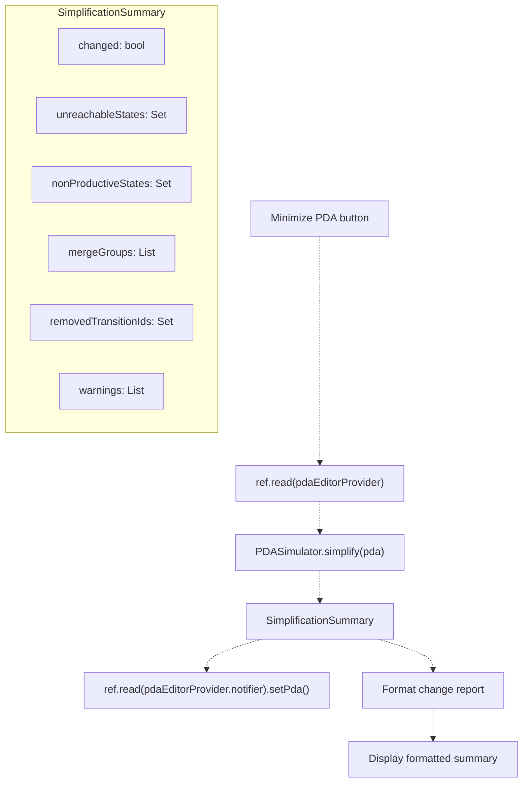

The formatted report [lib/presentation/widgets/pda_algorithm_panel.dart L341-L413](https://github.com/ThalesMMS/JFlutter/blob/32e808b4/lib/presentation/widgets/pda_algorithm_panel.dart#L341-L413)

 includes:

* State count changes (before → after)
* Transition count changes
* Removed unreachable states
* Removed nonproductive states
* Merged equivalent state groups
* Removed redundant transitions
* Warnings

**Sources:** [lib/presentation/widgets/pda_algorithm_panel.dart L332-L414](https://github.com/ThalesMMS/JFlutter/blob/32e808b4/lib/presentation/widgets/pda_algorithm_panel.dart#L332-L414)

 [lib/presentation/widgets/pda_algorithm_panel.dart L341-L413](https://github.com/ThalesMMS/JFlutter/blob/32e808b4/lib/presentation/widgets/pda_algorithm_panel.dart#L341-L413)

### Determinism Detection

Determinism checking reads nondeterministic transition IDs directly from the provider state:

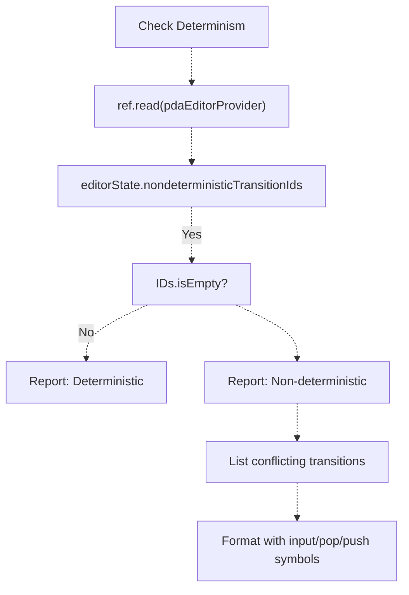

The provider pre-computes nondeterministic transitions, so the panel only needs to format them [lib/presentation/widgets/pda_algorithm_panel.dart L416-L469](https://github.com/ThalesMMS/JFlutter/blob/32e808b4/lib/presentation/widgets/pda_algorithm_panel.dart#L416-L469)

 Lambda transitions are also reported separately using `editorState.lambdaTransitionIds`.

**Sources:** [lib/presentation/widgets/pda_algorithm_panel.dart L416-L469](https://github.com/ThalesMMS/JFlutter/blob/32e808b4/lib/presentation/widgets/pda_algorithm_panel.dart#L416-L469)

## Grammar Algorithm Panel

### Conversion Operations

`GrammarAlgorithmPanel` provides four grammar-to-automaton conversion variants:

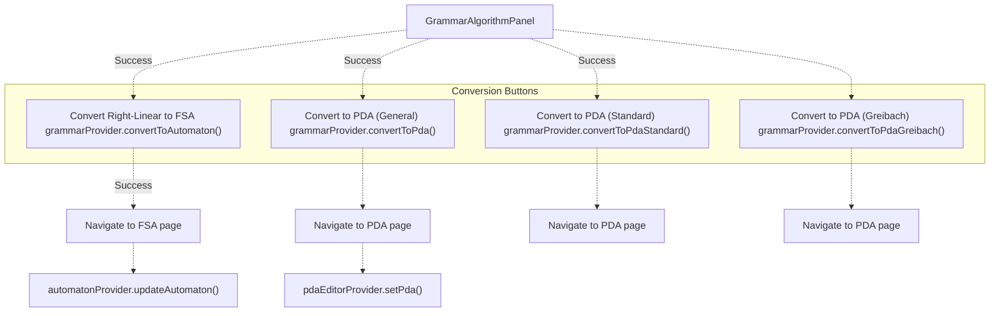

The conversion section [lib/presentation/widgets/grammar_algorithm_panel.dart L133-L219](https://github.com/ThalesMMS/JFlutter/blob/32e808b4/lib/presentation/widgets/grammar_algorithm_panel.dart#L133-L219)

 displays processing state using `grammarState.isConverting` and `grammarState.activeConversion` to show which conversion is in progress. All conversions are disabled when `grammarState.productions.isEmpty`.

Upon successful conversion, the panel:

1. Updates the target provider (automaton or PDA)
2. Navigates to the appropriate page using `homeNavigationProvider`
3. Shows a success snackbar

**Sources:** [lib/presentation/widgets/grammar_algorithm_panel.dart L133-L219](https://github.com/ThalesMMS/JFlutter/blob/32e808b4/lib/presentation/widgets/grammar_algorithm_panel.dart#L133-L219)

 [lib/presentation/widgets/grammar_algorithm_panel.dart L295-L412](https://github.com/ThalesMMS/JFlutter/blob/32e808b4/lib/presentation/widgets/grammar_algorithm_panel.dart#L295-L412)

### Analysis Algorithms

Grammar analysis operations use `GrammarAnalyzer` to perform transformations and computations:

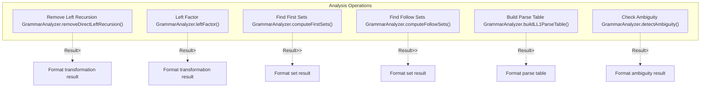

All analysis operations follow the same pattern via `_performAnalysis<T>()` [lib/presentation/widgets/grammar_algorithm_panel.dart L573-L622](https://github.com/ThalesMMS/JFlutter/blob/32e808b4/lib/presentation/widgets/grammar_algorithm_panel.dart#L573-L622)

:

1. Validate grammar: `grammar.validate()` must return empty errors
2. Execute analysis function asynchronously
3. Format result using type-specific formatter
4. Display formatted output or error

**Sources:** [lib/presentation/widgets/grammar_algorithm_panel.dart L503-L571](https://github.com/ThalesMMS/JFlutter/blob/32e808b4/lib/presentation/widgets/grammar_algorithm_panel.dart#L503-L571)

 [lib/presentation/widgets/grammar_algorithm_panel.dart L573-L622](https://github.com/ThalesMMS/JFlutter/blob/32e808b4/lib/presentation/widgets/grammar_algorithm_panel.dart#L573-L622)

### Result Formatting

Grammar analysis results use specialized formatters:

| Result Type | Formatter Method | Output Includes |
| --- | --- | --- |
| Grammar transformation | `_formatTransformationResult()` | Original grammar, transformed grammar, notes, derivations |
| FIRST/FOLLOW sets | `_formatSetResult()` | Set mappings for each nonterminal, sorted alphabetically |
| LL(1) parse table | `_formatParseTableResult()` | Table grid, conflicts, notes |
| Ambiguity check | `_formatAmbiguityResult()` | Status (ambiguous/unambiguous), conflicts |

All formatters receive a `GrammarAnalysisReport<T>` containing:

* `value`: The computed result
* `notes`: Explanatory messages
* `conflicts`: Problems detected
* `derivations`: Step-by-step explanations

The grammar formatting helper `_formatGrammar()` [lib/presentation/widgets/grammar_algorithm_panel.dart L717-L737](https://github.com/ThalesMMS/JFlutter/blob/32e808b4/lib/presentation/widgets/grammar_algorithm_panel.dart#L717-L737)

 groups productions by left-hand side and displays them in `A → α | β | γ` notation.

**Sources:** [lib/presentation/widgets/grammar_algorithm_panel.dart L624-L715](https://github.com/ThalesMMS/JFlutter/blob/32e808b4/lib/presentation/widgets/grammar_algorithm_panel.dart#L624-L715)

 [lib/presentation/widgets/grammar_algorithm_panel.dart L717-L737](https://github.com/ThalesMMS/JFlutter/blob/32e808b4/lib/presentation/widgets/grammar_algorithm_panel.dart#L717-L737)

## Result Display System

### Empty State Pattern

All panels implement a consistent empty state when no analysis has been run:

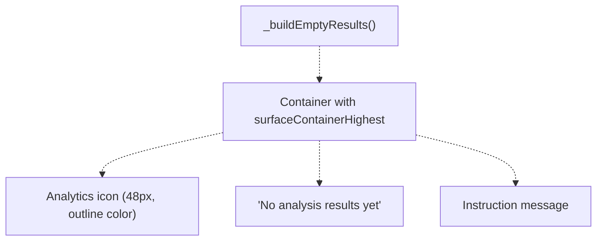

The empty state uses:

* `Icons.analytics_outlined` at 48px
* `colorScheme.outline` for muted appearance
* Center-aligned content in a bordered container
* Contextual instruction text (e.g., "Select an algorithm above to analyze your TM")

**Sources:** [lib/presentation/widgets/tm_algorithm_panel.dart L253-L290](https://github.com/ThalesMMS/JFlutter/blob/32e808b4/lib/presentation/widgets/tm_algorithm_panel.dart#L253-L290)

 [lib/presentation/widgets/pda_algorithm_panel.dart L223-L260](https://github.com/ThalesMMS/JFlutter/blob/32e808b4/lib/presentation/widgets/pda_algorithm_panel.dart#L223-L260)

 [lib/presentation/widgets/grammar_algorithm_panel.dart L440-L477](https://github.com/ThalesMMS/JFlutter/blob/32e808b4/lib/presentation/widgets/grammar_algorithm_panel.dart#L440-L477)

### Success Display Pattern

Successful analysis results display in a scrollable container:

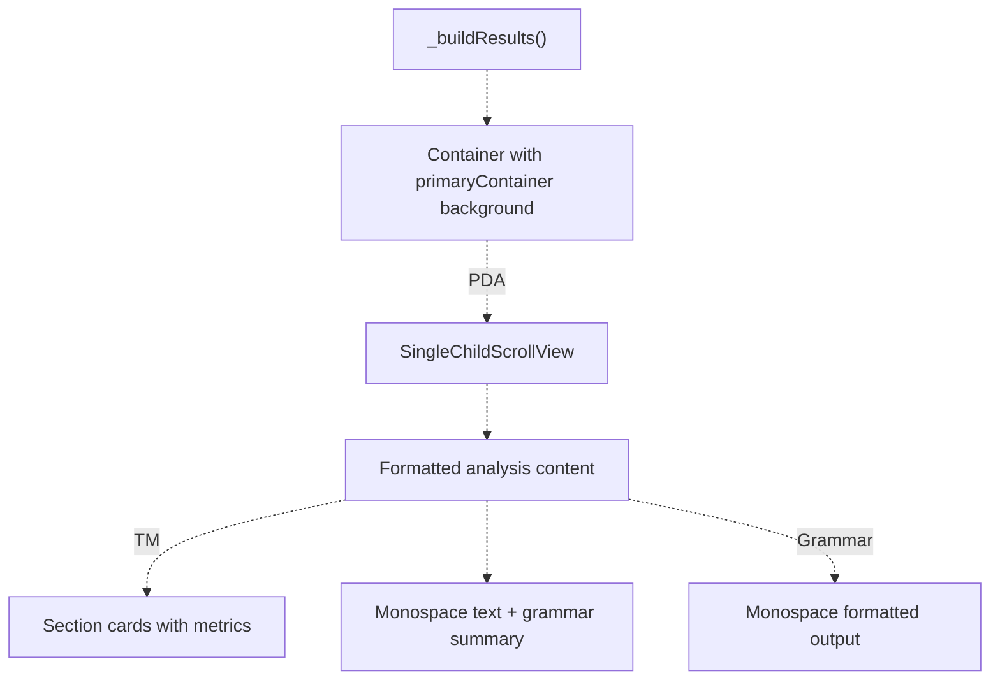

Common styling:

* Background: `colorScheme.primaryContainer.withValues(alpha: 0.3)`
* Border: `colorScheme.primary.withValues(alpha: 0.3)`
* Text: Monospace font family for technical output
* Padding: 16px all sides

**Sources:** [lib/presentation/widgets/tm_algorithm_panel.dart L292-L541](https://github.com/ThalesMMS/JFlutter/blob/32e808b4/lib/presentation/widgets/tm_algorithm_panel.dart#L292-L541)

 [lib/presentation/widgets/pda_algorithm_panel.dart L262-L296](https://github.com/ThalesMMS/JFlutter/blob/32e808b4/lib/presentation/widgets/pda_algorithm_panel.dart#L262-L296)

 [lib/presentation/widgets/grammar_algorithm_panel.dart L479-L501](https://github.com/ThalesMMS/JFlutter/blob/32e808b4/lib/presentation/widgets/grammar_algorithm_panel.dart#L479-L501)

### Error Display Pattern

Errors use a distinct visual treatment:

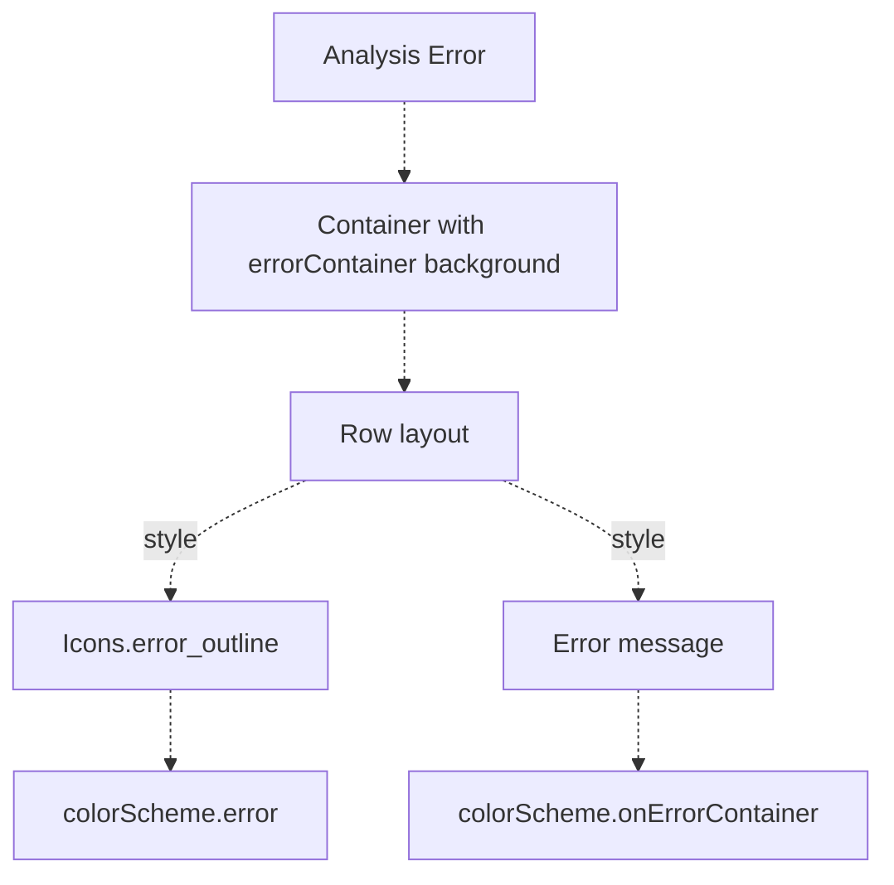

TM panel error display [lib/presentation/widgets/tm_algorithm_panel.dart L295-L319](https://github.com/ThalesMMS/JFlutter/blob/32e808b4/lib/presentation/widgets/tm_algorithm_panel.dart#L295-L319)

 uses:

* `colorScheme.errorContainer.withValues(alpha: 0.4)` background
* `colorScheme.error` border and icon color
* `Icons.error_outline` icon
* `colorScheme.onErrorContainer` text color

Other panels show errors via snackbars using `ScaffoldMessenger.of(context).showSnackBar()` with `backgroundColor: colorScheme.error`.

**Sources:** [lib/presentation/widgets/tm_algorithm_panel.dart L295-L319](https://github.com/ThalesMMS/JFlutter/blob/32e808b4/lib/presentation/widgets/tm_algorithm_panel.dart#L295-L319)

 [lib/presentation/widgets/pda_algorithm_panel.dart L765-L773](https://github.com/ThalesMMS/JFlutter/blob/32e808b4/lib/presentation/widgets/pda_algorithm_panel.dart#L765-L773)

 [lib/presentation/widgets/grammar_algorithm_panel.dart L443-L450](https://github.com/ThalesMMS/JFlutter/blob/32e808b4/lib/presentation/widgets/grammar_algorithm_panel.dart#L443-L450)

## Algorithm Button Design

### Button Structure

All panels use a consistent algorithm button component:

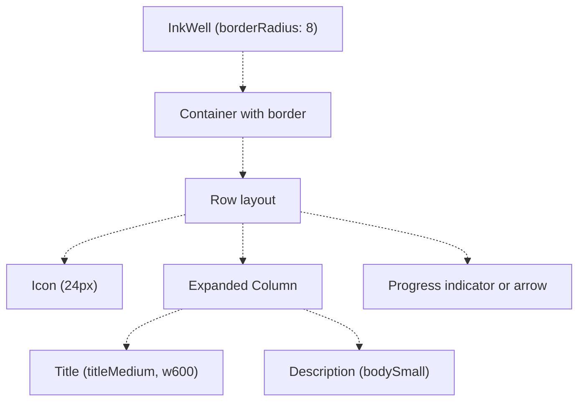

**Button States:**

| State | Visual Treatment |
| --- | --- |
| Idle | `primary.withValues(alpha: 0.3)` border, primary color icon/text |
| Loading | `outline.withValues(alpha: 0.3)` border, outline color, `CircularProgressIndicator` |
| Disabled | Grayed out, no tap handling |

**Sources:** [lib/presentation/widgets/tm_algorithm_panel.dart L149-L226](https://github.com/ThalesMMS/JFlutter/blob/32e808b4/lib/presentation/widgets/tm_algorithm_panel.dart#L149-L226)

 [lib/presentation/widgets/pda_algorithm_panel.dart L123-L195](https://github.com/ThalesMMS/JFlutter/blob/32e808b4/lib/presentation/widgets/pda_algorithm_panel.dart#L123-L195)

 [lib/presentation/widgets/grammar_algorithm_panel.dart L221-L293](https://github.com/ThalesMMS/JFlutter/blob/32e808b4/lib/presentation/widgets/grammar_algorithm_panel.dart#L221-L293)

### Button Grid Layout

Buttons are arranged vertically with 12px spacing:

```
Column(  children: [    _buildAlgorithmButton(...),    const SizedBox(height: 12),    _buildAlgorithmButton(...),    const SizedBox(height: 12),    // ... more buttons  ],)
```

TM panel uses 6 buttons, PDA panel uses 6 buttons, and Grammar panel uses 6 analysis buttons plus 4 conversion buttons in a separate section.

**Sources:** [lib/presentation/widgets/tm_algorithm_panel.dart L95-L147](https://github.com/ThalesMMS/JFlutter/blob/32e808b4/lib/presentation/widgets/tm_algorithm_panel.dart#L95-L147)

 [lib/presentation/widgets/pda_algorithm_panel.dart L69-L121](https://github.com/ThalesMMS/JFlutter/blob/32e808b4/lib/presentation/widgets/pda_algorithm_panel.dart#L69-L121)

 [lib/presentation/widgets/grammar_algorithm_panel.dart L76-L131](https://github.com/ThalesMMS/JFlutter/blob/32e808b4/lib/presentation/widgets/grammar_algorithm_panel.dart#L76-L131)

## Integration with Provider System

### Provider Dependencies

Algorithm panels depend on editor providers for model access:

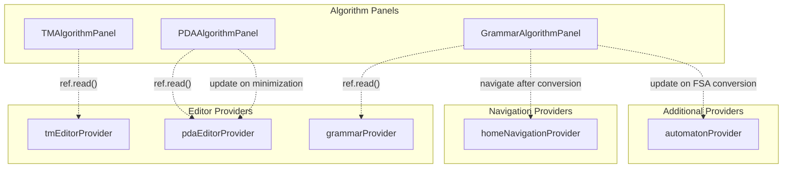

**Provider Usage Patterns:**

* **Read model**: `ref.read(provider)` to get current state
* **Update model**: `ref.read(provider.notifier).method()` to modify state
* **No watching**: Panels use `ref.read()` not `ref.watch()` to avoid rebuilds during analysis

**Sources:** [lib/presentation/widgets/tm_algorithm_panel.dart L24](https://github.com/ThalesMMS/JFlutter/blob/32e808b4/lib/presentation/widgets/tm_algorithm_panel.dart#L24-L24)

 [lib/presentation/widgets/pda_algorithm_panel.dart L17](https://github.com/ThalesMMS/JFlutter/blob/32e808b4/lib/presentation/widgets/pda_algorithm_panel.dart#L17-L17)

 [lib/presentation/widgets/grammar_algorithm_panel.dart L20-L23](https://github.com/ThalesMMS/JFlutter/blob/32e808b4/lib/presentation/widgets/grammar_algorithm_panel.dart#L20-L23)

### Navigation After Conversion

Grammar panel navigates to appropriate pages after successful conversions:

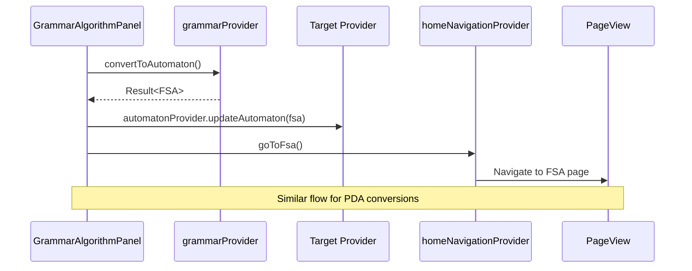

The navigation ensures users immediately see their converted automaton in the appropriate editor workspace.

**Sources:** [lib/presentation/widgets/grammar_algorithm_panel.dart L295-L327](https://github.com/ThalesMMS/JFlutter/blob/32e808b4/lib/presentation/widgets/grammar_algorithm_panel.dart#L295-L327)

 [lib/presentation/widgets/grammar_algorithm_panel.dart L384-L412](https://github.com/ThalesMMS/JFlutter/blob/32e808b4/lib/presentation/widgets/grammar_algorithm_panel.dart#L384-L412)

## Lifecycle and State Management

### Component Lifecycle

```css
#mermaid-4a0i7tqtllk{font-family:ui-sans-serif,-apple-system,system-ui,Segoe UI,Helvetica;font-size:16px;fill:#ccc;}@keyframes edge-animation-frame{from{stroke-dashoffset:0;}}@keyframes dash{to{stroke-dashoffset:0;}}#mermaid-4a0i7tqtllk .edge-animation-slow{stroke-dasharray:9,5!important;stroke-dashoffset:900;animation:dash 50s linear infinite;stroke-linecap:round;}#mermaid-4a0i7tqtllk .edge-animation-fast{stroke-dasharray:9,5!important;stroke-dashoffset:900;animation:dash 20s linear infinite;stroke-linecap:round;}#mermaid-4a0i7tqtllk .error-icon{fill:#a44141;}#mermaid-4a0i7tqtllk .error-text{fill:#ddd;stroke:#ddd;}#mermaid-4a0i7tqtllk .edge-thickness-normal{stroke-width:1px;}#mermaid-4a0i7tqtllk .edge-thickness-thick{stroke-width:3.5px;}#mermaid-4a0i7tqtllk .edge-pattern-solid{stroke-dasharray:0;}#mermaid-4a0i7tqtllk .edge-thickness-invisible{stroke-width:0;fill:none;}#mermaid-4a0i7tqtllk .edge-pattern-dashed{stroke-dasharray:3;}#mermaid-4a0i7tqtllk .edge-pattern-dotted{stroke-dasharray:2;}#mermaid-4a0i7tqtllk .marker{fill:lightgrey;stroke:lightgrey;}#mermaid-4a0i7tqtllk .marker.cross{stroke:lightgrey;}#mermaid-4a0i7tqtllk svg{font-family:ui-sans-serif,-apple-system,system-ui,Segoe UI,Helvetica;font-size:16px;}#mermaid-4a0i7tqtllk p{margin:0;}#mermaid-4a0i7tqtllk defs #statediagram-barbEnd{fill:lightgrey;stroke:lightgrey;}#mermaid-4a0i7tqtllk g.stateGroup text{fill:#ccc;stroke:none;font-size:10px;}#mermaid-4a0i7tqtllk g.stateGroup text{fill:#ccc;stroke:none;font-size:10px;}#mermaid-4a0i7tqtllk g.stateGroup .state-title{font-weight:bolder;fill:#e0dfdf;}#mermaid-4a0i7tqtllk g.stateGroup rect{fill:#1f2020;stroke:#ccc;}#mermaid-4a0i7tqtllk g.stateGroup line{stroke:lightgrey;stroke-width:1;}#mermaid-4a0i7tqtllk .transition{stroke:lightgrey;stroke-width:1;fill:none;}#mermaid-4a0i7tqtllk .stateGroup .composit{fill:#333;border-bottom:1px;}#mermaid-4a0i7tqtllk .stateGroup .alt-composit{fill:#e0e0e0;border-bottom:1px;}#mermaid-4a0i7tqtllk .state-note{stroke:hsl(180, 0%, 18.3529411765%);fill:hsl(180, 1.5873015873%, 28.3529411765%);}#mermaid-4a0i7tqtllk .state-note text{fill:rgb(183.8476190475, 181.5523809523, 181.5523809523);stroke:none;font-size:10px;}#mermaid-4a0i7tqtllk .stateLabel .box{stroke:none;stroke-width:0;fill:#1f2020;opacity:0.5;}#mermaid-4a0i7tqtllk .edgeLabel .label rect{fill:#1f2020;opacity:0.5;}#mermaid-4a0i7tqtllk .edgeLabel{background-color:hsl(0, 0%, 34.4117647059%);text-align:center;}#mermaid-4a0i7tqtllk .edgeLabel p{background-color:hsl(0, 0%, 34.4117647059%);}#mermaid-4a0i7tqtllk .edgeLabel rect{opacity:0.5;background-color:hsl(0, 0%, 34.4117647059%);fill:hsl(0, 0%, 34.4117647059%);}#mermaid-4a0i7tqtllk .edgeLabel .label text{fill:#ccc;}#mermaid-4a0i7tqtllk .label div .edgeLabel{color:#ccc;}#mermaid-4a0i7tqtllk .stateLabel text{fill:#e0dfdf;font-size:10px;font-weight:bold;}#mermaid-4a0i7tqtllk .node circle.state-start{fill:#f4f4f4;stroke:#f4f4f4;}#mermaid-4a0i7tqtllk .node .fork-join{fill:#f4f4f4;stroke:#f4f4f4;}#mermaid-4a0i7tqtllk .node circle.state-end{fill:#cccccc;stroke:#333;stroke-width:1.5;}#mermaid-4a0i7tqtllk .end-state-inner{fill:#333;stroke-width:1.5;}#mermaid-4a0i7tqtllk .node rect{fill:#1f2020;stroke:#ccc;stroke-width:1px;}#mermaid-4a0i7tqtllk .node polygon{fill:#1f2020;stroke:#ccc;stroke-width:1px;}#mermaid-4a0i7tqtllk #statediagram-barbEnd{fill:lightgrey;}#mermaid-4a0i7tqtllk .statediagram-cluster rect{fill:#1f2020;stroke:#ccc;stroke-width:1px;}#mermaid-4a0i7tqtllk .cluster-label,#mermaid-4a0i7tqtllk .nodeLabel{color:#e0dfdf;}#mermaid-4a0i7tqtllk .statediagram-cluster rect.outer{rx:5px;ry:5px;}#mermaid-4a0i7tqtllk .statediagram-state .divider{stroke:#ccc;}#mermaid-4a0i7tqtllk .statediagram-state .title-state{rx:5px;ry:5px;}#mermaid-4a0i7tqtllk .statediagram-cluster.statediagram-cluster .inner{fill:#333;}#mermaid-4a0i7tqtllk .statediagram-cluster.statediagram-cluster-alt .inner{fill:#555;}#mermaid-4a0i7tqtllk .statediagram-cluster .inner{rx:0;ry:0;}#mermaid-4a0i7tqtllk .statediagram-state rect.basic{rx:5px;ry:5px;}#mermaid-4a0i7tqtllk .statediagram-state rect.divider{stroke-dasharray:10,10;fill:#555;}#mermaid-4a0i7tqtllk .note-edge{stroke-dasharray:5;}#mermaid-4a0i7tqtllk .statediagram-note rect{fill:hsl(180, 1.5873015873%, 28.3529411765%);stroke:hsl(180, 0%, 18.3529411765%);stroke-width:1px;rx:0;ry:0;}#mermaid-4a0i7tqtllk .statediagram-note rect{fill:hsl(180, 1.5873015873%, 28.3529411765%);stroke:hsl(180, 0%, 18.3529411765%);stroke-width:1px;rx:0;ry:0;}#mermaid-4a0i7tqtllk .statediagram-note text{fill:rgb(183.8476190475, 181.5523809523, 181.5523809523);}#mermaid-4a0i7tqtllk .statediagram-note .nodeLabel{color:rgb(183.8476190475, 181.5523809523, 181.5523809523);}#mermaid-4a0i7tqtllk .statediagram .edgeLabel{color:red;}#mermaid-4a0i7tqtllk #dependencyStart,#mermaid-4a0i7tqtllk #dependencyEnd{fill:lightgrey;stroke:lightgrey;stroke-width:1;}#mermaid-4a0i7tqtllk .statediagramTitleText{text-anchor:middle;font-size:18px;fill:#ccc;}#mermaid-4a0i7tqtllk :root{--mermaid-font-family:ui-sans-serif,-apple-system,system-ui,Segoe UI,Helvetica;}Widget mountedUser taps buttonExecute algorithmResult.isSuccessResult.isFailureFormat outputShow errorNew analysisNew analysisWidget disposedIdleAnalyzingProcessingSuccessErrorDisplayResultDisplayError
```

**State Transitions:**

1. **Idle → Analyzing**: User taps algorithm button, `setState(_isAnalyzing: true)`
2. **Analyzing → Processing**: Read model from provider, execute algorithm
3. **Processing → Success/Error**: Check `Result<T>.isSuccess`
4. **Success → DisplayResult**: Format result, `setState(_analysisResult: formatted)`
5. **DisplayError → Idle**: User can retry with different parameters

**Sources:** [lib/presentation/widgets/tm_algorithm_panel.dart L543-L585](https://github.com/ThalesMMS/JFlutter/blob/32e808b4/lib/presentation/widgets/tm_algorithm_panel.dart#L543-L585)

 [lib/presentation/widgets/pda_algorithm_panel.dart L654-L688](https://github.com/ThalesMMS/JFlutter/blob/32e808b4/lib/presentation/widgets/pda_algorithm_panel.dart#L654-L688)

### Mounted Check Pattern

All panels check `mounted` before calling `setState()` after async operations:

```
try {  final result = await runAnalysis();  if (!mounted) return;  // Prevent setState on disposed widget    setState(() {    _isAnalyzing = false;    _analysisResult = formatResult(result);  });} catch (e) {  if (!mounted) return;    setState(() {    _isAnalyzing = false;    _analysisError = e.toString();  });}
```

This prevents errors when users navigate away before analysis completes.

**Sources:** [lib/presentation/widgets/tm_algorithm_panel.dart L572-L584](https://github.com/ThalesMMS/JFlutter/blob/32e808b4/lib/presentation/widgets/tm_algorithm_panel.dart#L572-L584)

 [lib/presentation/widgets/pda_algorithm_panel.dart L670-L686](https://github.com/ThalesMMS/JFlutter/blob/32e808b4/lib/presentation/widgets/pda_algorithm_panel.dart#L670-L686)

 [lib/presentation/widgets/grammar_algorithm_panel.dart L602-L621](https://github.com/ThalesMMS/JFlutter/blob/32e808b4/lib/presentation/widgets/grammar_algorithm_panel.dart#L602-L621)

### Local State Reset

When starting a new analysis, panels clear previous results:

```sql
setState(() {  _isAnalyzing = true;  _analysisResult = null;  // Clear previous result  _analysisError = null;    // Clear previous error  _currentFocus = focus;    // Update focus (TM only)});
```

TM panel additionally maintains `_analyzedTm` to detect model changes and `_currentFocus` for contextual highlighting.

**Sources:** [lib/presentation/widgets/tm_algorithm_panel.dart L544-L549](https://github.com/ThalesMMS/JFlutter/blob/32e808b4/lib/presentation/widgets/tm_algorithm_panel.dart#L544-L549)

 [lib/presentation/widgets/pda_algorithm_panel.dart L659-L665](https://github.com/ThalesMMS/JFlutter/blob/32e808b4/lib/presentation/widgets/pda_algorithm_panel.dart#L659-L665)

 [lib/presentation/widgets/grammar_algorithm_panel.dart L580-L583](https://github.com/ThalesMMS/JFlutter/blob/32e808b4/lib/presentation/widgets/grammar_algorithm_panel.dart#L580-L583)

Refresh this wiki

Last indexed: 30 December 2025 ([32e808](https://github.com/ThalesMMS/JFlutter/commit/32e808b4))

### On this page

* [Algorithm Panels](#7.3-algorithm-panels)
* [Purpose and Scope](#7.3-purpose-and-scope)
* [Overview](#7.3-overview)
* [Common Architecture Pattern](#7.3-common-architecture-pattern)
* [Panel Component Structure](#7.3-panel-component-structure)
* [State Management Pattern](#7.3-state-management-pattern)
* [Execution Flow](#7.3-execution-flow)
* [TM Algorithm Panel](#7.3-tm-algorithm-panel)
* [Analysis Categories](#7.3-analysis-categories)
* [Analysis Execution](#7.3-analysis-execution)
* [Result Display Structure](#7.3-result-display-structure)
* [PDA Algorithm Panel](#7.3-pda-algorithm-panel)
* [Algorithm Categories](#7.3-algorithm-categories)
* [PDA to CFG Conversion Flow](#7.3-pda-to-cfg-conversion-flow)
* [Minimization Analysis](#7.3-minimization-analysis)
* [Determinism Detection](#7.3-determinism-detection)
* [Grammar Algorithm Panel](#7.3-grammar-algorithm-panel)
* [Conversion Operations](#7.3-conversion-operations)
* [Analysis Algorithms](#7.3-analysis-algorithms)
* [Result Formatting](#7.3-result-formatting)
* [Result Display System](#7.3-result-display-system)
* [Empty State Pattern](#7.3-empty-state-pattern)
* [Success Display Pattern](#7.3-success-display-pattern)
* [Error Display Pattern](#7.3-error-display-pattern)
* [Algorithm Button Design](#7.3-algorithm-button-design)
* [Button Structure](#7.3-button-structure)
* [Button Grid Layout](#7.3-button-grid-layout)
* [Integration with Provider System](#7.3-integration-with-provider-system)
* [Provider Dependencies](#7.3-provider-dependencies)
* [Navigation After Conversion](#7.3-navigation-after-conversion)
* [Lifecycle and State Management](#7.3-lifecycle-and-state-management)
* [Component Lifecycle](#7.3-component-lifecycle)
* [Mounted Check Pattern](#7.3-mounted-check-pattern)
* [Local State Reset](#7.3-local-state-reset)

Ask Devin about JFlutter