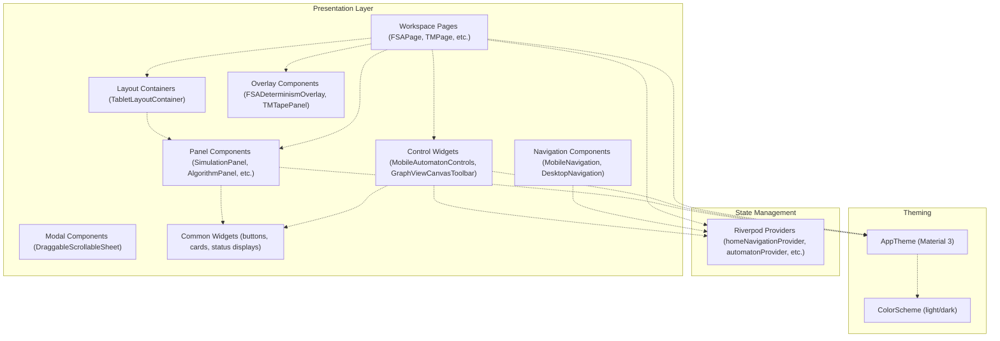
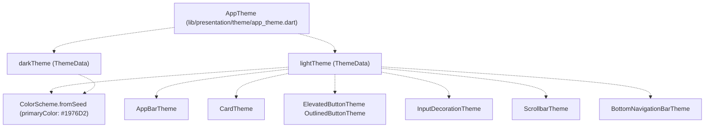
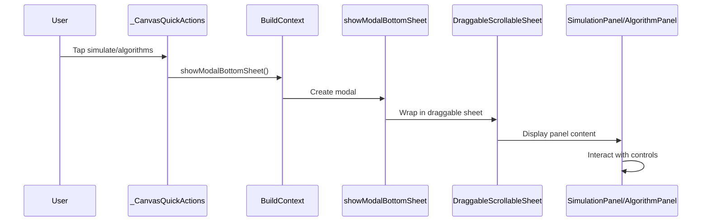
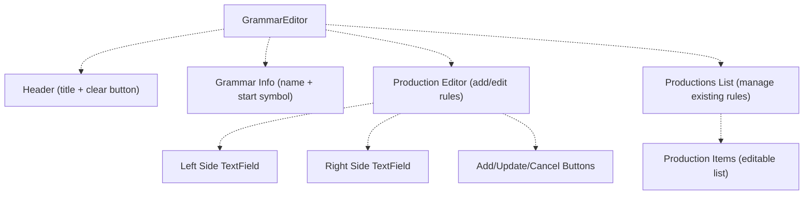
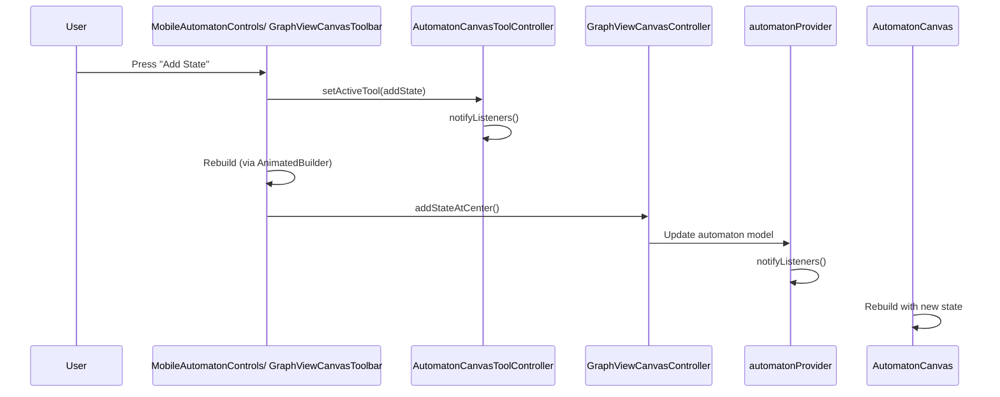
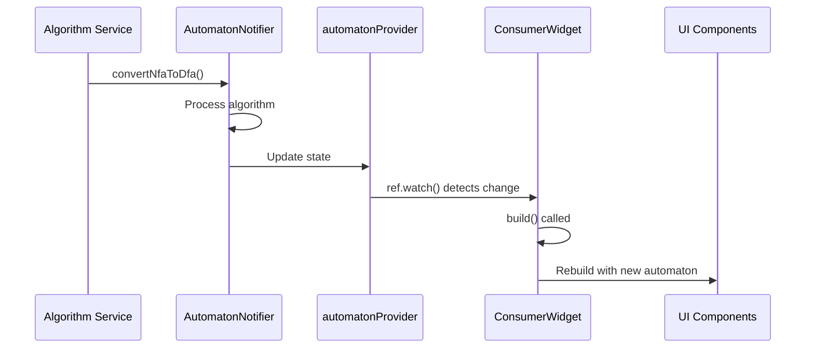

# User Interface Components

> **Relevant source files**
> * [lib/core/parsers/jflap_xml_parser.dart](https://github.com/ThalesMMS/JFlutter/blob/32e808b4/lib/core/parsers/jflap_xml_parser.dart)
> * [lib/core/services/trace_persistence_service_stub.dart](https://github.com/ThalesMMS/JFlutter/blob/32e808b4/lib/core/services/trace_persistence_service_stub.dart)
> * [lib/presentation/pages/fsa_page.dart](https://github.com/ThalesMMS/JFlutter/blob/32e808b4/lib/presentation/pages/fsa_page.dart)
> * [lib/presentation/pages/grammar_page.dart](https://github.com/ThalesMMS/JFlutter/blob/32e808b4/lib/presentation/pages/grammar_page.dart)
> * [lib/presentation/pages/home_page.dart](https://github.com/ThalesMMS/JFlutter/blob/32e808b4/lib/presentation/pages/home_page.dart)
> * [lib/presentation/pages/pda_page.dart](https://github.com/ThalesMMS/JFlutter/blob/32e808b4/lib/presentation/pages/pda_page.dart)
> * [lib/presentation/pages/pumping_lemma_page.dart](https://github.com/ThalesMMS/JFlutter/blob/32e808b4/lib/presentation/pages/pumping_lemma_page.dart)
> * [lib/presentation/pages/regex_page.dart](https://github.com/ThalesMMS/JFlutter/blob/32e808b4/lib/presentation/pages/regex_page.dart)
> * [lib/presentation/pages/tm_page.dart](https://github.com/ThalesMMS/JFlutter/blob/32e808b4/lib/presentation/pages/tm_page.dart)
> * [lib/presentation/theme/app_theme.dart](https://github.com/ThalesMMS/JFlutter/blob/32e808b4/lib/presentation/theme/app_theme.dart)
> * [lib/presentation/widgets/desktop_navigation.dart](https://github.com/ThalesMMS/JFlutter/blob/32e808b4/lib/presentation/widgets/desktop_navigation.dart)
> * [lib/presentation/widgets/grammar_editor.dart](https://github.com/ThalesMMS/JFlutter/blob/32e808b4/lib/presentation/widgets/grammar_editor.dart)
> * [lib/presentation/widgets/tablet_layout_container.dart](https://github.com/ThalesMMS/JFlutter/blob/32e808b4/lib/presentation/widgets/tablet_layout_container.dart)
> * [test/tablet_layout_test.dart](https://github.com/ThalesMMS/JFlutter/blob/32e808b4/test/tablet_layout_test.dart)
> * [test/widget/presentation/home_page_test.dart](https://github.com/ThalesMMS/JFlutter/blob/32e808b4/test/widget/presentation/home_page_test.dart)

## Purpose and Scope

This document provides an overview of JFlutter's reusable UI components and responsive design patterns. The UI layer employs a mobile-first architecture built with Flutter and Material 3, featuring component-based design that adapts across mobile, tablet, and desktop screen sizes.

For detailed information about specific UI subsystems, see:

* [Navigation and HomePage](#8.1) - PageView navigation, route management, and navigation components
* [Responsive Layout System](#8.2) - Breakpoints, TabletLayoutContainer, and adaptive layout strategies
* [Mobile Controls](#8.3) - MobileAutomatonControls and touch-optimized UI
* [Toolbars and Canvas Controls](#8.4) - GraphViewCanvasToolbar and canvas control widgets
* [Theme System](#8.5) - Material 3 theming, color schemes, and visual styling

For canvas-specific rendering components, see [Canvas System](#4).

## UI Architecture Overview

The UI layer follows a component-based architecture with `HomePage` orchestrating navigation between workspace pages. Components are organized into reusable widgets that handle specific concerns (navigation, controls, panels, modals) and adapt to screen size through responsive layout containers.

### Component Hierarchy



**Component Organization:**

| Category | Components | Location |
| --- | --- | --- |
| Navigation | `HomePage`, `MobileNavigation`, `DesktopNavigation` | `lib/presentation/pages/home_page.dart`, `lib/presentation/widgets/mobile_navigation.dart`, `lib/presentation/widgets/desktop_navigation.dart` |
| Layouts | `TabletLayoutContainer` | `lib/presentation/widgets/tablet_layout_container.dart` |
| Controls | `MobileAutomatonControls`, `GraphViewCanvasToolbar`, `AutomatonCanvasToolController` | `lib/presentation/widgets/mobile_automaton_controls.dart`, `lib/presentation/widgets/graphview_canvas_toolbar.dart`, `lib/presentation/widgets/automaton_canvas_tool.dart` |
| Panels | `SimulationPanel`, `AlgorithmPanel`, `TMAlgorithmPanel`, `PDAAlgorithmPanel`, `GrammarSimulationPanel` | `lib/presentation/widgets/simulation_panel.dart`, `lib/presentation/widgets/algorithm_panel.dart`, etc. |
| Canvas | `AutomatonCanvas`, `TMCanvasGraphView`, `PDACanvasGraphView` | `lib/presentation/widgets/automaton_canvas.dart`, `lib/presentation/widgets/tm_canvas_graphview.dart`, `lib/presentation/widgets/pda_canvas_graphview.dart` |
| Overlays | `FSADeterminismOverlay`, `TMTapePanel`, `PDAStackPanel` | `lib/presentation/widgets/fsa/determinism_badge.dart`, `lib/presentation/widgets/tm/tape_drawer.dart`, `lib/presentation/widgets/pda/stack_drawer.dart` |
| Editors | `GrammarEditor` | `lib/presentation/widgets/grammar_editor.dart` |

**Sources:** [lib/presentation/pages/home_page.dart L1-L277](https://github.com/ThalesMMS/JFlutter/blob/32e808b4/lib/presentation/pages/home_page.dart#L1-L277)

 [lib/presentation/widgets/tablet_layout_container.dart L1-L154](https://github.com/ThalesMMS/JFlutter/blob/32e808b4/lib/presentation/widgets/tablet_layout_container.dart#L1-L154)

 [lib/presentation/widgets/mobile_automaton_controls.dart](https://github.com/ThalesMMS/JFlutter/blob/32e808b4/lib/presentation/widgets/mobile_automaton_controls.dart)

 [lib/presentation/widgets/graphview_canvas_toolbar.dart](https://github.com/ThalesMMS/JFlutter/blob/32e808b4/lib/presentation/widgets/graphview_canvas_toolbar.dart)

## Component Catalog

### Reusable Widget Categories

JFlutter's UI components are designed for reusability across different workspace pages:

**Navigation Components:**

* `MobileNavigation` - Bottom navigation bar for mobile layouts (< 1024px)
* `DesktopNavigation` - NavigationRail for desktop layouts (≥ 1024px)
* `homeNavigationProvider` - Riverpod state notifier managing page index

**Layout Components:**

* `TabletLayoutContainer` - Responsive layout with collapsible sidebar and tabs for tablet screens (1024-1399px)
* Standard Row/Column layouts for desktop (≥ 1400px)
* Stack-based layouts with modal sheets for mobile (< 1024px)

**Control Components:**

* `MobileAutomatonControls` - Bottom control bar with tool buttons, undo/redo, and status display
* `GraphViewCanvasToolbar` - Top toolbar for desktop canvas with tool selection and viewport controls
* `AutomatonCanvasToolController` - Listenable tool state controller shared across controls

**Panel Components:**

* `SimulationPanel` - Input string testing and trace visualization
* `AlgorithmPanel` - Algorithm operation buttons (NFA→DFA, minimize, etc.)
* `TMSimulationPanel`, `PDASimulationPanel`, `GrammarSimulationPanel` - Specialized simulation interfaces
* `TMAlgorithmPanel`, `PDAAlgorithmPanel`, `GrammarAlgorithmPanel` - Type-specific algorithm operations

**Overlay Components:**

* `FSADeterminismOverlay` - Badge showing DFA/NFA/ε-NFA status
* `TMTapePanel` - Floating tape visualization and controls
* `PDAStackPanel` - Floating stack visualization and controls

**Editor Components:**

* `GrammarEditor` - Form-based grammar rule editor with production management
* `AutomatonCanvas` - Canvas widget for FSA editing
* `TMCanvasGraphView`, `PDACanvasGraphView` - Type-specific canvas widgets

**Sources:** [lib/presentation/widgets/mobile_navigation.dart](https://github.com/ThalesMMS/JFlutter/blob/32e808b4/lib/presentation/widgets/mobile_navigation.dart)

 [lib/presentation/widgets/desktop_navigation.dart L1-L61](https://github.com/ThalesMMS/JFlutter/blob/32e808b4/lib/presentation/widgets/desktop_navigation.dart#L1-L61)

 [lib/presentation/widgets/tablet_layout_container.dart L1-L154](https://github.com/ThalesMMS/JFlutter/blob/32e808b4/lib/presentation/widgets/tablet_layout_container.dart#L1-L154)

 [lib/presentation/widgets/mobile_automaton_controls.dart](https://github.com/ThalesMMS/JFlutter/blob/32e808b4/lib/presentation/widgets/mobile_automaton_controls.dart)

 [lib/presentation/widgets/graphview_canvas_toolbar.dart](https://github.com/ThalesMMS/JFlutter/blob/32e808b4/lib/presentation/widgets/graphview_canvas_toolbar.dart)

 [lib/presentation/widgets/simulation_panel.dart](https://github.com/ThalesMMS/JFlutter/blob/32e808b4/lib/presentation/widgets/simulation_panel.dart)

 [lib/presentation/widgets/algorithm_panel.dart](https://github.com/ThalesMMS/JFlutter/blob/32e808b4/lib/presentation/widgets/algorithm_panel.dart)

## Navigation Components (Overview)

The navigation system uses adaptive components that change based on screen width:

* **Mobile** (< 1024px): `MobileNavigation` bottom bar with icons and labels
* **Desktop** (≥ 1024px): `DesktopNavigation` side rail with tooltips
* **State Management**: `homeNavigationProvider` synchronizes with `PageController`

Six workspace destinations are defined: FSA, Grammar, PDA, TM, Regex, and Pumping Lemma.

For complete navigation architecture and implementation details, see [Navigation and HomePage](#8.1).

**Sources:** [lib/presentation/widgets/mobile_navigation.dart](https://github.com/ThalesMMS/JFlutter/blob/32e808b4/lib/presentation/widgets/mobile_navigation.dart)

 [lib/presentation/widgets/desktop_navigation.dart L1-L61](https://github.com/ThalesMMS/JFlutter/blob/32e808b4/lib/presentation/widgets/desktop_navigation.dart#L1-L61)

 [lib/presentation/pages/home_page.dart L41-L72](https://github.com/ThalesMMS/JFlutter/blob/32e808b4/lib/presentation/pages/home_page.dart#L41-L72)

 [lib/presentation/pages/home_page.dart L89-L130](https://github.com/ThalesMMS/JFlutter/blob/32e808b4/lib/presentation/pages/home_page.dart#L89-L130)

## Responsive Layout Patterns (Overview)

JFlutter employs a three-tier responsive layout system with breakpoints at 1024px and 1400px:

**Breakpoints:**

* Mobile: < 1024px - Vertical stack with modal bottom sheets
* Tablet: 1024-1399px - Canvas with collapsible sidebar using `TabletLayoutContainer`
* Desktop: ≥ 1400px - Multi-column row layout with always-visible panels

All workspace pages implement a consistent pattern:

```
// From fsa_page.dart:527-544Widget build(BuildContext context) {  final screenSize = MediaQuery.of(context).size;  return Scaffold(    body: screenSize.width < 1024         ? _buildMobileLayout()         : screenSize.width < 1400             ? _buildTabletLayout()             : _buildDesktopLayout(),  );}
```

For complete layout strategies, `TabletLayoutContainer` implementation, and breakpoint rationale, see [Responsive Layout System](#8.2).

**Sources:** [lib/presentation/pages/fsa_page.dart L527-L544](https://github.com/ThalesMMS/JFlutter/blob/32e808b4/lib/presentation/pages/fsa_page.dart#L527-L544)

 [lib/presentation/pages/tm_page.dart L113-L145](https://github.com/ThalesMMS/JFlutter/blob/32e808b4/lib/presentation/pages/tm_page.dart#L113-L145)

 [lib/presentation/pages/pda_page.dart L115-L131](https://github.com/ThalesMMS/JFlutter/blob/32e808b4/lib/presentation/pages/pda_page.dart#L115-L131)

 [lib/presentation/widgets/tablet_layout_container.dart L1-L154](https://github.com/ThalesMMS/JFlutter/blob/32e808b4/lib/presentation/widgets/tablet_layout_container.dart#L1-L154)

## Control Components (Overview)

JFlutter provides two primary control systems that adapt to screen size:

### Tool State Management

`AutomatonCanvasToolController` manages active tool selection across all canvas-based pages:

```sql
// From automaton_canvas_tool.dartenum AutomatonCanvasTool {  selection,    // Select and manipulate elements  addState,     // Add new states  transition,   // Create transitions}
```

The controller is a `ChangeNotifier` that synchronizes tool state between UI controls and canvas interactions.

### Control Widget Types

| Component | Screen Size | Location | Features |
| --- | --- | --- | --- |
| `MobileAutomatonControls` | < 1024px | Bottom overlay | Tool buttons, undo/redo, viewport controls, status display |
| `GraphViewCanvasToolbar` | ≥ 1024px | Top overlay | Tool selection, add state/transition, clear, undo/redo |

Both components share the same `AutomatonCanvasToolController` instance and canvas controller, ensuring synchronized state.

For implementation details, see [Mobile Controls](#8.3) and [Toolbars and Canvas Controls](#8.4).

**Sources:** [lib/presentation/widgets/automaton_canvas_tool.dart](https://github.com/ThalesMMS/JFlutter/blob/32e808b4/lib/presentation/widgets/automaton_canvas_tool.dart)

 [lib/presentation/widgets/mobile_automaton_controls.dart](https://github.com/ThalesMMS/JFlutter/blob/32e808b4/lib/presentation/widgets/mobile_automaton_controls.dart)

 [lib/presentation/widgets/graphview_canvas_toolbar.dart](https://github.com/ThalesMMS/JFlutter/blob/32e808b4/lib/presentation/widgets/graphview_canvas_toolbar.dart)

 [lib/presentation/pages/fsa_page.dart L44-L56](https://github.com/ThalesMMS/JFlutter/blob/32e808b4/lib/presentation/pages/fsa_page.dart#L44-L56)

 [lib/presentation/pages/fsa_page.dart L66-L73](https://github.com/ThalesMMS/JFlutter/blob/32e808b4/lib/presentation/pages/fsa_page.dart#L66-L73)

## Theme System (Overview)

JFlutter uses Material 3 theming with light and dark mode support:

### Theme Structure



**Key Theme Properties:**

* Primary color: `#1976D2` (Material Blue 700)
* Material 3 `useMaterial3: true`
* Consistent border radius: 8-12px
* Elevation-based depth: 0-8

For complete theme configuration and customization details, see [Theme System](#8.5).

**Sources:** [lib/presentation/theme/app_theme.dart L1-L120](https://github.com/ThalesMMS/JFlutter/blob/32e808b4/lib/presentation/theme/app_theme.dart#L1-L120)

## Common UI Patterns

JFlutter implements several recurring UI patterns across workspace pages:

### Modal Bottom Sheet Pattern

Mobile layouts use `DraggableScrollableSheet` for simulation and algorithm panels:



**Configuration:**

```
// From fsa_page.dart:590-626DraggableScrollableSheet(  expand: false,  initialChildSize: 0.7,  // 70% of screen height  minChildSize: 0.4,      // Can collapse to 40%  maxChildSize: 0.95,     // Can expand to 95%  builder: (context, scrollController) { ... },)
```

**Sources:** [lib/presentation/pages/fsa_page.dart L590-L626](https://github.com/ThalesMMS/JFlutter/blob/32e808b4/lib/presentation/pages/fsa_page.dart#L590-L626)

 [lib/presentation/pages/tm_page.dart L404-L486](https://github.com/ThalesMMS/JFlutter/blob/32e808b4/lib/presentation/pages/tm_page.dart#L404-L486)

 [lib/presentation/pages/pda_page.dart L167-L252](https://github.com/ThalesMMS/JFlutter/blob/32e808b4/lib/presentation/pages/pda_page.dart#L167-L252)

### Status Message Display

All workspace pages implement contextual status messages in toolbars:

**Status Message Pattern:**

```
// From fsa_page.dart:490-519String _buildToolbarStatusMessage(AutomatonState state) {  if (automaton == null) return 'No automaton loaded';    final warnings = <String>[];  if (automaton.initialState == null) warnings.add('Missing start state');  if (automaton.acceptingStates.isEmpty) warnings.add('No accepting states');  if (!automaton.isDeterministic) warnings.add('Nondeterministic');    final counts = '$stateCount states · $transitionCount transitions';  return warnings.isEmpty ? counts : '⚠ ${warnings.join(' · ')} · $counts';}
```

Status messages appear in:

* `MobileAutomatonControls.statusMessage` (mobile)
* `GraphViewCanvasToolbar.statusMessage` (desktop)

**Sources:** [lib/presentation/pages/fsa_page.dart L490-L524](https://github.com/ThalesMMS/JFlutter/blob/32e808b4/lib/presentation/pages/fsa_page.dart#L490-L524)

 [lib/presentation/pages/tm_page.dart L336-L368](https://github.com/ThalesMMS/JFlutter/blob/32e808b4/lib/presentation/pages/tm_page.dart#L336-L368)

 [lib/presentation/pages/pda_page.dart L475-L509](https://github.com/ThalesMMS/JFlutter/blob/32e808b4/lib/presentation/pages/pda_page.dart#L475-L509)

### Quick Action Buttons

Canvas pages display floating action buttons for quick access to panels on mobile:

```css
// From fsa_page.dart:675-714class _CanvasQuickActions extends StatelessWidget {  final VoidCallback? onSimulate;  final VoidCallback? onAlgorithms;    @override  Widget build(BuildContext context) {    return Material(      elevation: 6,      borderRadius: BorderRadius.circular(32),      color: colorScheme.surface.withOpacity(0.92),      child: Row(        children: [          if (onSimulate != null) IconButton(icon: Icon(Icons.play_arrow), ...),          if (onAlgorithms != null) IconButton(icon: Icon(Icons.auto_awesome), ...),        ],      ),    );  }}
```

Quick actions are positioned with `Stack` and `Positioned` widgets at `top: 16, left: 16`.

**Sources:** [lib/presentation/pages/fsa_page.dart L417-L425](https://github.com/ThalesMMS/JFlutter/blob/32e808b4/lib/presentation/pages/fsa_page.dart#L417-L425)

 [lib/presentation/pages/fsa_page.dart L675-L714](https://github.com/ThalesMMS/JFlutter/blob/32e808b4/lib/presentation/pages/fsa_page.dart#L675-L714)

 [lib/presentation/pages/tm_page.dart L239-L249](https://github.com/ThalesMMS/JFlutter/blob/32e808b4/lib/presentation/pages/tm_page.dart#L239-L249)

 [lib/presentation/pages/tm_page.dart L589-L642](https://github.com/ThalesMMS/JFlutter/blob/32e808b4/lib/presentation/pages/tm_page.dart#L589-L642)

### Snackbar Notifications

User feedback is provided through Material `SnackBar` notifications:

```
// From fsa_page.dart:82-96void _showSnack(String message, {bool isError = false}) {  ScaffoldMessenger.of(context).showSnackBar(    SnackBar(      content: Text(message),      backgroundColor: isError ? theme.colorScheme.errorContainer : null,      behavior: SnackBarBehavior.floating,    ),  );}
```

Snackbars appear after:

* Algorithm completion (success/error)
* Validation failures
* Import/export operations
* State changes requiring user awareness

**Sources:** [lib/presentation/pages/fsa_page.dart L82-L96](https://github.com/ThalesMMS/JFlutter/blob/32e808b4/lib/presentation/pages/fsa_page.dart#L82-L96)

 [lib/presentation/pages/regex_page.dart L177-L204](https://github.com/ThalesMMS/JFlutter/blob/32e808b4/lib/presentation/pages/regex_page.dart#L177-L204)

## Page-Specific UI Components

Each workspace page includes specialized overlay widgets for domain-specific visualization:

### FSA Page Components

**Determinism Badge Overlay:**

`FSADeterminismOverlay` displays a badge indicating whether the current automaton is a DFA, NFA, or ε-NFA:

```
// From fsa_page.dart:427, 465FSADeterminismOverlay(automaton: state.currentAutomaton)
```

The badge appears in the top-right corner of the canvas and updates reactively as the automaton changes.

**Sources:** [lib/presentation/pages/fsa_page.dart L427](https://github.com/ThalesMMS/JFlutter/blob/32e808b4/lib/presentation/pages/fsa_page.dart#L427-L427)

 [lib/presentation/pages/fsa_page.dart L465](https://github.com/ThalesMMS/JFlutter/blob/32e808b4/lib/presentation/pages/fsa_page.dart#L465-L465)

 [lib/presentation/widgets/fsa/determinism_badge.dart](https://github.com/ThalesMMS/JFlutter/blob/32e808b4/lib/presentation/widgets/fsa/determinism_badge.dart)

### PDA Page Components

**Stack Visualization Panel:**

`PDAStackPanel` provides a floating visualization of the PDA's stack state:

```javascript
// From pda_page.dart:147-161PDAStackPanel(  stackState: _currentStack,  initialStackSymbol: pda.initialStackSymbol,  stackAlphabet: pda.stackAlphabet,  onClear: () => setState(() => _currentStack = const StackState.empty()),)
```

The panel displays the current stack contents and provides a clear button to reset simulation state.

**Sources:** [lib/presentation/pages/pda_page.dart L147-L161](https://github.com/ThalesMMS/JFlutter/blob/32e808b4/lib/presentation/pages/pda_page.dart#L147-L161)

 [lib/presentation/pages/pda_page.dart L455-L470](https://github.com/ThalesMMS/JFlutter/blob/32e808b4/lib/presentation/pages/pda_page.dart#L455-L470)

 [lib/presentation/widgets/pda/stack_drawer.dart](https://github.com/ThalesMMS/JFlutter/blob/32e808b4/lib/presentation/widgets/pda/stack_drawer.dart)

### TM Page Components

**Tape Visualization Panel:**

`TMTapePanel` displays the Turing machine's tape with current head position:

```javascript
// From tm_page.dart:161-177, 315-331TMTapePanel(  tapeState: _currentTape,  tapeAlphabet: tm.tapeAlphabet,  onClear: () => setState(() => _currentTape = TapeState.initial(    blankSymbol: tm.blankSymbol,  )),)
```

**Metrics Info Panel:**

The TM page also includes a metrics panel showing machine statistics:

```
// From tm_page.dart:488-550Widget _buildInfoPanel(BuildContext context) {  return Container(    child: Column(      children: [        Text('Turing Machine Overview'),        _buildInfoRow('States', '$_stateCount'),        _buildInfoRow('Transitions', '$_transitionCount'),        _buildInfoRow('Tape Symbols', _formatSet(_tapeSymbols)),        _buildInfoRow('Simulation Ready', _isMachineReady ? 'Yes' : 'No'),        // ...      ],    ),  );}
```

**Sources:** [lib/presentation/pages/tm_page.dart L161-L177](https://github.com/ThalesMMS/JFlutter/blob/32e808b4/lib/presentation/pages/tm_page.dart#L161-L177)

 [lib/presentation/pages/tm_page.dart L315-L331](https://github.com/ThalesMMS/JFlutter/blob/32e808b4/lib/presentation/pages/tm_page.dart#L315-L331)

 [lib/presentation/pages/tm_page.dart L488-L550](https://github.com/ThalesMMS/JFlutter/blob/32e808b4/lib/presentation/pages/tm_page.dart#L488-L550)

 [lib/presentation/widgets/tm/tape_drawer.dart](https://github.com/ThalesMMS/JFlutter/blob/32e808b4/lib/presentation/widgets/tm/tape_drawer.dart)

### Grammar Page Components

**Grammar Editor Widget:**

`GrammarEditor` provides a comprehensive form-based interface for grammar editing:



The editor handles:

* Grammar name and start symbol configuration
* Production rule creation and editing
* Lambda production normalization (ε → empty list)
* Responsive layout (stacks fields on small screens)

**Sources:** [lib/presentation/widgets/grammar_editor.dart L1-L636](https://github.com/ThalesMMS/JFlutter/blob/32e808b4/lib/presentation/widgets/grammar_editor.dart#L1-L636)

 [lib/presentation/pages/grammar_page.dart L46-L109](https://github.com/ThalesMMS/JFlutter/blob/32e808b4/lib/presentation/pages/grammar_page.dart#L46-L109)

## Component Interaction Patterns

### Canvas-Control-Provider Synchronization

Canvas pages synchronize state across multiple layers:



**Key Components:**

* `AutomatonCanvasToolController` - Tool state (selection, addState, transition)
* `GraphViewCanvasController` - Canvas operations (add, move, delete)
* `automatonProvider` - Domain model state
* `AnimatedBuilder` - Rebuilds controls when tool/canvas state changes

**Sources:** [lib/presentation/pages/fsa_page.dart L40-L64](https://github.com/ThalesMMS/JFlutter/blob/32e808b4/lib/presentation/pages/fsa_page.dart#L40-L64)

 [lib/presentation/pages/fsa_page.dart L66-L80](https://github.com/ThalesMMS/JFlutter/blob/32e808b4/lib/presentation/pages/fsa_page.dart#L66-L80)

 [lib/presentation/pages/fsa_page.dart L408-L456](https://github.com/ThalesMMS/JFlutter/blob/32e808b4/lib/presentation/pages/fsa_page.dart#L408-L456)

### Provider-UI Update Flow



All workspace pages use `ConsumerStatefulWidget` to watch providers and rebuild when state changes.

**Sources:** [lib/presentation/pages/fsa_page.dart L32-L37](https://github.com/ThalesMMS/JFlutter/blob/32e808b4/lib/presentation/pages/fsa_page.dart#L32-L37)

 [lib/presentation/providers/automaton_provider.dart](https://github.com/ThalesMMS/JFlutter/blob/32e808b4/lib/presentation/providers/automaton_provider.dart)

## Testing Infrastructure

The UI system includes comprehensive testing for responsive layouts and navigation:

```
// From tablet_layout_test.dart:16-24testWidgets('FSAPage uses TabletLayoutContainer on tablet width', (tester) async {  tester.view.physicalSize = const Size(1366, 1024);  await tester.pumpWidget(const ProviderScope(child: MaterialApp(home: FSAPage())));  expect(find.byType(TabletLayoutContainer), findsOneWidget);});
```

**Sources:** [test/tablet_layout_test.dart L15-L124](https://github.com/ThalesMMS/JFlutter/blob/32e808b4/test/tablet_layout_test.dart#L15-L124)

 [test/widget/presentation/home_page_test.dart L1-L202](https://github.com/ThalesMMS/JFlutter/blob/32e808b4/test/widget/presentation/home_page_test.dart#L1-L202)

---

**Primary Sources:**

* [lib/presentation/pages/home_page.dart L1-L277](https://github.com/ThalesMMS/JFlutter/blob/32e808b4/lib/presentation/pages/home_page.dart#L1-L277)
* [lib/presentation/pages/fsa_page.dart L1-L715](https://github.com/ThalesMMS/JFlutter/blob/32e808b4/lib/presentation/pages/fsa_page.dart#L1-L715)
* [lib/presentation/pages/tm_page.dart L1-L611](https://github.com/ThalesMMS/JFlutter/blob/32e808b4/lib/presentation/pages/tm_page.dart#L1-L611)
* [lib/presentation/pages/pda_page.dart L1-L549](https://github.com/ThalesMMS/JFlutter/blob/32e808b4/lib/presentation/pages/pda_page.dart#L1-L549)
* [lib/presentation/pages/grammar_page.dart L1-L204](https://github.com/ThalesMMS/JFlutter/blob/32e808b4/lib/presentation/pages/grammar_page.dart#L1-L204)
* [lib/presentation/pages/regex_page.dart L1-L854](https://github.com/ThalesMMS/JFlutter/blob/32e808b4/lib/presentation/pages/regex_page.dart#L1-L854)
* [lib/presentation/pages/pumping_lemma_page.dart L1-L170](https://github.com/ThalesMMS/JFlutter/blob/32e808b4/lib/presentation/pages/pumping_lemma_page.dart#L1-L170)
* [lib/presentation/pages/settings_page.dart L1-L514](https://github.com/ThalesMMS/JFlutter/blob/32e808b4/lib/presentation/pages/settings_page.dart#L1-L514)
* [lib/presentation/widgets/tablet_layout_container.dart L1-L154](https://github.com/ThalesMMS/JFlutter/blob/32e808b4/lib/presentation/widgets/tablet_layout_container.dart#L1-L154)
* [lib/presentation/widgets/mobile_navigation.dart](https://github.com/ThalesMMS/JFlutter/blob/32e808b4/lib/presentation/widgets/mobile_navigation.dart)
* [lib/presentation/widgets/desktop_navigation.dart L1-L59](https://github.com/ThalesMMS/JFlutter/blob/32e808b4/lib/presentation/widgets/desktop_navigation.dart#L1-L59)

Refresh this wiki

Last indexed: 30 December 2025 ([32e808](https://github.com/ThalesMMS/JFlutter/commit/32e808b4))

### On this page

* [User Interface Components](#8-user-interface-components)
* [Purpose and Scope](#8-purpose-and-scope)
* [UI Architecture Overview](#8-ui-architecture-overview)
* [Component Hierarchy](#8-component-hierarchy)
* [Component Catalog](#8-component-catalog)
* [Reusable Widget Categories](#8-reusable-widget-categories)
* [Navigation Components (Overview)](#8-navigation-components-overview)
* [Responsive Layout Patterns (Overview)](#8-responsive-layout-patterns-overview)
* [Control Components (Overview)](#8-control-components-overview)
* [Tool State Management](#8-tool-state-management)
* [Control Widget Types](#8-control-widget-types)
* [Theme System (Overview)](#8-theme-system-overview)
* [Theme Structure](#8-theme-structure)
* [Common UI Patterns](#8-common-ui-patterns)
* [Modal Bottom Sheet Pattern](#8-modal-bottom-sheet-pattern)
* [Status Message Display](#8-status-message-display)
* [Quick Action Buttons](#8-quick-action-buttons)
* [Snackbar Notifications](#8-snackbar-notifications)
* [Page-Specific UI Components](#8-page-specific-ui-components)
* [FSA Page Components](#8-fsa-page-components)
* [PDA Page Components](#8-pda-page-components)
* [TM Page Components](#8-tm-page-components)
* [Grammar Page Components](#8-grammar-page-components)
* [Component Interaction Patterns](#8-component-interaction-patterns)
* [Canvas-Control-Provider Synchronization](#8-canvas-control-provider-synchronization)
* [Provider-UI Update Flow](#8-provider-ui-update-flow)
* [Testing Infrastructure](#8-testing-infrastructure)

Ask Devin about JFlutter