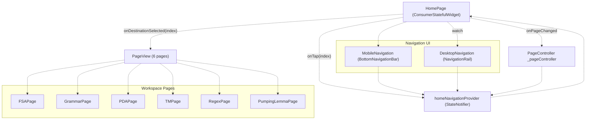
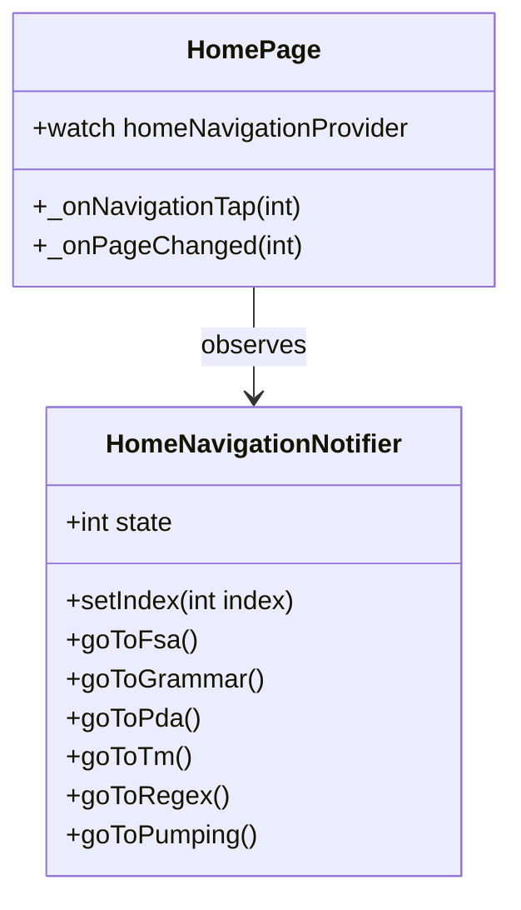
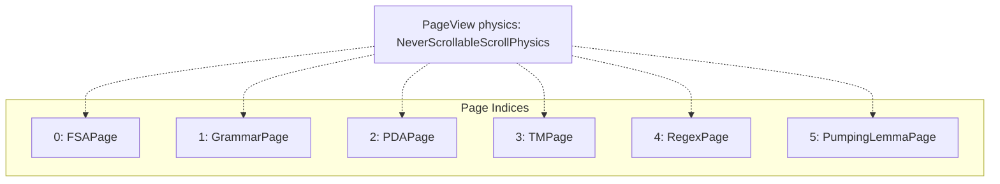
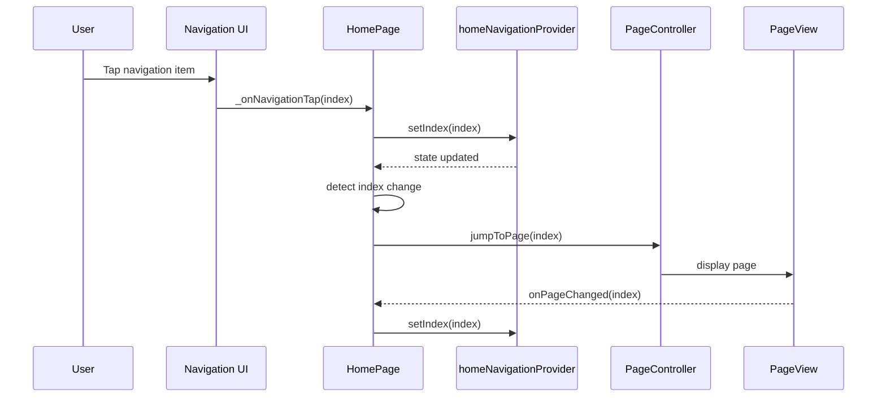
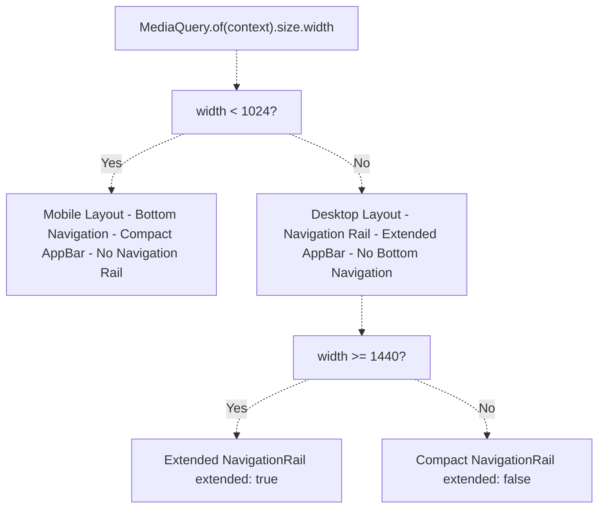
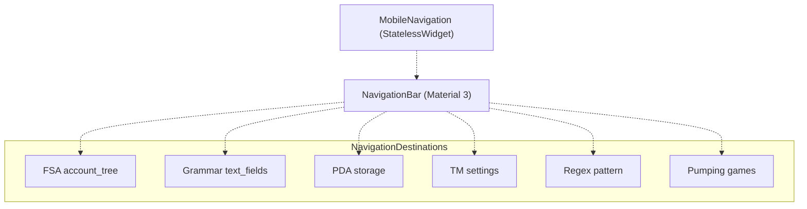
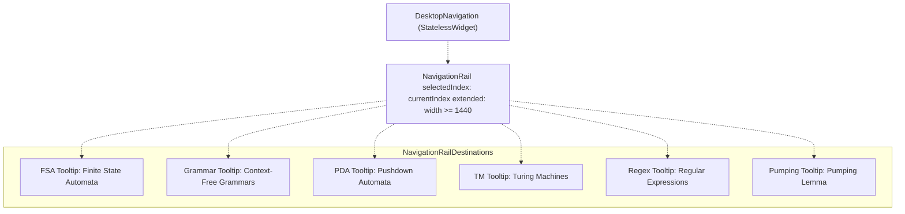
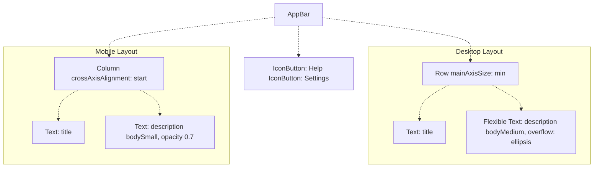

# Navigation and HomePage

> **Relevant source files**
> * [lib/core/parsers/jflap_xml_parser.dart](https://github.com/ThalesMMS/JFlutter/blob/32e808b4/lib/core/parsers/jflap_xml_parser.dart)
> * [lib/core/services/trace_persistence_service_stub.dart](https://github.com/ThalesMMS/JFlutter/blob/32e808b4/lib/core/services/trace_persistence_service_stub.dart)
> * [lib/presentation/pages/fsa_page.dart](https://github.com/ThalesMMS/JFlutter/blob/32e808b4/lib/presentation/pages/fsa_page.dart)
> * [lib/presentation/pages/grammar_page.dart](https://github.com/ThalesMMS/JFlutter/blob/32e808b4/lib/presentation/pages/grammar_page.dart)
> * [lib/presentation/pages/home_page.dart](https://github.com/ThalesMMS/JFlutter/blob/32e808b4/lib/presentation/pages/home_page.dart)
> * [lib/presentation/pages/pda_page.dart](https://github.com/ThalesMMS/JFlutter/blob/32e808b4/lib/presentation/pages/pda_page.dart)
> * [lib/presentation/pages/pumping_lemma_page.dart](https://github.com/ThalesMMS/JFlutter/blob/32e808b4/lib/presentation/pages/pumping_lemma_page.dart)
> * [lib/presentation/pages/regex_page.dart](https://github.com/ThalesMMS/JFlutter/blob/32e808b4/lib/presentation/pages/regex_page.dart)
> * [lib/presentation/pages/tm_page.dart](https://github.com/ThalesMMS/JFlutter/blob/32e808b4/lib/presentation/pages/tm_page.dart)
> * [lib/presentation/theme/app_theme.dart](https://github.com/ThalesMMS/JFlutter/blob/32e808b4/lib/presentation/theme/app_theme.dart)
> * [lib/presentation/widgets/desktop_navigation.dart](https://github.com/ThalesMMS/JFlutter/blob/32e808b4/lib/presentation/widgets/desktop_navigation.dart)
> * [lib/presentation/widgets/grammar_editor.dart](https://github.com/ThalesMMS/JFlutter/blob/32e808b4/lib/presentation/widgets/grammar_editor.dart)
> * [lib/presentation/widgets/tablet_layout_container.dart](https://github.com/ThalesMMS/JFlutter/blob/32e808b4/lib/presentation/widgets/tablet_layout_container.dart)
> * [test/tablet_layout_test.dart](https://github.com/ThalesMMS/JFlutter/blob/32e808b4/test/tablet_layout_test.dart)
> * [test/widget/presentation/home_page_test.dart](https://github.com/ThalesMMS/JFlutter/blob/32e808b4/test/widget/presentation/home_page_test.dart)

## Purpose and Scope

This document describes the navigation system and `HomePage` implementation that serves as the application's main navigation hub. The `HomePage` orchestrates PageView-based navigation between six workspace pages (FSA, Grammar, PDA, TM, Regex, Pumping Lemma) with responsive layout adaptation for mobile and desktop platforms. State synchronization is managed through the `homeNavigationProvider`.

For details on individual workspace pages, see [Automaton Workspace Pages](5%20Automaton-Workspace-Pages.md). For responsive layout patterns used within workspace pages, see [Responsive Layout System](8b%20Responsive-Layout-System.md).

---

## HomePage Architecture

The `HomePage` serves as the central navigation hub for JFlutter, implementing a PageView-based navigation system with state management via Riverpod. It coordinates between user navigation gestures, the navigation provider, and the PageView controller to ensure synchronized page transitions.

**Architecture Diagram: HomePage Component Structure**



Sources: [lib/presentation/pages/home_page.dart L1-L278](https://github.com/ThalesMMS/JFlutter/blob/32e808b4/lib/presentation/pages/home_page.dart#L1-L278)

The `HomePage` class extends `ConsumerStatefulWidget` and maintains:

* A `PageController` for managing the PageView
* A reference to `homeNavigationProvider` for state synchronization
* A `_lastNavigationIndex` for detecting navigation changes
* A fallback `SimulationHighlightService` for non-canvas pages

**Key State Variables:**

| Variable | Type | Purpose |
| --- | --- | --- |
| `_pageController` | `PageController` | Controls PageView page transitions |
| `_lastNavigationIndex` | `int?` | Tracks previous navigation index for change detection |
| `_fallbackHighlightService` | `SimulationHighlightService` | Provides default highlight service for non-canvas pages |
| `_navigationItems` | `List<NavigationItem>` | Defines navigation configuration |

Sources: [lib/presentation/pages/home_page.dart L35-L79](https://github.com/ThalesMMS/JFlutter/blob/32e808b4/lib/presentation/pages/home_page.dart#L35-L79)

---

## Navigation State Management

Navigation state is managed by the `homeNavigationProvider`, a Riverpod `StateNotifier` that maintains the current page index (0-5). The provider implements methods for updating the index and provides convenience navigation methods.

**State Provider Interface:**



Sources: [lib/presentation/providers/home_navigation_provider.dart](https://github.com/ThalesMMS/JFlutter/blob/32e808b4/lib/presentation/providers/home_navigation_provider.dart)

 [lib/presentation/pages/home_page.dart L89-L95](https://github.com/ThalesMMS/JFlutter/blob/32e808b4/lib/presentation/pages/home_page.dart#L89-L95)

The `HomePage` observes the provider using `ref.watch(homeNavigationProvider)` and synchronizes with the PageView through two methods:

* `_onNavigationTap(int index)`: Called when user taps navigation UI, updates provider
* `_onPageChanged(int index)`: Called when PageView changes, updates provider

Sources: [lib/presentation/pages/home_page.dart L89-L95](https://github.com/ThalesMMS/JFlutter/blob/32e808b4/lib/presentation/pages/home_page.dart#L89-L95)

---

## PageView Navigation System

The navigation system uses Flutter's `PageView` widget to display six workspace pages. The PageView has gesture-based swiping disabled (`NeverScrollableScrollPhysics`) to prevent unintended navigation, requiring explicit user interaction with navigation controls.

**PageView Configuration:**



Sources: [lib/presentation/pages/home_page.dart L133-L145](https://github.com/ThalesMMS/JFlutter/blob/32e808b4/lib/presentation/pages/home_page.dart#L133-L145)

**Navigation Synchronization Flow:**



Sources: [lib/presentation/pages/home_page.dart L89-L95](https://github.com/ThalesMMS/JFlutter/blob/32e808b4/lib/presentation/pages/home_page.dart#L89-L95)

 [lib/presentation/pages/home_page.dart L115-L130](https://github.com/ThalesMMS/JFlutter/blob/32e808b4/lib/presentation/pages/home_page.dart#L115-L130)

The synchronization logic in the build method ensures the PageController stays synchronized with the provider state:

```
if (_lastNavigationIndex != currentIndex) {  WidgetsBinding.instance.addPostFrameCallback((_) {    if (!mounted || !_pageController.hasClients) return;    final currentPage = _pageController.page?.round() ?? _pageController.initialPage;    if (currentPage == currentIndex) return;    _pageController.jumpToPage(currentIndex);  });  _lastNavigationIndex = currentIndex;}
```

Sources: [lib/presentation/pages/home_page.dart L115-L130](https://github.com/ThalesMMS/JFlutter/blob/32e808b4/lib/presentation/pages/home_page.dart#L115-L130)

---

## Navigation Items Configuration

Navigation items are defined as a static list of `NavigationItem` objects, each containing a label, icon, and description. This configuration drives both the mobile and desktop navigation UI.

**NavigationItem Structure:**

| Field | Type | Purpose |
| --- | --- | --- |
| `label` | `String` | Short label displayed in navigation |
| `icon` | `IconData` | Material icon for visual identification |
| `description` | `String` | Full description shown in AppBar |

**Navigation Items Table:**

| Index | Label | Icon | Description | Page Type |
| --- | --- | --- | --- | --- |
| 0 | FSA | `account_tree` | Finite State Automata | Canvas-based |
| 1 | Grammar | `text_fields` | Context-Free Grammars | Editor-based |
| 2 | PDA | `storage` | Pushdown Automata | Canvas-based |
| 3 | TM | `settings` | Turing Machines | Canvas-based |
| 4 | Regex | `pattern` | Regular Expressions | Form-based |
| 5 | Pumping | `games` | Pumping Lemma | Game-based |

Sources: [lib/presentation/pages/home_page.dart L41-L72](https://github.com/ThalesMMS/JFlutter/blob/32e808b4/lib/presentation/pages/home_page.dart#L41-L72)

---

## Responsive Layout Adaptation

The `HomePage` implements responsive layout adaptation using MediaQuery width breakpoints:

**Responsive Breakpoints:**



Sources: [lib/presentation/pages/home_page.dart L106-L216](https://github.com/ThalesMMS/JFlutter/blob/32e808b4/lib/presentation/pages/home_page.dart#L106-L216)

**Layout Decision Logic:**

```
final screenSize = MediaQuery.of(context).size;final isMobile = screenSize.width < 1024;
```

Mobile layout (`width < 1024px`):

* Bottom navigation bar
* Compact AppBar with title and description in column
* PageView directly in Scaffold body

Desktop layout (`width >= 1024px`):

* Navigation rail (extended if `width >= 1440px`)
* AppBar with title and description in row
* PageView with navigation rail in Row layout

Sources: [lib/presentation/pages/home_page.dart L106-L110](https://github.com/ThalesMMS/JFlutter/blob/32e808b4/lib/presentation/pages/home_page.dart#L106-L110)

 [lib/presentation/pages/home_page.dart L147-L216](https://github.com/ThalesMMS/JFlutter/blob/32e808b4/lib/presentation/pages/home_page.dart#L147-L216)

---

## Mobile Navigation

The `MobileNavigation` widget implements bottom navigation using Material 3's `NavigationBar` component. It displays all six navigation items with icons and labels.

**MobileNavigation Component:**



Sources: [lib/presentation/widgets/mobile_navigation.dart](https://github.com/ThalesMMS/JFlutter/blob/32e808b4/lib/presentation/widgets/mobile_navigation.dart)

**Props:**

| Property | Type | Description |
| --- | --- | --- |
| `currentIndex` | `int` | Selected navigation index (0-5) |
| `onTap` | `ValueChanged<int>` | Callback when navigation item tapped |
| `items` | `List<NavigationItem>` | Navigation items configuration |

The `MobileNavigation` widget is displayed only when `isMobile` is true:

```yaml
bottomNavigationBar: isMobile    ? MobileNavigation(        currentIndex: currentIndex,        onTap: _onNavigationTap,        items: _navigationItems,      )    : null,
```

Sources: [lib/presentation/pages/home_page.dart L209-L215](https://github.com/ThalesMMS/JFlutter/blob/32e808b4/lib/presentation/pages/home_page.dart#L209-L215)

---

## Desktop Navigation

The `DesktopNavigation` widget implements side navigation using Material 3's `NavigationRail`. It supports both compact and extended modes based on screen width.

**DesktopNavigation Component:**



Sources: [lib/presentation/widgets/desktop_navigation.dart L1-L62](https://github.com/ThalesMMS/JFlutter/blob/32e808b4/lib/presentation/widgets/desktop_navigation.dart#L1-L62)

**NavigationRail Configuration:**

| Property | Value | Condition |
| --- | --- | --- |
| `extended` | `true` | `screenWidth >= 1440px` |
| `extended` | `false` | `screenWidth < 1440px` |
| `minWidth` | `80` | Always |
| `labelType` | `none` | When extended |
| `labelType` | `all` | When not extended |

Sources: [lib/presentation/widgets/desktop_navigation.dart L24-L42](https://github.com/ThalesMMS/JFlutter/blob/32e808b4/lib/presentation/widgets/desktop_navigation.dart#L24-L42)

Each `NavigationRailDestination` includes tooltips showing the full page description for accessibility:

```
NavigationRailDestination(  icon: Tooltip(    waitDuration: const Duration(milliseconds: 250),    message: item.description,    child: Icon(item.icon),  ),  selectedIcon: Tooltip(    waitDuration: const Duration(milliseconds: 150),    message: item.description,    child: Icon(item.icon),  ),  label: Text(item.label),)
```

Sources: [lib/presentation/widgets/desktop_navigation.dart L44-L56](https://github.com/ThalesMMS/JFlutter/blob/32e808b4/lib/presentation/widgets/desktop_navigation.dart#L44-L56)

---

## AppBar Configuration

The `HomePage` AppBar displays the current page title and description with responsive layout adaptation. On mobile, title and description are stacked vertically. On desktop, they appear horizontally.

**AppBar Responsive Layout:**



Sources: [lib/presentation/pages/home_page.dart L148-L190](https://github.com/ThalesMMS/JFlutter/blob/32e808b4/lib/presentation/pages/home_page.dart#L148-L190)

**AppBar Actions:**

The AppBar includes two action buttons:

1. **Help button** (`Icons.help_outline`): Opens `HelpPage` via Navigator push
2. **Settings button** (`Icons.settings`): Opens `SettingsPage` via Navigator push

Sources: [lib/presentation/pages/home_page.dart L178-L189](https://github.com/ThalesMMS/JFlutter/blob/32e808b4/lib/presentation/pages/home_page.dart#L178-L189)

 [lib/presentation/pages/home_page.dart L266-L276](https://github.com/ThalesMMS/JFlutter/blob/32e808b4/lib/presentation/pages/home_page.dart#L266-L276)

---

## Page Lifecycle and Highlight Service

The `HomePage` manages a fallback `SimulationHighlightService` for pages that don't use canvas-based highlighting. Canvas-based pages (FSA, PDA, TM at indices 0, 2, 3) override this service with their own implementations.

**Highlight Service Provider Override:**

```
final hasCanvasHighlight = currentIndex == 0 || currentIndex == 2 || currentIndex == 3;if (hasCanvasHighlight) {  return scaffold;}_fallbackHighlightService.clear();return ProviderScope(  overrides: [    canvasHighlightServiceProvider.overrideWithValue(_fallbackHighlightService),  ],  child: scaffold,);
```

Sources: [lib/presentation/pages/home_page.dart L219-L232](https://github.com/ThalesMMS/JFlutter/blob/32e808b4/lib/presentation/pages/home_page.dart#L219-L232)

**Lifecycle Management:**

The `HomePage` properly manages lifecycle for:

* `_pageController`: Disposed in `dispose()` method
* `_fallbackHighlightService`: Cleared in `dispose()` method
* Initial page: Set from provider in `initState()`

Sources: [lib/presentation/pages/home_page.dart L75-L86](https://github.com/ThalesMMS/JFlutter/blob/32e808b4/lib/presentation/pages/home_page.dart#L75-L86)

---

## Navigation Testing

The navigation system includes comprehensive widget tests covering:

**Test Coverage:**

| Test Case | File | Description |
| --- | --- | --- |
| Mobile navigation rendering | `test/widget/presentation/home_page_test.dart:63-92` | Verifies MobileNavigation appears below 1024px |
| Desktop navigation rendering | `test/widget/presentation/home_page_test.dart:94-124` | Verifies NavigationRail appears at 1024px+ |
| Navigation tap updates | `test/widget/presentation/home_page_test.dart:126-168` | Tests PageView updates on navigation tap |
| Desktop navigation rail | `test/widget/presentation/home_page_test.dart:170-199` | Tests desktop navigation rail interactions |

Sources: [test/widget/presentation/home_page_test.dart L1-L202](https://github.com/ThalesMMS/JFlutter/blob/32e808b4/test/widget/presentation/home_page_test.dart#L1-L202)

---

## Summary

The `HomePage` navigation system implements:

1. **Centralized Navigation Hub**: Single point of navigation control using PageView
2. **State Management**: Riverpod-based `homeNavigationProvider` for synchronized state
3. **Responsive Design**: Adaptive layout with mobile (<1024px) and desktop (≥1024px) variants
4. **Type-Safe Routing**: Compile-time verified page indices with NavigationItem configuration
5. **Accessibility**: Tooltips and descriptions for all navigation destinations
6. **Service Management**: Proper lifecycle management and provider overrides for highlight services

**Key Files:**

* [lib/presentation/pages/home_page.dart](https://github.com/ThalesMMS/JFlutter/blob/32e808b4/lib/presentation/pages/home_page.dart)  - Main HomePage implementation
* [lib/presentation/widgets/mobile_navigation.dart](https://github.com/ThalesMMS/JFlutter/blob/32e808b4/lib/presentation/widgets/mobile_navigation.dart)  - Mobile bottom navigation
* [lib/presentation/widgets/desktop_navigation.dart](https://github.com/ThalesMMS/JFlutter/blob/32e808b4/lib/presentation/widgets/desktop_navigation.dart)  - Desktop navigation rail
* [lib/presentation/providers/home_navigation_provider.dart](https://github.com/ThalesMMS/JFlutter/blob/32e808b4/lib/presentation/providers/home_navigation_provider.dart)  - Navigation state provider
* [test/widget/presentation/home_page_test.dart](https://github.com/ThalesMMS/JFlutter/blob/32e808b4/test/widget/presentation/home_page_test.dart)  - Navigation system tests

Sources: [lib/presentation/pages/home_page.dart L1-L278](https://github.com/ThalesMMS/JFlutter/blob/32e808b4/lib/presentation/pages/home_page.dart#L1-L278)

 [lib/presentation/widgets/mobile_navigation.dart](https://github.com/ThalesMMS/JFlutter/blob/32e808b4/lib/presentation/widgets/mobile_navigation.dart)

 [lib/presentation/widgets/desktop_navigation.dart L1-L62](https://github.com/ThalesMMS/JFlutter/blob/32e808b4/lib/presentation/widgets/desktop_navigation.dart#L1-L62)

 [test/widget/presentation/home_page_test.dart L1-L202](https://github.com/ThalesMMS/JFlutter/blob/32e808b4/test/widget/presentation/home_page_test.dart#L1-L202)


### On this page

* [Navigation and HomePage](#8.1-navigation-and-homepage)
* [Purpose and Scope](#8.1-purpose-and-scope)
* [HomePage Architecture](#8.1-homepage-architecture)
* [Navigation State Management](#8.1-navigation-state-management)
* [PageView Navigation System](#8.1-pageview-navigation-system)
* [Navigation Items Configuration](#8.1-navigation-items-configuration)
* [Responsive Layout Adaptation](#8.1-responsive-layout-adaptation)
* [Mobile Navigation](#8.1-mobile-navigation)
* [Desktop Navigation](#8.1-desktop-navigation)
* [AppBar Configuration](#8.1-appbar-configuration)
* [Page Lifecycle and Highlight Service](#8.1-page-lifecycle-and-highlight-service)
* [Navigation Testing](#8.1-navigation-testing)
* [Summary](#8.1-summary)

Ask Devin about JFlutter