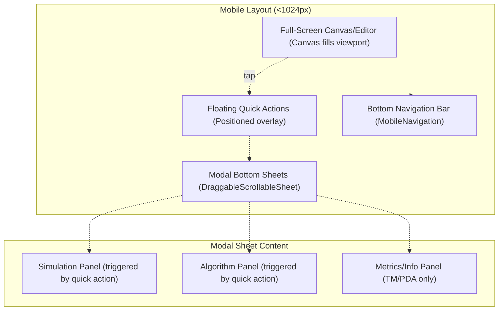
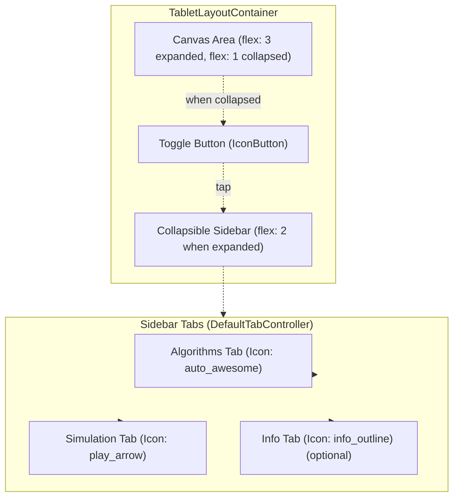
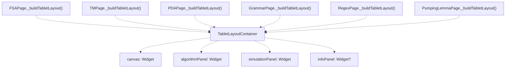
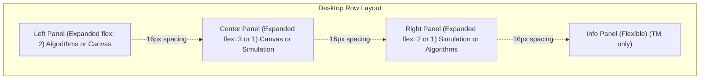
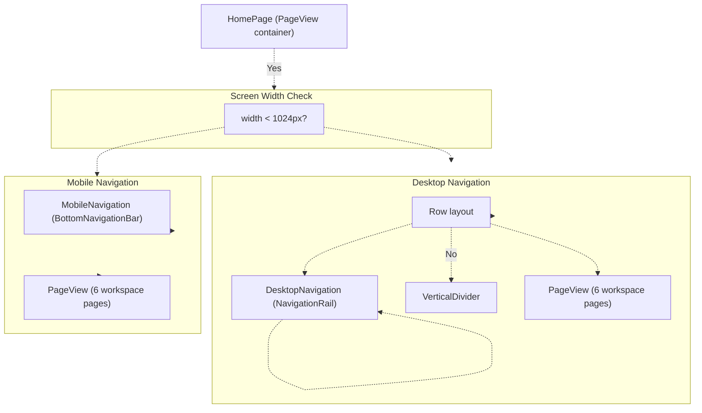
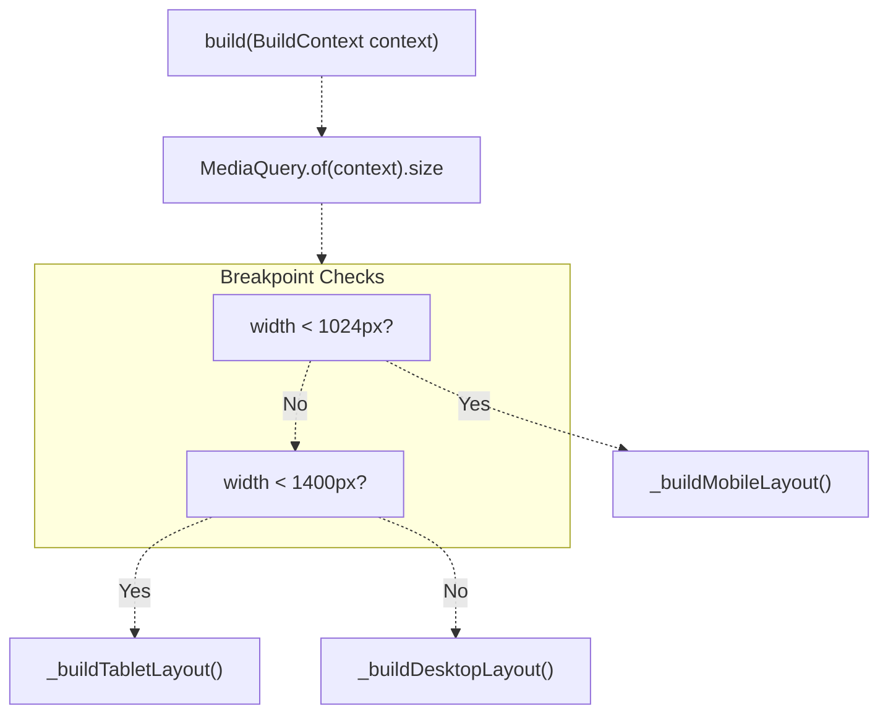
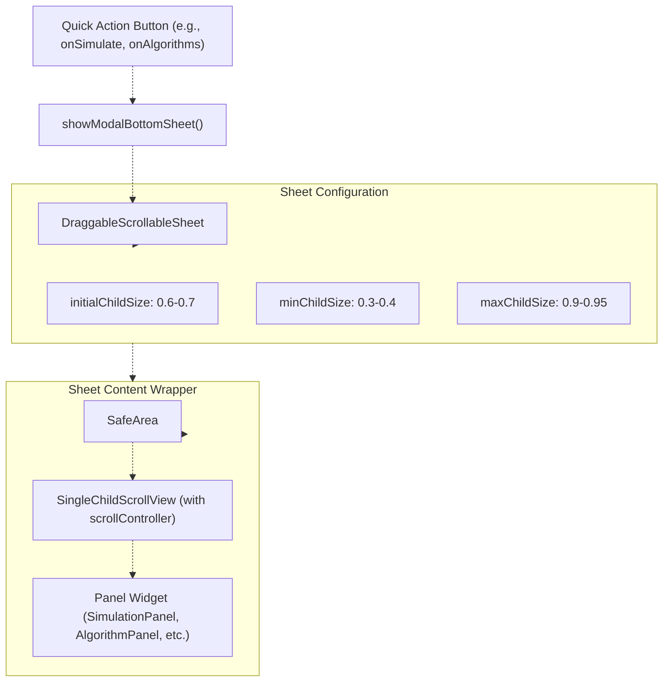
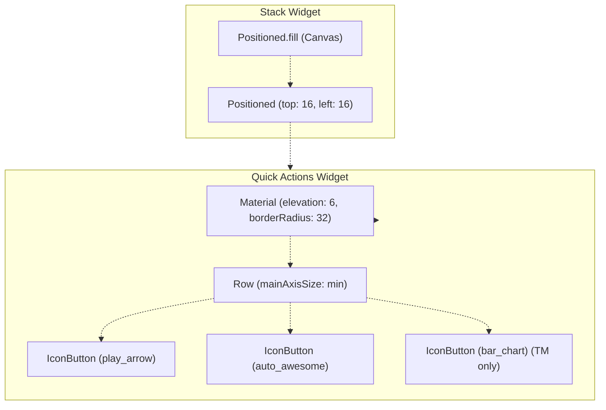
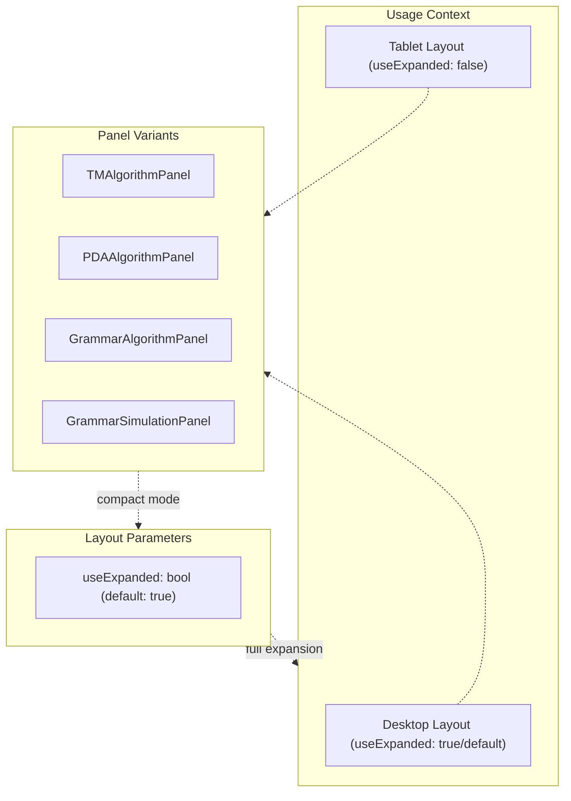
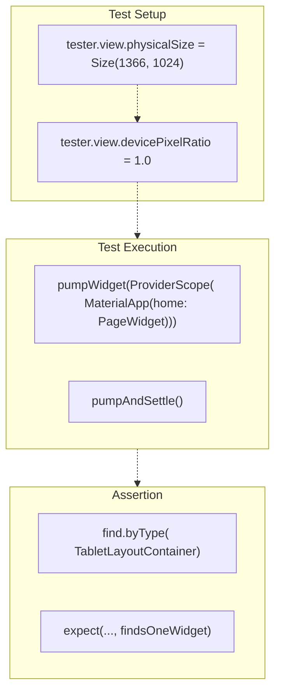

# Responsive Layout System

> **Relevant source files**
> * [lib/core/parsers/jflap_xml_parser.dart](https://github.com/ThalesMMS/JFlutter/blob/32e808b4/lib/core/parsers/jflap_xml_parser.dart)
> * [lib/core/services/trace_persistence_service_stub.dart](https://github.com/ThalesMMS/JFlutter/blob/32e808b4/lib/core/services/trace_persistence_service_stub.dart)
> * [lib/presentation/pages/fsa_page.dart](https://github.com/ThalesMMS/JFlutter/blob/32e808b4/lib/presentation/pages/fsa_page.dart)
> * [lib/presentation/pages/grammar_page.dart](https://github.com/ThalesMMS/JFlutter/blob/32e808b4/lib/presentation/pages/grammar_page.dart)
> * [lib/presentation/pages/home_page.dart](https://github.com/ThalesMMS/JFlutter/blob/32e808b4/lib/presentation/pages/home_page.dart)
> * [lib/presentation/pages/pda_page.dart](https://github.com/ThalesMMS/JFlutter/blob/32e808b4/lib/presentation/pages/pda_page.dart)
> * [lib/presentation/pages/pumping_lemma_page.dart](https://github.com/ThalesMMS/JFlutter/blob/32e808b4/lib/presentation/pages/pumping_lemma_page.dart)
> * [lib/presentation/pages/regex_page.dart](https://github.com/ThalesMMS/JFlutter/blob/32e808b4/lib/presentation/pages/regex_page.dart)
> * [lib/presentation/pages/tm_page.dart](https://github.com/ThalesMMS/JFlutter/blob/32e808b4/lib/presentation/pages/tm_page.dart)
> * [lib/presentation/theme/app_theme.dart](https://github.com/ThalesMMS/JFlutter/blob/32e808b4/lib/presentation/theme/app_theme.dart)
> * [lib/presentation/widgets/desktop_navigation.dart](https://github.com/ThalesMMS/JFlutter/blob/32e808b4/lib/presentation/widgets/desktop_navigation.dart)
> * [lib/presentation/widgets/grammar_editor.dart](https://github.com/ThalesMMS/JFlutter/blob/32e808b4/lib/presentation/widgets/grammar_editor.dart)
> * [lib/presentation/widgets/tablet_layout_container.dart](https://github.com/ThalesMMS/JFlutter/blob/32e808b4/lib/presentation/widgets/tablet_layout_container.dart)
> * [test/tablet_layout_test.dart](https://github.com/ThalesMMS/JFlutter/blob/32e808b4/test/tablet_layout_test.dart)
> * [test/widget/presentation/home_page_test.dart](https://github.com/ThalesMMS/JFlutter/blob/32e808b4/test/widget/presentation/home_page_test.dart)

## Purpose and Scope

This document describes JFlutter's responsive layout architecture, which adapts the user interface across mobile, tablet, and desktop screen sizes. The system uses breakpoint-based layout switching to optimize workspace pages (FSA, PDA, TM, Grammar, Regex, Pumping Lemma) for different form factors.

For navigation-specific components and routing between pages, see [Navigation and HomePage](8a%20Navigation-and-HomePage.md). For mobile-specific controls and touch interactions, see [Mobile Controls](8c%20Mobile-Controls.md). For theme and styling customization, see [Theme System](8e%20Theme-System.md).

---

## Layout Breakpoints and Strategy

JFlutter defines three primary breakpoint tiers that determine the layout architecture:

| Breakpoint | Width Range | Layout Strategy | Navigation Style |
| --- | --- | --- | --- |
| Mobile | < 1024px | Single-column, modal sheets | Bottom navigation bar |
| Tablet | 1024px - 1399px | Collapsible sidebar with tabs | Desktop rail (collapsed by default) |
| Desktop | ≥ 1400px | Multi-column side-by-side | Desktop rail (extended) |

Each workspace page implements conditional rendering based on `MediaQuery.of(context).size.width` to select the appropriate layout builder method.

**Sources:** [lib/presentation/pages/fsa_page.dart L529-L543](https://github.com/ThalesMMS/JFlutter/blob/32e808b4/lib/presentation/pages/fsa_page.dart#L529-L543)

 [lib/presentation/pages/tm_page.dart L130-L144](https://github.com/ThalesMMS/JFlutter/blob/32e808b4/lib/presentation/pages/tm_page.dart#L130-L144)

 [lib/presentation/pages/pda_page.dart L116-L130](https://github.com/ThalesMMS/JFlutter/blob/32e808b4/lib/presentation/pages/pda_page.dart#L116-L130)

---

## Mobile Layout Pattern (<1024px)

### Architecture

The mobile layout prioritizes canvas/editor visibility by using a full-screen approach with modal bottom sheets for auxiliary panels:



### Implementation Details

Mobile layouts are implemented in methods following the naming pattern `_buildMobileLayout()`:

**FSA Page Mobile Layout:**

* Canvas occupies full viewport with 8px margin
* Quick actions floating at top-left (simulate, algorithms)
* `MobileAutomatonControls` positioned at bottom with tool selection
* Modal sheets use `DraggableScrollableSheet` with 0.4-0.95 size range

**TM/PDA Page Mobile Layout:**

* Similar canvas structure
* Additional floating panels (tape/stack visualization)
* Three quick actions: simulate, algorithms, metrics (TM only)
* Positioned panels at top-right for auxiliary state (tape/stack)

**Grammar/Regex/Pumping Lemma Mobile Layout:**

* Vertical scrollable column
* Toggle buttons to show/hide sections
* All content inline (no modal sheets for these pages)

**Sources:** [lib/presentation/pages/fsa_page.dart L546-L557](https://github.com/ThalesMMS/JFlutter/blob/32e808b4/lib/presentation/pages/fsa_page.dart#L546-L557)

 [lib/presentation/pages/tm_page.dart L147-L180](https://github.com/ThalesMMS/JFlutter/blob/32e808b4/lib/presentation/pages/tm_page.dart#L147-L180)

 [lib/presentation/pages/pda_page.dart L133-L165](https://github.com/ThalesMMS/JFlutter/blob/32e808b4/lib/presentation/pages/pda_page.dart#L133-L165)

 [lib/presentation/pages/grammar_page.dart L46-L109](https://github.com/ThalesMMS/JFlutter/blob/32e808b4/lib/presentation/pages/grammar_page.dart#L46-L109)

---

## Tablet Layout Pattern (1024px-1399px)

### TabletLayoutContainer Architecture

The tablet layout uses the reusable `TabletLayoutContainer` widget, which provides a collapsible sidebar with tabbed interface:



### TabletLayoutContainer Component

The `TabletLayoutContainer` widget encapsulates the tablet layout logic:

**Key Properties:**

* `canvas`: Main content widget (editor/canvas)
* `algorithmPanel`: Algorithm operations panel
* `simulationPanel`: Simulation/parsing panel
* `infoPanel`: Optional metrics/info panel
* Custom tab titles via `algorithmTabTitle`, `simulationTabTitle`, `infoTabTitle`

**State Management:**

* `_isSidebarExpanded` boolean controls sidebar visibility
* When collapsed, canvas takes full width (flex: 1)
* When expanded, canvas takes 60% width (flex: 3), sidebar takes 40% (flex: 2)

**Collapse/Expand Behavior:**

* Collapsed: Floating `FloatingActionButton.small` with `menu_open` icon at top-right
* Expanded: `IconButton` with `close_fullscreen` icon overlaid on sidebar at top-right
* Toggle updates `_isSidebarExpanded` state

**Sources:** [lib/presentation/widgets/tablet_layout_container.dart L1-L154](https://github.com/ThalesMMS/JFlutter/blob/32e808b4/lib/presentation/widgets/tablet_layout_container.dart#L1-L154)

### Tablet Layout Usage Pattern

Each workspace page instantiates `TabletLayoutContainer` in its `_buildTabletLayout()` method:



**FSA Page Example:**

```
Widget _buildTabletLayout(AutomatonState state) {  return TabletLayoutContainer(    canvas: _buildCanvasArea(state: state, isMobile: false),    algorithmPanel: _buildAlgorithmPanelForState(state),    simulationPanel: SimulationPanel(...),  );}
```

**TM Page Example (with Info Panel):**

```
Widget _buildTabletLayout() {  return TabletLayoutContainer(    canvas: _buildCanvasWithToolbar(isMobile: false),    algorithmPanel: const TMAlgorithmPanel(useExpanded: false),    simulationPanel: TMSimulationPanel(highlightService: _highlightService),    infoPanel: _buildInfoPanel(context),  );}
```

**Sources:** [lib/presentation/pages/fsa_page.dart L659-L672](https://github.com/ThalesMMS/JFlutter/blob/32e808b4/lib/presentation/pages/fsa_page.dart#L659-L672)

 [lib/presentation/pages/tm_page.dart L375-L382](https://github.com/ThalesMMS/JFlutter/blob/32e808b4/lib/presentation/pages/tm_page.dart#L375-L382)

 [lib/presentation/pages/pda_page.dart L516-L522](https://github.com/ThalesMMS/JFlutter/blob/32e808b4/lib/presentation/pages/pda_page.dart#L516-L522)

---

## Desktop Layout Pattern (≥1400px)

### Multi-Column Architecture

Desktop layouts use `Row` widgets with multiple `Expanded` panels to display all workspace components simultaneously:



### Panel Distribution by Page Type

Different workspace pages organize their panels differently based on content priority:

**FSA Page Desktop (3-column):**

* Left (flex: 2): `AlgorithmPanel` with algorithm operations
* Center (flex: 3): Canvas with `AutomatonGraphViewCanvas`
* Right (flex: 2): `SimulationPanel` for input testing

**TM Page Desktop (4-column):**

* Left (flex: 2): Canvas with `TMCanvasGraphView`
* Center-Left (flex: 1): `TMSimulationPanel`
* Center-Right (flex: 1): `TMAlgorithmPanel`
* Right (Flexible): Info panel with machine metrics

**PDA Page Desktop (3-column):**

* Left (flex: 2): Canvas with `PDACanvasGraphView`
* Center (flex: 1): `PDASimulationPanel`
* Right (flex: 1): `PDAAlgorithmPanel`

**Grammar Page Desktop (3-column):**

* Left (flex: 2): `GrammarEditor`
* Center (flex: 1): `GrammarSimulationPanel`
* Right (flex: 1): `GrammarAlgorithmPanel`

**Sources:** [lib/presentation/pages/fsa_page.dart L628-L657](https://github.com/ThalesMMS/JFlutter/blob/32e808b4/lib/presentation/pages/fsa_page.dart#L628-L657)

 [lib/presentation/pages/tm_page.dart L182-L220](https://github.com/ThalesMMS/JFlutter/blob/32e808b4/lib/presentation/pages/tm_page.dart#L182-L220)

 [lib/presentation/pages/pda_page.dart L254-L284](https://github.com/ThalesMMS/JFlutter/blob/32e808b4/lib/presentation/pages/pda_page.dart#L254-L284)

 [lib/presentation/pages/grammar_page.dart L111-L142](https://github.com/ThalesMMS/JFlutter/blob/32e808b4/lib/presentation/pages/grammar_page.dart#L111-L142)

---

## Responsive Navigation Components

### HomePage Navigation Strategy

The `HomePage` widget serves as the root container and adapts its navigation chrome based on screen width:



**MobileNavigation Component:**

* Renders `BottomNavigationBar` with 6 destinations
* Fixed at bottom of screen
* Icons and labels for each workspace (FSA, Grammar, PDA, TM, Regex, Pumping)
* Type: `BottomNavigationBarType.fixed`

**DesktopNavigation Component:**

* Renders `NavigationRail` with same 6 destinations
* Positioned in left column of `Row`
* Extended mode (showing labels) when width ≥ 1440px
* Collapsed mode (icons only) when 1024px ≤ width < 1440px
* Tooltips provide descriptions on hover

**Sources:** [lib/presentation/pages/home_page.dart L106-L233](https://github.com/ThalesMMS/JFlutter/blob/32e808b4/lib/presentation/pages/home_page.dart#L106-L233)

 [lib/presentation/widgets/mobile_navigation.dart](https://github.com/ThalesMMS/JFlutter/blob/32e808b4/lib/presentation/widgets/mobile_navigation.dart)

 [lib/presentation/widgets/desktop_navigation.dart L1-L62](https://github.com/ThalesMMS/JFlutter/blob/32e808b4/lib/presentation/widgets/desktop_navigation.dart#L1-L62)

---

## Layout Method Dispatch Pattern

### Standard Page Structure

Each workspace page follows a consistent structure for layout method dispatch:



### Typical Implementation Pattern

```
@overrideWidget build(BuildContext context) {  final screenSize = MediaQuery.of(context).size;  final isMobile = screenSize.width < 1024;  return Scaffold(    body: isMobile         ? _buildMobileLayout()         : screenSize.width < 1400             ? _buildTabletLayout()             : _buildDesktopLayout(),  );}
```

This pattern is implemented in:

* `FSAPage` [lib/presentation/pages/fsa_page.dart L527-L544](https://github.com/ThalesMMS/JFlutter/blob/32e808b4/lib/presentation/pages/fsa_page.dart#L527-L544)
* `TMPage` [lib/presentation/pages/tm_page.dart L129-L145](https://github.com/ThalesMMS/JFlutter/blob/32e808b4/lib/presentation/pages/tm_page.dart#L129-L145)
* `PDAPage` [lib/presentation/pages/pda_page.dart L115-L131](https://github.com/ThalesMMS/JFlutter/blob/32e808b4/lib/presentation/pages/pda_page.dart#L115-L131)
* `GrammarPage` [lib/presentation/pages/grammar_page.dart L33-L44](https://github.com/ThalesMMS/JFlutter/blob/32e808b4/lib/presentation/pages/grammar_page.dart#L33-L44)
* `RegexPage` [lib/presentation/pages/regex_page.dart L343-L355](https://github.com/ThalesMMS/JFlutter/blob/32e808b4/lib/presentation/pages/regex_page.dart#L343-L355)
* `PumpingLemmaPage` [lib/presentation/pages/pumping_lemma_page.dart L33-L44](https://github.com/ThalesMMS/JFlutter/blob/32e808b4/lib/presentation/pages/pumping_lemma_page.dart#L33-L44)

**Sources:** [lib/presentation/pages/fsa_page.dart L527-L544](https://github.com/ThalesMMS/JFlutter/blob/32e808b4/lib/presentation/pages/fsa_page.dart#L527-L544)

 [lib/presentation/pages/tm_page.dart L129-L145](https://github.com/ThalesMMS/JFlutter/blob/32e808b4/lib/presentation/pages/tm_page.dart#L129-L145)

 [lib/presentation/pages/pda_page.dart L115-L131](https://github.com/ThalesMMS/JFlutter/blob/32e808b4/lib/presentation/pages/pda_page.dart#L115-L131)

---

## Modal Bottom Sheets for Mobile

### DraggableScrollableSheet Implementation

Mobile layouts use modal bottom sheets to present panels that would otherwise occupy dedicated screen space on larger devices:



### FSA Page Example

```javascript
Future<void> _openSimulationSheet() async {  await showModalBottomSheet<void>(    context: context,    isScrollControlled: true,    builder: (context) {      return SafeArea(        child: DraggableScrollableSheet(          expand: false,          initialChildSize: 0.6,          minChildSize: 0.4,          maxChildSize: 0.95,          builder: (context, scrollController) {            return SingleChildScrollView(              controller: scrollController,              child: Padding(                padding: const EdgeInsets.all(16),                child: Consumer(                  builder: (context, sheetRef, _) {                    final sheetState = sheetRef.watch(automatonProvider);                    return SimulationPanel(                      onSimulate: (inputString) => sheetRef                          .read(automatonProvider.notifier)                          .simulateAutomaton(inputString),                      simulationResult: sheetState.simulationResult,                      regexResult: sheetState.regexResult,                      highlightService: _highlightService,                    );                  },                ),              ),            );          },        ),      );    },  );}
```

**Sheet Size Configuration by Page:**

| Page | Initial | Min | Max | Purpose |
| --- | --- | --- | --- | --- |
| FSA Simulation | 0.6 | 0.4 | 0.95 | Input testing |
| FSA Algorithms | 0.7 | 0.4 | 0.95 | Algorithm operations |
| TM Simulation | 0.7 | 0.3 | 0.9 | Tape execution |
| TM Algorithms | 0.6 | 0.3 | 0.9 | TM operations |
| TM Metrics | 0.45 | 0.3 | 0.75 | Machine statistics |
| PDA Simulation | Custom with header | 0.4 | 0.95 | Stack execution |

**Sources:** [lib/presentation/pages/fsa_page.dart L590-L626](https://github.com/ThalesMMS/JFlutter/blob/32e808b4/lib/presentation/pages/fsa_page.dart#L590-L626)

 [lib/presentation/pages/tm_page.dart L404-L486](https://github.com/ThalesMMS/JFlutter/blob/32e808b4/lib/presentation/pages/tm_page.dart#L404-L486)

 [lib/presentation/pages/pda_page.dart L167-L252](https://github.com/ThalesMMS/JFlutter/blob/32e808b4/lib/presentation/pages/pda_page.dart#L167-L252)

---

## Quick Action Overlays

### Floating Action Bar Pattern

Mobile layouts use positioned floating action bars to trigger modal sheets without consuming permanent screen space:



### Implementation Examples

**FSA Quick Actions (_CanvasQuickActions):**

* Positioned at top-left (16px margin)
* Two buttons: Simulate and Algorithms
* Pill-shaped Material with 0.92 opacity
* Horizontal padding: 6px, vertical: 4px

**TM Quick Actions (_TmCanvasQuickActions):**

* Three buttons: Simulate, Algorithms, Metrics
* Same styling as FSA
* Metrics button conditional on machine state

**PDA Quick Actions (_PdaCanvasQuickActions):**

* Two buttons: Simulate and Algorithms
* Same styling pattern

**Sources:** [lib/presentation/pages/fsa_page.dart L675-L714](https://github.com/ThalesMMS/JFlutter/blob/32e808b4/lib/presentation/pages/fsa_page.dart#L675-L714)

 [lib/presentation/pages/tm_page.dart L589-L642](https://github.com/ThalesMMS/JFlutter/blob/32e808b4/lib/presentation/pages/tm_page.dart#L589-L642)

 [lib/presentation/pages/pda_page.dart L525-L564](https://github.com/ThalesMMS/JFlutter/blob/32e808b4/lib/presentation/pages/pda_page.dart#L525-L564)

---

## Responsive Panel Configuration

### Panel-Specific Adaptations

Some panels accept configuration parameters to adapt their layout for different screen sizes:



**TM Algorithm Panel:**

```
// Desktop (default expansion)const TMAlgorithmPanel()// Tablet (compact mode)const TMAlgorithmPanel(useExpanded: false)
```

**PDA Algorithm Panel:**

```
// Desktopconst PDAAlgorithmPanel()// Tabletconst PDAAlgorithmPanel(useExpanded: false)
```

**Grammar Panels:**

```
// Desktopconst GrammarAlgorithmPanel()const GrammarSimulationPanel()// Tabletconst GrammarAlgorithmPanel(useExpanded: false)const GrammarSimulationPanel(useExpanded: false)
```

This parameter typically controls whether algorithm sections use `ExpansionTile` widgets in their default expanded state.

**Sources:** [lib/presentation/pages/tm_page.dart L378](https://github.com/ThalesMMS/JFlutter/blob/32e808b4/lib/presentation/pages/tm_page.dart#L378-L378)

 [lib/presentation/pages/pda_page.dart L519](https://github.com/ThalesMMS/JFlutter/blob/32e808b4/lib/presentation/pages/pda_page.dart#L519-L519)

 [lib/presentation/pages/grammar_page.dart L199-L200](https://github.com/ThalesMMS/JFlutter/blob/32e808b4/lib/presentation/pages/grammar_page.dart#L199-L200)

---

## Testing and Verification

### Layout Switching Tests

The test suite verifies that each workspace page correctly selects `TabletLayoutContainer` at tablet breakpoints:



**Test Cases:**

* `FSAPage uses TabletLayoutContainer on tablet width`
* `RegexPage uses TabletLayoutContainer on tablet width`
* `GrammarPage uses TabletLayoutContainer on tablet width`
* `TMPage uses TabletLayoutContainer on tablet width`
* `PDAPage uses TabletLayoutContainer on tablet width`
* `PumpingLemmaPage uses TabletLayoutContainer on tablet width`

**Sidebar Interaction Test:**

* Verifies initial expanded state
* Tests collapse via `Icons.close_fullscreen` tap
* Tests expand via `Icons.menu_open` tap
* Validates content visibility in each state

**Sources:** [test/tablet_layout_test.dart L1-L125](https://github.com/ThalesMMS/JFlutter/blob/32e808b4/test/tablet_layout_test.dart#L1-L125)

---

## Key Design Considerations

### Breakpoint Selection Rationale

The 1024px and 1400px breakpoints were chosen to align with common device categories:

**1024px Threshold:**

* Distinguishes phone/phablet from tablet
* Matches iPad and similar tablet portrait widths
* Aligns with common CSS framework breakpoints

**1400px Threshold:**

* Separates tablet portrait/landscape from desktop
* Provides sufficient width for 3+ column layouts
* Allows extended navigation rail with labels

### Layout Flexibility

The responsive system provides flexibility while maintaining consistency:

**Consistent Patterns:**

* All pages use identical breakpoint logic
* Layout method naming convention (`_buildMobileLayout`, etc.)
* Quick action positioning and styling
* Modal sheet size ranges

**Page-Specific Variations:**

* Panel distribution (2, 3, or 4 columns)
* Quick action button sets
* Modal sheet initial sizes
* Tablet tab titles

**Sources:** [lib/presentation/pages/fsa_page.dart L529-L543](https://github.com/ThalesMMS/JFlutter/blob/32e808b4/lib/presentation/pages/fsa_page.dart#L529-L543)

 [lib/presentation/widgets/tablet_layout_container.dart L1-L154](https://github.com/ThalesMMS/JFlutter/blob/32e808b4/lib/presentation/widgets/tablet_layout_container.dart#L1-L154)

---

## Summary

The JFlutter responsive layout system provides a three-tier adaptive architecture:

1. **Mobile (<1024px):** Full-screen canvas with modal bottom sheets for auxiliary panels and bottom navigation bar
2. **Tablet (1024-1399px):** `TabletLayoutContainer` with collapsible sidebar containing tabbed panels
3. **Desktop (≥1400px):** Multi-column `Row` layouts with all panels visible simultaneously and navigation rail

Each workspace page implements `_buildMobileLayout()`, `_buildTabletLayout()`, and `_buildDesktopLayout()` methods dispatched via `MediaQuery` width checks. The `TabletLayoutContainer` widget encapsulates the tablet layout logic and is reused across all workspace pages, while mobile layouts use `DraggableScrollableSheet` for on-demand panel access.

**Sources:** [lib/presentation/pages/fsa_page.dart L527-L672](https://github.com/ThalesMMS/JFlutter/blob/32e808b4/lib/presentation/pages/fsa_page.dart#L527-L672)

 [lib/presentation/pages/tm_page.dart L129-L382](https://github.com/ThalesMMS/JFlutter/blob/32e808b4/lib/presentation/pages/tm_page.dart#L129-L382)

 [lib/presentation/pages/pda_page.dart L115-L522](https://github.com/ThalesMMS/JFlutter/blob/32e808b4/lib/presentation/pages/pda_page.dart#L115-L522)

 [lib/presentation/widgets/tablet_layout_container.dart L1-L154](https://github.com/ThalesMMS/JFlutter/blob/32e808b4/lib/presentation/widgets/tablet_layout_container.dart#L1-L154)

 [test/tablet_layout_test.dart L1-L125](https://github.com/ThalesMMS/JFlutter/blob/32e808b4/test/tablet_layout_test.dart#L1-L125)


### On this page

* [Responsive Layout System](#8.2-responsive-layout-system)
* [Purpose and Scope](#8.2-purpose-and-scope)
* [Layout Breakpoints and Strategy](#8.2-layout-breakpoints-and-strategy)
* [Mobile Layout Pattern (<1024px)](#8.2-mobile-layout-pattern-1024px)
* [Architecture](#8.2-architecture)
* [Implementation Details](#8.2-implementation-details)
* [Tablet Layout Pattern (1024px-1399px)](#8.2-tablet-layout-pattern-1024px-1399px)
* [TabletLayoutContainer Architecture](#8.2-tabletlayoutcontainer-architecture)
* [TabletLayoutContainer Component](#8.2-tabletlayoutcontainer-component)
* [Tablet Layout Usage Pattern](#8.2-tablet-layout-usage-pattern)
* [Desktop Layout Pattern (≥1400px)](#8.2-desktop-layout-pattern-1400px)
* [Multi-Column Architecture](#8.2-multi-column-architecture)
* [Panel Distribution by Page Type](#8.2-panel-distribution-by-page-type)
* [Responsive Navigation Components](#8.2-responsive-navigation-components)
* [HomePage Navigation Strategy](#8.2-homepage-navigation-strategy)
* [Layout Method Dispatch Pattern](#8.2-layout-method-dispatch-pattern)
* [Standard Page Structure](#8.2-standard-page-structure)
* [Typical Implementation Pattern](#8.2-typical-implementation-pattern)
* [Modal Bottom Sheets for Mobile](#8.2-modal-bottom-sheets-for-mobile)
* [DraggableScrollableSheet Implementation](#8.2-draggablescrollablesheet-implementation)
* [FSA Page Example](#8.2-fsa-page-example)
* [Quick Action Overlays](#8.2-quick-action-overlays)
* [Floating Action Bar Pattern](#8.2-floating-action-bar-pattern)
* [Implementation Examples](#8.2-implementation-examples)
* [Responsive Panel Configuration](#8.2-responsive-panel-configuration)
* [Panel-Specific Adaptations](#8.2-panel-specific-adaptations)
* [Testing and Verification](#8.2-testing-and-verification)
* [Layout Switching Tests](#8.2-layout-switching-tests)
* [Key Design Considerations](#8.2-key-design-considerations)
* [Breakpoint Selection Rationale](#8.2-breakpoint-selection-rationale)
* [Layout Flexibility](#8.2-layout-flexibility)
* [Summary](#8.2-summary)

Ask Devin about JFlutter