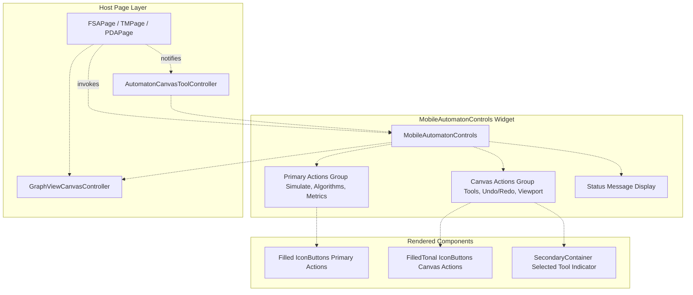
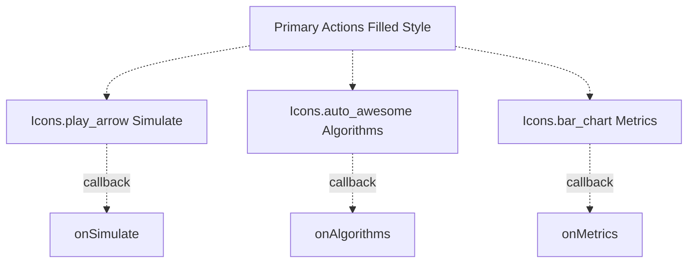
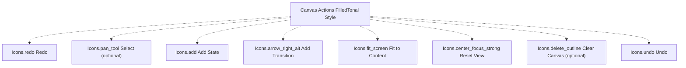
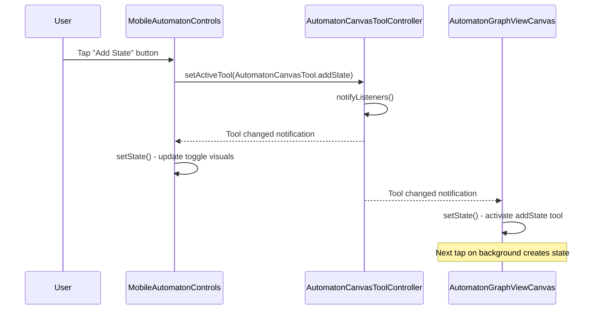
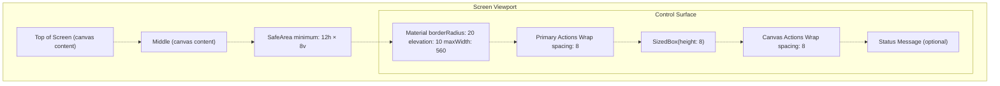
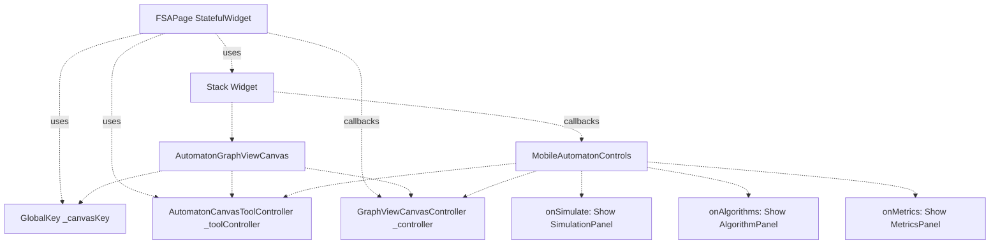

# Mobile Controls

> **Relevant source files**
> * [lib/presentation/widgets/automaton_canvas_tool.dart](https://github.com/ThalesMMS/JFlutter/blob/32e808b4/lib/presentation/widgets/automaton_canvas_tool.dart)
> * [lib/presentation/widgets/automaton_graphview_canvas.dart](https://github.com/ThalesMMS/JFlutter/blob/32e808b4/lib/presentation/widgets/automaton_graphview_canvas.dart)
> * [lib/presentation/widgets/graphview_canvas_toolbar.dart](https://github.com/ThalesMMS/JFlutter/blob/32e808b4/lib/presentation/widgets/graphview_canvas_toolbar.dart)
> * [lib/presentation/widgets/mobile_automaton_controls.dart](https://github.com/ThalesMMS/JFlutter/blob/32e808b4/lib/presentation/widgets/mobile_automaton_controls.dart)
> * [lib/presentation/widgets/pda_canvas_graphview.dart](https://github.com/ThalesMMS/JFlutter/blob/32e808b4/lib/presentation/widgets/pda_canvas_graphview.dart)
> * [lib/presentation/widgets/tm_canvas_graphview.dart](https://github.com/ThalesMMS/JFlutter/blob/32e808b4/lib/presentation/widgets/tm_canvas_graphview.dart)
> * [test/widget/presentation/automaton_graphview_canvas_test.dart](https://github.com/ThalesMMS/JFlutter/blob/32e808b4/test/widget/presentation/automaton_graphview_canvas_test.dart)
> * [test/widget/presentation/graphview_canvas_toolbar_test.dart](https://github.com/ThalesMMS/JFlutter/blob/32e808b4/test/widget/presentation/graphview_canvas_toolbar_test.dart)
> * [test/widget/presentation/graphview_label_field_editor_test.dart](https://github.com/ThalesMMS/JFlutter/blob/32e808b4/test/widget/presentation/graphview_label_field_editor_test.dart)

This page documents the touch-optimized mobile control system for automaton editing, implemented in the `MobileAutomatonControls` widget. This control surface consolidates workspace actions and canvas tools into a unified bottom-aligned panel designed for screens below the 1024px breakpoint.

For information about the responsive layout system and breakpoints, see [Responsive Layout System](#8.2). For desktop toolbar controls, see [Toolbars and Canvas Controls](#8.4). For the underlying tool selection mechanism, see [Canvas Tools and Interaction](#4.3).

---

## Purpose and Design Philosophy

The `MobileAutomatonControls` widget addresses the limitations of floating action buttons and scattered controls on touch devices by consolidating all primary editing actions into a single, easily accessible control surface. Unlike the desktop toolbar which uses compact icon buttons positioned at the top-right, the mobile controls use larger touch targets with optional labels, positioned at the bottom of the screen for thumb accessibility.

Key design principles:

* **Touch-first interaction**: All buttons sized for minimum 40×40px touch targets
* **Contextual visibility**: Actions appear only when their callbacks are provided
* **Tool state reflection**: Toggle buttons visually indicate the active canvas tool
* **Accessibility**: Full semantic labeling and tooltip support
* **Adaptive layout**: Wraps gracefully on smaller screens using `Wrap` widget

Sources: [lib/presentation/widgets/mobile_automaton_controls.dart L1-L318](https://github.com/ThalesMMS/JFlutter/blob/32e808b4/lib/presentation/widgets/mobile_automaton_controls.dart#L1-L318)

---

## Widget Architecture



**MobileAutomatonControls Construction**

The widget accepts callbacks for all possible actions, with mandatory callbacks for core viewport operations:

| Property | Type | Required | Purpose |
| --- | --- | --- | --- |
| `enableToolSelection` | `bool` | No (false) | Enables mutually-exclusive tool toggles |
| `showSelectionTool` | No (false) | `bool` | Shows explicit selection tool button |
| `activeTool` | `AutomatonCanvasTool` | No (selection) | Current tool for toggle state |
| `onSelectTool` | `VoidCallback?` | Conditional | Selection tool callback |
| `onAddState` | `VoidCallback` | **Yes** | Add state action |
| `onAddTransition` | `VoidCallback?` | Conditional | Add transition action |
| `onFitToContent` | `VoidCallback` | **Yes** | Fit viewport to content |
| `onResetView` | `VoidCallback` | **Yes** | Reset viewport to identity |
| `onClear` | `VoidCallback?` | No | Clear canvas action |
| `onUndo` | `VoidCallback?` | No | Undo action |
| `onRedo` | `VoidCallback?` | No | Redo action |
| `canUndo` | `bool` | No (false) | Undo button enabled state |
| `canRedo` | `bool` | No (false) | Redo button enabled state |
| `onSimulate` | `VoidCallback?` | No | Open simulation panel |
| `isSimulationEnabled` | `bool` | No (true) | Simulation button enabled |
| `onAlgorithms` | `VoidCallback?` | No | Open algorithm panel |
| `isAlgorithmsEnabled` | `bool` | No (true) | Algorithm button enabled |
| `onMetrics` | `VoidCallback?` | No | Open metrics panel |
| `isMetricsEnabled` | `bool` | No (true) | Metrics button enabled |
| `statusMessage` | `String?` | No | Bottom status text |

Sources: [lib/presentation/widgets/mobile_automaton_controls.dart L24-L76](https://github.com/ThalesMMS/JFlutter/blob/32e808b4/lib/presentation/widgets/mobile_automaton_controls.dart#L24-L76)

---

## Action Groups and Layout

The control surface organizes actions into two semantic groups rendered in separate `Wrap` containers:

### Primary Actions Group

High-level workspace operations rendered with `_ButtonStyleVariant.filled` style:



Primary actions appear only when their corresponding callbacks are provided. They use filled icon buttons to emphasize their importance and are positioned first in the vertical layout.

### Canvas Actions Group

Direct canvas manipulation operations rendered with `_ButtonStyleVariant.tonal` style:



Canvas actions use tonal styling to visually distinguish them from primary actions. The order is intentional: redo appears first for right-handed thumb reach, undo last for symmetry.

Sources: [lib/presentation/widgets/mobile_automaton_controls.dart L83-L159](https://github.com/ThalesMMS/JFlutter/blob/32e808b4/lib/presentation/widgets/mobile_automaton_controls.dart#L83-L159)

---

## Tool Selection System

When `enableToolSelection` is enabled, the canvas action buttons for `onAddState` and `onAddTransition` become mutually-exclusive toggle buttons that control the active canvas tool through `AutomatonCanvasToolController`.

### Tool Toggle Behavior

```css
#mermaid-s8onh9yur8{font-family:ui-sans-serif,-apple-system,system-ui,Segoe UI,Helvetica;font-size:16px;fill:#ccc;}@keyframes edge-animation-frame{from{stroke-dashoffset:0;}}@keyframes dash{to{stroke-dashoffset:0;}}#mermaid-s8onh9yur8 .edge-animation-slow{stroke-dasharray:9,5!important;stroke-dashoffset:900;animation:dash 50s linear infinite;stroke-linecap:round;}#mermaid-s8onh9yur8 .edge-animation-fast{stroke-dasharray:9,5!important;stroke-dashoffset:900;animation:dash 20s linear infinite;stroke-linecap:round;}#mermaid-s8onh9yur8 .error-icon{fill:#a44141;}#mermaid-s8onh9yur8 .error-text{fill:#ddd;stroke:#ddd;}#mermaid-s8onh9yur8 .edge-thickness-normal{stroke-width:1px;}#mermaid-s8onh9yur8 .edge-thickness-thick{stroke-width:3.5px;}#mermaid-s8onh9yur8 .edge-pattern-solid{stroke-dasharray:0;}#mermaid-s8onh9yur8 .edge-thickness-invisible{stroke-width:0;fill:none;}#mermaid-s8onh9yur8 .edge-pattern-dashed{stroke-dasharray:3;}#mermaid-s8onh9yur8 .edge-pattern-dotted{stroke-dasharray:2;}#mermaid-s8onh9yur8 .marker{fill:lightgrey;stroke:lightgrey;}#mermaid-s8onh9yur8 .marker.cross{stroke:lightgrey;}#mermaid-s8onh9yur8 svg{font-family:ui-sans-serif,-apple-system,system-ui,Segoe UI,Helvetica;font-size:16px;}#mermaid-s8onh9yur8 p{margin:0;}#mermaid-s8onh9yur8 defs #statediagram-barbEnd{fill:lightgrey;stroke:lightgrey;}#mermaid-s8onh9yur8 g.stateGroup text{fill:#ccc;stroke:none;font-size:10px;}#mermaid-s8onh9yur8 g.stateGroup text{fill:#ccc;stroke:none;font-size:10px;}#mermaid-s8onh9yur8 g.stateGroup .state-title{font-weight:bolder;fill:#e0dfdf;}#mermaid-s8onh9yur8 g.stateGroup rect{fill:#1f2020;stroke:#ccc;}#mermaid-s8onh9yur8 g.stateGroup line{stroke:lightgrey;stroke-width:1;}#mermaid-s8onh9yur8 .transition{stroke:lightgrey;stroke-width:1;fill:none;}#mermaid-s8onh9yur8 .stateGroup .composit{fill:#333;border-bottom:1px;}#mermaid-s8onh9yur8 .stateGroup .alt-composit{fill:#e0e0e0;border-bottom:1px;}#mermaid-s8onh9yur8 .state-note{stroke:hsl(180, 0%, 18.3529411765%);fill:hsl(180, 1.5873015873%, 28.3529411765%);}#mermaid-s8onh9yur8 .state-note text{fill:rgb(183.8476190475, 181.5523809523, 181.5523809523);stroke:none;font-size:10px;}#mermaid-s8onh9yur8 .stateLabel .box{stroke:none;stroke-width:0;fill:#1f2020;opacity:0.5;}#mermaid-s8onh9yur8 .edgeLabel .label rect{fill:#1f2020;opacity:0.5;}#mermaid-s8onh9yur8 .edgeLabel{background-color:hsl(0, 0%, 34.4117647059%);text-align:center;}#mermaid-s8onh9yur8 .edgeLabel p{background-color:hsl(0, 0%, 34.4117647059%);}#mermaid-s8onh9yur8 .edgeLabel rect{opacity:0.5;background-color:hsl(0, 0%, 34.4117647059%);fill:hsl(0, 0%, 34.4117647059%);}#mermaid-s8onh9yur8 .edgeLabel .label text{fill:#ccc;}#mermaid-s8onh9yur8 .label div .edgeLabel{color:#ccc;}#mermaid-s8onh9yur8 .stateLabel text{fill:#e0dfdf;font-size:10px;font-weight:bold;}#mermaid-s8onh9yur8 .node circle.state-start{fill:#f4f4f4;stroke:#f4f4f4;}#mermaid-s8onh9yur8 .node .fork-join{fill:#f4f4f4;stroke:#f4f4f4;}#mermaid-s8onh9yur8 .node circle.state-end{fill:#cccccc;stroke:#333;stroke-width:1.5;}#mermaid-s8onh9yur8 .end-state-inner{fill:#333;stroke-width:1.5;}#mermaid-s8onh9yur8 .node rect{fill:#1f2020;stroke:#ccc;stroke-width:1px;}#mermaid-s8onh9yur8 .node polygon{fill:#1f2020;stroke:#ccc;stroke-width:1px;}#mermaid-s8onh9yur8 #statediagram-barbEnd{fill:lightgrey;}#mermaid-s8onh9yur8 .statediagram-cluster rect{fill:#1f2020;stroke:#ccc;stroke-width:1px;}#mermaid-s8onh9yur8 .cluster-label,#mermaid-s8onh9yur8 .nodeLabel{color:#e0dfdf;}#mermaid-s8onh9yur8 .statediagram-cluster rect.outer{rx:5px;ry:5px;}#mermaid-s8onh9yur8 .statediagram-state .divider{stroke:#ccc;}#mermaid-s8onh9yur8 .statediagram-state .title-state{rx:5px;ry:5px;}#mermaid-s8onh9yur8 .statediagram-cluster.statediagram-cluster .inner{fill:#333;}#mermaid-s8onh9yur8 .statediagram-cluster.statediagram-cluster-alt .inner{fill:#555;}#mermaid-s8onh9yur8 .statediagram-cluster .inner{rx:0;ry:0;}#mermaid-s8onh9yur8 .statediagram-state rect.basic{rx:5px;ry:5px;}#mermaid-s8onh9yur8 .statediagram-state rect.divider{stroke-dasharray:10,10;fill:#555;}#mermaid-s8onh9yur8 .note-edge{stroke-dasharray:5;}#mermaid-s8onh9yur8 .statediagram-note rect{fill:hsl(180, 1.5873015873%, 28.3529411765%);stroke:hsl(180, 0%, 18.3529411765%);stroke-width:1px;rx:0;ry:0;}#mermaid-s8onh9yur8 .statediagram-note rect{fill:hsl(180, 1.5873015873%, 28.3529411765%);stroke:hsl(180, 0%, 18.3529411765%);stroke-width:1px;rx:0;ry:0;}#mermaid-s8onh9yur8 .statediagram-note text{fill:rgb(183.8476190475, 181.5523809523, 181.5523809523);}#mermaid-s8onh9yur8 .statediagram-note .nodeLabel{color:rgb(183.8476190475, 181.5523809523, 181.5523809523);}#mermaid-s8onh9yur8 .statediagram .edgeLabel{color:red;}#mermaid-s8onh9yur8 #dependencyStart,#mermaid-s8onh9yur8 #dependencyEnd{fill:lightgrey;stroke:lightgrey;stroke-width:1;}#mermaid-s8onh9yur8 .statediagramTitleText{text-anchor:middle;font-size:18px;fill:#ccc;}#mermaid-s8onh9yur8 :root{--mermaid-font-family:ui-sans-serif,-apple-system,system-ui,Segoe UI,Helvetica;}InitialTap Add StateTap Add TransitionTap Selection (if shown)Tap Add TransitionTap Selection (if shown)Tap Add StateTap same tool (no change)Tap same tool (no change)SelectionAddStateTransition
```

**Toggle Visual Feedback**

Selected tool buttons receive distinct styling:

| State | Background Color | Foreground Color | Border |
| --- | --- | --- | --- |
| **Selected** | `colorScheme.secondaryContainer` | `onSecondaryContainer` | None |
| **Unselected** | Default tonal background | Default tonal foreground | None |
| **Disabled** | Grayed | Grayed | None |

The visual feedback is applied through the `_MobileControlButton` widget's style logic:

[lib/presentation/widgets/mobile_automaton_controls.dart L277-L287](https://github.com/ThalesMMS/JFlutter/blob/32e808b4/lib/presentation/widgets/mobile_automaton_controls.dart#L277-L287)

**Integration Flow**



Sources: [lib/presentation/widgets/mobile_automaton_controls.dart L111-L136](https://github.com/ThalesMMS/JFlutter/blob/32e808b4/lib/presentation/widgets/mobile_automaton_controls.dart#L111-L136)

 [lib/presentation/widgets/automaton_canvas_tool.dart L15-L37](https://github.com/ThalesMMS/JFlutter/blob/32e808b4/lib/presentation/widgets/automaton_canvas_tool.dart#L15-L37)

---

## Visual Design and Positioning

### Material Design 3 Styling

The control surface uses Material Design 3 tokens for consistent theming:

* **Surface**: Elevated `Material` widget with `colorScheme.surface` background
* **Elevation**: 10dp shadow for floating appearance
* **Border radius**: 20px for modern rounded aesthetic
* **Internal padding**: 12px horizontal, 10px vertical
* **Button spacing**: 8px gap between buttons in Wrap layout
* **Safe area**: Respects system insets via `SafeArea` with 12px horizontal, 8px vertical minimum

### Bottom-Aligned Layout



The control surface is constrained to a maximum width of 560px to prevent excessive button spread on tablets in portrait orientation. The `Align(alignment: Alignment.bottomCenter)` ensures it stays anchored at the bottom center of the viewport.

Sources: [lib/presentation/widgets/mobile_automaton_controls.dart L161-L225](https://github.com/ThalesMMS/JFlutter/blob/32e808b4/lib/presentation/widgets/mobile_automaton_controls.dart#L161-L225)

---

## Button Construction

### Control Action Model

Each button is defined by an internal `_ControlAction` model:

| Field | Type | Purpose |
| --- | --- | --- |
| `icon` | `IconData` | Material icon identifier |
| `tooltip` | `String?` | Tooltip text (overrides label) |
| `label` | `String?` | Accessible label and fallback tooltip |
| `onPressed` | `VoidCallback?` | Tap handler (null = disabled) |
| `isToggle` | `bool` | Whether button represents tool selection |
| `isSelected` | `bool` | Whether this toggle is currently active |

[lib/presentation/widgets/mobile_automaton_controls.dart L230-L253](https://github.com/ThalesMMS/JFlutter/blob/32e808b4/lib/presentation/widgets/mobile_automaton_controls.dart#L230-L253)

### Button Rendering

The `_MobileControlButton` widget renders each action as a circular `IconButton` with the specified style variant:

```javascript
// Simplified rendering logicfinal ButtonStyle effectiveStyle = baseStyle.merge(  IconButton.styleFrom(    backgroundColor: selected        ? colorScheme.secondaryContainer        : null,    foregroundColor: selected         ? colorScheme.onSecondaryContainer         : null,  ),);final Widget button = switch (style) {  _ButtonStyleVariant.filled => IconButton.filled(...),  _ButtonStyleVariant.tonal => IconButton.filledTonal(...),};
```

**Accessibility Wrapping**

Each button is wrapped in `Semantics` and `Tooltip` widgets:

* **Tooltip**: Shows on long press, uses `effectiveTooltip` (tooltip ?? label)
* **Semantics**: Provides `label`, `button: true`, `enabled` state, and `toggled` state for screen readers

[lib/presentation/widgets/mobile_automaton_controls.dart L255-L317](https://github.com/ThalesMMS/JFlutter/blob/32e808b4/lib/presentation/widgets/mobile_automaton_controls.dart#L255-L317)

Sources: [lib/presentation/widgets/mobile_automaton_controls.dart L255-L317](https://github.com/ThalesMMS/JFlutter/blob/32e808b4/lib/presentation/widgets/mobile_automaton_controls.dart#L255-L317)

---

## Integration Examples

### FSA Page Integration

Typical usage in a finite state automaton editor page:



**Callback Wiring Pattern**

```javascript
// Tool controller synchronizationMobileAutomatonControls(  enableToolSelection: true,  activeTool: _toolController.activeTool,  onSelectTool: () => _toolController.setActiveTool(    AutomatonCanvasTool.selection,  ),  onAddState: () => _toolController.setActiveTool(    AutomatonCanvasTool.addState,  ),  onAddTransition: () => _toolController.setActiveTool(    AutomatonCanvasTool.transition,  ),    // Canvas controller delegation  onFitToContent: _controller.fitToContent,  onResetView: _controller.resetView,  onUndo: _controller.undo,  onRedo: _controller.redo,  canUndo: _controller.canUndo,  canRedo: _controller.canRedo,    // Panel callbacks  onSimulate: () => _showPanel(_SimulationPanel()),  onAlgorithms: () => _showPanel(_AlgorithmPanel()),  onMetrics: () => _showPanel(_MetricsPanel()),    statusMessage: '${_stateCount} states · ${_transitionCount} transitions',)
```

This pattern ensures the mobile controls stay synchronized with the canvas tool state and controller history state through reactive listeners on `_toolController` and `_controller.graphRevision`.

Sources: [lib/presentation/widgets/mobile_automaton_controls.dart L24-L76](https://github.com/ThalesMMS/JFlutter/blob/32e808b4/lib/presentation/widgets/mobile_automaton_controls.dart#L24-L76)

---

## Status Message Display

The optional status message appears below all action buttons, styled with `bodySmall` text theme and `onSurfaceVariant` color for subtle presentation. Common use cases:

| Message Pattern | Use Case |
| --- | --- |
| `"N states · M transitions"` | Canvas summary |
| `"Tool: Add State"` | Current tool indicator |
| `"Deterministic · 5 states"` | Automaton properties |
| `"Empty canvas"` | Initial state |
| `""` or `null` | No message (hidden) |

The message is only rendered when non-null and non-empty:

[lib/presentation/widgets/mobile_automaton_controls.dart L207-L217](https://github.com/ThalesMMS/JFlutter/blob/32e808b4/lib/presentation/widgets/mobile_automaton_controls.dart#L207-L217)

Sources: [lib/presentation/widgets/mobile_automaton_controls.dart L207-L217](https://github.com/ThalesMMS/JFlutter/blob/32e808b4/lib/presentation/widgets/mobile_automaton_controls.dart#L207-L217)

---

## Comparison with Desktop Toolbar

The `GraphViewCanvasToolbar` provides equivalent functionality for desktop layouts (≥1024px) with key differences:

| Aspect | MobileAutomatonControls | GraphViewCanvasToolbar |
| --- | --- | --- |
| **Position** | Bottom center | Top right |
| **Button style** | Circular IconButton (40×40) | Rectangular IconButton (compact) |
| **Labels** | Icons only (tooltips) | Icons only (tooltips) |
| **Layout** | Wrap (multi-row) | Row (single row with dividers) |
| **Elevation** | 10dp | 0dp (shadow instead) |
| **Safe area** | 12h × 8v minimum | 12px all sides |
| **Max width** | 560px | None (content-sized) |
| **Primary actions** | Separate filled group | Not included (in separate panels) |
| **Tool controller** | External (provided by page) | External (provided by page) |

The desktop toolbar focuses solely on canvas manipulation, while the mobile controls consolidate workspace actions (simulate, algorithms, metrics) into the same surface to reduce navigation overhead on smaller screens.

Sources: [lib/presentation/widgets/mobile_automaton_controls.dart L1-L318](https://github.com/ThalesMMS/JFlutter/blob/32e808b4/lib/presentation/widgets/mobile_automaton_controls.dart#L1-L318)

 [lib/presentation/widgets/graphview_canvas_toolbar.dart L1-L359](https://github.com/ThalesMMS/JFlutter/blob/32e808b4/lib/presentation/widgets/graphview_canvas_toolbar.dart#L1-L359)

---

## Accessibility Features

### Semantic Labels

Every button includes comprehensive semantic labeling:

* **Button role**: `Semantics(button: true)` marks interactive elements
* **Label**: Effective tooltip (tooltip ?? label) provides screen reader text
* **Enabled state**: `enabled: canPress` reflects interactive state
* **Toggle state**: `toggled: action.isToggle ? selected : null` for tool buttons

[lib/presentation/widgets/mobile_automaton_controls.dart L306-L314](https://github.com/ThalesMMS/JFlutter/blob/32e808b4/lib/presentation/widgets/mobile_automaton_controls.dart#L306-L314)

### Tooltip Behavior

Tooltips appear on long press (mobile) or hover (tablet with pointer):

* **Source**: `effectiveTooltip` computed from `tooltip` field with `label` fallback
* **Fallback**: Empty string when neither is provided (no tooltip shown)

[lib/presentation/widgets/mobile_automaton_controls.dart L251-L252](https://github.com/ThalesMMS/JFlutter/blob/32e808b4/lib/presentation/widgets/mobile_automaton_controls.dart#L251-L252)

### Touch Target Sizing

All buttons meet WCAG 2.1 Level AAA minimum touch target size:

* **Base size**: `minimumSize: Size.square(40)` ensures 40×40 minimum
* **Padding**: `padding: EdgeInsets.all(8)` provides internal padding
* **Visual density**: `VisualDensity.compact` optimizes for touch
* **Spacing**: 8px between buttons prevents accidental activation

[lib/presentation/widgets/mobile_automaton_controls.dart L269-L273](https://github.com/ThalesMMS/JFlutter/blob/32e808b4/lib/presentation/widgets/mobile_automaton_controls.dart#L269-L273)

Sources: [lib/presentation/widgets/mobile_automaton_controls.dart L255-L317](https://github.com/ThalesMMS/JFlutter/blob/32e808b4/lib/presentation/widgets/mobile_automaton_controls.dart#L255-L317)

---

## Testing Strategy

Mobile controls are validated through widget tests that verify:

1. **Button rendering**: Correct number of buttons appear based on provided callbacks
2. **Tool synchronization**: Toggle state reflects `activeTool` property
3. **Callback invocation**: Button taps trigger corresponding callbacks
4. **Enabled state**: Undo/redo buttons respect `canUndo`/`canRedo` flags
5. **Status display**: Message appears only when provided and non-empty
6. **Accessibility**: Semantic properties properly configured

Test coverage includes interaction scenarios for:

* Primary action buttons (simulate, algorithms, metrics)
* Canvas manipulation buttons (fit, reset, clear)
* Tool toggles with different `activeTool` states
* History buttons with different `canUndo`/`canRedo` states
* Status message visibility

Sources: [test/widget/presentation/graphview_canvas_toolbar_test.dart L1-L256](https://github.com/ThalesMMS/JFlutter/blob/32e808b4/test/widget/presentation/graphview_canvas_toolbar_test.dart#L1-L256)

Refresh this wiki

Last indexed: 30 December 2025 ([32e808](https://github.com/ThalesMMS/JFlutter/commit/32e808b4))

### On this page

* [Mobile Controls](#8.3-mobile-controls)
* [Purpose and Design Philosophy](#8.3-purpose-and-design-philosophy)
* [Widget Architecture](#8.3-widget-architecture)
* [Action Groups and Layout](#8.3-action-groups-and-layout)
* [Primary Actions Group](#8.3-primary-actions-group)
* [Canvas Actions Group](#8.3-canvas-actions-group)
* [Tool Selection System](#8.3-tool-selection-system)
* [Tool Toggle Behavior](#8.3-tool-toggle-behavior)
* [Visual Design and Positioning](#8.3-visual-design-and-positioning)
* [Material Design 3 Styling](#8.3-material-design-3-styling)
* [Bottom-Aligned Layout](#8.3-bottom-aligned-layout)
* [Button Construction](#8.3-button-construction)
* [Control Action Model](#8.3-control-action-model)
* [Button Rendering](#8.3-button-rendering)
* [Integration Examples](#8.3-integration-examples)
* [FSA Page Integration](#8.3-fsa-page-integration)
* [Status Message Display](#8.3-status-message-display)
* [Comparison with Desktop Toolbar](#8.3-comparison-with-desktop-toolbar)
* [Accessibility Features](#8.3-accessibility-features)
* [Semantic Labels](#8.3-semantic-labels)
* [Tooltip Behavior](#8.3-tooltip-behavior)
* [Touch Target Sizing](#8.3-touch-target-sizing)
* [Testing Strategy](#8.3-testing-strategy)

Ask Devin about JFlutter