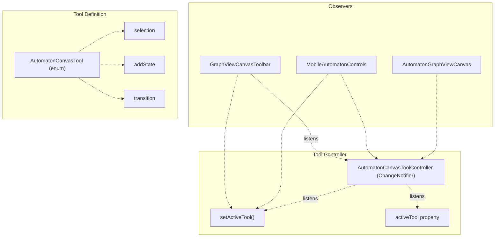
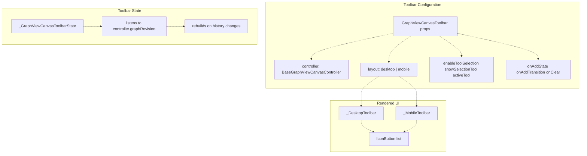
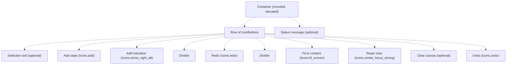
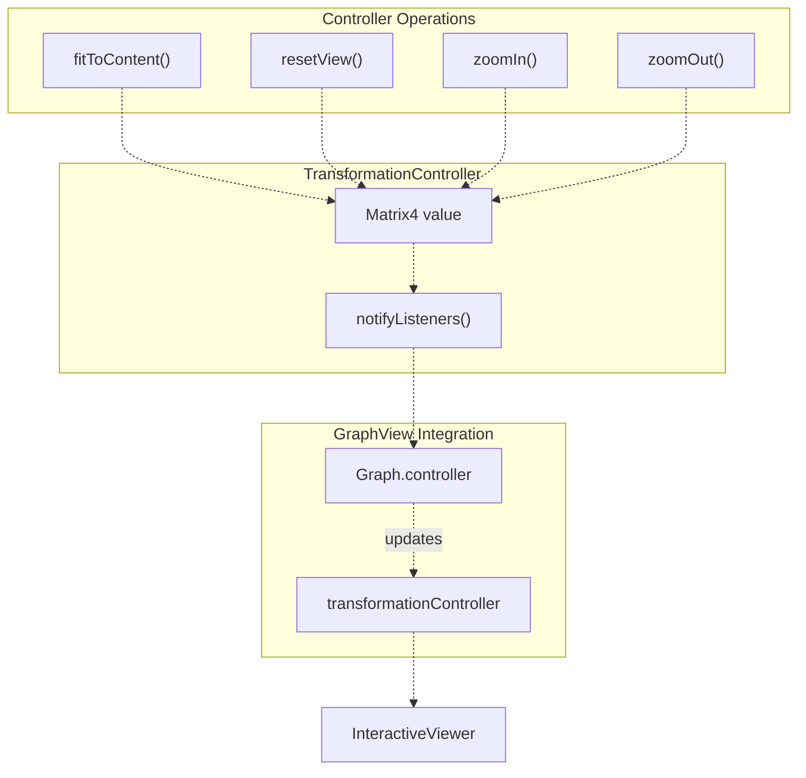
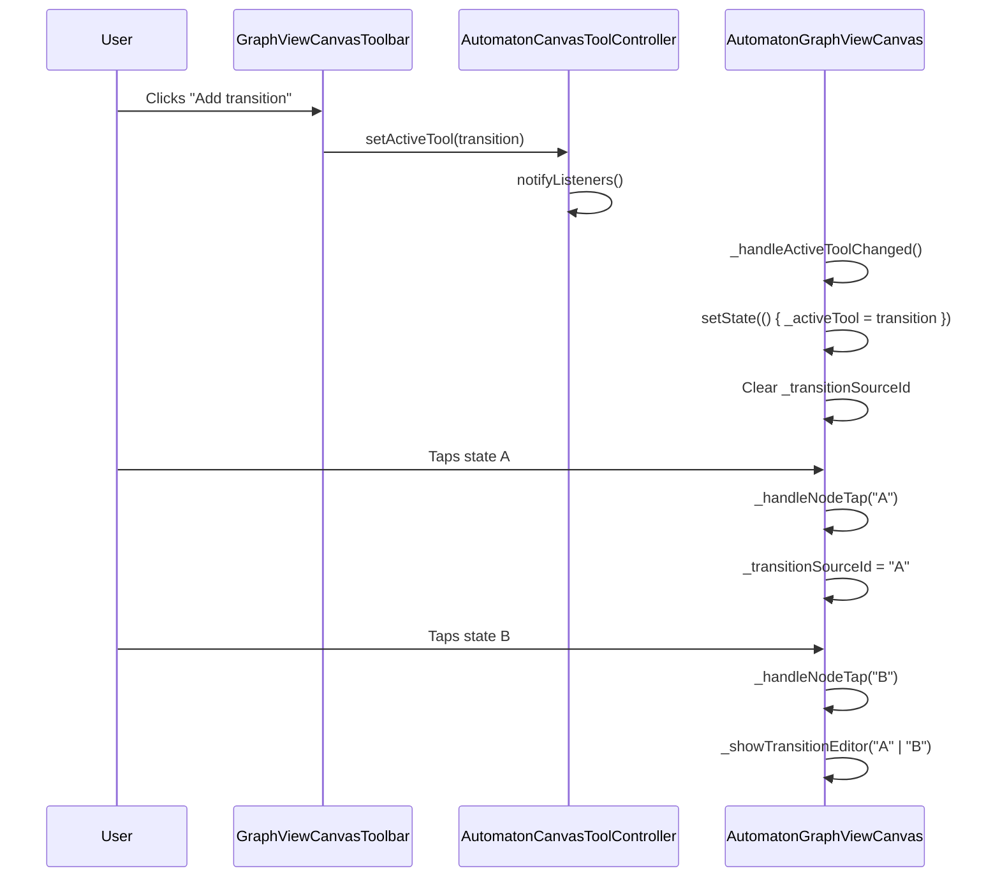
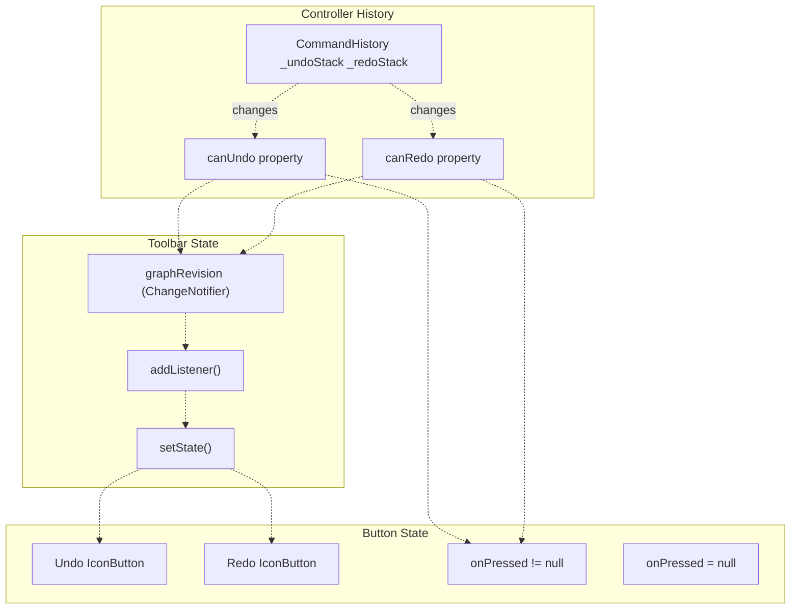

# Toolbars and Canvas Controls

> **Relevant source files**
> * [lib/presentation/widgets/automaton_canvas_tool.dart](https://github.com/ThalesMMS/JFlutter/blob/32e808b4/lib/presentation/widgets/automaton_canvas_tool.dart)
> * [lib/presentation/widgets/automaton_graphview_canvas.dart](https://github.com/ThalesMMS/JFlutter/blob/32e808b4/lib/presentation/widgets/automaton_graphview_canvas.dart)
> * [lib/presentation/widgets/graphview_canvas_toolbar.dart](https://github.com/ThalesMMS/JFlutter/blob/32e808b4/lib/presentation/widgets/graphview_canvas_toolbar.dart)
> * [lib/presentation/widgets/mobile_automaton_controls.dart](https://github.com/ThalesMMS/JFlutter/blob/32e808b4/lib/presentation/widgets/mobile_automaton_controls.dart)
> * [lib/presentation/widgets/pda_canvas_graphview.dart](https://github.com/ThalesMMS/JFlutter/blob/32e808b4/lib/presentation/widgets/pda_canvas_graphview.dart)
> * [lib/presentation/widgets/tm_canvas_graphview.dart](https://github.com/ThalesMMS/JFlutter/blob/32e808b4/lib/presentation/widgets/tm_canvas_graphview.dart)
> * [test/widget/presentation/automaton_graphview_canvas_test.dart](https://github.com/ThalesMMS/JFlutter/blob/32e808b4/test/widget/presentation/automaton_graphview_canvas_test.dart)
> * [test/widget/presentation/graphview_canvas_toolbar_test.dart](https://github.com/ThalesMMS/JFlutter/blob/32e808b4/test/widget/presentation/graphview_canvas_toolbar_test.dart)
> * [test/widget/presentation/graphview_label_field_editor_test.dart](https://github.com/ThalesMMS/JFlutter/blob/32e808b4/test/widget/presentation/graphview_label_field_editor_test.dart)

This page documents the desktop toolbar system and canvas viewport controls used in automaton editors. These components provide desktop-optimized interfaces for tool selection, viewport manipulation, and undo/redo operations. For touch-optimized mobile controls, see [Mobile Controls](8c%20Mobile-Controls.md). For the underlying canvas rendering system, see [Canvas System](4%20Canvas-System.md).

## Overview

The toolbar and canvas controls system provides desktop users with a compact, icon-based interface for managing the automaton canvas. The system coordinates three primary concerns:

1. **Tool selection**: Switching between selection, state creation, and transition creation modes
2. **Viewport management**: Zoom, pan, fit-to-content, and reset operations
3. **History operations**: Undo and redo functionality with state-aware UI

All desktop toolbars observe the canvas controller to reflect the current state of history operations and respond to viewport changes in real-time.

**Sources:** [lib/presentation/widgets/graphview_canvas_toolbar.dart L1-L20](https://github.com/ThalesMMS/JFlutter/blob/32e808b4/lib/presentation/widgets/graphview_canvas_toolbar.dart#L1-L20)

## Tool System Architecture

The tool system uses an enum-based approach with a `ChangeNotifier` controller to broadcast tool changes across the UI.



**Sources:** [lib/presentation/widgets/automaton_canvas_tool.dart L15-L36](https://github.com/ThalesMMS/JFlutter/blob/32e808b4/lib/presentation/widgets/automaton_canvas_tool.dart#L15-L36)

### AutomatonCanvasTool Enum

The `AutomatonCanvasTool` enum defines three mutually exclusive editing modes:

| Tool | Purpose | Canvas Behavior |
| --- | --- | --- |
| `selection` | Default mode for viewing and dragging states | Enables state dragging, double-tap for state options |
| `addState` | State creation mode | Tap on empty canvas to create state at that position |
| `transition` | Transition creation mode | First tap selects source state, second tap selects target state and opens editor |

**Sources:** [lib/presentation/widgets/automaton_canvas_tool.dart L16](https://github.com/ThalesMMS/JFlutter/blob/32e808b4/lib/presentation/widgets/automaton_canvas_tool.dart#L16-L16)

### AutomatonCanvasToolController

The `AutomatonCanvasToolController` extends `ChangeNotifier` to broadcast tool changes:

```python
// Initialization with default toolfinal toolController = AutomatonCanvasToolController(  AutomatonCanvasTool.selection,);// Changing toolstoolController.setActiveTool(AutomatonCanvasTool.addState);// Listening to changestoolController.addListener(() {  print('Active tool: ${toolController.activeTool}');});
```

The controller notifies listeners only when the tool actually changes, preventing redundant updates. Multiple UI components can observe the same controller instance to maintain synchronized tool state.

**Sources:** [lib/presentation/widgets/automaton_canvas_tool.dart L19-L36](https://github.com/ThalesMMS/JFlutter/blob/32e808b4/lib/presentation/widgets/automaton_canvas_tool.dart#L19-L36)

## GraphViewCanvasToolbar Widget

The `GraphViewCanvasToolbar` provides a desktop-optimized toolbar positioned at the top-right of the canvas. It observes the canvas controller to enable/disable actions based on the current graph state.



**Sources:** [lib/presentation/widgets/graphview_canvas_toolbar.dart L20-L55](https://github.com/ThalesMMS/JFlutter/blob/32e808b4/lib/presentation/widgets/graphview_canvas_toolbar.dart#L20-L55)

### Desktop Layout

The desktop layout renders a compact horizontal toolbar with icon-only buttons separated by subtle dividers:



**Button Styling:**

* **Toggle buttons** (when `enableToolSelection=true`): Show selection state with `primaryContainer` background when active, outlined when inactive
* **Action buttons**: Standard icon buttons with tooltip on hover
* **Disabled buttons**: Gray out when action unavailable (e.g., undo when history is empty)

**Sources:** [lib/presentation/widgets/graphview_canvas_toolbar.dart L159-L256](https://github.com/ThalesMMS/JFlutter/blob/32e808b4/lib/presentation/widgets/graphview_canvas_toolbar.dart#L159-L256)

### Mobile Layout

When `layout` is set to `GraphViewCanvasToolbarLayout.mobile`, the toolbar renders as a bottom-aligned card with labeled filled buttons:

| Desktop | Mobile |
| --- | --- |
| Icon-only, top-right | Icon + label, bottom-center |
| `IconButton` | `FilledButton.icon` |
| Horizontal row | Wrap with center alignment |
| Tooltip on hover | Always shows label |

The mobile layout is typically not used directly, as mobile pages prefer `MobileAutomatonControls` (see [Mobile Controls](8c%20Mobile-Controls.md)). The mobile toolbar layout exists primarily for testing and special use cases.

**Sources:** [lib/presentation/widgets/graphview_canvas_toolbar.dart L258-L328](https://github.com/ThalesMMS/JFlutter/blob/32e808b4/lib/presentation/widgets/graphview_canvas_toolbar.dart#L258-L328)

### Toolbar Actions Configuration

The toolbar builds its action list dynamically based on controller state and configuration:

```javascript
final actions = <_ToolbarButtonConfig>[  // Optional selection tool  if (enableToolSelection && showSelectionTool)    _ToolbarButtonConfig(      action: _ToolbarAction.selection,      handler: onSelectTool,      isToggle: true,      isSelected: activeTool == AutomatonCanvasTool.selection,    ),    // Always present: Add state  _ToolbarButtonConfig(    action: _ToolbarAction.addState,    handler: onAddState,    isToggle: enableToolSelection,    isSelected: enableToolSelection &&                 activeTool == AutomatonCanvasTool.addState,  ),    // Optional: Add transition  if (onAddTransition != null)    _ToolbarButtonConfig(      action: _ToolbarAction.transition,      handler: onAddTransition,      isToggle: enableToolSelection,      isSelected: enableToolSelection &&                   activeTool == AutomatonCanvasTool.transition,    ),    // Redo (enabled only when controller.canRedo is true)  _ToolbarButtonConfig(    action: _ToolbarAction.redo,    handler: controller.canRedo ? () => controller.redo() : null,  ),    // Viewport controls (always enabled)  _ToolbarButtonConfig(    action: _ToolbarAction.fitContent,    handler: controller.fitToContent,  ),  _ToolbarButtonConfig(    action: _ToolbarAction.resetView,    handler: controller.resetView,  ),    // Optional clear  if (onClear != null)    _ToolbarButtonConfig(      action: _ToolbarAction.clear,      handler: onClear!,    ),    // Undo (enabled only when controller.canUndo is true)  _ToolbarButtonConfig(    action: _ToolbarAction.undo,    handler: controller.canUndo ? () => controller.undo() : null,  ),];
```

**Sources:** [lib/presentation/widgets/graphview_canvas_toolbar.dart L92-L138](https://github.com/ThalesMMS/JFlutter/blob/32e808b4/lib/presentation/widgets/graphview_canvas_toolbar.dart#L92-L138)

## Viewport Management Operations

The canvas controller exposes viewport operations that the toolbar invokes. All operations are implemented by `BaseGraphViewCanvasController` and inherited by specialized controllers.



**Sources:** [lib/features/canvas/graphview/base_graphview_canvas_controller.dart](https://github.com/ThalesMMS/JFlutter/blob/32e808b4/lib/features/canvas/graphview/base_graphview_canvas_controller.dart)

### Fit to Content

The `fitToContent()` operation calculates the bounding box of all states and adjusts the viewport to show all nodes with appropriate padding:

1. Calculate min/max coordinates of all node positions
2. Compute required scale to fit bounds within viewport
3. Calculate centering offset
4. Animate to new transformation matrix

This is the most commonly used viewport operation, typically invoked after loading examples or applying layout algorithms.

**Sources:** [lib/features/canvas/graphview/base_graphview_canvas_controller.dart](https://github.com/ThalesMMS/JFlutter/blob/32e808b4/lib/features/canvas/graphview/base_graphview_canvas_controller.dart)

### Reset View

The `resetView()` operation resets the transformation matrix to identity, returning the canvas to its default 1:1 scale centered at origin. This is useful when the user gets lost in the viewport after zooming and panning.

**Sources:** [lib/features/canvas/graphview/base_graphview_canvas_controller.dart](https://github.com/ThalesMMS/JFlutter/blob/32e808b4/lib/features/canvas/graphview/base_graphview_canvas_controller.dart)

### Zoom Operations

`zoomIn()` and `zoomOut()` apply incremental scaling transformations centered on the current viewport center. The toolbar does not expose these operations by default, but they are available for custom implementations.

**Sources:** [lib/features/canvas/graphview/base_graphview_canvas_controller.dart](https://github.com/ThalesMMS/JFlutter/blob/32e808b4/lib/features/canvas/graphview/base_graphview_canvas_controller.dart)

## Tool Selection Integration

When `enableToolSelection=true`, the toolbar coordinates with the canvas to manage exclusive tool states. The canvas observes tool changes and adjusts its gesture handling accordingly.



**Sources:** [lib/presentation/widgets/automaton_graphview_canvas.dart L528-L555](https://github.com/ThalesMMS/JFlutter/blob/32e808b4/lib/presentation/widgets/automaton_graphview_canvas.dart#L528-L555)

 [lib/presentation/widgets/graphview_canvas_toolbar.dart L92-L138](https://github.com/ThalesMMS/JFlutter/blob/32e808b4/lib/presentation/widgets/graphview_canvas_toolbar.dart#L92-L138)

### Tool State Constraints

The canvas enforces tool selection constraints based on customization:

```
// From AutomatonGraphViewCanvasCustomizationfinal customization = AutomatonGraphViewCanvasCustomization(  enableToolSelection: true,  // Allow non-selection tools  enableStateDrag: true,      // Allow dragging states in selection mode  // ...);// Canvas enforces constraintsvoid _handleActiveToolChanged() {  final nextTool = _toolController.activeTool;  if (!_customization.enableToolSelection &&      nextTool != AutomatonCanvasTool.selection) {    // Force back to selection mode    _toolController.setActiveTool(AutomatonCanvasTool.selection);    return;  }  // ... apply tool change}
```

**Sources:** [lib/presentation/widgets/automaton_graphview_canvas.dart L528-L555](https://github.com/ThalesMMS/JFlutter/blob/32e808b4/lib/presentation/widgets/automaton_graphview_canvas.dart#L528-L555)

## Undo/Redo System

The toolbar provides visual feedback for undo/redo availability by observing the controller's history state.



**Sources:** [lib/presentation/widgets/graphview_canvas_toolbar.dart L57-L86](https://github.com/ThalesMMS/JFlutter/blob/32e808b4/lib/presentation/widgets/graphview_canvas_toolbar.dart#L57-L86)

### History Tracking

The toolbar attaches a listener to `controller.graphRevision` during initialization:

```
@overridevoid initState() {  super.initState();  widget.controller.graphRevision.addListener(_handleControllerChanged);}void _handleControllerChanged() {  if (!mounted) return;  setState(() {});  // Rebuild to reflect new history state}
```

Every command execution (add state, move state, update transition, etc.) increments the graph revision counter, triggering toolbar rebuild. This ensures the undo/redo buttons immediately reflect the current availability.

**Sources:** [lib/presentation/widgets/graphview_canvas_toolbar.dart L57-L86](https://github.com/ThalesMMS/JFlutter/blob/32e808b4/lib/presentation/widgets/graphview_canvas_toolbar.dart#L57-L86)

### Button Enable/Disable Logic

The toolbar conditionally provides handlers based on history state:

```javascript
_ToolbarButtonConfig(  action: _ToolbarAction.undo,  handler: controller.canUndo ? () => controller.undo() : null,),_ToolbarButtonConfig(  action: _ToolbarAction.redo,  handler: controller.canRedo ? () => controller.redo() : null,),
```

When `handler` is `null`, Flutter's `IconButton` automatically renders in disabled state with reduced opacity.

**Sources:** [lib/presentation/widgets/graphview_canvas_toolbar.dart L119-L137](https://github.com/ThalesMMS/JFlutter/blob/32e808b4/lib/presentation/widgets/graphview_canvas_toolbar.dart#L119-L137)

## Status Message Display

Both desktop and mobile layouts support an optional status message displayed adjacent to the toolbar. This is typically used to show canvas metrics like state count and transition count.

```
GraphViewCanvasToolbar(  controller: controller,  onAddState: () { /* ... */ },  statusMessage: '5 states · 8 transitions',  layout: GraphViewCanvasToolbarLayout.desktop,)
```

The message appears below the desktop toolbar or above the mobile toolbar. When `null` or empty, the message is not rendered.

**Sources:** [lib/presentation/widgets/graphview_canvas_toolbar.dart L246-L250](https://github.com/ThalesMMS/JFlutter/blob/32e808b4/lib/presentation/widgets/graphview_canvas_toolbar.dart#L246-L250)

 [lib/presentation/widgets/graphview_canvas_toolbar.dart L281-L285](https://github.com/ThalesMMS/JFlutter/blob/32e808b4/lib/presentation/widgets/graphview_canvas_toolbar.dart#L281-L285)

## Testing Strategy

The toolbar testing suite validates controller integration, button state, and callback invocation.

### Controller Command Tests

Tests verify that toolbar buttons invoke the correct controller methods:

```sql
testWidgets('invokes controller commands when action buttons pressed',   (tester) async {  // Arrange: Create test controller that records calls  final controller = _TestGraphViewCanvasController(    automatonProvider: provider,  );    await tester.pumpWidget(/* toolbar with controller */);    // Act: Tap fit and reset buttons  await tester.tap(find.widgetWithIcon(IconButton, Icons.fit_screen));  await tester.tap(    find.widgetWithIcon(IconButton, Icons.center_focus_strong),  );    // Assert: Verify controller methods called  expect(controller.fitCount, 1);  expect(controller.resetCount, 1);});
```

**Sources:** [test/widget/presentation/graphview_canvas_toolbar_test.dart L171-L194](https://github.com/ThalesMMS/JFlutter/blob/32e808b4/test/widget/presentation/graphview_canvas_toolbar_test.dart#L171-L194)

### History State Tests

Tests confirm that undo/redo buttons reflect history availability:

```
testWidgets('renders undo and redo buttons respecting history state',   (tester) async {  // Initially, no history exists  final undoFinder = find.widgetWithIcon(IconButton, Icons.undo);  final redoFinder = find.widgetWithIcon(IconButton, Icons.redo);    expect(tester.widget<IconButton>(undoFinder).onPressed, isNull);  expect(tester.widget<IconButton>(redoFinder).onPressed, isNull);    // After adding state, undo becomes available  controller.addStateAtCenter();  await tester.pump();  expect(tester.widget<IconButton>(undoFinder).onPressed, isNotNull);    // After undo, redo becomes available  controller.undo();  await tester.pump();  expect(tester.widget<IconButton>(redoFinder).onPressed, isNotNull);});
```

**Sources:** [test/widget/presentation/graphview_canvas_toolbar_test.dart L196-L226](https://github.com/ThalesMMS/JFlutter/blob/32e808b4/test/widget/presentation/graphview_canvas_toolbar_test.dart#L196-L226)

### Tool Toggle Tests

Tests verify that tool toggles display correct selection state:

```javascript
testWidgets('renders editing tool toggles when enabled', (tester) async {  await tester.pumpWidget(    MaterialApp(      home: Scaffold(        body: GraphViewCanvasToolbar(          controller: controller,          enableToolSelection: true,          activeTool: AutomatonCanvasTool.transition,          onAddState: () => addStateInvoked = true,          onAddTransition: () => transitionInvoked = true,          layout: GraphViewCanvasToolbarLayout.desktop,        ),      ),    ),  );    // Verify buttons are rendered  expect(find.widgetWithIcon(IconButton, Icons.add), findsOneWidget);  expect(    find.widgetWithIcon(IconButton, Icons.arrow_right_alt),     findsOneWidget,  );    // Tap buttons and verify callbacks  await tester.tap(find.widgetWithIcon(IconButton, Icons.add));  await tester.tap(    find.widgetWithIcon(IconButton, Icons.arrow_right_alt),  );  expect(addStateInvoked, isTrue);  expect(transitionInvoked, isTrue);});
```

**Sources:** [test/widget/presentation/graphview_canvas_toolbar_test.dart L228-L255](https://github.com/ThalesMMS/JFlutter/blob/32e808b4/test/widget/presentation/graphview_canvas_toolbar_test.dart#L228-L255)

## Integration with Pages

Desktop pages typically instantiate the toolbar alongside the canvas, sharing the same controller instance:

```javascript
class FSAPage extends ConsumerStatefulWidget {  // ...    @override  Widget build(BuildContext context) {    return Stack(      children: [        // Canvas (fills entire area)        AutomatonGraphViewCanvas(          controller: _controller,          toolController: _toolController,          // ...        ),                // Toolbar (positioned top-right)        GraphViewCanvasToolbar(          controller: _controller,          enableToolSelection: true,          activeTool: _toolController.activeTool,          onSelectTool: () => _toolController.setActiveTool(            AutomatonCanvasTool.selection,          ),          onAddState: () => _toolController.setActiveTool(            AutomatonCanvasTool.addState,          ),          onAddTransition: () => _toolController.setActiveTool(            AutomatonCanvasTool.transition,          ),          statusMessage: _buildStatusMessage(),          layout: GraphViewCanvasToolbarLayout.desktop,        ),      ],    );  }}
```

The toolbar observes the controller to update button states, while tool selection callbacks update the shared `AutomatonCanvasToolController`. This architecture ensures all UI components remain synchronized with minimal coupling.

**Sources:** [lib/presentation/widgets/graphview_canvas_toolbar.dart L20-L55](https://github.com/ThalesMMS/JFlutter/blob/32e808b4/lib/presentation/widgets/graphview_canvas_toolbar.dart#L20-L55)

 [lib/presentation/widgets/automaton_canvas_tool.dart L19-L36](https://github.com/ThalesMMS/JFlutter/blob/32e808b4/lib/presentation/widgets/automaton_canvas_tool.dart#L19-L36)


### On this page

* [Toolbars and Canvas Controls](#8.4-toolbars-and-canvas-controls)
* [Overview](#8.4-overview)
* [Tool System Architecture](#8.4-tool-system-architecture)
* [AutomatonCanvasTool Enum](#8.4-automatoncanvastool-enum)
* [AutomatonCanvasToolController](#8.4-automatoncanvastoolcontroller)
* [GraphViewCanvasToolbar Widget](#8.4-graphviewcanvastoolbar-widget)
* [Desktop Layout](#8.4-desktop-layout)
* [Mobile Layout](#8.4-mobile-layout)
* [Toolbar Actions Configuration](#8.4-toolbar-actions-configuration)
* [Viewport Management Operations](#8.4-viewport-management-operations)
* [Fit to Content](#8.4-fit-to-content)
* [Reset View](#8.4-reset-view)
* [Zoom Operations](#8.4-zoom-operations)
* [Tool Selection Integration](#8.4-tool-selection-integration)
* [Tool State Constraints](#8.4-tool-state-constraints)
* [Undo/Redo System](#8.4-undoredo-system)
* [History Tracking](#8.4-history-tracking)
* [Button Enable/Disable Logic](#8.4-button-enabledisable-logic)
* [Status Message Display](#8.4-status-message-display)
* [Testing Strategy](#8.4-testing-strategy)
* [Controller Command Tests](#8.4-controller-command-tests)
* [History State Tests](#8.4-history-state-tests)
* [Tool Toggle Tests](#8.4-tool-toggle-tests)
* [Integration with Pages](#8.4-integration-with-pages)

Ask Devin about JFlutter