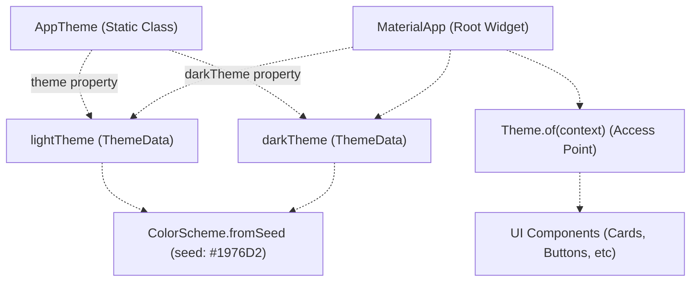
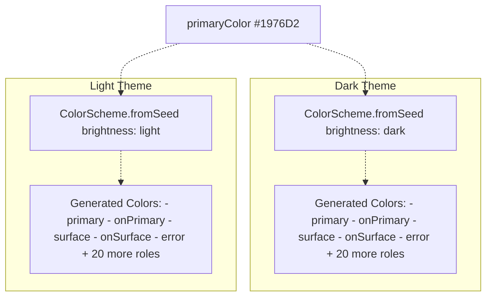
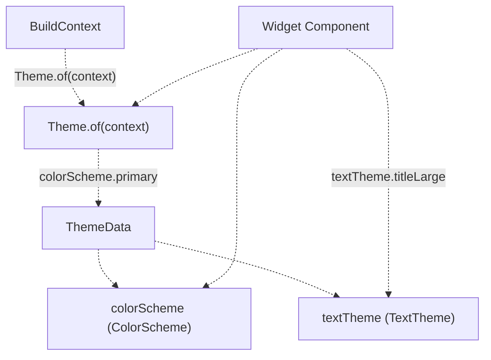
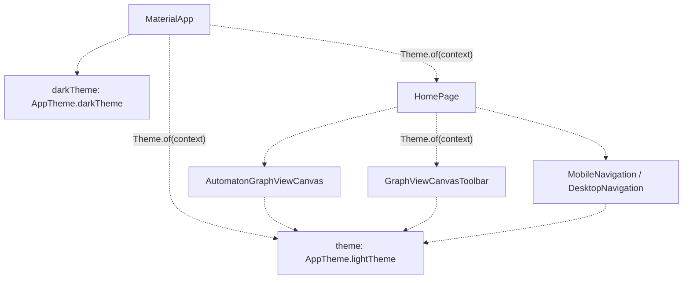

# Theme System

> **Relevant source files**
> * [integration_test/app_simulation_test.dart](https://github.com/ThalesMMS/JFlutter/blob/32e808b4/integration_test/app_simulation_test.dart)
> * [integration_test/driver.dart](https://github.com/ThalesMMS/JFlutter/blob/32e808b4/integration_test/driver.dart)
> * [lib/core/services/trace_persistence_service_stub.dart](https://github.com/ThalesMMS/JFlutter/blob/32e808b4/lib/core/services/trace_persistence_service_stub.dart)
> * [lib/presentation/pages/home_page.dart](https://github.com/ThalesMMS/JFlutter/blob/32e808b4/lib/presentation/pages/home_page.dart)
> * [lib/presentation/theme/app_theme.dart](https://github.com/ThalesMMS/JFlutter/blob/32e808b4/lib/presentation/theme/app_theme.dart)
> * [lib/presentation/widgets/desktop_navigation.dart](https://github.com/ThalesMMS/JFlutter/blob/32e808b4/lib/presentation/widgets/desktop_navigation.dart)
> * [lib/presentation/widgets/grammar_editor.dart](https://github.com/ThalesMMS/JFlutter/blob/32e808b4/lib/presentation/widgets/grammar_editor.dart)
> * [pubspec.lock](https://github.com/ThalesMMS/JFlutter/blob/32e808b4/pubspec.lock)
> * [pubspec.yaml](https://github.com/ThalesMMS/JFlutter/blob/32e808b4/pubspec.yaml)
> * [test/widget/presentation/home_page_test.dart](https://github.com/ThalesMMS/JFlutter/blob/32e808b4/test/widget/presentation/home_page_test.dart)

## Purpose and Scope

The Theme System provides centralized styling for JFlutter's user interface using Material Design 3 (Material You) specifications. This system defines color schemes, component styles, and visual consistency across all platform implementations. For information about individual UI components that use this theme, see [User Interface Components](#8). For responsive layout patterns that adapt to the theme, see [Responsive Layout System](#8.2).

**Sources:** [lib/presentation/theme/app_theme.dart L1-L120](https://github.com/ThalesMMS/JFlutter/blob/32e808b4/lib/presentation/theme/app_theme.dart#L1-L120)

---

## Theme Architecture

JFlutter implements a dual-theme system with light and dark variants. Both themes are constructed using Material 3's `ColorScheme.fromSeed` API, which generates a harmonious color palette from a single seed color.



**Diagram: Theme System Architecture**

The `AppTheme` class in [lib/presentation/theme/app_theme.dart L15-L119](https://github.com/ThalesMMS/JFlutter/blob/32e808b4/lib/presentation/theme/app_theme.dart#L15-L119)

 provides static getters for both theme variants. These themes are applied to the root `MaterialApp` widget and propagate down the widget tree via the `Theme.of(context)` inherited widget pattern.

**Sources:** [lib/presentation/theme/app_theme.dart L15-L119](https://github.com/ThalesMMS/JFlutter/blob/32e808b4/lib/presentation/theme/app_theme.dart#L15-L119)

 [pubspec.yaml L26-L28](https://github.com/ThalesMMS/JFlutter/blob/32e808b4/pubspec.yaml#L26-L28)

---

## Color Palette Definition

JFlutter defines a core color palette that forms the foundation of both light and dark themes:

| Color Constant | Hex Value | Purpose | Usage |
| --- | --- | --- | --- |
| `primaryColor` | `#1976D2` | Brand identity, primary actions | Seed color for Material 3 palette generation |
| `secondaryColor` | `#03DAC6` | Accent elements | Legacy color (Material 3 generates accents from seed) |
| `errorColor` | `#B00020` | Error states, destructive actions | Legacy color (Material 3 generates error from seed) |
| `surfaceColor` | `#FAFAFA` | Card backgrounds (light) | Legacy color (Material 3 generates surfaces) |
| `backgroundColor` | `#FFFFFF` | Page backgrounds (light) | Legacy color (Material 3 generates backgrounds) |

**Note:** While static color constants are defined in [lib/presentation/theme/app_theme.dart L16-L20](https://github.com/ThalesMMS/JFlutter/blob/32e808b4/lib/presentation/theme/app_theme.dart#L16-L20)

 Material 3's `ColorScheme.fromSeed` dynamically generates the complete palette. The seed color (`primaryColor`) is the only value actively used in theme generation [lib/presentation/theme/app_theme.dart L27](https://github.com/ThalesMMS/JFlutter/blob/32e808b4/lib/presentation/theme/app_theme.dart#L27-L27)

**Sources:** [lib/presentation/theme/app_theme.dart L16-L20](https://github.com/ThalesMMS/JFlutter/blob/32e808b4/lib/presentation/theme/app_theme.dart#L16-L20)

 [lib/presentation/theme/app_theme.dart L26-L29](https://github.com/ThalesMMS/JFlutter/blob/32e808b4/lib/presentation/theme/app_theme.dart#L26-L29)

 [lib/presentation/theme/app_theme.dart L75-L78](https://github.com/ThalesMMS/JFlutter/blob/32e808b4/lib/presentation/theme/app_theme.dart#L75-L78)

---

## Material 3 Color Scheme Generation

Both light and dark themes use identical theme construction logic, differing only in the `brightness` parameter:



**Diagram: Color Scheme Generation Pipeline**

Material 3's color system provides semantic color roles (e.g., `primary`, `onPrimary`, `surface`, `onSurface`) that automatically adapt to light/dark modes. This ensures WCAG-compliant contrast ratios without manual color definition.

**Sources:** [lib/presentation/theme/app_theme.dart L26-L29](https://github.com/ThalesMMS/JFlutter/blob/32e808b4/lib/presentation/theme/app_theme.dart#L26-L29)

 [lib/presentation/theme/app_theme.dart L75-L78](https://github.com/ThalesMMS/JFlutter/blob/32e808b4/lib/presentation/theme/app_theme.dart#L75-L78)

---

## Component Theme Configuration

JFlutter defines consistent styling for all major Material components. Both light and dark themes share identical component configurations:

### AppBar Theme

```yaml
appBarTheme: const AppBarTheme(  centerTitle: true,  elevation: 0,  scrolledUnderElevation: 1,)
```

* **Centered title** for symmetry
* **No elevation** by default (flat appearance)
* **Minimal elevation (1)** when scrolled under content

**Sources:** [lib/presentation/theme/app_theme.dart L30-L34](https://github.com/ThalesMMS/JFlutter/blob/32e808b4/lib/presentation/theme/app_theme.dart#L30-L34)

 [lib/presentation/theme/app_theme.dart L79-L83](https://github.com/ThalesMMS/JFlutter/blob/32e808b4/lib/presentation/theme/app_theme.dart#L79-L83)

### Card Theme

```yaml
cardTheme: CardThemeData(  elevation: 2,  shape: RoundedRectangleBorder(borderRadius: BorderRadius.circular(12)),)
```

* **Elevation 2** for subtle depth
* **12px border radius** for modern, rounded appearance

**Sources:** [lib/presentation/theme/app_theme.dart L35-L38](https://github.com/ThalesMMS/JFlutter/blob/32e808b4/lib/presentation/theme/app_theme.dart#L35-L38)

 [lib/presentation/theme/app_theme.dart L84-L87](https://github.com/ThalesMMS/JFlutter/blob/32e808b4/lib/presentation/theme/app_theme.dart#L84-L87)

### Button Themes

| Button Type | Border Radius | Padding | Configuration Location |
| --- | --- | --- | --- |
| `ElevatedButton` | 8px | 24h × 12v | [app_theme.dart L39-L44](https://github.com/ThalesMMS/JFlutter/blob/32e808b4/app_theme.dart#L39-L44) |
| `OutlinedButton` | 8px | 24h × 12v | [app_theme.dart L45-L50](https://github.com/ThalesMMS/JFlutter/blob/32e808b4/app_theme.dart#L45-L50) |

Both button types use consistent styling to maintain visual hierarchy.

**Sources:** [lib/presentation/theme/app_theme.dart L39-L50](https://github.com/ThalesMMS/JFlutter/blob/32e808b4/lib/presentation/theme/app_theme.dart#L39-L50)

 [lib/presentation/theme/app_theme.dart L88-L99](https://github.com/ThalesMMS/JFlutter/blob/32e808b4/lib/presentation/theme/app_theme.dart#L88-L99)

### Input Decoration Theme

```yaml
inputDecorationTheme: InputDecorationTheme(  border: OutlineInputBorder(borderRadius: BorderRadius.circular(8)),  contentPadding: const EdgeInsets.symmetric(horizontal: 16, vertical: 16),)
```

* **8px border radius** matches button styling
* **16px padding** on all sides for comfortable tap targets

**Sources:** [lib/presentation/theme/app_theme.dart L51-L57](https://github.com/ThalesMMS/JFlutter/blob/32e808b4/lib/presentation/theme/app_theme.dart#L51-L57)

 [lib/presentation/theme/app_theme.dart L100-L106](https://github.com/ThalesMMS/JFlutter/blob/32e808b4/lib/presentation/theme/app_theme.dart#L100-L106)

### Scrollbar Theme

```yaml
scrollbarTheme: ScrollbarThemeData(  thumbColor: WidgetStateProperty.all(primaryColor.withValues(alpha: 0.5)),  radius: const Radius.circular(8),  thickness: WidgetStateProperty.all(8),  thumbVisibility: WidgetStateProperty.all(true),)
```

* **Always visible** for desktop-like experience
* **8px thickness** for easy grabbing
* **50% opacity** of primary color for visual coherence

**Sources:** [lib/presentation/theme/app_theme.dart L58-L63](https://github.com/ThalesMMS/JFlutter/blob/32e808b4/lib/presentation/theme/app_theme.dart#L58-L63)

 [lib/presentation/theme/app_theme.dart L107-L112](https://github.com/ThalesMMS/JFlutter/blob/32e808b4/lib/presentation/theme/app_theme.dart#L107-L112)

### Bottom Navigation Bar Theme

```yaml
bottomNavigationBarTheme: const BottomNavigationBarThemeData(  type: BottomNavigationBarType.fixed,  elevation: 8,)
```

* **Fixed layout** (no shifting labels)
* **Elevation 8** to lift above content

**Sources:** [lib/presentation/theme/app_theme.dart L64-L67](https://github.com/ThalesMMS/JFlutter/blob/32e808b4/lib/presentation/theme/app_theme.dart#L64-L67)

 [lib/presentation/theme/app_theme.dart L113-L116](https://github.com/ThalesMMS/JFlutter/blob/32e808b4/lib/presentation/theme/app_theme.dart#L113-L116)

---

## Theme Usage in Components

Components access theme values through `Theme.of(context)`, which retrieves the nearest `ThemeData` from the widget tree.



**Diagram: Theme Access Pattern in Components**

### Example: Color Scheme Access

Components frequently access colors through the color scheme:

```
final colorScheme = Theme.of(context).colorScheme;// Usage examples from codebase:color: colorScheme.primary                    // Primary brand colorcolor: colorScheme.onPrimary                  // Text on primary surfacescolor: colorScheme.error                      // Error statescolor: colorScheme.onError                    // Text on error surfacescolor: colorScheme.surface                    // Card/surface backgroundscolor: colorScheme.onSurface                  // Text on surfacescolor: colorScheme.surfaceContainerHighest    // Elevated surfacescolor: colorScheme.onSurfaceVariant           // Secondary text
```

**Sources:** [lib/presentation/pages/home_page.dart L132](https://github.com/ThalesMMS/JFlutter/blob/32e808b4/lib/presentation/pages/home_page.dart#L132-L132)

 [lib/presentation/widgets/desktop_navigation.dart L22](https://github.com/ThalesMMS/JFlutter/blob/32e808b4/lib/presentation/widgets/desktop_navigation.dart#L22-L22)

 [lib/presentation/widgets/grammar_editor.dart L84](https://github.com/ThalesMMS/JFlutter/blob/32e808b4/lib/presentation/widgets/grammar_editor.dart#L84-L84)

### Example: Text Theme Access

Text styling is accessed through the text theme:

```
final textTheme = Theme.of(context).textTheme;// Common patterns:textTheme.titleLarge           // Large titles (AppBar)textTheme.titleMedium          // Medium titles (Section headers)textTheme.bodyMedium           // Body texttextTheme.bodySmall            // Caption text
```

**Sources:** [lib/presentation/pages/home_page.dart L156](https://github.com/ThalesMMS/JFlutter/blob/32e808b4/lib/presentation/pages/home_page.dart#L156-L156)

 [lib/presentation/widgets/grammar_editor.dart L112](https://github.com/ThalesMMS/JFlutter/blob/32e808b4/lib/presentation/widgets/grammar_editor.dart#L112-L112)

---

## Theme Application in Widget Tree

The theme is applied at the application root and propagates to all descendant widgets:



**Diagram: Theme Propagation Through Widget Tree**

The system automatically switches between light and dark themes based on the platform's brightness setting (accessible via `MediaQuery.of(context).platformBrightness`).

**Sources:** [lib/presentation/pages/home_page.dart L1-L278](https://github.com/ThalesMMS/JFlutter/blob/32e808b4/lib/presentation/pages/home_page.dart#L1-L278)

---

## Common Theme Usage Patterns

### Pattern 1: Dynamic Color Background

Many components use theme colors for dynamic backgrounds:

```
Container(  decoration: BoxDecoration(    color: Theme.of(context).colorScheme.surfaceContainerHighest,    borderRadius: BorderRadius.circular(8),  ),)
```

**Sources:** [lib/presentation/widgets/grammar_editor.dart L144-L147](https://github.com/ThalesMMS/JFlutter/blob/32e808b4/lib/presentation/widgets/grammar_editor.dart#L144-L147)

### Pattern 2: Selected State Styling

Components indicate selection using theme colors:

```yaml
decoration: BoxDecoration(  color: isSelected      ? Theme.of(context).colorScheme.primaryContainer      : Theme.of(context).colorScheme.surface,  border: Border.all(    color: isSelected        ? Theme.of(context).colorScheme.primary        : Theme.of(context).colorScheme.outline.withValues(alpha: 0.2),  ),)
```

**Sources:** [lib/presentation/widgets/grammar_editor.dart L443-L453](https://github.com/ThalesMMS/JFlutter/blob/32e808b4/lib/presentation/widgets/grammar_editor.dart#L443-L453)

### Pattern 3: Icon Theming

Icons are consistently colored using theme color roles:

```
Icon(  Icons.text_fields,  color: Theme.of(context).colorScheme.primary,)
```

**Sources:** [lib/presentation/widgets/grammar_editor.dart L104-L106](https://github.com/ThalesMMS/JFlutter/blob/32e808b4/lib/presentation/widgets/grammar_editor.dart#L104-L106)

### Pattern 4: Button Style Override

Buttons can override default theme styles for special cases:

```
ElevatedButton.styleFrom(  backgroundColor: Theme.of(context).colorScheme.error,  foregroundColor: Theme.of(context).colorScheme.onError,)
```

**Sources:** [lib/presentation/widgets/grammar_editor.dart L89-L92](https://github.com/ThalesMMS/JFlutter/blob/32e808b4/lib/presentation/widgets/grammar_editor.dart#L89-L92)

---

## Responsive Theme Considerations

The theme system works in conjunction with responsive layout breakpoints defined in [Responsive Layout System](#8.2):

| Breakpoint | Width | Theme Adjustments |
| --- | --- | --- |
| Mobile | < 1024px | Full Material 3 theming, bottom navigation |
| Tablet | 1024-1400px | Same theme, navigation rail introduced |
| Desktop | ≥ 1400px | Extended navigation rail labels |

Theme values remain constant across breakpoints; only layout components change. This ensures consistent branding regardless of screen size.

**Sources:** [lib/presentation/pages/home_page.dart L109-L110](https://github.com/ThalesMMS/JFlutter/blob/32e808b4/lib/presentation/pages/home_page.dart#L109-L110)

 [lib/presentation/widgets/desktop_navigation.dart L27-L29](https://github.com/ThalesMMS/JFlutter/blob/32e808b4/lib/presentation/widgets/desktop_navigation.dart#L27-L29)

---

## Material 3 Feature Usage

JFlutter leverages several Material 3 features enabled by `useMaterial3: true`:

### Dynamic Color System

* **Color roles** automatically adjust contrast for accessibility
* **Tonal palettes** provide harmonious color variations
* **Surface tints** add depth through subtle color shifts

### Component Updates

* **FilledButton** (ElevatedButton) with tonal elevation
* **Surface containers** with varying elevation levels
* **Updated navigation** components with Material 3 styling

### Accessibility

* **WCAG AA contrast ratios** guaranteed by color system
* **Touch target sizes** meet minimum 48dp requirement through padding
* **Color-independent** state indicators (elevation, borders)

**Sources:** [lib/presentation/theme/app_theme.dart L25](https://github.com/ThalesMMS/JFlutter/blob/32e808b4/lib/presentation/theme/app_theme.dart#L25-L25)

 [lib/presentation/theme/app_theme.dart L74](https://github.com/ThalesMMS/JFlutter/blob/32e808b4/lib/presentation/theme/app_theme.dart#L74-L74)

 [pubspec.yaml L115](https://github.com/ThalesMMS/JFlutter/blob/32e808b4/pubspec.yaml#L115-L115)

---

## Theme Customization Guide

To modify the theme:

1. **Change seed color**: Update `primaryColor` in [lib/presentation/theme/app_theme.dart L16](https://github.com/ThalesMMS/JFlutter/blob/32e808b4/lib/presentation/theme/app_theme.dart#L16-L16)
2. **Adjust component styles**: Modify theme data in `lightTheme` and `darkTheme` getters
3. **Add new component themes**: Extend `ThemeData` properties in both theme definitions
4. **Test both modes**: Verify changes in light and dark themes

Example: Changing border radius globally:

```sql
// Update all component border radii consistentlycardTheme: CardThemeData(  shape: RoundedRectangleBorder(borderRadius: BorderRadius.circular(16)), // was 12),elevatedButtonTheme: ElevatedButtonThemeData(  style: ElevatedButton.styleFrom(    shape: RoundedRectangleBorder(borderRadius: BorderRadius.circular(12)), // was 8  ),),
```

**Sources:** [lib/presentation/theme/app_theme.dart L35-L50](https://github.com/ThalesMMS/JFlutter/blob/32e808b4/lib/presentation/theme/app_theme.dart#L35-L50)

---

## Testing Considerations

Theme-dependent widgets are tested using Flutter's theme testing utilities:

```
await tester.pumpWidget(  MaterialApp(    theme: AppTheme.lightTheme,    home: WidgetUnderTest(),  ),);
```

The test suite verifies:

* Correct theme application at app root
* Theme propagation to child widgets
* Responsive layout adaptation with theme
* Platform brightness switching

**Sources:** [test/widget/presentation/home_page_test.dart L41-L57](https://github.com/ThalesMMS/JFlutter/blob/32e808b4/test/widget/presentation/home_page_test.dart#L41-L57)

---

## Summary

The Theme System provides a centralized, Material 3-compliant styling foundation for JFlutter. Key characteristics:

* **Material 3 implementation** with dynamic color generation
* **Dual-theme support** (light/dark) from single seed color
* **Consistent component styling** across all UI elements
* **Semantic color roles** for accessibility
* **Minimal configuration** (seed color only)
* **Platform-adaptive** brightness switching

The system balances modern design principles with practical implementation, ensuring visual consistency while maintaining flexibility for future customization.

**Sources:** [lib/presentation/theme/app_theme.dart L1-L120](https://github.com/ThalesMMS/JFlutter/blob/32e808b4/lib/presentation/theme/app_theme.dart#L1-L120)

 [pubspec.yaml L115](https://github.com/ThalesMMS/JFlutter/blob/32e808b4/pubspec.yaml#L115-L115)

Refresh this wiki

Last indexed: 30 December 2025 ([32e808](https://github.com/ThalesMMS/JFlutter/commit/32e808b4))

### On this page

* [Theme System](#8.5-theme-system)
* [Purpose and Scope](#8.5-purpose-and-scope)
* [Theme Architecture](#8.5-theme-architecture)
* [Color Palette Definition](#8.5-color-palette-definition)
* [Material 3 Color Scheme Generation](#8.5-material-3-color-scheme-generation)
* [Component Theme Configuration](#8.5-component-theme-configuration)
* [AppBar Theme](#8.5-appbar-theme)
* [Card Theme](#8.5-card-theme)
* [Button Themes](#8.5-button-themes)
* [Input Decoration Theme](#8.5-input-decoration-theme)
* [Scrollbar Theme](#8.5-scrollbar-theme)
* [Bottom Navigation Bar Theme](#8.5-bottom-navigation-bar-theme)
* [Theme Usage in Components](#8.5-theme-usage-in-components)
* [Example: Color Scheme Access](#8.5-example-color-scheme-access)
* [Example: Text Theme Access](#8.5-example-text-theme-access)
* [Theme Application in Widget Tree](#8.5-theme-application-in-widget-tree)
* [Common Theme Usage Patterns](#8.5-common-theme-usage-patterns)
* [Pattern 1: Dynamic Color Background](#8.5-pattern-1-dynamic-color-background)
* [Pattern 2: Selected State Styling](#8.5-pattern-2-selected-state-styling)
* [Pattern 3: Icon Theming](#8.5-pattern-3-icon-theming)
* [Pattern 4: Button Style Override](#8.5-pattern-4-button-style-override)
* [Responsive Theme Considerations](#8.5-responsive-theme-considerations)
* [Material 3 Feature Usage](#8.5-material-3-feature-usage)
* [Dynamic Color System](#8.5-dynamic-color-system)
* [Component Updates](#8.5-component-updates)
* [Accessibility](#8.5-accessibility)
* [Theme Customization Guide](#8.5-theme-customization-guide)
* [Testing Considerations](#8.5-testing-considerations)
* [Summary](#8.5-summary)

Ask Devin about JFlutter