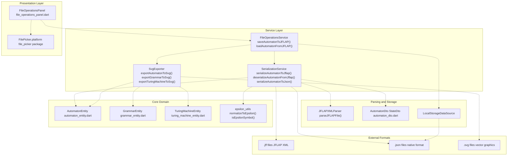
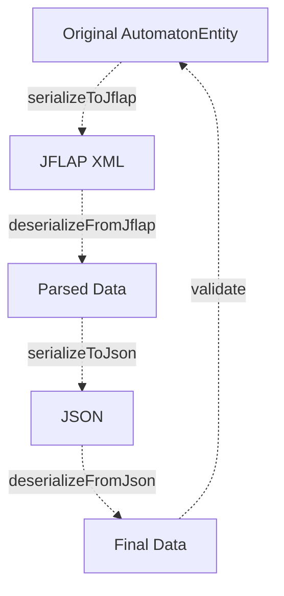
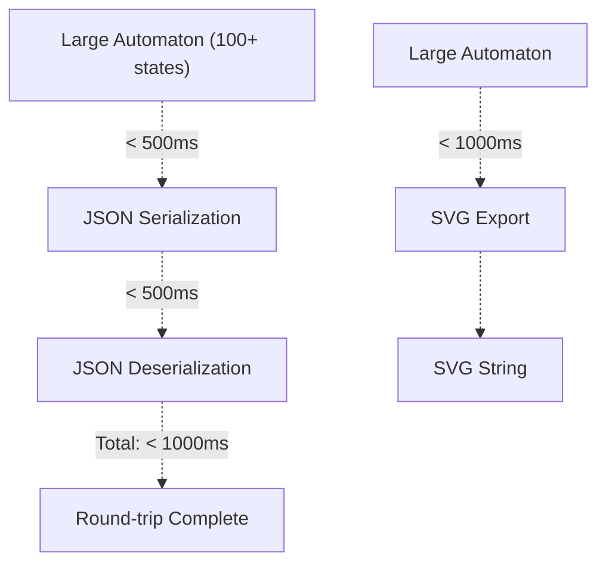

# Import and Export System

> **Relevant source files**
> * [lib/core/entities/automaton_entity.dart](https://github.com/ThalesMMS/JFlutter/blob/32e808b4/lib/core/entities/automaton_entity.dart)
> * [lib/core/utils/epsilon_utils.dart](https://github.com/ThalesMMS/JFlutter/blob/32e808b4/lib/core/utils/epsilon_utils.dart)
> * [lib/data/repositories/automaton_repository_impl.dart](https://github.com/ThalesMMS/JFlutter/blob/32e808b4/lib/data/repositories/automaton_repository_impl.dart)
> * [lib/data/services/automaton_service.dart](https://github.com/ThalesMMS/JFlutter/blob/32e808b4/lib/data/services/automaton_service.dart)
> * [lib/data/services/serialization_service.dart](https://github.com/ThalesMMS/JFlutter/blob/32e808b4/lib/data/services/serialization_service.dart)
> * [lib/presentation/widgets/export/svg_exporter.dart](https://github.com/ThalesMMS/JFlutter/blob/32e808b4/lib/presentation/widgets/export/svg_exporter.dart)
> * [lib/presentation/widgets/file_operations_panel.dart](https://github.com/ThalesMMS/JFlutter/blob/32e808b4/lib/presentation/widgets/file_operations_panel.dart)
> * [test/core/services/simulation_highlight_service_test.dart](https://github.com/ThalesMMS/JFlutter/blob/32e808b4/test/core/services/simulation_highlight_service_test.dart)
> * [test/integration/io/examples_roundtrip_test.dart](https://github.com/ThalesMMS/JFlutter/blob/32e808b4/test/integration/io/examples_roundtrip_test.dart)
> * [test/integration/io/interoperability_roundtrip_test.dart](https://github.com/ThalesMMS/JFlutter/blob/32e808b4/test/integration/io/interoperability_roundtrip_test.dart)

## Purpose and Scope

The Import and Export System provides comprehensive interoperability between JFlutter and external tools, persistence mechanisms, and visual export capabilities. This system enables users to:

* **Import** automata, grammars, and Turing machines from JFLAP XML files
* **Export** to JFLAP-compatible formats for use in academic workflows
* **Serialize** internal models to JSON for persistence and state management
* **Generate** SVG diagrams for documentation and presentations
* **Normalize** epsilon symbol representations across format boundaries

For detailed information about specific subsystems:

* File I/O operations and user workflows: see [File Operations](9a%20File-Operations-Panel.md)
* Format conversion mechanics and epsilon handling: see [Serialization and Format Conversion](9b%20Serialization-Service.md)
* JFLAP XML parser implementation: see [JFLAP Interoperability](9c%20JFLAP-Interoperability.md)
* Visual diagram generation: see [SVG and Visual Export](9d%20SVG-Export.md)

Sources: [lib/data/services/serialization_service.dart L1-L308](https://github.com/ThalesMMS/JFlutter/blob/32e808b4/lib/data/services/serialization_service.dart#L1-L308)

 [lib/presentation/widgets/file_operations_panel.dart L1-L603](https://github.com/ThalesMMS/JFlutter/blob/32e808b4/lib/presentation/widgets/file_operations_panel.dart#L1-L603)

 [lib/presentation/widgets/export/svg_exporter.dart L1-L880](https://github.com/ThalesMMS/JFlutter/blob/32e808b4/lib/presentation/widgets/export/svg_exporter.dart#L1-L880)

## Architecture Overview

The import/export system follows a layered architecture where domain entities flow through serialization services to reach various output formats. The system maintains bidirectional conversion capabilities for JFLAP XML and JSON, with unidirectional SVG export for visualization.



**Diagram: Import/Export System Architecture with Code Entities**

The system uses the `Result<T>` pattern throughout for functional error handling, ensuring that failures at any layer can be properly communicated to the UI without throwing exceptions. All serialization methods return `Result<Map<String, dynamic>>` or `Result<String>` types.

Sources: [lib/data/services/serialization_service.dart L15-L308](https://github.com/ThalesMMS/JFlutter/blob/32e808b4/lib/data/services/serialization_service.dart#L15-L308)

 [lib/presentation/widgets/file_operations_panel.dart L25-L603](https://github.com/ThalesMMS/JFlutter/blob/32e808b4/lib/presentation/widgets/file_operations_panel.dart#L25-L603)

 [lib/presentation/widgets/export/svg_exporter.dart L22-L880](https://github.com/ThalesMMS/JFlutter/blob/32e808b4/lib/presentation/widgets/export/svg_exporter.dart#L22-L880)

## Supported Formats

JFlutter supports three primary serialization formats, each serving distinct use cases:

| Format | File Extension | Direction | Primary Use Case | Implementation |
| --- | --- | --- | --- | --- |
| **JFLAP XML** | `.jff` (automata)`.cfg` (grammars) | Bidirectional | Interoperability with JFLAP academic tool | `SerializationService``JFLAPXMLParser` |
| **JSON** | `.json` | Bidirectional | Internal persistence, state management | `SerializationService``AutomatonDto` |
| **SVG** | `.svg` | Export-only | Visual documentation, presentations | `SvgExporter` |

**Table: Supported Serialization Formats**

The JFLAP XML format prioritizes compatibility with JFLAP 7.0+ conventions, while JSON provides a lightweight internal representation. SVG export generates self-contained diagrams suitable for web and print media.

Sources: [lib/data/services/serialization_service.dart L299-L307](https://github.com/ThalesMMS/JFlutter/blob/32e808b4/lib/data/services/serialization_service.dart#L299-L307)

 [lib/presentation/widgets/export/svg_exporter.dart L46-L148](https://github.com/ThalesMMS/JFlutter/blob/32e808b4/lib/presentation/widgets/export/svg_exporter.dart#L46-L148)

## Data Flow Pipeline

Data flows through multiple transformation layers as entities are serialized to external formats or deserialized back into the domain model:


**Diagram: Data Flow Through Import/Export Pipelines with Code Methods**

The intermediate `Map<String, dynamic>` representation serves as a format-agnostic boundary between domain entities and serialized formats, enabling consistent validation and transformation logic. All conversions handle epsilon symbol normalization via `normalizeToEpsilon()` from `epsilon_utils`.

Sources: [lib/data/services/serialization_service.dart L17-L103](https://github.com/ThalesMMS/JFlutter/blob/32e808b4/lib/data/services/serialization_service.dart#L17-L103)

 [lib/data/services/serialization_service.dart L105-L197](https://github.com/ThalesMMS/JFlutter/blob/32e808b4/lib/data/services/serialization_service.dart#L105-L197)

 [lib/presentation/widgets/export/svg_exporter.dart L46-L100](https://github.com/ThalesMMS/JFlutter/blob/32e808b4/lib/presentation/widgets/export/svg_exporter.dart#L46-L100)

 [lib/presentation/widgets/file_operations_panel.dart L180-L327](https://github.com/ThalesMMS/JFlutter/blob/32e808b4/lib/presentation/widgets/file_operations_panel.dart#L180-L327)

## Key Components

### SerializationService

The `SerializationService` class orchestrates all bidirectional format conversions between domain entities and external representations. Located at [lib/data/services/serialization_service.dart L15-L308](https://github.com/ThalesMMS/JFlutter/blob/32e808b4/lib/data/services/serialization_service.dart#L15-L308)

 it provides four core methods:

**JFLAP XML Serialization Methods:**

* `serializeAutomatonToJflap(Map<String, dynamic> automatonData) → String` - Converts internal data to JFLAP XML format using the `xml` package's `XmlBuilder`. Constructs `<structure>`, `<automaton>`, `<state>`, and `<transition>` elements with proper JFLAP 7.0+ schema compliance. [lib/data/services/serialization_service.dart L18-L103](https://github.com/ThalesMMS/JFlutter/blob/32e808b4/lib/data/services/serialization_service.dart#L18-L103)
* `deserializeAutomatonFromJflap(String xmlString) → Result<Map<String, dynamic>>` - Parses JFLAP XML using `XmlDocument.parse()`. Handles both attribute-based and element-based state positioning (x/y coordinates). Supports `<type>` element and `type` attribute for automaton type detection. [lib/data/services/serialization_service.dart L106-L197](https://github.com/ThalesMMS/JFlutter/blob/32e808b4/lib/data/services/serialization_service.dart#L106-L197)

**JSON Serialization Methods:**

* `serializeAutomatonToJson(Map<String, dynamic> automatonData) → String` - Converts to compact JSON using `AutomatonDto` and `StateDto` data transfer objects. Uses `jsonEncode()` for serialization. [lib/data/services/serialization_service.dart L204-L233](https://github.com/ThalesMMS/JFlutter/blob/32e808b4/lib/data/services/serialization_service.dart#L204-L233)
* `deserializeAutomatonFromJson(String jsonString) → Result<Map<String, dynamic>>` - Parses JSON using `jsonDecode()` followed by `AutomatonDto.fromJson()` deserialization. [lib/data/services/serialization_service.dart L236-L256](https://github.com/ThalesMMS/JFlutter/blob/32e808b4/lib/data/services/serialization_service.dart#L236-L256)

**Epsilon Normalization:**
The service ensures epsilon symbol normalization occurs at every format boundary by calling `_normalizeTransitionSymbol()` [lib/data/services/serialization_service.dart L199-L201](https://github.com/ThalesMMS/JFlutter/blob/32e808b4/lib/data/services/serialization_service.dart#L199-L201)

 which delegates to `normalizeToEpsilon()` from `epsilon_utils`. All epsilon aliases (`ε`, `λ`, `lambda`, `vazio`, etc.) are converted to the canonical `ε` symbol.

**Round-Trip Testing:**

* `roundTripTest(Map<String, dynamic>, SerializationFormat) → Result<Map<String, dynamic>>` - Validates format conversion correctness by serializing and deserializing data, ensuring no data loss. [lib/data/services/serialization_service.dart L259-L286](https://github.com/ThalesMMS/JFlutter/blob/32e808b4/lib/data/services/serialization_service.dart#L259-L286)

See [Serialization and Format Conversion](9b%20Serialization-Service.md) for implementation details.

Sources: [lib/data/services/serialization_service.dart L15-L308](https://github.com/ThalesMMS/JFlutter/blob/32e808b4/lib/data/services/serialization_service.dart#L15-L308)

 [lib/core/utils/epsilon_utils.dart L38-L43](https://github.com/ThalesMMS/JFlutter/blob/32e808b4/lib/core/utils/epsilon_utils.dart#L38-L43)

### FileOperationsPanel

The `FileOperationsPanel` widget provides the primary UI for import/export operations. Located at [lib/presentation/widgets/file_operations_panel.dart L26-L603](https://github.com/ThalesMMS/JFlutter/blob/32e808b4/lib/presentation/widgets/file_operations_panel.dart#L26-L603)

 it manages:

**Component Structure:**

* Takes nullable `FSA? automaton` and `Grammar? grammar` properties to conditionally render operation buttons [lib/presentation/widgets/file_operations_panel.dart L27-L30](https://github.com/ThalesMMS/JFlutter/blob/32e808b4/lib/presentation/widgets/file_operations_panel.dart#L27-L30)
* Accepts `ValueChanged<FSA>? onAutomatonLoaded` and `ValueChanged<Grammar>? onGrammarLoaded` callbacks to propagate loaded data to parent widgets [lib/presentation/widgets/file_operations_panel.dart L29-L30](https://github.com/ThalesMMS/JFlutter/blob/32e808b4/lib/presentation/widgets/file_operations_panel.dart#L29-L30)
* Maintains internal state for loading indicators (`_isLoading`), user feedback messages (`_PanelFeedback`), and retry operations (`_pendingRetry`) [lib/presentation/widgets/file_operations_panel.dart L58-L68](https://github.com/ThalesMMS/JFlutter/blob/32e808b4/lib/presentation/widgets/file_operations_panel.dart#L58-L68)

**File Picker Integration:**

* Automaton operations: Uses `FilePicker.platform.pickFiles(type: FileType.custom, allowedExtensions: ['jff'], withData: true)` for JFLAP file selection [lib/presentation/widgets/file_operations_panel.dart L239-L244](https://github.com/ThalesMMS/JFlutter/blob/32e808b4/lib/presentation/widgets/file_operations_panel.dart#L239-L244)
* Grammar operations: Similar pattern with `.cfg` extension [lib/presentation/widgets/file_operations_panel.dart L389-L394](https://github.com/ThalesMMS/JFlutter/blob/32e808b4/lib/presentation/widgets/file_operations_panel.dart#L389-L394)
* Save operations: Uses `FilePicker.platform.saveFile()` with suggested filename on desktop; triggers automatic download on web via `kIsWeb` check [lib/presentation/widgets/file_operations_panel.dart L186-L207](https://github.com/ThalesMMS/JFlutter/blob/32e808b4/lib/presentation/widgets/file_operations_panel.dart#L186-L207)

**Error Handling:**

* Implements `_handleImportFailure()` which classifies errors using `_resolveImportErrorType()` into `ImportErrorType` enum values: `malformedJFF`, `invalidJSON`, `unsupportedVersion`, `corruptedData`, `invalidAutomaton` [lib/presentation/widgets/file_operations_panel.dart L427-L449](https://github.com/ThalesMMS/JFlutter/blob/32e808b4/lib/presentation/widgets/file_operations_panel.dart#L427-L449)  [lib/presentation/widgets/file_operations_panel.dart L508-L526](https://github.com/ThalesMMS/JFlutter/blob/32e808b4/lib/presentation/widgets/file_operations_panel.dart#L508-L526)
* Critical errors (XML parse failures, corruption) trigger modal `ImportErrorDialog` with technical details and stack traces [lib/presentation/widgets/file_operations_panel.dart L451-L490](https://github.com/ThalesMMS/JFlutter/blob/32e808b4/lib/presentation/widgets/file_operations_panel.dart#L451-L490)
* Recoverable errors display inline `ErrorBanner` with retry buttons [lib/presentation/widgets/file_operations_panel.dart L565-L579](https://github.com/ThalesMMS/JFlutter/blob/32e808b4/lib/presentation/widgets/file_operations_panel.dart#L565-L579)

**Platform-Specific Behavior:**

* Web: "Save" buttons labeled as "Download" and trigger immediate browser downloads [lib/presentation/widgets/file_operations_panel.dart L104-L105](https://github.com/ThalesMMS/JFlutter/blob/32e808b4/lib/presentation/widgets/file_operations_panel.dart#L104-L105)
* Desktop/Mobile: "Save" buttons open native file picker dialogs [lib/presentation/widgets/file_operations_panel.dart L193-L207](https://github.com/ThalesMMS/JFlutter/blob/32e808b4/lib/presentation/widgets/file_operations_panel.dart#L193-L207)

See [File Operations](9a%20File-Operations-Panel.md) for user workflow details.

Sources: [lib/presentation/widgets/file_operations_panel.dart L26-L603](https://github.com/ThalesMMS/JFlutter/blob/32e808b4/lib/presentation/widgets/file_operations_panel.dart#L26-L603)

### SvgExporter

The `SvgExporter` utility class generates SVG diagrams from domain entities without requiring a rendering context. Located at [lib/presentation/widgets/export/svg_exporter.dart L22-L880](https://github.com/ThalesMMS/JFlutter/blob/32e808b4/lib/presentation/widgets/export/svg_exporter.dart#L22-L880)

 it implements:

**Static Export Methods:**

* `exportAutomatonToSvg(AutomatonEntity, {double width, double height, SvgExportOptions? options}) → String` - Generates SVG for finite automata (DFA/NFA). Returns complete XML string with embedded styles. [lib/presentation/widgets/export/svg_exporter.dart L47-L83](https://github.com/ThalesMMS/JFlutter/blob/32e808b4/lib/presentation/widgets/export/svg_exporter.dart#L47-L83)
* `exportGrammarToSvg(GrammarEntity, {double width, double height, SvgExportOptions? options}) → String` - Converts grammar to automaton representation via `_grammarToAutomaton()` then exports as SVG. [lib/presentation/widgets/export/svg_exporter.dart L86-L100](https://github.com/ThalesMMS/JFlutter/blob/32e808b4/lib/presentation/widgets/export/svg_exporter.dart#L86-L100)
* `exportTuringMachineToSvg(TuringMachineEntity, {double width, double height, SvgExportOptions? options}) → String` - Generates SVG with tape visualization, read/write head indicator, and state diagram. [lib/presentation/widgets/export/svg_exporter.dart L103-L148](https://github.com/ThalesMMS/JFlutter/blob/32e808b4/lib/presentation/widgets/export/svg_exporter.dart#L103-L148)

**Layout Algorithms:**

* Automaton states: Grid layout calculated by `_calculateStatePositions()` using `sqrt(states.length)` for column count, distributing states evenly across canvas. [lib/presentation/widgets/export/svg_exporter.dart L533-L562](https://github.com/ThalesMMS/JFlutter/blob/32e808b4/lib/presentation/widgets/export/svg_exporter.dart#L533-L562)
* Turing machine states: Circular layout via `_layoutStatesForTm()` positioning states on a circle using trigonometric calculations `(centerX + radius * cos(angle), centerY + radius * sin(angle))`. [lib/presentation/widgets/export/svg_exporter.dart L279-L306](https://github.com/ThalesMMS/JFlutter/blob/32e808b4/lib/presentation/widgets/export/svg_exporter.dart#L279-L306)

**Rendering Components:**

* States: Drawn using `<circle>` elements. Accepting states get double circles (outer circle at radius + 5). Initial states get arrow indicators via `_addInitialArrow()`. [lib/presentation/widgets/export/svg_exporter.dart L564-L613](https://github.com/ThalesMMS/JFlutter/blob/32e808b4/lib/presentation/widgets/export/svg_exporter.dart#L564-L613)
* Transitions: Straight lines via `_drawTransitionEdge()` for state-to-state transitions. Self-loops via `_drawSelfLoop()` using cubic Bézier `<path>` elements. [lib/presentation/widgets/export/svg_exporter.dart L653-L725](https://github.com/ThalesMMS/JFlutter/blob/32e808b4/lib/presentation/widgets/export/svg_exporter.dart#L653-L725)
* TM-specific: Tape cells rendered by `_buildTapeCells()`, head indicator by `_drawHeadIndicator()` as polygon pointing to active cell. [lib/presentation/widgets/export/svg_exporter.dart L196-L277](https://github.com/ThalesMMS/JFlutter/blob/32e808b4/lib/presentation/widgets/export/svg_exporter.dart#L196-L277)

**Styling and Customization:**

* Embedded `<defs>` section includes arrow markers (`id="arrowhead"`) and accepting state masks. [lib/presentation/widgets/export/svg_exporter.dart L154-L176](https://github.com/ThalesMMS/JFlutter/blob/32e808b4/lib/presentation/widgets/export/svg_exporter.dart#L154-L176)
* `<style>` section defines CSS classes: `.state`, `.transition`, `.tape-cell`, `.tape-symbol`, `.head`, `.legend`. [lib/presentation/widgets/export/svg_exporter.dart L177-L193](https://github.com/ThalesMMS/JFlutter/blob/32e808b4/lib/presentation/widgets/export/svg_exporter.dart#L177-L193)
* `SvgExportOptions` allows title inclusion, legend display, scaling factor, and optional `ColorScheme` integration. [lib/presentation/widgets/export/svg_exporter.dart L834-L846](https://github.com/ThalesMMS/JFlutter/blob/32e808b4/lib/presentation/widgets/export/svg_exporter.dart#L834-L846)

**Utility Methods:**

* `_formatDimension(num value) → String` - Formats numeric coordinates, removing trailing zeros and handling NaN/Infinity. [lib/presentation/widgets/export/svg_exporter.dart L30-L44](https://github.com/ThalesMMS/JFlutter/blob/32e808b4/lib/presentation/widgets/export/svg_exporter.dart#L30-L44)
* `_colorToHex(Color color) → String` - Converts Flutter `Color` to hex string for SVG attributes. [lib/presentation/widgets/export/svg_exporter.dart L494-L497](https://github.com/ThalesMMS/JFlutter/blob/32e808b4/lib/presentation/widgets/export/svg_exporter.dart#L494-L497)

All exported SVGs use `viewBox` for responsive scaling and include proper XML declaration headers for standalone file validity.

See [SVG and Visual Export](9d%20SVG-Export.md) for rendering details.

Sources: [lib/presentation/widgets/export/svg_exporter.dart L22-L880](https://github.com/ThalesMMS/JFlutter/blob/32e808b4/lib/presentation/widgets/export/svg_exporter.dart#L22-L880)

### JFLAPXMLParser

The `JFLAPXMLParser` handles the complexities of JFLAP's XML dialect, including attribute vs. element positioning variations and structure type inference. The parser is invoked through `SerializationService.deserializeAutomatonFromJflap()` which uses the `xml` package to parse JFLAP XML structures.

**Key Parsing Features:**

* Handles both `<x>` element-based and `x=""` attribute-based coordinate specifications for state positioning [lib/data/services/serialization_service.dart L140-L145](https://github.com/ThalesMMS/JFlutter/blob/32e808b4/lib/data/services/serialization_service.dart#L140-L145)
* Detects automaton type from either `<type>` element or `type=""` attribute on `<structure>` [lib/data/services/serialization_service.dart L120-L124](https://github.com/ThalesMMS/JFlutter/blob/32e808b4/lib/data/services/serialization_service.dart#L120-L124)
* Recognizes `<initial/>` and `<final/>` marker elements within `<state>` definitions [lib/data/services/serialization_service.dart L146-L147](https://github.com/ThalesMMS/JFlutter/blob/32e808b4/lib/data/services/serialization_service.dart#L146-L147)
* Parses `<transition>` elements with `<from>`, `<to>`, and `<read>` sub-elements [lib/data/services/serialization_service.dart L165-L184](https://github.com/ThalesMMS/JFlutter/blob/32e808b4/lib/data/services/serialization_service.dart#L165-L184)
* Normalizes epsilon symbols via `_normalizeTransitionSymbol()` during transition parsing [lib/data/services/serialization_service.dart L177-L180](https://github.com/ThalesMMS/JFlutter/blob/32e808b4/lib/data/services/serialization_service.dart#L177-L180)

**Error Handling:**

* Returns `Failure` result with descriptive error messages for malformed XML or missing required elements [lib/data/services/serialization_service.dart L114-L118](https://github.com/ThalesMMS/JFlutter/blob/32e808b4/lib/data/services/serialization_service.dart#L114-L118)
* Skips states without valid ID attributes rather than failing entire parse [lib/data/services/serialization_service.dart L136-L138](https://github.com/ThalesMMS/JFlutter/blob/32e808b4/lib/data/services/serialization_service.dart#L136-L138)

The parser is tested extensively in round-trip integration tests to ensure compatibility with JFLAP 7.0+ format variations.

See [JFLAP Interoperability](9c%20JFLAP-Interoperability.md) for parser implementation details.

Sources: [lib/data/services/serialization_service.dart L105-L197](https://github.com/ThalesMMS/JFlutter/blob/32e808b4/lib/data/services/serialization_service.dart#L105-L197)

 [lib/core/parsers/jflap_xml_parser.dart

1](https://github.com/ThalesMMS/JFlutter/blob/32e808b4/lib/core/parsers/jflap_xml_parser.dart#L1-LNaN)

## Epsilon Symbol Normalization

A critical cross-cutting concern in the import/export system is the consistent handling of epsilon (empty string) symbols. JFLAP and academic literature use various notations: `ε`, `λ`, `epsilon`, `lambda`, `empty`, `vazio`, and empty strings.

The `epsilon_utils` module [lib/core/utils/epsilon_utils.dart L1-L65](https://github.com/ThalesMMS/JFlutter/blob/32e808b4/lib/core/utils/epsilon_utils.dart#L1-L65)

 centralizes this complexity:

```
// Constants and aliasesconst String kEpsilonSymbol = 'ε';const Set<String> _epsilonAliases = {  'ε', 'lambda', 'λ', 'epsilon', 'varepsilon',   'eps', 'empty', 'vazio', '∅', 'ø',};// Core normalization functionString normalizeToEpsilon(String? symbol) {  if (isEpsilonSymbol(symbol)) {    return kEpsilonSymbol; // Always returns 'ε'  }  return symbol?.trim() ?? '';}// Detection functionbool isEpsilonSymbol(String? symbol) {  final trimmed = symbol?.trim() ?? '';  if (trimmed.isEmpty) return true;  final normalised = trimmed.toLowerCase();  return _epsilonAliases.contains(normalised);}
```

**Normalization Strategy**

All serialization operations normalize epsilon symbols at format boundaries:

| Operation | Normalization Point | Implementation |
| --- | --- | --- |
| **JFLAP XML export** | Transition serialization | `_normalizeTransitionSymbol(rawSymbol)` called before writing `<read>` element. All epsilon variants converted to `<read>ε</read>`. [lib/data/services/serialization_service.dart L78-L92](https://github.com/ThalesMMS/JFlutter/blob/32e808b4/lib/data/services/serialization_service.dart#L78-L92) |
| **JFLAP XML import** | Transition deserialization | `_normalizeTransitionSymbol(rawSymbol)` called after reading `<read>` element. All epsilon aliases recognized and converted to `ε`. [lib/data/services/serialization_service.dart L177-L180](https://github.com/ThalesMMS/JFlutter/blob/32e808b4/lib/data/services/serialization_service.dart#L177-L180) |
| **Transition key parsing** | Key decomposition | `normalizeToEpsilon()` called when extracting symbol from `stateId\|symbol` format keys. [lib/data/services/serialization_service.dart L199-L201](https://github.com/ThalesMMS/JFlutter/blob/32e808b4/lib/data/services/serialization_service.dart#L199-L201) |
| **Repository conversions** | Entity-to-FSA mapping | `normalizeToEpsilon()` called when building transition keys from entity data. [lib/data/repositories/automaton_repository_impl.dart L151](https://github.com/ThalesMMS/JFlutter/blob/32e808b4/lib/data/repositories/automaton_repository_impl.dart#L151-L151) |
| **SVG export** | Transition labels | `normalizeToEpsilon()` called via `extractSymbolFromTransitionKey()` when rendering transition text. [lib/presentation/widgets/export/svg_exporter.dart L632](https://github.com/ThalesMMS/JFlutter/blob/32e808b4/lib/presentation/widgets/export/svg_exporter.dart#L632-L632) |

**Transition Key Format:**
Transition keys use the format `{stateId}|{symbol}`, where the symbol portion may be epsilon. Helper functions extract components:

* `extractStateIdFromTransitionKey(String key) → String` - Extracts state ID before pipe separator [lib/core/utils/epsilon_utils.dart L47-L53](https://github.com/ThalesMMS/JFlutter/blob/32e808b4/lib/core/utils/epsilon_utils.dart#L47-L53)
* `extractSymbolFromTransitionKey(String key) → String` - Extracts symbol after pipe separator, returning empty string if absent [lib/core/utils/epsilon_utils.dart L58-L64](https://github.com/ThalesMMS/JFlutter/blob/32e808b4/lib/core/utils/epsilon_utils.dart#L58-L64)

This ensures that automatons imported from various sources maintain semantic consistency regardless of notation preferences. Round-trip tests verify that all epsilon aliases (`λ`, `vazio`, `∅`) correctly normalize to `ε` and back through format conversions [test/integration/io/interoperability_roundtrip_test.dart L137-L190](https://github.com/ThalesMMS/JFlutter/blob/32e808b4/test/integration/io/interoperability_roundtrip_test.dart#L137-L190)

Sources: [lib/core/utils/epsilon_utils.dart L1-L65](https://github.com/ThalesMMS/JFlutter/blob/32e808b4/lib/core/utils/epsilon_utils.dart#L1-L65)

 [lib/data/services/serialization_service.dart L199-L201](https://github.com/ThalesMMS/JFlutter/blob/32e808b4/lib/data/services/serialization_service.dart#L199-L201)

 [lib/data/repositories/automaton_repository_impl.dart L151](https://github.com/ThalesMMS/JFlutter/blob/32e808b4/lib/data/repositories/automaton_repository_impl.dart#L151-L151)

 [test/integration/io/interoperability_roundtrip_test.dart L137-L190](https://github.com/ThalesMMS/JFlutter/blob/32e808b4/test/integration/io/interoperability_roundtrip_test.dart#L137-L190)

## Error Handling and Validation

The import/export system employs multiple error handling strategies depending on the severity and recoverability of failures:

### Result Pattern

All serialization operations return `Result<T>` types wrapping either `Success(data)` or `Failure(error)`. This functional approach enables explicit error handling at call sites:

```
Result<Map<String, dynamic>> deserializeAutomatonFromJflap(String xmlString) {  try {    final document = XmlDocument.parse(xmlString);    final automatonElement = document.findAllElements('automaton').first;    // ... parsing logic    return Success(automatonData);  } catch (e) {    return Failure('Failed to deserialize JFLAP automaton: $e');  }}
```

The `Result<T>` type is defined in [lib/core/result.dart](https://github.com/ThalesMMS/JFlutter/blob/32e808b4/lib/core/result.dart)

 and provides `isSuccess`, `isFailure`, `data`, and `error` accessors. UI components check `result.isSuccess` before accessing `result.data!` to safely unwrap values.

Sources: [lib/data/services/serialization_service.dart L105-L197](https://github.com/ThalesMMS/JFlutter/blob/32e808b4/lib/data/services/serialization_service.dart#L105-L197)

 [lib/core/result.dart

1](https://github.com/ThalesMMS/JFlutter/blob/32e808b4/lib/core/result.dart#L1-LNaN)

### Import Error Classification

The `FileOperationsPanel` categorizes import failures into distinct error types for user-friendly messaging:

| Error Type | Trigger Conditions | User Message Strategy | Detection Logic |
| --- | --- | --- | --- |
| `malformedJFF` | XML parse failures, malformed structure | "File could not be parsed. Verify integrity." | `message.contains('xml') \|\| message.contains('parse')` [lib/presentation/widgets/file_operations_panel.dart L511-L512](https://github.com/ThalesMMS/JFlutter/blob/32e808b4/lib/presentation/widgets/file_operations_panel.dart#L511-L512) |
| `invalidJSON` | JSON structure errors, syntax issues | "JSON sections are invalid. Fix structure." | `message.contains('json')` [lib/presentation/widgets/file_operations_panel.dart L514-L515](https://github.com/ThalesMMS/JFlutter/blob/32e808b4/lib/presentation/widgets/file_operations_panel.dart#L514-L515) |
| `unsupportedVersion` | Schema version mismatches | "Newer JFLAP schema. Export with compatible version." | `message.contains('version')` [lib/presentation/widgets/file_operations_panel.dart L516-L518](https://github.com/ThalesMMS/JFlutter/blob/32e808b4/lib/presentation/widgets/file_operations_panel.dart#L516-L518) |
| `corruptedData` | Unreadable file content, empty data | "File appears corrupted. Restore valid backup." | `message.contains('corrupt') \|\| message.contains('unreadable')` [lib/presentation/widgets/file_operations_panel.dart L519-L523](https://github.com/ThalesMMS/JFlutter/blob/32e808b4/lib/presentation/widgets/file_operations_panel.dart#L519-L523) |
| `invalidAutomaton` | Inconsistent state/transition definitions | "Automaton definition inconsistent. Review before retry." | Default fallback case [lib/presentation/widgets/file_operations_panel.dart L525](https://github.com/ThalesMMS/JFlutter/blob/32e808b4/lib/presentation/widgets/file_operations_panel.dart#L525-L525) |

**Error Handling Workflow:**

1. `_handleImportFailure()` receives error message, filename, and optional stack trace [lib/presentation/widgets/file_operations_panel.dart L427-L449](https://github.com/ThalesMMS/JFlutter/blob/32e808b4/lib/presentation/widgets/file_operations_panel.dart#L427-L449)
2. `_isCriticalImportError()` checks if error requires modal dialog (XML/JSON parse failures, corruption) [lib/presentation/widgets/file_operations_panel.dart L543-L551](https://github.com/ThalesMMS/JFlutter/blob/32e808b4/lib/presentation/widgets/file_operations_panel.dart#L543-L551)
3. Critical errors → `_showImportErrorDialog()` displays `ImportErrorDialog` with technical details [lib/presentation/widgets/file_operations_panel.dart L451-L490](https://github.com/ThalesMMS/JFlutter/blob/32e808b4/lib/presentation/widgets/file_operations_panel.dart#L451-L490)
4. Non-critical errors → `_showErrorMessage()` displays inline `ErrorBanner` with retry button [lib/presentation/widgets/file_operations_panel.dart L565-L579](https://github.com/ThalesMMS/JFlutter/blob/32e808b4/lib/presentation/widgets/file_operations_panel.dart#L565-L579)
5. `_resolveImportErrorType()` maps error message patterns to `ImportErrorType` enum [lib/presentation/widgets/file_operations_panel.dart L508-L526](https://github.com/ThalesMMS/JFlutter/blob/32e808b4/lib/presentation/widgets/file_operations_panel.dart#L508-L526)
6. `_friendlyMessageFor()` generates user-facing messages from error types [lib/presentation/widgets/file_operations_panel.dart L528-L541](https://github.com/ThalesMMS/JFlutter/blob/32e808b4/lib/presentation/widgets/file_operations_panel.dart#L528-L541)

The `ErrorBanner` component [lib/presentation/widgets/error_banner.dart](https://github.com/ThalesMMS/JFlutter/blob/32e808b4/lib/presentation/widgets/error_banner.dart)

 supports severity levels (`ErrorSeverity.error`, `ErrorSeverity.warning`, `ErrorSeverity.info`) and optional retry/dismiss callbacks.

Sources: [lib/presentation/widgets/file_operations_panel.dart L427-L601](https://github.com/ThalesMMS/JFlutter/blob/32e808b4/lib/presentation/widgets/file_operations_panel.dart#L427-L601)

### Platform-Specific Handling

Web and desktop platforms require different error handling approaches:

* **Web**: File picker cancellations return `null` (line 200-202 in `file_operations_panel.dart`)
* **Desktop**: Native dialog cancellations must be distinguished from read failures
* Both platforms gracefully handle `mounted` checks to prevent setState after disposal

Sources: [lib/presentation/widgets/file_operations_panel.dart L180-L233](https://github.com/ThalesMMS/JFlutter/blob/32e808b4/lib/presentation/widgets/file_operations_panel.dart#L180-L233)

## Round-Trip Integrity

The system validates format conversion correctness through comprehensive round-trip tests that ensure data preservation across format boundaries:



**Diagram: Multi-Format Round-Trip Validation**

Round-trip tests validate:

* **State preservation**: Count, IDs, names, positions, flags
* **Transition preservation**: Source/target states, symbol mappings
* **Metadata preservation**: Automaton name, type, alphabet
* **Epsilon normalization**: All aliases convert to canonical `ε` and back

Sources: [test/integration/io/interoperability_roundtrip_test.dart L26-L1677](https://github.com/ThalesMMS/JFlutter/blob/32e808b4/test/integration/io/interoperability_roundtrip_test.dart#L26-L1677)

## Known Limitations and Deviations

The reference deviations document tracks intentional differences between JFlutter's implementation and JFLAP reference behavior:

### Active Import/Export Deviations

| Area | Description | Impact |
| --- | --- | --- |
| **Round-trip fixtures** | 19 integration test failures related to epsilon serialization mismatches and SVG viewBox formatting for empty automata | Exporters remain usable but require manual verification for affected artifacts |
| **Empty automaton SVG** | viewBox formatting differs from expected baseline when no states defined | Visual output functional but non-canonical |
| **Epsilon serialization** | Some aliases (`vazio`, `∅`) normalize correctly but may not round-trip through JFLAP unchanged | Semantic equivalence maintained, notation may vary |

These deviations are tracked under the "IO stabilization epic" with planned resolution in future milestones. Manual testing is recommended for critical export operations until fixture alignment is complete.

Sources: [docs/reference-deviations.md L1-L56](https://github.com/ThalesMMS/JFlutter/blob/32e808b4/docs/reference-deviations.md#L1-L56)

 [test/integration/io/interoperability_roundtrip_test.dart L222-L247](https://github.com/ThalesMMS/JFlutter/blob/32e808b4/test/integration/io/interoperability_roundtrip_test.dart#L222-L247)

## Performance Characteristics

The serialization system maintains performance constraints suitable for interactive educational use:



**Diagram: Performance Benchmarks for Large Automatons**

**Measured Performance:**

* **Large automaton JSON round-trip**: <1000ms for automatons with 100+ states and transitions. Test uses `_createLargeAutomaton()` fixture with `Stopwatch` measurement. [test/integration/io/interoperability_roundtrip_test.dart L773-L798](https://github.com/ThalesMMS/JFlutter/blob/32e808b4/test/integration/io/interoperability_roundtrip_test.dart#L773-L798)
* **SVG export of large automaton**: <1000ms including layout calculation and SVG string generation. [test/integration/io/interoperability_roundtrip_test.dart L800-L819](https://github.com/ThalesMMS/JFlutter/blob/32e808b4/test/integration/io/interoperability_roundtrip_test.dart#L800-L819)
* **Multi-format conversions**: Original → JFLAP XML → JSON → JFLAP XML sequence completes within interactive bounds. [test/integration/io/interoperability_roundtrip_test.dart L821-L850](https://github.com/ThalesMMS/JFlutter/blob/32e808b4/test/integration/io/interoperability_roundtrip_test.dart#L821-L850)

**Performance Considerations:**

* `SvgExporter` performs all layout calculations in-memory without Flutter widget tree overhead
* `SerializationService` uses streaming XML builders to minimize memory allocations
* `epsilon_utils` functions use constant-time set lookups for symbol normalization
* File picker operations run asynchronously with UI progress indicators to prevent blocking

These benchmarks ensure the import/export system remains responsive even when working with complex academic examples or student-generated automatons. Tests fail if operations exceed 1000ms threshold.

Sources: [test/integration/io/interoperability_roundtrip_test.dart L772-L850](https://github.com/ThalesMMS/JFlutter/blob/32e808b4/test/integration/io/interoperability_roundtrip_test.dart#L772-L850)

## Integration with Examples Library

The import/export system provides the foundation for the examples library, which loads pre-built automatons and grammars from asset bundles. The `ExamplesAssetDataSource` uses `SerializationService` to deserialize JSON-formatted examples at runtime.

For details on the examples system architecture, see [Examples Library](10a%20Examples-Library.md).

Sources: [test/integration/io/examples_roundtrip_test.dart L93-L494](https://github.com/ThalesMMS/JFlutter/blob/32e808b4/test/integration/io/examples_roundtrip_test.dart#L93-L494)


### On this page

* [Import and Export System](9%20Import-and-Export-System.md)
* [Purpose and Scope](9%20Import-and-Export-System.md)
* [Architecture Overview](9%20Import-and-Export-System.md)
* [Supported Formats](9%20Import-and-Export-System.md)
* [Data Flow Pipeline](9%20Import-and-Export-System.md)
* [Key Components](9%20Import-and-Export-System.md)
* [SerializationService](9%20Import-and-Export-System.md)
* [FileOperationsPanel](9%20Import-and-Export-System.md)
* [SvgExporter](9%20Import-and-Export-System.md)
* [JFLAPXMLParser](9%20Import-and-Export-System.md)
* [Epsilon Symbol Normalization](9%20Import-and-Export-System.md)
* [Error Handling and Validation](9%20Import-and-Export-System.md)
* [Result Pattern](9%20Import-and-Export-System.md)
* [Import Error Classification](9%20Import-and-Export-System.md)
* [Platform-Specific Handling](9%20Import-and-Export-System.md)
* [Round-Trip Integrity](9%20Import-and-Export-System.md)
* [Known Limitations and Deviations](9%20Import-and-Export-System.md)
* [Active Import/Export Deviations](9%20Import-and-Export-System.md)
* [Performance Characteristics](9%20Import-and-Export-System.md)
* [Integration with Examples Library](9%20Import-and-Export-System.md)

Ask Devin about JFlutter