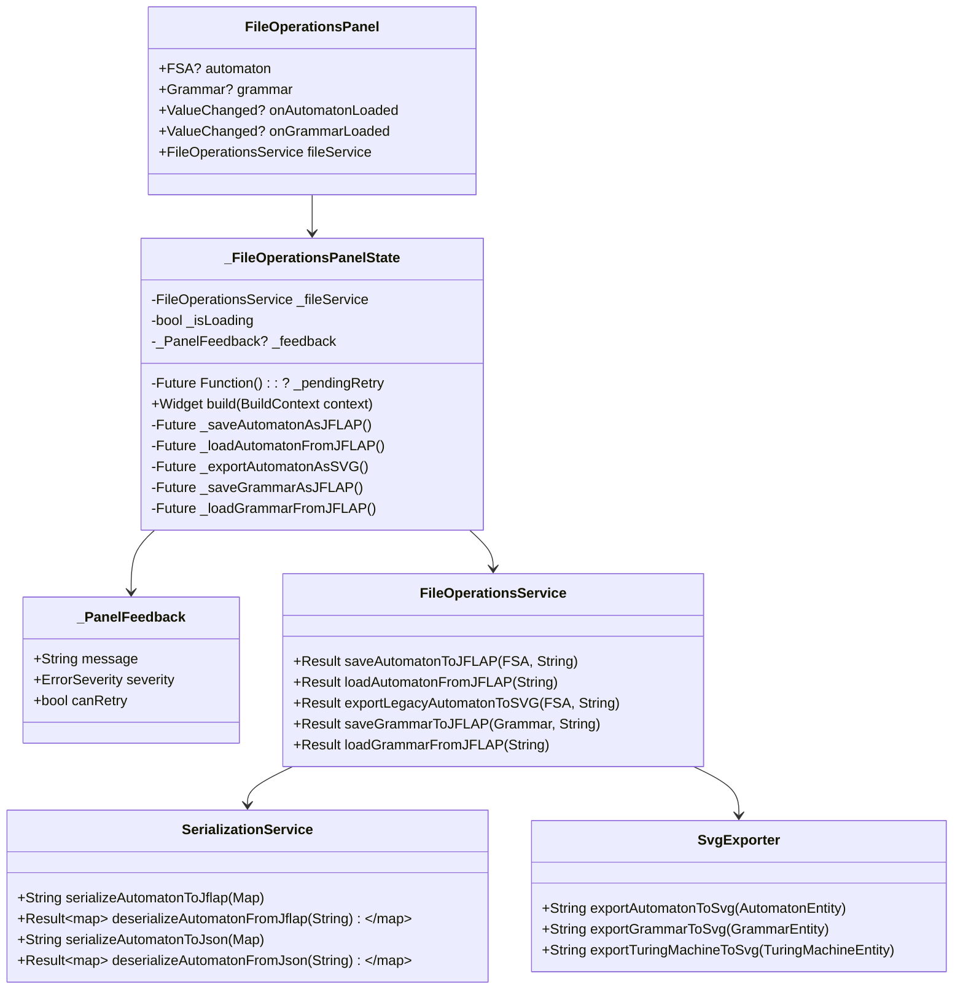
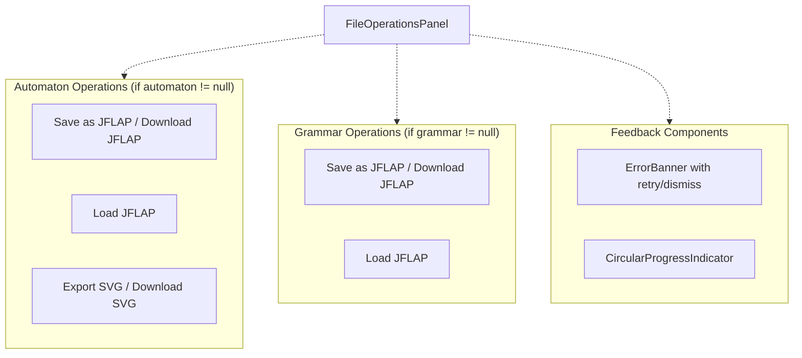
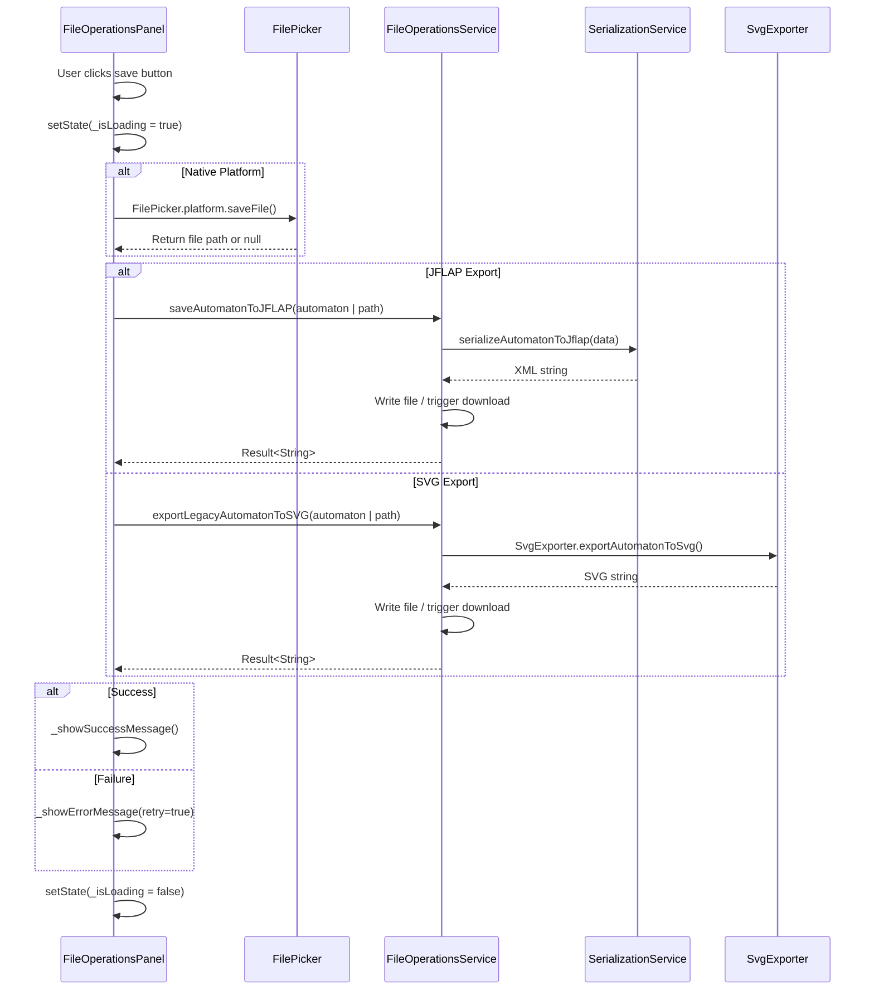
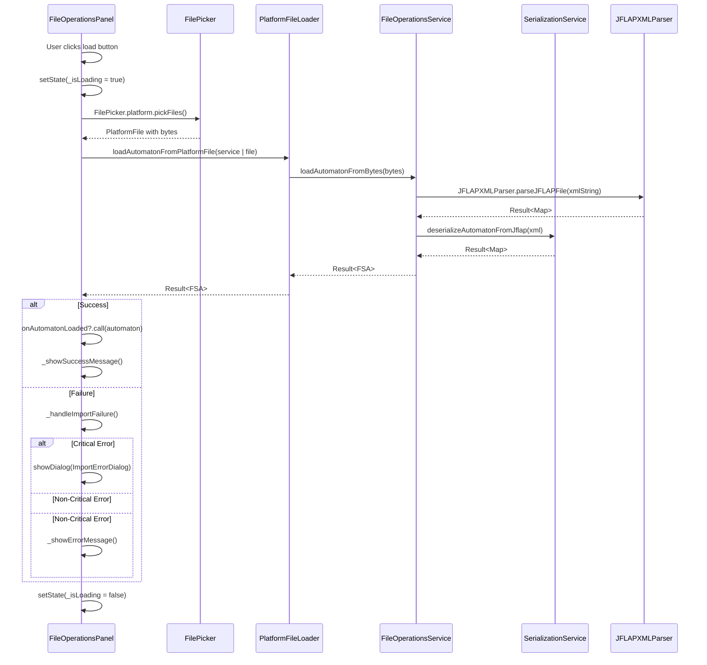
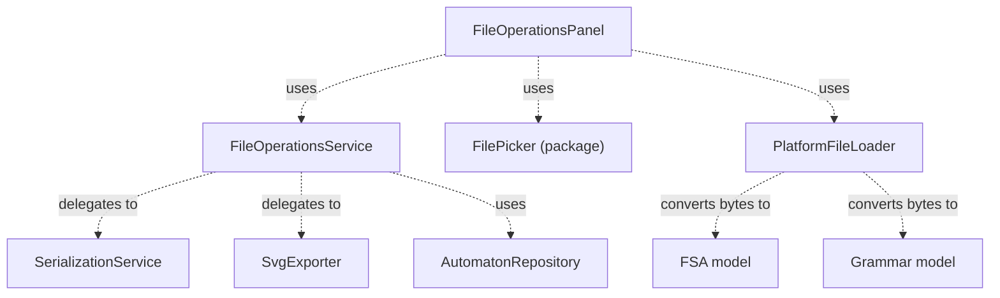

# File Operations Panel

> **Relevant source files**
> * [lib/core/entities/automaton_entity.dart](https://github.com/ThalesMMS/JFlutter/blob/32e808b4/lib/core/entities/automaton_entity.dart)
> * [lib/core/utils/epsilon_utils.dart](https://github.com/ThalesMMS/JFlutter/blob/32e808b4/lib/core/utils/epsilon_utils.dart)
> * [lib/data/repositories/automaton_repository_impl.dart](https://github.com/ThalesMMS/JFlutter/blob/32e808b4/lib/data/repositories/automaton_repository_impl.dart)
> * [lib/data/services/automaton_service.dart](https://github.com/ThalesMMS/JFlutter/blob/32e808b4/lib/data/services/automaton_service.dart)
> * [lib/data/services/serialization_service.dart](https://github.com/ThalesMMS/JFlutter/blob/32e808b4/lib/data/services/serialization_service.dart)
> * [lib/presentation/widgets/export/svg_exporter.dart](https://github.com/ThalesMMS/JFlutter/blob/32e808b4/lib/presentation/widgets/export/svg_exporter.dart)
> * [lib/presentation/widgets/file_operations_panel.dart](https://github.com/ThalesMMS/JFlutter/blob/32e808b4/lib/presentation/widgets/file_operations_panel.dart)
> * [test/core/services/simulation_highlight_service_test.dart](https://github.com/ThalesMMS/JFlutter/blob/32e808b4/test/core/services/simulation_highlight_service_test.dart)
> * [test/integration/io/examples_roundtrip_test.dart](https://github.com/ThalesMMS/JFlutter/blob/32e808b4/test/integration/io/examples_roundtrip_test.dart)
> * [test/integration/io/interoperability_roundtrip_test.dart](https://github.com/ThalesMMS/JFlutter/blob/32e808b4/test/integration/io/interoperability_roundtrip_test.dart)

## Purpose and Scope

The **File Operations Panel** (`FileOperationsPanel`) is the primary UI component for importing, exporting, and saving automata and grammars in multiple formats. This document covers the panel's architecture, supported file formats, platform-specific behaviors, and integration with the serialization service layer. For details on the underlying format conversion logic, see [Serialization Service](9b%20Serialization-Service.md). For JFLAP interoperability specifics, see [JFLAP Interoperability](9c%20JFLAP-Interoperability.md). For SVG export details, see [SVG Export](9d%20SVG-Export.md).

**Sources:** [lib/presentation/widgets/file_operations_panel.dart L1-L602](https://github.com/ThalesMMS/JFlutter/blob/32e808b4/lib/presentation/widgets/file_operations_panel.dart#L1-L602)

---

## Component Overview

`FileOperationsPanel` is a `StatefulWidget` located at [lib/presentation/widgets/file_operations_panel.dart L26-L44](https://github.com/ThalesMMS/JFlutter/blob/32e808b4/lib/presentation/widgets/file_operations_panel.dart#L26-L44)

 that orchestrates file operations through the following responsibilities:

| Responsibility | Implementation |
| --- | --- |
| **File Import** | Uses `FilePicker` to select files and delegates parsing to `FileOperationsService` |
| **File Export** | Coordinates with `FileOperationsService` to serialize and save/download files |
| **Format Support** | Handles JFLAP XML (.jff/.cfg), JSON, and SVG formats |
| **Platform Adaptation** | Differentiates web (download) vs native (save dialog) behaviors |
| **User Feedback** | Displays loading indicators, success messages, and error banners with retry options |
| **State Management** | Maintains internal state for operations, feedback, and retry logic |

The panel accepts optional `FSA` automaton and `Grammar` instances, displaying contextual buttons based on which data is available [lib/presentation/widgets/file_operations_panel.dart L27-L40](https://github.com/ThalesMMS/JFlutter/blob/32e808b4/lib/presentation/widgets/file_operations_panel.dart#L27-L40)

**Sources:** [lib/presentation/widgets/file_operations_panel.dart L26-L68](https://github.com/ThalesMMS/JFlutter/blob/32e808b4/lib/presentation/widgets/file_operations_panel.dart#L26-L68)

---

## Component Architecture

### Class Structure



**Sources:** [lib/presentation/widgets/file_operations_panel.dart L26-L602](https://github.com/ThalesMMS/JFlutter/blob/32e808b4/lib/presentation/widgets/file_operations_panel.dart#L26-L602)

 [lib/data/services/file_operations_service.dart](https://github.com/ThalesMMS/JFlutter/blob/32e808b4/lib/data/services/file_operations_service.dart)

 [lib/presentation/widgets/export/svg_exporter.dart L1-L880](https://github.com/ThalesMMS/JFlutter/blob/32e808b4/lib/presentation/widgets/export/svg_exporter.dart#L1-L880)

---

## File Format Support

The panel supports multiple file formats with distinct import/export capabilities:

### Automaton Formats

| Format | Extension | Import | Export | Use Case |
| --- | --- | --- | --- | --- |
| **JFLAP XML** | `.jff` | ✓ | ✓ | Interoperability with JFLAP desktop application |
| **SVG** | `.svg` | ✗ | ✓ | Visual export for documentation/presentations |
| **JSON** | `.json` | ✓ | ✓ | Native serialization format (internal use) |

### Grammar Formats

| Format | Extension | Import | Export | Use Case |
| --- | --- | --- | --- | --- |
| **JFLAP CFG** | `.cfg` | ✓ | ✓ | Context-Free Grammar JFLAP format |
| **SVG** | `.svg` | ✗ | ✓ | Visual grammar representation (converted to automaton) |

**Sources:** [lib/presentation/widgets/file_operations_panel.dart L96-L143](https://github.com/ThalesMMS/JFlutter/blob/32e808b4/lib/presentation/widgets/file_operations_panel.dart#L96-L143)

---

## User Interface Components

### Button Layout

The panel dynamically displays operation buttons based on the provided data:



Button labels adapt to platform context using `kIsWeb` checks. For example:

* Web: "Download JFLAP" [lib/presentation/widgets/file_operations_panel.dart L104](https://github.com/ThalesMMS/JFlutter/blob/32e808b4/lib/presentation/widgets/file_operations_panel.dart#L104-L104)
* Native: "Save as JFLAP" [lib/presentation/widgets/file_operations_panel.dart L104](https://github.com/ThalesMMS/JFlutter/blob/32e808b4/lib/presentation/widgets/file_operations_panel.dart#L104-L104)

**Sources:** [lib/presentation/widgets/file_operations_panel.dart L71-L158](https://github.com/ThalesMMS/JFlutter/blob/32e808b4/lib/presentation/widgets/file_operations_panel.dart#L71-L158)

 [lib/presentation/widgets/file_operations_panel.dart L169-L178](https://github.com/ThalesMMS/JFlutter/blob/32e808b4/lib/presentation/widgets/file_operations_panel.dart#L169-L178)

### Feedback System

The panel uses a `_PanelFeedback` internal class [lib/presentation/widgets/file_operations_panel.dart L46-L56](https://github.com/ThalesMMS/JFlutter/blob/32e808b4/lib/presentation/widgets/file_operations_panel.dart#L46-L56)

 to track:

* **Message**: User-facing description
* **Severity**: Info/warning/error level (from `ErrorSeverity` enum)
* **Retry capability**: Whether the operation can be retried

Feedback is displayed via `ErrorBanner` widget [lib/presentation/widgets/file_operations_panel.dart L78-L87](https://github.com/ThalesMMS/JFlutter/blob/32e808b4/lib/presentation/widgets/file_operations_panel.dart#L78-L87)

 which provides:

* Message display
* Optional retry button
* Dismiss functionality

**Sources:** [lib/presentation/widgets/file_operations_panel.dart L46-L87](https://github.com/ThalesMMS/JFlutter/blob/32e808b4/lib/presentation/widgets/file_operations_panel.dart#L46-L87)

---

## Operation Flow

### Save/Export Flow



**Key Implementation Points:**

1. **Loading State**: Set at operation start [lib/presentation/widgets/file_operations_panel.dart L182](https://github.com/ThalesMMS/JFlutter/blob/32e808b4/lib/presentation/widgets/file_operations_panel.dart#L182-L182)  cleared in finally block [lib/presentation/widgets/file_operations_panel.dart L231](https://github.com/ThalesMMS/JFlutter/blob/32e808b4/lib/presentation/widgets/file_operations_panel.dart#L231-L231)
2. **Platform Check**: `kIsWeb` determines download vs save file dialog [lib/presentation/widgets/file_operations_panel.dart L187-L206](https://github.com/ThalesMMS/JFlutter/blob/32e808b4/lib/presentation/widgets/file_operations_panel.dart#L187-L206)
3. **Result Handling**: Success/failure paths set appropriate feedback [lib/presentation/widgets/file_operations_panel.dart L213-L223](https://github.com/ThalesMMS/JFlutter/blob/32e808b4/lib/presentation/widgets/file_operations_panel.dart#L213-L223)
4. **Retry Logic**: Stores operation reference in `_pendingRetry` [lib/presentation/widgets/file_operations_panel.dart L578](https://github.com/ThalesMMS/JFlutter/blob/32e808b4/lib/presentation/widgets/file_operations_panel.dart#L578-L578)

**Sources:** [lib/presentation/widgets/file_operations_panel.dart L180-L233](https://github.com/ThalesMMS/JFlutter/blob/32e808b4/lib/presentation/widgets/file_operations_panel.dart#L180-L233)

 [lib/presentation/widgets/file_operations_panel.dart L277-L327](https://github.com/ThalesMMS/JFlutter/blob/32e808b4/lib/presentation/widgets/file_operations_panel.dart#L277-L327)

### Load/Import Flow



**Key Implementation Points:**

1. **File Picker Configuration**: Specifies allowed extensions [lib/presentation/widgets/file_operations_panel.dart L240-L241](https://github.com/ThalesMMS/JFlutter/blob/32e808b4/lib/presentation/widgets/file_operations_panel.dart#L240-L241)
2. **Platform File Loading**: Uses `loadAutomatonFromPlatformFile` helper [lib/presentation/widgets/file_operations_panel.dart L248-L251](https://github.com/ThalesMMS/JFlutter/blob/32e808b4/lib/presentation/widgets/file_operations_panel.dart#L248-L251)
3. **Error Classification**: `_isCriticalImportError()` determines error severity [lib/presentation/widgets/file_operations_panel.dart L543-L551](https://github.com/ThalesMMS/JFlutter/blob/32e808b4/lib/presentation/widgets/file_operations_panel.dart#L543-L551)
4. **Callback Invocation**: Successful loads trigger `onAutomatonLoaded` callback [lib/presentation/widgets/file_operations_panel.dart L254](https://github.com/ThalesMMS/JFlutter/blob/32e808b4/lib/presentation/widgets/file_operations_panel.dart#L254-L254)

**Sources:** [lib/presentation/widgets/file_operations_panel.dart L235-L275](https://github.com/ThalesMMS/JFlutter/blob/32e808b4/lib/presentation/widgets/file_operations_panel.dart#L235-L275)

 [lib/presentation/widgets/file_operations_panel.dart L427-L449](https://github.com/ThalesMMS/JFlutter/blob/32e808b4/lib/presentation/widgets/file_operations_panel.dart#L427-L449)

---

## Platform-Specific Behavior

### Web Platform

On web (`kIsWeb == true`):

* **Save operations** trigger browser downloads [lib/presentation/widgets/file_operations_panel.dart L187-L191](https://github.com/ThalesMMS/JFlutter/blob/32e808b4/lib/presentation/widgets/file_operations_panel.dart#L187-L191)
* **File picker** uses browser's file selection dialog
* **Success messages** indicate "Download started" [lib/presentation/widgets/file_operations_panel.dart L215-L216](https://github.com/ThalesMMS/JFlutter/blob/32e808b4/lib/presentation/widgets/file_operations_panel.dart#L215-L216)

Example save flow for web:

```
if (kIsWeb) {  saveResult = await _fileService.saveAutomatonToJFLAP(    widget.automaton!,    '${widget.automaton!.name}.jff',  );}
```

### Native Platform

On native platforms:

* **Save operations** use platform save dialog [lib/presentation/widgets/file_operations_panel.dart L193-L206](https://github.com/ThalesMMS/JFlutter/blob/32e808b4/lib/presentation/widgets/file_operations_panel.dart#L193-L206)
* **File picker** shows OS-native file selection
* **Success messages** indicate "saved successfully" [lib/presentation/widgets/file_operations_panel.dart L216-L217](https://github.com/ThalesMMS/JFlutter/blob/32e808b4/lib/presentation/widgets/file_operations_panel.dart#L216-L217)

Example save flow for native:

```
final result = await FilePicker.platform.saveFile(  dialogTitle: 'Save Automaton as JFLAP',  fileName: '${widget.automaton!.name}.jff',  type: FileType.custom,  allowedExtensions: ['jff'],);
```

**Sources:** [lib/presentation/widgets/file_operations_panel.dart L187-L207](https://github.com/ThalesMMS/JFlutter/blob/32e808b4/lib/presentation/widgets/file_operations_panel.dart#L187-L207)

 [lib/presentation/widgets/file_operations_panel.dart L282-L301](https://github.com/ThalesMMS/JFlutter/blob/32e808b4/lib/presentation/widgets/file_operations_panel.dart#L282-L301)

---

## Error Handling and Feedback

### Error Classification

The panel implements a two-tier error handling system:

#### Critical Import Errors

Detected by `_isCriticalImportError()` [lib/presentation/widgets/file_operations_panel.dart L543-L551](https://github.com/ThalesMMS/JFlutter/blob/32e808b4/lib/presentation/widgets/file_operations_panel.dart#L543-L551)

 critical errors include:

* XML parsing failures
* Malformed JFLAP structure
* Corrupted file data
* Invalid JSON sections

Critical errors trigger an `ImportErrorDialog` [lib/presentation/widgets/file_operations_panel.dart L470-L489](https://github.com/ThalesMMS/JFlutter/blob/32e808b4/lib/presentation/widgets/file_operations_panel.dart#L470-L489)

 with:

* Detailed technical information
* Friendly user-facing explanation
* Retry and cancel options

#### Non-Critical Errors

Non-critical errors are displayed inline via `ErrorBanner` with:

* Error message
* Optional retry button
* Dismiss action

**Sources:** [lib/presentation/widgets/file_operations_panel.dart L427-L491](https://github.com/ThalesMMS/JFlutter/blob/32e808b4/lib/presentation/widgets/file_operations_panel.dart#L427-L491)

 [lib/presentation/widgets/file_operations_panel.dart L543-L551](https://github.com/ThalesMMS/JFlutter/blob/32e808b4/lib/presentation/widgets/file_operations_panel.dart#L543-L551)

### Error Type Resolution

The `_resolveImportErrorType()` method [lib/presentation/widgets/file_operations_panel.dart L508-L526](https://github.com/ThalesMMS/JFlutter/blob/32e808b4/lib/presentation/widgets/file_operations_panel.dart#L508-L526)

 maps error messages to `ImportErrorType` enum values:

| Error Pattern | Error Type | Friendly Message |
| --- | --- | --- |
| "xml", "parse" | `malformedJFF` | "The selected JFLAP file could not be parsed..." |
| "json" | `invalidJSON` | "The import contains JSON sections that are invalid..." |
| "version" | `unsupportedVersion` | "This file targets a newer JFLAP schema version..." |
| "corrupt", "unreadable" | `corruptedData` | "The file appears to be corrupted or unreadable..." |
| Other | `invalidAutomaton` | "The automaton definition is inconsistent..." |

**Sources:** [lib/presentation/widgets/file_operations_panel.dart L508-L541](https://github.com/ThalesMMS/JFlutter/blob/32e808b4/lib/presentation/widgets/file_operations_panel.dart#L508-L541)

### Retry Mechanism

The retry system [lib/presentation/widgets/file_operations_panel.dart L581-L592](https://github.com/ThalesMMS/JFlutter/blob/32e808b4/lib/presentation/widgets/file_operations_panel.dart#L581-L592)

:

1. Stores failed operation in `_pendingRetry` field [lib/presentation/widgets/file_operations_panel.dart L62](https://github.com/ThalesMMS/JFlutter/blob/32e808b4/lib/presentation/widgets/file_operations_panel.dart#L62-L62)
2. Displays retry button when `canRetry == true` [lib/presentation/widgets/file_operations_panel.dart L82-L84](https://github.com/ThalesMMS/JFlutter/blob/32e808b4/lib/presentation/widgets/file_operations_panel.dart#L82-L84)
3. Clears feedback and re-executes operation on retry [lib/presentation/widgets/file_operations_panel.dart L587-L591](https://github.com/ThalesMMS/JFlutter/blob/32e808b4/lib/presentation/widgets/file_operations_panel.dart#L587-L591)

**Sources:** [lib/presentation/widgets/file_operations_panel.dart L581-L602](https://github.com/ThalesMMS/JFlutter/blob/32e808b4/lib/presentation/widgets/file_operations_panel.dart#L581-L602)

---

## Integration Points

### Service Dependencies



**Sources:** [lib/presentation/widgets/file_operations_panel.dart L20-L22](https://github.com/ThalesMMS/JFlutter/blob/32e808b4/lib/presentation/widgets/file_operations_panel.dart#L20-L22)

 [lib/data/services/file_operations_service.dart](https://github.com/ThalesMMS/JFlutter/blob/32e808b4/lib/data/services/file_operations_service.dart)

### Model Flow

The panel works with two primary domain models:

1. **FSA (Finite State Automaton)**: [lib/core/models/fsa.dart](https://github.com/ThalesMMS/JFlutter/blob/32e808b4/lib/core/models/fsa.dart) * Represents automata with states and transitions * Supports DFA, NFA, and NFA-λ types * Used for automaton operations
2. **Grammar**: [lib/core/models/grammar.dart](https://github.com/ThalesMMS/JFlutter/blob/32e808b4/lib/core/models/grammar.dart) * Represents context-free grammars * Includes productions, terminals, non-terminals * Used for grammar operations

Conversion flow:

```
FSA/Grammar → AutomatonEntity → Map<String,dynamic> → XML/JSON/SVG
```

**Sources:** [lib/presentation/widgets/file_operations_panel.dart L17-L18](https://github.com/ThalesMMS/JFlutter/blob/32e808b4/lib/presentation/widgets/file_operations_panel.dart#L17-L18)

 [lib/data/repositories/automaton_repository_impl.dart L132-L173](https://github.com/ThalesMMS/JFlutter/blob/32e808b4/lib/data/repositories/automaton_repository_impl.dart#L132-L173)

### Callback Integration

The panel provides callbacks for successful loads:

* `onAutomatonLoaded`: Invoked with loaded `FSA` [lib/presentation/widgets/file_operations_panel.dart L254](https://github.com/ThalesMMS/JFlutter/blob/32e808b4/lib/presentation/widgets/file_operations_panel.dart#L254-L254)
* `onGrammarLoaded`: Invoked with loaded `Grammar` [lib/presentation/widgets/file_operations_panel.dart L404](https://github.com/ThalesMMS/JFlutter/blob/32e808b4/lib/presentation/widgets/file_operations_panel.dart#L404-L404)

These callbacks typically update parent widget state to reflect the newly loaded data.

**Sources:** [lib/presentation/widgets/file_operations_panel.dart L29-L30](https://github.com/ThalesMMS/JFlutter/blob/32e808b4/lib/presentation/widgets/file_operations_panel.dart#L29-L30)

 [lib/presentation/widgets/file_operations_panel.dart L254](https://github.com/ThalesMMS/JFlutter/blob/32e808b4/lib/presentation/widgets/file_operations_panel.dart#L254-L254)

 [lib/presentation/widgets/file_operations_panel.dart L404](https://github.com/ThalesMMS/JFlutter/blob/32e808b4/lib/presentation/widgets/file_operations_panel.dart#L404-L404)

---

## Usage Example

### Basic Integration

```
FileOperationsPanel(  automaton: currentAutomaton,  grammar: currentGrammar,  onAutomatonLoaded: (loadedAutomaton) {    setState(() {      currentAutomaton = loadedAutomaton;    });  },  onGrammarLoaded: (loadedGrammar) {    setState(() {      currentGrammar = loadedGrammar;    });  },  fileService: FileOperationsService(),)
```

### Automaton-Only Usage

```
FileOperationsPanel(  automaton: myAutomaton,  onAutomatonLoaded: (automaton) {    // Handle loaded automaton    updateCanvasWithAutomaton(automaton);  },)
```

The panel will only display automaton-related buttons when `grammar` is null.

**Sources:** [lib/presentation/widgets/file_operations_panel.dart L33-L44](https://github.com/ThalesMMS/JFlutter/blob/32e808b4/lib/presentation/widgets/file_operations_panel.dart#L33-L44)

 [lib/presentation/widgets/file_operations_panel.dart L96-L121](https://github.com/ThalesMMS/JFlutter/blob/32e808b4/lib/presentation/widgets/file_operations_panel.dart#L96-L121)

---

## Testing Coverage

The component is tested through integration tests that verify:

1. **Round-trip serialization**: Data preservation through format conversions [test/integration/io/interoperability_roundtrip_test.dart L37-L67](https://github.com/ThalesMMS/JFlutter/blob/32e808b4/test/integration/io/interoperability_roundtrip_test.dart#L37-L67)
2. **Format interoperability**: JFLAP ↔ JSON conversions [test/integration/io/interoperability_roundtrip_test.dart L532-L608](https://github.com/ThalesMMS/JFlutter/blob/32e808b4/test/integration/io/interoperability_roundtrip_test.dart#L532-L608)
3. **SVG export**: Valid structure generation [test/integration/io/interoperability_roundtrip_test.dart L373-L513](https://github.com/ThalesMMS/JFlutter/blob/32e808b4/test/integration/io/interoperability_roundtrip_test.dart#L373-L513)
4. **Error handling**: Malformed input handling [test/integration/io/interoperability_roundtrip_test.dart L192-L202](https://github.com/ThalesMMS/JFlutter/blob/32e808b4/test/integration/io/interoperability_roundtrip_test.dart#L192-L202)
5. **Epsilon normalization**: Symbol consistency across formats [test/integration/io/interoperability_roundtrip_test.dart L138-L190](https://github.com/ThalesMMS/JFlutter/blob/32e808b4/test/integration/io/interoperability_roundtrip_test.dart#L138-L190)

**Sources:** [test/integration/io/interoperability_roundtrip_test.dart L1-L1130](https://github.com/ThalesMMS/JFlutter/blob/32e808b4/test/integration/io/interoperability_roundtrip_test.dart#L1-L1130)

 [test/integration/io/examples_roundtrip_test.dart L1-L739](https://github.com/ThalesMMS/JFlutter/blob/32e808b4/test/integration/io/examples_roundtrip_test.dart#L1-L739)


### On this page

* [File Operations Panel](#9.1-file-operations-panel)
* [Purpose and Scope](#9.1-purpose-and-scope)
* [Component Overview](#9.1-component-overview)
* [Component Architecture](#9.1-component-architecture)
* [Class Structure](#9.1-class-structure)
* [File Format Support](#9.1-file-format-support)
* [Automaton Formats](#9.1-automaton-formats)
* [Grammar Formats](#9.1-grammar-formats)
* [User Interface Components](#9.1-user-interface-components)
* [Button Layout](#9.1-button-layout)
* [Feedback System](#9.1-feedback-system)
* [Operation Flow](#9.1-operation-flow)
* [Save/Export Flow](#9.1-saveexport-flow)
* [Load/Import Flow](#9.1-loadimport-flow)
* [Platform-Specific Behavior](#9.1-platform-specific-behavior)
* [Web Platform](#9.1-web-platform)
* [Native Platform](#9.1-native-platform)
* [Error Handling and Feedback](#9.1-error-handling-and-feedback)
* [Error Classification](#9.1-error-classification)
* [Error Type Resolution](#9.1-error-type-resolution)
* [Retry Mechanism](#9.1-retry-mechanism)
* [Integration Points](#9.1-integration-points)
* [Service Dependencies](#9.1-service-dependencies)
* [Model Flow](#9.1-model-flow)
* [Callback Integration](#9.1-callback-integration)
* [Usage Example](#9.1-usage-example)
* [Basic Integration](#9.1-basic-integration)
* [Automaton-Only Usage](#9.1-automaton-only-usage)
* [Testing Coverage](#9.1-testing-coverage)

Ask Devin about JFlutter