# Serialization Service

> **Relevant source files**
> * [lib/core/entities/automaton_entity.dart](https://github.com/ThalesMMS/JFlutter/blob/32e808b4/lib/core/entities/automaton_entity.dart)
> * [lib/core/utils/epsilon_utils.dart](https://github.com/ThalesMMS/JFlutter/blob/32e808b4/lib/core/utils/epsilon_utils.dart)
> * [lib/data/repositories/automaton_repository_impl.dart](https://github.com/ThalesMMS/JFlutter/blob/32e808b4/lib/data/repositories/automaton_repository_impl.dart)
> * [lib/data/services/automaton_service.dart](https://github.com/ThalesMMS/JFlutter/blob/32e808b4/lib/data/services/automaton_service.dart)
> * [lib/data/services/serialization_service.dart](https://github.com/ThalesMMS/JFlutter/blob/32e808b4/lib/data/services/serialization_service.dart)
> * [lib/presentation/widgets/export/svg_exporter.dart](https://github.com/ThalesMMS/JFlutter/blob/32e808b4/lib/presentation/widgets/export/svg_exporter.dart)
> * [lib/presentation/widgets/file_operations_panel.dart](https://github.com/ThalesMMS/JFlutter/blob/32e808b4/lib/presentation/widgets/file_operations_panel.dart)
> * [test/core/services/simulation_highlight_service_test.dart](https://github.com/ThalesMMS/JFlutter/blob/32e808b4/test/core/services/simulation_highlight_service_test.dart)
> * [test/integration/io/examples_roundtrip_test.dart](https://github.com/ThalesMMS/JFlutter/blob/32e808b4/test/integration/io/examples_roundtrip_test.dart)
> * [test/integration/io/interoperability_roundtrip_test.dart](https://github.com/ThalesMMS/JFlutter/blob/32e808b4/test/integration/io/interoperability_roundtrip_test.dart)

## Purpose and Scope

The `SerializationService` is a central data conversion hub responsible for bidirectional transformations between JFlutter's internal automaton representations and external file formats. This service enables interoperability with JFLAP XML files (`.jff`, `.cfg`) and native JSON storage, ensuring data integrity through epsilon symbol normalization and structural validation.

For user-facing file operations UI, see [File Operations Panel](9a%20File-Operations-Panel.md). For JFLAP-specific parsing details and epsilon normalization, see [JFLAP Interoperability](9c%20JFLAP-Interoperability.md). For visual export capabilities, see [SVG Export](9d%20SVG-Export.md).

---

## Service Architecture

The `SerializationService` operates as a stateless converter between domain data structures and serialized formats. It bridges the gap between JFlutter's entity-based architecture and external file representations.

**Core Service: SerializationService Architecture**

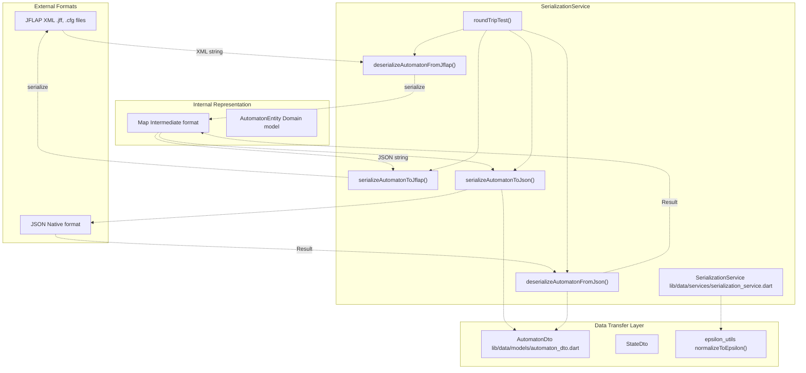

Sources: [lib/data/services/serialization_service.dart L1-L308](https://github.com/ThalesMMS/JFlutter/blob/32e808b4/lib/data/services/serialization_service.dart#L1-L308)

---

## Service Interface

The `SerializationService` class exposes four primary methods for format conversion, plus utilities for round-trip testing.

### Primary Methods

| Method | Input | Output | Purpose |
| --- | --- | --- | --- |
| `serializeAutomatonToJflap()` | `Map<String, dynamic>` | `String` | Converts automaton data to JFLAP XML |
| `deserializeAutomatonFromJflap()` | `String` | `Result<Map<String, dynamic>>` | Parses JFLAP XML to automaton data |
| `serializeAutomatonToJson()` | `Map<String, dynamic>` | `String` | Converts automaton data to JSON |
| `deserializeAutomatonFromJson()` | `String` | `Result<Map<String, dynamic>>` | Parses JSON to automaton data |
| `roundTripTest()` | `Map<String, dynamic>`, `SerializationFormat` | `Result<Map<String, dynamic>>` | Tests serialization round-trip integrity |
| `validateRoundTrip()` | `Map<String, dynamic>`, `Map<String, dynamic>` | `bool` | Validates structural preservation |

Sources: [lib/data/services/serialization_service.dart L16-L297](https://github.com/ThalesMMS/JFlutter/blob/32e808b4/lib/data/services/serialization_service.dart#L16-L297)

---

## JFLAP XML Format Handling

### Serialization to JFLAP XML

The `serializeAutomatonToJflap()` method constructs JFLAP-compatible XML using the `xml` package's `XmlBuilder`.

**JFLAP Serialization Process**

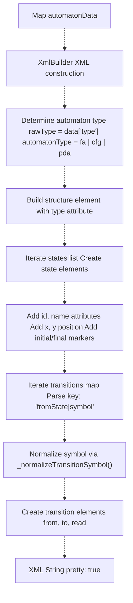

Key implementation details:

* **Type Mapping**: DFA and NFA both map to `type="fa"` in JFLAP format [lib/data/services/serialization_service.dart L22-L24](https://github.com/ThalesMMS/JFlutter/blob/32e808b4/lib/data/services/serialization_service.dart#L22-L24)
* **Empty Automaton Handling**: Forces explicit `<automaton>` open/close tags instead of self-closing [lib/data/services/serialization_service.dart L34-L36](https://github.com/ThalesMMS/JFlutter/blob/32e808b4/lib/data/services/serialization_service.dart#L34-L36)
* **Transition Key Parsing**: Splits `key` on `|` separator to extract state ID and symbol [lib/data/services/serialization_service.dart L72-L78](https://github.com/ThalesMMS/JFlutter/blob/32e808b4/lib/data/services/serialization_service.dart#L72-L78)
* **Epsilon Normalization**: All transition symbols pass through `_normalizeTransitionSymbol()` which calls `normalizeToEpsilon()` [lib/data/services/serialization_service.dart L78-L201](https://github.com/ThalesMMS/JFlutter/blob/32e808b4/lib/data/services/serialization_service.dart#L78-L201)

Sources: [lib/data/services/serialization_service.dart L18-L103](https://github.com/ThalesMMS/JFlutter/blob/32e808b4/lib/data/services/serialization_service.dart#L18-L103)

### Deserialization from JFLAP XML

The `deserializeAutomatonFromJflap()` method parses JFLAP XML using `XmlDocument.parse()` and extracts automaton components.

**JFLAP Deserialization Process**

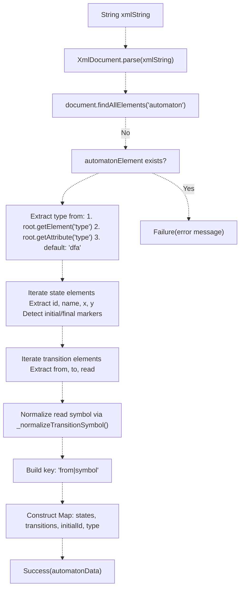

Key implementation details:

* **Flexible ID Extraction**: Falls back to `name` attribute if `id` is missing [lib/data/services/serialization_service.dart L132-L136](https://github.com/ThalesMMS/JFlutter/blob/32e808b4/lib/data/services/serialization_service.dart#L132-L136)
* **Position Parsing**: Checks both attributes and nested elements for `x` and `y` coordinates [lib/data/services/serialization_service.dart L140-L145](https://github.com/ThalesMMS/JFlutter/blob/32e808b4/lib/data/services/serialization_service.dart#L140-L145)
* **Initial State Detection**: Identifies initial state by presence of `<initial/>` marker, sets `initialId` field [lib/data/services/serialization_service.dart L146-L161](https://github.com/ThalesMMS/JFlutter/blob/32e808b4/lib/data/services/serialization_service.dart#L146-L161)
* **Transition Key Construction**: Combines `from` state ID and normalized symbol into `'from|symbol'` format [lib/data/services/serialization_service.dart L180](https://github.com/ThalesMMS/JFlutter/blob/32e808b4/lib/data/services/serialization_service.dart#L180-L180)

Sources: [lib/data/services/serialization_service.dart L106-L197](https://github.com/ThalesMMS/JFlutter/blob/32e808b4/lib/data/services/serialization_service.dart#L106-L197)

---

## JSON Format Handling

### Serialization to JSON

The `serializeAutomatonToJson()` method uses `AutomatonDto` as an intermediary data transfer object, leveraging Dart's `jsonEncode()` for serialization.

**JSON Serialization Pipeline**

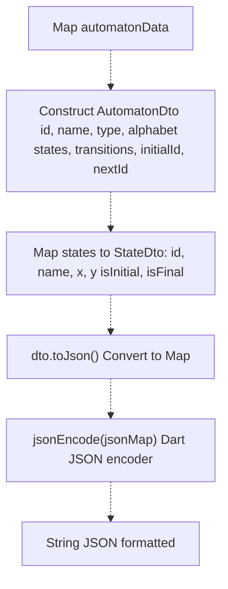

Key implementation details:

* **Default Values**: Provides fallback values for missing fields (e.g., ID generation via timestamp) [lib/data/services/serialization_service.dart L206-L209](https://github.com/ThalesMMS/JFlutter/blob/32e808b4/lib/data/services/serialization_service.dart#L206-L209)
* **List Conversion**: Explicitly converts alphabet to `List<String>` [lib/data/services/serialization_service.dart L211-L213](https://github.com/ThalesMMS/JFlutter/blob/32e808b4/lib/data/services/serialization_service.dart#L211-L213)
* **State Mapping**: Each state is transformed into a `StateDto` with position and status flags [lib/data/services/serialization_service.dart L214-L224](https://github.com/ThalesMMS/JFlutter/blob/32e808b4/lib/data/services/serialization_service.dart#L214-L224)
* **Transition Copying**: Uses `Map.from()` to copy transitions map [lib/data/services/serialization_service.dart L225-L227](https://github.com/ThalesMMS/JFlutter/blob/32e808b4/lib/data/services/serialization_service.dart#L225-L227)

Sources: [lib/data/services/serialization_service.dart L204-L233](https://github.com/ThalesMMS/JFlutter/blob/32e808b4/lib/data/services/serialization_service.dart#L204-L233)

### Deserialization from JSON

The `deserializeAutomatonFromJson()` method reverses the process, parsing JSON and reconstructing the data map via `AutomatonDto.fromJson()`.

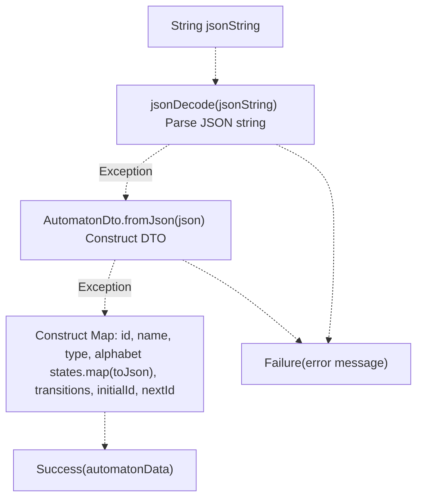

Key implementation details:

* **Type Casting**: Ensures decoded JSON is `Map<String, dynamic>` [lib/data/services/serialization_service.dart L238-L239](https://github.com/ThalesMMS/JFlutter/blob/32e808b4/lib/data/services/serialization_service.dart#L238-L239)
* **DTO Construction**: Delegates to `AutomatonDto.fromJson()` constructor [lib/data/services/serialization_service.dart L239](https://github.com/ThalesMMS/JFlutter/blob/32e808b4/lib/data/services/serialization_service.dart#L239-L239)
* **State Serialization**: Converts each `StateDto` back to JSON map via `toJson()` [lib/data/services/serialization_service.dart L246](https://github.com/ThalesMMS/JFlutter/blob/32e808b4/lib/data/services/serialization_service.dart#L246-L246)
* **Error Handling**: Wraps entire operation in try-catch, returns `Failure` with descriptive message [lib/data/services/serialization_service.dart L237-L255](https://github.com/ThalesMMS/JFlutter/blob/32e808b4/lib/data/services/serialization_service.dart#L237-L255)

Sources: [lib/data/services/serialization_service.dart L236-L256](https://github.com/ThalesMMS/JFlutter/blob/32e808b4/lib/data/services/serialization_service.dart#L236-L256)

---

## Epsilon Symbol Normalization

All serialization and deserialization operations normalize epsilon (empty string) symbols to a canonical representation via `epsilon_utils.dart`.

### Normalization Strategy

The `_normalizeTransitionSymbol()` method ensures consistent epsilon representation across formats:

```
String _normalizeTransitionSymbol(String? symbol) {  return normalizeToEpsilon(symbol);}
```

**Epsilon Normalization Flow**

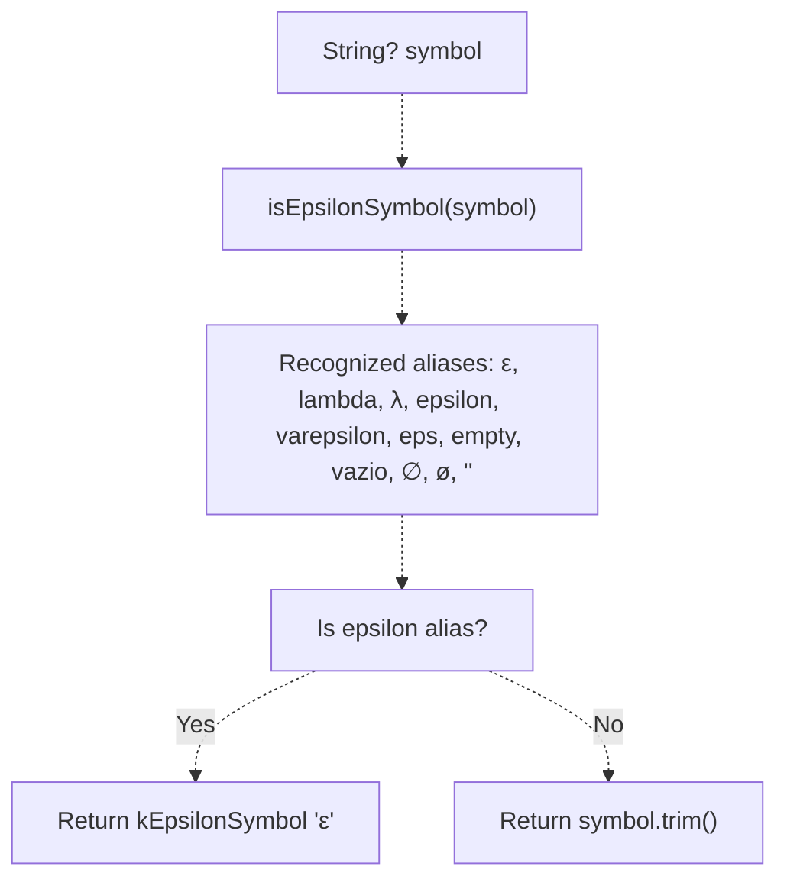

### Epsilon Handling in Context

| Context | Before Normalization | After Normalization | Line Reference |
| --- | --- | --- | --- |
| JFLAP Serialization | `'lambda'`, `'vazio'`, `''` | `'ε'` | [lib/data/services/serialization_service.dart L78](https://github.com/ThalesMMS/JFlutter/blob/32e808b4/lib/data/services/serialization_service.dart#L78-L78) |
| JFLAP Deserialization | `'<read>λ</read>'` | `'ε'` | [lib/data/services/serialization_service.dart L179](https://github.com/ThalesMMS/JFlutter/blob/32e808b4/lib/data/services/serialization_service.dart#L179-L179) |
| JFLAP XML Output | any alias | `'<read>ε</read>'` | [lib/data/services/serialization_service.dart L92](https://github.com/ThalesMMS/JFlutter/blob/32e808b4/lib/data/services/serialization_service.dart#L92-L92) |
| Transition Key Construction | `'q0\|lambda'` | `'q0\|ε'` | [lib/data/services/serialization_service.dart L180](https://github.com/ThalesMMS/JFlutter/blob/32e808b4/lib/data/services/serialization_service.dart#L180-L180) |

This ensures that regardless of input format, epsilon transitions are always represented as `ε` in JFlutter's internal data structures.

Sources: [lib/data/services/serialization_service.dart L199-L201](https://github.com/ThalesMMS/JFlutter/blob/32e808b4/lib/data/services/serialization_service.dart#L199-L201)

 [lib/core/utils/epsilon_utils.dart L10-L44](https://github.com/ThalesMMS/JFlutter/blob/32e808b4/lib/core/utils/epsilon_utils.dart#L10-L44)

---

## Data Transfer Objects

The `AutomatonDto` and `StateDto` classes serve as structured intermediaries for JSON serialization, providing type-safe conversions.

**AutomatonDto Structure**

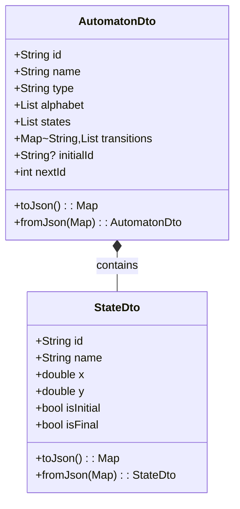

### AutomatonDto Fields

The `AutomatonDto` class mirrors the structure of `AutomatonEntity` but uses JSON-serializable types:

* `id`: Unique identifier, generated via timestamp if missing
* `name`: Display name for the automaton
* `type`: Automaton type string (`'dfa'`, `'nfa'`, `'nfa-lambda'`)
* `alphabet`: List of input symbols (excluding epsilon)
* `states`: List of `StateDto` objects representing states
* `transitions`: Map with keys formatted as `'stateId|symbol'`
* `initialId`: ID of the initial state (nullable)
* `nextId`: Counter for generating new state IDs

### StateDto Fields

The `StateDto` class represents individual automaton states:

* `id`: Unique state identifier
* `name`: Display label for the state
* `x`, `y`: Canvas position coordinates
* `isInitial`: Whether this is the initial state
* `isFinal`: Whether this is an accepting/final state

Sources: [lib/data/models/automaton_dto.dart](https://github.com/ThalesMMS/JFlutter/blob/32e808b4/lib/data/models/automaton_dto.dart)

 (referenced in [lib/data/services/serialization_service.dart L13](https://github.com/ThalesMMS/JFlutter/blob/32e808b4/lib/data/services/serialization_service.dart#L13-L13)

)

---

## Usage Patterns

The `SerializationService` is utilized throughout the application for file I/O operations and data persistence.

### Integration with FileOperationsPanel

The `FileOperationsPanel` widget orchestrates user-facing file operations, delegating serialization to `SerializationService` via `FileOperationsService`:

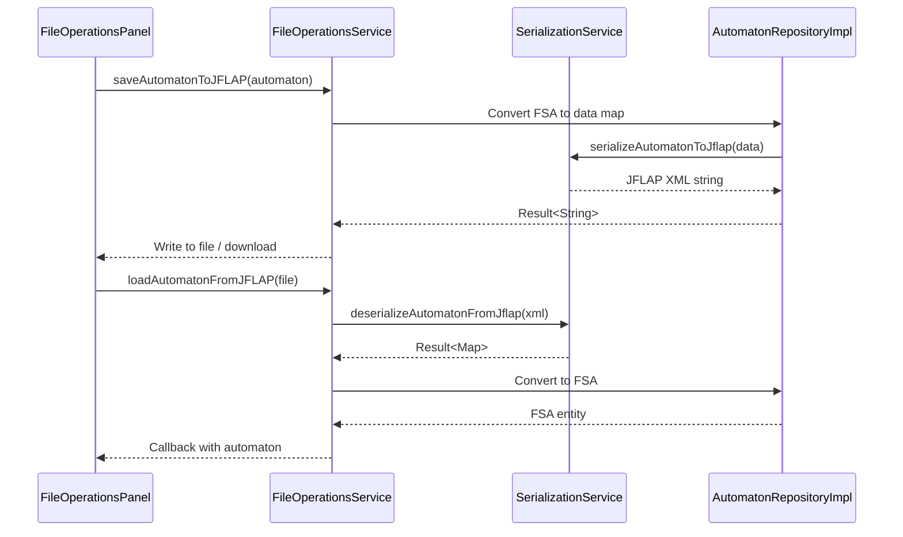

Sources: [lib/presentation/widgets/file_operations_panel.dart L180-L233](https://github.com/ThalesMMS/JFlutter/blob/32e808b4/lib/presentation/widgets/file_operations_panel.dart#L180-L233)

 [lib/data/repositories/automaton_repository_impl.dart L88-L101](https://github.com/ThalesMMS/JFlutter/blob/32e808b4/lib/data/repositories/automaton_repository_impl.dart#L88-L101)

### Integration with AutomatonRepositoryImpl

The `AutomatonRepositoryImpl` converts between domain entities (`AutomatonEntity`, `FSA`) and the data maps used by `SerializationService`:

**Repository Conversion Flow**

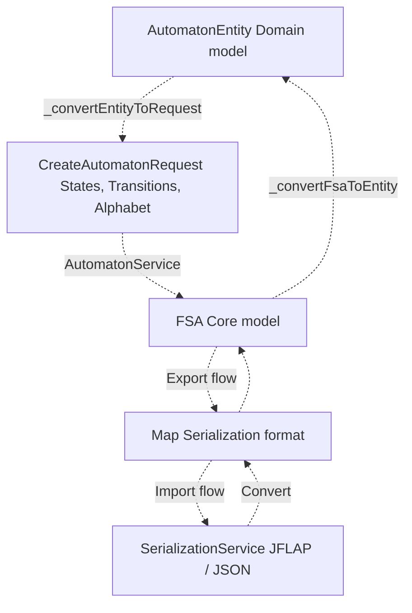

Key conversion methods in `AutomatonRepositoryImpl`:

* `_convertEntityToRequest()`: Converts `AutomatonEntity` to `CreateAutomatonRequest` [lib/data/repositories/automaton_repository_impl.dart L132-L173](https://github.com/ThalesMMS/JFlutter/blob/32e808b4/lib/data/repositories/automaton_repository_impl.dart#L132-L173)
* `_convertFsaToEntity()`: Converts `FSA` to `AutomatonEntity` [lib/data/repositories/automaton_repository_impl.dart L175-L224](https://github.com/ThalesMMS/JFlutter/blob/32e808b4/lib/data/repositories/automaton_repository_impl.dart#L175-L224)
* `_convertEntityToFsa()`: Converts `AutomatonEntity` to `FSA` [lib/data/repositories/automaton_repository_impl.dart L226-L306](https://github.com/ThalesMMS/JFlutter/blob/32e808b4/lib/data/repositories/automaton_repository_impl.dart#L226-L306)

Sources: [lib/data/repositories/automaton_repository_impl.dart L1-L330](https://github.com/ThalesMMS/JFlutter/blob/32e808b4/lib/data/repositories/automaton_repository_impl.dart#L1-L330)

---

## Round-Trip Testing

The service provides built-in round-trip testing capabilities to validate serialization integrity.

### Round-Trip Test Method

The `roundTripTest()` method serializes and then deserializes data, ensuring structural preservation:

```
Result<Map<String, dynamic>> roundTripTest(  Map<String, dynamic> automatonData,  SerializationFormat format,)
```

**Round-Trip Test Flow**

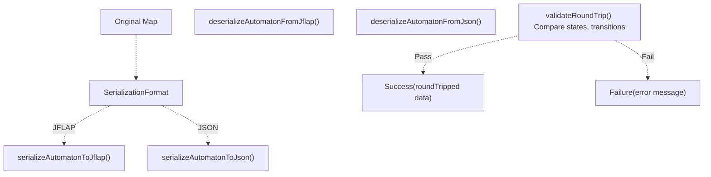

### Validation Logic

The `validateRoundTrip()` method performs basic structural comparison:

```
bool validateRoundTrip(  Map<String, dynamic> original,  Map<String, dynamic> roundTripped,) {  return original['states']?.length == roundTripped['states']?.length &&      original['transitions']?.length == roundTripped['transitions']?.length;}
```

This validates that:

* The number of states is preserved
* The number of transition keys is preserved

**Note**: The implementation comment indicates this is basic validation; deep equality comparison is not performed [lib/data/services/serialization_service.dart L293](https://github.com/ThalesMMS/JFlutter/blob/32e808b4/lib/data/services/serialization_service.dart#L293-L293)

Sources: [lib/data/services/serialization_service.dart L258-L296](https://github.com/ThalesMMS/JFlutter/blob/32e808b4/lib/data/services/serialization_service.dart#L258-L296)

---

## Integration Test Coverage

The `SerializationService` has extensive integration test coverage validating round-trip integrity across formats and edge cases.

### Test Categories

| Test Group | Focus | Key Tests |
| --- | --- | --- |
| JFF Round-Trip | JFLAP XML consistency | DFA, complex automaton, epsilon NFA |
| JSON Round-Trip | JSON structure preservation | Automaton properties, state info, transitions |
| Cross-Format | Format conversion | JFF→JSON, JSON→JFF, multi-format chains |
| Epsilon Normalization | Symbol consistency | Lambda aliases, normalization in JFLAP |
| Edge Cases | Robustness | Empty automaton, malformed data, validation |

### Example Round-Trip Test Pattern

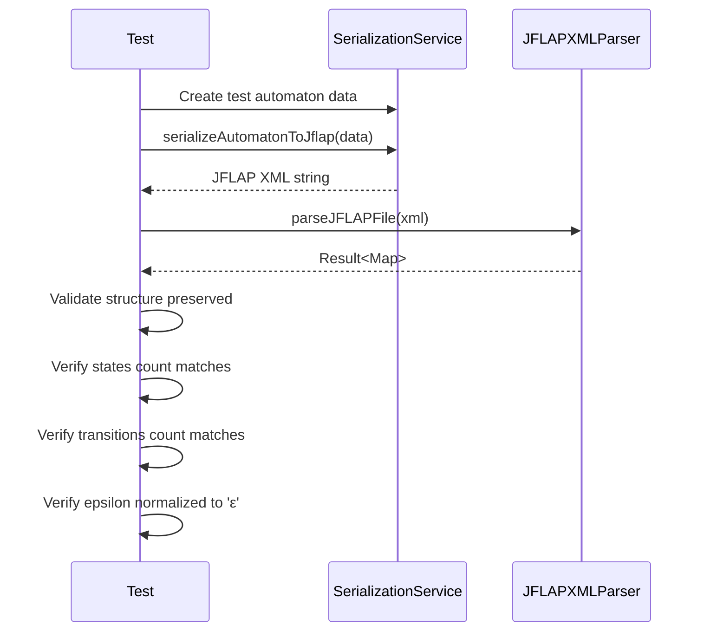

Sources: [test/integration/io/interoperability_roundtrip_test.dart L36-L248](https://github.com/ThalesMMS/JFlutter/blob/32e808b4/test/integration/io/interoperability_roundtrip_test.dart#L36-L248)

 [test/integration/io/examples_roundtrip_test.dart L283-L494](https://github.com/ThalesMMS/JFlutter/blob/32e808b4/test/integration/io/examples_roundtrip_test.dart#L283-L494)

---

## Serialization Format Enumeration

The service defines a `SerializationFormat` enum to support format-specific operations:

```
enum SerializationFormat {  jflap('JFLAP XML'),  json('JSON');  const SerializationFormat(this.displayName);  final String displayName;}
```

This enum is used by:

* `roundTripTest()` to select the format for testing
* Test harnesses to parameterize format-specific test cases
* Future extensibility for additional formats (e.g., GraphML)

Sources: [lib/data/services/serialization_service.dart L300-L307](https://github.com/ThalesMMS/JFlutter/blob/32e808b4/lib/data/services/serialization_service.dart#L300-L307)

---

## Error Handling

All deserialization methods return `Result<T>` types to encapsulate success/failure states:

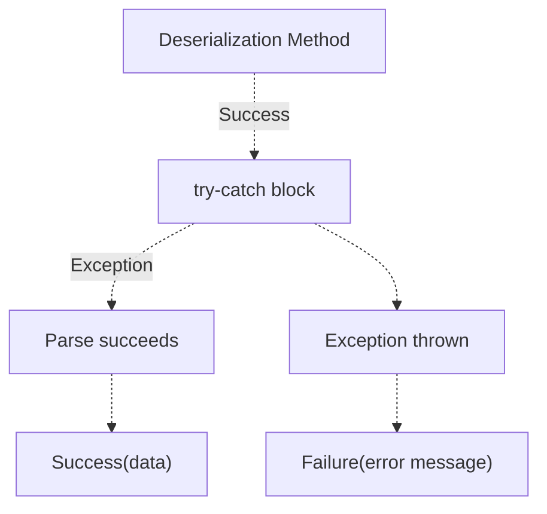

Common error scenarios:

* **Missing `<automaton>` element**: JFLAP deserialization fails with descriptive error [lib/data/services/serialization_service.dart L115-L118](https://github.com/ThalesMMS/JFlutter/blob/32e808b4/lib/data/services/serialization_service.dart#L115-L118)
* **Malformed XML**: `XmlDocument.parse()` throws exception, caught and wrapped [lib/data/services/serialization_service.dart L194-L196](https://github.com/ThalesMMS/JFlutter/blob/32e808b4/lib/data/services/serialization_service.dart#L194-L196)
* **Invalid JSON**: `jsonDecode()` throws exception, caught and wrapped [lib/data/services/serialization_service.dart L253-L255](https://github.com/ThalesMMS/JFlutter/blob/32e808b4/lib/data/services/serialization_service.dart#L253-L255)
* **Type mismatch**: DTO construction fails if JSON structure is invalid [lib/data/services/serialization_service.dart L239](https://github.com/ThalesMMS/JFlutter/blob/32e808b4/lib/data/services/serialization_service.dart#L239-L239)

Sources: [lib/data/services/serialization_service.dart L106-L255](https://github.com/ThalesMMS/JFlutter/blob/32e808b4/lib/data/services/serialization_service.dart#L106-L255)

 [lib/core/result.dart](https://github.com/ThalesMMS/JFlutter/blob/32e808b4/lib/core/result.dart)

 (referenced)


### On this page

* [Serialization Service](#9.2-serialization-service)
* [Purpose and Scope](#9.2-purpose-and-scope)
* [Service Architecture](#9.2-service-architecture)
* [Service Interface](#9.2-service-interface)
* [Primary Methods](#9.2-primary-methods)
* [JFLAP XML Format Handling](#9.2-jflap-xml-format-handling)
* [Serialization to JFLAP XML](#9.2-serialization-to-jflap-xml)
* [Deserialization from JFLAP XML](#9.2-deserialization-from-jflap-xml)
* [JSON Format Handling](#9.2-json-format-handling)
* [Serialization to JSON](#9.2-serialization-to-json)
* [Deserialization from JSON](#9.2-deserialization-from-json)
* [Epsilon Symbol Normalization](#9.2-epsilon-symbol-normalization)
* [Normalization Strategy](#9.2-normalization-strategy)
* [Epsilon Handling in Context](#9.2-epsilon-handling-in-context)
* [Data Transfer Objects](#9.2-data-transfer-objects)
* [AutomatonDto Fields](#9.2-automatondto-fields)
* [StateDto Fields](#9.2-statedto-fields)
* [Usage Patterns](#9.2-usage-patterns)
* [Integration with FileOperationsPanel](#9.2-integration-with-fileoperationspanel)
* [Integration with AutomatonRepositoryImpl](#9.2-integration-with-automatonrepositoryimpl)
* [Round-Trip Testing](#9.2-round-trip-testing)
* [Round-Trip Test Method](#9.2-round-trip-test-method)
* [Validation Logic](#9.2-validation-logic)
* [Integration Test Coverage](#9.2-integration-test-coverage)
* [Test Categories](#9.2-test-categories)
* [Example Round-Trip Test Pattern](#9.2-example-round-trip-test-pattern)
* [Serialization Format Enumeration](#9.2-serialization-format-enumeration)
* [Error Handling](#9.2-error-handling)

Ask Devin about JFlutter